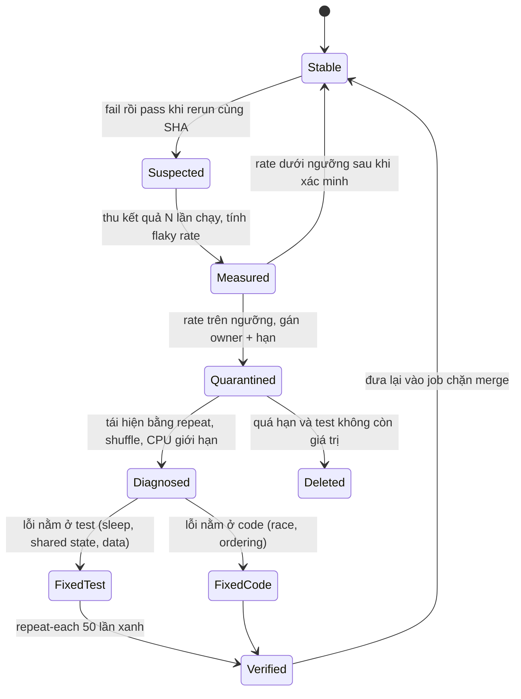
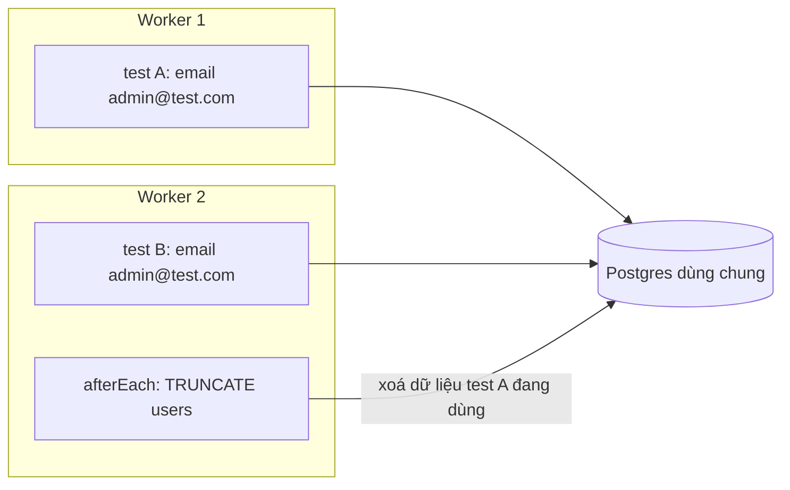

## Bối cảnh & vấn đề

Pipeline của một team 12 người có tỉ lệ fail 15%, và 9 trên 10 lần fail biến mất khi bấm re-run. Developer học phản xạ "đỏ thì chạy lại". Trung bình mỗi PR mất thêm 18 phút chờ CI, và không ai còn tin màu đỏ. Một tháng sau, một test về thanh toán đỏ vì **race condition thật** trong code: hai request cùng idempotency key tạo hai charge. Nó cũng bị re-run tới khi xanh, và bug lên production.

Khi điều tra, team tìm thấy đủ loại nguyên nhân: một test chờ `setTimeout(500)` cho debounce; một cache `Map` ở module scope làm test "404 cho sản phẩm 999" fail khi chạy chung với test tạo sản phẩm 999; hai worker cùng `TRUNCATE` bảng của nhau; một test dùng email cố định `admin@test.com` va unique constraint khi chạy song song; một report service query qua connection khác nên không thấy dữ liệu seed trong transaction của test.

Không có cái nào là "CI chậm". Tất cả là **thiếu cô lập** hoặc **phụ thuộc vào thứ không xác định**. Bài này định nghĩa flaky test, các cách cô lập dữ liệu (rollback, truncate, DB-per-worker), cách viết test data bằng factory, thiết kế cho chạy song song, và một quy trình đo → quarantine → fix để đưa CI từ 15% về gần 0. Output trong bài chạy thật với Vitest 5.0.3 và Postgres 18.

## Khái niệm

### Flaky test

**Flaky test** là test cho kết quả khác nhau (lúc pass, lúc fail) với **cùng code và cùng config**. Định nghĩa này quan trọng: test fail vì code đổi là test làm đúng việc; flaky là khi kết quả phụ thuộc vào thứ **ngoài code**: thời điểm, thứ tự, tốc độ máy, dữ liệu còn sót, mạng.

Các nhóm nguyên nhân hay gặp, theo thứ tự tần suất trong thực tế:

- **Timing/async**: `sleep` cố định, không `await` Promise, assertion chạy trước khi UI/consumer xong, animation.
- **Shared state**: DB không reset, cache/biến module, mock không clear, file tạm, env var.
- **Thứ tự**: test B chỉ pass nếu test A chạy trước (hoặc không chạy trước).
- **Thời gian thật**: nửa đêm, cuối tháng, DST (xem [bài fake timers](/tracks/testing/learn/jest-vitest-time-snapshots)).
- **Không xác định**: random không seed, UUID, `SELECT` không `ORDER BY`, thứ tự key, Promise.all hoàn thành theo thứ tự khác.
- **Bên ngoài**: network thật, service sandbox chậm, port cố định đã bị chiếm.
- **Tài nguyên**: CI có 2 CPU thay vì 10, timeout vừa khít ở local.

**Interview angle:** `testing-007` chấm ở chỗ bạn nêu được **cơ chế** của từng nguyên nhân và hậu quả lớn nhất: flaky làm team mất niềm tin vào màu đỏ, và bug thật lọt qua nhờ re-run.

### Isolation: ba cách dọn dữ liệu

**Transaction rollback**: mỗi test mở `BEGIN` trên một connection, code dưới test dùng **chính connection đó**, cuối test `ROLLBACK`. Rất nhanh (không ghi gì xuống đĩa thật sự), nhưng chỉ đúng khi mọi thao tác đi qua cùng connection và code không tự `COMMIT`. Code dùng pool riêng, mở transaction riêng, chạy job nền hoặc gọi service khác sẽ không thấy dữ liệu seed.

**Truncate**: sau (hoặc trước) mỗi test chạy `TRUNCATE t1, t2 ... RESTART IDENTITY CASCADE`. Chậm hơn rollback một chút (vài ms với ít bảng), nhưng hoạt động với mọi kiểu code: nhiều connection, commit thật, consumer nền. Nhược điểm: truncate toàn cục **xoá dữ liệu của worker khác** nếu các worker dùng chung DB.

**DB (hoặc schema) per worker**: mỗi worker có database riêng `test_1`, `test_2`, tạo nhanh bằng `CREATE DATABASE test_N TEMPLATE app_template` từ một template đã migrate. Kết hợp với truncate hoặc rollback **bên trong** DB của mình. Đây là nền tảng cho chạy song song an toàn.

### Test data: factory và builder

**Factory** (hay builder) là hàm tạo dữ liệu test với **default hợp lý** và chỉ override field có ý nghĩa với test: `await createOrder({ status: "paid" })`. Lợi ích: test đọc ra ý đồ ("đơn đã thanh toán") thay vì 30 dòng insert; thêm cột `NOT NULL` mới chỉ phải sửa factory, không sửa 200 test; giá trị duy nhất (`email: \`u-${seq()}@test.local\``) tránh va chạm khi song song. Ngược lại là **shared fixture**: một file seed khổng lồ mọi test dùng chung, đổi một field là 50 test vỡ, và không ai biết test nào phụ thuộc vào dòng nào.

### Order dependence và shuffle

Một test **phụ thuộc thứ tự** khi nó đọc state do test khác để lại. Kỹ thuật phát hiện là **shuffle**: chạy test theo thứ tự ngẫu nhiên có **seed** (`--sequence.shuffle --sequence.seed=N` ở Vitest, `--randomize --seed=N` ở Jest, verify cờ theo version). Seed được in ra, nên khi một thứ tự làm test fail, bạn tái hiện chính xác thứ tự đó.

### Quarantine

**Quarantine** là chuyển test flaky ra khỏi đường chặn merge (job riêng không bắt buộc, hoặc tag `@flaky` bị skip trong job chính) **có owner và hạn fix**. Mục đích là trả lại tín hiệu tin cậy cho pipeline chính trong lúc sửa. Quarantine không có owner và hạn là nghĩa địa: test nằm đó mãi và phần code nó bảo vệ mất lưới an toàn.

**Interview angle:** `testing-025` muốn nghe **quy trình** chứ không phải mẹo: đo flaky rate theo từng test, quarantine có kỷ luật, fix theo nhóm nguyên nhân, phòng ngừa trong pipeline, và cảnh giác rằng flaky có thể là bug thật.

## Cơ chế hoạt động

### Vòng đời của một flaky test



Sơ đồ đặt hai điều kỷ luật vào quy trình. Thứ nhất, **dữ liệu trước, ý kiến sau**: một test chỉ được gọi là flaky khi cùng commit SHA cho kết quả khác nhau, và quyết định quarantine dựa trên tỉ lệ đo được (JUnit XML từ mỗi lần chạy CI, gom vào một bảng, tính `fail_on_same_sha / runs` cho từng test). Thứ hai, nhánh **Diagnosed → FixedCode** là có thật: một test về idempotency đỏ 1/30 lần có thể đang báo một race trong production. Phân biệt bằng cách tái hiện: nếu fail khi chạy riêng với `--repeat-each`/vòng lặp và CPU bị giới hạn, và log cho thấy hai request cùng vượt qua kiểm tra trước khi một bên ghi, đó là bug code.

### Song song: chỗ nào va chạm



Hai worker dùng chung một DB gặp hai lỗi kinh điển: **va unique** (cùng email cố định) và **reset toàn cục** (truncate của worker 2 xoá dữ liệu test A đang đọc). Thiết kế cho song song gỡ cả hai: database riêng theo `VITEST_POOL_ID`/`JEST_WORKER_ID`, giá trị duy nhất từ factory, port 0, topic/queue có hậu tố run id.

## Ví dụ thực tế

### Order dependence: cache module-level (câu testing-023)

```ts
const cache = new Map<string, string>(); // module-level, shared by every test in this file
describe("products", () => {
  it("creates product 999 and caches it", () => { cache.set("product:999", "Tmp"); expect(cache.has("product:999")).toBe(true); });
  it("returns 404 for unknown product 999", () => { expect(cache.get("product:999") ?? 404).toBe(404); });
});
```

```text
== default order
      Tests  1 failed | 1 passed (2)
== shuffle seed 1
     × returns 404 for unknown product 999 8ms
      Tests  1 failed | 1 passed (2)
== shuffle seed 2
     × returns 404 for unknown product 999 3ms
      Tests  1 failed | 1 passed (2)
== shuffle seed 3
      Tests  2 passed (2)
== shuffle seed 4
     × returns 404 for unknown product 999 3ms
      Tests  1 failed | 1 passed (2)
```

Test "404" chạy riêng (`-t "404"`) luôn xanh; chạy chung thì kết quả phụ thuộc thứ tự. Seed 3 đặt test 404 lên trước nên cả hai xanh: nếu thứ tự mặc định của suite tình cờ như seed 3, bug ẩn cho tới ngày ai đó thêm một file hay đổi tên test. Shuffle biến lỗi ẩn đó thành lỗi **tái hiện được**: in seed, chạy lại đúng seed. Trong testing-023 thật, state là cache module-level của app **cộng** dòng trong DB; fix là reset cả hai trong `beforeEach`, tạo app qua factory `createApp({ cache: new Map() })` để mỗi test có instance riêng, và dùng ID duy nhất thay vì 999.

### Rollback isolation vỡ khi code dùng connection khác

```ts
let tx: pg.PoolClient;
beforeEach(async () => { tx = await pool.connect(); await tx.query("BEGIN"); });
afterEach(async () => { await tx.query("ROLLBACK"); tx.release(); });

it("code uses the test's transaction: sees the seed", async () => {
  await tx.query("INSERT INTO orders_l05 (total) VALUES (100)");
  expect(await countOrders(tx)).toBe(1);
});
it("code uses its own pool connection: seed is invisible", async () => {
  await tx.query("INSERT INTO orders_l05 (total) VALUES (100)");
  expect(await countOrders(pool)).toBe(1); // a report service that queries via the global pool
});
```

```text
   × code uses its own pool connection: seed is invisible 16ms
AssertionError: expected +0 to be 1 // Object.is equality
      Tests  1 failed | 1 passed (2)
```

Đây là câu trả lời cho follow-up của `testing-010`: rollback isolation vỡ khi code dưới test **không dùng chung connection** với test. Dữ liệu insert trong transaction chưa commit thì connection khác không thấy (Read Committed). Các dạng hay gặp: service lấy connection từ pool global thay vì nhận qua DI; code tự mở transaction (`BEGIN ... COMMIT`) nên commit thật hoặc lồng transaction lỗi; job nền/consumer chạy trên connection khác; code gọi sang service khác qua HTTP. Cách sửa: inject connection/transaction vào repository (pattern "unit of work"), hoặc đổi sang truncate cho nhóm test đó.

### Factory và DB per worker

```ts
// test/factories.ts (minh hoạ, rút gọn)
let n = 0;
const uniq = () => `${process.env.VITEST_POOL_ID ?? "0"}-${Date.now().toString(36)}-${++n}`;

export async function createTenant(db: Db, over: Partial<Tenant> = {}) {
  return db.insert("tenants", { slug: `t-${uniq()}`, plan: "pro", ...over });
}
export async function createOrder(db: Db, over: Partial<Order> & { tenantId: string }) {
  return db.insert("orders", { status: "pending", totalCents: 4_950, currency: "VND", ...over });
}

// test/setup-db.ts (minh hoạ): mỗi worker một database tạo từ template đã migrate
const id = process.env.VITEST_POOL_ID ?? process.env.JEST_WORKER_ID ?? "1";
await admin.query(`DROP DATABASE IF EXISTS test_${id}`);
await admin.query(`CREATE DATABASE test_${id} TEMPLATE app_template`);
process.env.DATABASE_URL = `${base}/test_${id}`;
```

Test đọc như câu chuyện: `const t = await createTenant(db); await createOrder(db, { tenantId: t.id, status: "paid" })`. Không có ID cố định, không có email cố định. `CREATE DATABASE ... TEMPLATE` copy file của template nên nhanh hơn chạy lại toàn bộ migration (với schema vừa phải thường dưới một giây, verify trên schema của bạn), và template không được có connection nào đang mở lúc copy.

### Đo flaky rate (minh hoạ)

```sql
-- bảng test_runs được nạp từ JUnit XML của mỗi job CI
SELECT test_id,
       count(*)                                         AS runs,
       count(*) FILTER (WHERE status = 'failed')        AS fails,
       count(DISTINCT sha) FILTER (WHERE flaky_on_sha)  AS shas_with_pass_and_fail
FROM test_runs
WHERE started_at > now() - interval '14 days'
GROUP BY test_id
HAVING count(DISTINCT sha) FILTER (WHERE flaky_on_sha) > 0
ORDER BY shas_with_pass_and_fail DESC
LIMIT 20;
```

`flaky_on_sha` là cờ "cùng SHA vừa có pass vừa có fail". Top 20 dòng này thường giải thích phần lớn tỉ lệ fail, vì flaky tuân theo phân phối đuôi dài: vài test gây phần lớn sự cố.

## Trade-offs & lựa chọn thay thế

| Cách cô lập | Tốc độ | Hoạt động với commit/nhiều connection | Song song | Hợp khi |
|---|---|---|---|---|
| Transaction rollback | Nhanh nhất | Không | Có, nếu mỗi test một connection | Repository, service nhận connection qua DI |
| Truncate giữa test | Nhanh (ms) | Có | Chỉ khi DB riêng mỗi worker | API test qua Supertest, consumer, job |
| DB per worker (template) | Setup ~1 s/worker | Có | Có | Suite lớn chạy nhiều worker |
| Tạo lại container mỗi file | Chậm (giây) | Có | Có | Gần như không bao giờ |
| ID duy nhất, không dọn | Nhanh | Có | Có | E2E trên môi trường dùng chung, dọn theo prefix |

**Khi nào chọn cái nào.** Mặc định cho backend: DB per worker + truncate trong `beforeEach`, vì đơn giản và đúng với mọi kiểu code. Dùng rollback khi codebase đã có unit-of-work/DI connection và muốn mỗi test dưới 1 ms. Với e2e trên staging dùng chung, không thể truncate: mỗi test tạo dữ liệu riêng (tenant riêng, email riêng) qua API và dọn theo prefix bằng job định kỳ.

| Phản ứng với flaky | Ưu | Nhược |
|---|---|---|
| Retry tự động (Playwright `retries: 2`) | CI xanh ngay | Che race thật nếu không báo cáo |
| Retry + báo "flaky" | Có dữ liệu, không chặn | Cần ai đó đọc báo cáo |
| Quarantine có owner + hạn | Pipeline chính đáng tin | Mất lưới an toàn tạm thời |
| Xoá test | Dứt điểm | Mất coverage nếu test có giá trị |
| Fix gốc | Đúng | Tốn thời gian, cần tái hiện được |

## Edge cases & failure modes

- **Sequence/identity**: truncate không `RESTART IDENTITY` thì ID tăng dần qua các test; test assert `id: 1` chỉ pass khi chạy đầu tiên.
- **Template đang bận**: `CREATE DATABASE ... TEMPLATE` fail với "source database is being accessed by other users" nếu globalSetup còn giữ connection vào template.
- **Truncate và FK**: thiếu `CASCADE` hoặc thiếu bảng con thì lỗi FK; thứ tự truncate từng bảng gây deadlock nếu worker khác cũng truncate (một lý do nữa cho DB per worker).
- **Mock state**: `vi.fn()` module-level không clear (Jest mặc định không clear) là shared state y như cache.
- **Timeout khít**: test 4,8 s với timeout 5 s pass ở local, fail trên CI 2 CPU. Đo phân phối thời gian, không chỉ giá trị trung bình.
- **Song song quá mức**: số worker lớn hơn số CPU hoặc vượt `max_connections` của Postgres (mặc định 100) gây timeout ngẫu nhiên; giới hạn worker và pool size mỗi worker.
- **Shuffle chỉ trong file**: shuffle thứ tự file và thứ tự test là hai cấu hình khác nhau ở một số runner; state rò qua **worker** (cùng process chạy nhiều file khi `isolate: false`) cần cả hai.
- **Flaky do code thật**: race trong idempotency, đọc-rồi-ghi không có lock. Retry che nó; chỉ tái hiện + log mới lộ.

## Pitfalls

- ❌ "Fail thì re-run" là văn hoá → ✅ re-run tự động có báo cáo, test flaky vào quarantine có owner và hạn.
- ❌ `sleep(500)` chờ UI/consumer → ✅ chờ theo điều kiện (`findBy*`, `expect.poll`, `waitFor` có timeout).
- ❌ Email/ID cố định trong test → ✅ factory sinh giá trị duy nhất theo worker và sequence.
- ❌ Seed file khổng lồ dùng chung → ✅ mỗi test tự tạo đúng dữ liệu nó cần.
- ❌ Truncate toàn cục trên DB chung cho mọi worker → ✅ DB per worker từ template.
- ❌ Rollback isolation cho code có pool/transaction riêng → ✅ inject connection hoặc dùng truncate.
- ❌ Assert vào cache nội bộ (`cache.has(...)`) → ✅ assert hành vi quan sát được (response, số query nếu thật sự cần).
- ❌ Tăng timeout để "fix" flaky → ✅ tìm điều kiện đang thực sự chờ; timeout lớn chỉ làm suite chậm hơn khi fail.

## Tóm tắt

- Flaky là cùng code khác kết quả; nguyên nhân chính: timing, shared state, thứ tự, thời gian, không xác định, bên ngoài, tài nguyên.
- Rollback nhanh nhưng vỡ khi code dùng connection khác hoặc tự commit; truncate đúng với mọi code; DB per worker cho song song.
- Factory với default hợp lý và giá trị duy nhất thay cho shared fixture.
- Shuffle có seed biến lỗi thứ tự ẩn thành lỗi tái hiện được.
- Song song an toàn cần DB riêng mỗi worker, ID duy nhất, port 0, topic có hậu tố run id.
- Quy trình flaky: đo theo SHA → quarantine có owner + hạn → fix gốc → verify bằng repeat → đưa lại pipeline.
- Flaky đôi khi là race condition thật; retry không báo cáo là che bug.
