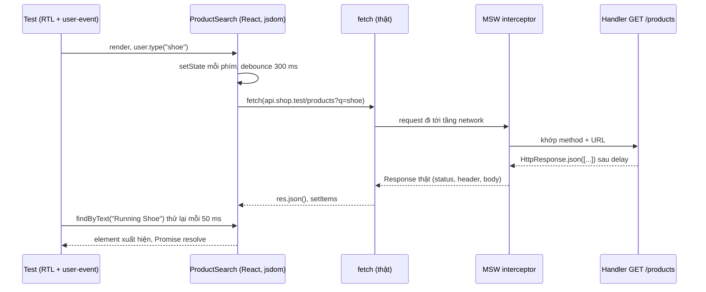

## Bối cảnh & vấn đề

Component `ProductSearch` có ô tìm kiếm, debounce 300 ms rồi gọi API. Test của nó trông như sau:

```tsx
it("shows search results", async () => {
  render(<ProductSearch />);
  fireEvent.change(screen.getByRole("searchbox"), { target: { value: "shoe" } });
  await new Promise((r) => setTimeout(r, 500)); // wait for debounce + fetch
  expect(screen.getByText("Running Shoe")).toBeInTheDocument();
});
```

Test fail khoảng 1/10 lần trên CI. Ngân sách 500 ms phải chứa 300 ms debounce **cộng** thời gian fetch; ở local fetch tới mock mất 20 ms nên dư, trên CI chia sẻ CPU thì không. Khi tăng lên 2.000 ms thì hết flaky nhưng suite chậm thêm, và vẫn chỉ là "đủ trong đa số trường hợp". Ngoài ra `fetch` được mock bằng `vi.spyOn(global, "fetch")` trả object tự chế, nên khi backend đổi `name` thành `title` thì test vẫn xanh.

Ở một dự án khác, test RTL đổi sang Vitest và bỗng nhiên lỗi `Found multiple elements with the role "searchbox"`: component của test trước **không được unmount**. Cả hai vấn đề có chung gốc: không hiểu Testing Library chờ đợi và dọn dẹp như thế nào, và mock network ở sai tầng. Bài này đi qua nguyên tắc của React Testing Library (RTL), thứ tự query, `user-event`, cách chờ đúng, cảnh báo `act`, MSW so với nock và DI, và cách test Next.js App Router. Output chạy thật với Vitest 5.0.3, React 19.3, RTL 16.3, user-event 14.6, MSW 3.0 và jsdom.

## Khái niệm

### Nguyên tắc dẫn đường của RTL

Testing Library được xây quanh một câu: *"The more your tests resemble the way your software is used, the more confidence they can give you."* Người dùng không thấy state, props, hay tên hàm handler; họ thấy **text, label, nút, vai trò** (role) và họ **gõ, click, tab**. Vì vậy RTL không cho API đọc state component; nó render vào DOM thật (jsdom) và cho bạn tìm element theo cách người dùng (và công nghệ hỗ trợ như screen reader) tìm.

Hệ quả thực tế: test không vỡ khi bạn đổi `useState` sang `useReducer`, tách component con, hay đổi tên class CSS, vì không cái nào trong số đó thay đổi thứ người dùng thấy. Test chỉ vỡ khi **hành vi** đổi. Đó là định nghĩa của test bền với refactor.

### Thứ tự ưu tiên query

RTL khuyến nghị query theo thứ tự:

1. `getByRole(role, { name })`: nút, link, textbox, searchbox, heading, alert... theo accessibility tree. Đây là query mặc định.
2. `getByLabelText`: input của form qua `<label>`.
3. `getByPlaceholderText`: khi không có label (dấu hiệu UI kém a11y).
4. `getByText`: nội dung không tương tác (đoạn văn, item list).
5. `getByDisplayValue`: giá trị hiện tại của input/select.
6. `getByAltText`, `getByTitle`.
7. `getByTestId`: lối thoát cuối cùng khi không có cách ngữ nghĩa nào.

`getByRole` đồng thời là **kiểm tra accessibility**: nếu `<div onClick>` giả làm nút thì `getByRole("button", { name: /sign in/i })` không tìm thấy, và test chỉ cho bạn thấy screen reader cũng không thấy nút đó.

### getBy, queryBy, findBy

Ba biến thể khác nhau ở cách xử lý "không có": **`getBy*`** ném lỗi ngay nếu không tìm thấy (hoặc tìm thấy nhiều hơn một); **`queryBy*`** trả `null`, dùng duy nhất để assert **không tồn tại** (`expect(screen.queryByRole("alert")).toBeNull()`); **`findBy*`** trả Promise và **thử lại** (mặc định mỗi 50 ms, tối đa 1.000 ms, verify) cho tới khi tìm thấy hoặc timeout. Bản `*AllBy*` trả mảng.

### user-event và fireEvent

**`fireEvent.change(input, { target: { value } })`** phát **một** DOM event tổng hợp. **`user-event`** mô phỏng chuỗi tương tác của người thật: `user.type` gửi `keydown`, `keypress`, `input`, `keyup` cho từng ký tự, focus vào input trước, tôn trọng `disabled` và `maxLength`; `user.click` đi kèm `pointerdown`, `mousedown`, `focus`, `pointerup`, `mouseup`, `click`. Từ v14, API là `const user = userEvent.setup()` rồi `await user.type(...)`. Bug chỉ xuất hiện khi gõ từng phím (debounce, autocomplete, validate on blur) chỉ hiện ra với user-event.

### act và cảnh báo "not wrapped in act"

React gom các cập nhật state và commit chúng vào DOM theo lịch của nó. **`act()`** bảo React "chạy hết mọi cập nhật và effect đang chờ trước khi tôi assert". RTL đã bọc `render`, `fireEvent`, user-event và các hàm async util trong `act` cho bạn. Cảnh báo *"An update to X inside a test was not wrapped in act(...)"* nghĩa là có một cập nhật state xảy ra **sau** khi test đã ngừng chờ: thường là fetch resolve sau khi test kết thúc, hoặc timer bắn muộn. Đó là triệu chứng của test **không chờ đúng thứ**, và cách sửa đúng là chờ kết quả cuối cùng (`await findBy...`), không phải bọc mọi thứ trong `act` cho im.

### MSW

**MSW** (Mock Service Worker) chặn request ở **tầng network**: trong browser bằng Service Worker, trong Node bằng interceptor của `http`/`https`/`fetch` (`setupServer` từ `msw/node`). Bạn khai báo **handler** theo method + URL (`http.get("https://api.shop.test/products", resolver)`), và code của bạn dùng `fetch`/axios thật, đi qua serialization thật, đọc header thật. Cùng một bộ handler dùng được cho test Node, test RTL, Storybook và môi trường dev. `onUnhandledRequest: "error"` làm test fail khi có request không ai khai báo, rất hữu ích để bắt gọi network ngoài ý muốn.

**Interview angle:** `testing-005` follow-up "vì sao `getByRole` cũng là a11y check?" — vì nó đọc accessibility tree; nếu không query được bằng role và name thì người dùng screen reader cũng không tìm được element đó.

## Cơ chế hoạt động



Hai vòng chờ chạy song song trong sơ đồ. Component có lịch riêng của nó (debounce, fetch, setState), còn test **thăm dò** DOM bằng `findByText` cho tới khi điều kiện đúng hoặc hết timeout. Test không cần biết lịch của component mất bao lâu; nó chỉ cần biết **điều kiện kết thúc**. Đó là lý do `findBy` hết flaky còn `sleep(500)` thì không: sleep đoán thời gian, findBy chờ điều kiện.

MSW nằm **sau** `fetch`, nên mọi thứ code của bạn làm với request (dựng URL, encode query, header auth) và response (`res.ok`, `res.json()`) đều chạy thật. So với `vi.spyOn(global, "fetch").mockResolvedValue({ json: async () => [...] })`, object tự chế đó thiếu `ok`, `status`, `headers`, và chỉ đúng tới mức người viết nhớ.

Cuối cùng là **cleanup**: RTL tự `unmount` sau mỗi test bằng cách đăng ký `afterEach` **global** nếu thấy nó tồn tại. Jest có global `afterEach`; Vitest với `globals: false` (mặc định) thì không, nên component tích tụ qua các test trong cùng file trừ khi bạn gọi `cleanup()` tường minh hoặc bật globals.

## Ví dụ thực tế

Component thật (rút gọn):

```tsx
export function ProductSearch() {
  const [q, setQ] = useState(""); const [items, setItems] = useState<{ id: string; name: string }[]>([]);
  const [error, setError] = useState(false);
  useEffect(() => {
    if (!q) return;
    const t = setTimeout(async () => {
      try {
        const res = await fetch(`https://api.shop.test/products?q=${encodeURIComponent(q)}`);
        if (!res.ok) throw new Error(String(res.status));
        setItems(await res.json()); setError(false);
      } catch { setError(true); }
    }, 300);
    return () => clearTimeout(t);
  }, [q]);
  return (<div>
    <label>Search products <input type="search" value={q} onChange={(e) => setQ(e.target.value)} /></label>
    {error && <p role="alert">Could not load products</p>}
    <ul aria-label="results">{items.map((p) => <li key={p.id}>{p.name}</li>)}</ul>
  </div>);
}
```

Test với MSW, handler cố ý chậm 400 ms để mô phỏng CI:

```tsx
const server = setupServer(
  http.get("https://api.shop.test/products", async ({ request }) => {
    const q = new URL(request.url).searchParams.get("q");
    await delay(400);
    return HttpResponse.json(q === "shoe" ? [{ id: "p1", name: "Running Shoe" }] : []);
  }),
);
beforeAll(() => server.listen({ onUnhandledRequest: "error" }));
afterEach(() => { cleanup(); server.resetHandlers(); });
afterAll(() => server.close());

it("FLAKY: fixed sleep", async () => {
  const user = userEvent.setup();
  render(<ProductSearch />);
  await user.type(screen.getByRole("searchbox", { name: /search products/i }), "shoe");
  await new Promise((r) => setTimeout(r, 500));
  expect(screen.getByText("Running Shoe")).toBeTruthy();
});
it("findBy waits for the condition", async () => {
  const user = userEvent.setup();
  render(<ProductSearch />);
  await user.type(screen.getByRole("searchbox", { name: /search products/i }), "shoe");
  expect(await screen.findByText("Running Shoe")).toBeTruthy();
});
it("shows an alert when the API fails", async () => {
  server.use(http.get("https://api.shop.test/products", () => new HttpResponse(null, { status: 500 })));
  const user = userEvent.setup();
  render(<ProductSearch />);
  await user.type(screen.getByRole("searchbox"), "shoe");
  expect(await screen.findByRole("alert")).toHaveProperty("textContent", "Could not load products");
});
```

Lần chạy đầu, **chưa có** `cleanup()` trong `afterEach`:

```text
   × FLAKY: fixed sleep 613ms
   × findBy waits for the condition 9ms
   × shows an alert when the API fails 7ms
TestingLibraryElementError: Unable to find an element with the text: Running Shoe. ...
TestingLibraryElementError: Found multiple elements with the role "searchbox" and name `/search products/i`
TestingLibraryElementError: Found multiple elements with the role "searchbox"
```

Sau khi thêm `cleanup()`:

```text
 × search.test.tsx > FLAKY: fixed sleep 664ms
 ✓ search.test.tsx > findBy waits for the condition 729ms
 ✓ search.test.tsx > shows an alert when the API fails 343ms
TestingLibraryElementError: Unable to find an element with the text: Running Shoe.
```

Ba bài học từ output. Một: test sleep 500 ms fail **mỗi lần** khi debounce + network vượt 500 ms; ở local nhanh nó pass, nên trên thực tế bạn thấy "1/10 lần". Hai: `findByText` pass sau 729 ms mà không ai phải đoán con số đó; nếu ngày mai API chậm hơn, nó vẫn pass miễn dưới timeout của `findBy` (mặc định 1.000 ms; tăng bằng `findByText(x, {}, { timeout: 3000 })` khi có lý do). Ba: lỗi "multiple elements" là cleanup thiếu khi chạy Vitest không globals, một gotcha khi migrate từ Jest. Test thứ ba cho thấy MSW làm đường **lỗi** rẻ tới mức không có lý do để bỏ qua: `server.use` ghi đè handler cho đúng một test, `resetHandlers` trả lại mặc định.

Phương án fake timers cho debounce (khi muốn test chạy dưới 50 ms): `vi.useFakeTimers({ shouldAdvanceTime: true })` cùng `userEvent.setup({ advanceTimers: vi.advanceTimersByTime })`, rồi vẫn chờ bằng `findBy`. Fake timers giết thời gian chờ debounce, còn `findBy` chờ điều kiện; đừng dùng fake timers để thay cho việc chờ fetch.

### Next.js App Router (câu testing-021)

Docs Next.js nói rõ: *"Since async Server Components are new to the React ecosystem, Vitest currently does not support them... we recommend using E2E tests for async components"* (verify theo version Next). Chiến lược thực tế theo loại code:

- **Client Components** (`"use client"`): RTL + Vitest như React thường, network qua MSW.
- **Server Component đồng bộ**: render được bằng RTL nếu không phụ thuộc request context.
- **Async Server Component**: tách phần lấy dữ liệu ra hàm thuần (`getProductsForTenant(tenantId)`) và test hàm đó bằng integration test với DB thật; phần render được phủ bằng Playwright e2e.
- **Route handlers và Server Actions**: giữ mỏng (parse input bằng zod, gọi service, trả response); test service trực tiếp. Có thể gọi trực tiếp hàm `POST(request)` của route handler với một `Request` thật trong unit test.
- **E2E** chạy trên `next build && next start`, không phải `next dev`: dev mode không có caching và bundling như production, compile theo yêu cầu (request đầu chậm), và hành vi cache/prerender khác. Test pass trên dev có thể fail trên start vì dữ liệu bị cache tĩnh ở build time, hoặc ngược lại.

## Trade-offs & lựa chọn thay thế

| Cách mock HTTP | Tầng chặn | Ưu | Nhược | Hợp khi |
|---|---|---|---|---|
| MSW | Network (SW trong browser, interceptor trong Node) | Code dùng client thật; handler dùng chung test/dev/Storybook; hỗ trợ `fetch` native | Thêm một thư viện; handler phải giữ khớp API thật | Frontend và Node service gọi API ngoài |
| nock | Module `http` của Node | Lâu đời, mạnh cho Node `http` | Hỗ trợ `fetch` native (undici) phụ thuộc version (verify); Node-only | Codebase Node cũ dùng `http`/axios |
| DI (truyền `PaymentClient`) | Interface trong code | Rõ ràng nhất, type-safe, không phụ thuộc thư viện chặn | Không test serialization, header, retry của client thật | Logic nghiệp vụ, service layer |
| `vi.spyOn(fetch)` | Hàm global | Không cần gì thêm | Object response tự chế, dễ thiếu `ok`/`status` | Tránh, trừ test rất nhỏ |

**Khi nào chọn cái nào.** Trong UI test: MSW, vì component nên dùng code fetch thật. Trong service Node: DI cho logic nghiệp vụ (fake client có thể lập trình lỗi), MSW cho lớp client HTTP mỏng để test retry, timeout, header. Dù chọn gì, mock chỉ đúng với hiểu biết **lúc viết**: follow-up "mock nói `status`, production trả `state`" được bắt bằng **contract test** hoặc ít nhất validate response bằng schema (zod) ở ranh giới, để lỗi lộ ra ngay khi chạy với API thật ([bài contract testing](/tracks/testing/learn/contract-testing-pact)).

| Cách chờ | Flaky | Tốc độ | Ghi chú |
|---|---|---|---|
| `sleep(n)` | Cao | Luôn chậm `n` ms | Đoán thời gian |
| `await findBy*` | Thấp | Nhanh nhất có thể | Mặc định cho "chờ xuất hiện" |
| `waitFor(() => expect(...))` | Thấp | Nhanh | Cho assertion không phải "tìm element" |
| `waitForElementToBeRemoved` | Thấp | Nhanh | Chờ spinner biến mất |
| Fake timers + findBy | Thấp | Rất nhanh | Khi debounce/poll dài |

## Edge cases & failure modes

- **Cleanup không chạy**: Vitest `globals: false` thì RTL không tự đăng ký `afterEach(cleanup)`; component tích tụ, lỗi "multiple elements". Gọi `cleanup()` hoặc bật globals, hoặc import setup có sẵn.
- **`findBy` hết timeout**: 1.000 ms mặc định có thể không đủ trên CI chậm cho chuỗi debounce + network giả lập chậm; tăng timeout có chủ đích hoặc giảm delay giả.
- **Side effect sau khi test kết thúc**: fetch resolve sau test, gây cảnh báo `act` hoặc lỗi ở test **sau**. Luôn chờ trạng thái cuối, và hủy request khi unmount (`AbortController`).
- **`waitFor` với side effect bên trong**: callback được gọi lại nhiều lần; đặt `user.click` trong `waitFor` sẽ click nhiều lần. Chỉ đặt assertion trong `waitFor`.
- **Request không được khai báo**: không có `onUnhandledRequest: "error"`, request lạ đi ra network thật (hoặc fail im lặng).
- **Handler rò giữa test**: quên `resetHandlers()` thì handler 500 của test lỗi ảnh hưởng test sau.
- **jsdom không phải browser**: không có layout (kích thước luôn 0), không có `IntersectionObserver`, CSS không ảnh hưởng `visible`; những gì phụ thuộc layout cần Playwright hoặc Vitest browser mode.
- **Fake timers và user-event**: quên `advanceTimers` trong `userEvent.setup` khi đã fake timers thì `user.type` treo, vì user-event dùng `setTimeout` giữa các phím.

## Pitfalls

- ❌ `sleep(500)` chờ debounce + fetch → ✅ `await screen.findByText(...)`; fake timers nếu muốn bỏ thời gian debounce.
- ❌ `getByTestId` cho mọi thứ → ✅ `getByRole` với `name`; testid chỉ khi không có cách ngữ nghĩa.
- ❌ `fireEvent.change` cho ô nhập → ✅ `userEvent.setup()` + `await user.type`.
- ❌ Bọc mọi thứ trong `act` để tắt cảnh báo → ✅ tìm cập nhật state nào xảy ra sau khi test thôi chờ, và chờ nó.
- ❌ `expect(screen.getByText(x))` để assert không tồn tại → ✅ `expect(screen.queryByText(x)).toBeNull()`.
- ❌ Mock `fetch` bằng object tự chế → ✅ MSW với `HttpResponse`, kèm test đường lỗi (500, 429, timeout).
- ❌ Test state/props nội bộ của component → ✅ test thứ người dùng thấy và làm.
- ❌ Unit test async Server Component bằng Vitest → ✅ tách logic data ra hàm và test nó; e2e cho phần render.

## Tóm tắt

- RTL test thứ người dùng thấy và làm; test vỡ khi hành vi đổi, không vỡ khi refactor.
- Query: role → label → placeholder → text → display value → alt/title → testid; `getByRole` cũng là kiểm tra a11y.
- `getBy` ném lỗi, `queryBy` để assert không tồn tại, `findBy` thử lại tới timeout; chờ điều kiện, không đoán thời gian.
- `user-event` mô phỏng tương tác thật; cảnh báo `act` là triệu chứng của chờ sai thứ.
- MSW chặn ở tầng network nên code fetch thật chạy; đường lỗi rẻ với `server.use`.
- Vitest không globals thì phải `cleanup()` tường minh.
- Next.js: async Server Component test bằng e2e trên `next start`; logic data tách ra và test bằng integration.
