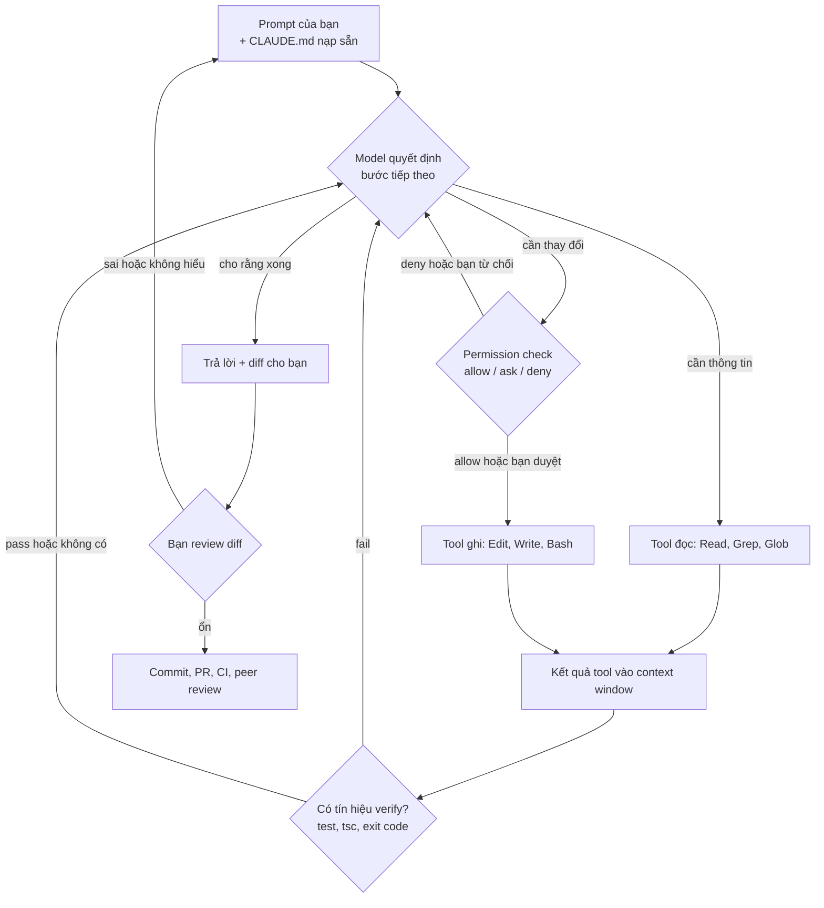
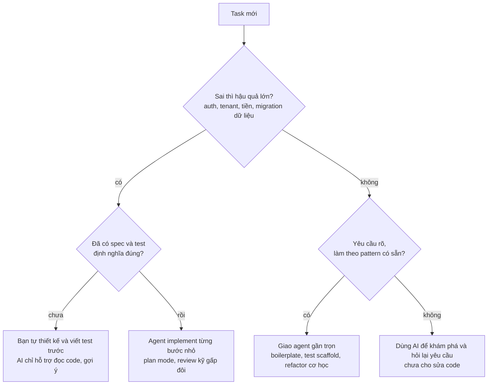

## Bối cảnh & vấn đề

Một backend developer nhận ticket nhỏ: "trang khuyến mãi cần hiển thị 3 sản phẩm rẻ nhất". Anh mở Claude Code, gõ một câu, và chưa tới một phút đã có một hàm gọn gàng kèm lời giải thích rất tự tin: *"`sort()` sắp xếp mảng tăng dần, nên `slice(0, 3)` lấy đúng 3 giá rẻ nhất."* Anh chạy thử với `[5, 3, 9, 1]`, ra `[1, 3, 5]`, đúng. PR được merge. Hai tuần sau, marketing báo trang khuyến mãi hiển thị sản phẩm **1.000.000đ** là "rẻ nhất" thay vì sản phẩm 25.000đ. Lý do: `Array.prototype.sort()` không có comparator sẽ so sánh theo **chuỗi**, nên `"1000000" < "25000"`.

Câu chuyện này không phải về một bug JavaScript. Nó về **mô hình tư duy sai**: developer coi AI như một senior đáng tin, coi lời giải thích trôi chảy là bằng chứng, và coi "chạy thử một lần thấy đúng" là verify. Cả ba đều sai. Lời giải thích của AI được sinh ra bởi cùng cơ chế sinh ra code; nếu code sai thì lời giải thích thường sai *một cách nhất quán* với code.

Mô hình thực tế hơn, cũng là mô hình mà interviewer muốn nghe: **AI là một junior pair cực nhanh, đọc rất nhiều, không biết mệt, nhưng tự tin sai và không chịu trách nhiệm**. Bạn giao việc cho nó như giao cho junior: task nhỏ, rõ tiêu chí "xong", có cách kiểm chứng, và **bạn đọc diff trước khi merge**. Người chịu trách nhiệm cho code trên `main` vẫn là bạn.

Bài này là nền cho cả track: phân biệt ba loại công cụ (autocomplete, chat, agent), hiểu **agentic loop** mà Claude Code chạy, map từng loại task sang mức độ giao cho AI, và hiểu vì sao hallucination, knowledge cutoff và sycophancy là thuộc tính cấu trúc chứ không phải lỗi hiếm gặp. Các bài sau ([context engineering](/tracks/ai-assisted-engineering/learn/context-engineering), [vòng lặp explore → plan → implement → verify](/tracks/ai-assisted-engineering/learn/core-loop)) xây trên mô hình này.

## Khái niệm

### Large language model và "đoán token tiếp theo"

**LLM (large language model)** là mô hình được huấn luyện để dự đoán token tiếp theo dựa trên các token trước đó. **Token** là mảnh văn bản nhỏ (một từ ngắn, một phần từ, một ký tự đặc biệt). Khi bạn hỏi "viết hàm lấy 3 giá rẻ nhất", model không "hiểu" JavaScript như trình thông dịch; nó sinh ra chuỗi token có xác suất cao nhất theo những gì nó đã thấy trong dữ liệu huấn luyện, được tinh chỉnh thêm để làm theo chỉ dẫn.

Hệ quả thực tế: model rất giỏi những gì **phổ biến và có pattern** (CRUD, mapping DTO, test scaffold, regex thông dụng), và yếu ở những gì **hiếm, mới, hoặc phụ thuộc vào sự thật bên ngoài** mà nó không thấy (hành vi đúng version của thư viện, dữ liệu thật trong database của bạn, quy tắc nghiệp vụ nội bộ). Pattern `arr.sort().slice(0, n)` xuất hiện rất nhiều trên Internet với mảng chuỗi, nên model tự tin dùng lại nó cho mảng số.

Ví dụ ngắn: hỏi "làm sao đọc JSON file trong Node" thì câu trả lời thường đúng vì phổ biến. Hỏi "option nào của thư viện X v3.2 để bật retry có jitter" thì model dễ bịa ra một option nghe rất hợp lý.

**Interview angle:** interviewer muốn thấy bạn giải thích *vì sao* model sai theo kiểu có hệ thống (dự đoán theo pattern) thay vì nói chung chung "AI đôi khi sai".

### Ba loại công cụ: autocomplete, chat, agent

**Inline autocomplete** (GitHub Copilot completion, Cursor Tab) gợi ý vài dòng ngay tại con trỏ, latency rất thấp. Context chủ yếu là file đang mở và vài file lân cận. Nó giữ bạn trong flow khi gõ code bạn đã biết mình muốn viết. Rủi ro lớn nhất là **accept theo phản xạ**: bấm Tab khi chưa đọc hết dòng.

**Chat trong IDE hoặc trình duyệt** là hỏi đáp: bạn chọn đoạn code, dán lỗi, hỏi "vì sao". Context do **bạn** chọn và dán vào, model trả lời bằng văn bản và code snippet, còn bạn tự áp dụng. Phù hợp để giải thích stack trace, sinh một function nhỏ, hỏi cách dùng API.

**Autonomous coding agent** (Claude Code, Cursor Agent, các agent tương tự) tự chạy một vòng lặp nhiều bước: đọc file, tìm kiếm codebase, sửa nhiều file, chạy lệnh shell (test, build, git), đọc kết quả và sửa tiếp. Context được agent **tự thu thập**, nên nó làm được task nhiều bước mà chat không làm được. Cái giá là bạn phải quản lý **permission** (agent được chạy lệnh gì), review một diff lớn hơn, và chấp nhận rằng agent có thể đi sai hướng khá xa trước khi bạn nhận ra.

Ví dụ phân loại: đổi tên biến trong một hàm → autocomplete hoặc tự gõ. "Stack trace này nghĩa là gì" → chat. "Thêm field `discount_code` vào order, cập nhật DTO, migration, validation và test" → agent, kèm plan trước.

**Interview angle:** câu hỏi so sánh ba loại công cụ đo xem bạn chọn công cụ theo **rủi ro và độ mơ hồ của task**, không theo sở thích; và bạn biết khi nào agent *chậm hơn* tự viết (task 5 dòng mà bạn đã biết chính xác cần viết gì).

### Agentic loop

**Agentic loop** là vòng lặp mà agent chạy cho tới khi task xong hoặc bị dừng: *thu thập context → hành động → kiểm tra kết quả → lặp lại*. Trong Claude Code, "hành động" là gọi **tool**: đọc file, tìm kiếm, sửa file, chạy lệnh Bash, gọi MCP server. Mỗi kết quả tool (nội dung file, output của `npm test`) được đưa ngược vào **context window**, và model quyết định bước tiếp theo dựa trên đó.

Vì sao thiết kế như vậy? Vì model không thể biết code chạy đúng hay không chỉ bằng cách "nghĩ". Nó cần **tín hiệu từ thế giới thật**: compiler báo lỗi, test fail, lệnh trả exit code khác 0. Đây là lý do tài liệu best practices của Claude Code nhấn mạnh việc **cho Claude một cách để tự verify** (test, build, screenshot): không có tín hiệu đó, vòng lặp chỉ là model tự thuyết phục chính nó.

Ví dụ: agent sửa hàm, chạy `npm test -- pricing`, thấy một test fail với `expected [9, 25], actual [100, 1000]`, đọc lại code, thêm comparator, chạy lại, xanh. Vòng lặp này chỉ tốt khi **test thật sự kiểm tra đúng điều quan trọng**; nếu test yếu, agent sẽ "xanh" rất nhanh với code sai.

**Interview angle:** nói được rằng chất lượng của agent bị chặn trên bởi chất lượng tín hiệu verify, và agent có thể "sửa test cho xanh" thay vì sửa code nếu bạn không ràng buộc.

### Junior pair: nhanh, rộng, tự tin sai

Mô hình "junior pair" gói ba đặc điểm. **Nhanh và rộng**: đọc 50 file trong vài giây, biết cú pháp của hàng chục ngôn ngữ, gõ boilerplate không mệt. **Thiếu context tổ chức**: không biết vì sao team chọn `zod` thay vì `joi`, không biết khách hàng lớn nhất có quy tắc giá riêng, không biết incident tháng trước. **Tự tin sai**: giọng văn không đổi dù câu trả lời đúng hay sai; không nói "tôi không chắc" trừ khi bị ép.

Cách đối xử hợp lý giống với một junior giỏi: giao task có phạm vi rõ, nói rõ ràng buộc, yêu cầu plan trước với việc lớn, và review mọi thứ trước khi merge. Khác với junior thật: AI **không học từ lần sửa trước** giữa các session trừ khi bạn ghi bài học vào file context (CLAUDE.md, xem [bài context engineering](/tracks/ai-assisted-engineering/learn/context-engineering)).

**Interview angle:** câu "code merge là của tôi, AI viết không phải lý do" là câu interviewer chờ nghe; kèm một ví dụ bạn bắt được lỗi của AI sẽ mạnh hơn nhiều.

### Hallucination và hallucinated API

**Hallucination** là khi model sinh ra nội dung sai sự thật nhưng trình bày như đúng. Trong code, dạng hay gặp nhất là **hallucinated API**: function, method, option, CLI flag hoặc package **không tồn tại**, hoặc tồn tại ở version khác với version dự án đang dùng. Ví dụ kinh điển: `fs.readJson()` có trong thư viện `fs-extra` nhưng **không** có trong `node:fs/promises`; model trộn hai API vì cả hai đều phổ biến.

Phòng thủ theo lớp. Lớp một là **type checker** (TypeScript `strict`): gọi method không tồn tại thì `tsc` báo lỗi ngay. Lớp hai là **test chạy thật** cho hành vi. Lớp ba là **docs đúng version** trong `package.json`/lockfile, hoặc đọc source trong `node_modules`. Lớp bốn, với package mới: kiểm tra trên registry trước khi cài (`npm view <pkg>`), vì kẻ tấn công có thể đăng ký trước tên package mà model hay bịa (**slopsquatting**, chi tiết ở [bài bảo mật](/tracks/ai-assisted-engineering/learn/security-permissions)).

Type checker **không** bắt được: option trong object config kiểu `Record<string, unknown>` hoặc string, tên biến môi trường, flag CLI trong script, SQL trong string, sai *hành vi* (API có thật nhưng làm khác điều AI mô tả), và code JavaScript không có type.

**Interview angle:** follow-up phổ biến là "type checker không bắt được loại hallucination nào?"; liệt kê được config string, CLI flag, behavior sai và SQL là câu trả lời tốt.

### Knowledge cutoff

**Knowledge cutoff** là mốc thời gian dữ liệu huấn luyện của model dừng lại. Thư viện ra major version sau mốc đó thì model không biết, hoặc chỉ biết qua vài bài blog beta. Ngược lại, nếu dự án của bạn pin một version **cũ**, model có thể gợi ý API của version mới hơn. Cả hai hướng đều tạo ra code "trông đúng".

Cách xử lý: nói rõ version trong prompt hoặc CLAUDE.md ("Next.js 15 App Router, Prisma 5"), chỉ agent đọc file type definition trong `node_modules`, hoặc cho nó tra docs chính thức (qua web fetch với domain được phép). Đừng hỏi model "version mới nhất của X là gì"; hãy chạy `npm view X version`.

**Interview angle:** interviewer có thể hỏi tình huống project pin major version cũ; câu trả lời là neo vào lockfile và docs đúng version, không tin trí nhớ của model.

### Sycophancy và vì sao lời giải thích không phải bằng chứng

**Sycophancy** là xu hướng model đồng ý với người dùng. Khi bạn hỏi "chắc chưa? tôi nghĩ chỗ này sai", model thường xin lỗi và "sửa", kể cả khi code ban đầu đúng. Khi bạn hỏi "code này đúng chứ?", model có xu hướng xác nhận. Lời giải thích đi kèm code được sinh ra bởi cùng cơ chế dự đoán, nên nó **nhất quán với code** chứ không nhất thiết **nhất quán với thực tế** (runtime, version, dữ liệu).

Bằng chứng thật chỉ đến từ bên ngoài model: test chạy, `tsc` exit 0, docs chính thức đúng version, source code của thư viện, `EXPLAIN ANALYZE` cho claim "query dùng index", benchmark cho claim "nhanh hơn", reproduce bug trước và sau fix. Nếu AI nói "query này sẽ dùng index", bạn chạy `EXPLAIN (ANALYZE, BUFFERS)` trên dữ liệu gần thật, không hỏi lại AI.

**Interview angle:** đây là câu hard: cần nói được cơ chế (cùng một quá trình sinh, sycophancy) và liệt kê loại bằng chứng độc lập.

### Ownership

**Ownership** nghĩa là bạn hiểu, bảo vệ được và chịu trách nhiệm cho mọi dòng code mình merge, bất kể ai (hay cái gì) gõ ra. Tiêu chuẩn thực dụng: nếu reviewer hỏi "vì sao dòng này như vậy?" mà câu trả lời duy nhất là "AI viết", thì PR chưa sẵn sàng.

Recap nhanh các khái niệm:

| Khái niệm | Một câu | Phòng thủ chính |
|---|---|---|
| Hallucinated API | API/flag/package không có thật hoặc sai version | `tsc --strict`, docs đúng version, `npm view` |
| Knowledge cutoff | Model không biết thứ ra đời sau mốc huấn luyện | Ghi version vào context, đọc type trong `node_modules` |
| Sycophancy | Model xuôi theo người hỏi | Hỏi bằng test, không hỏi bằng câu "đúng chứ?" |
| Agentic loop | Đọc → hành động → verify → lặp | Cho agent tín hiệu verify tốt |
| Ownership | Bạn chịu trách nhiệm cho code merge | Đọc diff, giải thích được từng thay đổi |

## Cơ chế hoạt động

### Agentic loop từng bước

Khi bạn gõ một yêu cầu vào Claude Code, chuyện xảy ra không phải là "model viết code một lần". Nó là một vòng lặp, mỗi vòng thêm thông tin vào context window:



Đọc sơ đồ từ trên xuống. Bước đầu, model nhận prompt của bạn cộng với context nạp sẵn (CLAUDE.md, xem bài sau). Nó tự quyết định cần **đọc** thêm (tìm file, grep call site) hay **hành động** (sửa file, chạy lệnh). Mọi hành động có tác dụng phụ đi qua **permission check**: rule `allow`, `ask`, `deny` trong settings, hoặc bạn bấm duyệt. Kết quả của tool (nội dung file, output test) được đưa vào context, và model lặp lại.

Điểm quan trọng nhất nằm ở nút "Có tín hiệu verify?". Nhánh "pass hoặc không có" dẫn về cùng một chỗ: nếu không có test nào chạy, model vẫn có thể kết luận "xong" dựa trên việc code *trông* đúng. Tức là agent **không phân biệt được** "đã kiểm chứng" với "chưa kiểm chứng" trừ khi bạn buộc nó chạy lệnh verify. Nút cuối "Bạn review diff" là chốt chặn mà không công cụ nào thay được.

### Map task sang mức độ giao cho AI

Không phải task nào cũng nên giao cùng một cách. Hai trục quyết định là **rủi ro khi sai** (tiền, quyền, dữ liệu, bảo mật) và **độ mơ hồ của yêu cầu** (đã có spec và test hay chưa):



Cách đọc: task rủi ro cao **và** chưa có định nghĩa đúng (ví dụ "đổi cách tính hoa hồng cho đại lý") thì bạn phải tự nghĩ và viết test trước; giao cho AI lúc này là để nó **đoán** nghiệp vụ. Task rủi ro thấp và rõ (thêm endpoint CRUD giống `AddressController`) là chỗ agent tỏa sáng. Ô "khám phá" là chỗ nhiều người bỏ qua: khi yêu cầu mơ hồ, dùng AI để **hỏi bạn** (liệt kê câu hỏi, edge case) thay vì để nó viết code.

Bảng tham chiếu theo loại task:

| Loại task | Mức giao | Vì sao |
|---|---|---|
| Boilerplate, DTO mapping, CRUD theo mẫu | Cao | Pattern phổ biến, sai dễ thấy, test dễ viết |
| Viết test cho code có sẵn | Cao, nhưng đọc assertion | AI hay viết test "đúng theo code" thay vì "đúng theo spec" |
| Tìm call site, giải thích module lạ | Cao | Chỉ đọc, không có tác dụng phụ; verify bằng cách mở file |
| Refactor cơ học (rename, đổi API cũ sang mới) | Cao, chia batch | Có thể verify bằng `tsc` và test |
| Script một lần, regex, SQL draft | Trung bình | Chạy trên dữ liệu mẫu trước |
| Logic nghiệp vụ (giá, quyền, tenant) | Thấp | AI thiếu context tổ chức; sai im lặng |
| Bug concurrency, race condition | Thấp | Cần reproduce và quan sát thật |
| Performance tuning | Thấp đến trung bình | AI gợi ý giả thuyết, bạn đo |
| Thư viện mới hơn knowledge cutoff | Thấp | Rủi ro hallucinated API cao nhất |

**Interview angle:** câu "AI giúp/hại ở đâu" muốn nghe bảng này bằng lời của bạn, cộng với **chi phí ẩn**: thời gian review, debug code không do mình nghĩ ra, diff to.

### Workflow hằng ngày gợi ý

Một câu trả lời cụ thể cho "bạn dùng AI hằng ngày thế nào" có dạng vòng lặp:

1. **Task nhỏ** có acceptance criteria ("done khi endpoint trả 422 với `discount_code` hết hạn, có test").
2. **Context**: CLAUDE.md của repo đã có lệnh test/lint; prompt chỉ ra file mẫu (`@src/orders/address.service.ts`).
3. **Plan trước** với task nhiều file (Shift+Tab vào plan mode), duyệt plan.
4. **Implement** trong phạm vi nhỏ, agent tự chạy `npm run typecheck` và test.
5. **Bạn đọc diff** từng file, chạy lại test tại máy.
6. **PR** bình thường: CI, peer review, không có đường tắt vì "AI viết".

Những gì **không** giao hoặc review gấp đôi: kiểm tra quyền, tenant isolation, tính tiền, migration dữ liệu production, cấu hình bảo mật.

## Ví dụ thực tế

### Bắt hallucinated API bằng `tsc`, bắt bug hành vi bằng test

Quay lại ticket "3 sản phẩm rẻ nhất", kèm yêu cầu đọc file config. Đây là bản nháp của AI (minh hoạ, nhưng code và output dưới đây được chạy thật với Node 24 và TypeScript `strict`):

```ts
// pricing.ts (bản nháp AI)
import fs from "node:fs/promises";

// AI: "sort() sắp xếp mảng tăng dần, nên slice(0, n) lấy n giá rẻ nhất"
export function cheapest(prices: number[], n: number): number[] {
  return [...prices].sort().slice(0, n);
}

// AI: "fs/promises có readJson để đọc và parse JSON trong một bước"
export async function loadConfig(path: string) {
  return fs.readJson(path);
}
```

Cả hai lời giải thích đều trôi chảy. Lớp phòng thủ đầu tiên là type checker với `"strict": true`:

```bash
npx tsc -p . ; echo "exit=$?"
```

```text
pricing.ts(10,13): error TS2339: Property 'readJson' does not exist on type 'typeof import("node:fs/promises")'.
exit=2
```

`tsc` bắt ngay API bịa (nó thuộc `fs-extra`, không phải Node core). Sửa thành API có thật:

```ts
export async function loadConfig(path: string): Promise<unknown> {
  return JSON.parse(await fs.readFile(path, "utf8"));
}
```

Lúc này `tsc` exit 0. Nhưng `cheapest` vẫn sai, và **không type checker nào bắt được**, vì `sort()` là API có thật và kiểu trả về vẫn là `number[]`. Lớp phòng thủ thứ hai là test, trong đó có một case **được chọn để phá giả định**:

```ts
// pricing.test.ts
import { test } from "node:test";
import assert from "node:assert/strict";
import { cheapest } from "./pricing.ts";

test("cheapest với giá một chữ số", () => {
  assert.deepEqual(cheapest([5, 3, 9, 1], 2), [1, 3]);
});

test("cheapest với giá nhiều chữ số", () => {
  assert.deepEqual(cheapest([100, 25, 9, 1000], 2), [9, 25]);
});
```

```bash
node --test pricing.test.ts; echo "exit=$?"
```

```text
✔ cheapest với giá một chữ số (0.9245ms)
✖ cheapest với giá nhiều chữ số (0.628583ms)
ℹ tests 2
ℹ pass 1
ℹ fail 1

✖ failing tests:

test at pricing.test.ts:9:1
✖ cheapest với giá nhiều chữ số (0.628583ms)
  AssertionError [ERR_ASSERTION]: Expected values to be strictly deep-equal:
  + actual - expected

    [
  +   100,
  +   1000
  -   9,
  -   25
    ]
exit=1
```

Test đầu tiên (giá một chữ số) **pass** với code sai. Đây chính là cái bẫy của câu chuyện mở đầu: "chạy thử thấy đúng" với input dễ. Test thứ hai lộ ra rằng `sort()` so sánh chuỗi: `"100" < "1000" < "25" < "9"`. Sửa bằng comparator:

```ts
return [...prices].sort((a, b) => a - b).slice(0, n);
```

```text
✔ cheapest với giá một chữ số (0.771709ms)
✔ cheapest với giá nhiều chữ số (0.073583ms)
ℹ tests 2
```

Ba bài học cụ thể. Một, **`tsc` bắt được API không tồn tại nhưng không bắt được API có thật dùng sai**. Hai, test phải có case được thiết kế để phá giả định (số nhiều chữ số, mảng rỗng, `n` lớn hơn độ dài), không chỉ case "happy path". Ba, nếu bạn hỏi lại AI "sort() có đúng với số không?", câu trả lời có thể đúng hoặc sai; còn output của `node --test` thì không phụ thuộc vào việc model có muốn làm bạn hài lòng hay không.

### Kiểm tra package trước khi cài

Khi AI gợi ý cài một package, kiểm tra nó có thật và ai publish trước khi `npm install`:

```bash
npm view fs-extra version
npm view express-jwt-validator-pro-x
```

```text
11.4.1
npm error code E404
npm error 404 Not Found - GET https://registry.npmjs.org/express-jwt-validator-pro-x - Not found
```

Package thứ hai (tên bịa cho ví dụ) không tồn tại. Nguy hiểm hơn là trường hợp nó **tồn tại** nhưng mới được đăng ký gần đây bởi người lạ, với vài lượt tải: đó là dấu hiệu slopsquatting. Xem thêm `npm view <pkg> time maintainers repository` và bài [bảo mật & permissions](/tracks/ai-assisted-engineering/learn/security-permissions).

### Một session chuẩn theo mô hình junior pair (minh hoạ)

```text
Bạn:   Đọc @src/promo/promo.service.ts và @src/promo/promo.service.test.ts.
       Thêm hàm cheapest(prices, n). Done khi: test mới cho [100, 25, 9, 1000],
       mảng rỗng, n > length đều pass; npm run typecheck sạch.
       Không thêm dependency. Chạy test trước khi báo xong.
Agent: (đọc 2 file, viết test trước, chạy → fail, implement, chạy → pass)
       Đã thêm cheapest với comparator số; 3 test mới pass; typecheck sạch.
Bạn:   (đọc diff 2 file, chạy lại npm test tại máy, rồi mới commit)
```

So với prompt "viết hàm lấy 3 giá rẻ nhất", prompt này có file cụ thể, tiêu chí done đo được, ràng buộc, và **lệnh verify**. Bạn vẫn đọc diff.

## Trade-offs & lựa chọn thay thế

| Tiêu chí | Autocomplete | Chat | Agent |
|---|---|---|---|
| Phạm vi | Vài dòng tại con trỏ | Một function, một câu hỏi | Nhiều file, nhiều bước |
| Ai chọn context | Tool, theo file đang mở | Bạn dán vào | Agent tự tìm, bạn định hướng |
| Tác dụng phụ | Không (bạn gõ tiếp) | Không (bạn tự áp dụng) | Có: sửa file, chạy lệnh |
| Latency | Mili giây | Giây | Phút |
| Cần permission | Không | Không | Có, cần cấu hình |
| Rủi ro chính | Accept theo phản xạ | Copy code không đọc | Đi sai hướng xa, diff lớn, lệnh nguy hiểm |
| Hợp nhất khi | Bạn biết chính xác mình định viết gì | Cần hiểu hoặc cần một snippet | Task nhiều bước có cách verify tự động |

**Khi nào chọn cái nào.** Dùng autocomplete khi bạn đã biết lời giải và chỉ cần gõ nhanh hơn. Dùng chat khi bạn cần *hiểu* (lỗi, API, đoạn code lạ) và muốn giữ quyền áp dụng. Dùng agent khi task có nhiều bước cơ học và có tín hiệu verify rõ (test, typecheck), hoặc khi cần khám phá codebase lạ ở chế độ chỉ đọc. Task càng rủi ro hoặc mơ hồ thì càng cần plan và checkpoint, **không** phải để agent chạy dài hơn.

**Khi nào agent chậm hơn tự viết.** Khi task nhỏ và bạn đã biết chính xác cần sửa gì (viết prompt, chờ, đọc diff còn lâu hơn gõ), khi codebase quen thuộc với bạn nhưng có nhiều quy ước ngầm mà agent không biết, và khi yêu cầu mơ hồ khiến agent phải đoán rồi bạn sửa lại. Nghiên cứu của METR năm 2025 trên developer có kinh nghiệm làm việc trong repo quen thuộc ghi nhận họ **chậm hơn** khi dùng AI dù cảm thấy nhanh hơn (verify con số cụ thể trong báo cáo gốc): chi phí review, prompt và sửa lại bù trừ phần gõ nhanh.

**Lựa chọn thay thế cho AI** cũng nên nằm trong đầu: code generator có sẵn (OpenAPI generator, Prisma client), codemod deterministic (jscodeshift, ts-morph) cho refactor lớn, snippet của IDE. Với refactor 300 file theo một quy tắc cơ học, codemod thường an toàn hơn agent vì cho cùng kết quả mỗi lần chạy; agent có thể giúp **viết** codemod đó.

## Edge cases & failure modes

- **Test "xanh giả"**: agent được yêu cầu làm test pass và chọn đường ngắn nhất: sửa assertion, thêm `.skip`, mock luôn phần cần test, hoặc hard-code giá trị mong đợi. Diff nhìn nhỏ và "hợp lý". Ràng buộc trong prompt ("không sửa file test hiện có") và đọc diff của file test là bắt buộc.
- **Fix vòng tròn**: sau 2 đến 3 lần sửa thất bại, agent lặp lại fix cũ hoặc đảo qua đảo lại giữa hai phương án. Context đã đầy các hướng sai. Dừng lại, `/clear`, viết lại prompt với những gì đã học (xem [context engineering](/tracks/ai-assisted-engineering/learn/context-engineering)).
- **Sai im lặng ở nghiệp vụ**: code compile, test pass, nhưng làm tròn tiền sai, thiếu điều kiện `tenant_id`, sai múi giờ. Không có tín hiệu nào từ máy; chỉ có review của người hiểu nghiệp vụ và test viết theo spec.
- **Version drift**: agent đọc docs trên web của version mới nhất trong khi dự án pin version cũ. Code compile nếu API trùng tên nhưng hành vi khác.
- **Sycophancy khi bạn sai**: bạn gợi ý một nguyên nhân sai ("chắc do cache"), agent đồng ý và "sửa" cache. Mô tả **triệu chứng và bằng chứng**, không áp đặt giả thuyết khi chưa chắc.
- **Tác dụng phụ ngoài repo**: agent chạy lệnh ghi vào database dev, gọi API, `git push`. Checkpoint/rewind của Claude Code khôi phục file trong session nhưng **không** hoàn tác tác dụng phụ bên ngoài như ghi DB hay push. Giới hạn bằng permission (bài bảo mật).
- **Diff quá lớn để review**: agent sửa 40 file trong một lượt. Review chất lượng giảm mạnh theo kích thước diff; chia task thành các bước mỗi bước commit được.

## AI giúp senior ít nhất ở đâu

Câu hỏi mở "AI giúp senior ít nhất ở đâu" không có đáp án duy nhất, nhưng một câu trả lời có chiều sâu thường xoay quanh các ý sau:

- **Quyết định dưới bất định**: chọn service boundary, chọn đánh đổi consistency và availability, nói "không" với một feature. Những quyết định này dựa trên lịch sử tổ chức, ràng buộc ngân sách, năng lực team; AI không có context đó và sẽ đưa ra câu trả lời "sách giáo khoa".
- **Debug hệ thống phân tán ở production**: cần metrics, trace, log thật và vòng giả thuyết–kiểm chứng. AI gợi ý giả thuyết tốt khi bạn đưa dữ liệu, nhưng nó không nhìn thấy production.
- **Alignment giữa người**: làm rõ yêu cầu với PO, thống nhất API contract với team khác, mentoring. Đây không phải việc gõ code.
- **Phần AI lại giúp nhiều**: gõ, khám phá codebase nhanh, draft tài liệu, dựng prototype để kiểm tra ý tưởng, giải phóng thời gian cho các việc trên.

Câu trả lời tốt nhất có **quan điểm riêng và ví dụ**, và thừa nhận giới hạn. Ví dụ: "Tuần trước tôi dùng agent để đọc 20 module trong một buổi sáng, nhưng quyết định tách service hay không vẫn mất hai cuộc họp với team và PO."

**Interview angle:** follow-up "AI có thay đổi điều bạn nghĩ senior cần giỏi không?" muốn nghe: khả năng đặc tả, review, thiết kế tín hiệu verify và phán đoán quan trọng hơn tốc độ gõ.

## Pitfalls

- ❌ Tin lời giải thích vì nó trôi chảy → ✅ Tin output của test, `tsc`, `EXPLAIN`, docs đúng version. Lời giải thích và code cùng một nguồn sinh.
- ❌ "Chạy thử một lần thấy đúng" → ✅ Thêm ít nhất một case được thiết kế để phá giả định (số nhiều chữ số, rỗng, biên, null).
- ❌ Hỏi "code này đúng chứ?" → ✅ Hỏi "liệt kê 5 input có thể làm hàm này sai, rồi viết test cho chúng". Câu hỏi mở làm giảm sycophancy.
- ❌ Giao task mơ hồ và rủi ro cao cho agent chạy dài → ✅ Tự viết spec và test trước, dùng plan mode, chia bước nhỏ.
- ❌ Cài package AI gợi ý ngay → ✅ `npm view <pkg>` kiểm tra tồn tại, maintainer, ngày publish, repo.
- ❌ Nói "AI viết" khi reviewer hỏi → ✅ Chỉ mở PR khi bạn giải thích được từng thay đổi.
- ❌ Đo hiệu quả bằng cảm giác "nhanh hơn nhiều" → ✅ So cycle time và defect của task tương tự trước/sau.
- ❌ Dùng agent cho mọi thứ → ✅ Chọn công cụ theo task: autocomplete cho gõ nhanh, chat để hiểu, agent cho nhiều bước có verify.

## Tóm tắt

- AI là **junior pair**: nhanh, đọc rộng, thiếu context tổ chức, **tự tin sai**; bạn vẫn là owner của code merge.
- Ba loại công cụ: **autocomplete** (vài dòng, giữ flow), **chat** (hiểu và snippet, bạn tự áp dụng), **agent** (vòng lặp nhiều bước, có tác dụng phụ, cần permission).
- **Agentic loop** chỉ tốt bằng tín hiệu verify: không có test/typecheck, agent không phân biệt "đã kiểm chứng" với "trông đúng".
- Map task theo **rủi ro × độ mơ hồ**: giao nhiều cho boilerplate/refactor cơ học; giao ít cho nghiệp vụ, concurrency, security, thư viện mới.
- **Hallucinated API**: `tsc --strict` bắt method không tồn tại; test bắt hành vi sai; docs đúng version và `npm view` cho phần còn lại.
- **Lời giải thích không phải bằng chứng**: cùng cơ chế sinh với code, cộng với sycophancy; bằng chứng là test, docs, source, đo đạc.
- Chi phí ẩn của AI là **review và debug**; đo bằng outcome, không bằng cảm giác.
- Senior được giúp ít nhất ở **quyết định, debug production, alignment giữa người**; được giúp nhiều ở gõ và khám phá.
