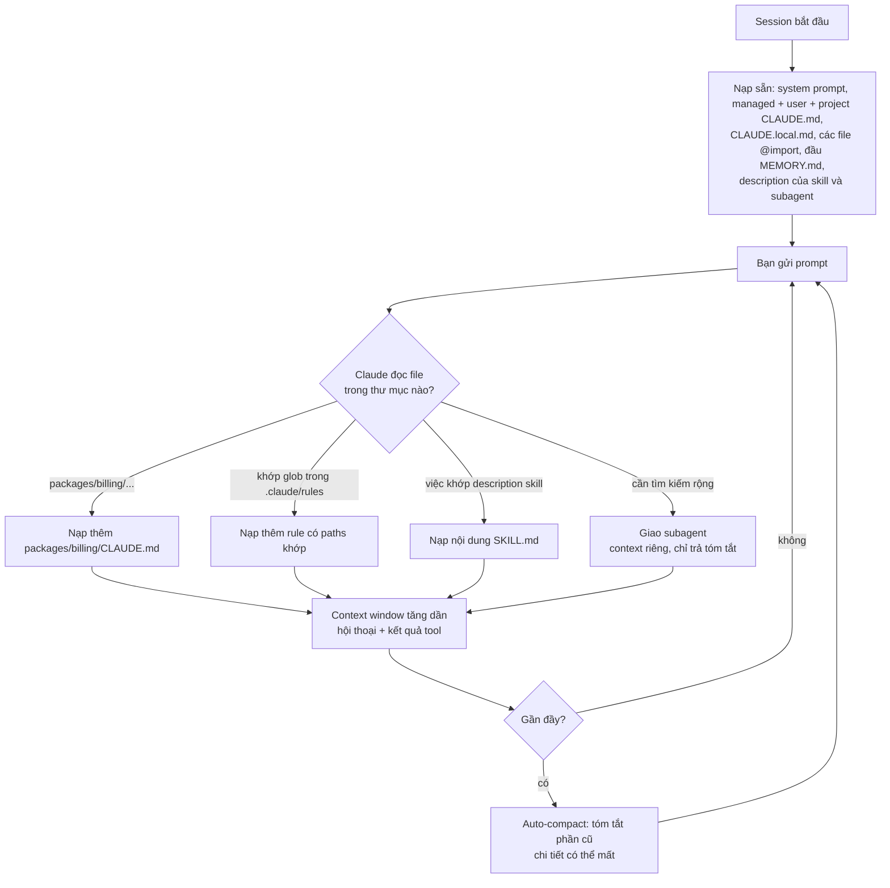
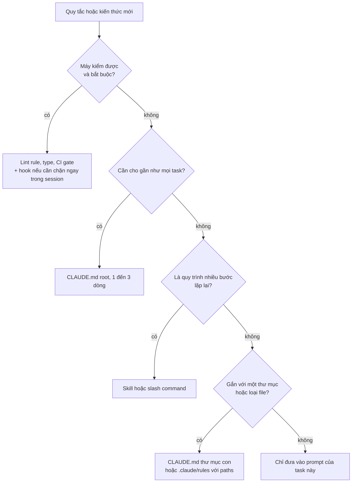

## Bối cảnh & vấn đề

Một team bắt đầu dùng Claude Code cho repo monorepo gồm API NestJS, web Next.js và một package tính tiền. Tuần đầu, mọi người hào hứng. Tuần thứ ba, các lời phàn nàn giống nhau xuất hiện trong Slack: "nó lại dùng `joi` dù mình dùng `zod`", "nó lại sửa tay file trong `src/generated/`", "session buổi chiều nó quên hết ràng buộc mình nói buổi sáng, còn lặp lại đúng cái fix đã fail". Một người phản ứng bằng cách dán thêm mọi quy tắc vào `CLAUDE.md`. Hai tháng sau file dài 800 dòng, agent vẫn bỏ qua một số rule, và mỗi session mở ra đã tiêu tốn một phần đáng kể context chỉ để nạp file đó.

Cả ba triệu chứng có chung một gốc: team coi AI như một người **nhớ mọi thứ** và **tuân thủ mọi thứ được viết ra**. Thực tế, model chỉ "biết" những gì nằm trong **context window** của session hiện tại, không gian đó có giới hạn, và càng đầy thì từng mẩu thông tin càng bị loãng. Còn quy tắc viết trong file hướng dẫn là **gợi ý có xác suất**, không phải luật được thực thi.

**Context engineering** là kỹ năng chọn đúng thông tin, đặt đúng chỗ, vào đúng lúc: cái gì luôn cần thì nạp mỗi session (CLAUDE.md, ngắn), cái gì chỉ cần khi làm một loại việc thì nạp theo yêu cầu (skill), cái gì cần tìm kiếm rộng thì đẩy sang context riêng (subagent), và cái gì **bắt buộc** thì không giao cho model mà giao cho code chạy deterministic (hook, lint, CI). Bài này đi qua từng cơ chế đó trong Claude Code, cách quản lý session dài, và cách tổ chức context cho monorepo nhiều team.

## Khái niệm

### Context window và token

**Context window** là toàn bộ văn bản mà model "nhìn thấy" khi sinh câu trả lời tiếp theo, đo bằng **token** (mảnh văn bản nhỏ, trung bình vài ký tự tiếng Anh). Trong một session Claude Code, context window chứa: system prompt của tool, các file memory như CLAUDE.md, mô tả các skill và tool có sẵn, toàn bộ hội thoại, và **kết quả của mọi tool call**: nội dung file đã đọc, output của `npm test`, kết quả grep. Kích thước tối đa phụ thuộc model và gói bạn dùng (verify con số cụ thể cho model của bạn).

Điều quan trọng không chỉ là "có đủ chỗ không". Khi context đầy thông tin không liên quan (log 3.000 dòng, năm hướng thử đã bỏ), thông tin quan trọng như "không đổi public API" chiếm tỷ lệ nhỏ hơn và dễ bị bỏ qua hơn. Context thừa vừa tốn token vừa làm model bám vào chi tiết sai. Lệnh `/context` trong Claude Code cho bạn xem thứ gì đang chiếm context.

Ví dụ: agent chạy `npm test` không có filter trên repo 2.000 test, output dài hàng nghìn dòng đi thẳng vào context. Chạy `npm test -- src/orders/order.service.test.ts` cho ra vài chục dòng, và agent tập trung vào đúng lỗi.

**Interview angle:** nói được rằng output của tool cũng chiếm context, không chỉ lời bạn gõ, là dấu hiệu bạn hiểu cơ chế thật.

### Auto-compact, `/compact` và `/clear`

Khi context gần chạm giới hạn, Claude Code **tự động compact**: tóm tắt phần hội thoại cũ để giải phóng chỗ. Tóm tắt thì mất chi tiết, và bạn không kiểm soát chi tiết nào bị mất. Một ràng buộc nói ở tin nhắn thứ 3 có thể biến mất sau lần compact thứ hai.

Bạn có hai lệnh chủ động. `/compact <hướng dẫn>` tóm tắt ngay, theo chỉ dẫn của bạn, ví dụ `/compact giữ lại danh sách ràng buộc API và các test đang fail`. `/clear` xoá sạch hội thoại, bắt đầu lại chỉ với context nạp sẵn (CLAUDE.md). Tài liệu best practices khuyên `/clear` giữa các task không liên quan, và **sau hai lần sửa sai thất bại liên tiếp** thì nên clear và viết prompt tốt hơn thay vì cố sửa tiếp trong context đã "nhiễm" hướng sai.

Ví dụ: sau khi xong bug A, bạn muốn làm feature B. Đừng gõ tiếp trong cùng session; `/clear` rồi bắt đầu prompt mới. Nếu cần quay lại session cũ, `claude --continue` mở session gần nhất, `claude --resume` chọn session theo id.

**Interview angle:** câu "session dài thì output tệ đi" muốn nghe cơ chế (context loãng, compact mất chi tiết, giả định sai cũ còn trong context) và hành động cụ thể (`/clear`, handoff file, subagent).

### CLAUDE.md và thứ bậc memory

**CLAUDE.md** là file Markdown mà Claude Code **tự nạp vào context mỗi session**. Nó là nơi đặt thông tin bền vững mà mọi task đều cần: lệnh build/test/lint, cách chạy một test đơn lẻ, cấu trúc thư mục, quy ước code, và danh sách "đừng làm". Các tool khác có khái niệm tương đương: Cursor dùng `.cursor/rules/` (verify định dạng hiện tại), và nhiều tool đọc `AGENTS.md`, một định dạng mở dùng chung giữa các agent.

Claude Code đọc memory theo nhiều tầng, từ rộng đến hẹp:

| Tầng | Vị trí | Dùng cho | Commit? |
|---|---|---|---|
| Managed (tổ chức) | `/Library/Application Support/ClaudeCode/CLAUDE.md` (macOS), `/etc/claude-code/CLAUDE.md` (Linux) | Chính sách toàn công ty | Do IT quản lý |
| User | `~/.claude/CLAUDE.md` | Sở thích cá nhân mọi project | Không |
| Project | `./CLAUDE.md` hoặc `./.claude/CLAUDE.md` | Quy ước của repo, cả team dùng | Có |
| Project local | `./CLAUDE.local.md` | Ghi chú cá nhân cho repo này | Không (gitignore) |
| Thư mục con | `packages/billing/CLAUDE.md` | Quy ước riêng của một package | Có |

CLAUDE.md ở **thư mục con** được nạp **khi cần**, tức là khi Claude đọc file trong thư mục đó, nên quy ước riêng của `packages/billing` không chiếm context khi bạn đang sửa `packages/web`. Đây là cơ chế chính để phân tầng context trong monorepo.

**Interview angle:** interviewer hỏi "bạn để gì trong CLAUDE.md" muốn nghe nội dung **kiểm chứng được và cụ thể** (lệnh thật, đường dẫn thật), cùng với việc bạn biết nó được commit và review như code.

### `@import`, `.claude/rules/` và auto memory

Trong CLAUDE.md, dòng `@docs/architecture.md` **import** file khác vào context (đường dẫn tương đối với file đang import, lồng tối đa 4 cấp). Cách này giữ CLAUDE.md ngắn trong khi vẫn liên kết tới doc chi tiết. Lưu ý: file được import vẫn nạp mỗi session, nên import một file 500 dòng không làm context nhẹ đi; nó chỉ làm CLAUDE.md dễ đọc hơn.

**`.claude/rules/*.md`** là các file rule có frontmatter `paths:` với glob. Rule chỉ được nạp khi Claude đọc file khớp glob. Ví dụ rule cho controller chỉ nạp khi Claude chạm vào `*.controller.ts`. Đây là cách tốt để tách quy ước theo loại file mà không cần thêm CLAUDE.md ở mọi thư mục.

**Auto memory** là ghi chú do chính Claude viết lại qua các session, lưu tại `~/.claude/projects/<project>/memory/MEMORY.md` (khoảng 200 dòng đầu được nạp). Nó hữu ích cho sở thích cá nhân và bài học rút ra, nhưng nằm ngoài repo, nên **không** thay được CLAUDE.md cho quy ước cả team.

Hai lệnh quản lý: **`/init`** quét codebase và sinh bản CLAUDE.md đầu tiên (bạn phải đọc và sửa tay sau đó, vì nó thường dài và chung chung), **`/memory`** liệt kê, mở để sửa các file memory đang được nạp, và bật/tắt auto memory.

**Interview angle:** biết sự khác nhau giữa "nạp mỗi session" (CLAUDE.md, import) và "nạp khi cần" (CLAUDE.md thư mục con, rules có `paths`, skill) là chìa khoá cho câu hỏi monorepo.

### Skills và custom slash commands

**Skill** là một thư mục `.claude/skills/<tên>/SKILL.md` chứa quy trình cho một loại việc lặp lại: tạo migration, thêm endpoint, release checklist. Frontmatter có `name` và `description`. Chỉ **description** luôn nằm trong context; **nội dung** chỉ được nạp khi Claude quyết định dùng skill (hoặc bạn gọi nó). Nhờ vậy 60 dòng hướng dẫn migration không chiếm chỗ trong những session không đụng đến database. Với quy trình bạn chỉ muốn chạy khi chủ động gọi (deploy, release), đặt `disable-model-invocation: true` để model không tự kích hoạt.

**Custom slash command** kiểu cũ `.claude/commands/<tên>.md` vẫn hoạt động: file trở thành lệnh `/<tên>`, và `$ARGUMENTS` nhận phần chữ gõ sau lệnh. **Plugin** đóng gói skill, subagent, hook và MCP server thành một đơn vị cài đặt qua `/plugin`, tiện chia sẻ giữa nhiều repo.

Ví dụ: `/fix-issue 1234` với `.claude/commands/fix-issue.md` chứa "Đọc issue $ARGUMENTS bằng `gh issue view`, tái hiện bằng test, sửa, chạy test".

**Interview angle:** follow-up "CLAUDE.md có 60 dòng về migration, nên để đâu" có đáp án: chuyển sang một skill, CLAUDE.md chỉ giữ một dòng trỏ tới nó.

### Subagents

**Subagent** là một agent phụ với **context window riêng**, được định nghĩa trong `.claude/agents/<tên>.md` (frontmatter `name`, `description`, `tools`, `model`). Agent chính giao việc cho subagent; subagent tự đọc hàng chục file, chạy tìm kiếm, và chỉ **trả về bản tóm tắt**. Toàn bộ output trung gian nằm trong context của subagent, không làm đầy context chính. Claude Code có sẵn subagent **Explore** (tìm kiếm chỉ đọc), **Plan**, và general-purpose; `/agents` để quản lý.

Vì sao hữu ích: câu "tìm mọi chỗ gọi `calculateDiscount` và cho biết cái nào truyền `currency`" có thể cần đọc 40 file. Làm trong context chính thì 40 file đó chiếm chỗ suốt phần còn lại của session. Giao cho subagent thì context chính chỉ nhận vài dòng kết luận. Giới hạn `tools` (ví dụ chỉ `Read, Grep, Glob`) còn đảm bảo subagent review hay research không sửa được file.

**Interview angle:** subagent là câu trả lời cho cả "giữ context gọn" lẫn "writer/reviewer tách biệt": reviewer trong context mới không bị ảnh hưởng bởi lập luận của writer.

### Hooks: luật bắt buộc

**Hook** là lệnh shell mà Claude Code **chạy deterministic** tại các sự kiện trong vòng đời: `PreToolUse` (trước khi tool chạy), `PostToolUse` (sau khi tool chạy), `UserPromptSubmit`, `Stop`, `SessionStart`, `PreCompact` và nhiều sự kiện khác. Hook được cấu hình trong `settings.json`, nhận **JSON qua stdin** (có `tool_name`, `tool_input.file_path`, `tool_input.command`...) và báo kết quả qua exit code. **Exit 2** là chặn: với `PreToolUse`, tool call bị huỷ và nội dung stderr được gửi lại cho Claude để nó tự điều chỉnh; với `Stop`, Claude tiếp tục làm việc thay vì dừng. Exit 0 là cho qua.

Khác biệt cốt lõi: CLAUDE.md nói "đừng sửa `src/generated/`" và model **có thể** quên; hook `PreToolUse` chặn mọi `Edit` vào `src/generated/` **mỗi lần**, không phụ thuộc model nhớ hay không. Hook là nơi cho luật bắt buộc mà máy kiểm được. Chú ý: không có biến template kiểu `{{file}}` trong lệnh hook; đường dẫn file phải đọc từ JSON trên stdin (ví dụ bằng `jq`).

**Interview angle:** câu so sánh CLAUDE.md, skill, subagent, hook muốn nghe một nguyên tắc: **gợi ý** thì vào CLAUDE.md/skill, **bắt buộc** thì vào hook/lint/CI.

### Luật gợi ý và luật bắt buộc

Tóm lại hai loại. **Luật gợi ý** (CLAUDE.md, rules, skill) phù hợp với thứ khó máy hoá: pattern kiến trúc ưu tiên, cách đặt tên domain, "hỏi trước khi thêm dependency", "làm giống `AddressService`". **Luật bắt buộc** (hook, ESLint rule, type check, pre-commit, CI gate, secret scanning) phù hợp với thứ kiểm được bằng máy: không `any`, không `.only` trong test, format, import boundary giữa package, không commit secret, không sửa file generated.

Quy tắc chuyển đổi: một rule trong CLAUDE.md bị vi phạm lần thứ hai **và** máy kiểm được thì chuyển thành lint rule hoặc hook, rồi xoá khỏi CLAUDE.md. Đặc biệt, **đừng dựa vào CLAUDE.md cho invariant bảo mật**: nó không chặn được gì, và nó cũng không bảo vệ bạn khỏi code do người viết. Lint và CI thì bảo vệ cả hai.

| Cơ chế | Khi nào nạp/chạy | Bản chất | Đặt gì |
|---|---|---|---|
| CLAUDE.md (root) | Mỗi session | Gợi ý | Lệnh, cấu trúc, quy ước chính, "đừng làm" |
| CLAUDE.md thư mục con, `.claude/rules` | Khi đọc file khớp | Gợi ý | Quy ước riêng một package/loại file |
| Skill / command | Khi cần hoặc khi gọi | Gợi ý, có quy trình | Workflow lặp lại: migration, endpoint, release |
| Subagent | Khi được giao việc | Context riêng | Tìm kiếm rộng, review, research |
| Hook | Mỗi sự kiện khớp | Bắt buộc, deterministic | Chặn path, format sau khi sửa, chặn lệnh nguy hiểm |
| Lint / typecheck / CI | Mỗi lần chạy, mỗi PR | Bắt buộc | Mọi invariant máy kiểm được, cho cả người và AI |

## Cơ chế hoạt động

### Context được nạp vào lúc nào

Hiểu **thời điểm** mỗi mẩu context được nạp là cách nhanh nhất để quyết định đặt thông tin ở đâu:



Đọc sơ đồ: phần ở hộp đầu tiên **luôn** tốn chỗ, nên phải ngắn nhất. Các nhánh ở giữa là context **có điều kiện**: chỉ nạp khi task chạm tới vùng đó. Subagent là nhánh duy nhất mà phần lớn công việc **không** quay về context chính, chỉ có bản tóm tắt. Vòng cuối cho thấy vì sao session dài xuống cấp: context chỉ tăng, và khi đầy thì auto-compact tóm tắt theo cách bạn không kiểm soát.

Song song với luồng này, **hook** không nằm trong context chút nào. Chúng là code chạy bên ngoài model, tại sự kiện, và chỉ tác động vào context khi chặn (stderr gửi lại cho Claude) hoặc khi bạn cấu hình cho chúng thêm thông tin.

### Đặt một quy tắc vào đâu

Khi team muốn "dạy" agent một điều mới, đi qua cây quyết định này:



Nhánh đầu tiên được hỏi **trước** là có chủ ý: nếu máy kiểm được, mọi vị trí khác đều là lựa chọn yếu hơn. Nhánh cuối cũng quan trọng: thông tin chỉ dùng một lần (link Jira, quyết định của cuộc họp hôm qua) thuộc về prompt, không thuộc CLAUDE.md.

### Vòng đời một session có quản lý

Quy trình thực tế để giữ context sạch cho một task không nhỏ:

1. **Bắt đầu sạch**: session mới hoặc `/clear`. Kiểm tra `/context` nếu nghi CLAUDE.md quá to.
2. **Explore bằng subagent**: "dùng subagent tìm mọi chỗ gọi X, chỉ báo lại danh sách file và dòng".
3. **Plan** trong plan mode, lưu plan ra file `docs/plans/<task>.md` nếu task kéo dài hơn một session.
4. **Implement từng bước**, chạy test có filter, không dump log dài.
5. **Checkpoint trạng thái**: khi context đã nặng, cập nhật file handoff (mẫu ở phần ví dụ), rồi `/clear` và bắt đầu lại với "đọc `@docs/plans/<task>.md` và tiếp tục từ bước 3".
6. **Rút bài học**: lỗi agent lặp lại hai lần → sửa CLAUDE.md hoặc thêm hook/lint.

## Ví dụ thực tế

### CLAUDE.md cho monorepo: ngắn, cụ thể, kiểm chứng được

Đây là CLAUDE.md root của một monorepo mẫu. Mọi dòng là lệnh chạy được, đường dẫn có thật, hoặc quy ước có thể kiểm tra trong review:

```markdown
# Orders platform (monorepo, pnpm workspaces)

## Commands
- Install: `pnpm install`
- Typecheck all: `pnpm -r typecheck`
- Test one package: `pnpm --filter @app/billing test`
- Test one file: `pnpm --filter @app/billing test -- src/invoice.test.ts`
- Lint: `pnpm lint` (CI chạy cùng lệnh này)

## Structure
- `packages/api` NestJS API · `packages/web` Next.js · `packages/billing` tính tiền
- `src/generated/` là output của openapi-generator: KHÔNG sửa tay

## Conventions
- Validation dùng `zod`, không dùng `joi`/`class-validator` cho code mới
- Lỗi nghiệp vụ: throw `DomainError(code, message)`; không throw string
- Mọi query đọc/ghi bảng có `tenant_id` phải đi qua `TenantScopedRepository`

## Don't
- Không thêm dependency khi chưa hỏi
- Không đổi public API trong `packages/api/src/contracts/`

## More
- Migration: xem skill `db-migration` · Kiến trúc: @docs/architecture.md
```

Package tính tiền có CLAUDE.md riêng, chỉ nạp khi Claude đọc file trong `packages/billing/`:

```markdown
# Billing
- Tiền luôn là số nguyên đơn vị nhỏ nhất (`amount_minor: bigint`), không dùng float
- Làm tròn: banker's rounding qua `roundHalfEven()` trong `src/money.ts`
```

Và một rule theo loại file, `.claude/rules/api-controllers.md`:

```markdown
---
paths:
  - "packages/api/src/**/*.controller.ts"
---
- Controller chỉ parse input bằng zod schema rồi gọi service; không chứa logic nghiệp vụ
- Mỗi endpoint mới cần e2e test trong `packages/api/test/`
```

Kiểm tra cấu trúc và kích thước (chạy thật trong một repo mẫu dưới thư mục scratch):

```bash
find . -name 'CLAUDE.md' -o -path './.claude/rules/*' | sort
wc -l CLAUDE.md packages/*/CLAUDE.md | tail -4
echo "approx tokens (chars/4): $(( $(wc -c < CLAUDE.md) / 4 ))"
grep -nE '(AKIA[0-9A-Z]{16}|sk-[A-Za-z0-9]{20,}|password\s*=|postgres://[^ ]+:[^ ]+@)' \
  CLAUDE.md packages/*/CLAUDE.md .claude/rules/*.md; echo "secret-grep exit=$?"
```

```text
./.claude/rules/api-controllers.md
./CLAUDE.md
./packages/billing/CLAUDE.md
./packages/web/CLAUDE.md
      24 CLAUDE.md
       3 packages/billing/CLAUDE.md
       1 packages/web/CLAUDE.md
      28 total
approx tokens (chars/4): 234
secret-grep exit=1
```

Root CLAUDE.md chỉ 24 dòng. Con số "chars/4" là ước lượng rất thô (với tiếng Việt UTF-8, số byte cao hơn số ký tự nên con số chỉ để so sánh tương đối giữa các lần sửa); để xem thật, dùng `/context` trong session. `grep` exit 1 nghĩa là **không** tìm thấy pattern secret nào; đưa lệnh này (hoặc gitleaks) vào CI để CLAUDE.md không bao giờ chứa credential.

### Chuyển một rule từ CLAUDE.md sang hook

Team thấy agent vẫn thỉnh thoảng sửa tay `src/generated/` và sửa migration đã apply, dù CLAUDE.md đã ghi "KHÔNG sửa tay". Hai rule này **máy kiểm được**, nên chuyển thành hook `PreToolUse`. File `.claude/hooks/protect-paths.sh`:

```bash
#!/usr/bin/env bash
# PreToolUse hook: chặn Edit/Write vào file generated, migration đã apply và .env
set -euo pipefail
input="$(cat)"                                   # JSON từ stdin
file="$(jq -r '.tool_input.file_path // empty' <<<"$input")"
[[ -z "$file" ]] && exit 0                       # tool không có file_path: cho qua

case "$file" in
  */src/generated/*|*/prisma/migrations/*/migration.sql|*/.env|*/.env.*)
    echo "Blocked: $file là file generated/đã apply/secret. Sửa nguồn (schema.prisma, openapi.yaml) rồi chạy generator; tạo migration MỚI thay vì sửa migration cũ." >&2
    exit 2                                       # 2 = chặn tool call, stderr gửi lại cho Claude
    ;;
esac
exit 0
```

Đăng ký trong `.claude/settings.json` (commit để cả team dùng), kèm một `PostToolUse` chạy formatter sau mỗi lần sửa:

```json
{
  "permissions": {
    "allow": ["Bash(npm run test:*)", "Bash(npm run lint)", "Bash(git diff:*)"],
    "deny": ["Read(./.env)", "Read(./.env.*)", "Read(./secrets/**)"]
  },
  "hooks": {
    "PreToolUse": [
      {
        "matcher": "Edit|Write",
        "hooks": [
          { "type": "command", "command": "\"$CLAUDE_PROJECT_DIR\"/.claude/hooks/protect-paths.sh" }
        ]
      }
    ],
    "PostToolUse": [
      {
        "matcher": "Edit|Write",
        "hooks": [
          { "type": "command", "command": "\"$CLAUDE_PROJECT_DIR\"/.claude/hooks/format.sh" }
        ]
      }
    ]
  }
}
```

Test hook **mà không cần mở Claude Code**: giả lập JSON mà Claude Code gửi qua stdin, rồi xem exit code:

```bash
echo '{"hook_event_name":"PreToolUse","tool_name":"Edit","tool_input":{"file_path":"/work/app/src/generated/api-client.ts","old_string":"a","new_string":"b"}}' \
  | ./.claude/hooks/protect-paths.sh; echo "exit=$?"
echo '{"hook_event_name":"PreToolUse","tool_name":"Write","tool_input":{"file_path":"/work/app/src/orders/order.service.ts","content":"..."}}' \
  | ./.claude/hooks/protect-paths.sh; echo "exit=$?"
echo '{"hook_event_name":"PreToolUse","tool_name":"Edit","tool_input":{"file_path":"/work/app/prisma/migrations/20260901_add_orders/migration.sql"}}' \
  | ./.claude/hooks/protect-paths.sh; echo "exit=$?"
```

```text
Blocked: /work/app/src/generated/api-client.ts là file generated/đã apply/secret. Sửa nguồn (schema.prisma, openapi.yaml) rồi chạy generator; tạo migration MỚI thay vì sửa migration cũ.
exit=2
exit=0
Blocked: /work/app/prisma/migrations/20260901_add_orders/migration.sql là file generated/đã apply/secret. Sửa nguồn (schema.prisma, openapi.yaml) rồi chạy generator; tạo migration MỚI thay vì sửa migration cũ.
exit=2
```

File generated và migration cũ bị chặn (exit 2, lý do nằm trong stderr để Claude đọc và tự chuyển sang sửa nguồn); file service bình thường được cho qua (exit 0). Kiểm tra nhanh cấu hình bằng `jq`, hữu ích khi review PR sửa settings:

```bash
jq -r '.hooks | to_entries[] | "\(.key)  matcher=\(.value[].matcher)  ->  \(.value[].hooks[].command)"' .claude/settings.json
```

```text
PreToolUse  matcher=Edit|Write  ->  "$CLAUDE_PROJECT_DIR"/.claude/hooks/protect-paths.sh
PostToolUse  matcher=Edit|Write  ->  "$CLAUDE_PROJECT_DIR"/.claude/hooks/format.sh
```

Sau khi hook chạy ổn, xoá dòng "KHÔNG sửa tay" khỏi CLAUDE.md hoặc giữ một dòng ngắn giải thích *vì sao* (để agent chọn đúng hướng ngay từ đầu, thay vì đâm vào hook). Hook này vẫn chưa đủ: agent có thể ghi file bằng `Bash` (`sed -i`, `cat >`). Một lớp nữa là CI kiểm tra "file generated khớp với output của generator", chạy cho cả người lẫn AI.

### Skill thay cho 60 dòng migration trong CLAUDE.md

`.claude/skills/db-migration/SKILL.md`:

```markdown
---
name: db-migration
description: Tạo và kiểm tra Prisma migration cho Postgres. Dùng khi task thêm/sửa bảng, cột, index.
---
1. Sửa `prisma/schema.prisma`, không sửa file trong `prisma/migrations/` đã tồn tại.
2. Chạy `pnpm prisma migrate dev --name <mô-tả-ngắn> --create-only`, đọc SQL sinh ra.
3. Cột mới trên bảng lớn: nullable hoặc có default; index dùng `CREATE INDEX CONCURRENTLY` (migration riêng).
4. Đổi tên/xoá cột: expand → migrate → contract, qua ít nhất 2 lần deploy.
5. Chạy `pnpm --filter @app/api test -- test/migrations` trước khi báo xong.
```

CLAUDE.md chỉ còn một dòng "Migration: xem skill `db-migration`". Description (một câu) luôn trong context để Claude biết skill tồn tại; 5 bước chỉ nạp khi task thật sự chạm database.

### Subagent chỉ đọc cho tìm kiếm rộng

`.claude/agents/code-searcher.md`:

```markdown
---
name: code-searcher
description: Tìm call site, usage và pattern trong codebase. Dùng cho câu hỏi "chỗ nào gọi X", "module Y dùng ở đâu". Chỉ đọc.
tools: Read, Grep, Glob
model: haiku
---
Trả lời bằng danh sách `path:line` kèm một câu mô tả mỗi chỗ. Không đề xuất sửa code.
Nếu kết quả > 30 chỗ, nhóm theo thư mục và chỉ liệt kê 5 ví dụ mỗi nhóm.
```

`tools` chỉ gồm công cụ đọc, nên subagent không sửa được file. `model: haiku` chọn model nhỏ hơn cho việc tìm kiếm (verify alias model được hỗ trợ trong version của bạn). Built-in **Explore** đã làm việc tương tự; tự định nghĩa khi bạn cần format output riêng.

### Handoff file giữa hai session

Khi context đã nặng, trước khi `/clear`, yêu cầu agent (hoặc tự viết) cập nhật file trạng thái. Mẫu `docs/plans/discount-code.md`:

```markdown
# Task: discount_code cho checkout (ticket ABC-123)
## Goal / done khi
- POST /orders nhận `discount_code`; mã hết hạn → 422 `DISCOUNT_EXPIRED`
- `pnpm --filter @app/api test -- orders` xanh, `pnpm -r typecheck` sạch
## Constraints (KHÔNG được mất)
- Không đổi response shape của POST /orders (mobile app cũ còn dùng)
- Tiền dùng `amount_minor: bigint`
## Done
- [x] Migration thêm bảng `discount_codes` (commit a1b2c3d)
- [x] `DiscountService.validate()` + unit test
## Next
- [ ] Nối vào `OrderService.create()`; e2e test
## Tried & failed
- Validate trong controller: vi phạm rule "controller không chứa logic" → chuyển vào service
```

Session mới bắt đầu bằng: *"Đọc @docs/plans/discount-code.md. Tiếp tục mục Next đầu tiên. Tuân thủ mục Constraints."* Mục **Tried & failed** là phần hay bị quên nhất và cũng quý nhất: nó ngăn agent mới lặp lại đúng hướng đã thất bại.

### Prompt tốt và prompt tệ cho task không nhỏ

```text
❌ Thêm discount code vào checkout.

✅ Thêm discount_code cho POST /orders.
   Context: @packages/api/src/orders/order.service.ts, @packages/api/src/orders/order.controller.ts,
   làm giống cách AddressService validate trong @packages/api/src/address/address.service.ts.
   Done khi: mã hết hạn → 422 DISCOUNT_EXPIRED; mã không tồn tại → 404; test mới trong
   orders.e2e-spec.ts pass; pnpm -r typecheck sạch.
   Constraints: không đổi response shape; không thêm dependency; tenant-aware qua TenantScopedRepository.
   Non-goals: UI, báo cáo.
   Trước khi code: đưa plan ngắn và danh sách file sẽ sửa, chờ tôi duyệt.
```

Prompt tốt có đủ năm phần: **mục tiêu + done khi**, **file liên quan và pattern mẫu**, **ràng buộc**, **non-goals**, **cách verify**, cộng yêu cầu plan trước. Nó cũng *không* dán cả repo hay cả trang Confluence: thông tin từ Confluence/Slack nên được bạn **tóm tắt và làm sạch** (bỏ dữ liệu khách hàng, token) vào một file `docs/specs/<task>.md` rồi `@` file đó; hoặc dùng MCP server chỉ đọc đã được duyệt, và coi nội dung trả về là dữ liệu không tin cậy.

## Trade-offs & lựa chọn thay thế

| Lựa chọn | Ưu | Nhược | Hợp khi |
|---|---|---|---|
| Nhồi mọi thứ vào CLAUDE.md root | Đơn giản, một chỗ | Tốn context mỗi session, rule bị loãng và bị bỏ qua | Repo nhỏ, ít quy ước |
| CLAUDE.md phân tầng + `.claude/rules` | Chỉ nạp khi liên quan | Nhiều file, cần owner | Monorepo, nhiều team |
| Skill / command | Quy trình chi tiết không tốn context mặc định | Model có thể không kích hoạt nếu description mơ hồ | Workflow lặp lại nhiều bước |
| Subagent | Giữ context chính sạch, giới hạn tool | Mất chi tiết trung gian, tốn thêm token tổng | Tìm kiếm rộng, review độc lập |
| Hook | Deterministic, không phụ thuộc model | Phải viết và bảo trì script; chỉ thấy tool call, dễ có lỗ (Bash) | Luật bắt buộc trong session |
| Lint / CI | Áp dụng cho cả người và AI, là nguồn sự thật | Chậm hơn (phản hồi ở PR) | Mọi invariant máy kiểm được |
| Session dài + auto-compact | Không phải làm gì | Mất ràng buộc, lặp fix cũ | Không nên dựa vào |
| `/clear` + handoff file | Kiểm soát được thứ được giữ lại | Tốn vài phút viết | Task kéo dài nhiều giờ |

**Khi nào chọn cái nào.** Bắt đầu mỗi repo bằng một CLAUDE.md ngắn (dưới khoảng 100 dòng là mục tiêu hợp lý; tài liệu chính thức khuyên giữ ngắn gọn nhưng không đặt con số cứng, verify). Mỗi khi agent lặp một lỗi, hỏi cây quyết định ở phần cơ chế: máy kiểm được thì lint/hook; lặp lại nhiều bước thì skill; gắn với thư mục thì CLAUDE.md con. Với câu hỏi "CLAUDE.md hay lint/CI", trả lời thẳng: invariant bắt buộc luôn ở lint/CI vì chúng chặn cả code do người viết; CLAUDE.md chỉ giúp agent **làm đúng từ đầu** để ít bị chặn hơn.

**Monorepo nhiều team.** Root giữ thứ chung (lệnh workspace, quy ước toàn repo, "đừng làm" toàn cục); mỗi package có CLAUDE.md riêng do team sở hữu, được bảo vệ bằng **CODEOWNERS** như code; skill chung ở root `.claude/skills/`, skill riêng của team đặt cạnh package hoặc phân phối qua plugin. Khi hai team có quy ước mâu thuẫn (ví dụ cách xử lý lỗi), đừng để agent tự "chọn": ghi rõ phạm vi ("trong `packages/billing`, lỗi dùng `Result<T, E>` thay cho throw"), để file gần code nói về đúng package đó, và giải quyết mâu thuẫn ở cấp con người (ADR) nếu nó ảnh hưởng ranh giới giữa package. Không nên dựa vào giả định "file cụ thể hơn thắng" khi chưa kiểm tra hành vi thực tế (verify). Đo hiệu quả bằng việc lỗi cũ có còn lặp lại trong review không.

## Edge cases & failure modes

- **CLAUDE.md 800 dòng**: mỗi session tốn context ngay từ đầu, rule quan trọng bị loãng. Cách xử lý: cắt còn phần chung, chuyển quy trình sang skill, quy ước theo thư mục sang CLAUDE.md con/rules, luật máy kiểm được sang lint/hook, và xoá rule không ai nhớ vì sao có.
- **Rule mâu thuẫn**: root nói "dùng `class-validator`", package nói "dùng `zod`". Agent chọn ngẫu nhiên theo ngữ cảnh. Phải sửa file, không phải sửa prompt.
- **Rule lỗi thời**: CLAUDE.md ghi lệnh `npm test` trong khi repo đã chuyển sang pnpm. Agent làm theo và thất bại, hoặc tệ hơn là cài lại dependency bằng npm. CLAUDE.md phải được review khi đổi tooling, như README.
- **Auto-compact mất ràng buộc**: sau compact, agent quên "không đổi response shape". Đưa ràng buộc sống còn vào handoff file hoặc CLAUDE.md, và `/compact` chủ động với hướng dẫn giữ lại chúng.
- **Output lệnh khổng lồ**: `cat` file log 20 MB, `npm test` toàn repo. Context đầy chỉ trong một lượt. Hướng dẫn trong CLAUDE.md "luôn chạy test có filter", và dùng subagent cho việc đọc log.
- **Hook có lỗ**: hook `PreToolUse` matcher `Edit|Write` không thấy `Bash(sed -i ...)`. Kết hợp permission rule và CI; hook là lớp nhanh, CI là lớp cuối.
- **Hook lỗi hoặc chậm**: script thiếu `jq` trên máy một thành viên, hoặc hook formatter chạy 20 giây mỗi lần sửa. Kiểm tra dependency của hook, giữ hook nhanh, test hook bằng JSON mẫu như ví dụ trên.
- **Hook ghi đè exit code sai**: dùng `exit 1` thay vì `exit 2` thì Claude Code coi là lỗi không chặn (tool vẫn chạy, verify hành vi chính xác trong hooks reference). Luôn test cả nhánh chặn và nhánh cho qua.
- **Prompt injection qua context**: file README, issue, trang web được đọc vào context có thể chứa chỉ thị. Context engineering không chỉ là "đưa đủ" mà còn là "đưa từ nguồn tin cậy" (xem [bài bảo mật](/tracks/ai-assisted-engineering/learn/security-permissions)).

## Pitfalls

- ❌ Đặt secret, connection string, token vào CLAUDE.md "cho tiện" → ✅ Không bao giờ; CLAUDE.md được commit và nạp vào context gửi đến model. Dùng biến môi trường và `deny` đọc `.env`.
- ❌ Coi CLAUDE.md là thay thế cho lint và test → ✅ CLAUDE.md giúp làm đúng từ đầu; lint/CI mới là chốt chặn.
- ❌ Dùng `/init` rồi commit nguyên văn → ✅ Đọc, cắt, sửa cho cụ thể; bỏ những câu chung chung kiểu "viết code sạch".
- ❌ Viết rule mơ hồ "xử lý lỗi cẩn thận" → ✅ Rule kiểm chứng được: "throw `DomainError(code, message)`, không throw string".
- ❌ Một session cho cả ngày làm nhiều task → ✅ `/clear` giữa các task; handoff file cho task dài.
- ❌ Sửa đi sửa lại sau 3 lần fix thất bại trong cùng session → ✅ Dừng, `/clear`, viết prompt mới có mục "đã thử và thất bại".
- ❌ Dán cả trang Confluence hay thread Slack vào prompt → ✅ Tóm tắt, làm sạch dữ liệu nhạy cảm, lưu thành spec file rồi `@` nó.
- ❌ Viết hook dùng biến template `{{file}}` → ✅ Hook nhận JSON trên stdin; đọc `tool_input.file_path` bằng `jq`.
- ❌ Để rules file không có owner → ✅ CODEOWNERS cho CLAUDE.md và `.claude/`, review như code.

## Tóm tắt

- **Context window** chứa mọi thứ model thấy trong session, gồm cả **output của tool**; càng đầy càng loãng, và auto-compact tóm tắt mất chi tiết.
- **CLAUDE.md** nạp mỗi session: ngắn, cụ thể, lệnh thật, đường dẫn thật; commit và review như code; không chứa secret.
- Thứ bậc memory: managed → user → project → `CLAUDE.local.md`; **CLAUDE.md thư mục con** và `.claude/rules` có `paths` chỉ nạp khi chạm tới vùng đó.
- **Skill** cho quy trình lặp lại (chỉ description luôn trong context); **subagent** cho tìm kiếm/review với context riêng; **hook** cho luật bắt buộc chạy deterministic, nhận JSON qua stdin, exit 2 để chặn.
- Nguyên tắc: **gợi ý → CLAUDE.md/skill; bắt buộc → hook/lint/CI**; rule bị vi phạm lần hai và máy kiểm được thì chuyển thành lint/hook.
- Session dài xuống cấp: `/clear` giữa task, `/compact <hướng dẫn>` chủ động, **handoff file** có Constraints và Tried & failed.
- Context tốt cho task: mục tiêu + done khi, file liên quan + pattern mẫu, ràng buộc, non-goals, lệnh verify, plan trước.
- Monorepo: root chung + CLAUDE.md theo package có CODEOWNERS, skill chia sẻ, mâu thuẫn giải quyết ở file và ở con người, không để agent tự chọn.
