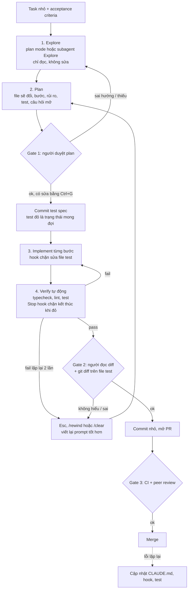
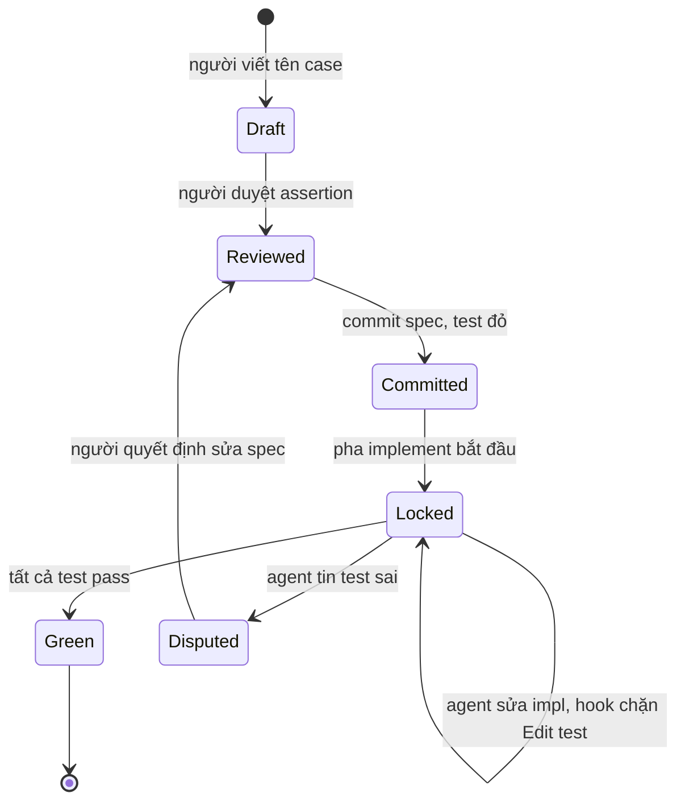

## Bối cảnh & vấn đề

Một dev nhận ticket "cho phép áp voucher ở checkout". Anh mở Claude Code và gõ đúng một dòng: *"add voucher support to checkout"*. Mười phút sau agent báo "Done!": 14 file bị sửa, một bảng `vouchers` mới trong migration, một package `voucher-code-generator` được thêm vào `package.json`, và toàn bộ test xanh. Khi review, anh phát hiện ba chuyện: agent tự quyết voucher giảm theo phần trăm *và* số tiền cố định (ticket chỉ nói số tiền), nó gọi `prisma.voucher.upsertMany()` (không tồn tại, nhưng nằm trong nhánh code chưa có test nên không ai thấy), và để "làm test xanh" nó đã sửa assertion `expect(total).toBe(0)` thành `expect(total).toBeLessThan(0)` ở một test cũ. Hai giờ review, cuối cùng `git reset --hard` và làm lại.

Không có dòng nào trong câu chuyện trên là do model "kém". Model làm đúng việc được giao: một yêu cầu mơ hồ, không có tiêu chí hoàn thành, không có điểm dừng để người duyệt hướng đi, và không có cơ chế chặn việc sửa test. Lỗi nằm ở **quy trình**. Khi agent có thể đọc, sửa file và chạy lệnh liên tục, mỗi phút nó đi sai hướng là thêm vài chục dòng diff bạn phải đọc và vứt đi.

Tài liệu best practices chính thức của Claude Code đề xuất một vòng lặp đơn giản: **explore → plan → implement → commit**, cộng với nguyên tắc quan trọng nhất là "cho Claude một cách để tự kiểm chứng công việc" (test, build, screenshot). Bài này mổ xẻ vòng lặp đó thành bốn pha **Explore → Plan → Implement → Verify**, chỉ ra đâu là **điểm dừng của người** (human gate), vì sao bỏ pha plan là nguyên nhân phổ biến nhất của output tệ, cách dùng **tests as spec** để agent có feedback loop máy kiểm được, và cách bắt **hallucinated API** trước khi nó tới PR.

Bài giả định bạn đã biết CLAUDE.md là gì (xem [Context engineering](/tracks/ai-assisted-engineering/learn/context-engineering)). Nếu chưa, chỉ cần nhớ: đó là file hướng dẫn mà Claude Code tự nạp vào context mỗi session.

## Khái niệm

### Agentic loop và "human gate"

**Agentic loop** là vòng lặp mà tool AI tự chạy: đọc code → quyết định → sửa file hoặc chạy lệnh → đọc kết quả → quyết định tiếp. Khác với autocomplete (gợi ý vài dòng, bạn accept hay không), agent có thể chạy hàng chục bước mà không hỏi bạn, miễn là permission cho phép. Tốc độ đó là điểm mạnh, nhưng cũng có nghĩa là sai lầm **cộng dồn**: một giả định sai ở bước 2 sẽ được xây tiếp ở bước 3 đến 20.

**Human gate** là điểm trong vòng lặp mà người *bắt buộc* phải nhìn và quyết định trước khi agent đi tiếp. Trong quy trình bài này có ba gate: sau khi agent trình bày plan (duyệt hướng đi), sau khi test/typecheck xanh (đọc diff), và trước khi merge (PR review thường). Gate rẻ nhất là gate plan, vì lúc đó chưa có dòng code nào; gate đắt nhất là lúc production đã lỗi.

Nguyên tắc định vị gate: **chi phí sửa sai tăng theo thời gian agent chạy mà không bị kiểm tra**. Vì vậy gate phải đặt ở nơi đổi hướng còn rẻ, không phải ở cuối.

**Interview angle:** interviewer muốn nghe bạn nói rõ *ở đâu* bạn dừng agent lại và *tại sao* ở đó, chứ không chỉ "tôi review code AI viết".

### Pha 1 — Explore: đọc trước, chưa sửa

**Explore** là pha agent đọc file liên quan, tìm call site, đọc test hiện có, và tóm tắt lại hiện trạng, **chưa sửa gì**. Mục đích là để cả bạn và agent có chung một bức tranh: code đang ở đâu, pattern nào đang được dùng, cái gì có thể vỡ.

Có ba cách giữ pha này read-only trong Claude Code. Cách một là **plan mode**: nhấn Shift+Tab để chuyển permission mode (chu kỳ có chế độ plan), hoặc mở session bằng `claude --permission-mode plan`; ở chế độ này Claude chỉ nghiên cứu và lập kế hoạch, không sửa file. Cách hai là nói thẳng trong prompt: *"Đọc X, Y, Z. Chưa viết code."*. Cách ba là giao cho **subagent** built-in `Explore` (subagent tìm kiếm read-only, có context window riêng): khi phải lục rộng cả repo, việc đó không làm đầy context chính, chỉ phần tóm tắt quay về.

Ví dụ prompt explore tốt: *"Đọc `src/checkout/` và `src/pricing/applyDiscount.ts`. Cho tôi biết: tổng tiền được tính ở đâu, discount hiện áp thế nào, test nào đang cover. Đừng sửa file."*

**Interview angle:** nhắc đến việc dùng subagent để explore nhằm "giữ context chính gọn" cho thấy bạn hiểu context window là tài nguyên hữu hạn.

### Pha 2 — Plan: rẻ nhất để đổi hướng

**Plan** là văn bản ngắn mà agent viết ra *trước khi* code: file nào sẽ đổi, theo thứ tự nào, rủi ro gì, test nào sẽ thêm, và điều gì còn mơ hồ cần hỏi. Bạn đọc, sửa, rồi mới cho implement. Trong Claude Code, plan mode sinh ra plan và dừng chờ bạn duyệt; bạn có thể mở plan trong editor để sửa trực tiếp bằng Ctrl+G trước khi Claude bắt đầu làm.

Vì sao bỏ plan là nguyên nhân phổ biến nhất của output tệ? Vì không có plan, agent phải **đoán yêu cầu** và bạn chỉ phát hiện nó đoán sai khi đọc diff. Ba kiểu sai điển hình: chọn nhầm chỗ sửa (sửa ở controller thay vì ở domain service), mở rộng phạm vi (thêm "percent voucher" không ai yêu cầu), và chọn cách làm lệch với pattern của repo (tự viết validation tay trong khi repo dùng `zod`). Sửa một dòng trong plan mất 30 giây; sửa cùng lỗi đó trong diff 400 dòng mất cả giờ và thường là vứt đi làm lại.

Plan tốt có cấu trúc gần như cố định:

```text
Goal: áp voucher số tiền cố định vào cart.total
Files: src/pricing/applyVoucher.ts (mới), src/checkout/service.ts (gọi hàm), src/pricing/applyVoucher.test.ts (đã có — không sửa)
Steps: 1) implement applyVoucher theo test  2) nối vào CheckoutService.total()  3) chạy npm test + npm run typecheck
Risks: làm tròn tiền, voucher hết hạn theo timezone
Out of scope: percent voucher, UI
Open questions: voucher có cộng dồn với khuyến mãi khác không?
```

Khi nào được bỏ plan? Khi task nhỏ và rõ đến mức bạn mô tả được diff bằng một câu: sửa typo, rename biến trong một file, thêm log, bump version theo hướng dẫn cụ thể. Nguyên tắc thực dụng từ docs chính thức: nếu bạn có thể tự mô tả diff đó trong một câu, bỏ qua plan.

**Interview angle:** câu follow-up quen thuộc là "khi nào được bỏ plan?"; trả lời bằng tiêu chí đo được (diff mô tả được trong một câu, một file, không đổi hành vi public) thay vì "khi task dễ".

### Task nhỏ có acceptance criteria

**Acceptance criteria** là danh sách điều kiện mà khi tất cả đúng thì task được coi là xong, viết sao cho kiểm được: "total không bao giờ âm", "voucher hết hạn ném `VoucherExpiredError`", "`npm test` và `npm run typecheck` pass". Với agent, acceptance criteria đóng vai trò **điều kiện dừng**: không có nó, agent tự định nghĩa "xong", và định nghĩa đó thường là "test xanh" (dù test sai) hoặc "trông ổn".

Task nhỏ quan trọng không kém. Một task tốt cho agent có diff khoảng vài chục đến vài trăm dòng, chạm vài file, và có một lệnh verify rõ. Ticket lớn ("thêm hệ thống voucher") nên được chia thành nhiều task nối tiếp, mỗi task một commit: data model → hàm tính → nối vào checkout → API → UI.

**Interview angle:** interviewer thích nghe bạn biến ticket mơ hồ thành 3 đến 5 task có tiêu chí kiểm được; đây là kỹ năng chia việc, không phải kỹ năng prompt.

### Tests as spec

**Tests as spec** nghĩa là bạn định nghĩa "đúng" bằng test viết (hoặc duyệt kỹ) **trước**, rồi giao agent implement cho đến khi test pass. Test là acceptance criteria dạng máy kiểm được. Nó mang lại ba lợi ích: giảm mơ hồ (edge case được viết ra thay vì ngầm hiểu), cho agent một **feedback loop tự động** (chạy test, đọc lỗi, sửa, lặp), và thu nhỏ việc review (bạn đọc 20 dòng test thay vì chỉ đọc 200 dòng implementation rồi tự suy ra nó đúng hay không).

Cái bẫy lớn nhất: agent được thưởng khi test xanh, nên nếu được phép, nó có thể "sửa" test thay vì sửa code: nới assertion, thêm `.skip`, đổi giá trị expected cho khớp output. Vì vậy tests as spec đi kèm luật cứng: **trong pha implement, agent không được sửa file test**. Luật này nên được thực thi bằng máy (hook chặn Edit/Write vào `*.test.ts`, hoặc CI so sánh file test với commit spec), không chỉ bằng một dòng trong CLAUDE.md, vì CLAUDE.md chỉ là gợi ý mà model có thể bỏ qua.

**Interview angle:** follow-up "làm sao chặn agent làm yếu assertion?" cần câu trả lời có cơ chế cụ thể: hook, `git diff --exit-code` trên file test, CODEOWNERS cho thư mục test, hoặc mutation testing.

### Ai viết test, ai viết implementation?

Có ba cách chia việc và mỗi cách có chỗ dùng riêng. **Người viết test, AI implement** là an toàn nhất cho logic quan trọng (tiền, quyền, dữ liệu): spec do người kiểm soát. **AI viết test cho code đã có** hữu ích khi cần characterization test trước refactor hoặc tăng coverage nhanh, nhưng test sinh ra sẽ khẳng định cả bug hiện tại (nó mô tả code *đang làm gì*, không phải *nên làm gì*), nên bạn phải đọc từng assertion. **AI viết cả hai** nhanh nhất nhưng có rủi ro "hai lỗi khớp nhau": cùng một hiểu lầm sinh ra cả test lẫn code, nên test xanh mà vẫn sai. Chấp nhận được cho code ít rủi ro, với điều kiện bạn duyệt test trước và có test negative (đầu vào xấu, lỗi).

Một cách làm trung gian hiệu quả: bạn viết tên test và các case (danh sách `it('...')`), agent điền phần thân, bạn duyệt test, commit test, rồi mới cho agent implement trong một bước riêng. **Mutation testing** (ví dụ Stryker cho JS/TS) kiểm tra chất lượng test bằng cách cố tình làm hỏng code (đổi `<` thành `<=`, xoá một dòng) rồi xem test có fail không; mutant "sống sót" cho thấy test yếu, thường gặp với test AI sinh ra chỉ kiểm "không ném lỗi". **Property-based test** (ví dụ fast-check) bổ sung cho hàm thuần: thay vì vài ví dụ, bạn khẳng định tính chất như "total luôn trong khoảng 0 đến total gốc".

**Interview angle:** nêu được mutation testing như cách *đo* độ mạnh của test AI viết là tín hiệu senior; nhiều ứng viên chỉ dừng ở "tôi review test".

### Checkpoint, commit nhỏ và course-correct

**Checkpoint** trong Claude Code là ảnh chụp trạng thái được tạo ở mỗi prompt; nhấn Esc hai lần hoặc gõ `/rewind` để quay lại, chọn khôi phục hội thoại, code, hoặc cả hai. Giới hạn quan trọng: checkpoint chỉ theo dõi file mà Claude sửa **bằng công cụ sửa file của nó**. Thay đổi do lệnh Bash tạo ra (`rm`, `mv`, `sed -i`, một script codegen) không được theo dõi, edit của phần lớn subagent chạy nền cũng không được khôi phục, và dĩ nhiên side effect bên ngoài như ghi database, gọi API, `git push` hay deploy không thể rewind. Docs nói thẳng: checkpoint không thay thế git.

**Commit nhỏ** là checkpoint bền vững mà cả team thấy: commit test spec, commit implementation, commit wiring. Khi agent đi lạc ở bước 3, bạn `git reset --hard` về commit bước 2 thay vì gỡ từng dòng. Commit nhỏ cũng giúp reviewer đọc theo từng ý.

**Course-correct** là can thiệp giữa chừng: nhấn Esc để dừng agent khi thấy nó đi sai hướng (không phải đợi nó xong), nói rõ sai ở đâu và muốn gì. Docs chính thức khuyên: nếu đã sửa cùng một vấn đề hai lần mà không được, dùng `/clear` và bắt đầu lại với prompt tốt hơn chứa những gì vừa học được, vì context đầy những lần thử sai sẽ kéo agent lặp lại lỗi cũ.

**Interview angle:** biết rằng rewind không undo thay đổi do Bash và side effect ngoài (DB, push) là chi tiết phân biệt người dùng thật với người đọc quảng cáo.

### Hallucinated API và version drift

**Hallucinated API** là function, option, flag hoặc package mà model sinh ra nhưng **không tồn tại**, hoặc thuộc version khác. Nguyên nhân là model học từ dữ liệu nhiều version trộn lẫn, có knowledge cutoff, và có xu hướng "đoán theo pattern": thấy `createMany` và `upsert` thì đoán có `upsertMany`. Một biến thể nguy hiểm là **version drift**: API có thật, nhưng ở major version khác với version repo đang pin (React Router v5 `Switch` và v6 `Routes`, Next.js Pages Router và App Router, option ORM bị đổi tên).

Hai mức độ nguy hiểm khác nhau. Mức nhẹ: code **không compile**; type checker bắt ngay (ví dụ `Property 'groupBy' does not exist`). Mức nặng: code **compile nhưng hành vi khác**: option truyền qua object kiểu `any` hoặc chuỗi config bị thư viện âm thầm bỏ qua, default thay đổi giữa hai version (caching, timezone), hoặc flag CLI sai mà lệnh vẫn chạy. Type checker không bắt được những thứ này: string config, key thừa trong object có kiểu rộng, giá trị enum dạng string, flag CLI, câu SQL raw, tên env var, và hành vi runtime của API có chữ ký giống nhau giữa hai version.

Phòng thủ theo lớp: ghi **version chính** của stack trong CLAUDE.md ("Next.js 15 App Router, Prisma 6"); bật TypeScript `strict`; chỉ agent đọc docs đúng version (docs trong `node_modules/<pkg>/`, file `.d.ts`, hoặc changelog) thay vì dựa vào trí nhớ của nó; chạy integration test thật; và với package mới, kiểm tra trên registry trước khi cài (package tên lạ có thể là **slopsquatting**, tức kẻ tấn công đăng ký sẵn tên mà model hay bịa).

**Interview angle:** follow-up kinh điển là "type checker không bắt được loại hallucination nào?"; liệt kê được string config, flag CLI, SQL raw, hành vi khác version là câu trả lời mạnh.

### Autocomplete, chat và agent

Ba chế độ dùng AI khác nhau về phạm vi và rủi ro. **Inline autocomplete** gợi ý vài dòng khi bạn gõ, latency thấp, giữ flow; rủi ro là accept theo phản xạ mà không đọc. **IDE chat** trả lời về đoạn code bạn chọn, sinh function nhỏ, giải thích lỗi; context do bạn kiểm soát. **Autonomous agent** (Claude Code, chế độ agent của Cursor và các tool tương tự) chạy task nhiều bước: sửa nhiều file, chạy test, lặp lại; cần permission và diff lớn hơn để review.

Nguyên tắc chọn: task càng nhỏ và bạn càng rõ lời giải thì càng nên dùng autocomplete hoặc tự gõ; task nhiều bước, có lệnh verify rõ thì agent phát huy; task **rủi ro hoặc mơ hồ** không có nghĩa là "để agent tự chạy lâu hơn" mà là cần **plan và checkpoint** dày hơn. Agent chậm hơn tự gõ khi: thay đổi chỉ vài dòng bạn đã biết chính xác, context cần giải thích dài hơn cả code, hoặc không có cách verify tự động (agent sẽ phải hỏi bạn mỗi bước).

| Chế độ | Phạm vi | Context | Rủi ro chính |
|---|---|---|---|
| Autocomplete | vài dòng | file đang mở | accept theo phản xạ |
| Chat | một function, một câu hỏi | do bạn chọn | copy code không hiểu |
| Agent | nhiều file, nhiều bước | agent tự tìm | sai lầm cộng dồn, diff lớn |

**Interview angle:** câu "khi nào agent chậm hơn tự viết?" kiểm tra bạn có phán đoán hay chỉ nhiệt tình; ví dụ cụ thể (fix một dòng đã biết) thuyết phục hơn nguyên tắc chung.

## Cơ chế hoạt động

Vòng lặp đầy đủ có bốn pha và ba human gate. Sơ đồ dưới đây là phiên bản bạn nên chạy cho mọi task không tầm thường (nhiều file, đổi hành vi, hoặc bạn chưa quen code đó).



Đọc sơ đồ từ trên xuống. **Explore** và **Plan** chạy trong plan mode, nên dù agent có hiểu sai thì cũng chưa có file nào bị sửa. **Gate 1** là nơi bạn đầu tư nhiều chú ý nhất: đọc plan và hỏi "đây có phải cách tôi sẽ làm không?", "có gì ngoài phạm vi ticket không?". Nếu plan sai, quay lại explore với chỉ dẫn cụ thể hơn, đừng vá bằng một câu "à, dùng zod nhé" rồi hy vọng.

Bước **commit test spec** tách biệt "định nghĩa đúng" khỏi "làm cho đúng". Sau commit này, file test trở thành hợp đồng: agent chỉ được đổi implementation. Hai cơ chế máy bảo vệ hợp đồng đó: một **PreToolUse hook** chặn Edit/Write vào file test (exit code 2 chặn tool call, stderr được đưa lại cho Claude như lý do), và lệnh `git diff --exit-code <spec-commit> -- '*.test.ts'` ở Gate 2 hoặc trong CI.

Pha **Verify** là vòng lặp tự động: agent chạy test, đọc lỗi, sửa, chạy lại. Docs chính thức gọi đây là yếu tố quan trọng nhất: cho Claude một check trả về pass/fail thì vòng lặp tự đóng; không có check thì *bạn* trở thành vòng lặp kiểm tra. Có bốn mức "cứng" cho check này: nói trong prompt ("chạy test và sửa cho tới khi pass"), đặt điều kiện `/goal` cho cả session (verify), một **Stop hook** chạy test và exit 2 để không cho agent kết thúc lượt khi còn đỏ, hoặc một subagent review độc lập. Nếu cùng một lỗi fail qua hai lần sửa, đó là tín hiệu context đã bẩn: dừng, rewind hoặc `/clear`, rồi quay lại pha plan.

**Gate 2** là lúc bạn đọc diff, không phải đọc lời agent kể. Tài liệu best practices khuyên yêu cầu agent đưa **bằng chứng** (output test, lệnh đã chạy và kết quả) thay vì câu "Done, all tests pass". **Gate 3** là quy trình PR bình thường của team: code do AI viết không có làn đường riêng.

Mũi tên chấm cuối cùng là phần hay bị quên: mỗi lỗi agent lặp lại (dùng sai lib, quên chạy typecheck, sửa test) phải trở thành một dòng CLAUDE.md, một hook, hoặc một test. Đó là cách vòng lặp tự cải thiện theo thời gian.

Vòng đời của một file test trong quy trình này cũng đáng vẽ riêng, vì đây là chỗ agent hay "gian lận" nhất:



Trạng thái **Disputed** quan trọng: đôi khi test thật sự sai (spec viết nhầm). Agent không được tự sửa, nhưng được phép *dừng lại và giải thích*; người quyết định và quay về trạng thái Reviewed. Thông điệp trong hook ở phần ví dụ dưới đây nói đúng điều đó.

## Ví dụ thực tế

### Prompt tệ và prompt tốt cho từng pha

Các prompt dưới đây là minh hoạ (không phải transcript thật). Chúng dựa trên mẫu "before/after" trong docs best practices.

| Pha | Prompt tệ | Prompt tốt |
|---|---|---|
| Explore | "look at the checkout code" | "Đọc `src/checkout/` và `src/pricing/`. Tổng tiền tính ở đâu? Discount hiện áp thế nào? Test nào cover? Chưa sửa file." |
| Plan | "add voucher support" | "Tôi muốn áp voucher số tiền cố định. Liệt kê file sẽ đổi, bước làm, rủi ro làm tròn và timezone, test cần có. Ghi rõ out of scope và câu hỏi mở." |
| Implement | "implement it" | "Implement `applyVoucher` theo plan và `src/pricing/applyVoucher.test.ts`. KHÔNG sửa file test. Chạy `npm test -- applyVoucher` sau mỗi thay đổi." |
| Verify | "does it work?" | "Chạy `npm run typecheck && npm test`. Dán output. Liệt kê mọi file đã đổi và lý do." |

Điểm chung của cột phải: tên file cụ thể, ràng buộc rõ ("không sửa test", "chưa sửa file"), lệnh verify chính xác, và yêu cầu bằng chứng. Một session plan mode điển hình (minh hoạ) trông như sau:

```text
> [plan mode] Đọc src/pricing/ và src/checkout/service.ts. Tôi muốn thêm voucher
  số tiền cố định. Lập plan, chưa sửa file.

Claude: Plan
  1. Tạo src/pricing/applyVoucher.ts (hàm thuần, không I/O)
  2. CheckoutService.total() gọi applyVoucher sau applyDiscount
  3. Test: đã có src/pricing/applyVoucher.test.ts (3 case) — sẽ không sửa
  Risks: làm tròn khi voucher theo %, hết hạn theo UTC hay giờ VN?
  Open question: voucher có cộng dồn với discount hiện tại không?

> Không cộng dồn: voucher thay thế discount. Hết hạn tính theo UTC. Ok, làm đi.
```

Câu trả lời cho "open question" là thứ mà nếu bỏ qua plan, agent sẽ tự đoán.

### Tests as spec: đỏ → agent thử → xanh

Đây là ví dụ chạy thật trong một repo scratch (Node 24, dùng `node:test` và type stripping có sẵn nên chạy file `.ts` trực tiếp). Bước 1: người viết spec, commit khi test còn đỏ.

```ts
// src/voucher.test.ts — spec do người viết và duyệt
import { test } from 'node:test';
import assert from 'node:assert/strict';
import { applyVoucher, VoucherExpiredError } from './voucher.ts';

const now = new Date('2026-09-30T00:00:00Z');

test('never discounts below zero', () => {
  assert.deepEqual(
    applyVoucher({ total: 50_000 }, { amount: 80_000, expiresAt: '2026-12-31' }, now),
    { total: 0 },
  );
});

test('rejects an expired voucher', () => {
  assert.throws(
    () => applyVoucher({ total: 50_000 }, { amount: 10_000, expiresAt: '2026-09-01' }, now),
    VoucherExpiredError,
  );
});

test('rounds percent discounts down to whole VND', () => {
  assert.deepEqual(
    applyVoucher({ total: 99_999 }, { percent: 15, expiresAt: '2026-12-31' }, now),
    { total: 85_000 },
  );
});
```

Với stub `throw new Error('not implemented')`, `node --test src/voucher.test.ts` cho kết quả mong đợi là đỏ toàn bộ:

```text
✖ never discounts below zero (0.431667ms)
✖ rejects an expired voucher (0.435917ms)
✖ rounds percent discounts down to whole VND (0.06425ms)
ℹ tests 3
ℹ pass 0
ℹ fail 3
```

Bước 2: "agent" implement. Lần thử đầu dùng `Math.round`, một lỗi rất điển hình vì trông hợp lý:

```ts
// src/voucher.ts — lần thử đầu
export function applyVoucher(cart: { total: number }, v: Voucher, now = new Date()): { total: number } {
  if (new Date(v.expiresAt) < now) throw new VoucherExpiredError(v.expiresAt);
  const discount = 'amount' in v ? v.amount : Math.round((cart.total * v.percent) / 100);
  return { total: Math.max(0, cart.total - discount) };
}
```

```text
✔ never discounts below zero (0.820542ms)
✔ rejects an expired voucher (0.232834ms)
✖ rounds percent discounts down to whole VND (0.693709ms)
ℹ pass 2
ℹ fail 1
  + actual - expected
  +   total: 84999
  -   total: 85000
```

Test chỉ ra chính xác chỗ sai: 15% của 99.999 là 14.999,85; `Math.round` làm tròn lên 15.000 nên khách được giảm thừa 1đ. Agent đọc output này và sửa thành `Math.floor`. Đây chính là feedback loop mà tests as spec tạo ra: không cần người giải thích.

```text
✔ never discounts below zero (0.893709ms)
✔ rejects an expired voucher (0.249334ms)
✔ rounds percent discounts down to whole VND (0.08225ms)
ℹ tests 3
ℹ pass 3
ℹ fail 0
```

Ở Gate 2, kiểm tra hợp đồng chưa bị động vào, và lịch sử commit phản ánh đúng hai bước:

```bash
git diff --exit-code 11b7c5a -- 'src/*.test.ts' && echo "spec unchanged since 11b7c5a"
git log --oneline
```

```text
spec unchanged since 11b7c5a
1f20481 feat: applyVoucher passes spec
11b7c5a test: spec for applyVoucher (red)
```

Nếu có ai (người hay agent) đổi `85_000` thành `84_999` để "cho xanh", `git diff --exit-code` sẽ trả exit 1 và in diff; đưa đúng lệnh này vào CI là đủ để chặn.

### Hook chặn sửa test và Stop hook chạy test

Hai hook sau biến luật "không sửa test" và "không dừng khi còn đỏ" từ gợi ý thành cơ chế. Hook nhận JSON trên stdin (không có biến template kiểu `{{file}}`), nên script dùng `jq` để đọc trường.

```bash
#!/usr/bin/env bash
# .claude/hooks/protect-tests.sh — PreToolUse: chặn agent sửa file test trong pha implement.
# Input: JSON trên stdin (tool_name, tool_input.file_path, ...)
set -euo pipefail
input=$(cat)
file=$(jq -r '.tool_input.file_path // empty' <<<"$input")
if [[ "$file" =~ \.(test|spec)\.[jt]sx?$ || "$file" == */__tests__/* ]]; then
  echo "BLOCKED: $file là spec do người duyệt. Sửa implementation, không sửa test. Nếu bạn tin test sai, dừng lại và giải thích." >&2
  exit 2
fi
exit 0
```

Chạy thử bằng JSON mẫu, không cần mở Claude Code:

```bash
echo '{"hook_event_name":"PreToolUse","tool_name":"Edit","tool_input":{"file_path":"/repo/src/voucher.test.ts","old_string":"85_000","new_string":"84_999"}}' \
  | ./.claude/hooks/protect-tests.sh; echo "exit=$?"
echo '{"hook_event_name":"PreToolUse","tool_name":"Edit","tool_input":{"file_path":"/repo/src/voucher.ts"}}' \
  | ./.claude/hooks/protect-tests.sh; echo "exit=$?"
```

```text
BLOCKED: /repo/src/voucher.test.ts là spec do người duyệt. Sửa implementation, không sửa test. Nếu bạn tin test sai, dừng lại và giải thích.
exit=2
exit=0
```

Stop hook chạy test mỗi khi agent định kết thúc lượt. Input của Stop gồm các trường chung như `cwd` cộng `last_assistant_message` và `stop_reason`:

```bash
#!/usr/bin/env bash
# .claude/hooks/verify-on-stop.sh — Stop: không cho agent kết thúc lượt khi test còn đỏ.
cwd=$(jq -r '.cwd' </dev/stdin)
cd "${CLAUDE_PROJECT_DIR:-$cwd}" || exit 0
if ! out=$(node --test 'src/**/*.test.ts' 2>&1); then
  echo "Tests are failing. Fix the implementation (not the tests), then stop:" >&2
  grep -E '^✖|actual:|expected:' <<<"$out" | sort -u | head -6 >&2
  exit 2
fi
exit 0
```

Với implementation còn dùng `Math.round`, agent nói "Done!" nhưng hook không cho dừng và đưa lý do lại cho nó:

```text
Tests are failing. Fix the implementation (not the tests), then stop:
    actual: { total: 84999 },
    expected: { total: 85000 },
✖ failing tests:
✖ rounds percent discounts down to whole VND (0.696667ms)
exit=2
```

Sau khi sửa về `Math.floor`, cùng lệnh trả `exit=0`. Đăng ký cả hai trong `.claude/settings.json` (commit vào repo để cả team dùng), rồi kiểm tra lại bằng `jq`:

```json
{
  "hooks": {
    "PreToolUse": [
      { "matcher": "Edit|Write",
        "hooks": [{ "type": "command", "command": "\"$CLAUDE_PROJECT_DIR\"/.claude/hooks/protect-tests.sh" }] }
    ],
    "Stop": [
      { "hooks": [{ "type": "command", "command": "\"$CLAUDE_PROJECT_DIR\"/.claude/hooks/verify-on-stop.sh" }] }
    ]
  }
}
```

```bash
jq -r '.hooks | to_entries[] | "\(.key): \(.value[0].matcher // "*") -> \(.value[0].hooks[0].command)"' .claude/settings.json
```

```text
PreToolUse: Edit|Write -> "$CLAUDE_PROJECT_DIR"/.claude/hooks/protect-tests.sh
Stop: * -> "$CLAUDE_PROJECT_DIR"/.claude/hooks/verify-on-stop.sh
```

Lưu ý: hook `protect-tests.sh` chỉ nên bật trong pha implement. Khi *bạn* muốn agent viết test (pha spec), tắt nó bằng cách để hook đọc một biến môi trường hoặc file cờ, hoặc đưa đăng ký vào `.claude/settings.local.json` chỉ khi cần. Docs có nhắc Claude Code giới hạn số lần Stop hook chặn liên tiếp để tránh vòng lặp vô hạn (verify chi tiết trong mục Stop input của hooks reference).

### Bắt hallucinated API bằng type checker

Một lỗi version drift có thật: phương thức `Array.prototype.groupBy` từng nằm trong proposal TC39, nhưng cuối cùng API được chuẩn hoá là `Object.groupBy(items, fn)`. Model từng thấy cả hai trong dữ liệu huấn luyện nên rất hay gợi ý bản cũ.

```ts
type Order = { id: string; status: 'paid' | 'refunded'; total: number };

export function byStatus(orders: Order[]) {
  // AI gợi ý: tên theo proposal cũ, trông rất hợp lý
  return orders.groupBy((o) => o.status);
}
```

```bash
npx tsc --noEmit --strict --target es2024 --lib es2024 src/report.ts; echo "exit=$?"
```

```text
src/report.ts(5,17): error TS2339: Property 'groupBy' does not exist on type 'Order[]'.
src/report.ts(5,26): error TS7006: Parameter 'o' implicitly has an 'any' type.
exit=2
```

Đổi thành `Object.groupBy(orders, (o) => o.status)` thì `tsc` trả `exit=0` (TypeScript 5.9.3). Bài học: typecheck phải nằm trong lệnh verify mà agent chạy sau mỗi bước, để lỗi loại này bị bắt ở giây thứ 5 thay vì ở PR. Nhưng hãy nhớ phần type checker *không* bắt: nếu agent thêm `?pool_size=20` vào `DATABASE_URL` (một tham số mà driver bạn dùng không hiểu), hoặc đặt một key sai tên trong file config YAML, `tsc` vẫn xanh và thư viện có thể im lặng bỏ qua; chỉ integration test chạy thật hoặc đọc `.d.ts` và changelog đúng version mới lộ ra.

Với package mới mà agent đề xuất, kiểm tra registry trước khi cài. Một tên bịa sẽ trả 404:

```bash
npm view express-jwt-validator-pro
```

```text
npm error 404
npm error 404 Note that you can also install from a
npm error 404 tarball, folder, http url, or git url.
```

404 hôm nay không có nghĩa là an toàn ngày mai: nếu tên đó được model bịa thường xuyên, kẻ xấu có thể đăng ký nó. Package tồn tại cũng cần xem tuổi, số lượt tải và maintainer trước khi thêm (chi tiết ở [Bảo mật & permissions](/tracks/ai-assisted-engineering/learn/security-permissions)).

## Trade-offs & lựa chọn thay thế

| Cách làm | Tốc độ | Rủi ro | Hợp khi |
|---|---|---|---|
| Prompt một dòng, không plan | nhanh nhất lúc đầu | đoán yêu cầu, diff lớn, review đắt | typo, rename, log, diff mô tả được trong một câu |
| Explore → Plan → Implement → Verify | chậm hơn vài phút | thấp, sai hướng bị bắt ở plan | đa số task nhiều file, code lạ, logic nghiệp vụ |
| Người viết test, AI implement | trung bình | thấp nhất cho logic quan trọng | tiền, quyền, dữ liệu, thuật toán |
| AI viết test cho code có sẵn | nhanh | test khẳng định cả bug hiện tại | characterization test trước refactor |
| AI viết cả test lẫn code | nhanh nhất | hai lỗi khớp nhau, test xanh giả | code ít rủi ro, có review test và test negative |
| Autocomplete / tự gõ | tức thì | accept theo phản xạ | vài dòng bạn đã biết lời giải |
| Agent chạy dài không gate | "rảnh tay" | sai lầm cộng dồn | chỉ trong sandbox, task có check máy chặt |

Chọn thế nào? Câu hỏi đầu tiên là "tôi có mô tả được diff trong một câu không?". Có thì bỏ plan, làm thẳng (hoặc tự gõ). Không thì chạy đủ vòng lặp. Câu hỏi thứ hai là "sai thì đắt cỡ nào?". Logic tiền và quyền truy cập luôn dùng người-viết-test; code glue, script nội bộ, UI prototype có thể để AI viết cả hai nhưng bạn phải đọc test trước.

Plan mode không miễn phí: nó thêm một lượt đọc, và với task khám phá (bạn chưa biết mình muốn gì) thì một prompt mở như "bạn sẽ cải thiện gì ở file này?" đôi khi có ích hơn một plan cứng. Docs chính thức cũng nói rõ những mẫu này là điểm xuất phát, không phải luật; trực giác đến từ việc để ý prompt nào cho kết quả tốt.

So với các tool khác: Cursor và các IDE agent có khái niệm tương tự (chế độ hỏi/plan trước khi agent sửa, rules file, checkpoint trong IDE), nhưng cơ chế **hook deterministic** gắn vào sự kiện tool call là điểm mạnh riêng của Claude Code; với tool không có hook, bạn dựa vào pre-commit hook và CI để làm cùng việc đó.

## Edge cases & failure modes

- **Plan đúng nhưng implement trôi**: agent duyệt plan xong rồi làm thêm "cải tiến" ngoài phạm vi. Cách chặn: yêu cầu agent đối chiếu diff với plan ở cuối ("liệt kê mọi file đã đổi và bước plan tương ứng"), hoặc dùng subagent review diff so với `PLAN.md`.
- **Test flaky làm vòng lặp verify quay mãi**: test phụ thuộc thời gian thật, mạng, thứ tự chạy. Agent sẽ "sửa" code để né flaky, đưa vào thay đổi vô nghĩa. Truyền `now` như tham số (như ví dụ voucher), cố định seed, cách ly I/O trước khi giao agent.
- **Stop hook và test chậm**: test suite 8 phút chạy ở mỗi lần agent định dừng sẽ làm session tê liệt. Stop hook chỉ nên chạy test liên quan hoặc bộ nhanh; bộ đầy đủ để CI.
- **Rewind không undo được**: agent đã chạy migration trên DB dev, `npm install` sửa lockfile qua Bash, hoặc `git push`. Checkpoint không theo dõi thay đổi do Bash và không đụng tới hệ thống ngoài. Lệnh có side effect nên nằm trong `ask` của permissions (xem [Bảo mật & permissions](/tracks/ai-assisted-engineering/learn/security-permissions)).
- **Context đầy giữa pha implement**: session dài chứa nhiều lần thử sai; auto-compact tóm tắt và có thể làm mất chi tiết plan. Lưu plan vào file (`PLAN.md`) để session mới đọc lại được, và dùng `/clear` giữa các task không liên quan.
- **Agent sửa test bằng Bash thay vì Edit**: hook với matcher `Edit|Write` không thấy `sed -i` chạy qua Bash. Lớp phòng thủ cuối vẫn phải là `git diff --exit-code` trên file test trong CI, hoặc thêm một PreToolUse hook cho `Bash` kiểm tra `tool_input.command`.
- **Compile nhưng hành vi khác**: API đổi default giữa hai major version (caching fetch trong framework, timezone của thư viện ngày giờ). Type checker xanh, unit test mock hết nên cũng xanh. Chỉ integration test chạy thật hoặc đọc changelog bắt được.
- **Spec sai từ đầu**: test do người viết cũng có thể sai. Nếu agent dừng lại và nói "test này mâu thuẫn với test kia", đó là tín hiệu tốt, không phải agent lười; quay lại trạng thái Reviewed.

## Pitfalls

- ❌ "Build the voucher feature" bằng một dòng → ✅ chia thành 3 đến 5 task có acceptance criteria, mỗi task một commit. Vì agent sẽ tự định nghĩa "xong" nếu bạn không định nghĩa.
- ❌ Bỏ plan cho task nhiều file vì "nhanh hơn" → ✅ plan mode, duyệt plan, sửa bằng Ctrl+G. Vì sửa một dòng plan rẻ hơn nhiều so với sửa diff 400 dòng.
- ❌ Chỉ ghi "không sửa test" trong CLAUDE.md → ✅ PreToolUse hook + `git diff --exit-code` trên file test trong CI. Vì CLAUDE.md là gợi ý, hook và CI là cơ chế.
- ❌ Để AI viết cả test lẫn code rồi chỉ nhìn "all green" → ✅ duyệt assertion trước, thêm test negative, chạy mutation testing cho module quan trọng. Vì hai lỗi khớp nhau vẫn cho test xanh.
- ❌ Tin câu "Done, all tests pass" → ✅ yêu cầu dán output lệnh verify, tự đọc diff. Vì agent dừng khi *trông* xong.
- ❌ Sửa đi sửa lại cùng một lỗi trong một session dài → ✅ sau hai lần sửa không được, `/clear` và viết prompt mới chứa bài học. Vì context bẩn kéo agent lặp lại hướng sai.
- ❌ Dùng checkpoint như git → ✅ commit nhỏ sau mỗi bước xanh. Vì rewind không undo thay đổi do Bash, side effect ngoài, và không chia sẻ được với team.
- ❌ Tin API "trông hợp lý" → ✅ typecheck strict mỗi bước, ghi version chính trong CLAUDE.md, đọc `.d.ts`/changelog đúng version, `npm view` trước khi cài package lạ. Vì model trộn API giữa các version.

## Tóm tắt

- Bốn pha **Explore → Plan → Implement → Verify** với ba human gate: duyệt plan, đọc diff, PR review. Gate plan là rẻ nhất để đổi hướng.
- Bỏ plan là nguyên nhân phổ biến nhất của output tệ vì agent phải đoán yêu cầu; chỉ bỏ khi diff mô tả được trong một câu.
- Plan mode: Shift+Tab hoặc `claude --permission-mode plan`; subagent Explore để lục rộng mà không làm đầy context chính.
- **Tests as spec**: người viết hoặc duyệt test, commit khi đỏ, agent implement cho tới xanh; luật "không sửa test" thực thi bằng hook và `git diff --exit-code`, không chỉ bằng CLAUDE.md.
- Chia việc test/impl theo rủi ro: người-viết-test cho logic quan trọng; AI viết cả hai chỉ khi đã duyệt test và có test negative; mutation testing đo độ mạnh của test.
- Checkpoint (`Esc Esc`, `/rewind`) cho phép quay lại hội thoại và code, nhưng không undo thay đổi do Bash hay side effect ngoài; commit nhỏ mới là checkpoint bền vững.
- Hallucinated API: typecheck bắt method không tồn tại; string config, flag CLI, SQL raw và hành vi khác version cần docs đúng version và integration test.
- Autocomplete cho vài dòng, chat cho câu hỏi cục bộ, agent cho task nhiều bước có check máy; task rủi ro cần nhiều gate hơn, không phải agent chạy dài hơn.
