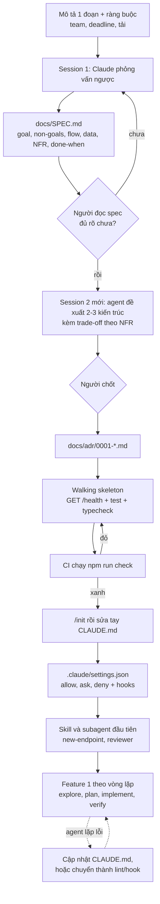
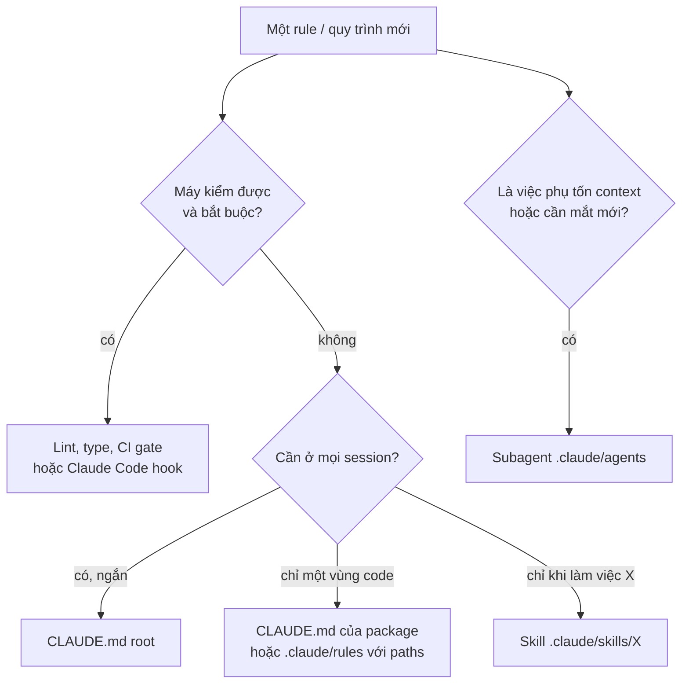

## Bối cảnh & vấn đề

Một team ba người được giao làm service `orders-api` cho web shop, MVP trong sáu tuần. Ngày đầu, một bạn mở Claude Code trong thư mục trống và gõ: *"Build an orders service with auth, payments and notifications."* Agent làm việc rất hăng: NestJS, Kafka cho event, Redis cho cache, ba service tách riêng, một `docker-compose.yml` 200 dòng. Demo cuối ngày trông ấn tượng.

Tháng thứ hai mới thấy giá. Không có spec, nên mỗi người prompt theo cách hiểu riêng: service A trả lỗi dạng `{ message }`, service B dạng `{ error: { code } }`. Không ai chọn Kafka một cách có ý thức, nhưng giờ cả ba phải vận hành broker, retry, dead-letter queue. Test chỉ có ở phần agent "tiện tay" viết, nên agent không có cách nào biết mình làm vỡ gì; mỗi feature mới kéo theo hai bug cũ. CLAUDE.md được thêm vào tuần thứ sáu, lúc code đã có ba phong cách khác nhau và agent học theo cả ba.

Không có quyết định nào ở trên là "AI sai". Agent chọn kiến trúc vì **không ai chọn thay nó**, sinh phong cách lẫn lộn vì **không có quy ước viết ra**, và không tự kiểm được vì **không có feedback loop**. Một dự án mới là thời điểm rẻ nhất để đặt ba thứ đó, và cũng là thời điểm dễ bỏ qua nhất vì "chưa có code thì cần gì CLAUDE.md".

Bài này là playbook cho ngày đầu (và tuần đầu) của một dự án greenfield với Claude Code: **spec trước và để agent phỏng vấn ngược**, **ADR do người chốt**, **walking skeleton có CI**, rồi **CLAUDE.md, `.claude/settings.json`, hooks, skills, subagents** từ ngày một. Nó dựa trên vòng lặp explore → plan → implement → verify ở [bài trước](/tracks/ai-assisted-engineering/learn/core-loop), và phần context sâu hơn nằm ở [Context engineering](/tracks/ai-assisted-engineering/learn/context-engineering).

## Khái niệm

### Spec-first và "phỏng vấn ngược"

**Spec** ở đây là một file ngắn (`docs/SPEC.md`, thường 1–2 trang) ghi: mục tiêu, **non-goals** (những gì cố ý không làm), user flow chính, data model sơ bộ, yêu cầu phi chức năng (NFR: latency, tải, bảo mật), câu hỏi còn mở, và định nghĩa "xong" có thể kiểm chứng. Nó không phải tài liệu 40 trang kiểu waterfall; nó là context bền vững mà mọi session agent sau này đều đọc được.

Vì sao spec quan trọng hơn khi có AI? Vì agent **lấp chỗ trống bằng giả định** và làm việc đó rất tự tin. Một câu "build an orders service" có hàng chục chỗ trống (auth kiểu gì, tiền lưu thế nào, có multi-tenant không); mỗi chỗ agent tự lấp là một quyết định bạn không biết mình đã đưa ra. Non-goals đặc biệt quan trọng: ghi rõ "không microservices, không event streaming trong v0.1" chặn được kiểu mở rộng phạm vi như câu chuyện ở trên.

**Phỏng vấn ngược** (interview-style spec) là kỹ thuật mà docs best practices của Claude Code khuyên dùng cho feature lớn: bạn đưa mô tả ngắn và yêu cầu Claude **phỏng vấn bạn** về implementation, UX, edge case, trade-off, rồi viết spec vào `SPEC.md`. Model giỏi đặt câu hỏi về những thứ bạn chưa nghĩ tới; bạn giữ quyền trả lời. Sau khi spec xong, docs khuyên mở **session mới** để implement, vì session mới có context sạch và spec đã nằm trong file.

**Interview angle:** interviewer muốn nghe bạn nói "spec và non-goals trước, rồi mới code" kèm lý do cụ thể (agent lấp chỗ trống bằng giả định), không phải "tôi viết prompt thật chi tiết".

### ADR và ai chốt kiến trúc

**ADR** (Architecture Decision Record, theo Michael Nygard) là một file ngắn cho mỗi quyết định kiến trúc: bối cảnh, các phương án, quyết định, hệ quả. File đánh số (`docs/adr/0001-...md`) và không sửa sau khi accepted; muốn đổi thì viết ADR mới thay thế. ADR trả lời câu hỏi mà sáu tháng sau ai cũng hỏi: "tại sao lại chọn cái này?".

Chia vai rõ ràng: **agent đề xuất phương án và trade-off, người chốt**. Agent rất hữu ích để liệt kê ba phương án với ưu nhược điểm, tìm rủi ro bạn chưa thấy, và viết nháp ADR. Nhưng lựa chọn stack, ranh giới module, cách auth, loại database là quyết định có hệ quả nhiều năm, phụ thuộc những thứ agent không biết (kỹ năng team, ngân sách vận hành, chính sách công ty). Để agent tự chọn nghĩa là chọn theo "cái phổ biến nhất trong dữ liệu huấn luyện", thường là kiến trúc của công ty lớn.

Ví dụ follow-up hay gặp: agent đề xuất microservices + Kafka cho MVP ba người. Câu trả lời tốt không phải "từ chối" mà là **đối chiếu với NFR**: tải dự kiến 50 rps, một domain, ba dev; chi phí vận hành broker, tracing phân tán, schema registry vượt xa lợi ích; chọn modular monolith với ranh giới module rõ, và ghi trong ADR **trigger** để xem xét tách service (ví dụ > 500 rps hoặc team > 8 người). Khi ADR đã tồn tại, CLAUDE.md chỉ cần trỏ tới thư mục ADR để agent không đề xuất lại cái đã bị loại.

**Interview angle:** "bạn có để AI chọn kiến trúc không?" là câu kiểm tra ownership; câu trả lời mạnh có cả vai trò (agent đề xuất, người chốt) lẫn cơ chế (ADR, trigger để xem lại).

### Walking skeleton và CI từ ngày đầu

**Walking skeleton** là phiên bản nhỏ nhất của hệ thống chạy được **từ đầu đến cuối**: một endpoint (`GET /health`), một test gọi endpoint đó qua HTTP thật, typecheck, lint, và CI chạy tất cả trên mỗi push. Nó chưa có tính năng nào, nhưng mọi "đường ống" đã thông.

Với agent, walking skeleton quan trọng vì nó tạo **feedback loop** trước khi có feature: từ commit thứ ba trở đi, mọi thay đổi của agent đều được `npm run check` kiểm, và CI chặn merge khi đỏ. Nó cũng là **mẫu** (pattern) để agent bắt chước: agent học phong cách từ code đang có, nên skeleton sạch với một test đúng kiểu sẽ được nhân bản đúng kiểu. Ngược lại, nếu thêm test "sau khi có code", agent đã có hàng nghìn dòng không test để bắt chước, và test viết sau thường chỉ khẳng định hành vi hiện tại (kể cả bug).

**Interview angle:** red flag trong câu hỏi greenfield là "thêm CLAUDE.md và test sau, khi đã có code"; nói được "skeleton + CI xanh trước feature đầu tiên" là điểm cộng rõ.

### CLAUDE.md: nội dung, phân tầng và độ dài

**CLAUDE.md** là file Markdown mà Claude Code tự nạp vào context mỗi session. Nó tồn tại ở nhiều tầng: managed (do tổ chức cài), user (`~/.claude/CLAUDE.md`, áp cho mọi project của bạn), project (`./CLAUDE.md` hoặc `./.claude/CLAUDE.md`, commit vào repo), và `./CLAUDE.local.md` (cá nhân, gitignore). CLAUDE.md ở thư mục con được nạp **khi Claude đọc file trong thư mục đó**. File có thể import file khác bằng `@path/to/file` (đường dẫn tương đối với file import, tối đa 4 tầng). Cursor dùng `.cursor/rules/`, nhiều tool khác đọc `AGENTS.md`; Claude Code đọc `AGENTS.md` khi không có CLAUDE.md ở các bản gần đây (verify), còn cách chắc chắn là để CLAUDE.md import nó bằng `@AGENTS.md`.

Nên có gì? Docs best practices đưa tiêu chí gọn: những thứ Claude **không tự suy ra được từ code**: lệnh build/test (đặc biệt cách chạy một test đơn lẻ), quy ước khác mặc định, quyết định kiến trúc riêng của project, quirk môi trường, gotcha không hiển nhiên, và những điều "đừng làm" (không sửa file generated, không thêm dependency khi chưa hỏi). Không nên có: thứ đọc code là biết, quy ước chuẩn của ngôn ngữ, tài liệu API dài (link thay vì dán), thông tin hay đổi, mô tả từng file, và câu hiển nhiên như "viết code sạch". Tuyệt đối **không để secret** trong CLAUDE.md: nó được commit và được nạp vào mọi request tới model.

Ngày đầu, chạy `/init` để Claude sinh CLAUDE.md từ codebase (lúc này là skeleton), rồi **sửa tay**: xoá thứ hiển nhiên, thêm quyết định và "đừng làm". Tiêu chí cho từng dòng: *"xoá dòng này thì Claude có mắc lỗi không?"*. Nếu không, xoá. Một CLAUDE.md 800 dòng mà agent vẫn phớt lờ vài rule là triệu chứng kinh điển: rule quan trọng chìm trong nhiễu. Cách xử lý: cắt bỏ thứ suy ra được từ code, chuyển quy trình dài sang **skill**, chuyển rule theo thư mục sang `.claude/rules/*.md` với frontmatter `paths:` (chỉ nạp khi đọc file khớp glob), chuyển rule kiểm được bằng máy sang **lint/hook**, và chỉ dùng nhấn mạnh (IMPORTANT) cho một hai dòng thật sự quan trọng.

**Interview angle:** follow-up "CLAUDE.md 800 dòng, agent vẫn bỏ qua rule" kiểm tra bạn có biết rằng dài hơn là tệ hơn và biết *chuyển* nội dung đi đâu, không chỉ "viết rõ hơn".

### Gợi ý hay bắt buộc: CLAUDE.md so với lint, type check, CI

CLAUDE.md là **gợi ý xác suất**: model đọc và thường làm theo, nhưng không có gì đảm bảo. Docs của Claude Code nói rõ: chỉ dẫn trong CLAUDE.md mang tính khuyến nghị, còn hook là deterministic và đảm bảo hành động xảy ra. Vì vậy phân vai như sau. Thứ **bắt buộc và máy kiểm được** (không `any`, không `.only` trong test, format, import boundary giữa module, không commit secret) thuộc về **lint rule, type check, pre-commit hook, CI gate, hoặc Claude Code hook**. Thứ **khó máy hoá** (pattern ưu tiên, cách đặt tên domain, "hỏi trước khi thêm dependency", đọc ADR trước khi đổi cấu trúc) thuộc về **CLAUDE.md**.

Quy tắc chuyển đổi: nếu một rule trong CLAUDE.md bị vi phạm lặp lại và máy kiểm được, chuyển nó thành lint rule hoặc hook, rồi xoá khỏi CLAUDE.md (hoặc để một dòng ngắn giải thích vì sao lint đang chặn). Ví dụ thực tế: rule "module `orders` không import internals của `customers`" ban đầu nằm trong CLAUDE.md, agent vẫn vi phạm hai lần một tuần; chuyển thành rule `no-restricted-imports` (hoặc eslint-plugin-boundaries) trong lint, CI chặn, vấn đề biến mất. Invariant bảo mật không bao giờ được chỉ dựa vào CLAUDE.md.

**Interview angle:** câu "cho ví dụ một rule bạn đã chuyển từ CLAUDE.md sang lint/hook" cần một câu chuyện cụ thể có triệu chứng, cơ chế mới và kết quả.

### CLAUDE.md, skill, subagent, hook: cái gì ở đâu

Claude Code có bốn cơ chế mở rộng hay bị nhầm vai. **CLAUDE.md** là context nạp **mỗi session**: ngắn, luôn đúng, áp dụng rộng. **Skill** (`.claude/skills/<name>/SKILL.md`, frontmatter `name`, `description`) là kiến thức hoặc quy trình nạp **khi cần**: chỉ phần description luôn hiện, phần thân được nạp khi Claude thấy liên quan hoặc bạn gọi `/<name>`; đặt `disable-model-invocation: true` cho workflow có side effect mà bạn muốn tự tay kích hoạt. Custom command cũ ở `.claude/commands/<name>.md` vẫn chạy như `/name`. **Subagent** (`.claude/agents/<name>.md`, frontmatter `name`, `description`, `tools`, `model`) là trợ lý có **context window riêng** và tập tool riêng: hợp cho việc đọc nhiều file (tìm kiếm rộng, research) hoặc cần góc nhìn mới (review diff), vì chỉ phần tóm tắt quay về context chính. **Hook** là lệnh shell **deterministic** chạy tại sự kiện (PreToolUse, PostToolUse, Stop, SessionStart...), nhận JSON trên stdin; đây là nơi cho luật **bắt buộc**.

Quy tắc một dòng: gợi ý luôn cần → CLAUDE.md; gợi ý đôi khi cần hoặc quy trình dài → skill; việc phụ tốn context hoặc cần mắt mới → subagent; luật bắt buộc → hook, lint, CI. Ví dụ: một đoạn 60 dòng trong CLAUDE.md hướng dẫn viết database migration nên chuyển thành skill `new-migration` (nạp khi làm migration), cộng một hook hoặc CI check cho phần bắt buộc (migration phải có down, không sửa migration đã merge), và một `.claude/rules/migrations.md` với `paths: ["db/migrations/**"]` nếu chỉ cần vài dòng nhắc khi đụng thư mục đó.

| Cơ chế | Khi nào nạp / chạy | Tính chất | Ví dụ |
|---|---|---|---|
| CLAUDE.md | mỗi session | gợi ý, luôn tốn context | lệnh test, quy ước lỗi JSON |
| `.claude/rules/*.md` + `paths:` | khi đọc file khớp glob | gợi ý theo vùng code | quy ước riêng cho `db/migrations/` |
| Skill | khi liên quan hoặc gọi `/name` | gợi ý / quy trình on-demand | thêm endpoint, release checklist |
| Subagent | khi được giao việc | context riêng, tool giới hạn | reviewer, research rộng |
| Hook | tại sự kiện, luôn luôn | deterministic, chặn được | typecheck sau Edit, chặn đọc `.env` |

**Interview angle:** câu "60 dòng về migration trong CLAUDE.md nên nằm đâu?" có đáp án kỳ vọng là skill cộng hook/CI cho phần bắt buộc; nói được lý do (context mặc định phình ra, rule chìm) là điểm cộng.

### Permissions và settings từ ngày một

Claude Code đọc settings từ nhiều nơi: `~/.claude/settings.json` (user), `.claude/settings.json` (project, commit vào repo để team dùng chung), `.claude/settings.local.json` (cá nhân, gitignore), và managed settings do tổ chức áp (ưu tiên cao nhất, không ghi đè được). Thứ tự ưu tiên: managed → tham số CLI → local → project → user. Trong khối `permissions` có ba danh sách: `allow` (không hỏi), `ask` (luôn hỏi), `deny` (cấm). Rule được xét theo thứ tự **deny → ask → allow**, rule khớp đầu tiên thắng, độ cụ thể không đổi thứ tự: `Bash(git push *)` trong `ask` vẫn hỏi dù có một allow cụ thể hơn, và allow không thể khoét ngoại lệ trong một deny.

Cú pháp: `Bash(npm test *)` khớp `npm test` và mọi tham số theo sau (dạng `Bash(npm test:*)` tương đương); `Read(./.env)`, `Read(./secrets/**)` theo cú pháp gitignore; `~/` là thư mục home, `//` là đường dẫn tuyệt đối; `WebFetch(domain:docs.example.com)` cho web. Nguyên tắc **least privilege**: allow cho lệnh an toàn, lặp lại, chỉ đọc hoặc chỉ chạy test (`npm run check`, `git diff`, `git status`); ask cho lệnh ghi hoặc ra mạng (`git push`, `git commit`, `npm install`, `curl`, migration); deny cho đọc secret (`.env`, `~/.ssh`, `~/.aws`) và lệnh phá huỷ.

Hai điều hay bị hiểu sai. Thứ nhất, **Bash rule không phải ranh giới bảo mật**: docs ghi rõ rule khớp văn bản lệnh mà Claude viết; `Bash(curl *)` trong deny chặn `curl https://...` nhưng không chặn `/usr/bin/curl` hay `sh -c 'curl ...'`. Ranh giới thật là **sandbox** (cô lập filesystem và network cho bash, bật bằng `/sandbox`) hoặc chạy trong container/devcontainer không có credential production. Thứ hai, chế độ `bypassPermissions` bỏ qua mọi prompt, kể cả ghi vào `.git` và `.claude`; docs chỉ khuyên dùng trong môi trường cô lập như container hoặc VM. Tổ chức có thể cấm hẳn bằng `permissions.disableBypassPermissionsMode: "disable"` trong managed settings. Các bản gần đây có **auto mode**, nơi một classifier model duyệt thay bạn hầu hết action và chỉ chặn thứ trông rủi ro (verify version và plan áp dụng).

**Interview angle:** follow-up "đồng nghiệp bật skip-all-permissions vì prompt làm chậm" cần câu trả lời vừa cảm thông vừa có giải pháp: allowlist lệnh an toàn, sandbox hoặc container, cấm bypass trong managed settings trên máy có credential thật.

### Phân tầng context cho monorepo nhiều team

Trong monorepo, một CLAUDE.md duy nhất sẽ phình to và mâu thuẫn. Cấu trúc bền vững là **phân tầng**: root CLAUDE.md chứa thứ toàn repo (lệnh build/test chung, quy ước commit, cấu trúc workspace, link tới ADR); mỗi package có CLAUDE.md riêng (domain, lib riêng, lệnh test của package), được nạp khi Claude đọc file trong thư mục đó; rule theo glob đặt ở `.claude/rules/*.md` với `paths:`; workflow tái sử dụng (tạo migration, thêm endpoint, release) thành skill trong `.claude/skills/`, có thể đóng gói thành **plugin** để chia sẻ giữa nhiều repo.

Quản trị như code: mỗi file context có **owner** qua `CODEOWNERS` (`/packages/payments/CLAUDE.md @payments-team`), thay đổi đi qua PR review. Khi hai team có quy ước mâu thuẫn (ví dụ error handling: một team throw exception có type, team kia trả `Result`), đừng ép một bên trong root: đặt quy ước **trong CLAUDE.md của package** để nó chỉ nạp ở vùng code đó, root chỉ ghi phần chung (ví dụ "ranh giới HTTP luôn trả `{ error: code }`"); nếu mâu thuẫn chạm tới interface giữa hai package, đó là quyết định kiến trúc cần ADR, không phải tranh luận trong rules file. Đo hiệu quả bằng câu hỏi đơn giản: agent còn lặp lỗi cũ không? Gom "lỗi hay gặp" từ review mỗi sprint để cập nhật.

**Interview angle:** interviewer senior muốn nghe owner, review, đo lường, và cách giải mâu thuẫn, không chỉ cây thư mục.

## Cơ chế hoạt động

Ngày đầu của một dự án có agent đi theo thứ tự cố định: **hiểu bài toán → chốt quyết định → dựng đường ống → dạy agent luật chơi → mới làm feature**. Thứ tự này quan trọng vì mỗi bước tạo context cho bước sau: spec cho ADR có tiêu chí, ADR cho skeleton có hình dạng, skeleton cho `/init` có code thật để đọc, và CLAUDE.md cùng hooks cho mọi session sau có luật để theo.



Ba điểm cần giải thích. Một, spec và kiến trúc chạy ở **hai session khác nhau**: session phỏng vấn đầy câu hỏi và nháp, còn session thiết kế nên bắt đầu sạch, chỉ đọc `SPEC.md`. Hai, `/init` chạy **sau** skeleton, không phải trong thư mục trống: lúc đó nó có `package.json`, scripts, cấu trúc thư mục thật để suy ra lệnh và quy ước; bạn sửa tay kết quả. Ba, mũi tên chấm cuối là vòng phản hồi dài hạn: mỗi lỗi agent lặp lại trở thành một dòng CLAUDE.md, và nếu dòng đó bị vi phạm tiếp mà máy kiểm được thì nó được "nâng cấp" thành lint rule hoặc hook.

Khi một quy ước mới xuất hiện trong dự án, câu hỏi thực dụng là "đặt nó ở đâu?". Cây quyết định dưới đây tóm tắt phần Khái niệm:



Lưu ý hai nhánh không loại trừ nhau: quy trình migration có thể vừa là skill (hướng dẫn cách viết) vừa có CI check (bắt buộc có down migration). Điều cần tránh là để phần bắt buộc chỉ nằm ở nhánh gợi ý.

Về cơ chế nạp, cần nhớ chi phí: CLAUDE.md root và user **luôn** chiếm context; CLAUDE.md thư mục con và `.claude/rules` có `paths:` chỉ tốn khi chạm vùng đó; skill chỉ tốn phần description cho tới khi được dùng; subagent tốn context của *chính nó*, context chính chỉ nhận tóm tắt; hook không tốn context trừ khi nó in output cho Claude (ví dụ stderr khi exit 2). Chạy `/context` để xem cụ thể cái gì đang chiếm cửa sổ context, và `/memory` để xem file memory nào đang được nạp.

## Ví dụ thực tế

Phần này là playbook ngày một cho `orders-api` ở phần Bối cảnh, làm lại đúng cách. Mọi file dưới đây được tạo và chạy thật trong một repo scratch (Node 24.21, TypeScript 5.9.3); transcript hội thoại với agent được ghi là minh hoạ.

### Lịch ngày một (checklist)

| Thời gian | Việc | Output kiểm được |
|---|---|---|
| 0:00–1:00 | Session 1: phỏng vấn ngược, viết spec | `docs/SPEC.md` có non-goals và done-when |
| 1:00–1:45 | Session 2: agent đề xuất 2–3 kiến trúc, người chốt | `docs/adr/0001-*.md` status accepted |
| 1:45–3:00 | Walking skeleton: `/health` + test + typecheck | `npm run check` xanh ở local |
| 3:00–3:30 | CI | workflow chạy xanh trên push |
| 3:30–4:30 | `/init`, sửa tay CLAUDE.md; settings, hooks | hook test bằng JSON mẫu, `jq` đọc settings |
| 4:30–5:00 | Skill `new-endpoint`, subagent `reviewer` | file commit trong `.claude/` |
| 5:00– | Feature đầu tiên theo vòng lặp explore → plan → implement → verify | PR nhỏ, CI xanh |

Mỗi dòng là một commit. Nếu hết ngày mới tới dòng 4, vẫn tốt hơn nhiều so với có ba feature mà không có CI.

### Session 1: phỏng vấn ngược để ra spec

Prompt mở đầu, dựa trên mẫu trong docs best practices:

```text
Tôi muốn xây orders-api: API nội bộ để web shop tạo và tra cứu đơn hàng.
Team 3 dev, MVP trong 6 tuần, tải dự kiến 50 rps. Stack team quen: Node + TypeScript + Postgres.

Phỏng vấn tôi chi tiết. Hỏi về implementation, edge case, NFR, bảo mật và trade-off.
Đừng hỏi câu hiển nhiên; đào vào phần khó mà tôi có thể chưa nghĩ tới.
Hỏi cho tới khi đủ, rồi viết docs/SPEC.md gồm: Goal, Non-goals, User flows,
Data model, NFR, Open questions (có owner + hạn), Done when (kiểm chứng được).
Chưa viết code.
```

So với prompt tệ *"Build an orders service with auth, payments and notifications"*, prompt này cho ràng buộc (team, deadline, tải, stack), yêu cầu hỏi trước, định dạng output, và cấm code. Một đoạn hỏi đáp điển hình (minh hoạ):

```text
Claude: Tổng tiền lưu kiểu gì? Nếu có giảm giá theo %, làm tròn ở đâu?
Bạn:    Số nguyên VND, làm tròn xuống ở bước tính discount.
Claude: Đơn đã huỷ có được khôi phục không? Có cần lưu lý do huỷ cho CS?
Bạn:    Không khôi phục. Lý do huỷ: chưa biết, ghi vào open questions cho PO.
Claude: Web shop gọi API bằng gì để xác thực: user token hay service credential?
Bạn:    Service-to-service, API key qua header, rotate hàng quý.
```

Spec kết quả (rút gọn, 15 dòng):

```markdown
# orders-api — SPEC v0.1 (2026-09-30)
## Goal
API nội bộ để tạo và tra cứu đơn hàng cho web shop. 3 dev, MVP trong 6 tuần.
## Non-goals (v0.1)
Thanh toán online, đa tiền tệ, microservices, event streaming.
## User flows
1. Web shop POST /orders với cart → 201 + order id.  2. CS tra GET /orders/:id.
## Data model
Order(id uuid, customer_id, status: pending|paid|cancelled, total_vnd int, created_at)
## NFR
p95 < 200 ms ở 50 rps; mọi endpoint có test; không log PII.
## Open questions
- Đơn bị huỷ có cần lưu lý do? (owner: PO, trước 2026-10-07)
## Done when
`npm run check` xanh trên CI và smoke test POST → GET chạy qua được.
```

### Session 2: agent đề xuất, người chốt, ghi ADR

Mở session mới (`/clear` hoặc terminal mới) để context sạch, rồi:

```text
Đọc @docs/SPEC.md. Đề xuất 3 kiến trúc khả thi cho v0.1. Với mỗi cái: ưu, nhược,
chi phí vận hành cho team 3 người, rủi ro với NFR. Đừng chọn thay tôi.
Sau khi tôi chọn, viết docs/adr/0001-<slug>.md theo mẫu Nygard.
```

Nếu agent đề xuất microservices + Kafka như một phương án, đó là việc tốt: nó nằm trong bảng so sánh, và bạn loại nó bằng lý lẽ ghi lại được. ADR được commit:

```markdown
# ADR 0001: Modular monolith + PostgreSQL
Status: accepted · Date: 2026-09-30 · Deciders: tech lead (người), agent chỉ đề xuất
## Context
3 dev, 1 domain (orders), tải dự kiến 50 rps. Agent đề xuất 3 phương án.
## Options
1. Modular monolith Node + Postgres — 1 deploy, transaction đơn giản.
2. Microservices + Kafka — scale độc lập, nhưng 3 dev phải vận hành broker, tracing, schema registry.
3. Serverless functions + DynamoDB — rẻ lúc idle, nhưng query tra cứu linh hoạt khó.
## Decision
Chọn 1. Ranh giới module: src/orders, src/customers; module không import internals của nhau.
## Consequences
Tách service sau nếu một module cần scale riêng; ghi lại trigger: > 500 rps hoặc team > 8 người.
```

### Walking skeleton chạy được

Skeleton cố ý tối giản: `node:http`, `node:test`, không framework, để minh hoạ đường ống (trong dự án thật bạn dùng framework mà ADR chọn). Node 24 chạy `.ts` trực tiếp nhờ type stripping, nên `tsconfig.json` bật `erasableSyntaxOnly` để cấm cú pháp không strip được (enum, namespace).

```ts
// src/app.ts
import { createServer, type Server } from 'node:http';

export function buildServer(): Server {
  return createServer((req, res) => {
    if (req.method === 'GET' && req.url === '/health') {
      res.writeHead(200, { 'content-type': 'application/json' });
      res.end(JSON.stringify({ status: 'ok' }));
      return;
    }
    res.writeHead(404, { 'content-type': 'application/json' });
    res.end(JSON.stringify({ error: 'not_found' }));
  });
}
```

```ts
// src/app.test.ts — test gọi HTTP thật, không mock
import { test, after } from 'node:test';
import assert from 'node:assert/strict';
import type { AddressInfo } from 'node:net';
import { buildServer } from './app.ts';

const server = buildServer().listen(0);
const { port } = server.address() as AddressInfo;
after(() => server.close());

test('GET /health returns ok', async () => {
  const res = await fetch(`http://127.0.0.1:${port}/health`);
  assert.equal(res.status, 200);
  assert.deepEqual(await res.json(), { status: 'ok' });
});

test('unknown route returns 404 json', async () => {
  const res = await fetch(`http://127.0.0.1:${port}/nope`);
  assert.equal(res.status, 404);
  assert.deepEqual(await res.json(), { error: 'not_found' });
});
```

```json
{
  "scripts": {
    "dev": "node --watch src/server.ts",
    "test": "node --test 'src/**/*.test.ts'",
    "typecheck": "tsc --noEmit",
    "check": "npm run typecheck && npm test"
  }
}
```

Chạy `npm run check`:

```text
> check
> npm run typecheck && npm test
> typecheck
> tsc --noEmit
> test
> node --test 'src/**/*.test.ts'
✔ GET /health returns ok (13.493958ms)
✔ unknown route returns 404 json (2.117917ms)
ℹ tests 2
ℹ pass 2
ℹ fail 0
```

Một lệnh duy nhất (`npm run check`) là thứ bạn sẽ nhắc trong CLAUDE.md, allowlist trong settings, gọi trong hook và chạy trong CI. CI tối thiểu:

```yaml
# .github/workflows/ci.yml
name: ci
on: [push, pull_request]
jobs:
  check:
    runs-on: ubuntu-latest
    steps:
      - uses: actions/checkout@v4
      - uses: actions/setup-node@v4
        with: { node-version: 24, cache: npm }
      - run: npm ci
      - run: npm run check
```

### CLAUDE.md sau `/init` và sửa tay

`/init` sinh bản nháp từ skeleton; bản sau khi sửa tay chỉ 22 dòng. Mỗi dòng trả lời được câu "xoá đi thì agent có sai không?".

```markdown
# orders-api
Node 24 + TypeScript 5.9 (type stripping, chạy .ts trực tiếp), node:http, node:test. PostgreSQL 17 (verify khi thêm DB).
Spec: @docs/SPEC.md · Quyết định kiến trúc: docs/adr/ (đọc trước khi đề xuất thay đổi cấu trúc)

## Commands
- `npm run check` — typecheck + toàn bộ test (chạy trước khi báo xong)
- `npm test` · một file: `node --test src/app.test.ts`
- `npm run dev` — server ở :3000

## Layout
- src/app.ts: buildServer(), routing · src/<module>/: orders, customers (không import internals của module khác)
- docs/adr/NNNN-*.md: một quyết định một file

## Conventions
- Lỗi HTTP trả JSON `{ "error": "<snake_case_code>" }`, không trả stack trace
- Tiền là số nguyên VND (`total_vnd`), không dùng float
- Mỗi endpoint mới: test trong cùng thư mục (`*.test.ts`) trước khi implement

## Don't
- Không thêm dependency mà không hỏi (ghi lý do + phương án không cần dependency)
- Không sửa docs/adr/ đã accepted; đề xuất ADR mới thay thế
- Không đọc .env; dùng .env.example
```

Để ý ba điểm: **version chính** của stack được ghi ngay dòng đầu (chống version drift, xem [bài trước](/tracks/ai-assisted-engineering/learn/core-loop)); spec được import bằng `@docs/SPEC.md` nên luôn nằm trong context; và rule "module không import internals của nhau" hiện đang ở CLAUDE.md, nhưng khi có module thứ hai nó nên được chuyển thành lint rule vì máy kiểm được.

### `.claude/settings.json`: permissions và hooks

```json
{
  "permissions": {
    "allow": [
      "Bash(npm run check)",
      "Bash(npm run typecheck)",
      "Bash(npm test *)",
      "Bash(git status)",
      "Bash(git diff *)",
      "Bash(git log *)"
    ],
    "ask": [
      "Bash(npm install *)",
      "Bash(git push *)",
      "Bash(git commit *)",
      "Bash(curl *)"
    ],
    "deny": [
      "Read(./.env)",
      "Read(./.env.*)",
      "Read(./secrets/**)",
      "Read(~/.ssh/**)",
      "Read(~/.aws/**)",
      "Bash(git push --force *)",
      "Bash(rm -rf *)"
    ]
  },
  "hooks": {
    "PreToolUse": [
      { "matcher": "Bash",
        "hooks": [{ "type": "command", "command": "\"$CLAUDE_PROJECT_DIR\"/.claude/hooks/guard-bash.sh" }] }
    ],
    "PostToolUse": [
      { "matcher": "Edit|Write",
        "hooks": [{ "type": "command", "command": "\"$CLAUDE_PROJECT_DIR\"/.claude/hooks/typecheck-changed.sh" }] }
    ]
  }
}
```

Review settings bằng `jq` (hữu ích trong PR khi ai đó mở rộng quyền):

```bash
jq -r '.permissions | to_entries[] | "\(.key) (\(.value|length)): \(.value|join(", "))"' .claude/settings.json
```

```text
allow (6): Bash(npm run check), Bash(npm run typecheck), Bash(npm test *), Bash(git status), Bash(git diff *), Bash(git log *)
ask (4): Bash(npm install *), Bash(git push *), Bash(git commit *), Bash(curl *)
deny (7): Read(./.env), Read(./.env.*), Read(./secrets/**), Read(~/.ssh/**), Read(~/.aws/**), Bash(git push --force *), Bash(rm -rf *)
```

Vì thứ tự là deny → ask → allow, `git push --force origin main` bị chặn bởi deny dù `git push *` nằm trong ask. Nhưng `git push -f` thì không khớp deny này, và như docs cảnh báo, Bash rule không phải ranh giới bảo mật. Vì vậy có thêm lớp hook. Hook nhận JSON trên stdin; không có biến template kiểu `{{command}}`:

```bash
#!/usr/bin/env bash
# .claude/hooks/guard-bash.sh — PreToolUse(Bash): lớp chặn thứ hai bên cạnh permissions.deny.
cmd=$(jq -r '.tool_input.command // empty')
if grep -Eq '(^|[;&| ])(cat|less|head|tail|source) +\.env|printenv|git +push +.*--force|--no-verify' <<<"$cmd"; then
  echo "BLOCKED by guard-bash.sh: '$cmd' đọc secret, force-push hoặc bỏ qua hook. Hỏi người trước." >&2
  exit 2
fi
exit 0
```

Test hook bằng JSON mẫu, không cần mở Claude Code:

```bash
for c in 'cat .env' 'git push --force origin main' 'git commit --no-verify -m wip' 'npm test'; do
  jq -n --arg c "$c" '{hook_event_name:"PreToolUse",tool_name:"Bash",tool_input:{command:$c}}' \
    | ./.claude/hooks/guard-bash.sh; echo "[$c] exit=$?"
done
```

```text
BLOCKED by guard-bash.sh: 'cat .env' đọc secret, force-push hoặc bỏ qua hook. Hỏi người trước.
[cat .env] exit=2
BLOCKED by guard-bash.sh: 'git push --force origin main' đọc secret, force-push hoặc bỏ qua hook. Hỏi người trước.
[git push --force origin main] exit=2
BLOCKED by guard-bash.sh: 'git commit --no-verify -m wip' đọc secret, force-push hoặc bỏ qua hook. Hỏi người trước.
[git commit --no-verify -m wip] exit=2
[npm test] exit=0
```

Hook thứ hai typecheck ngay sau mỗi lần agent sửa file `.ts`. Với PostToolUse, tool đã chạy xong; exit 2 không huỷ được edit nhưng đưa stderr lại cho Claude để nó sửa ngay:

```bash
#!/usr/bin/env bash
# .claude/hooks/typecheck-changed.sh — PostToolUse(Edit|Write)
file=$(jq -r '.tool_input.file_path // empty')
[[ "$file" == *.ts ]] || exit 0
cd "${CLAUDE_PROJECT_DIR:-.}"
if ! out=$(npx --no-install tsc --noEmit 2>&1); then
  echo "Typecheck failed after editing $file:" >&2
  echo "$out" | head -10 >&2
  exit 2   # PostToolUse: tool đã chạy; stderr được đưa lại cho Claude để sửa
fi
exit 0
```

Giả lập agent sửa `res.writeHead(200, ...)` thành `res.writeHead('200', ...)` rồi gửi JSON mẫu (đường dẫn scratch được rút gọn thành `.../orders-api`):

```text
Typecheck failed after editing .../orders-api/src/app.ts:
src/app.ts(6,21): error TS2769: No overload matches this call.
  Overload 1 of 2, '(statusCode: number, statusMessage?: string | undefined, headers?: OutgoingHttpHeaders | OutgoingHttpHeader[] | undefined): ServerResponse<...> & { ...; }', gave the following error.
    Argument of type 'string' is not assignable to parameter of type 'number'.
exit=2
```

Sau khi khôi phục file, cùng lệnh trả `exit=0`. Với project lớn, `tsc --noEmit` toàn bộ có thể mất nhiều giây sau mỗi edit; khi đó chuyển sang lint/format file đơn lẻ trong hook và để typecheck đầy đủ cho Stop hook hoặc CI.

### Skill và subagent đầu tiên

Quy trình "thêm endpoint" sẽ lặp lại hàng chục lần, nên nó là skill, không phải 15 dòng trong CLAUDE.md:

```markdown
---
name: new-endpoint
description: Thêm một HTTP endpoint mới vào orders-api theo quy ước của repo (test trước, lỗi JSON, module boundary). Dùng khi được yêu cầu thêm route/API mới.
---
# Thêm endpoint
1. Đọc docs/SPEC.md và ADR liên quan. Nếu endpoint không có trong spec, dừng và hỏi.
2. Viết test trong `src/<module>/<name>.test.ts`: happy path, 400 input sai, 404.
3. Dừng, đưa test cho người duyệt. Chỉ implement sau khi được đồng ý.
4. Implement trong `src/<module>/`, đăng ký route trong `src/app.ts`.
5. Chạy `npm run check`, dán output.
```

Reviewer là subagent vì nó cần context mới (không thiên vị code vừa viết) và chỉ cần tool đọc:

```markdown
---
name: reviewer
description: Review diff hiện tại so với docs/SPEC.md và ADR trong context mới. Dùng sau khi implement xong, trước khi commit.
tools: Read, Grep, Glob, Bash
---
Bạn là reviewer khó tính. Chạy `git diff` và đối chiếu với docs/SPEC.md, docs/adr/.
Chỉ báo lỗi ảnh hưởng correctness, security, hoặc vi phạm ADR/conventions trong CLAUDE.md.
Mỗi finding: file:line, vấn đề, cách sửa. Không báo style preference.
```

Dòng "không báo style preference" có lý do: docs cảnh báo reviewer được yêu cầu tìm lỗi thì gần như luôn tìm ra *thứ gì đó*, và đuổi theo mọi finding dẫn tới over-engineering.

### Kết quả cuối ngày một

```bash
git log --oneline --reverse
git check-ignore -v .claude/settings.local.json CLAUDE.local.md .env
```

```text
a3b3774 docs: SPEC v0.1
76c74ce docs: ADR 0001 modular monolith + postgres
c05d3cb chore: walking skeleton (GET /health + test + typecheck)
1df6eaa ci: run npm run check on push/PR
c129e5f chore: CLAUDE.md, settings, hooks, skill, reviewer agent

.gitignore:5:.claude/settings.local.json	.claude/settings.local.json
.gitignore:6:CLAUDE.local.md	CLAUDE.local.md
.gitignore:2:.env	.env
```

Năm commit, mỗi cái là một checkpoint có ý nghĩa. File cá nhân (`settings.local.json`, `CLAUDE.local.md`) và secret (`.env`) đã được gitignore; file dùng chung (`CLAUDE.md`, `.claude/settings.json`, hooks, skills, agents) nằm trong repo để mọi người và mọi session đều có cùng luật chơi.

### Tuần một sau skeleton

- **Ngày 2**: feature đầu tiên (`POST /orders`) qua skill `new-endpoint`; plan mode; người duyệt test trước khi implement; subagent `reviewer` trước commit.
- **Ngày 3**: thêm Postgres theo ADR; ghi version vào CLAUDE.md; thêm integration test chạy DB thật (container) vào CI.
- **Ngày 4**: gom lỗi agent lặp lại trong hai ngày qua; chuyển rule máy kiểm được sang lint (ví dụ import boundary giữa module); cắt dòng CLAUDE.md không còn cần.
- **Ngày 5**: retro 15 phút về workflow: prompt nào hiệu quả, permission nào gây phiền (thêm vào allow nếu an toàn), hook nào chậm.

## Trade-offs & lựa chọn thay thế

| Lựa chọn | Ưu | Nhược | Khi nào |
|---|---|---|---|
| Spec-first + phỏng vấn ngược | ít giả định ngầm, context bền vững | mất 1 giờ đầu | mọi dự án sống lâu hơn vài tuần |
| Prototype-first (vibe code rồi vứt) | học nhanh bài toán lạ | dễ lỡ tay giữ prototype làm production | spike 1–2 ngày, ghi rõ sẽ vứt |
| Agent tự chọn kiến trúc | nhanh | chọn theo "phổ biến", không theo ràng buộc của bạn | gần như không bao giờ cho code production |
| Agent đề xuất, người chốt, ghi ADR | quyết định có lý do, xem lại được | cần người có kinh nghiệm chốt | mặc định |
| CLAUDE.md dài, chi tiết | mọi thứ ở một chỗ | rule chìm, tốn context mỗi session | không nên |
| CLAUDE.md ngắn + skill + rules theo `paths:` | context gọn, nạp đúng lúc | phải bảo trì nhiều file | dự án vừa và lớn, monorepo |
| Permissions chặt + sandbox | an toàn, ít prompt với lệnh đã allow | tốn công cấu hình ngày đầu | repo công việc thật |
| `bypassPermissions` | không prompt | không có lưới an toàn | chỉ trong container/VM cô lập |

Spec-first không có nghĩa là cấm thử nghiệm. Nếu bạn chưa hiểu bài toán (ví dụ tích hợp một API bên thứ ba lạ), một **spike** vài giờ với agent chạy thoải mái trong branch riêng là cách học nhanh; điều kiện là spike bị vứt đi, và bài học của nó đi vào spec và ADR. Cái sai là để spike trở thành nền móng.

Về công cụ: nếu team dùng Cursor song song, giữ một nguồn sự thật cho quy ước (ví dụ `AGENTS.md` được CLAUDE.md import bằng `@AGENTS.md`, và rules của Cursor trỏ cùng nội dung) thay vì duy trì hai bộ rule lệch nhau. Hook, subagent và skill là cơ chế riêng của Claude Code; phần bắt buộc nên nằm ở lint và CI để áp dụng cho mọi tool và cả người.

## Edge cases & failure modes

- **`/init` trong thư mục trống**: không có code để suy ra lệnh và quy ước, kết quả là CLAUDE.md chung chung. Chạy sau khi có skeleton.
- **Spec lỗi thời**: requirement đổi ở tuần 3 nhưng `SPEC.md` không đổi; agent vẫn đọc spec cũ (qua `@import`) và làm theo. Spec phải được cập nhật trong cùng PR với thay đổi hành vi (xem [Khi requirement thay đổi](/tracks/ai-assisted-engineering/learn/requirement-change)).
- **CLAUDE.md mâu thuẫn với code**: CLAUDE.md nói "dùng zod" nhưng code cũ dùng validation tay; agent học theo code nhiều hơn theo chỉ dẫn. Hoặc migrate code, hoặc sửa CLAUDE.md cho đúng hiện trạng và ghi hướng chuyển đổi.
- **Hook chậm làm session ì**: `tsc --noEmit` toàn repo 20 giây sau mỗi edit. Giới hạn hook vào file vừa sửa hoặc chạy nhẹ, để check nặng cho Stop hook/CI.
- **Hook hỏng chặn mọi thứ**: script có lỗi cú pháp hoặc thiếu `jq` trên máy một thành viên. Test hook bằng JSON mẫu trong CI, ghi dependency (jq) trong README, và in lỗi rõ ràng ra stderr.
- **Settings project bị ghi đè cục bộ**: một người thêm allow rộng vào `settings.local.json`. Local ưu tiên hơn project, nên nếu cần bắt buộc (deny đọc secret) thì đặt trong managed settings của tổ chức.
- **Bash rule bị lách**: deny `Bash(curl *)` không chặn `sh -c 'curl ...'`. Ranh giới thật là sandbox, container không có credential production, và network egress control.
- **Monorepo: rule package này rò sang package khác**: đặt quy ước riêng trong root CLAUDE.md thay vì CLAUDE.md của package, nên agent áp nó ở mọi nơi. Giữ root cho thứ thật sự toàn repo.
- **Secret trong CLAUDE.md hoặc settings**: ai đó dán connection string production "để agent chạy được migration". File đó được commit và gửi lên model mỗi session. Dùng env var, `.env` bị deny đọc, và secret scanning trong CI.

## Pitfalls

- ❌ "Build the whole app" từ một đoạn prompt → ✅ spec qua phỏng vấn ngược, ADR, skeleton, rồi từng feature nhỏ. Vì agent lấp mọi chỗ trống bằng giả định.
- ❌ Để agent chọn stack và kiến trúc → ✅ agent liệt kê 2–3 phương án với trade-off, người chốt, ghi ADR có trigger xem lại. Vì quyết định kiến trúc phụ thuộc thứ agent không biết (team, ngân sách, vận hành).
- ❌ Thêm CLAUDE.md và test "sau khi có code" → ✅ skeleton + CI xanh + CLAUDE.md ngày một. Vì agent bắt chước code đang có; không có test thì không có feedback loop.
- ❌ Chạy `/init` rồi commit nguyên kết quả → ✅ sửa tay, xoá dòng hiển nhiên, thêm quyết định và "đừng làm". Vì CLAUDE.md tự sinh thường mô tả thứ đọc code là biết.
- ❌ CLAUDE.md 800 dòng chứa mọi quy trình → ✅ CLAUDE.md ngắn, quy trình thành skill, rule theo vùng thành `.claude/rules` với `paths:`, rule máy kiểm được thành lint/hook. Vì rule quan trọng chìm trong nhiễu và mọi dòng đều tốn context.
- ❌ Dựa vào CLAUDE.md cho invariant bảo mật ("đừng đọc .env") → ✅ `permissions.deny` + hook + sandbox. Vì CLAUDE.md là gợi ý xác suất.
- ❌ Bật `bypassPermissions` trên laptop có credential thật vì prompt phiền → ✅ allowlist lệnh an toàn, sandbox, container cho việc chạy dài; managed settings cấm bypass. Vì một lệnh sai là mất dữ liệu hoặc lộ secret.
- ❌ Dán secret vào CLAUDE.md hoặc settings "cho tiện" → ✅ env var, `.env` gitignore và deny đọc, secret scanning. Vì file đó được commit và gửi tới model mỗi session.

## Tóm tắt

- Ngày một theo thứ tự: **spec (phỏng vấn ngược) → ADR (người chốt) → walking skeleton + CI → CLAUDE.md, settings, hooks → skill/subagent → feature đầu tiên**; mỗi bước một commit.
- Spec có **non-goals** và **done-when** kiểm chứng được; session thiết kế và implement bắt đầu với context sạch và đọc spec từ file.
- Agent đề xuất kiến trúc với trade-off theo NFR, **người chốt**; ADR ghi lý do và trigger xem lại (ví dụ microservices + Kafka bị loại cho MVP ba người).
- Walking skeleton cho agent feedback loop và mẫu để bắt chước; một lệnh `npm run check` dùng chung cho CLAUDE.md, allowlist, hook và CI.
- CLAUDE.md: `/init` sau skeleton rồi sửa tay; chỉ ghi thứ không suy ra được từ code; ngắn; không secret; phân tầng user/project/local/thư mục con, `@import`, `.claude/rules` với `paths:`.
- Gợi ý → CLAUDE.md, skill; việc phụ tốn context → subagent; luật bắt buộc và máy kiểm được → hook, lint, CI.
- Permissions: deny → ask → allow; allow lệnh an toàn, ask lệnh ghi/mạng, deny đọc secret; Bash rule không phải ranh giới bảo mật, sandbox/container mới là; `bypassPermissions` chỉ trong môi trường cô lập.
- Monorepo: root cho thứ toàn repo, CLAUDE.md theo package, skill/plugin cho workflow chung, CODEOWNERS cho file context, mâu thuẫn chạm interface thì viết ADR.
