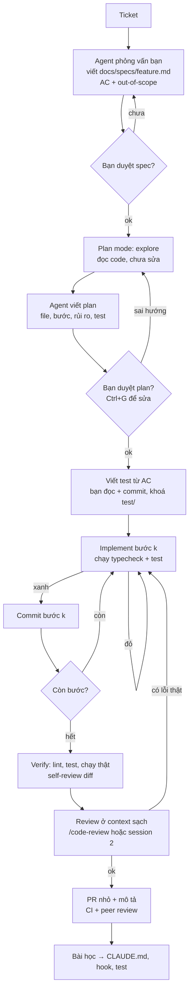
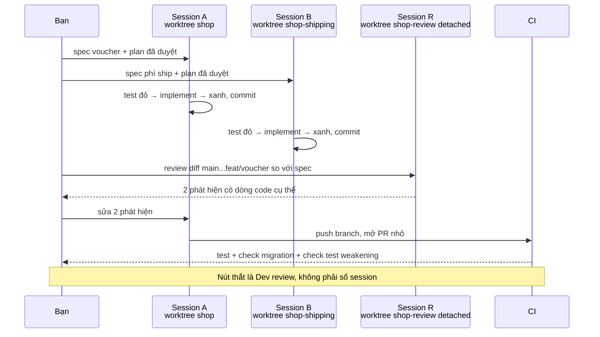

## Bối cảnh & vấn đề

Thứ Hai, một dev nhận ticket "Cho phép khách áp voucher giảm giá ở checkout". Anh mở Claude Code, dán nguyên câu đó vào và gõ Enter. Bốn mươi phút sau agent báo "Done, all tests pass". Diff dài 1.400 dòng, đụng 23 file: thêm bảng `vouchers`, thêm cả voucher phần trăm (không ai yêu cầu), refactor luôn `PriceCalculator` "cho sạch", và trong `checkout.test.ts` có một assertion bị đổi từ `toEqual({ total: 0 })` thành `toBeDefined()`. Reviewer mở PR, thấy con số 1.400, để đó "chiều xem". Ba ngày sau PR vẫn nằm đó, conflict với hai branch khác.

Không có dòng nào trong câu chuyện trên là "AI dở". Model làm đúng thứ nó được giao: một yêu cầu mơ hồ, không giới hạn phạm vi, không có định nghĩa "xong" mà máy kiểm được, không có điểm dừng để người duyệt hướng đi. Agent **lấp khoảng trống bằng phỏng đoán**, và phỏng đoán của một agent tự tin thì to và nhanh. Khi bạn phát hiện sai hướng ở bước review, chi phí sửa đã gấp nhiều lần so với nếu phát hiện ở bước plan.

Bài này là playbook cho một feature đi từ ticket tới PR với Claude Code: chuẩn hoá ticket thành **acceptance criteria**, bắt agent **explore và plan** trước khi viết code, khoá **test làm spec**, implement **từng bước nhỏ** có checkpoint, **self-review** và **review bằng session thứ hai**, rồi mở **PR nhỏ** có mô tả tử tế. Phần cuối nói về chạy **nhiều session song song bằng git worktree** và làm **refactor cơ học lớn** mà không sinh ra một diff không ai đọc nổi. Vòng lặp nền tảng explore → plan → implement → verify được giải thích kỹ ở [bài Core loop](/tracks/ai-assisted-engineering/learn/core-loop); ở đây ta áp nó vào một feature thật, từng lệnh một.

## Khái niệm

### Acceptance criteria: biến ticket thành thứ kiểm được

**Acceptance criteria (AC)** là danh sách điều kiện cụ thể mà feature phải thoả để được coi là xong. Một AC tốt có thể biến thẳng thành test: có input, có hành vi mong đợi, có case lỗi. "Cho phép áp voucher" không phải AC; "voucher 80.000đ áp vào giỏ 200.000đ → tổng 120.000đ" là AC. Viết AC trước khi mở agent vì agent không có cách nào biết điều bạn chưa nói; mọi chỗ trống sẽ được lấp bằng giả định phổ biến nhất trên Internet, không phải quy tắc của business bạn.

Cách nhanh nhất để có AC là để agent **phỏng vấn bạn** thay vì để nó tự viết spec. Tài liệu best practices của Claude Code gợi ý đúng mẫu này: yêu cầu agent hỏi bạn từng câu về feature, rồi ghi kết quả ra file spec. Agent giỏi đặt câu hỏi về edge case mà bạn quên (voucher hết hạn, tổng âm, dùng hai voucher cùng lúc), còn bạn là người có câu trả lời.

```text
Prompt (tốt):
Đọc ticket dưới đây. Đừng viết code. Hãy phỏng vấn tôi từng câu một về các
quy tắc nghiệp vụ và edge case còn thiếu (tối đa 8 câu). Sau đó viết
docs/specs/voucher.md gồm: mục tiêu, ngoài phạm vi, acceptance criteria dạng
Given/When/Then, và câu hỏi còn mở.
<ticket> Khách có thể áp một voucher cố định khi checkout. </ticket>

Prompt (tệ):
Làm feature voucher cho checkout.
```

Mục **ngoài phạm vi** (out of scope) quan trọng ngang AC: "không hỗ trợ voucher phần trăm, không stack nhiều voucher, không đổi `PriceCalculator`". Đây là hàng rào ngăn agent "tiện tay" làm thêm.

**Interview angle:** interviewer muốn nghe bạn nói "tôi viết AC và out-of-scope trước khi giao cho agent", và cách bạn lấy AC từ PO/ticket chứ không để AI tự bịa quy tắc nghiệp vụ.

### Explore và plan: rẻ nhất để sửa hướng

**Explore** là pha agent đọc code liên quan mà chưa sửa gì: tìm entrypoint của checkout, xem `PriceCalculator`, xem pattern test đang dùng. **Plan** là pha agent viết ra kế hoạch: file nào sẽ đổi, theo thứ tự nào, rủi ro gì, test nào sẽ thêm. Trong Claude Code, **plan mode** là permission mode chỉ cho phép đọc và nghiên cứu; bạn vào bằng Shift+Tab (xoay vòng các mode) hoặc khởi động với `claude --permission-mode plan`. Khi plan đã có, Ctrl+G mở plan trong editor để bạn sửa trực tiếp trước khi cho agent làm.

Vì sao bước này đáng giá nhất? Vì plan là **bản tóm tắt ý định** dài 20–40 dòng, đọc trong hai phút, trong khi diff là hàng trăm dòng. Nếu agent hiểu sai ("sẽ thêm cột `discount_percent`"), bạn sửa một dòng chữ thay vì revert một PR. Bỏ plan thì agent vẫn có một plan, chỉ là nó nằm trong đầu model và bạn chỉ thấy khi đã thành code. Một plan tốt trả lời được: đổi file nào, không đổi file nào, test nào chứng minh xong, bước nào có rủi ro (migration, API công khai).

Khi nào bỏ plan được? Khi task đủ nhỏ để diff chính là plan: sửa typo, rename một biến cục bộ, thêm một field vào log. Quy tắc thực dụng: nếu bạn mô tả được diff mong muốn trong một câu, cứ để agent làm thẳng.

**Interview angle:** câu 048 xoáy vào "vì sao bỏ plan là nguyên nhân phổ biến nhất của output tệ"; câu trả lời mạnh nói về chi phí phát hiện sai hướng tăng theo từng pha, và nêu được ngưỡng khi nào bỏ plan là hợp lý.

### Tests as spec: định nghĩa "đúng" bằng thứ máy chạy được

**Tests as spec** nghĩa là bạn viết (hoặc duyệt kỹ từng dòng) test trước, test đó mã hoá AC, rồi giao agent implement cho tới khi test xanh. Test trở thành **feedback loop tự động** cho agent: nó chạy `npm test`, đọc lỗi, sửa, lặp lại, không cần bạn ngồi kể "sai rồi". Đồng thời bạn review một thứ ngắn và dễ đọc (test) thay vì chỉ review implementation.

Bẫy lớn nhất: agent có thể "làm xanh" bằng cách **sửa test** thay vì sửa code: nới assertion, thêm `.skip`, đổi giá trị mong đợi cho khớp output sai. Vì vậy test phải được **khoá** trong pha implement. Có ba lớp khoá, từ mềm tới cứng: dặn trong prompt/CLAUDE.md ("không sửa file trong `test/`"), một **PreToolUse hook** chặn Edit/Write vào `test/` (exit code 2 chặn tool call và đưa stderr về cho Claude), và một **CI check** so sánh `test/` với commit spec. Lớp sau bắt được thứ lớp trước lọt.

Nếu để agent tự viết cả test lẫn code trong cùng một lượt, test thường **khẳng định hành vi hiện tại** kể cả bug. Nếu muốn agent viết test, tách thành bước riêng: agent đề xuất test từ AC, bạn đọc và commit, rồi mới sang implement.

**Interview angle:** follow-up kinh điển là "làm sao chặn agent sửa assertion cho pass?"; trả lời bằng cơ chế cụ thể (hook, deny, CI diff), không chỉ "tôi dặn nó".

### Implement từng bước nhỏ, có checkpoint

Sau khi plan được duyệt, agent implement **từng bước** trong plan, chạy typecheck/test sau mỗi bước. Mỗi bước xanh thì commit (hoặc ít nhất để agent dừng lại báo cáo). Lý do: khi bước 4 hỏng, bạn quay về bước 3 chứ không phải về con số 0, và `git log` kể lại câu chuyện cho reviewer.

Claude Code tạo **checkpoint** ở mỗi prompt; nhấn Esc hai lần hoặc `/rewind` để khôi phục hội thoại, code, hoặc cả hai. Checkpoint không undo được side effect bên ngoài (ghi DB, `git push`, gọi API), nên commit git vẫn là mốc chính. Nhấn Esc một lần để **ngắt** agent ngay khi thấy nó đi sai; sửa hướng sớm rẻ hơn để nó chạy hết. Nếu đã sửa hai lần mà agent vẫn lặp lại cùng một lỗi, đó là dấu hiệu context đã bẩn: `/clear` và bắt đầu lại với prompt tốt hơn (kèm những gì bạn vừa học được).

**Interview angle:** interviewer muốn thấy bạn có "điểm dừng" rõ ràng giữa các bước, và biết giới hạn của checkpoint (không undo side effect ngoài).

### Verify và self-review trước khi nhờ người khác

**Verify** là chạy mọi thứ máy kiểm được (typecheck, lint, test, chạy thật happy path) trước khi đọc diff bằng mắt; đọc code không compile là lãng phí. **Self-review** là bạn đọc từng dòng diff với checklist dành riêng cho code AI: scope (có đụng file ngoài plan không), API có thật đúng version không, edge case (null, rỗng, âm, timezone, concurrency), security (validation, authz, tenant filter, secret, log lộ PII), test có assert thật không, có trùng helper sẵn có không, và câu cuối: **tôi giải thích được từng dòng không?**

Thêm một lớp nữa là **review bằng context sạch**. Session vừa viết code "tin" vào các giả định của chính nó; một session mới chỉ thấy diff và spec thì không. Claude Code có `/code-review` (alias `/review`) chạy review trong một subagent có context mới, với `--comment` để đăng lên PR và `--fix` để áp sửa. Bạn cũng có thể tự mở session thứ hai (trong worktree riêng) với prompt "review diff này so với docs/specs/voucher.md, chỉ báo lỗi có bằng chứng". Pattern writer/reviewer này nằm trong best practices chính thức.

**Interview angle:** câu 010 yêu cầu checklist; red flag là "tôi review như mọi PR khác" mà không nêu được failure mode riêng của AI (API bịa, test yếu, scope creep).

### PR nhỏ và mô tả PR tử tế

Một PR nên là **một đơn vị logic** mà reviewer đọc xong trong 15–30 phút, thường dưới ~400 dòng thay đổi thực chất. Agent làm code rẻ, nên chia nhỏ gần như không tốn gì: migration một PR, domain logic một PR, API một PR, UI một PR. Diff 1.800 dòng không được review mà chỉ được "LGTM", và đó là lúc bug đi vào main.

Mô tả PR là nơi bạn chứng minh ownership: mục tiêu, link spec, thiết kế đã chọn và vì sao, rủi ro, cách đã test, phần nào AI viết và bạn đã kiểm gì. Agent có thể nháp mô tả từ `git log` và diff, nhưng phần "rủi ro" và "đã kiểm gì" phải là của bạn.

**Interview angle:** câu 021 là scenario đồng nghiệp xin approve nhanh PR 1.800 dòng; interviewer đánh giá bạn vừa giữ chuẩn (không approve thứ không đọc được) vừa hợp tác (tách PR, walk-through, ưu tiên phần rủi ro, feature flag).

### Git worktree và session song song

**Git worktree** cho phép một repository có nhiều thư mục làm việc, mỗi thư mục check out một branch khác nhau, dùng chung một `.git`. Với agent, đây là cách chạy nhiều session song song mà không giẫm file của nhau: session A làm feature voucher trong `../shop`, session B sửa phí ship trong `../shop-shipping`. Git không cho cùng một branch được check out ở hai worktree, nên một worktree review thì dùng `--detach`. Claude Code có cờ `claude --worktree <name>` tạo worktree tách biệt (verify đường dẫn mặc định, fact sheet ghi `.claude/worktrees/<name>`), và file `.worktreeinclude` để copy các file bị gitignore (như `.env.example`) vào worktree mới.

Worktree cô lập **file**, không cô lập **tài nguyên dùng chung**: database local, port dev server, cache, số thứ tự migration. Hai worktree cùng chạy migration vào một DB local sẽ phá nhau; hai branch cùng thêm `0007_*.sql` sẽ merge không conflict (khác tên file) nhưng vỡ lúc chạy migration. Giới hạn thật của song song không phải số agent mà là **số PR bạn review nổi**; năm PR chưa review là năm rủi ro đang chờ.

**Interview angle:** câu 052 kỳ vọng bạn nói cả cô lập file (worktree) lẫn cô lập tài nguyên (DB/port/migration), chọn task ít chồng file, và thừa nhận review là nút thắt.

### Refactor cơ học lớn

Refactor kiểu "đổi 300 file từ API cũ sang API mới" là chỗ agent vừa hữu ích nhất vừa nguy hiểm nhất. Cách an toàn: làm **2–3 file mẫu** với agent, review thật kỹ, ghi quy tắc before/after vào spec hoặc rule file; rồi cân nhắc nhờ agent **viết codemod** (script biến đổi AST bằng ts-morph hoặc jscodeshift) thay vì sửa tay từng file. Review một script 80 dòng dễ và đáng tin hơn review 300 file output, và codemod chạy lại được (idempotent) khi branch bị rebase.

Phần không deterministic (chỗ cần phán đoán) để agent làm theo **batch nhỏ theo module**, mỗi batch một PR, CI xanh mới sang batch tiếp. Giữ backward compatibility bằng adapter để merge dần, và review có trọng tâm: grep các pattern rủi ro, đọc kỹ một mẫu ngẫu nhiên.

**Interview angle:** follow-up "vì sao review codemod an toàn hơn review output?" muốn nghe: script nhỏ, deterministic, test được trên fixture, chạy lại được; output 300 file thì mắt người mỏi sau file thứ 20.

## Cơ chế hoạt động

Toàn bộ quy trình là một chuỗi pha, giữa các pha có **điểm dừng của người** (ô màu đậm trong đầu bạn: "tôi duyệt chưa?"). Diagram dưới đây là luồng cho một feature cỡ vừa (1–3 ngày công).



Đọc diagram từ trên xuống. Hai điểm dừng đầu (**duyệt spec**, **duyệt plan**) là nơi sửa hướng rẻ nhất: mỗi vòng lặp chỉ tốn vài phút đọc chữ. Nhánh "sai hướng" quay lại explore chứ không quay lại spec, vì thường spec đúng nhưng agent tìm nhầm chỗ sửa. Từ khi test được commit và khoá, agent có một **đích máy kiểm được**, và vòng `Implement → đỏ → Implement` là vòng agent tự chạy không cần bạn.

Pha verify tách làm hai: bạn tự review (bạn biết bối cảnh business), rồi một reviewer có **context sạch** (không bị ảnh hưởng bởi lịch sử session viết code). Chỉ quay lại implement khi reviewer đưa ra lỗi **có bằng chứng** (dòng code, input làm sai); reviewer AI cũng có false positive. Mũi tên cuối cùng quan trọng về dài hạn: mỗi lỗi agent lặp lại trở thành một dòng CLAUDE.md, một hook, hoặc một test, để lần sau không phải nhắc.

### Session song song với worktree

Khi có hai task độc lập, bạn chạy hai session trong hai worktree, và một session thứ ba chỉ để review. Sequence dưới đây cho thấy ai làm gì và dữ liệu đi đâu.



Session R chạy trên worktree `--detach` vì git không cho check out cùng branch ở hai nơi. Nó không cần quyền ghi; bạn có thể chạy nó trong plan mode hoặc dùng subagent read-only. CI là lớp bắt những gì các session không thấy được của nhau, ví dụ hai branch cùng thêm migration số `0007`.

### Bảng lệnh theo pha

| Pha | Lệnh / thao tác Claude Code | Output bạn cần có |
|---|---|---|
| Spec | Prompt "phỏng vấn tôi rồi viết docs/specs/x.md" | File spec đã duyệt, có out-of-scope |
| Explore + plan | Shift+Tab tới plan mode, hoặc `claude --permission-mode plan`; Ctrl+G sửa plan | Plan 20–40 dòng: file, bước, test, rủi ro |
| Test | Viết/duyệt test, commit; hook khoá `test/` | Test đỏ vì đúng lý do |
| Implement | Chấp nhận plan; Esc để ngắt; `/rewind` để quay lại | Mỗi bước một commit xanh |
| Context | `/context` xem độ đầy; `/clear` giữa task; `/compact <hướng dẫn>` | Session ngắn, không lặp lỗi |
| Review | `/code-review` (context mới), `/security-review` khi đụng auth/dữ liệu | Danh sách lỗi có bằng chứng |
| Song song | `git worktree add`, hoặc `claude --worktree <name>` (verify) | Mỗi task một thư mục + branch |

## Ví dụ thực tế

Ví dụ này đi hết một feature nhỏ trong một repo TypeScript dùng `node:test` (Node 24 chạy trực tiếp file `.ts` nhờ type stripping, nên không cần build). Mọi lệnh và output dưới đây được chạy thật trong thư mục scratch `/tmp/demo`; các đoạn hội thoại với agent được đánh dấu (minh hoạ).

### Bước 1: spec và AC

Sau khi agent phỏng vấn (minh hoạ), `docs/specs/voucher.md` có phần lõi như sau:

```markdown
## Acceptance criteria
- AC1: Given giỏ 200.000đ và voucher cố định 80.000đ còn hạn, When áp voucher, Then tổng = 120.000đ.
- AC2: Given giỏ 50.000đ và voucher 80.000đ, When áp, Then tổng = 0đ (không bao giờ âm).
- AC3: Given voucher hết hạn, When áp, Then throw VoucherExpiredError, giỏ không đổi.
## Ngoài phạm vi
- Voucher phần trăm, stack nhiều voucher, đổi PriceCalculator, UI.
```

### Bước 2: plan (minh hoạ)

```text
> [plan mode] Đọc docs/specs/voucher.md và src/. Đề xuất plan, chưa sửa file.

Plan:
1. src/voucher.ts: thêm VoucherExpiredError, applyVoucher(cart, voucher, now).
   Hàm thuần, nhận `now` để test không phụ thuộc đồng hồ thật.
2. test/voucher.test.ts: 3 test ánh xạ AC1–AC3 (bạn duyệt trước khi implement).
3. Không đụng: PriceCalculator, schema DB, UI (ngoài phạm vi).
Rủi ro: so sánh thời gian theo timezone → dùng ISO string UTC + getTime().
Verify: npm test.
```

Chú ý dòng "nhận `now` để test không phụ thuộc đồng hồ thật": đây là loại chi tiết bạn muốn thấy trong plan, vì test phụ thuộc thời gian thật là nguồn flaky test số một.

### Bước 3: test trước, chạy phải đỏ

```ts
// test/voucher.test.ts
import { test } from "node:test";
import assert from "node:assert/strict";
import { applyVoucher, VoucherExpiredError } from "../src/voucher.ts";

const now = new Date("2026-09-30T00:00:00Z");
const valid = { amount: 80_000, expiresAt: "2026-12-31T23:59:59Z" };

test("AC1: trừ đúng số tiền voucher", () => {
  assert.deepEqual(applyVoucher({ total: 200_000 }, valid, now), { total: 120_000 });
});
test("AC2: không bao giờ âm", () => {
  assert.deepEqual(applyVoucher({ total: 50_000 }, valid, now), { total: 0 });
});
test("AC3: voucher hết hạn thì throw", () => {
  const expired = { ...valid, expiresAt: "2026-09-29T23:59:59Z" };
  assert.throws(() => applyVoucher({ total: 200_000 }, expired, now), VoucherExpiredError);
});
```

Với `src/voucher.ts` chỉ là stub `throw new Error("not implemented")`, `npm test` (script: `node --test test/*.test.ts`) cho:

```text
✖ AC1: trừ đúng số tiền voucher (0.440959ms)
✖ AC2: không bao giờ âm (0.061542ms)
✖ AC3: voucher hết hạn thì throw (0.42075ms)
ℹ tests 3
ℹ pass 0
ℹ fail 3
```

Test đỏ **vì đúng lý do** (chưa implement), không phải vì import sai đường dẫn. Lần chạy đầu của ví dụ này thực ra đỏ vì script `node --test test/` bị hiểu là một file và báo `MODULE_NOT_FOUND`; đó chính là lý do phải đọc output đỏ trước khi giao agent, nếu không agent sẽ "sửa" nhầm thứ.

### Bước 4: khoá test bằng hook

`.claude/settings.json` của project (commit vào repo):

```json
{
  "permissions": {
    "allow": ["Bash(npm test:*)", "Bash(npm run lint:*)", "Bash(git diff:*)", "Bash(git status)"],
    "deny": ["Read(./.env)", "Read(./.env.*)", "Bash(git push:*)"]
  },
  "hooks": {
    "PreToolUse": [
      { "matcher": "Edit|Write",
        "hooks": [ { "type": "command", "command": "\"$CLAUDE_PROJECT_DIR\"/.claude/hooks/protect-tests.sh" } ] }
    ]
  }
}
```

Hook nhận JSON của tool call trên **stdin** (không có biến template kiểu `{{file}}`), lấy `tool_input.file_path` bằng `jq`, và chặn khi file cờ `.claude/tests.locked` tồn tại:

```bash
#!/usr/bin/env bash
# .claude/hooks/protect-tests.sh — PreToolUse, matcher Edit|Write
input=$(cat)
file=$(jq -r '.tool_input.file_path // empty' <<<"$input")
root="${CLAUDE_PROJECT_DIR:-$PWD}"
if [[ -f "$root/.claude/tests.locked" && "$file" == */test/* ]]; then
  echo "BLOCKED: test/ đang bị khoá (tests as spec). Sửa code trong src/, không sửa test. Nếu test sai, dừng lại và hỏi người." >&2
  exit 2
fi
exit 0
```

Thử hook bằng JSON mẫu, không cần mở Claude Code:

```bash
cd /tmp/demo/shop && touch .claude/tests.locked
echo '{"hook_event_name":"PreToolUse","tool_name":"Edit","tool_input":{"file_path":"/tmp/demo/shop/test/voucher.test.ts","old_string":"{ total: 0 }","new_string":"{ total: -30000 }"}}' \
  | CLAUDE_PROJECT_DIR=/tmp/demo/shop ./.claude/hooks/protect-tests.sh; echo "exit=$?"
echo '{"hook_event_name":"PreToolUse","tool_name":"Write","tool_input":{"file_path":"/tmp/demo/shop/src/voucher.ts","content":"..."}}' \
  | CLAUDE_PROJECT_DIR=/tmp/demo/shop ./.claude/hooks/protect-tests.sh; echo "exit=$?"
```

```text
BLOCKED: test/ đang bị khoá (tests as spec). Sửa code trong src/, không sửa test. Nếu test sai, dừng lại và hỏi người.
exit=2
exit=0
```

Exit 2 trên PreToolUse chặn tool call và stderr được đưa lại cho Claude, nên agent đọc được lý do và đổi hướng. Kiểm tra nhanh cấu hình bằng jq:

```bash
jq -r '.hooks.PreToolUse[] | "\(.matcher) -> \(.hooks[0].command)"' .claude/settings.json
```

```text
Edit|Write -> "$CLAUDE_PROJECT_DIR"/.claude/hooks/protect-tests.sh
```

### Bước 5: implement và xanh

Agent implement theo plan (bạn đọc diff 5 dòng):

```ts
// src/voucher.ts
export class VoucherExpiredError extends Error {}
export type Cart = { total: number };
export type Voucher = { amount: number; expiresAt: string };

export function applyVoucher(cart: Cart, v: Voucher, now = new Date()): Cart {
  if (new Date(v.expiresAt).getTime() < now.getTime()) {
    throw new VoucherExpiredError(`voucher expired at ${v.expiresAt}`);
  }
  return { total: Math.max(0, cart.total - v.amount) };
}
```

```text
✔ AC1: trừ đúng số tiền voucher (0.799666ms)
✔ AC2: không bao giờ âm (0.075625ms)
✔ AC3: voucher hết hạn thì throw (0.232708ms)
ℹ tests 3
ℹ pass 3
ℹ fail 0
```

Self-review vẫn phải hỏi những câu test không hỏi: `amount` âm thì sao (voucher âm làm **tăng** tổng)? `expiresAt` không parse được thì `new Date("abc").getTime()` là `NaN`, so sánh `NaN < x` là `false`, nên voucher hỏng **được coi là còn hạn**. Hai phát hiện này là đầu vào cho AC mới hoặc validation ở biên (zod schema), và là loại lỗi mà reviewer context sạch hay bắt được. Kích thước PR:

```bash
git diff --stat main...feat/voucher
```

```text
 src/voucher.ts | 5 ++++-
 1 file changed, 4 insertions(+), 1 deletion(-)
```

### Bước 6: worktree cho review và task song song

```bash
git worktree add -q ../shop-review feat/voucher
```

```text
fatal: 'feat/voucher' is already used by worktree at '/private/tmp/demo/shop'
```

Git chặn cùng branch ở hai worktree (để hai nơi không cùng dịch chuyển một branch). Worktree review dùng `--detach`, còn task song song tạo branch mới:

```bash
git worktree add -q --detach ../shop-review feat/voucher
git worktree add -q -b feat/shipping-fee ../shop-shipping main
git worktree list
```

```text
/private/tmp/demo/shop           edd11b5 [feat/voucher]
/private/tmp/demo/shop-review    edd11b5 (detached HEAD)
/private/tmp/demo/shop-shipping  1fd8f3f [feat/shipping-fee]
```

Prompt cho session review trong `../shop-review` (minh hoạ):

```text
Bạn là reviewer. Chỉ đọc, không sửa file. So sánh `git diff main...HEAD`
với docs/specs/voucher.md. Báo cáo tối đa 5 vấn đề, mỗi vấn đề có: file:dòng,
input cụ thể làm sai, mức độ. Không báo vấn đề style mà lint đã bắt.
```

### Bước 7: CI bắt thứ các session không thấy của nhau

Cả hai branch cùng thêm migration số `0007`. Git merge **không conflict** vì tên file khác nhau:

```bash
git checkout -q main && git merge -q --no-ff feat/voucher -m "merge voucher" \
  && git merge -q --no-ff feat/shipping-fee -m "merge shipping" && ls migrations
```

```text
0007_add_shipping_fee.sql
0007_add_vouchers.sql
```

Một guard nhỏ trong CI:

```bash
#!/usr/bin/env bash
# check-migrations.sh — fail nếu hai migration trùng số thứ tự
dups=$(ls migrations | sed -E 's/^([0-9]+)_.*/\1/' | sort | uniq -d)
if [[ -n "$dups" ]]; then echo "duplicate migration prefix: $dups" >&2; exit 1; fi
echo "migrations OK"
```

```text
duplicate migration prefix: 0007
exit=1
```

Cách phòng từ gốc: dùng timestamp thay vì số tăng dần cho tên migration (đa số migration tool hỗ trợ), hoặc chỉ tạo migration trong PR riêng merge tuần tự.

Guard thứ hai bắt "làm yếu test" (câu 013): agent được giao sửa flaky test và đã thêm `.skip`, comment assertion.

```bash
#!/usr/bin/env bash
# check-test-weakening.sh <base>
base="${1:-origin/main}"
added=$(git diff "$base"...HEAD -- 'test/**' '*.test.ts' | grep -E '^\+' | grep -v '^+++')
removed_asserts=$(git diff "$base"...HEAD -- 'test/**' '*.test.ts' | grep -cE '^-.*(assert\.|expect\()')
hits=$(grep -nE '\.(skip|only)\(|^\+\s*//.*(assert|expect)' <<<"$added")
if [[ -n "$hits" || "$removed_asserts" -gt 0 ]]; then
  echo "test weakening detected (removed assertions: $removed_asserts):" >&2
  echo "$hits" >&2
  exit 1
fi
echo "tests OK"
```

```text
$ ./check-test-weakening.sh main        # trên branch fix/flaky
test weakening detected (removed assertions: 1):
1:+test.skip("AC2: không bao giờ âm", () => {
2:+  // assert.deepEqual(applyVoucher({ total: 50_000 }, valid, now), { total: 0 }); // flaky
exit=1
$ ./check-test-weakening.sh main        # trên main
tests OK
exit=0
```

Guard này thô (xoá assertion hợp lệ khi refactor test cũng bị gắn cờ), nên dùng nó như **cờ yêu cầu người duyệt** chứ không phải lệnh cấm tuyệt đối.

### Bước 8: mô tả PR

```markdown
## Mục tiêu
Áp voucher cố định ở checkout. Spec: docs/specs/voucher.md (AC1–AC3).
## Thiết kế
Hàm thuần applyVoucher(cart, voucher, now); inject `now` để test deterministic.
## Ngoài phạm vi
Voucher %, stack voucher, UI (ticket riêng).
## Rủi ro & đã kiểm
- amount âm / expiresAt không hợp lệ: chưa validate ở đây → thêm zod ở API layer (PR tiếp).
- Test viết trước và khoá; đã chạy npm test, /code-review ở context mới: 0 vấn đề blocking.
## AI disclosure
Implementation do Claude Code viết theo plan đã duyệt; test và spec do tôi duyệt từng dòng.
```

## Trade-offs & lựa chọn thay thế

| Quyết định | Lựa chọn A | Lựa chọn B | Chọn A khi | Chọn B khi |
|---|---|---|---|---|
| Plan | Plan mode + duyệt | Đi thẳng vào code | Task nhiều file, có quy tắc nghiệp vụ, có rủi ro | Diff mô tả được trong một câu (typo, rename cục bộ) |
| Test | Bạn viết/duyệt test trước, khoá lại | Agent viết test sau code | Logic nghiệp vụ, tiền, quyền, dữ liệu | Spike/prototype sẽ vứt; test cho code cũ đã chạy đúng (characterization) |
| Review | Session/subagent context sạch | Cùng session tự review | Feature không tầm thường, trước khi nhờ người | Sửa nhỏ, bạn đã đọc hết diff |
| Song song | Git worktree mỗi task | Một thư mục, `git switch` qua lại | Hai task độc lập chạy cùng lúc | Chỉ một task tại một thời điểm |
| Cô lập mạnh hơn | Container / devcontainer mỗi task | Worktree | Task cần DB/port riêng hoặc chạy agent quyền rộng | Task chỉ đụng file |
| Refactor lớn | Agent viết codemod, bạn review codemod | Agent sửa trực tiếp từng file | Biến đổi deterministic, lặp lại trên nhiều file | Mỗi file cần phán đoán riêng; số file nhỏ |
| Kích thước PR | Nhiều PR nhỏ theo đơn vị logic | Một PR lớn | Gần như luôn luôn | Thay đổi cơ học thuần do codemod đã review (vẫn nên tách commit) |

**Khi nào chọn gì.** Mặc định cho feature thật là đầy đủ các pha: spec, plan, test trước, implement từng bước, review context sạch, PR nhỏ. Chi phí thêm vào khoảng 15–30 phút cho một feature 1–2 ngày, và khoản đó đổi lấy việc không phải revert. Cắt bớt khi rủi ro thấp: prototype cho demo có thể bỏ khoá test; sửa nhỏ có thể bỏ plan. Đừng cắt bớt ở vùng tiền, quyền, tenant, migration dữ liệu; ở đó thêm `/security-review` và review người thứ hai.

**Worktree vs clone vs container.** Worktree rẻ nhất (chung `.git`, tạo trong vài giây), nhưng mỗi worktree cần `npm install` riêng và chung mọi tài nguyên máy. Clone riêng cô lập `.git` nhưng tốn đĩa và dễ lệch remote. Container cô lập cả DB, port và mạng, và là nơi duy nhất nên chạy agent với permission rộng. Chọn theo **tài nguyên dùng chung** chứ không theo thói quen.

**Các tool khác.** Cursor có agent mode với rules trong `.cursor/rules/` và có chế độ plan riêng (verify tên và hành vi theo phiên bản); luồng spec → plan → test → implement → review áp dụng y hệt, chỉ khác lệnh. GitHub Copilot, Codex CLI và các agent khác cũng vậy: điểm khác biệt đáng kể là cơ chế chặn cứng (hook, permission) có sẵn tới mức nào, nên với tool thiếu hook, CI guard ở Bước 7 càng quan trọng.

## Edge cases & failure modes

- **Hook chỉ chặn đúng tool bạn match.** Matcher `Edit|Write` không thấy lệnh `sed -i test/x.test.ts` chạy qua tool Bash. Agent hiếm khi cố tình lách, nhưng khi bị chặn nó có thể "tìm cách khác" để hoàn thành mục tiêu. Vì vậy cần lớp CI (Bước 7), và có thể thêm hook cho Bash kiểm tra `tool_input.command`.
- **Test đúng nhưng AC thiếu.** Cả ba test xanh nhưng voucher âm và ngày hỏng vẫn lọt (Bước 5). Tests as spec chỉ mạnh bằng AC; reviewer context sạch và checklist edge case là lưới thứ hai.
- **Session dài xuống cấp.** Sau nhiều vòng sửa, context đầy output lệnh và hướng thử bỏ dở; agent bắt đầu lặp fix đã thất bại hoặc quên out-of-scope. Dấu hiệu: hai lần sửa không ăn. Xử lý: ghi trạng thái vào file (plan còn lại, quyết định đã chốt), `/clear`, bắt đầu session mới đọc file đó.
- **Worktree chung tài nguyên.** Hai dev server cùng port 3000, hai bộ test ghi cùng DB local, hai migration cùng số. Tách bằng biến môi trường mỗi worktree (`PORT`, `DATABASE_URL` trỏ schema riêng) hoặc chạy tuần tự các task đụng DB.
- **Branch lệch nhau khi song song.** Task A đổi signature hàm mà task B đang gọi. Worktree không cứu được conflict logic; chọn task ít chồng file, merge task nền tảng trước, rebase task sau và chạy lại test.
- **Reviewer AI false positive / false negative.** `/code-review` có thể báo lỗi không tồn tại hoặc bỏ sót lỗi business. Chỉ hành động trên phát hiện có bằng chứng tái hiện được; không coi "reviewer AI không thấy gì" là đã review.
- **Flaky test bị "sửa" bằng sleep hoặc skip.** Đúng như câu 013: tăng `setTimeout` 100ms lên 2s hoặc thêm `.skip`. Root cause thường là promise không được await hoặc phụ thuộc thời gian thật; fix bằng await, fake timers, hoặc chờ theo điều kiện.
- **Checkpoint không cứu side effect.** `/rewind` trả code về, nhưng migration đã chạy vào DB local, package đã cài, branch đã push thì vẫn còn. Đừng để agent chạy lệnh có side effect ngoài repo trong pha implement mà không duyệt.
- **Codemod chạy sai trên edge case AST.** Codemod xử lý 290 file đúng và 10 file có cú pháp lạ (re-export, dynamic import) sai. Chạy codemod trên fixture có cả case lạ, và typecheck toàn repo sau mỗi batch.

## Pitfalls

- ❌ Dán nguyên ticket một dòng và gõ "làm đi" → ✅ agent phỏng vấn bạn, ra spec có AC và out-of-scope; vì agent lấp chỗ trống bằng phỏng đoán.
- ❌ Chấp nhận plan mà không đọc, "cho nhanh" → ✅ đọc plan như đọc design doc nhỏ, sửa bằng Ctrl+G; plan là chỗ sửa hướng rẻ nhất.
- ❌ Để agent viết test và code trong cùng một lượt → ✅ test là bước riêng, bạn duyệt và commit trước; nếu không test sẽ khẳng định bug.
- ❌ Chỉ dặn "đừng sửa test" trong prompt → ✅ thêm hook PreToolUse + CI guard; lời dặn là mềm, exit code 2 và CI là cứng.
- ❌ Tin câu "All tests pass" của agent → ✅ tự chạy lại test ở terminal của bạn và đọc output; agent có thể đã chạy một subset hoặc đọc nhầm.
- ❌ Self-review trong cùng session đã viết code rồi coi là đủ → ✅ review ở context sạch (`/code-review` hoặc session thứ hai) cộng checklist của bạn.
- ❌ Một PR 1.800 dòng "vì agent làm một mạch" → ✅ commit theo bước, tách PR theo đơn vị logic; code agent rẻ, thời gian reviewer đắt.
- ❌ Chạy năm session song song vì "càng nhiều càng nhanh" → ✅ số session bằng số PR bạn review nổi trong ngày; PR chưa review là rủi ro tồn kho.
- ❌ Để agent sửa trực tiếp 300 file trong một lượt → ✅ 2–3 file mẫu, rồi codemod đã review, rồi batch theo module có CI xanh.
- ❌ Giữ một session suốt cả ngày cho nhiều task → ✅ `/clear` giữa các task; mang trạng thái qua bằng file, không bằng lịch sử chat.

## Tóm tắt

- Chuẩn hoá ticket thành **AC kiểm được + out-of-scope** trước khi mở agent; để agent phỏng vấn bạn thay vì tự bịa quy tắc.
- **Plan mode** (Shift+Tab hoặc `--permission-mode plan`) rồi duyệt plan: đây là điểm sửa hướng rẻ nhất; chỉ bỏ khi diff mô tả được trong một câu.
- **Tests as spec**: test viết/duyệt trước, đỏ vì đúng lý do, rồi **khoá** bằng hook PreToolUse (exit 2) và CI guard.
- Implement **từng bước, mỗi bước một commit xanh**; Esc để ngắt sớm, `/rewind` để quay lại, `/clear` khi sửa hai lần không ăn.
- Verify bằng máy trước, rồi **self-review theo checklist AI** (scope, API thật, edge case, security, test có assert), rồi **review context sạch**.
- **PR nhỏ theo đơn vị logic** với mô tả: mục tiêu, spec, rủi ro, đã kiểm gì, AI disclosure.
- **Worktree** cô lập file cho session song song (review dùng `--detach`); tài nguyên chung (DB, port, migration) phải tách riêng hoặc chạy tuần tự; nút thắt là khả năng review của bạn.
- Refactor cơ học lớn: file mẫu → **codemod đã review** → batch nhỏ có CI; review script dễ hơn review 300 file.
