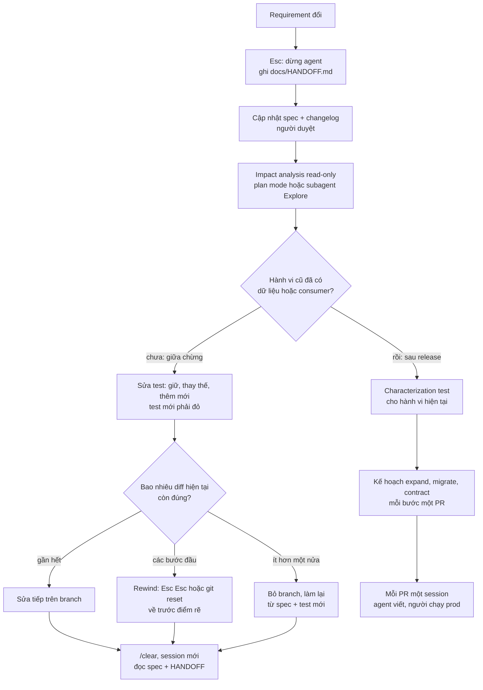
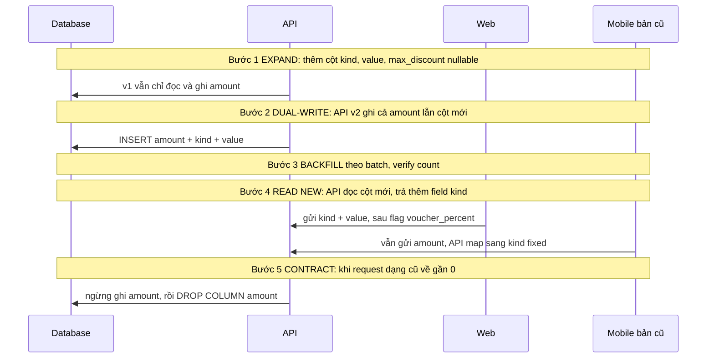

## Bối cảnh & vấn đề

**Câu chuyện 1: đổi giữa chừng.** Chiều thứ Ba, feature voucher cố định đã đi được nửa đường: spec đã duyệt, ba test đã khoá, agent đang implement bước 3 trong một session đã chạy hai tiếng. Product owner nhắn: "À, marketing muốn cả voucher phần trăm, giảm tối đa 100.000đ." Dev gõ tiếp vào session đang chạy: "actually, support percent vouchers too". Agent vui vẻ vá: thêm `if (v.percent)` vào hàm cũ, sửa luôn test AC1 "cho khớp", và vẫn giữ quy ước làm tròn của thiết kế cũ mà PO vừa đổi. Diff cuối cùng là hỗn hợp của hai thiết kế, không ai nói được test nào là spec cũ, test nào là spec mới.

**Câu chuyện 2: đổi sau release.** Ba tháng sau khi voucher lên production, cần tách cột `vouchers.amount` thành `kind` + `value` + `max_discount`. Agent đề xuất một migration "sạch": `ALTER TABLE vouchers RENAME COLUMN amount TO value` rồi thêm cột. Nó chạy xanh ở local. Lên production, trong 4 phút rolling deploy, các pod bản cũ vẫn `SELECT amount` và trả 500; app mobile bản cũ (người dùng chưa cập nhật) vẫn gửi `{ amount }` và nhận lỗi validation trong nhiều tuần.

Hai câu chuyện có chung một gốc: **coi thay đổi requirement như một lời nhắn thêm cho agent**, thay vì một sự kiện làm thay đổi nguồn sự thật (spec, test, contract, dữ liệu). Agent không có cách biết giả định nào đã hết hạn; nó chỉ thấy lịch sử hội thoại, nơi giả định cũ vẫn nằm đó và nặng ký. Và agent không tự biết rằng "production" nghĩa là có **dữ liệu cũ** và **client cũ** vẫn đang sống.

Bài này là playbook cho cả hai trường hợp: dừng đúng lúc, làm sạch context, cập nhật spec và test trước, impact analysis read-only, quyết định sửa tiếp hay rewind hay làm lại; và với thay đổi đã lên production thì dùng **expand → migrate → contract**, feature flag, nhiều PR nhỏ, và không để agent chạm production. Bài giả định bạn đã quen luồng ticket → PR ở [bài Feature workflow](/tracks/ai-assisted-engineering/learn/feature-workflow).

## Khái niệm

### Hai loại thay đổi: giữa chừng và sau release

Câu hỏi đầu tiên khi requirement đổi là: **hành vi cũ đã có ai phụ thuộc chưa?** Nếu chưa (code chưa merge, hoặc đã merge nhưng chưa release), đây là **thay đổi giữa chừng**: chi phí chủ yếu là code và context, và code do agent viết thì rẻ. Nếu rồi (đã release, có dữ liệu được ghi theo quy tắc cũ, có client gọi API cũ), đây là **thay đổi sau release**: chi phí nằm ở dữ liệu, consumer và thời gian chuyển tiếp, và mọi bước phải backward compatible.

Ranh giới không phải lúc nào cũng rõ. Code đã merge vào main nhưng đằng sau feature flag tắt là "giữa chừng" về mặt người dùng, nhưng nếu migration đã chạy trên staging dùng chung hay production thì dữ liệu đã tồn tại, và phần dữ liệu phải xử lý như "sau release". Một branch khác đã build dựa trên API mới của bạn cũng là một consumer.

**Interview angle:** follow-up của câu 049 chính là chuyển từ loại này sang loại kia ("một phần hành vi cũ đã lên production và có dữ liệu"); interviewer muốn thấy bạn đổi hẳn chiến lược, không chỉ "làm cẩn thận hơn".

### Dừng agent và làm sạch context

Khi requirement đổi giữa chừng, việc đầu tiên là **dừng** (Esc để ngắt lượt đang chạy), không phải gõ tiếp. Lý do nằm ở cách context window hoạt động: mọi thứ trong session (spec cũ, plan cũ, output test cũ, những lần thử bỏ dở) đều là input cho mỗi lượt sau. Một câu "à đổi thành X" ngắn ngủi phải cạnh tranh với hàng nghìn token mô tả Y. Khi session dài, Claude Code còn **auto-compact** (tóm tắt lịch sử khi gần đầy), và bản tóm tắt có thể giữ giả định cũ mà bỏ mất ràng buộc bạn nói sau.

Dấu hiệu một session đã xuống cấp: agent lặp lại một fix đã thất bại, quên ràng buộc bạn nói 30 phút trước, hoặc trộn quy tắc cũ với mới. Cách xử lý: ghi trạng thái cần giữ ra **file handoff** (quyết định đã chốt, spec mới, việc còn lại, những gì không được làm), rồi `/clear` và bắt đầu session mới bằng cách đọc file đó. `/compact <hướng dẫn>` là lựa chọn nhẹ hơn khi bạn muốn giữ session nhưng chỉ định rõ phải giữ gì; `/context` cho bạn xem cái gì đang chiếm chỗ. Giữ context chính gọn bằng cách đẩy việc tìm kiếm (grep call site, đọc nhiều file) cho **subagent**; chỉ bản tóm tắt quay về.

**Interview angle:** câu 023 hỏi vì sao session dài cho kết quả tệ dần; câu trả lời mạnh nêu cơ chế (context loãng, auto-compact mất chi tiết, bám giả định cũ), dấu hiệu nhận biết, và cách chuyển trạng thái qua file thay vì qua lịch sử chat.

### Spec và test là nguồn sự thật

Trước khi agent viết lại dòng code nào, **nguồn sự thật phải được cập nhật trước**: file spec (AC mới, out-of-scope mới, và một dòng changelog "2026-09-30: thêm voucher phần trăm, lý do, người quyết định"), rồi test. Làm ngược lại (code trước, spec sau) là cách chắc chắn nhất để spec mô tả những gì code tình cờ làm, không phải những gì business muốn.

Với test, phân biệt ba nhóm: test **vẫn đúng** (giữ nguyên, vẫn khoá), test **bị thay thế** bởi quy tắc mới (người xoá hoặc sửa, trong một commit riêng có message ghi rõ AC nào bị thay), và test **mới** cho hành vi mới (viết trước, phải đỏ vì đúng lý do). Việc xoá hay sửa test cũ là **quyết định của người**; nếu giao cho agent, nó có thể xoá luôn test đang bảo vệ một quy tắc vẫn còn hiệu lực. Khi thay đổi đụng API công khai, thêm một test cho **payload cũ** để chứng minh backward compatibility.

**Interview angle:** interviewer muốn nghe "tôi sửa spec và test trước, test cũ bị thay thế do tôi xoá có chủ đích trong commit riêng", thay vì "tôi bảo agent cập nhật test".

### Impact analysis read-only

**Impact analysis** (còn gọi là map **blast radius**) là liệt kê mọi thứ bị ảnh hưởng bởi thay đổi: file, hàm, API endpoint, consumer (frontend, mobile, service khác, job, báo cáo), cột và query DB, test, tài liệu. Làm nó trong **plan mode** hoặc giao cho subagent Explore (read-only), vì ở bước này không có lý do gì để sửa file. Output nên là một checklist có đường dẫn cụ thể, bạn kiểm chứng bằng `git grep` thay vì tin tóm tắt.

Agent rất nhanh ở phần cơ học (tìm mọi chỗ dùng `amount`), nhưng hay bỏ sót thứ **không nằm trong repo**: app mobile ở repo khác, dashboard BI query thẳng DB, webhook của đối tác, file CSV xuất cho kế toán. Đây là chỗ bạn phải hỏi người, và checklist nên có mục "ngoài repo (đã hỏi ai)".

**Interview angle:** câu 050 bắt đầu bằng "map blast radius trước"; điểm cộng là nói rõ agent tìm call site, còn người kiểm chứng và bổ sung consumer ngoài repo.

### Sửa tiếp, rewind, hay làm lại

Sau khi spec và test mới đã có, bạn chọn một trong ba đường. **Sửa tiếp trên branch** khi thay đổi nhỏ và cục bộ, phần code đã viết vẫn đúng với spec mới. **Rewind** về checkpoint trước điểm rẽ (Esc hai lần hoặc `/rewind`, chọn khôi phục code, hội thoại, hoặc cả hai) khi các bước đầu vẫn đúng nhưng các bước sau đi theo thiết kế cũ; tương đương git là `git reset --hard <commit bước 2>` trên branch của bạn. **Bỏ branch và làm lại** khi thay đổi đụng tới thiết kế lõi: code do agent viết rẻ, và spec + test mới làm lần hai nhanh hơn lần một.

Tiêu chí thực dụng: nếu hơn khoảng một nửa diff hiện tại phải viết lại, làm lại từ đầu. Đừng tiếc code; thứ đáng tiếc là thời gian review một diff lai. Nhớ rằng checkpoint không undo được side effect ngoài repo: migration đã chạy vào DB local, package đã cài, branch đã push. Những thứ đó phải dọn tay (drop DB local, reset branch remote nếu chưa ai dùng).

**Interview angle:** red flag của câu 049 là "tôi chỉ bảo agent làm Y thay vì X rồi đi tiếp"; câu trả lời tốt nêu được tiêu chí chọn giữa ba đường và giới hạn của checkpoint.

### Expand → migrate → contract

**Expand/contract** (Martin Fowler gọi là **parallel change**) là cách đổi một interface đang có người dùng mà không lúc nào làm vỡ họ. **Expand**: thêm cái mới bên cạnh cái cũ (cột mới nullable, field mới optional, endpoint v2); mọi client cũ vẫn chạy. **Migrate**: chuyển dần sang cái mới: app ghi cả hai (dual-write), backfill dữ liệu cũ theo batch, chuyển reader sang cột mới, chuyển từng consumer. **Contract**: khi đã chứng minh không còn ai dùng cái cũ, mới xoá nó.

Vì sao không đổi tên cột trong một migration? Vì deploy không bao giờ là tức thời: trong rolling deploy có pod bản cũ và bản mới chạy song song; app mobile bản cũ sống hàng tuần; job batch, báo cáo, replica đọc cột cũ. `RENAME COLUMN` làm vỡ tất cả những reader đó ngay lập tức, và rollback app cũng không cứu được vì schema đã đổi. Expand/contract biến một thay đổi rủi ro thành chuỗi bước mà **bước nào cũng rollback được**.

**Interview angle:** follow-up của câu 050 ("agent đề xuất rename cột trong một migration cho sạch") chờ bạn nói về rolling deploy, client cũ và tính rollback được của từng bước.

### Feature flag và versioning contract

**Feature flag** tách **deploy** (code lên production) khỏi **release** (người dùng thấy hành vi mới). Với requirement change, flag cho phép merge nhiều PR nhỏ vào main mà hành vi mới vẫn tắt, bật dần theo nhóm người dùng, và tắt ngay khi có sự cố mà không cần rollback deploy. Flag có chi phí: mỗi flag là một nhánh code phải test cả hai phía, và phải có ngày xoá (flag debt).

Với **API contract**, thay đổi an toàn nhất là **thêm field optional** (`kind` mặc định là `fixed` khi thiếu) để payload cũ vẫn hợp lệ; khi ngữ nghĩa thay đổi hẳn thì dùng version (`/v2/...` hoặc field schema version). Frontend và mobile là hai consumer có nhịp release khác nhau: web deploy trong ngày, mobile phụ thuộc người dùng cập nhật, nên contract phase cho mobile thường chờ theo số liệu (tỉ lệ request từ bản cũ về gần 0), không theo lịch.

**Interview angle:** interviewer muốn thấy bạn biết flag là công cụ release chứ không thay được backward compatibility ở tầng dữ liệu và API.

### Chia PR, chia session, và ai được chạm production

Một requirement change sau release thường là 5–8 PR: expand schema; app dual-write; script backfill; chuyển reader; chuyển từng frontend; bật flag; contract. Mỗi PR là một **session riêng với plan riêng**, bắt đầu từ file spec và checklist blast radius đã cập nhật, không phải từ lịch sử của PR trước. Đây cũng là cách làm refactor lớn (câu 036): mẫu trước, rồi batch nhỏ có CI xanh.

Agent **viết** script migration và backfill, **dry-run** trên bản sao dữ liệu (hoặc DB local seed giống production), nhưng **người** review và chạy trên production. Chặn bằng cơ chế, không bằng lời dặn: deny trong permissions, hook PreToolUse trên Bash chặn lệnh có dấu hiệu production, không đưa credential production vào môi trường agent, và nếu dùng MCP tới DB thì chỉ read-only replica với user quyền hẹp.

**Interview angle:** câu 050 kết thúc bằng "không cho agent chạm DB prod"; điểm cộng là nêu được lớp chặn cụ thể (credential không có trong env, hook, permission) chứ không chỉ quy ước.

## Cơ chế hoạt động

Diagram đầu là cây quyết định từ lúc requirement đổi tới khi bạn biết mình đang đi đường nào.



Hai nhánh tách nhau ở câu hỏi "đã có dữ liệu hoặc consumer chưa". Nhánh trái tối ưu cho **tốc độ và sự sạch sẽ của context**: code rẻ, nên câu hỏi chỉ là giữ bao nhiêu, và kết thúc luôn là một session mới đọc spec và file handoff, không phải session cũ đầy giả định. Nhánh phải tối ưu cho **an toàn chuyển tiếp**: trước khi đổi gì, khoá hành vi hiện tại bằng **characterization test** (test ghi lại hành vi đang có, kể cả kỳ quặc, để phát hiện thay đổi ngoài ý muốn), rồi chia thay đổi thành các bước độc lập rollback được.

Diagram thứ hai là timeline của expand → migrate → contract cho câu chuyện tách cột `amount`. Mỗi mũi tên là một lần deploy; giữa các lần deploy, hệ thống luôn ở trạng thái mà cả code cũ lẫn code mới đều chạy đúng.



Ba điểm cần giải thích. Thứ nhất, **dual-write phải có trước backfill**; nếu backfill chạy khi app vẫn chỉ ghi `amount`, những dòng tạo mới trong lúc backfill sẽ thiếu cột mới (ví dụ thực tế bên dưới cho thấy đúng lỗi này). Thứ hai, **API vẫn nhận payload cũ** của mobile và tự map sang `kind = 'fixed'`, nên mobile bản cũ không vỡ dù web đã dùng tính năng mới. Thứ ba, **contract được quyết định bằng số liệu**: log hoặc metric đếm request còn dùng `amount`, không phải "đã hai tuần rồi chắc ổn".

### Bảng lệnh theo bước

| Bước | Thao tác Claude Code / git | Ai quyết định |
|---|---|---|
| Dừng | Esc; ghi `docs/HANDOFF.md`; `/clear` | Bạn |
| Spec | Session mới: "đọc spec cũ + thay đổi, viết lại AC và changelog, chưa code" | Bạn duyệt, PO xác nhận |
| Impact | Plan mode, hoặc "dùng subagent tìm mọi reader/writer của `amount`"; bạn chạy `git grep` kiểm chứng | Bạn bổ sung consumer ngoài repo |
| Test | Agent đề xuất test mới; bạn xoá/sửa test bị thay thế trong commit riêng | Bạn |
| Chọn đường | `/rewind` (Esc Esc), `git reset --hard <sha>`, hoặc branch mới | Bạn |
| Sau release | Mỗi PR của expand/migrate/contract một session, plan riêng | Bạn + reviewer |
| Chạy prod | Agent viết script + dry-run trên bản sao; hook chặn lệnh prod | Người có quyền prod |

## Ví dụ thực tế

Hai phần nối tiếp câu chuyện voucher của bài trước. Phần A là thay đổi giữa chừng (voucher phần trăm), phần B là thay đổi sau release (tách cột `amount`). Mọi lệnh có output được chạy thật trong thư mục scratch `/tmp/demo6` (Node 24, SQLite 3.51); hội thoại với agent đánh dấu (minh hoạ). SQLite được dùng để chạy được ngay không cần server; phần tương đương PostgreSQL ghi riêng ở cuối.

### Phần A, bước 1: dừng và ghi handoff

Nhấn Esc, rồi yêu cầu agent (vẫn trong session cũ, lần cuối) ghi lại trạng thái, **không** code tiếp:

```text
> Dừng implement. Requirement vừa đổi. Ghi docs/HANDOFF.md gồm: commit cuối
> cùng xanh, bước nào của plan đã xong, quyết định kỹ thuật đã chốt, và
> những giả định có thể đã hết hạn. Không sửa file nào khác.   (minh hoạ)
```

```markdown
# HANDOFF: voucher (2026-09-30)
- Commit xanh cuối: edd11b5 "feat(voucher): applyVoucher with expiry + floor at 0"
- Đã xong: bước 1–2 (VoucherExpiredError, applyVoucher cố định). Chưa: bước 3 (API).
- Đã chốt: hàm thuần, inject `now`; tiền là số nguyên VND.
- Giả định có thể hết hạn: "chỉ voucher cố định"; type Voucher chỉ có `amount`.
- Không làm: đổi PriceCalculator; stack voucher.
```

Sau đó `/clear`. File handoff là cầu nối duy nhất sang session mới; nó ngắn, do bạn duyệt, và không kéo theo hai tiếng lịch sử.

### Phần A, bước 2: spec và test trước

Session mới đọc spec cũ và HANDOFF, viết lại AC (bạn duyệt). Phần thêm vào spec:

```markdown
## Changelog
- 2026-09-30: thêm voucher phần trăm có trần (PO + marketing). AC1–AC3 giữ nguyên.
## Acceptance criteria (mới)
- AC4: voucher 10%, giỏ 500.000đ → 450.000đ.
- AC5: voucher 10%, trần 100.000đ, giỏ 2.000.000đ → 1.900.000đ.
- AC6: payload cũ `{ amount }` (không có `kind`) vẫn được hiểu là voucher cố định.
```

AC6 là **test backward compatibility**: bất kỳ caller nào đang gửi dạng cũ không được vỡ. Test mới:

```ts
// test/voucher-percent.test.ts
import { test } from "node:test";
import assert from "node:assert/strict";
import { applyVoucher } from "../src/voucher.ts";

const now = new Date("2026-09-30T00:00:00Z");
const exp = "2026-12-31T23:59:59Z";

test("AC4: voucher 10% trên giỏ 500.000đ → 450.000đ", () => {
  assert.deepEqual(applyVoucher({ total: 500_000 }, { kind: "percent", percent: 10, maxDiscount: 100_000, expiresAt: exp }, now), { total: 450_000 });
});
test("AC5: voucher 10% bị chặn bởi maxDiscount 100.000đ", () => {
  assert.deepEqual(applyVoucher({ total: 2_000_000 }, { kind: "percent", percent: 10, maxDiscount: 100_000, expiresAt: exp }, now), { total: 1_900_000 });
});
test("AC6: payload cũ { amount } vẫn được hiểu là fixed", () => {
  assert.deepEqual(applyVoucher({ total: 200_000 }, { amount: 80_000, expiresAt: exp }, now), { total: 120_000 });
});
```

Chạy với implementation cũ, đỏ **vì đúng lý do**:

```text
✖ AC4: voucher 10% trên giỏ 500.000đ → 450.000đ (1.32575ms)
✖ AC5: voucher 10% bị chặn bởi maxDiscount 100.000đ (0.152167ms)
✔ AC6: payload cũ { amount } vẫn được hiểu là fixed (0.110583ms)
ℹ tests 3
ℹ pass 1
ℹ fail 2

  AssertionError [ERR_ASSERTION]: Expected values to be strictly deep-equal:
  + actual - expected
    {
  +   total: NaN
  -   total: 450000
    }
```

`NaN` là tín hiệu đáng đọc: code cũ lấy `v.amount` của voucher phần trăm (không có field đó), `200000 - undefined` ra `NaN`, và `Math.max(0, NaN)` vẫn là `NaN`. Một caller không kiểm tra sẽ lưu `NaN` vào đơn hàng. Đây là loại lỗi mà "vá thêm `if`" trong session cũ rất dễ bỏ qua.

### Phần A, bước 3: impact analysis read-only

Prompt trong plan mode (minh hoạ): "Dùng subagent tìm mọi nơi đọc hoặc ghi `amount` của voucher, trong code, test, API, frontend, mobile. Trả về bảng file:dòng và loại (reader/writer). Không sửa file." Bạn kiểm chứng bằng `git grep`:

```bash
git grep -n -w "amount" -- ':!docs' ':!*.md'
```

```text
api/checkout.ts:2:export function checkoutHandler(body: { total: number; voucher: { amount: number; expiresAt: string } }) {
mobile/src/voucher.ts:1:export const label = (v: { amount: number }) => `Giảm ${v.amount}đ`;
src/voucher.ts:3:export type Voucher = { amount: number; expiresAt: string };
src/voucher.ts:9:  return { total: Math.max(0, cart.total - v.amount) };
test/voucher.test.ts:6:const valid = { amount: 80_000, expiresAt: "2026-12-31T23:59:59Z" };
web/src/VoucherBadge.tsx:1:export const VoucherBadge = ({ v }: { v: { amount: number } }) => <span>-{v.amount.toLocaleString()}đ</span>;
```

```bash
git grep -l -w "amount" | sort | awk -F/ '{print $1}' | uniq -c
```

```text
   1 api
   1 mobile
   1 src
   1 test
   1 web
```

Năm vùng, trong đó `web` và `mobile` là hai consumer UI hiển thị "-80.000đ": với voucher phần trăm, badge phải hiển thị "-10%". Checklist blast radius thêm một dòng mà grep không thấy: "dashboard marketing query bảng vouchers? (hỏi team data)".

### Phần A, bước 4: chọn đường và implement

Bước 1–2 của plan cũ vẫn đúng, API (bước 3) chưa làm. Đường hợp lý là **sửa tiếp trên branch** từ commit `edd11b5`, trong session mới. Implementation dùng discriminated union và giữ dạng cũ làm legacy:

```ts
// src/voucher.ts
export class VoucherExpiredError extends Error {}
export type Cart = { total: number };
type Base = { expiresAt: string };
export type FixedVoucher = Base & { kind: "fixed"; amount: number };
export type PercentVoucher = Base & { kind: "percent"; percent: number; maxDiscount: number };
/** @deprecated payload v1 chưa có `kind`; giữ đến khi mọi client lên v2 (contract phase). */
export type LegacyVoucher = Base & { kind?: undefined; amount: number };
export type Voucher = FixedVoucher | PercentVoucher | LegacyVoucher;

export function discountOf(v: Voucher, total: number): number {
  if (v.kind === "percent") return Math.min(Math.floor((total * v.percent) / 100), v.maxDiscount);
  return v.amount; // "fixed" và legacy
}

export function applyVoucher(cart: Cart, v: Voucher, now = new Date()): Cart {
  if (new Date(v.expiresAt).getTime() < now.getTime()) {
    throw new VoucherExpiredError(`voucher expired at ${v.expiresAt}`);
  }
  return { total: Math.max(0, cart.total - discountOf(v, cart.total)) };
}
```

```text
✔ AC4: voucher 10% trên giỏ 500.000đ → 450.000đ (0.821334ms)
✔ AC5: voucher 10% bị chặn bởi maxDiscount 100.000đ (0.079375ms)
✔ AC6: payload cũ { amount } vẫn được hiểu là fixed (0.075ms)
✔ AC1: trừ đúng số tiền voucher (0.811542ms)
✔ AC2: không bao giờ âm (0.075042ms)
✔ AC3: voucher hết hạn thì throw (0.235417ms)
ℹ tests 6
ℹ pass 6
ℹ fail 0
```

Test cũ AC1–AC3 không bị đụng tới và vẫn xanh: đó là bằng chứng quy tắc cũ còn hiệu lực. Lưu ý Node type stripping **không typecheck**; CI vẫn phải chạy `tsc --noEmit` để bắt lỗi union.

### Phần B: expand → migrate → contract trên dữ liệu thật

Ba tháng sau, bảng `vouchers` có 5.000 dòng dạng cũ. Migration expand chỉ **thêm**:

```sql
-- 01_expand.sql — chỉ thêm, không xoá/đổi tên. App v1 vẫn chạy bình thường.
ALTER TABLE vouchers ADD COLUMN kind TEXT;            -- nullable
ALTER TABLE vouchers ADD COLUMN value INTEGER;
ALTER TABLE vouchers ADD COLUMN max_discount INTEGER;
```

Backfill theo batch 1.000 dòng, **idempotent** (chỉ đụng dòng chưa có `kind`, chạy lại bao nhiêu lần cũng an toàn), và một query verify:

```sql
-- 02_backfill_batch.sql
UPDATE vouchers SET kind = 'fixed', value = amount
WHERE id IN (SELECT id FROM vouchers WHERE kind IS NULL ORDER BY id LIMIT 1000);
SELECT changes() AS updated_rows;

-- 03_verify.sql
SELECT count(*) AS total,
       sum(kind IS NULL) AS not_backfilled,
       sum(kind = 'fixed' AND value <> amount) AS mismatched
FROM vouchers;
```

```bash
sqlite3 shop.db < 01_expand.sql
sqlite3 -header -column shop.db < 03_verify.sql
for i in 1 2 3 4 5 6; do sqlite3 shop.db < 02_backfill_batch.sql; done
sqlite3 -header -column shop.db < 03_verify.sql
```

```text
total  not_backfilled  mismatched
-----  --------------  ----------
5000   5000
1000
1000
1000
1000
1000
0
total  not_backfilled  mismatched
-----  --------------  ----------
5000   0               0
```

Lần verify đầu `mismatched` trống vì `kind` toàn NULL (tổng của NULL là NULL). Batch thứ sáu cập nhật 0 dòng: đó là điều kiện dừng vòng lặp backfill.

Giờ tái hiện lỗi thứ tự: app v1 **chưa dual-write** tạo một voucher mới sau khi backfill xong.

```bash
sqlite3 shop.db "INSERT INTO vouchers (code, amount, expires_at) VALUES ('NEW1', 50000, '2026-12-31T23:59:59Z');"
sqlite3 -header -column shop.db < 03_verify.sql
```

```text
total  not_backfilled  mismatched
-----  --------------  ----------
5001   1               0
```

Một dòng thiếu cột mới. Nếu bước tiếp theo là chuyển reader sang `kind/value`, voucher `NEW1` sẽ bị đọc là NULL. Đây là lý do thứ tự đúng là **dual-write trước, backfill sau**, và verify phải chạy lại ngay trước khi chuyển reader. Chạy lại batch (idempotent) sửa được dòng này, nhưng trên production với luồng ghi liên tục thì chỉ dual-write mới đóng được khe hở.

Contract, rồi thử một reader cũ còn sót (ví dụ job báo cáo chưa ai nhớ tới):

```bash
sqlite3 shop.db < 02_backfill_batch.sql      # dọn dòng NEW1
sqlite3 shop.db "ALTER TABLE vouchers DROP COLUMN amount;"
sqlite3 shop.db "SELECT code, amount FROM vouchers WHERE code = 'V1';"; echo "exit=$?"
sqlite3 -header -column shop.db "SELECT code, kind, value, max_discount FROM vouchers WHERE code IN ('V1','NEW1');"
```

```text
1
Error: in prepare, no such column: amount
  SELECT code, amount FROM vouchers WHERE code = 'V1';
               ^--- error here
exit=1
code  kind   value  max_discount
----  -----  -----  ------------
NEW1  fixed  50000
V1    fixed  20000
```

Lỗi `no such column: amount` chính là thứ mọi pod bản cũ gặp nếu bạn `RENAME COLUMN` trong một bước. Contract chỉ chạy khi metric chứng minh không còn reader nào, và nên đi trong PR riêng, sau ít nhất một chu kỳ release.

Tương đương PostgreSQL (không chạy ở đây): `ALTER TABLE vouchers ADD COLUMN kind text;` cho cột nullable không default là thay đổi chỉ metadata nên nhanh; backfill nên dùng batch theo khoá chính và commit từng batch để tránh transaction dài giữ lock và sinh bloat; thêm `NOT NULL` sau backfill bằng `CHECK (...) NOT VALID` rồi `VALIDATE CONSTRAINT` để tránh quét bảng dưới lock mạnh (verify theo phiên bản Postgres bạn dùng).

### Phần B: chặn agent khỏi production bằng hook

Agent viết và dry-run các script trên, nhưng không được chạy chúng trên production. Hook PreToolUse cho tool Bash đọc `tool_input.command` từ stdin:

```bash
#!/usr/bin/env bash
# .claude/hooks/block-prod.sh — PreToolUse, matcher: Bash
cmd=$(jq -r '.tool_input.command // empty')
if grep -qiE '(prod|production)[a-z0-9_.-]*\.(internal|rds\.amazonaws\.com)|DATABASE_URL_PROD|--env[= ]prod|migrate deploy|kubectl .*(-n|--namespace)[= ]prod' <<<"$cmd"; then
  echo "BLOCKED: lệnh chạm production. Agent chỉ viết script + dry-run trên bản sao; người chạy trên prod." >&2
  exit 2
fi
exit 0
```

```bash
for c in 'psql "$DATABASE_URL_PROD" -f 02_backfill_batch.sql' 'npx prisma migrate deploy' \
         'sqlite3 /tmp/copy-of-prod.db < 02_backfill_batch.sql' 'npm test'; do
  printf '%s\n' "\$ $c"
  jq -n --arg c "$c" '{hook_event_name:"PreToolUse",tool_name:"Bash",tool_input:{command:$c}}' \
    | ./.claude/hooks/block-prod.sh; echo "exit=$?"
done
```

```text
$ psql "$DATABASE_URL_PROD" -f 02_backfill_batch.sql
BLOCKED: lệnh chạm production. Agent chỉ viết script + dry-run trên bản sao; người chạy trên prod.
exit=2
$ npx prisma migrate deploy
BLOCKED: lệnh chạm production. Agent chỉ viết script + dry-run trên bản sao; người chạy trên prod.
exit=2
$ sqlite3 /tmp/copy-of-prod.db < 02_backfill_batch.sql
exit=0
$ npm test
exit=0
```

Đăng ký trong `.claude/settings.json` cạnh hook bài trước: `{ "matcher": "Bash", "hooks": [ { "type": "command", "command": "\"$CLAUDE_PROJECT_DIR\"/.claude/hooks/block-prod.sh" } ] }`. Hook dựa trên regex là **lớp phụ**; lớp chính là credential production không tồn tại trong môi trường agent.

## Trade-offs & lựa chọn thay thế

| Lựa chọn | Ưu | Nhược | Hợp khi |
|---|---|---|---|
| Nhắn thêm vào session đang chạy | Nhanh nhất lúc đó | Context lẫn giả định cũ; agent vá thay vì thiết kế lại | Gần như không bao giờ, trừ thay đổi một dòng (đổi text, đổi hằng số) |
| Sửa tiếp trên branch, session mới | Giữ phần đã đúng | Cần tách rõ test cũ còn hiệu lực và test bị thay | Phần lớn diff vẫn đúng với spec mới |
| Rewind / reset về checkpoint | Giữ các bước đầu, bỏ phần đi sai | Không undo side effect ngoài repo | Điểm rẽ nằm giữa plan |
| Bỏ branch, làm lại | Diff sạch, thiết kế nhất quán | Mất thời gian đã bỏ ra (thường ít hơn bạn nghĩ) | Thay đổi đụng thiết kế lõi, hơn nửa diff phải viết lại |
| Big-bang migration (rename, đổi kiểu trong một bước) | Ít bước, "sạch" | Vỡ pod cũ, client cũ; rollback không được | Chỉ khi có downtime window và không có client ngoài |
| Expand → migrate → contract | Mỗi bước rollback được, không downtime | 5–8 PR, cần dual-write và theo dõi | Mặc định cho mọi thứ đã lên production |
| Field optional trong API | Client cũ không vỡ, ít code | Ngữ nghĩa cũ và mới lẫn trong một schema | Thêm khả năng, không đổi nghĩa field cũ |
| API version mới | Tách bạch hoàn toàn | Duy trì hai version, tốn công | Ngữ nghĩa đổi hẳn, client ngoài nhiều |
| Feature flag | Tách deploy khỏi release, tắt nhanh | Flag debt, phải test cả hai nhánh | Hành vi mới cần bật dần hoặc cần kill switch |

**Khi nào chọn gì.** Với thay đổi giữa chừng, đường mặc định là: dừng, spec + test trước, rồi session mới; chọn giữa sửa tiếp, rewind và làm lại theo tỉ lệ diff còn đúng. Với thay đổi đã lên production, đường mặc định là expand/contract cộng field optional cho API và flag cho hành vi mới. Big-bang chỉ hợp lý với hệ thống nội bộ có downtime window và mọi consumer nằm trong cùng một deploy.

**Agent làm được gì trong từng lựa chọn.** Agent giỏi phần cơ học: tìm call site, viết migration expand, viết script backfill idempotent, viết adapter cho payload cũ, cập nhật từng consumer theo mẫu. Phần cần người: quyết định thứ tự deploy, thời điểm contract (dựa trên metric), xác nhận consumer ngoài repo, và chạy bất cứ thứ gì trên production. Cursor và các agent khác áp dụng y hệt; khác biệt chỉ là cơ chế checkpoint và hook mỗi tool có tới đâu (verify theo tool bạn dùng).

## Edge cases & failure modes

- **Auto-compact nuốt ràng buộc mới.** Bạn nói requirement mới trong session dài, rồi session tự tóm tắt khi gần đầy; bản tóm tắt giữ spec cũ chi tiết hơn câu thay đổi ngắn. Luôn đưa thay đổi vào **file spec**, không chỉ vào chat.
- **Agent xoá test cũ còn hiệu lực.** Được bảo "cập nhật test cho requirement mới", agent xoá cả AC2 (không âm) vì nó "liên quan voucher". Xoá test là quyết định của người, trong commit riêng.
- **Checkpoint không cứu side effect.** `/rewind` trả code về, nhưng migration đã chạy trên DB local/staging, branch đã push, message đã gửi vào queue thì vẫn còn. Liệt kê side effect trong HANDOFF và dọn tay.
- **Backfill trước dual-write.** Như ví dụ `NEW1`: dòng tạo trong lúc backfill thiếu cột mới. Thứ tự: dual-write deploy xong, rồi backfill, rồi verify, rồi chuyển reader.
- **Backfill một transaction khổng lồ.** `UPDATE vouchers SET ...` một phát trên 50 triệu dòng giữ lock lâu, sinh bloat, và replica lag. Batch theo khoá chính, commit từng batch, có điều kiện dừng, chạy lại được.
- **Consumer ngoài repo.** Mobile bản cũ, BI dashboard, webhook đối tác, file export. Grep không thấy; hỏi người và đo request thật trước khi contract.
- **Rolling deploy và rollback.** Trong lúc deploy, bản N và N+1 chạy song song; mỗi migration phải tương thích với cả hai. Nếu migration không tương thích với bản N, rollback app sẽ vỡ.
- **Flag bật một nửa.** Web đã bật flag voucher phần trăm, API chưa deploy bản hiểu `kind` → request lỗi. Bật flag theo thứ tự ngược với dependency: backend trước, client sau.
- **Hai requirement change chồng nhau.** Trong lúc bạn đang expand, một thay đổi khác đụng cùng bảng. Tuần tự hoá migration trên cùng bảng, và ghi rõ trong spec thứ tự.
- **Spec và code lệch sau vài vòng.** Mỗi lần requirement đổi mà chỉ sửa code, spec dần thành tài liệu sai. Changelog trong spec và review PR kiểm cả hai.

## Pitfalls

- ❌ Gõ "actually, make it do Y" vào session đang chạy → ✅ Esc, ghi HANDOFF, cập nhật spec + test, `/clear`, session mới; vì context cũ vẫn đè nặng giả định cũ.
- ❌ Sửa code trước, "cập nhật spec sau" → ✅ spec và test trước; nếu không spec mô tả những gì code tình cờ làm.
- ❌ Giao agent "cập nhật test cho khớp" → ✅ người quyết định test nào bị thay thế, xoá trong commit riêng; test mới viết trước và phải đỏ.
- ❌ Tin bảng impact do agent tóm tắt → ✅ kiểm chứng bằng `git grep` và bổ sung consumer ngoài repo bằng cách hỏi người.
- ❌ Tiếc code AI đã viết, cố vá một diff lai → ✅ làm lại khi hơn nửa diff sai; code agent rẻ, review diff lai mới đắt.
- ❌ Chấp nhận migration "rename cho sạch" → ✅ expand → migrate → contract; mỗi bước rollback được, không vỡ pod cũ và client cũ.
- ❌ Contract theo lịch ("hai tuần chắc ổn") → ✅ contract theo metric: request dạng cũ về gần 0, không còn query đọc cột cũ.
- ❌ Cho agent credential production "để chạy backfill cho nhanh" → ✅ agent viết script + dry-run trên bản sao; người chạy trên prod; hook và permission chặn thêm một lớp.
- ❌ Một PR khổng lồ gói cả expand, backfill, contract → ✅ mỗi bước một PR và một session với plan riêng.

## Tóm tắt

- Câu hỏi đầu tiên: **hành vi cũ đã có dữ liệu hoặc consumer chưa?** Chưa là đổi giữa chừng (tối ưu context và tốc độ); rồi là đổi sau release (tối ưu an toàn chuyển tiếp).
- **Dừng agent** (Esc), ghi **HANDOFF.md**, `/clear`; không nhắn thêm vào session dài vì context và auto-compact giữ giả định cũ.
- **Spec + changelog + test cập nhật trước** code; người quyết định test nào bị thay; thêm test cho payload cũ.
- **Impact analysis read-only** (plan mode / subagent Explore), kiểm chứng bằng `git grep`, bổ sung consumer ngoài repo.
- Chọn **sửa tiếp / rewind / làm lại** theo tỉ lệ diff còn đúng; checkpoint không undo side effect ngoài repo.
- Sau release: **expand → dual-write → backfill theo batch idempotent → verify → chuyển reader → contract theo metric**.
- API: **field optional** hoặc version mới; **feature flag** tách deploy khỏi release, bật backend trước client.
- Agent viết script và dry-run; **người chạy production**; chặn bằng việc không cấp credential, hook PreToolUse và permission.
