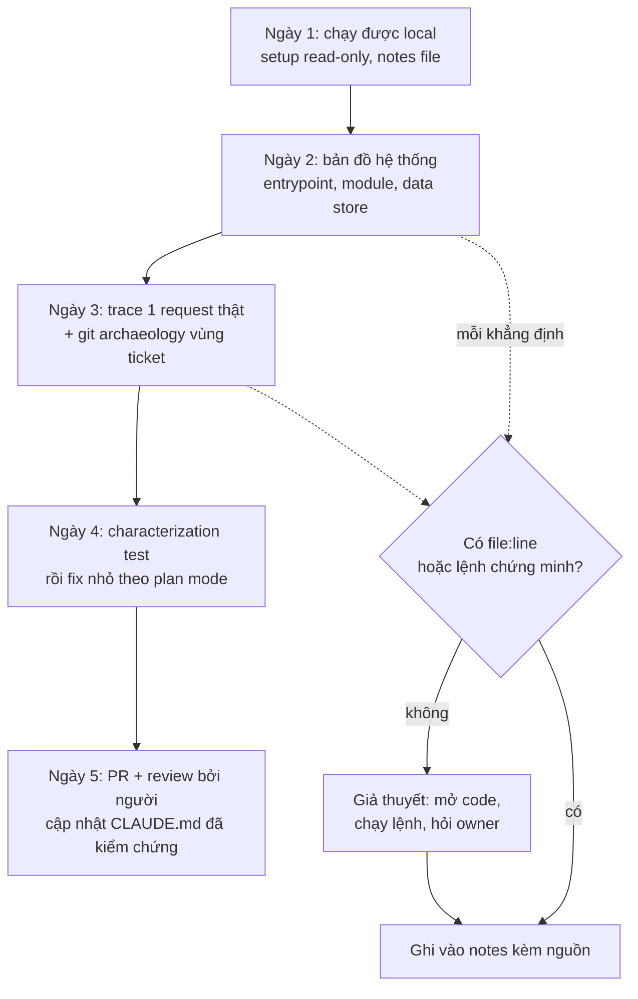
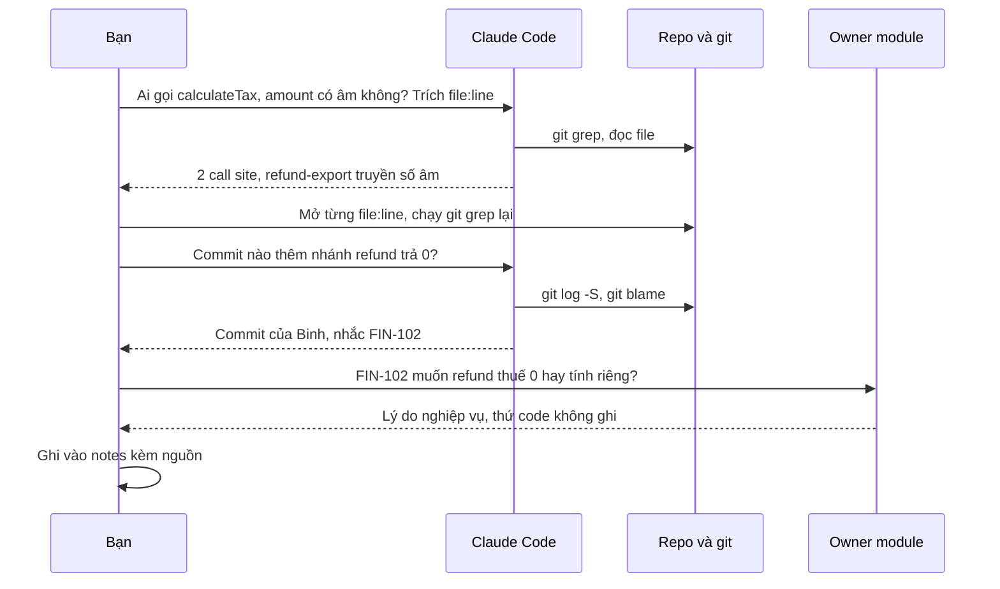

## Bối cảnh & vấn đề

Thứ Hai bạn join một team đang vận hành một nền tảng e-commerce 6 năm tuổi: monorepo 400K dòng, ba service Node.js, một Postgres dùng chung, vài cron job viết từ thời chưa có ai trong team hiện tại. Tech lead giao một ticket "nhỏ": *"Đơn hoàn tiền ở thị trường VN đang xuất thuế sai trong file export cho kế toán, fix trước thứ Sáu."* Bạn chưa từng thấy repo này.

Cách làm "năm 2020" là đọc README (đã lỗi thời), grep lung tung, hỏi đồng nghiệp mười lần một ngày. Cách làm "ngây thơ với AI" còn nguy hiểm hơn: mở Claude Code, gõ *"giải thích toàn bộ codebase này"*, nhận về một bản tóm tắt 2 trang rất trôi chảy, rồi tin nó. Bản tóm tắt nói: *"Thuế được tính trong `calculateTax`, chỉ được gọi từ `OrderService`."* Bạn sửa `calculateTax`, test của `OrderService` xanh, merge. Hai tuần sau kế toán báo file export **hoàn tiền** vẫn sai, và giờ còn sai thêm cho đơn thường ở EU. Hoá ra có một job `refund-export` cũng gọi `calculateTax` với số âm — agent đã không mở file đó, hoặc đã mở nhưng "tóm tắt" bỏ qua.

Vấn đề không nằm ở chỗ AI kém đọc code. Agent đọc code **nhanh hơn bạn rất nhiều** và tìm call site giỏi. Vấn đề là ba thứ:

1. **Câu hỏi mơ hồ tạo ra câu trả lời mơ hồ nhưng tự tin.** "Giải thích codebase" không có tiêu chí đúng/sai, nên không kiểm chứng được.
2. **Tóm tắt là nén có mất mát.** Model chọn cái "quan trọng" theo xác suất, không theo nghiệp vụ của bạn. Side-effect ẩn (cron, trigger DB, event consumer) là thứ hay bị rơi.
3. **Code không chứa "vì sao".** Vì sao refund trả thuế 0? Vì sao VN là 8%? Câu trả lời nằm trong ticket, trong đầu người, trong git history — không nằm trong file `.ts`.

Bài này đưa ra một **kế hoạch 5 ngày** dùng Claude Code như một "người đọc code rất nhanh" nhưng với kỷ luật: mọi khẳng định phải có **bằng chứng** (file:line, lệnh chạy được, test), mọi "vì sao" phải hỏi **người** hoặc **git history**, và mọi thứ bạn học được phải để lại cho người sau. Đây cũng là câu trả lời mẫu cho các câu hỏi phỏng vấn kiểu "bạn onboard vào codebase lạ bằng AI thế nào" (ai-assisted-engineering-022, 051).

## Khái niệm

### Read-only exploration: dùng agent để đọc, không để sửa

Trong tuần đầu, giá trị lớn nhất của agent là **đọc và tìm**, không phải viết. **Read-only exploration** nghĩa là bạn cấu hình và yêu cầu sao cho agent chỉ được đọc file, grep, chạy lệnh không có side-effect (`git log`, `npm test` trên máy local), và **không** sửa file. Trong Claude Code có hai công cụ trực tiếp cho việc này: **plan mode** (bấm Shift+Tab để chuyển mode, hoặc khởi động bằng `claude --permission-mode plan`) — agent nghiên cứu và đề xuất plan nhưng không sửa code; và **subagent Explore** có sẵn, chuyên tìm kiếm read-only trong context window riêng, chỉ trả về tóm tắt cho session chính.

Vì sao phải tách "đọc" khỏi "sửa"? Vì khi bạn chưa có mental model, bạn **không review được** diff. Một diff 30 dòng trong module bạn chưa hiểu trông lúc nào cũng "hợp lý". Để agent sửa khi bạn chưa hiểu là chuyển toàn bộ trách nhiệm sang một thứ không chịu trách nhiệm.

Ví dụ prompt: *"Chỉ đọc, đừng sửa gì. Liệt kê mọi nơi gọi `calculateTax`, kèm file:line và giá trị tham số `amount` có thể âm hay không."*

**Interview angle:** interviewer muốn nghe bạn chủ động giới hạn quyền của agent khi chưa hiểu hệ thống, không phải "tôi để nó tự làm".

### Câu hỏi kiểm chứng được (verifiable question)

**Câu hỏi kiểm chứng được** là câu hỏi mà câu trả lời có thể được xác nhận đúng/sai bằng một hành động cụ thể: mở file, chạy lệnh, chạy test, đặt breakpoint. "Ai gọi `X`?" kiểm chứng được bằng `git grep`. "Config `DB_POOL_MAX` được đọc ở đâu?" kiểm chứng được bằng mở file. "Module này có thiết kế tốt không?" thì không.

Lý do quan trọng: model sinh ra câu trả lời bằng cùng một cơ chế dự đoán token, dù câu trả lời đúng hay sai. Một lời giải thích nghe hợp lý **không phải bằng chứng** (xem ai-assisted-engineering-031). Khi câu hỏi kiểm chứng được, bạn biến lời tự tin của model thành một **giả thuyết** có thể bác bỏ trong 30 giây. Hãy yêu cầu agent luôn trả lời kèm **trích dẫn file:line** — một khẳng định không có trích dẫn là một khẳng định bạn chưa được phép tin.

| Mơ hồ (tránh) | Kiểm chứng được (dùng) |
|---|---|
| "Giải thích codebase" | "Liệt kê entrypoint: file nào khởi động HTTP server, worker, cron? Kèm file:line." |
| "Thuế tính thế nào?" | "Mọi call site của `calculateTax`, và với mỗi cái, `amount` đến từ đâu?" |
| "Auth làm sao?" | "Middleware nào verify JWT? Nó dùng `verify` hay `decode`? Algorithm pin ở đâu?" |
| "Có vấn đề gì không?" | "Có query nào trên bảng `orders` mà không có điều kiện `tenant_id` không? Liệt kê." |

**Interview angle:** câu trả lời mạnh có cụm "tôi hỏi câu có thể kiểm chứng và bắt nó trích file:line".

### Trace một request end-to-end

**Trace request** là đi theo một request thật từ lúc vào hệ thống (route/handler) qua middleware, service, repository, DB, queue, cho tới response và các side-effect phía sau (event, email, job). Đây là cách nhanh nhất để có mental model đúng vì nó **cụ thể**: thay vì hiểu "kiến trúc" trừu tượng, bạn hiểu một đường đi có thật, rồi mở rộng dần.

Agent rất giỏi phần "nối các chấm": tìm handler của `POST /refunds`, theo import sang service, tìm repository. Bạn làm phần **kiểm chứng**: mở từng file ở từng bước, và nếu được thì chạy request thật trên local với debugger hoặc log để xác nhận đường đi đó đúng là đường code chạy (dependency injection, feature flag, và config theo môi trường hay làm đường đi thực tế khác đường đọc được).

**Interview angle:** nói rõ bạn "trace một request cụ thể và chạy nó thật", không chỉ "đọc kiến trúc".

### Git archaeology

**Git archaeology** là dùng lịch sử git để trả lời câu hỏi "vì sao code như thế này" và "ai biết về nó". Code cho biết *cái gì*; commit message, PR và ticket được nhắc trong đó cho biết *vì sao*. Các lệnh cốt lõi:

- `git log --since=... --name-only --format= | sort | uniq -c | sort -rn` — **hot files**: file đổi nhiều nhất gần đây, thường là nơi bug sống và nơi ticket của bạn sẽ chạm.
- `git shortlog -sn HEAD -- <path>` — ai commit nhiều nhất vào một thư mục: người để hỏi.
- `git log -S"<chuỗi>" -- <file>` — **pickaxe**: commit nào thêm/xoá chuỗi đó (ví dụ hằng số `0.08`).
- `git blame -L <start>,<end> <file>` — dòng này do commit nào viết.
- `git log --follow -- <file>` — lịch sử qua cả rename.

Agent có thể chạy các lệnh này cho bạn và tóm tắt, nhưng output của chúng là **dữ liệu thật**, không phải suy luận — đó là lý do chúng đáng tin hơn một lời giải thích.

**Interview angle:** interviewer đánh giá cao khi bạn nói "tôi đọc git log vùng nóng để biết owner và lý do lịch sử", vì nó chứng tỏ bạn biết code không chứa "vì sao".

### Characterization test

**Characterization test** (thuật ngữ của Michael Feathers) là test ghi lại **hành vi hiện tại** của code, kể cả khi hành vi đó trông như bug. Nó không hỏi "code có đúng không" mà hỏi "code đang làm gì" — để khi bạn sửa, bạn biết chính xác mình đã thay đổi hành vi nào, có chủ đích hay không.

Với AI, characterization test là công cụ kiểm chứng rất mạnh: agent có thể viết nhanh hàng chục case, nhưng **giá trị expected phải lấy từ lần chạy thật**, không phải từ suy luận của model. Nếu agent "đoán" expected, test sẽ fail và bạn vừa phát hiện ra chỗ mental model của agent (hoặc của bạn) sai — một kết quả tốt. Nếu nó tự sửa expected cho khớp mà không nói, đó là dấu hiệu bạn phải đọc kỹ diff.

**Interview angle:** câu trả lời mạnh nói "viết characterization test trước khi đụng legacy, expected lấy từ chạy thật, case lạ thì hỏi owner".

### Onboarding notes và CLAUDE.md cho người sau

Mọi thứ bạn kiểm chứng được trong tuần nên thành **tài sản**: một file notes cá nhân (`CLAUDE.local.md` được Claude Code nạp và thường không commit), và những gì đã chắc chắn, có ích cho cả team thì đề xuất vào `CLAUDE.md` hoặc `docs/` qua PR bình thường để người trong team review. `/init` có thể sinh bản CLAUDE.md đầu tiên từ codebase nếu repo chưa có, nhưng nó phải được sửa tay — nó chỉ biết những gì đọc được từ code.

Nguyên tắc: **chỉ ghi điều đã kiểm chứng**, kèm nguồn. Một CLAUDE.md chứa tóm tắt sai sẽ nhân bản cái sai cho mọi session sau của mọi người.

**Interview angle:** "tôi để lại notes đã kiểm chứng để người sau onboard nhanh hơn" là tín hiệu senior — bạn nghĩ tới team, không chỉ task của mình.

## Cơ chế hoạt động

Kế hoạch dưới đây giả định bạn có 5 ngày làm việc và một ticket nhỏ phải ship trong tuần. Mỗi ngày có một **đầu ra kiểm chứng được** — nếu cuối ngày chưa có đầu ra đó, bạn biết mình đang trễ, thay vì cảm giác "hình như hiểu rồi".



Hai nhánh chấm ở giữa là phần quan trọng nhất của sơ đồ: **mỗi** khẳng định mà agent đưa ra trong ngày 2–3 đều phải đi qua cổng "có bằng chứng không". Không có thì nó chỉ là giả thuyết, và bạn hoặc tự kiểm chứng (mở code, chạy lệnh), hoặc hỏi người. Chỉ những gì đã qua cổng mới vào notes.

### Ngày 1 — chạy được local, dựng môi trường an toàn

Mục tiêu: `npm test` (hoặc tương đương) chạy xanh trên máy bạn, app chạy local, và bạn có một session Claude Code được cấu hình **an toàn cho việc đọc**.

1. Clone, rồi nhờ agent đọc `README`, `Dockerfile`, `docker-compose.yml`, file CI (`.github/workflows/*.yml`) và `package.json` để lập **checklist setup**. CI config thường đúng hơn README vì nó chạy mỗi ngày.
2. Nếu repo chưa có CLAUDE.md, **đừng commit** output của `/init` ngay; để nó trong máy như bản nháp, vì bạn chưa đủ hiểu để review nó.
3. Tạo `.claude/settings.local.json` (cá nhân, không commit) cho phép các lệnh đọc, chặn secrets:

```json
{
  "permissions": {
    "allow": [
      "Bash(git log:*)",
      "Bash(git grep:*)",
      "Bash(git blame:*)",
      "Bash(git show:*)",
      "Bash(npm test:*)"
    ],
    "deny": [
      "Read(./.env)",
      "Read(./.env.*)",
      "Read(./secrets/**)"
    ]
  }
}
```

Lý do: bạn sẽ hỏi agent rất nhiều câu cần `git log`/`git grep`; allow sẵn giúp đỡ phải bấm duyệt liên tục, nhưng **không** allow lệnh ghi, network hay deploy. Deny `.env` vì dự án thật hay có credential staging/prod trong đó, và bạn không muốn nó đi vào context (verify cú pháp permission rule theo docs version bạn dùng).

4. Mở một file notes: `CLAUDE.local.md` ở root repo. Claude Code nạp file này vào mỗi session như memory cá nhân, nên notes của bạn vừa là tài liệu cho bạn vừa là context cho agent. Kiểm tra `.gitignore` để chắc nó không bị commit (verify: một số version tự thêm vào gitignore, một số không).

Đầu ra ngày 1: test xanh, app chạy, file notes có mục "Setup gotchas" (ví dụ "cần Node 20, không phải 22", "seed DB bằng `npm run db:seed`").

### Ngày 2 — bản đồ hệ thống bằng câu hỏi kiểm chứng được

Bật plan mode hoặc yêu cầu dùng subagent Explore để việc tìm kiếm không làm đầy context của session chính. Hỏi theo thứ tự từ ngoài vào trong:

- Entrypoint: process nào chạy? (HTTP server, worker, cron, consumer) — kèm file:line.
- Data store: DB nào, bảng chính, queue/topic nào, cache nào.
- Module chính và dependency giữa chúng.
- Cross-cutting: auth, tenant, logging, config đọc từ đâu.

Sau mỗi câu trả lời, **mở ít nhất 2–3 file:line được trích** để kiểm tra. Khi phát hiện một câu trả lời sai, ghi lại nó — đó là tín hiệu để hỏi kỹ hơn ở vùng đó. Kết thúc ngày, dùng `/clear` trước khi sang chủ đề mới: session dài chứa nhiều kết quả tìm kiếm cũ làm output về sau loãng đi.

Đầu ra ngày 2: một sơ đồ (vẽ tay hoặc mermaid) các process và data store, **mỗi mũi tên có file:line**.

### Ngày 3 — trace request của ticket và đào git history

Chọn **đúng request liên quan tới ticket** (ở ví dụ mở bài: luồng export hoàn tiền). Nhờ agent trace, rồi bạn chạy nó thật trên local với log/debugger. Sau đó đào lịch sử vùng code đó bằng git: hot files, owner, commit nào đưa hằng số/nhánh `if` lạ vào, ticket nào được nhắc trong commit message.



Sơ đồ cho thấy phân vai: agent làm phần **tìm** (nhanh, rộng), bạn làm phần **kiểm chứng** (mở file, chạy lại lệnh), còn **owner** trả lời phần "vì sao". Không bước nào bị bỏ qua chỉ vì câu trả lời của agent nghe hợp lý.

Đầu ra ngày 3: đường đi của request (file:line từng bước), danh sách commit/ticket liên quan, tên 1–2 người để hỏi.

### Ngày 4 — khoá hành vi hiện tại rồi mới sửa

Viết characterization test cho hàm/module bạn sắp sửa (agent viết nháp, expected lấy từ chạy thật). Commit test này **riêng**, trước khi sửa code — để reviewer thấy rõ hành vi cũ, và diff fix sau đó chỉ thay đổi đúng những expected mà ticket yêu cầu. Sau đó làm fix theo vòng explore → plan → implement → verify: plan mode, duyệt plan, rồi mới cho sửa.

Đầu ra ngày 4: commit test characterization + commit fix, test xanh, diff nhỏ.

### Ngày 5 — PR, review bởi người, để lại tài sản

Mở PR nhỏ, mô tả rõ hành vi trước/sau và bằng chứng (test, lệnh đã chạy). **Reviewer là người trong team**, không phải agent — bạn mới vào, người review cần là người hiểu vùng code. Cuối cùng, chọn những notes đã kiểm chứng và có ích cho mọi người (setup gotchas, entrypoint, invariant như "refund luôn truyền số âm vào `calculateTax`"), đề xuất vào `CLAUDE.md` qua một PR riêng.

**Interview angle:** interviewer hỏi ai-assisted-engineering-051 muốn nghe một kế hoạch có **đầu ra theo ngày**, có điểm kiểm chứng, và biết chỗ nào phải hỏi người.

## Ví dụ thực tế

Ví dụ dưới đây dựng lại tình huống mở bài trong một repo nhỏ ở thư mục scratch (5 commit, 3 tác giả, một hàm `calculateTax` và hai call site). Mọi output là output thật khi chạy với git 2.50 và Node 24.

### Bước 1 — prompt tìm call site (tốt vs tệ)

```text
❌ Tệ:
Giải thích module pricing cho tôi.

✅ Tốt:
Chỉ đọc, không sửa file nào. Tôi cần fix ticket "export hoàn tiền VN sai thuế".
1. Liệt kê MỌI call site của calculateTax trong src/, kèm file:line.
2. Với mỗi call site: amount có thể âm không? region lấy từ đâu?
3. Nếu có chỗ bạn không chắc, ghi "CHƯA CHẮC" thay vì đoán.
Trả lời dạng bảng, mỗi dòng có file:line.
```

Prompt tốt có ba đặc điểm: nói rõ **mục tiêu** (ticket), đặt câu hỏi **kiểm chứng được**, và cho phép model nói "chưa chắc" — giảm áp lực phải trả lời trôi chảy. Giả sử agent trả lời có 2 call site. Bạn **không tin ngay**, mà tự chạy lại:

```bash
git grep -n "calculateTax(" -- 'src/**'
```

```text
src/jobs/refund-export.js:2:export const refundLine = (r) => ({ ...r, tax: calculateTax(-r.amount, r.region) });
src/orders/service.js:2:export const total = (o) => o.amount + calculateTax(o.amount, o.region);
src/pricing/tax.js:1:export function calculateTax(amount, region) {
```

Khớp: 2 call site, và `refund-export` truyền `-r.amount` (số âm). Nếu bản tóm tắt của agent chỉ nói "được gọi từ OrderService", bạn vừa bắt được đúng lỗi của câu chuyện mở bài trong 10 giây. Lưu ý `git grep` cũng có giới hạn: nó không thấy lời gọi động (`obj[fnName]()`), re-export qua barrel file, hay code ở repo khác. Ghi rõ giới hạn đó trong notes.

### Bước 2 — git archaeology vùng ticket

```bash
# File nào đổi nhiều nhất từ đầu năm?
git log --since=2026-01-01 --name-only --format= | sort | uniq -c | sort -rn
# Ai hiểu thư mục pricing?
git shortlog -sn HEAD -- src/pricing
# Commit nào đưa hằng số 0.08 vào?
git log -S"0.08" --oneline -- src/pricing/tax.js
# Dòng "if (amount <= 0)" do commit nào viết?
git blame -L 2,2 --date=short src/pricing/tax.js
```

```text
   4 src/pricing/tax.js
   2 src/orders/service.js

     2	Binh
     1	An
     1	Chi

d16f6a0 feat(tax): VN rate 8% temporary reduction; zero tax on refunds (FIN-102)

d16f6a08 (Binh 2026-06-01 2)   if (amount <= 0) return 0; // refunds are taxed separately, see FIN-102
```

Đọc output: `tax.js` là hot file; Binh là người commit nhiều nhất ở `pricing` → người để hỏi. Cả tỷ lệ 8% của VN lẫn nhánh "refund trả 0" đều vào cùng commit `d16f6a0` với ticket `FIN-102`, và commit message ghi "**temporary** reduction" — một thông tin nghiệp vụ mà không agent nào suy ra được từ code. Hai câu hỏi cho Binh giờ rất cụ thể: *"FIN-102 muốn refund thuế 0 thật, hay 'taxed separately' ở chỗ khác? Mức 8% tạm thời tới bao giờ?"*

Gotcha thực tế: `git shortlog` khi không có TTY sẽ đọc stdin và treo nếu bạn không truyền revision — luôn viết `git shortlog -sn HEAD -- <path>`. Đây đúng là lỗi mình gặp khi chạy ví dụ này trong một script.

### Bước 3 — characterization test trước khi sửa

Nhờ agent viết nháp bảng case, nhưng expected được xác nhận bằng chạy thật:

```js
// test/tax.characterization.test.js
// Characterization test: ghi lại hành vi HIỆN TẠI, kể cả chỗ trông lạ.
import { test } from 'node:test';
import assert from 'node:assert/strict';
import { calculateTax } from '../src/pricing/tax.js';

const cases = [
  // [amount, region, expected] — expected lấy từ lần chạy thật, không phải từ "suy luận"
  [100, 'EU', 20],
  [100, 'VN', 8],
  [100, 'US', 10],
  [19.99, 'EU', 4],      // làm tròn cent (FIN-88)
  [0, 'EU', 0],
  [-50, 'EU', 0],        // refund => 0, theo FIN-102
  [100, 'eu', 10],       // lowercase KHÔNG match 'EU' -> rơi về 10%: bug hay cố ý? hỏi owner
];

for (const [amount, region, expected] of cases) {
  test(`calculateTax(${amount}, ${region}) === ${expected}`, () => {
    assert.equal(calculateTax(amount, region), expected);
  });
}
```

```bash
node --test
```

```text
✔ calculateTax(100, EU) === 20 (0.524084ms)
✔ calculateTax(100, VN) === 8 (0.059292ms)
✔ calculateTax(100, US) === 10 (0.056958ms)
✔ calculateTax(19.99, EU) === 4 (0.472416ms)
✔ calculateTax(0, EU) === 0 (0.051666ms)
✔ calculateTax(-50, EU) === 0 (0.04225ms)
✔ calculateTax(100, eu) === 10 (0.040416ms)
ℹ tests 7            (output rút gọn)
ℹ pass 7
ℹ fail 0
```

Hai case cuối là "vàng": `-50 → 0` xác nhận refund export luôn xuất thuế 0 (chính là bug của ticket, nếu FIN-102 muốn "tính riêng"), và `'eu' → 10` lộ ra một hành vi lạ mà không ai hỏi — bạn ghi nó vào danh sách câu hỏi cho owner thay vì "tiện tay" sửa. Khi fix, diff của test sẽ chỉ đổi đúng expected của case refund, và reviewer thấy ngay hành vi nào thay đổi.

### Bước 4 — subagent "cartographer" dùng lại cho các vùng khác

Nếu bạn lặp lại quy trình đọc này cho nhiều module, đóng gói nó thành subagent project-level để mọi người trong team dùng:

```markdown
---
name: cartographer
description: Read-only codebase mapper. Use when someone needs call sites, entrypoints, or the path of a request through the system. Never edits files.
tools: Read, Grep, Glob, Bash
---
You map unfamiliar code. Rules:
- Read-only. Never modify files. Only run read-only commands (git log, git grep, git blame, ls).
- Every claim must cite file:line or the exact command you ran and its output.
- If something is dynamic (DI, feature flags, env-based config, reflection), say so and mark it UNVERIFIED.
- Answer "why" questions only from commit messages / docs you actually read; otherwise say "ask a human" and suggest who (git shortlog).
- End with a list of open questions for the module owner.
```

Lưu ở `.claude/agents/cartographer.md`. Subagent có context window riêng, nên hàng chục lượt grep/đọc file không làm đầy session chính của bạn; chỉ bản tóm tắt có trích dẫn quay về. Lưu ý: `tools` có `Bash` thì subagent vẫn chạy được lệnh bất kỳ nếu permission cho phép — lời dặn "read-only" trong prompt **không phải** cơ chế bảo mật; cơ chế thật là permission rules ở `settings.json` (xem lesson Security & permissions).

### Bước 5 — notes để lại (trích `CLAUDE.local.md`)

```markdown
## Pricing (verified 2026-10-02)
- calculateTax: src/pricing/tax.js:1. Call sites: src/orders/service.js:2, src/jobs/refund-export.js:2 (git grep, không thấy dynamic call).
- Refund export truyền amount âm → tax luôn 0 (tax.js:2, commit d16f6a0, FIN-102). Owner: Binh.
- VN 8% là "temporary reduction" (FIN-102) — hỏi Binh ngày hết hiệu lực.
- OPEN: region lowercase 'eu' rơi về 10%. Bug hay cố ý? Chưa sửa.
```

Mỗi dòng có nguồn; dòng chưa chắc được đánh dấu `OPEN`. Sau khi owner xác nhận, những dòng có giá trị chung chuyển sang `CLAUDE.md` qua PR.

## Trade-offs & lựa chọn thay thế

| Cách onboard | Tốc độ có mental model | Độ chính xác | Chi phí cho team | Hợp khi |
|---|---|---|---|---|
| Tự đọc code, không AI | Chậm (vài tuần) | Cao nếu kiên nhẫn | Thấp | Codebase nhỏ, bạn có nhiều thời gian |
| Hỏi người liên tục | Nhanh ở phần "vì sao" | Cao | Cao: kéo người khác khỏi việc | Có buddy được phân công, câu hỏi về lịch sử/nghiệp vụ |
| Agent tóm tắt toàn repo, tin luôn | Rất nhanh (cảm giác) | Thấp, sai không biết | Thấp lúc đầu, cao khi bug lọt | Không bao giờ nên làm với code sẽ sửa |
| Agent đọc + câu hỏi kiểm chứng + bạn verify | Nhanh (vài ngày) | Cao ở phần "cái gì" | Thấp | Mặc định cho codebase lớn |
| Agent + git archaeology + hỏi owner phần "vì sao" | Nhanh | Cao cả "cái gì" và "vì sao" | Thấp–vừa: vài câu hỏi rất cụ thể | Khi có ticket phải ship sớm |

Cách cuối là cách nên chọn khi có deadline: agent lo phần **rộng** (tìm, liệt kê, nối), git lo phần **lịch sử**, con người lo phần **ý định**. Nó tốn của đồng nghiệp ít thời gian hơn cách "hỏi liên tục" vì câu hỏi bạn mang tới đã được thu hẹp ("FIN-102 muốn refund thuế 0 hay tính riêng?") thay vì "module thuế hoạt động thế nào?".

Tự đọc không AI vẫn có chỗ: với **đoạn code lõi** bạn sẽ sở hữu lâu dài (logic tiền, quyền, tenant), đọc từng dòng bằng mắt mình vẫn đáng — agent giúp bạn biết đọc chỗ nào trước, chứ không thay việc đọc. Về công cụ: Cursor (chat với `@codebase`/`@file`) hay các IDE agent khác cũng làm được phần tìm kiếm tương tự; khác biệt thực tế là Claude Code chạy được `git`/test trong terminal và có subagent/permission rules, còn nguyên tắc "câu hỏi kiểm chứng được + tự verify" thì áp dụng cho mọi tool.

Một trade-off nữa là **tốc độ vs chi phí review**: agent có thể trả về 3 trang tóm tắt trong một phút, nhưng mỗi khẳng định bạn phải kiểm chứng. Hỏi ít câu, hẹp, có trích dẫn thường **nhanh hơn tổng thể** so với một bản tóm tắt dài mà bạn phải kiểm chứng từng câu (liên quan ai-assisted-engineering-009: chi phí ẩn của AI là thời gian verify).

## Edge cases & failure modes

- **Tóm tắt tự tin nhưng sai.** Agent nói "hàm chỉ được gọi từ X" vì grep bỏ sót dynamic dispatch, barrel re-export, hoặc code ở repo khác (shared library, service khác gọi qua HTTP). Phòng: hỏi cụ thể "có dynamic call/re-export không?", tự `git grep`, và hỏi owner "có repo nào khác dùng module này không?".
- **Đường đọc được ≠ đường chạy thật.** Dependency injection, feature flag, config theo môi trường (`NODE_ENV`, tenant setting) làm request thật đi nhánh khác. Phòng: chạy request thật trên local với log/breakpoint, kiểm tra giá trị flag ở môi trường mục tiêu.
- **Agent mâu thuẫn với lời senior.** (followUp của ai-assisted-engineering-022) Đừng chọn phe theo cảm tính. Tìm bằng chứng: file:line, test, chạy thử. Thường cả hai đúng một phần — senior nói đúng ý định hoặc hành vi ở production (config khác), agent đúng với code hiện tại. Mang bằng chứng tới senior: "code ở `tax.js:2` làm X, anh nói Y — có config/flag nào khác không?". Đây là cách tôn trọng cả hai nguồn.
- **Context đầy sau một ngày hỏi.** Session dài chứa hàng trăm kết quả grep, output bắt đầu lẫn chi tiết cũ, auto-compact tóm tắt mất thông tin. Phòng: dùng subagent/Explore cho việc tìm, `/clear` giữa các chủ đề, `/context` để xem cái gì đang chiếm chỗ, và giữ kết luận trong notes file thay vì trong lịch sử chat.
- **Secrets và dữ liệu thật trong repo/máy local.** Repo cũ hay có `.env` commit nhầm, dump DB trong `fixtures/`, log production trong `tmp/`. Agent đọc là chúng vào context (và có thể vào transcript). Phòng: deny rule cho `.env`/`secrets/**`, hỏi team trước khi mở dump, không paste log production có PII (ai-assisted-engineering-046).
- **Onboard qua production incident.** Nếu tuần đầu gặp sự cố, agent giúp đọc stack trace, đề xuất giả thuyết, viết query điều tra — nhưng **không** chạy lệnh trên prod, không paste dữ liệu khách hàng; root cause được xác nhận bằng log/metrics thật, không bằng lời giải thích của model.
- **CLAUDE.md cũ và sai.** Repo đã có CLAUDE.md nhưng lỗi thời — agent sẽ tin nó như sự thật. Phòng: ngày 1 đọc CLAUDE.md bằng mắt, đánh dấu chỗ nghi ngờ, sửa qua PR khi đã kiểm chứng.
- **Characterization test đóng băng bug.** Test ghi lại hành vi hiện tại, kể cả bug. Nếu không ghi chú case nào là "nghi bug", người sau tưởng đó là spec. Phòng: comment `// OPEN: ...` và link ticket.

## Pitfalls

- ❌ "Giải thích toàn bộ codebase" rồi đọc tóm tắt như tài liệu → ✅ hỏi câu kiểm chứng được, bắt trích file:line, tự mở ít nhất vài chỗ được trích. Vì tóm tắt là nén có mất mát và không có tiêu chí đúng/sai.
- ❌ Cho agent sửa code từ ngày 1 "cho nhanh" → ✅ plan mode / read-only tới khi có mental model. Vì bạn chưa đủ hiểu để review diff.
- ❌ Hỏi agent "vì sao code như thế này" và tin câu trả lời → ✅ hỏi git history (`git log -S`, `git blame`, commit message, ticket) và owner. Vì model chỉ đoán được ý định; code không chứa lý do nghiệp vụ.
- ❌ Để agent tự điền expected trong characterization test → ✅ expected lấy từ chạy thật; case fail là thông tin, không phải thứ cần "sửa cho xanh".
- ❌ Commit output `/init` ngay ngày đầu → ✅ giữ làm nháp, chỉ commit phần đã kiểm chứng. Vì CLAUDE.md sai sẽ lan cái sai cho mọi session của cả team.
- ❌ Một session dài cả tuần → ✅ `/clear` giữa các chủ đề, dùng subagent cho việc tìm, kết luận ghi vào `CLAUDE.local.md`.
- ❌ Paste log production, dump DB, hay `.env` vào prompt để "agent hiểu nhanh" → ✅ deny rule cho secrets, dùng dữ liệu seed/ẩn danh. Vì dữ liệu đó rời khỏi ranh giới bạn kiểm soát.
- ❌ Nhờ agent review PR đầu tiên thay cho người trong team → ✅ người hiểu vùng code review; agent chỉ là lượt self-review trước đó.
- ❌ Đo "đã hiểu" bằng cảm giác → ✅ mỗi ngày một đầu ra kiểm chứng được (test xanh, sơ đồ có file:line, trace chạy thật, PR).

## Tóm tắt

- Tuần đầu, dùng agent để **đọc và tìm**, không để sửa: plan mode, subagent Explore/cartographer, permission chỉ cho lệnh đọc, deny `.env`.
- Hỏi **câu kiểm chứng được** và bắt trích **file:line**; mọi khẳng định không có bằng chứng chỉ là giả thuyết. Lời giải thích nghe hợp lý không phải bằng chứng.
- **Trace một request thật** của ticket từ route tới DB và side-effect, rồi chạy nó trên local để xác nhận đường chạy thật.
- **Git archaeology** trả lời "vì sao" và "hỏi ai": hot files, `git shortlog -sn HEAD -- path`, `git log -S`, `git blame`, ticket trong commit message.
- **Characterization test** trước khi sửa legacy; expected lấy từ chạy thật; case lạ ghi `OPEN` và hỏi owner.
- Phần "vì sao" và ý định nghiệp vụ hỏi **người**; khi agent mâu thuẫn với senior, mang bằng chứng code tới để làm rõ.
- Kế hoạch 5 ngày: chạy local → bản đồ hệ thống → trace + git → test + fix → PR + notes; mỗi ngày một đầu ra kiểm chứng được.
- Để lại **notes đã kiểm chứng** (`CLAUDE.local.md` → `CLAUDE.md` qua PR) để người sau onboard nhanh hơn.
