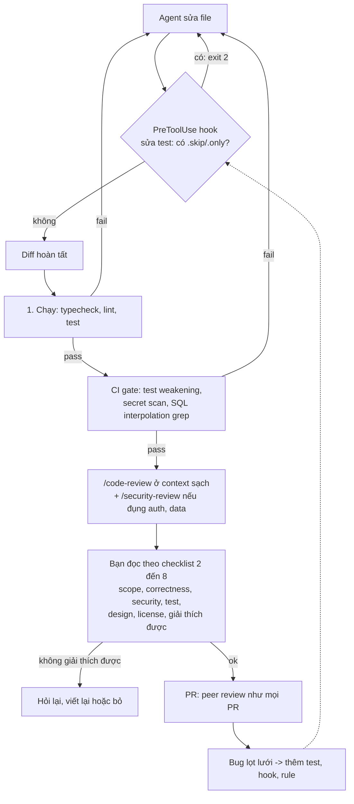
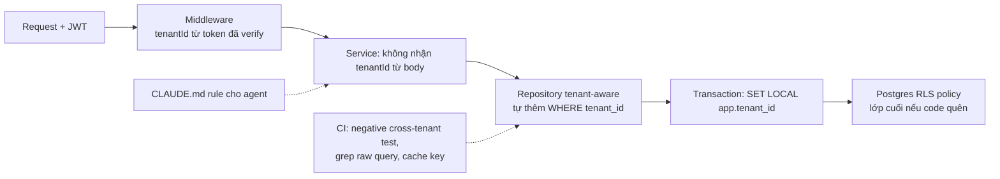

## Bối cảnh & vấn đề

Một PR 180 dòng do agent viết: thêm endpoint `GET /api/orders/:id`, một helper cache danh sách sản phẩm, và "sửa" một test flaky. CI xanh. Tác giả PR ghi "đã review". Reviewer thứ hai lướt qua trong 4 phút — code sạch, đặt tên đẹp, có test, có cả comment giải thích — và approve. Ba tuần sau, một khách hàng doanh nghiệp báo họ nhìn thấy **giá sản phẩm của công ty khác** trên trang catalog, và một người dùng khác phát hiện có thể đổi id trên URL để xem đơn hàng của tenant khác.

Không có dòng nào trong PR "trông sai". Đó chính là đặc trưng của code AI: **bề mặt rất tốt, lỗi nằm ở ngữ nghĩa**. Model tối ưu cho code *trông giống* code đúng — pattern quen thuộc, tên hợp lý, test có cấu trúc chuẩn — chứ không tối ưu cho các **invariant** (bất biến) không được viết ra trong code: "mọi query phải có tenant", "capture payment không được chạy hai lần", "stock không được âm dưới tải đồng thời". Khi invariant chỉ tồn tại trong đầu team, AI không biết nó, và reviewer lướt nhanh cũng không thấy thiếu.

Ba lý do review code AI khác review code người:

1. **Khối lượng.** Agent tạo diff nhanh hơn người đọc diff nhiều lần. Nếu bạn review bằng tốc độ và cách của một PR người viết, review trở thành bottleneck và bắt đầu hời hợt.
2. **Lỗi không giống lỗi người.** Người mới viết code xấu mà sai rõ; AI viết code đẹp mà sai tinh vi: `jwt.decode` thay `jwt.verify`, cache key "đơn giản hoá" bỏ tenant, refactor atomic update thành read-modify-write.
3. **Test "xanh giả".** Test do cùng agent viết thường chỉ khẳng định happy path mà nó vừa implement, hoặc bị "sửa cho pass" (`.skip`, xoá assertion). CI xanh không còn là tín hiệu mạnh.

Bài này đưa ra: một **checklist 8 bước** có thứ tự, **7 bug mẫu** (tenant, cache, flaky test, SQL, retry, race, JWT) kèm cách phát hiện nhanh, cơ chế tự động hoá một phần bằng hooks và CI, **defense in depth** cho tenant isolation, và cách **kể kinh nghiệm review** theo STAR trong phỏng vấn. Nguyên tắc xuyên suốt: *"Nếu tôi không giải thích được dòng này, tôi không merge"* — AI viết không bao giờ là lý do cho bug.

## Khái niệm

### Review theo invariant, không theo bề mặt

**Invariant** là một điều luôn phải đúng với hệ thống, bất kể code thay đổi thế nào: "user chỉ đọc được dữ liệu của tenant mình", "một order chỉ bị charge tối đa một lần", "qty không âm". Review theo invariant nghĩa là với mỗi diff, bạn hỏi *"diff này có thể phá invariant nào?"* trước khi hỏi *"code có sạch không?"*.

Vì sao phải đổi cách review? Vì bề mặt code AI hầu như luôn ổn — đặt tên, format, cấu trúc đều theo pattern phổ biến. Nếu reviewer dùng "trông ổn không" làm tín hiệu, tín hiệu đó gần như luôn trả lời "có". Invariant thì không hiện trên bề mặt: một dòng `where: { id }` thiếu `tenantId` trông hoàn toàn bình thường.

Ví dụ: diff đổi `const key = \`products:${tenantId}:${category}\`` thành `const key = category` với comment "simplified the key". Bề mặt: gọn hơn. Invariant: tenant isolation vừa vỡ.

**Interview angle:** interviewer muốn nghe bạn gọi tên được invariant của hệ thống (tenant, idempotency, atomicity, auth) và nói review xoáy vào đó.

### Checklist 8 bước (theo thứ tự)

Thứ tự quan trọng vì mỗi bước lọc bỏ lý do để làm bước sau:

1. **Chạy trước**: typecheck, lint, test, và test tay happy path. Không đọc code không compile.
2. **Scope**: diff có đụng file ngoài yêu cầu không? Có refactor "tiện tay"? Có thêm dependency?
3. **Correctness**: API có thật và đúng version? Edge case: null, rỗng, số âm, timezone, concurrency, retry. Error handling có nuốt lỗi hay fail open không?
4. **Security**: input validation, injection (SQL/NoSQL/command), authz + tenant filter, secret hard-code, log lộ token/PII.
5. **Test**: assertion có ý nghĩa? Có test negative (cross-tenant, lỗi, input xấu)? Mock có quá tay (mock luôn chính thứ đang test)? Có test nào bị skip/nới?
6. **Design/maintainability**: đúng pattern của codebase? Có duplicate helper đã tồn tại?
7. **License/provenance**: đoạn dài giống y hệt một thư viện hoặc repo khác?
8. **Câu hỏi cuối**: *tôi có giải thích được từng dòng không?* Không → không merge, hỏi lại hoặc viết lại.

Bước hay bị bỏ nhất trong thực tế là **bước 5** (đọc test) và **bước 2** (scope): người ta thấy test xanh là coi như test tốt, và không để ý agent đã sửa 3 file không liên quan. Hậu quả: test "xanh giả" che đúng những bug quan trọng nhất (followUp của ai-assisted-engineering-010).

**Interview angle:** trả lời ai-assisted-engineering-010 bằng một checklist có thứ tự, và nói được bước nào hay bị bỏ và vì sao.

### Test "xanh giả" và test weakening

**Test xanh giả** là test pass nhưng không chứng minh điều cần chứng minh: chỉ phủ happy path, assertion yếu (`toBeTruthy`, `toHaveBeenCalled()` không kiểm tham số), hoặc mock chính thứ cần test. **Test weakening** là khi một thay đổi làm test yếu đi để pass: thêm `.skip`/`.only`, xoá hoặc comment assertion, nới assertion, tăng `sleep`.

Agent hay làm vậy vì mục tiêu nó nhận được thường là "làm cho test xanh" — và xoá assertion là đường ngắn nhất tới mục tiêu đó. Cách chặn: nói rõ trong CLAUDE.md ("không bao giờ skip/xoá test hoặc nới assertion; nếu tin test sai, dừng và hỏi"), chặn bằng **hook** khi agent sửa file test, và chặn bằng **CI gate** trên diff. Ví dụ thực tế bên dưới có cả hai script, chạy thật.

**Interview angle:** câu ai-assisted-engineering-013 kiểm tra xem bạn có approve "vì CI xanh" không; followUp hỏi cách phát hiện tự động trong CI.

### Negative test

**Negative test** kiểm tra rằng hệ thống **từ chối** điều phải bị từ chối: user tenant B đọc order của tenant A phải nhận 404; token có chữ ký sai phải nhận 401; hai request đồng thời trên stock 1 chỉ được thành công một. Đây là loại test mà agent ít tự viết nhất, vì prompt "viết test cho endpoint này" được hiểu là "chứng minh endpoint chạy".

Một quy tắc đơn giản rất hiệu quả: **mỗi endpoint mới đọc/ghi dữ liệu tenant phải có ít nhất một cross-tenant negative test**, và reviewer tìm test đó trước tiên.

**Interview angle:** khi được đưa một đoạn code "tests all pass", câu trả lời mạnh luôn là "test nào đang thiếu" chứ không chỉ "code sai ở đâu".

### Defense in depth cho tenant isolation

**Defense in depth** nghĩa là không dựa vào một lớp bảo vệ duy nhất. Với tenant isolation, nếu lớp duy nhất là "mỗi dev (hoặc AI) nhớ thêm `tenantId` vào mỗi query", thì một lần quên là một lần leak. Các lớp nên có:

1. **Tenant lấy từ token**, không từ request body/query, trong middleware chung.
2. **Repository/query builder tenant-aware**: API data access tự thêm điều kiện tenant, code nghiệp vụ không gọi DB trực tiếp.
3. **Row-Level Security** (RLS) ở Postgres: policy lọc theo `current_setting('app.tenant_id')`, set bằng `SET LOCAL` trong transaction — lớp cuối cùng kể cả khi code quên.
4. **Rule trong CLAUDE.md** để agent biết pattern bắt buộc.
5. **Negative test bắt buộc** và **CI grep** cho raw query / cache key thiếu tenant.

Điểm mấu chốt để trả lời ai-assisted-engineering-044: nói rõ **lớp nào thực sự có** trên dự án của bạn và lớp nào là đề xuất — đừng bịa.

**Interview angle:** followUp "làm sao để lớp bug này không thể tái diễn" muốn nghe về enforce ở tầng chung (repository, RLS), không phải "review kỹ hơn".

### Lời giải thích của AI không phải bằng chứng

Agent thường kèm diff một đoạn giải thích rất thuyết phục: "Tôi đã đơn giản hoá cache key vì category là duy nhất". Lời giải thích này được sinh bằng cùng cơ chế dự đoán như code — nó nhất quán với chính diff, nhưng không có nghĩa là đúng với hệ thống. Khi bạn hỏi lại "có chắc không?", model hay đồng ý với bạn (**sycophancy**) hoặc sửa cái đúng thành sai.

Bằng chứng thật chỉ có mấy loại: **test chạy** (đặc biệt test negative, concurrency), **docs chính thức đúng version**, **source code của thư viện**, **đo đạc** (`EXPLAIN ANALYZE`, benchmark), và **reproduce**. Với claim "query này sẽ dùng index", bằng chứng là `EXPLAIN (ANALYZE, BUFFERS)` trên dữ liệu kích thước thật, không phải câu trả lời của model (followUp của ai-assisted-engineering-031).

**Interview angle:** câu ai-assisted-engineering-031 là câu "gotcha" — đáp án đúng liệt kê được các loại bằng chứng, không dừng ở "AI có thể sai".

## Cơ chế hoạt động

Một diff do AI viết nên đi qua **ba lớp lọc** trước khi tới mắt peer reviewer: lớp máy chặn cứng (hook trong lúc agent làm việc, CI gate), lớp review máy ở context sạch (`/code-review`, `/security-review`), và lớp bạn đọc theo checklist. Lớp máy rẻ và không mệt; lớp người đắt nhưng là lớp duy nhất hiểu invariant nghiệp vụ.



Đọc sơ đồ từ trên xuống: **hook** chặn ngay khi agent định thêm `.skip` vào file test — agent nhận lý do qua stderr và phải tìm cách khác. **Chạy** là cổng rẻ nhất; không có lý do đọc code không compile. **CI gate** bắt các pattern cơ học mà người lướt dễ bỏ sót. `/code-review` (alias `/review`) chạy review trong một subagent **context sạch** — nó không "nhớ" lý do mà session viết code đã tự thuyết phục mình, nên giống một reviewer thứ hai hơn (verify flag `--comment`/`--fix` theo version bạn dùng). Sau đó mới tới bạn, và cuối cùng là peer review bình thường. Mũi tên chấm là phần hay bị quên: mỗi bug lọt phải biến thành một test, hook hoặc rule, nếu không team sẽ trả giá lại.

### Bảy bug mẫu và dấu hiệu nhận biết nhanh

Bảng dưới là "bộ nhận diện" cho bảy lỗi AI hay mắc nhất ở backend. Cột "dấu hiệu" là thứ bạn quét bằng mắt trong 10 giây; cột "bằng chứng" là thứ bạn chạy để chắc chắn.

| # | Bug | Dấu hiệu trong diff | Bằng chứng / test cần có | Fix đúng |
|---|---|---|---|---|
| 1 | IDOR / thiếu tenant (011) | `findUnique({ where: { id } })`, không có `tenantId` | Test tenant B đọc resource tenant A → 404 | `where: { id, tenantId: req.auth.tenantId }`, enforce ở repository/RLS, trả 404, dùng DTO |
| 2 | Cache key thiếu tenant, không TTL (012) | `const key = category`, `new Map()` global | Test 2 tenant cùng category nhận dữ liệu riêng | Key `products:{tenant}:{category}`, TTL + max size hoặc Redis, invalidate khi ghi |
| 3 | Sửa flaky test bằng skip/sleep (013) | `.skip`, assertion bị comment, `setTimeout(…, 2000)` | Diff test: số assertion giảm | `await` promise gửi mail, fake timers, `waitFor` theo điều kiện; cấm skip trong CI |
| 4 | SQL injection qua string interpolation (014) | `${q}` trong SQL, `ORDER BY ${sort}` | Input `' OR 1=1 --` hoặc `sort=name; DROP…` | Bind parameter cho giá trị; allowlist cho tên cột; escape `%` `_` trong LIKE |
| 5 | Retry không idempotent cho side-effect (027) | `withRetry(() => gateway.capture(...))`, catch mọi lỗi | Test: lần 1 timeout nhưng đã capture → retry → 2 lần charge | Idempotency key ổn định, chỉ retry lỗi transient, backoff + jitter, trạng thái "unknown" + reconcile |
| 6 | Race do read-modify-write (028) | `findOne` → kiểm tra → `save` thay cho một `UPDATE … WHERE` | Test N request song song trên qty nhỏ | `UPDATE … WHERE qty >= n` + kiểm `rowCount`, hoặc `SELECT … FOR UPDATE`, hoặc optimistic lock |
| 7 | JWT decode thay verify, fail open (029) | `jwt.decode(`, `catch { next() }`, log `req.headers` | Test token chữ ký sai / `alg` lạ → 401 | `jwt.verify(token, key, { algorithms: ['RS256'], issuer, audience })`, catch → 401, không log header |

Điểm chung của cả bảy: code **chạy đúng ở happy path đơn luồng một tenant**, đúng loại test mà agent tự viết. Vì vậy câu hỏi review đầu tiên luôn là *"test nào đang thiếu để chứng minh invariant?"*.

### Bug 4 chi tiết: vì sao ORDER BY không bind được

Bind parameter (`$1`, `$2`) thay thế **giá trị** (literal) trong câu SQL sau khi câu lệnh đã được parse. Tên cột, tên bảng, từ khoá `ASC/DESC` là **identifier/cú pháp** — chúng phải biết ở lúc parse để planner lập plan, nên không thể là parameter. Truyền `$3` vào `ORDER BY $3` chỉ sắp xếp theo một hằng số (mọi dòng bằng nhau), không lỗi mà cũng không sort. Cách đúng là **allowlist**: map giá trị người dùng sang tên cột cố định.

```ts
const SORT_COLUMNS = { name: 'name', created: 'created_at' } as const;
const escapeLike = (s: string) => s.replace(/[\\%_]/g, (c) => '\\' + c);

export async function searchCustomers(tenantId: string, q: string, sort = 'name') {
  const col = SORT_COLUMNS[sort as keyof typeof SORT_COLUMNS] ?? 'name';
  return db.query(
    `SELECT id, name, email FROM customers
     WHERE tenant_id = $1 AND name ILIKE $2
     ORDER BY ${col}, id LIMIT 50`,   // col đến từ allowlist, id làm tie-breaker
    [tenantId, `%${escapeLike(q)}%`],
  );
}
```

Thêm hai điểm reviewer nên nhắc: `ILIKE '%x%'` không dùng được B-tree index → cần `pg_trgm` GIN index nếu bảng lớn; và bản AI gốc đã parameterize **đúng một nửa** (`tenant_id = $1`), thứ dễ lừa người lướt nhanh nhất.

### Bug 5 chi tiết: retry cho payment

Retry an toàn chỉ khi thao tác **idempotent** — chạy nhiều lần cho cùng kết quả như chạy một lần. `capture` một khoản tiền không idempotent: nếu request đầu tiên đã tới gateway và capture thành công nhưng response bị timeout, retry sẽ capture lần nữa. Cách chuẩn là gửi **idempotency key** ổn định (ví dụ `capture:{orderId}`) để gateway dedupe (nhiều gateway lớn hỗ trợ header kiểu `Idempotency-Key`; verify với gateway bạn dùng). Nếu gateway không hỗ trợ: ghi trạng thái "capture pending" trước khi gọi, khi lỗi không rõ ràng thì **không retry mù** mà đánh dấu "unknown" và **reconcile** — query trạng thái giao dịch từ gateway theo `orderId` rồi quyết định.

```ts
const RETRYABLE = (e: any) => e.code === 'ECONNRESET' || e.status >= 500 || e.status === 429;

await withRetry(
  () => paymentGateway.capture({ orderId, amount }, { idempotencyKey: `capture:${orderId}` }),
  { retries: 3, retryIf: RETRYABLE, backoff: 'exponential', jitter: true, maxElapsedMs: 10_000 },
);
```

AI viết đúng "pattern retry" vì pattern đó phổ biến; cái nó không biết là **ngữ nghĩa nghiệp vụ** của side-effect đằng sau `fn`.

### Bug 7 chi tiết: decode vs verify

Trong thư viện `jsonwebtoken`, `jwt.decode(token)` chỉ base64-decode payload và **không kiểm tra chữ ký** — ai cũng tạo được token `{"role":"admin"}`. `jwt.verify(token, key, options)` mới kiểm chữ ký, `exp`, và (nếu truyền) `issuer`/`audience`; pin `algorithms` để chặn tấn công đổi thuật toán. Hai hàm đều "trả về payload" nên trông như nhau trong diff — lý do AI hay nhầm. Thêm hai lỗi trong cùng đoạn code của ai-assisted-engineering-029: `catch` gọi `next()` là **fail open** (lỗi thì cho qua), và `console.log(req.headers)` ghi token vào log. Test cần có: token ký bằng key khác → 401, token hết hạn → 401, không có header → 401 — một bộ test chứng minh middleware **fail closed**.

### Defense in depth cho tenant: các lớp từ ngoài vào trong



Mỗi lớp giả định lớp trước có thể thủng. Middleware đảm bảo tenant không đến từ input người dùng; repository làm cho cách "dễ nhất" để truy vấn cũng là cách đúng (agent và người đều đi đường dễ nhất); RLS là lưới an toàn ở database — kể cả raw query quên tenant cũng chỉ thấy dòng của tenant hiện tại. CI và CLAUDE.md là hai lớp "mềm" giúp lỗi bị bắt sớm hơn, trước khi tới RLS.

```sql
ALTER TABLE orders ENABLE ROW LEVEL SECURITY;
CREATE POLICY tenant_isolation ON orders
  USING (tenant_id = current_setting('app.tenant_id')::uuid);
-- trong mỗi transaction của request:
BEGIN;
SELECT set_config('app.tenant_id', $1, true);  -- tương đương SET LOCAL, nhưng bind được parameter
SELECT * FROM orders WHERE id = $1;   -- chỉ thấy order của tenant hiện tại
COMMIT;
```

Lưu ý: RLS mặc định không áp dụng cho table owner (trừ khi bật `ALTER TABLE ... FORCE ROW LEVEL SECURITY`) và luôn bị bỏ qua bởi superuser hoặc role có `BYPASSRLS` — app nên kết nối bằng một role thường, không phải owner. Với PgBouncer transaction mode, dùng `SET LOCAL` (trong transaction) chứ không dùng `SET` (session), nếu không giá trị tenant có thể "dính" sang request khác dùng chung connection.

## Ví dụ thực tế

Các ví dụ dưới đây chạy thật trong một thư mục scratch với Node 24, git 2.50 và `jq`. Mục tiêu: biến ba bug mẫu thành **test đỏ**, và biến việc chặn test weakening thành **script chạy được**.

### Ví dụ 1 — test bắt cache leak và oversell

Hai hàm được tái tạo từ ai-assisted-engineering-012 và 028: cache key "đơn giản hoá" bỏ tenant, và `reserve` bị refactor từ atomic update sang read-modify-write. Repo giả lập DB có độ trễ 5ms để các `await` xen kẽ nhau như thật.

```js
// cache.js — bản AI "tối ưu"
export function makeGetProducts(repo) {
  const cache = new Map();
  return async function getProducts(tenantId, category) {
    const key = category;                       // <- bug
    if (cache.has(key)) return cache.get(key);
    const rows = await repo.findProducts(tenantId, category);
    cache.set(key, rows);
    return rows;
  };
}
```

```js
// race.js
const tick = () => new Promise((r) => setTimeout(r, 5)); // giả lập network tới DB
export function makeStock(qty) {
  const row = { sku: 'A1', qty };
  return {
    row,
    async findOne() { await tick(); return { ...row }; },
    async save(item) { await tick(); row.qty = item.qty; },
    // atomic: UPDATE stock SET qty = qty - $2 WHERE sku = $1 AND qty >= $2
    async decrementIfEnough(n) { await tick(); if (row.qty >= n) { row.qty -= n; return 1; } return 0; },
  };
}
export async function reserveRMW(repo, n) {           // bản AI refactor
  const item = await repo.findOne();
  if (item.qty < n) throw new Error('OutOfStock');
  item.qty -= n;
  await repo.save(item);
}
export async function reserveAtomic(repo, n) {        // bản gốc
  const rowCount = await repo.decrementIfEnough(n);
  if (rowCount !== 1) throw new Error('OutOfStock');
}
```

```js
// test/review.test.js — hai test mà agent KHÔNG tự viết
import { test } from 'node:test';
import assert from 'node:assert/strict';
import { makeGetProducts } from '../cache.js';
import { makeStock, reserveRMW, reserveAtomic } from '../race.js';

test('cache: tenant B không được thấy sản phẩm của tenant A', async () => {
  const repo = { findProducts: async (t, c) => [{ tenantId: t, category: c }] };
  const getProducts = makeGetProducts(repo);
  await getProducts('tenant-a', 'shoes');
  const rowsB = await getProducts('tenant-b', 'shoes');
  assert.equal(rowsB[0].tenantId, 'tenant-b');
});

for (const [name, reserve] of [['read-modify-write', reserveRMW], ['atomic update', reserveAtomic]]) {
  test(`stock: 2 request song song, qty=1 -> đúng 1 thành công (${name})`, async () => {
    const repo = makeStock(1);
    const results = await Promise.allSettled([reserve(repo, 1), reserve(repo, 1)]);
    const ok = results.filter((r) => r.status === 'fulfilled').length;
    assert.equal(ok, 1, `thành công ${ok} lần, qty cuối = ${repo.row.qty}`);
  });
}
```

```bash
node --test test/review.test.js
```

```text
✖ cache: tenant B không được thấy sản phẩm của tenant A (1.060625ms)
✖ stock: 2 request song song, qty=1 -> đúng 1 thành công (read-modify-write) (12.665875ms)
✔ stock: 2 request song song, qty=1 -> đúng 1 thành công (atomic update) (7.065625ms)
ℹ tests 3
ℹ pass 1
ℹ fail 2

✖ cache: tenant B không được thấy sản phẩm của tenant A (1.060625ms)
  AssertionError [ERR_ASSERTION]: Expected values to be strictly equal:
  + actual - expected

  + 'tenant-a'
  - 'tenant-b'

✖ stock: 2 request song song, qty=1 -> đúng 1 thành công (read-modify-write) (12.665875ms)
  AssertionError [ERR_ASSERTION]: thành công 2 lần, qty cuối = 0
```

(output rút gọn phần stack trace)

Đọc kết quả: tenant B nhận về dữ liệu `'tenant-a'` — leak dữ liệu giữa tenant. Với read-modify-write, **cả hai** request đều thành công trên stock 1 (bán 2 món khi chỉ có 1), và `qty cuối = 0` chứ không âm — tức là không có dấu hiệu gì trong DB để phát hiện, đây là **lost update** kinh điển. Bản atomic chỉ cho một request thành công. Sau khi sửa key thành `` `products:${tenantId}:${category}` ``, test cache chuyển xanh:

```text
✔ cache: tenant B không được thấy sản phẩm của tenant A (0.478542ms)
```

Lưu ý giới hạn: test race dùng repo giả lập; với DB thật, test tương đương chạy `Promise.all` N request trên một Postgres test (testcontainers) — nhưng nguyên tắc giống hệt: **test concurrency phải chạy song song thật**, không tuần tự.

### Ví dụ 2 — hook chặn agent skip test (PreToolUse)

Hook là lệnh shell mà Claude Code chạy ở các thời điểm trong vòng đời, nhận JSON sự kiện qua **stdin**. Với `PreToolUse`, exit code 2 **chặn** tool call và stderr được gửi lại cho Claude để nó đổi hướng. Script:

```bash
#!/usr/bin/env bash
# .claude/hooks/guard-tests.sh — PreToolUse hook (matcher: Edit|Write): chặn agent skip/only test.
# Claude Code gửi JSON sự kiện qua stdin; exit 2 = chặn tool call, stderr được trả lại cho Claude.
input=$(cat)
file=$(jq -r '.tool_input.file_path // empty' <<<"$input")
[[ "$file" =~ \.(test|spec)\.[jt]sx?$ ]] || exit 0
new=$(jq -r '.tool_input.new_string // .tool_input.content // empty' <<<"$input")
if grep -qE '(^|[^A-Za-z])(it|test|describe)\.(skip|only)\(|(^|[^A-Za-z])x(it|describe)\(' <<<"$new"; then
  echo "Blocked: không được thêm .skip/.only/xit vào $file. Tìm root cause của test fail; nếu tin test sai, DỪNG và hỏi người." >&2
  exit 2
fi
exit 0
```

Đăng ký trong `.claude/settings.json` (commit cho cả team):

```json
{
  "hooks": {
    "PreToolUse": [
      {
        "matcher": "Edit|Write",
        "hooks": [
          { "type": "command", "command": "\"$CLAUDE_PROJECT_DIR\"/.claude/hooks/guard-tests.sh" }
        ]
      }
    ]
  }
}
```

Test hook bằng JSON mẫu, không cần mở Claude Code:

```bash
echo '{"hook_event_name":"PreToolUse","tool_name":"Edit","tool_input":{"file_path":"/repo/src/checkout.test.ts","old_string":"it(\"sends email\"","new_string":"it.skip(\"sends email\""}}' | ./guard-tests.sh; echo "exit=$?"
echo '{"hook_event_name":"PreToolUse","tool_name":"Edit","tool_input":{"file_path":"/repo/src/checkout.ts","old_string":"a","new_string":"b"}}' | ./guard-tests.sh; echo "exit=$?"
echo '{"hook_event_name":"PreToolUse","tool_name":"Write","tool_input":{"file_path":"/repo/src/cart.spec.ts","content":"describe(\"cart\", () => { it(\"adds\", () => expect(1).toBe(1)) })"}}' | ./guard-tests.sh; echo "exit=$?"
```

```text
Blocked: không được thêm .skip/.only/xit vào /repo/src/checkout.test.ts. Tìm root cause của test fail; nếu tin test sai, DỪNG và hỏi người.
exit=2
exit=0
exit=0
```

Hook này chỉ bắt được `.skip/.only` trong **nội dung mới**; nó không thấy việc xoá assertion (vì Edit chỉ gửi đoạn thay thế). Phần đó để CI gate làm trên toàn bộ diff.

### Ví dụ 3 — CI gate phát hiện test weakening

```bash
#!/usr/bin/env bash
# scripts/check-test-weakening.sh — dùng: ./check-test-weakening.sh origin/main
set -euo pipefail
base="${1:-origin/main}"
# chỉ giữ dòng thêm (+) / xoá (-) thật, bỏ header +++ / ---
diff=$(git diff -U0 "$base" -- '*.test.*' '*.spec.*' | grep -vE '^(\+\+\+|---) ' || true)
plus=$(printf '%s\n' "$diff" | grep -E '^\+' || true)
minus=$(printf '%s\n' "$diff" | grep -E '^-' || true)
fail=0

skips=$(printf '%s\n' "$plus" | grep -E '(^|[^A-Za-z])(it|test|describe)\.(skip|only)\(|(^|[^A-Za-z])x(it|describe)\(' || true)
if [[ -n "$skips" ]]; then echo "❌ thêm .skip/.only:"; echo "$skips"; fail=1; fi

removed=$(printf '%s\n' "$minus" | grep -cE 'expect\(' || true)
added=$(printf '%s\n' "$plus" | grep -vE '^\+[[:space:]]*//' | grep -cE 'expect\(' || true)
if (( removed > added )); then echo "❌ số assertion giảm: -$removed / +$added"; fail=1; fi

sleeps=$(printf '%s\n' "$plus" | grep -E 'setTimeout\([^,]+,[[:space:]]*[0-9]{4,}\)' || true)
if [[ -n "$sleeps" ]]; then echo "❌ sleep cố định >= 1s trong test:"; echo "$sleeps"; fail=1; fi

if (( fail == 0 )); then echo "✅ không thấy dấu hiệu làm yếu test"; fi
exit $fail
```

Chạy trên đúng diff của ai-assisted-engineering-013 (commit base có test gốc, working tree có bản agent sửa), rồi chạy lại khi đã stash thay đổi:

```text
$ ./check-test-weakening.sh base; echo "exit=$?"
❌ thêm .skip/.only:
+it.skip('sends confirmation email after checkout', async () => {
❌ số assertion giảm: -1 / +0
❌ sleep cố định >= 1s trong test:
+  await new Promise((r) => setTimeout(r, 2000));
exit=1

$ git stash -q; ./check-test-weakening.sh base; echo "exit=$?"
✅ không thấy dấu hiệu làm yếu test
exit=0
```

Script cố tình đơn giản (grep theo dòng); nó có false positive (đổi tên test = 1 dòng `-expect` + 1 dòng `+expect`, vẫn cân bằng) và false negative (nới `toEqual(x)` thành `toBeTruthy()` không đổi số `expect(`). Ở team lớn hơn, bổ sung **mutation testing** (ví dụ Stryker) cho module lõi để đo test có thật sự bắt lỗi không (verify tool phù hợp với stack của bạn).

### Ví dụ 4 — grep nhanh các pattern nguy hiểm

```bash
grep -rnE '\$\{[^}]+\}' src --include='*.ts' | grep -iE 'select|where|order by|insert|update|ilike'
grep -rnE 'jwt\.decode\(' src
```

```text
src/customers.ts:4:     WHERE tenant_id = $1 AND name ILIKE '%${q}%'
src/customers.ts:5:     ORDER BY ${sort} LIMIT 50`,
src/auth.ts:4:  const payload = jwt.decode(token);
```

Grep không thay được review — bản đã sửa ở phần Cơ chế vẫn có `ORDER BY ${col}` hợp lệ vì `col` đến từ allowlist — nhưng nó cho bạn **danh sách chỗ phải nhìn**. Trong CI, chạy nó ở chế độ cảnh báo (comment lên PR) thay vì chặn cứng, hoặc dùng rule ESLint/Semgrep chuyên dụng để giảm false positive.

### Ví dụ 5 — subagent reviewer và prompt review tốt vs tệ

Session viết code đã "tự thuyết phục" rằng code đúng; review trong cùng session thường chỉ xác nhận lại. Dùng `/code-review` hoặc một subagent riêng có context sạch:

```markdown
---
name: ai-diff-reviewer
description: Reviews a diff for AI-typical semantic bugs (tenant scoping, idempotency, atomicity, auth, test weakening). Use after implementation, before opening a PR.
tools: Read, Grep, Glob, Bash
---
Review `git diff origin/main...HEAD`. Do not edit files.
For each finding give: file:line, the invariant at risk, a concrete failing scenario, and the missing test.
Check in order: scope creep; tenant filter on every data access and cache key; retries around side effects (idempotency key?);
read-modify-write that used to be a single UPDATE; jwt.decode / fail-open catch; string-built SQL; tests that were skipped,
deleted, loosened, or only cover the happy path. If you are not sure, say "UNSURE" instead of guessing.
```

```text
❌ Tệ: "Review code này giúp tôi."            → nhận về nhận xét style, "LGTM with minor suggestions".
✅ Tốt: "Review diff so với origin/main. Invariant: mọi query/caching phải scope theo tenantId;
        capture payment tối đa 1 lần; stock không oversell. Với mỗi vi phạm: file:line, kịch bản fail,
        test còn thiếu. Không sửa file."
```

Prompt tốt **nêu invariant**, đòi **kịch bản fail cụ thể** và **test còn thiếu** — ba thứ biến nhận xét thành bằng chứng kiểm chứng được. Output của reviewer AI vẫn chỉ là **gợi ý**; bạn chạy test nó đề xuất để xác nhận.

## Trade-offs & lựa chọn thay thế

| Lớp kiểm soát | Bắt được gì | Không bắt được gì | Chi phí | Khi nào dùng |
|---|---|---|---|---|
| Chạy typecheck/lint/test | API bịa, sai type, test có sẵn bị vỡ | Invariant không có test | Rất thấp | Luôn luôn, trước mọi thứ khác |
| Hook trong lúc agent làm (PreToolUse/PostToolUse) | Hành vi cấm cơ học: skip test, sửa file cấm, format | Lỗi ngữ nghĩa | Thấp, viết một lần | Rule "không bao giờ được" mà agent hay vi phạm |
| CI gate trên diff (grep, secret scan, SAST, test weakening) | Pattern nguy hiểm, secret, test bị làm yếu | Logic nghiệp vụ | Thấp–vừa, có false positive | Mọi repo; chặn cứng cái chắc chắn, cảnh báo cái mơ hồ |
| `/code-review` hoặc subagent reviewer context sạch | Nhiều lỗi ngữ nghĩa phổ biến, scope creep | Invariant riêng của team nếu không được nói | Thấp | Mọi PR do agent viết, trước khi mở PR |
| Bạn review theo checklist + invariant | Hầu hết mọi thứ, nếu tập trung | Khi mệt, khi diff quá to | Cao (thời gian của bạn) | Luôn luôn; sâu nhất ở tenant, tiền, auth, migration |
| Peer review + CODEOWNERS | Góc nhìn thứ hai, kiến thức domain | Như trên, nếu reviewer lướt | Cao | Mọi PR; bắt buộc owner cho module nhạy cảm |
| Enforce ở tầng chung (repository, RLS, idempotency layer) | Cả lớp bug, vĩnh viễn | Bug ở chỗ bypass tầng chung | Cao lúc đầu, rẻ về sau | Invariant sống còn (tenant, payment) |

Không lớp nào đủ một mình. Quy tắc chọn: **cái gì máy làm được thì để máy làm** (chạy test, grep, hook), để thời gian của bạn dồn vào phần máy không hiểu — ý định nghiệp vụ và invariant. Với invariant sống còn như tenant isolation hay "charge tối đa một lần", đầu tư vào **enforce ở tầng chung** thay vì review kỹ hơn: review là xác suất, tầng chung là cấu trúc.

So với review code người viết, review code AI nên **nghiêng về test hơn đọc**: thay vì đọc 200 dòng để tự tìm race condition, viết (hoặc bắt agent viết) một test chạy song song N request và xem nó đỏ hay xanh. Cursor, Copilot và các tool khác cũng có tính năng review PR tự động; giá trị của chúng tương tự `/code-review` — một lượt lọc rẻ, không thay thế người review hiểu domain.

Về **kích thước diff**: diff nhỏ (dưới vài trăm dòng, một mục đích) review được nghiêm túc; diff 2.000 dòng thì không ai review nổi và LGTM trở thành hình thức. Nếu agent tạo diff lớn, chia thành nhiều PR (refactor cơ học riêng, thay đổi hành vi riêng) trước khi review.

## Edge cases & failure modes

- **Review fatigue.** Agent tạo 10 PR/ngày, bạn review 10 PR/ngày, tới PR thứ 7 bạn bắt đầu lướt. Đây là failure mode phổ biến nhất khi team tăng throughput bằng AI (liên quan ai-assisted-engineering-030). Phòng: giới hạn PR size, giới hạn WIP, dồn sức review vào module rủi ro (CODEOWNERS), để máy lo phần cơ học.
- **Test do chính agent viết cùng diff.** Agent implement và viết test trong cùng một lần → test khẳng định đúng cái nó vừa làm, kể cả bug. Phòng: viết/duyệt test trước (tests as spec), hoặc bắt reviewer tìm test negative trước tiên.
- **Refactor "không đổi hành vi" nhưng đổi semantics.** Đổi một `UPDATE ... WHERE` thành ORM `findOne` + `save`, đổi `Promise.all` thành vòng lặp tuần tự (hoặc ngược lại), gỡ một transaction "thừa" — test đơn luồng vẫn xanh. Phòng: với refactor chạm DB, hỏi "transaction boundary và atomicity có đổi không?", thêm concurrency test.
- **Fix cho test flaky làm mất tín hiệu.** Tăng sleep, thêm retry cho test, `.skip` — CI xanh trở lại nhưng tính năng có thể đang hỏng thật. Phòng: hook + CI gate như ví dụ, và rule "flaky test phải có root cause".
- **Reviewer AI đồng ý với bạn.** Bạn hỏi "chỗ này có race không?", model nói "có" vì bạn gợi ý; hỏi "chắc chưa, tôi nghĩ không", model đổi ý. Phòng: đòi kịch bản fail cụ thể và test tái hiện; tin test, không tin câu trả lời.
- **Secret/PII trong diff hoặc log.** Agent thêm `console.log(req.headers)` để debug rồi quên xoá, hoặc hard-code API key vào test fixture. Phòng: secret scan trong CI (gitleaks hoặc tương đương), rule log không ghi header/body.
- **Dependency mới trong diff.** Agent thêm package để giải quyết việc nhỏ — có thể là tên bịa (slopsquatting), unmaintained, license không phù hợp. Phòng: bước "scope" của checklist bắt mọi thay đổi `package.json`; kiểm tra bằng `npm view <pkg>` (maintainer, ngày publish, repo) trước khi chấp nhận.
- **Code giống y hệt nguồn khác.** Đoạn dài trông "quá hoàn chỉnh" có thể sao từ một repo có license không tương thích. Phòng: nghi ngờ đoạn dài lạ phong cách, tìm thử trên code search, theo policy của công ty.

## Pitfalls

- ❌ Approve vì CI xanh → ✅ CI xanh là điều kiện cần; đọc **test** trước, tìm test negative. Vì test do agent viết thường chỉ phủ happy path.
- ❌ "Review như mọi PR khác" → ✅ review theo invariant và danh sách lỗi AI điển hình (tenant, idempotency, atomicity, auth, test weakening). Vì bề mặt code AI luôn trông ổn.
- ❌ Tin lời giải thích kèm diff ("đã đơn giản hoá vì category là duy nhất") → ✅ kiểm chứng bằng test/docs/đo đạc. Vì lời giải thích được sinh ra cùng cơ chế với code.
- ❌ Review trong cùng session đã viết code → ✅ `/code-review` hoặc session/subagent context sạch, rồi mới tới bạn.
- ❌ Chặn test weakening bằng lời dặn → ✅ hook PreToolUse + CI gate trên diff. Lời dặn trong prompt là gợi ý; hook và CI là cơ chế.
- ❌ Sửa bug tenant bằng cách thêm `tenantId` vào đúng một query → ✅ thêm negative test và enforce ở repository/RLS để cả lớp bug không tái diễn.
- ❌ Chấp nhận `withRetry` quanh mọi call → ✅ hỏi "side-effect này có idempotent không?" trước khi cho retry; payment cần idempotency key hoặc reconcile.
- ❌ Merge diff 2.000 dòng vì "agent làm cơ học thôi" → ✅ chia PR: refactor cơ học riêng, đổi hành vi riêng.
- ❌ Khi bị hỏi phỏng vấn, đổ lỗi cho tool ("AI viết sai") → ✅ nhận phần review đã bỏ sót và nói đã thêm test/rule gì. Vì bạn là owner của mọi dòng merge.

## Kể kinh nghiệm review trong phỏng vấn

Ba câu CV-linked (ai-assisted-engineering-043, 044, 045) đều kiểm tra một điều: bạn có **quy trình thật** hay chỉ nói khẩu hiệu. Red flag lớn nhất là "human review = tôi lướt qua trước khi commit" hoặc không nêu được một lỗi cụ thể AI từng mắc.

### Mẫu mô tả "human review" (043)

Trả lời theo từng checkpoint, mỗi cái một câu, và chỉ nói những gì **thực sự có** trên dự án:

1. Loại task giao AI (scaffold endpoint, mapping DTO, test, refactor cơ học) và loại review sâu hoặc không giao (tenant filter, authz, checkout/payment, migration).
2. Plan được duyệt trước khi agent sửa code.
3. Typecheck/lint/test chạy tự động; hook/CI chặn gì (nếu có).
4. Bạn đọc diff theo checklist; câu cuối là "giải thích được từng dòng".
5. PR đi qua peer review như mọi PR, disclosure nếu team có policy.
6. Một ví dụ AI sai mà bạn bắt được — (điền ví dụ thật của bạn).

### Khung STAR cho "AI code trông đúng nhưng sai" (045)

```text
(minh hoạ — thay bằng câu chuyện thật của bạn, không bịa số)
S: Agent refactor module giữ hàng từ SQL thuần sang repository pattern cho "sạch" hơn, PR ~150 dòng, test xanh.
T: Tôi là reviewer, module nằm trên luồng checkout.
A: Checklist bước 3 (concurrency) — thấy UPDATE ... WHERE qty >= n bị thay bằng findOne + save.
   Viết test chạy 20 request song song trên qty = 5: bản mới thành công 9 lần, bản cũ đúng 5.
   Trả PR kèm test, giữ repository pattern nhưng dùng câu UPDATE có điều kiện + kiểm rowCount.
R: Bug không lên production. (điền số liệu thật: thời gian review, số PR tương tự sau đó)
Bài học: thêm dòng vào CLAUDE.md "không đổi câu UPDATE có điều kiện thành read-modify-write",
   thêm concurrency test vào suite, thêm mục "atomicity" vào review checklist.
```

Điểm ăn tiền của câu trả lời: **cách phát hiện** (checklist + test tái hiện, không phải "may mắn thấy"), **fix giữ được ý đồ** của refactor, và **thay đổi hệ thống** sau đó (rule, test, checklist). Nếu bug đã lọt, nhận phần review bỏ sót — đừng đổ lỗi cho tool.

### Tenant isolation (044)

Trả lời theo các lớp defense in depth ở trên, và **tách rõ** "đã có" vs "đề xuất": ví dụ "middleware lấy tenant từ token và repository tự thêm filter là có thật; RLS là đề xuất tôi đã đưa ra nhưng chưa triển khai". FollowUp "bạn đã từng tìm thấy bug tenant trong review chưa" — chuẩn bị một ví dụ thật, hoặc nói thẳng là chưa và mô tả test negative bạn luôn đòi.

## Tóm tắt

- Code AI **đẹp ở bề mặt, sai ở ngữ nghĩa**: review theo **invariant** (tenant, idempotency, atomicity, auth), không theo "trông ổn không".
- Checklist 8 bước theo thứ tự: chạy → scope → correctness → security → test → design → license → "giải thích được từng dòng". Bước hay bị bỏ nhất: đọc test và scope.
- Bảy bug mẫu: thiếu tenant (IDOR), cache key thiếu tenant, skip/sleep cho flaky test, SQL interpolation (`ORDER BY` phải allowlist), retry không idempotent, read-modify-write race, `jwt.decode` + fail open. Cả bảy đều pass test happy path đơn luồng.
- Câu review đầu tiên: **"test nào đang thiếu để chứng minh invariant?"** — negative test, concurrency test, fail-closed test.
- Để máy làm phần cơ học: **PreToolUse hook** (JSON qua stdin, exit 2 chặn), **CI gate** trên diff, `/code-review` ở context sạch; thời gian của bạn dành cho domain.
- Tenant isolation cần **defense in depth**: tenant từ token → repository tenant-aware → `set_config`/`SET LOCAL` + RLS → negative test + CI grep → CLAUDE.md rule.
- Lời giải thích của AI không phải bằng chứng; bằng chứng là test chạy, docs đúng version, source thư viện, đo đạc, reproduce.
- Trong phỏng vấn: mô tả quy trình thật từng checkpoint, kể STAR có cách phát hiện cụ thể và thay đổi hệ thống sau đó, không đổ lỗi cho tool.
