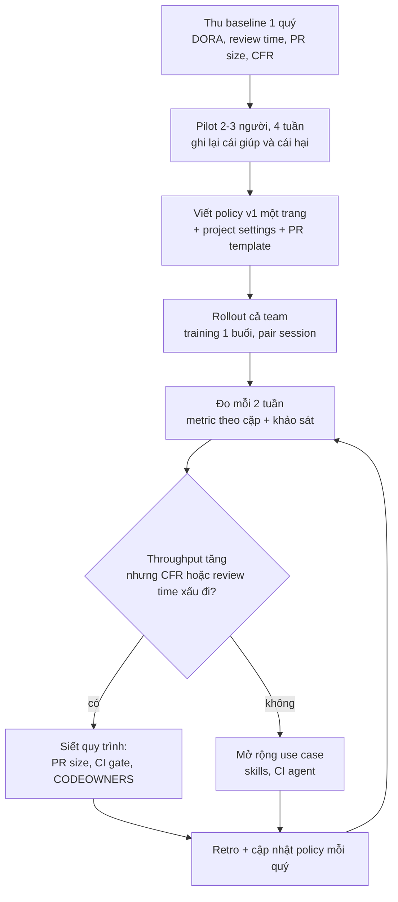
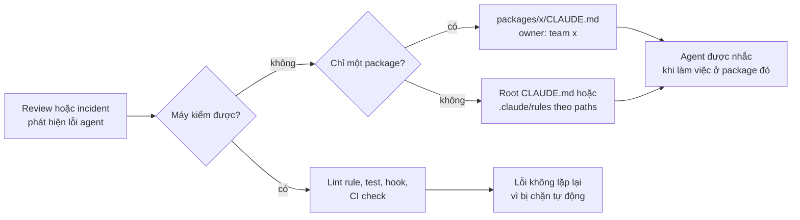

## Bối cảnh & vấn đề

Một team 8 người được công ty mua license coding agent cho tất cả. Không có hướng dẫn gì ngoài email "hãy dùng để tăng năng suất". Ba tháng sau, bức tranh như sau:

- Số PR merge mỗi quý tăng gấp đôi. Manager rất vui và muốn báo cáo lên trên KPI "**% code do AI viết**" (hiện là 70%).
- Change failure rate (tỉ lệ deploy gây sự cố) tăng từ 5% lên 13%. On-call bắt đầu than phiền.
- Một PR 1.800 dòng "chủ yếu do agent sinh" được mở chiều thứ Sáu kèm lời nhắn "approve nhanh giúp mình để kịp sprint".
- Một bạn junior ship feature rất nhanh nhưng khi được hỏi "vì sao dùng `Promise.allSettled` ở đây?" thì trả lời bằng cách... hỏi lại agent. Lần on-call đầu tiên bạn ấy không debug được module của chính mình.
- Hai team trong monorepo có hai CLAUDE.md dạy agent hai cách xử lý lỗi khác nhau, và agent dùng lẫn lộn khi sửa code chung.
- Một khách hàng outsource gửi email hỏi: "Xác nhận bằng văn bản rằng deliverable không chứa code do AI sinh".

Không có vấn đề nào ở trên là vấn đề của **model**. Chúng là vấn đề **quy trình và con người**: throughput sinh code tăng nhưng năng lực **verify** (review, test, hiểu) không tăng theo; đo sai thứ nên tối ưu sai thứ; không ai chịu trách nhiệm rõ; kiến thức nằm trong đầu từng người thay vì trong repo. Bài học [mental model](/tracks/ai-assisted-engineering/learn/mental-model) nói "bạn là owner của từng dòng merge"; bài này chuyển câu đó từ nguyên tắc cá nhân thành **cơ chế của team**.

Bài này đi qua: một policy ngắn nhưng thực thi được, disclosure và ownership, cách đo hiệu quả bằng outcome, vấn đề license/IP, phát triển junior khi AI viết bản nháp đầu, và cách tổ chức shared context (CLAUDE.md, rules, skills) cho monorepo nhiều team. Mỗi phần có script chạy được: CI gate cho PR template, script so sánh metrics trước/sau, và script kiểm tra ownership của các file context.

## Khái niệm

### Policy AI-assisted development: ngắn, cụ thể, thực thi được

**Policy** ở đây là văn bản 1–2 trang trả lời "trong team này, dùng AI thế nào là đúng". Nó tồn tại vì không có nó, mỗi người tự đặt luật: người paste cả dump DB prod vào chat, người bật bypass mọi permission, người không review code agent sinh. Policy cũng là thứ bảo vệ **cá nhân**: khi có sự cố, "tôi làm đúng policy" là câu trả lời rõ ràng.

Nội dung tối thiểu, mỗi mục một vài dòng: (1) **tool được duyệt** và loại tài khoản (plan doanh nghiệp có data retention rõ), tool bị cấm; (2) **phân loại dữ liệu**: được phép (code nội bộ), hạn chế (code client, theo hợp đồng từng dự án), cấm (secrets, PII, dữ liệu prod); (3) **accountability**: tác giả PR chịu trách nhiệm hoàn toàn, review như mọi PR, vùng nhạy cảm (auth, tiền, dữ liệu) cần reviewer thứ hai; (4) **disclosure** trong PR; (5) **cấu hình agent tối thiểu**: project settings chung, cấm bypass trên máy có credential thật (xem [bảo mật & permissions](/tracks/ai-assisted-engineering/learn/security-permissions)); (6) **dependency**: không cài package AI gợi ý khi chưa kiểm; (7) **shared context**: CLAUDE.md/rules trong repo có owner; (8) **đo lường** và lịch review lại policy mỗi quý.

Vì sao phải ngắn? Policy 20 trang không ai đọc, và policy quá chặt thì người ta lách (dùng tài khoản cá nhân, tool không duyệt), tệ hơn là không có policy. Nguyên tắc: mỗi dòng policy phải **kiểm được** bằng tooling (CI check, managed settings, secret scan) hoặc bằng một nghi thức rõ ràng (checkbox trong PR, câu hỏi trong review). Dòng nào không kiểm được thì hoặc bỏ, hoặc biến thành training.

**Interview angle:** interviewer không chấm độ dài danh sách mà chấm câu follow-up "enforce phần không kiểm bằng tool được thế nào?": trả lời bằng nghi thức review, ví dụ lãnh đạo làm mẫu, và postmortem blameless, không phải "phạt".

### Accountability và ownership

**Ownership** nghĩa là người merge hiểu code đủ để debug nó lúc 2 giờ sáng mà không có agent bên cạnh. Quy tắc cá nhân gọn nhất: **không merge dòng nào mình không giải thích được trong code review**. "AI viết" không bao giờ là lý do cho bug hay lỗ hổng, cũng như "Stack Overflow viết" chưa bao giờ là lý do.

Thực hành để giữ ownership: bắt agent giải thích lựa chọn, rồi **tự kiểm chứng** lời giải thích bằng docs hoặc chạy thử (lời giải thích của model cũng có thể sai); viết lại bằng tay phần cốt lõi nếu không hiểu; viết PR description và ADR bằng lời của mình; dùng agent để hỏi "tại sao" và "phản biện thiết kế này" chứ không chỉ "làm đi". Với team, ownership được thể hiện qua **CODEOWNERS** cho module nhạy cảm và qua câu hỏi review hướng vào hiểu biết ("nếu request này timeout ở bước 3 thì chuyện gì xảy ra?").

Ví dụ: PR thêm retry cho payment call. Reviewer hỏi "retry có idempotent không?". Tác giả có ownership trả lời "có, vì idempotency key sinh ở client và server dedupe theo key trong 24h, test ở `payments.retry.test.ts`". Tác giả không có ownership trả lời "agent bảo là có".

**Interview angle:** câu "làm sao giữ ownership với code AI viết" cần một quy tắc cá nhân rõ ràng cộng một cơ chế team; chỉ nói "tôi review kỹ" là trả lời yếu.

### Disclosure: vì sao ghi rõ AI đã tham gia

**Disclosure** là việc tác giả ghi trong PR mức độ AI tham gia (không, nhẹ, đáng kể) và đã verify thế nào. Mục đích **không phải** để đánh giá thấp PR hay đổ lỗi, mà để **reviewer điều chỉnh cách review**. Code do agent sinh có kiểu lỗi đặc thù: API bịa, xử lý edge case "trông đúng", test khẳng định hành vi hiện tại kể cả bug, code thừa. Biết trước giúp reviewer tập trung đúng chỗ (xem [review code AI viết](/tracks/ai-assisted-engineering/learn/reviewing-ai-code)).

Disclosure nên nhẹ: một section trong PR template với ba checkbox và một dòng "Verified by:". Claude Code mặc định thêm trailer `Co-Authored-By` vào commit nó tạo (có setting để đổi hoặc tắt, verify tên key), là một dạng disclosure tự động ở mức commit. Đừng biến disclosure thành báo cáo phần trăm: không ai đo chính xác được "bao nhiêu % dòng này do AI", và con số đó cũng không giúp reviewer.

**Interview angle:** trả lời tốt nói rõ disclosure phục vụ reviewer, không phục vụ KPI, và nó phải đủ nhẹ để người ta không bỏ qua.

### PR size và năng lực verify

**Năng lực verify** của team là số dòng code mà reviewer có thể đọc thật sự trong một tuần. Nó gần như không đổi khi team dùng agent, trong khi năng lực **sinh** code tăng vọt. Khi throughput sinh vượt năng lực verify, review trở nên hời hợt (LGTM không đọc), và lỗi lọt ra production. Nghiên cứu và kinh nghiệm review đều cho thấy chất lượng review giảm mạnh khi PR vượt vài trăm dòng; guideline "small CLs" của Google là một ví dụ nổi tiếng.

Hệ quả thực hành: team cần **PR size guideline** (ví dụ ≤ 400 dòng thay đổi, không tính file generated), PR lớn phải tách theo đơn vị logic (migration, domain logic, API, UI, test) hoặc ít nhất có commit theo bước và **review guide** trong description. Với PR 1.800 dòng cần "approve nhanh": không approve thứ mình không đọc nổi; đề nghị tách, đề nghị walk-through 15 phút, review phần rủi ro trước; nếu deadline thật sự ép thì ship phần nhỏ đã review, phần còn lại sau feature flag.

**Interview angle:** câu hỏi PR 1.800 dòng đo cả kỹ thuật lẫn kỹ năng giao tiếp: phải từ chối approve nhưng đưa ra con đường cụ thể để đồng đội vẫn kịp sprint, và đẩy vấn đề lên thành guideline team thay vì tranh luận cá nhân.

### Đo lường: outcome, không phải output

**Output** là thứ đếm được dễ: số dòng, số PR, % code AI. **Outcome** là thứ tổ chức thực sự cần: thay đổi tới tay người dùng nhanh hơn và ít hỏng hơn. Bộ metric chuẩn là **DORA four keys**: lead time for changes (từ commit tới production), deployment frequency, change failure rate (tỉ lệ deploy gây sự cố/rollback), và time to restore service. DORA gần đây có bổ sung thêm metric về rework/reliability (verify định nghĩa hiện hành trên dora.dev). Bổ sung cho team dùng AI: **review time** và số vòng review, **PR size**, **defect escape rate** (bug lọt qua review/test tới production), **revert rate**, và khảo sát dev theo **SPACE** (Satisfaction, Performance, Activity, Communication, Efficiency) vì cognitive load và satisfaction không hiện trong log.

**Goodhart's law**: khi một thước đo trở thành mục tiêu, nó không còn là thước đo tốt. "% code do AI viết" là ví dụ hoàn hảo: muốn tăng nó thì cứ để agent sinh nhiều hơn, review ít hơn, không refactor bằng tay. Nó cũng không liên quan tới giá trị (code nhiều hơn không phải tốt hơn), và đo chính xác gần như không thể. Khi manager muốn KPI này, nhu cầu thật thường là "chứng minh license đáng tiền"; phục vụ nhu cầu đó bằng DORA trước/sau, cycle time theo loại task, khảo sát, và vài case study định tính.

Cách đo đúng: có **baseline** trước khi rollout (ít nhất 1 quý dữ liệu), so sánh **task cùng loại**, đọc các metric **theo cặp** (lead time cùng với change failure rate; PR count cùng với review time/100 dòng), và cẩn thận với nhiễu (team đổi người, mùa release, dự án khác nhau).

**Interview angle:** câu follow-up kinh điển "lead time giảm 20% nhưng change failure rate tăng" chờ bạn nói "đó không phải thắng lợi, đó là chuyển chi phí từ dev sang on-call và user", rồi đưa ra cách tìm nguyên nhân.

### License và IP

Có ba lớp rủi ro. **Tái tạo code có license**: model đôi khi sinh gần nguyên văn một đoạn code từ dữ liệu huấn luyện, có thể mang license copyleft (GPL); rủi ro thấp với code chung chung, cao hơn với đoạn dài và đặc thù. **Hợp đồng**: hợp đồng outsource thường có điều khoản chuyển giao IP, bảo mật, và đôi khi cấm dùng tool bên thứ ba với code của client. **Quyền tác giả của output**: ở một số jurisdiction, cơ quan bản quyền cho rằng nội dung thuần do AI sinh không đủ điều kiện bảo hộ nếu thiếu đóng góp sáng tạo của con người (quan điểm của U.S. Copyright Office; các nước khác khác nhau, verify), điều này ảnh hưởng tới lời cam kết "chúng tôi chuyển giao toàn bộ IP".

Thực hành: dùng tool và plan được công ty **và client** duyệt; bật tính năng lọc/đối chiếu code công khai nếu tool có (tên và mức độ khác nhau giữa các tool, verify); nghi ngờ đoạn dài, đặc thù thì tìm nguồn; ưu tiên dependency có license rõ thay vì copy; và **escalate tới legal** khi hợp đồng không rõ, vì engineer không phải luật sư. Khi client yêu cầu xác nhận "không có code AI": không ký ngay, cũng không nói dối. Trả lời trung thực về quy trình hiện tại, chuyển yêu cầu cho legal/account manager, và nếu yêu cầu được chấp nhận thì dự án đó phải có cấu hình thực thi được (không dùng tool trên repo đó), không chỉ lời hứa.

**Interview angle:** interviewer tìm sự trưởng thành: biết rủi ro, biết giới hạn hiểu biết của mình ("tôi không phải luật sư"), và biết escalate đúng người.

### Phát triển junior khi AI viết bản nháp đầu

**Skill formation** của lập trình viên phần lớn đến từ giai đoạn "vật lộn": tự đọc lỗi, tự đặt giả thuyết, tự sai và tự sửa. Agent cho phép bỏ qua giai đoạn đó, nên junior có thể ship nhanh nhưng không xây được **mental model** của hệ thống. Hệ quả chỉ lộ ra khi agent không giúp được: on-call, bug concurrency, hệ thống phân tán.

Hướng tiếp cận hiệu quả: đặt **kỳ vọng rõ** (giải thích được mọi dòng trong PR, PR description tự viết, trả lời câu hỏi review không copy từ AI); dùng AI như **gia sư** (hỏi khái niệm, xin phản biện, "đừng viết code, hãy hỏi tôi câu hỏi gợi ý") thay vì máy làm bài; có **vùng không AI** có thời hạn cho kiến thức nền (ví dụ bug đầu tiên trong module mới tự debug 45 phút trước khi hỏi agent); pair debugging với senior; giao **ownership trọn vẹn** một phần nhỏ (bug → fix → deploy → monitor). Senior review **quá trình tư duy**, không chỉ diff: "bạn đã loại bỏ giả thuyết nào?".

Khi một junior cụ thể đã rơi vào tình trạng phụ thuộc: đây là vấn đề phát triển kỹ năng, không phải kỷ luật. Nói chuyện 1:1, riêng tư, bằng ví dụ PR cụ thể và tác động cụ thể (review lâu hơn, rủi ro on-call), đặt kỳ vọng và cách học, rồi theo dõi vài tuần bằng tín hiệu nhẹ: chất lượng câu trả lời trong review, số lần tự debug được, PR description.

**Interview angle:** câu hỏi mở về junior growth không có đáp án duy nhất; điểm cộng là bạn có quan điểm, đã thử cách cụ thể, và biết đo tiến bộ mà không micromanage.

### Shared context cho monorepo nhiều team

**Shared context** là các file mà agent tự nạp để hiểu quy ước của repo: CLAUDE.md, rules, skills (xem [context engineering](/tracks/ai-assisted-engineering/learn/context-engineering)). Trong monorepo nhiều team, nó cần được tổ chức như code: phân tầng, có owner, được review.

Cách phân tầng với Claude Code: **root `CLAUDE.md`** chứa những gì đúng cho toàn repo (package manager, cách chạy test một package, conventions chung) và dùng `@path` import để trỏ sang doc chi tiết thay vì nhét hết; **`CLAUDE.md` trong thư mục con** (`packages/billing/CLAUDE.md`) được nạp khi agent đọc file trong thư mục đó, nên chứa domain rule riêng của team; **`.claude/rules/*.md` với frontmatter `paths:`** chỉ nạp khi file khớp glob được đọc, hợp với rule theo loại file (migration, test); **skills** (`.claude/skills/<name>/SKILL.md`) đóng gói workflow lặp lại (thêm endpoint, tạo migration) và chỉ nạp phần thân khi dùng. Cursor có cơ chế tương tự với `.cursor/rules/*.mdc`; nhiều tool đọc `AGENTS.md` (Claude Code đọc khi không có CLAUDE.md ở một số version, verify).

Quy tắc vận hành: mỗi file context có **owner trong CODEOWNERS**, thay đổi được review như code; giữ file ngắn (CLAUDE.md dài làm loãng context và agent bỏ sót); rule **kiểm được bằng máy** thì biến thành lint rule/hook/test, không để trong CLAUDE.md; và thu thập "lỗi agent hay lặp lại" từ review để cập nhật. Khi hai team có rule mâu thuẫn (ví dụ error handling): nếu phạm vi tách biệt thì để ở CLAUDE.md từng package; nếu code chung thì phải chốt một convention qua ADR ở cấp repo, và platform team làm owner.

**Interview angle:** câu trả lời mạnh nêu cơ chế nạp theo thư mục, owner qua CODEOWNERS, và nguyên tắc "cái gì máy kiểm được thì không để trong rules file".

## Cơ chế hoạt động

### Vòng đời rollout: pilot → baseline → policy → đo → điều chỉnh



Điểm mấu chốt là bước đầu tiên: **không có baseline thì không có câu chuyện**. Nếu team bật tool rồi mới nghĩ tới đo, ba tháng sau mọi cuộc tranh luận "AI có giúp không" chỉ còn là cảm giác. Pilot nhỏ trước khi rollout giúp policy v1 dựa trên sự cố thật của team mình, không phải bản copy từ internet. Vòng lặp từ E quay về E là trạng thái bình thường: policy không bao giờ "xong", nó được chỉnh theo dữ liệu.

Nhánh F là nơi hầu hết team đi sai: thấy PR tăng thì mừng và đi tiếp sang H. Câu hỏi đúng luôn đọc metric theo cặp: throughput **và** chất lượng.

### Kế hoạch 30 ngày cụ thể

| Tuần | Việc | Output kiểm được |
|---|---|---|
| 0 (trước) | Export dữ liệu PR/deploy/incident 1 quý gần nhất | Bảng baseline như ví dụ 2 |
| 1 | Pilot 2–3 người (1 senior, 1 mid, 1 junior); mỗi ngày ghi 3 dòng: task, AI giúp gì, AI sai gì | Log pilot |
| 2 | Viết policy v1, `.claude/settings.json` chung, PR template có section AI, CI check PR template | PR merge policy + settings + check |
| 3 | Training 1 buổi 90 phút (demo workflow, security, review checklist); mỗi người pair 1 session với người pilot | Checklist training, danh sách "lỗi hay gặp" |
| 4 | Rollout; đo lần đầu; retro 30 phút | Bảng metric tuần 4 vs baseline, action items |
| Mỗi quý | Review policy, cập nhật CLAUDE.md từ "lỗi agent hay lặp" | Diff policy + context files |

### Vòng phản hồi: biến mỗi lỗi thành cơ chế



Sơ đồ trả lời câu "team học từ lỗi của agent thế nào". Ưu tiên nhánh trên cùng: một lint rule chặn `parseFloat` trên field tiền mạnh hơn mọi dòng "không dùng float cho tiền" trong CLAUDE.md, vì lint chạy cho cả người lẫn agent, không phụ thuộc agent có đọc/nhớ rule hay không. Chỉ những gì là **phán đoán** (kiến trúc, trade-off, bối cảnh nghiệp vụ) mới nên nằm trong CLAUDE.md, và đặt ở tầng hẹp nhất có thể.

### Chẩn đoán "PR gấp đôi, incident cũng tăng"

Khi chất lượng giảm sau rollout, đừng bắt đầu bằng giả thuyết "AI viết code tệ". Bắt đầu bằng dữ liệu: incident gắn với PR nào, PR đó có đặc điểm gì (size, module, review time, reviewer, có dùng agent không), loại lỗi gì (authz, concurrency, config, migration). Giả thuyết hay gặp nhất theo thứ tự: review thành bottleneck nên review hời hợt; PR to hơn; test yếu (test khẳng định hành vi hiện tại); dev merge code mình không hiểu; và cuối cùng mới là "vùng nào đó agent làm kém". Ví dụ 2 dưới đây minh hoạ vì sao thứ tự này quan trọng.

## Ví dụ thực tế

Các script dưới đây chạy trong thư mục scratch bằng Node 24 (chạy thẳng file `.ts` nhờ type stripping), output dán nguyên văn.

### 1. Policy một trang (mẫu)

```markdown
# AI-assisted development policy (v1, review mỗi quý)

## Tool
- Được duyệt: Claude Code (tài khoản công ty), <IDE assistant đã duyệt>. Không dùng tài khoản cá nhân cho code công ty.

## Dữ liệu
- OK: code nội bộ, log đã ẩn danh, dữ liệu seed.
- Theo hợp đồng từng dự án: code/tài liệu client (xem bảng dự án; mặc định: KHÔNG).
- Cấm: secrets, PII, dump DB prod, dữ liệu khách hàng.

## Trách nhiệm
- Tác giả PR chịu trách nhiệm cho mọi dòng. Không merge thứ mình không giải thích được.
- auth, payments, migrations: 2 reviewer, 1 người trong CODEOWNERS.
- PR <= 400 dòng thay đổi (trừ generated). Lớn hơn: tách, hoặc review guide + walk-through.

## Disclosure
- Điền section "AI assistance" trong PR template (CI kiểm).

## Cấu hình agent
- Dùng .claude/settings.json của repo; không bypass permissions trên máy có credential thật.
- Package mới do agent đề xuất: chạy checklist dependency trước khi cài.

## Shared context
- CLAUDE.md, .claude/rules, .claude/skills có owner trong CODEOWNERS; lỗi agent lặp lại -> lint/test trước, rules sau.

## Đo lường
- Theo dõi: lead time, deploy frequency, change failure rate, time to restore, review time/100 LOC, PR size. Không dùng "% code AI" làm KPI.
```

Đếm lại: mỗi dòng có cách kiểm. "Dùng settings của repo" kiểm bằng managed settings; "disclosure" kiểm bằng CI (ví dụ 3); "owner cho context files" kiểm bằng script (ví dụ 4); "2 reviewer cho auth" kiểm bằng branch protection + CODEOWNERS. Những dòng không kiểm tự động được ("giải thích được mọi dòng", "không paste PII") được enforce bằng **nghi thức**: câu hỏi review, training, và lãnh đạo làm mẫu.

### 2. Đọc metric theo cặp: PR gấp đôi, incident tăng

Script mô phỏng một team trước/sau rollout (dữ liệu sinh bằng PRNG có seed để lặp lại được; giả định: sau rollout PR to hơn, review mỏng hơn trên mỗi dòng, và xác suất lỗi tăng theo size và độ mỏng của review). Mục đích là minh hoạ **cách đọc**, không phải số liệu ngành.

```ts
// metrics.ts — so sánh delivery metrics trước/sau khi team dùng agent (dữ liệu mô phỏng, seed cố định)
type PR = { period: "before" | "after"; lines: number; leadTimeH: number; reviewMin: number; failed: boolean; ai: boolean };

let seed = 42; // mulberry32: PRNG có seed để output lặp lại được
const rand = () => { seed = (seed + 0x6d2b79f5) | 0; let t = Math.imul(seed ^ (seed >>> 15), 1 | seed); t ^= t + Math.imul(t ^ (t >>> 7), 61 | t); return ((t ^ (t >>> 14)) >>> 0) / 2 ** 32; };

function makePRs(period: PR["period"], count: number, avgLines: number, aiShare: number): PR[] {
  return Array.from({ length: count }, () => {
    const lines = Math.round(avgLines * (0.2 + rand() * 1.6));
    const ai = rand() < aiShare;
    const reviewMin = Math.round((period === "before" ? 0.25 : 0.08) * lines + 5 + rand() * 10); // review/dòng giảm khi PR dồn
    const leadTimeH = Math.round((period === "before" ? 40 : 26) + lines / 40 + rand() * 20);
    const pFail = Math.min(0.6, 0.03 + (lines / 1000) ** 2 * 0.5 + (reviewMin / lines < 0.1 ? 0.06 : 0));
    return { period, lines, leadTimeH, reviewMin, failed: rand() < pFail, ai };
  });
}

const prs = [...makePRs("before", 120, 180, 0.1), ...makePRs("after", 240, 420, 0.7)];
const median = (xs: number[]) => { const s = [...xs].sort((a, b) => a - b); return s[Math.floor(s.length / 2)]; };
const pct = (n: number, d: number) => `${((100 * n) / d).toFixed(1)}%`;

console.log("metric                     before   after");
for (const [name, f] of [
  ["PRs merged / quarter",        (x: PR[]) => String(x.length)],
  ["median lead time (h)",        (x: PR[]) => String(median(x.map((p) => p.leadTimeH)))],
  ["median PR size (lines)",      (x: PR[]) => String(median(x.map((p) => p.lines)))],
  ["median review min / 100 LOC", (x: PR[]) => (median(x.map((p) => (100 * p.reviewMin) / p.lines))).toFixed(1)],
  ["change failure rate",         (x: PR[]) => pct(x.filter((p) => p.failed).length, x.length)],
  ["% PRs AI-assisted",           (x: PR[]) => pct(x.filter((p) => p.ai).length, x.length)],
] as const) {
  const b = f(prs.filter((p) => p.period === "before")), a = f(prs.filter((p) => p.period === "after"));
  console.log(`${name.padEnd(27)}${b.padStart(6)}${a.padStart(8)}`);
}

console.log("\nchange failure rate by PR size (after):");
const after = prs.filter((p) => p.period === "after");
for (const [lo, hi] of [[0, 200], [200, 400], [400, 600], [600, Infinity]]) {
  const g = after.filter((p) => p.lines >= lo && p.lines < hi);
  const label = hi === Infinity ? `${lo}+` : `${lo}-${hi - 1}`;
  console.log(`  ${label.padEnd(9)} n=${String(g.length).padStart(3)}  CFR=${pct(g.filter((p) => p.failed).length, g.length || 1).padStart(6)}`);
}
const [aiG, humanG] = [after.filter((p) => p.ai), after.filter((p) => !p.ai)];
console.log(`\nCFR AI-assisted=${pct(aiG.filter((p) => p.failed).length, aiG.length)}  not=${pct(humanG.filter((p) => p.failed).length, humanG.length)}`);
```

```text
$ node metrics.ts
metric                     before   after
PRs merged / quarter          120     240
median lead time (h)           55      47
median PR size (lines)        194     393
median review min / 100 LOC  30.4    10.4
change failure rate          5.0%   13.3%
% PRs AI-assisted            9.2%   70.4%

change failure rate by PR size (after):
  0-199     n= 34  CFR=  5.9%
  200-399   n= 87  CFR=  8.0%
  400-599   n= 66  CFR= 16.7%
  600+      n= 53  CFR= 22.6%

CFR AI-assisted=13.0%  not=14.1%
```

Cách đọc như một senior:

- Hai dòng đầu là thứ manager sẽ chụp màn hình: PR gấp đôi, lead time giảm ~15%. Nhưng **change failure rate tăng từ 5% lên 13.3%**, tức là số deploy gây sự cố tăng gần 5 lần về tuyệt đối (6 → 32). Chi phí đã chuyển từ dev sang on-call và người dùng.
- **Review min/100 LOC giảm từ 30 xuống 10**: cùng số reviewer phải đọc gấp 4 lần số dòng, nên họ đọc lướt. Đây là tín hiệu "throughput vượt năng lực verify".
- CFR theo size tăng đều từ 5.9% lên 22.6%: nguyên nhân nằm ở **PR to**, không phải ở "có dùng AI". Dòng cuối xác nhận: PR có AI và không có AI hỏng với tỉ lệ gần như nhau (13.0% vs 14.1%). Nếu chỉ nhìn "% PRs AI-assisted = 70%" rồi cấm AI, team sẽ mất lợi ích mà không sửa được nguyên nhân.
- Hành động: guideline PR ≤ 400 dòng, CI gate, CODEOWNERS cho module rủi ro, checklist review; metric đặt lên dashboard là **change failure rate đặt cạnh review time/100 LOC**, vì cặp này lộ ra ngay khi throughput vượt verify.

### 3. CI gate cho PR template: disclosure + ownership + size

PR template (`.github/pull_request_template.md`) có section:

```markdown
## AI assistance
- [ ] none
- [ ] light
- [ ] substantial
- [ ] I can explain every line
Verified by:
```

Script kiểm (chạy trong CI với body PR và số dòng thay đổi lấy từ API của GitHub):

```ts
// check-pr.ts — CI gate nhẹ cho policy: disclosure + ownership + PR size. Usage: node check-pr.ts <body.md> <changedLines>
import { readFileSync } from "node:fs";

const [bodyPath, changed = "0"] = process.argv.slice(2);
const body = readFileSync(bodyPath, "utf8");
const lines = Number(changed);
const errors: string[] = [];
const warnings: string[] = [];

const section = body.split(/^## /m).find((s) => s.startsWith("AI assistance"));
if (!section) errors.push('missing "## AI assistance" section');
else {
  const level = section.match(/- \[x\] (none|light|substantial)/i)?.[1];
  if (!level) errors.push("tick exactly one of: none / light / substantial");
  if (!/- \[x\] I can explain every line/i.test(section)) errors.push('ownership box "I can explain every line" is not ticked');
  if (level?.toLowerCase() === "substantial" && !/Verified by:\s*\S+/.test(section))
    errors.push('substantial AI use needs a "Verified by:" line (tests, manual steps)');
}
if (lines > 400) warnings.push(`${lines} changed lines > 400: split the PR or add a review guide`);

for (const w of warnings) console.log(`warn  ${w}`);
for (const e of errors) console.log(`error ${e}`);
console.log(errors.length ? "FAIL" : "PASS");
process.exit(errors.length ? 1 : 0);
```

```text
$ cat good.md
## What
Add idempotency key to POST /payments.

## AI assistance
- [ ] none
- [ ] light
- [x] substantial
- [x] I can explain every line
Verified by: unit tests for duplicate key + manual replay against local stack
$ node check-pr.ts good.md 180; echo "exit=$?"
PASS
exit=0

$ cat bad.md
## What
Refactor order service (generated with agent).
$ node check-pr.ts bad.md 1800; echo "exit=$?"
warn  1800 changed lines > 400: split the PR or add a review guide
error missing "## AI assistance" section
FAIL
exit=1
```

Checkbox "I can explain every line" không chứng minh được gì về mặt kỹ thuật, và đó không phải mục đích. Nó là **cam kết công khai** có tên người tick, biến nguyên tắc ownership thành thứ reviewer có thể viện dẫn ("bạn đã tick ô này, giải thích giúp mình đoạn retry"). Size chỉ là warning, không phải error: đôi khi PR lớn là hợp lý (rename cơ học), và gate quá cứng dạy người ta lách.

### 4. Shared context trong monorepo có owner

Cấu trúc (minh hoạ, tạo trong scratch):

```text
.
├── CLAUDE.md                          # toàn repo: pnpm, cách chạy test, @docs/errors.md
├── .claude/
│   ├── rules/migrations.md            # paths: **/*.sql, **/migrations/**
│   └── skills/add-endpoint/SKILL.md   # workflow thêm endpoint
├── packages/billing/CLAUDE.md         # tiền là integer minor units, idempotency key
├── packages/web/CLAUDE.md             # React Server Components mặc định
├── apps/admin/CLAUDE.md
└── .github/CODEOWNERS
```

Rule theo loại file dùng frontmatter `paths:`:

```markdown
---
paths:
  - "**/*.sql"
  - "**/migrations/**"
---
# Migrations
- expand -> migrate -> contract; no DROP in the same release
```

CODEOWNERS và script kiểm mỗi file context có owner và không quá dài:

```text
/CLAUDE.md                 @org/platform
/.claude/                  @org/platform
/packages/billing/         @org/payments
/packages/web/             @org/frontend
```

```bash
#!/usr/bin/env bash
# check-context.sh — mỗi file context (CLAUDE.md, rules, skills) phải có owner trong CODEOWNERS và không quá dài.
set -uo pipefail
max=200; fail=0
owner_of() { # owner của rule cuối cùng khớp prefix (CODEOWNERS: rule sau thắng)
  local f="/$1" o=""
  while read -r pat who; do
    [[ -z "$pat" || "$pat" == \#* ]] && continue
    [[ "$f" == "$pat"* ]] && o="$who"
  done < .github/CODEOWNERS
  echo "$o"
}
while IFS= read -r f; do
  f="${f#./}"; n=$(wc -l < "$f" | tr -d ' '); o=$(owner_of "$f")
  status="ok"
  [[ -z "$o" ]] && status="NO OWNER" && fail=1
  (( n > max )) && status="TOO LONG" && fail=1
  printf '%-36s %4s lines  %-15s %s\n' "$f" "$n" "${o:--}" "$status"
done < <(find . \( -name CLAUDE.md -o -path './.claude/*' -name '*.md' \) -not -path './node_modules/*' | sort)
exit $fail
```

```text
$ ./check-context.sh; echo "exit=$?"
.claude/rules/migrations.md             7 lines  @org/platform   ok
.claude/skills/add-endpoint/SKILL.md    6 lines  @org/platform   ok
CLAUDE.md                               3 lines  @org/platform   ok
apps/admin/CLAUDE.md                    2 lines  -               NO OWNER
packages/billing/CLAUDE.md              3 lines  @org/payments   ok
packages/web/CLAUDE.md                  2 lines  @org/frontend   ok
exit=1
```

`apps/admin/CLAUDE.md` được ai đó thêm vào mà không có owner: không ai review thay đổi của nó, nên nó sẽ trôi dạt và có thể mâu thuẫn với root. Script chỉ khớp prefix đơn giản (CODEOWNERS thật hỗ trợ glob đầy đủ), đủ để minh hoạ cơ chế "context files là code, cần owner".

### 5. Kịch bản 1:1 với junior phụ thuộc AI (minh hoạ)

```text
Senior: Mình muốn nói về hai PR gần đây, không phải về tốc độ — tốc độ của bạn tốt.
        Ở PR orders-retry, khi mình hỏi vì sao retry 3 lần, câu trả lời là copy từ agent
        và nó sai với config timeout của mình. Nếu đêm đó service này lỗi, người on-call
        sẽ không có ai giải thích được logic đó.
Junior: Em hiểu. Em dùng agent vì sợ chậm sprint.
Senior: Hợp lý. Mình đề xuất 4 tuần thử thế này:
        1. PR description bạn tự viết, 5 dòng: mục tiêu, cách làm, rủi ro, cách test.
        2. Bug đầu tiên mỗi tuần: tự debug 45 phút trước khi hỏi agent; ghi giả thuyết.
        3. Dùng agent kiểu "đừng viết code, hỏi mình câu gợi ý" khi học phần mới.
        4. Thứ Năm pair debug 30 phút với mình.
        Cuối tháng mình xem lại: câu trả lời review, số bug tự xử lý, PR description.
```

Kịch bản có cấu trúc: tách con người khỏi hành vi, ví dụ cụ thể, tác động cụ thể, thừa nhận động cơ hợp lý (áp lực sprint), đề xuất có thời hạn, và tiêu chí tiến bộ quan sát được mà không cần theo dõi từng commit.

### 6. Trả lời manager về KPI "% code AI" (mẫu)

```text
Mình hiểu cần chứng minh license đáng tiền. "% code AI" khó đo chính xác và dễ bị đẩy lên
bằng cách review ít hơn, nên nó có thể tăng đúng lúc chất lượng giảm. Mình đề xuất báo cáo:
(1) lead time và change failure rate so với baseline quý trước, (2) cycle time của 3 loại
task hay làm (CRUD endpoint, bugfix, migration), (3) khảo sát dev 5 câu, (4) 2 case study
cụ thể. Nếu vẫn cần con số AI, mình ghi "tỉ lệ PR có dùng AI" kèm chú thích, không đặt target.
```

Nếu leadership vẫn khăng khăng, báo cáo con số đó **cạnh** metric chất lượng, không đặt target, và không gắn với đánh giá cá nhân; đó là cách giảm tác hại của Goodhart khi không tránh được.

## Trade-offs & lựa chọn thay thế

| Lựa chọn | Ưu | Nhược | Hợp khi |
|---|---|---|---|
| Không có policy, "tự do dùng" | Không ma sát, thử nghiệm nhanh | Rò rỉ dữ liệu, chất lượng trôi, không ai chịu trách nhiệm | Không bao giờ với code công ty/client |
| Cấm hoàn toàn | Rủi ro thấp nhất trên giấy | Người ta dùng lén bằng tài khoản cá nhân (shadow AI), mất lợi ích | Hợp đồng client cấm rõ; khi đó cấm **theo dự án**, có cơ chế thực thi |
| Policy ngắn + tooling (khuyến nghị) | Thực thi được, dễ tuân thủ, đo được | Cần owner, cần review hằng quý | Hầu hết team |
| Policy dài, phê duyệt từng use case | Kiểm soát chặt | Chậm, người ta lách, policy lỗi thời nhanh | Ngành bị quản lý chặt, kết hợp legal |

| Thước đo | Đo được gì | Gaming thế nào | Dùng |
|---|---|---|---|
| % code AI / số dòng AI | Mức sử dụng tool | Sinh nhiều hơn, review ít hơn | Không làm KPI; nhiều nhất là số liệu tham khảo |
| Số PR / số commit | Activity | Chia nhỏ vô nghĩa | Chỉ đọc cùng metric chất lượng |
| Lead time + deployment frequency | Tốc độ tới production | Deploy thay đổi rỗng | Cặp với CFR |
| Change failure rate + time to restore | Độ ổn định | Không khai báo incident | Cặp với lead time |
| Review time/100 LOC, PR size | Năng lực verify | Review "nhanh" giả tạo | Cảnh báo sớm throughput vượt verify |
| Khảo sát SPACE | Satisfaction, cognitive load | Trả lời cho đẹp | Mỗi quý, ẩn danh |

Chọn policy theo rủi ro dữ liệu và độ trưởng thành của team. Với team sản phẩm nội bộ, "policy ngắn + tooling" gần như luôn là đáp án. Với công ty outsource, thêm một lớp **theo dự án**: bảng liệt kê mỗi client cho phép gì, mặc định là không, và cấu hình thực thi tương ứng (không có project settings cho phép agent trên repo của client cấm). Với ngành bị quản lý chặt (tài chính, y tế), policy cần legal tham gia và có thể dựa trên khung như NIST AI RMF.

Về đo lường, không có metric đơn lẻ nào đủ. Quy tắc thực dụng: mỗi metric tốc độ luôn đi cùng một metric chất lượng, và mỗi con số định lượng đi cùng một câu chuyện định tính. Nếu chỉ được đặt **một** con số lên dashboard, change failure rate là lựa chọn an toàn nhất, vì nó bắt được đúng failure mode phổ biến nhất của rollout AI: throughput vượt năng lực verify.

## Edge cases & failure modes

- **Shadow AI**: policy quá chặt hoặc tool được duyệt quá kém → người ta dùng tài khoản cá nhân, dữ liệu rò rỉ mà không ai biết. Dấu hiệu: không ai than phiền về policy (vì không ai tuân theo). Chữa bằng tool được duyệt đủ tốt và policy hợp lý.
- **Review collapse**: PR tăng, reviewer không tăng; review time/100 LOC giảm mạnh, "LGTM" trong vài phút cho PR vài trăm dòng. Incident tăng sau 1–2 tháng, không phải ngay lập tức, nên dễ bị quy nhầm nguyên nhân.
- **Metric nhiễu**: team nhỏ, số incident ít → một incident thay đổi CFR vài điểm phần trăm. Đọc xu hướng nhiều quý, không phản ứng với một tuần.
- **Baseline không so sánh được**: quý trước làm maintenance, quý này làm feature mới; "lead time giảm" có thể chỉ do loại việc. So task cùng loại.
- **Context files trôi dạt**: CLAUDE.md ghi "dùng Jest" trong khi repo đã chuyển sang Vitest 6 tháng; agent cứ sinh test Jest. File không có owner là file sẽ sai.
- **Rule mâu thuẫn giữa các tầng**: root nói "throw domain error", package nói "return Result". Agent sửa code chung giữa hai package dùng lẫn lộn. Cần một quyết định (ADR) cho vùng giao nhau, không để agent "đoán".
- **Checkbox thành nghi lễ rỗng**: mọi người tick "I can explain every line" theo phản xạ. Checkbox chỉ có giá trị khi reviewer thỉnh thoảng thực sự hỏi, và khi câu trả lời "mình chưa hiểu phần này" được chấp nhận mà không bị phán xét.
- **Junior "an toàn giả"**: PR của junior pass review vì code agent sinh trông chuẩn, nên không ai phát hiện khoảng trống kiến thức cho tới incident đầu tiên. Review quá trình tư duy (câu hỏi "vì sao"), không chỉ diff.
- **Cam kết IP không thực thi được**: ký "không có code AI" cho một dự án nhưng dev vẫn dùng autocomplete trong IDE mặc định. Cam kết phải kèm cấu hình thực thi (tắt tool ở cấp org/project) và training cho người trong dự án.

## Pitfalls

- ❌ Mua license rồi gửi email "hãy dùng" → ✅ baseline, pilot nhỏ, policy v1, training, đo. Lý do: không có baseline thì không chứng minh được gì, và không có policy thì mỗi người tự đặt luật.
- ❌ KPI "% code do AI viết" → ✅ DORA + review time + CFR theo cặp, kèm khảo sát và case study. Lý do: Goodhart's law; metric này thưởng cho việc review ít đi.
- ❌ Approve PR 1.800 dòng "cho kịp sprint" → ✅ yêu cầu tách hoặc walk-through, review phần rủi ro trước, ship phần đã review sau feature flag. Lý do: approve thứ không đọc là chuyển rủi ro sang production.
- ❌ Trả lời "AI viết, test pass" khi bị hỏi về code → ✅ "mình chịu trách nhiệm; đây là lý do thiết kế và cách mình đã verify". Lý do: test pass chỉ chứng minh những gì test kiểm.
- ❌ Cấm junior dùng AI hoàn toàn → ✅ kỳ vọng rõ về giải thích, vùng không AI có thời hạn, AI như gia sư, pair debugging. Lý do: cấm thì họ tụt lại so với thị trường; thả thì họ không xây được mental model.
- ❌ Nhét mọi quy ước vào một CLAUDE.md 800 dòng ở root → ✅ root ngắn + CLAUDE.md theo package + rules theo `paths:` + skills; cái gì máy kiểm được thì thành lint/test. Lý do: context dài làm loãng sự chú ý của agent và không ai bảo trì nổi.
- ❌ Ký cam kết IP với client mà không hỏi legal → ✅ trả lời trung thực về quy trình, escalate, và nếu cam kết thì cấu hình thực thi được. Lý do: engineer không phải luật sư, và cam kết không thực thi được là rủi ro hợp đồng.
- ❌ Đổ lỗi cho AI khi incident tăng rồi cấm → ✅ phân tích incident theo PR size, review time, module; sửa quy trình. Lý do: như ví dụ 2, nguyên nhân thường là PR to và review mỏng, không phải bản thân tool.
- ❌ Policy viết một lần rồi để đó → ✅ review mỗi quý với dữ liệu và feedback. Lý do: tool thay đổi hằng tháng; policy lỗi thời bị bỏ qua.

## Tóm tắt

- Vấn đề khi đưa AI vào team là **quy trình và con người**: throughput sinh code tăng, năng lực verify thì không; phải thiết kế quy trình để hai thứ cân bằng.
- **Policy** 1–2 trang: tool duyệt, phân loại dữ liệu, accountability, disclosure, cấu hình agent, dependency, shared context, đo lường. Mỗi dòng phải kiểm được bằng tooling hoặc nghi thức rõ ràng.
- **Ownership**: không merge dòng mình không giải thích được; disclosure trong PR để reviewer điều chỉnh cách review; PR ≤ ~400 dòng hoặc có review guide.
- **Đo outcome**: DORA four keys + review time/100 LOC + PR size + defect escape + khảo sát SPACE, có baseline, đọc theo cặp. "% code AI" không phải KPI.
- **License/IP**: rủi ro tái tạo code có license, điều khoản hợp đồng, quyền tác giả của output; dùng tool được duyệt, escalate tới legal, cam kết phải thực thi được.
- **Junior growth**: kỳ vọng giải thích được code, AI như gia sư, vùng không AI có thời hạn, pair debugging, review quá trình tư duy; xử lý phụ thuộc AI bằng 1:1 cụ thể, không kỷ luật.
- **Monorepo context**: root CLAUDE.md ngắn, CLAUDE.md theo package, `.claude/rules` theo `paths:`, skills cho workflow lặp; owner trong CODEOWNERS; lỗi lặp lại → lint/test trước, rules sau.
