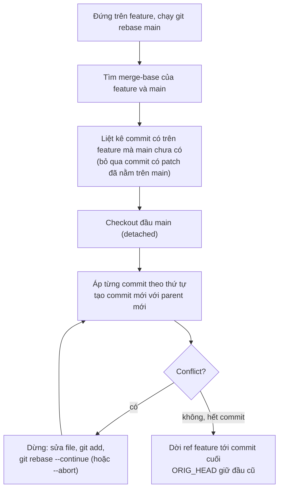
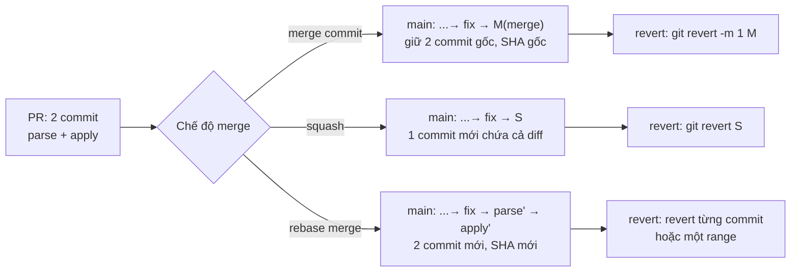

## Bối cảnh & vấn đề

Thứ Sáu, 17:30, một bug thanh toán lên production: tổng tiền đơn hàng bị trừ voucher hai lần. On-call mở `git log` của `main` để tìm thay đổi gần nhất liên quan tới voucher và thấy thứ này:

```text
*   a91f2c3 Merge branch 'main' into feature/checkout
|\
| * 77be0d1 fix
| * 4c1e9aa fix again
* | 2d0b8f1 Merge branch 'main' into feature/checkout
|\|
| * 9e3a712 wip
| * 18fd4c0 asdf
* | c0ffee1 Merge pull request #412 from feature/checkout-v2-final-FINAL
* | 5b6d2e9 revert "revert 'add voucher logic'"
```

Không commit nào nói nó thay đổi gì. Có hai lần "merge `main` vào feature" làm lịch sử rẽ nhánh chằng chịt, một tên branch "final-FINAL" (dấu hiệu branch sống rất lâu), và một "revert của revert" mà không ai biết trạng thái cuối là bật hay tắt voucher. Muốn dùng `git bisect` để tìm commit gây lỗi cũng khó, vì các commit `wip`/`asdf` có thể không build được. Lịch sử Git ở đây không còn là **tài liệu** mà là **tiếng ồn**.

Lịch sử Git là công cụ vận hành, không phải chuyện thẩm mỹ. Nó được dùng mỗi khi bạn cần trả lời: "thay đổi này vào lúc nào, vì sao, của PR nào?", "revert cái gì để tắt bug?", "commit nào làm hỏng test?". Ba quyết định của team quyết định lịch sử dễ đọc hay không: **cách tích hợp** nhánh (merge hay rebase), **cách merge PR** vào `main` (squash, rebase hay merge commit) và **quy ước commit message**. Bài này giải thích từng thứ từ mô hình dữ liệu của Git, chạy thử thật trên một repo nhỏ, rồi đưa ra một bộ quy tắc mà bạn có thể bảo vệ trong phỏng vấn: "tại sao team mình chọn cách này".

Các bài sau dựa vào nền này: [bài 2](/tracks/engineering-practices/learn/git-recovery-bisect) về cứu hộ (reflog, force push, bisect), [bài 3](/tracks/engineering-practices/learn/branching-strategies) về branching strategy.

## Khái niệm

### Commit, tree và DAG

Một **commit** trong Git là một snapshot bất biến: nó trỏ tới một **tree** (toàn bộ cây thư mục tại thời điểm đó), tới một hoặc nhiều **parent** commit, và chứa metadata (author, committer, thời gian, message). ID của commit (SHA) là hash của toàn bộ nội dung đó. Hệ quả quan trọng nhất: **đổi bất kỳ thứ gì** — nội dung, parent, thời gian, message — là ra một commit **mới** với SHA mới. Git không "sửa" commit; nó chỉ tạo commit mới và dời con trỏ.

Vì mỗi commit trỏ về parent, lịch sử là một **DAG** (directed acyclic graph). Commit thường có một parent; **merge commit** có hai (hoặc nhiều) parent. Parent thứ nhất là nhánh bạn đang đứng khi merge (thường là `main`), parent thứ hai là nhánh được merge vào. Thứ tự này có ý nghĩa thực tế: `git log --first-parent` đi theo parent thứ nhất để thấy "lịch sử của `main`" theo từng PR, và `git revert -m 1` cần biết parent nào là "mainline".

Ví dụ: commit `17c4d11` có parent `b72eb88`; merge commit `6a6727a` có parent `17c4d11` (main) và `60ffb13` (feature).

### Ref, branch và HEAD

**Ref** là một cái tên trỏ tới một commit. Branch chỉ là một ref có thể di chuyển: file `.git/refs/heads/main` chứa đúng một SHA. **HEAD** là ref đặc biệt cho biết bạn đang đứng ở đâu (thường là "trỏ tới branch `main`"). Tạo branch rất rẻ (ghi một file 41 byte), nên Git khuyến khích branch ngắn ngày. **Remote-tracking ref** như `origin/main` là bản ghi nhớ "lần cuối fetch, `main` trên server ở SHA này" — nó không tự cập nhật nếu bạn không `fetch`.

Hiểu branch là con trỏ giúp giải thích hầu hết "phép màu" của Git: `reset` là dời con trỏ, `rebase` là tạo commit mới rồi dời con trỏ, "mất commit" thường chỉ là không còn con trỏ nào trỏ tới commit đó (và [reflog](/tracks/engineering-practices/learn/git-recovery-bisect) vẫn nhớ).

**Interview angle:** câu "rebase có nguy hiểm không?" được trả lời gọn nhất bằng mô hình này: rebase không phá commit cũ, nó tạo commit mới; nguy hiểm là khi **người khác** đang giữ con trỏ tới commit cũ.

### Merge và fast-forward

`git merge feature` tích hợp hai lịch sử. Nếu `main` chưa đi thêm commit nào kể từ khi `feature` tách ra, Git chỉ cần dời con trỏ `main` lên đầu `feature`: đó là **fast-forward**, không có commit mới. Nếu cả hai đều có commit mới, Git tạo **merge commit** với hai parent, chứa kết quả của three-way merge (base chung + hai đầu). `--no-ff` ép tạo merge commit ngay cả khi fast-forward được, để giữ dấu "đây là một PR".

Merge **không viết lại** commit nào. Mọi SHA cũ vẫn nguyên, nên merge luôn an toàn với branch mà người khác đang dùng. Cái giá là lịch sử rẽ nhánh: nếu mỗi ngày bạn "merge `main` vào feature" để cập nhật, lịch sử sẽ đầy merge commit không mang thông tin, như ví dụ mở đầu.

### Rebase và golden rule

`git rebase main` (đứng trên `feature`) lấy từng commit của `feature` mà `main` chưa có, rồi **phát lại** (replay) chúng lần lượt lên đầu `main`. Kết quả: lịch sử thẳng như thể bạn bắt đầu feature từ `main` mới nhất. Nhưng mỗi commit được phát lại có parent khác nên có **SHA mới**; commit cũ vẫn tồn tại (ref `ORIG_HEAD` và reflog trỏ tới) nhưng không còn branch nào trỏ.

Từ đó ra **golden rule** của Pro Git: *đừng rebase commit đã nằm ngoài repo của bạn mà người khác có thể đã dựa vào*. Nếu bạn rebase một branch chung rồi force push, đồng đội vẫn giữ commit cũ; khi họ `pull` bình thường, Git merge commit cũ với commit mới và lịch sử có **hai bản của cùng một thay đổi** (ví dụ 2 bên dưới chạy thật hiện tượng này). Quy tắc thực dụng: rebase thoải mái branch **cá nhân** trước khi mở hoặc cập nhật PR; với branch chung, chỉ rebase khi cả nhóm đồng ý và biết cách `pull --rebase`.

Sau khi rebase một branch đã push, bạn phải ghi đè remote: dùng `git push --force-with-lease`, không dùng `--force` (lý do và giới hạn của nó ở [bài 2](/tracks/engineering-practices/learn/git-recovery-bisect)).

**Interview angle:** câu trả lời mid-level là "rebase tốt hơn vì lịch sử sạch". Câu trả lời senior nêu được **khi nào** rebase (branch cá nhân), **khi nào không** (branch chung), và **hệ quả** (SHA mới, force-with-lease).

### Ba cách merge một pull request

Trên GitHub/GitLab, nút merge PR có ba chế độ, và team nên chọn một làm mặc định:

- **Merge commit** (`--no-ff`): giữ nguyên mọi commit của PR và thêm một merge commit. Lịch sử đầy đủ nhất, nhưng rẽ nhánh; đọc dễ nếu bạn dùng `--first-parent`.
- **Squash merge**: gộp toàn bộ diff của PR thành **một** commit mới trên `main`. `main` có đúng một commit cho mỗi PR, message thường là tiêu đề PR + số PR. Revert cả PR là revert một commit. Mất các bước trung gian (vẫn xem được trong PR trên web).
- **Rebase merge**: phát lại từng commit của PR lên `main` (SHA mới) rồi fast-forward. Lịch sử thẳng và chi tiết, nhưng **mỗi commit phải sạch và build được**, nếu không bisect sẽ dừng ở commit hỏng.

Không có lựa chọn đúng tuyệt đối; điều quan trọng là **nhất quán** và có **branch protection** (bắt buộc PR, CI xanh, cấm push thẳng, có thể "require linear history").

### Interactive rebase, fixup và autosquash

`git rebase -i <base>` mở danh sách commit để bạn sắp xếp lại, gộp (`squash`/`fixup`), sửa message (`reword`) hoặc bỏ (`drop`) trước khi chia sẻ. Cách làm hiệu quả hơn việc gộp tay: khi review yêu cầu sửa một commit cụ thể, tạo commit với `git commit --fixup=<sha>` (message tự thành `fixup! <subject gốc>`), rồi trước khi merge chạy `git rebase -i --autosquash <base>` để Git tự xếp fixup ngay sau commit gốc và gộp lại. Reviewer vẫn thấy được "bạn đã sửa gì" giữa hai lần review, còn `main` nhận lịch sử sạch.

### Commit message và Conventional Commits

Commit message tốt trả lời **what** (header ngắn, thể mệnh lệnh: "apply voucher at checkout") và **why** (body: vì sao, ràng buộc, ticket). **Conventional Commits** chuẩn hoá header thành `type(scope)!: subject`, trong đó `type` là `feat`, `fix`, `refactor`, `perf`, `docs`, `test`, `build`, `ci`, `chore`, `revert`..., `scope` là vùng code, và `!` hoặc footer `BREAKING CHANGE:` báo thay đổi phá tương thích. Lợi ích không nằm ở chữ đẹp: tool (semantic-release, changesets, release-please) đọc được để **tự sinh changelog và quyết định bump version** (`fix` → patch, `feat` → minor, breaking → major).

Với squash merge, commit trên `main` lấy từ **tiêu đề PR**, nên chỗ cần kiểm convention là tiêu đề PR (một CI check), không phải từng commit trong branch.

### Recap

| Khái niệm | Một dòng | Hệ quả thực tế |
|---|---|---|
| Commit | Snapshot bất biến + parent + metadata | Đổi gì cũng ra SHA mới |
| Branch | Con trỏ di chuyển tới một commit | "Mất commit" = mất con trỏ |
| Merge | Commit mới có 2 parent | Không viết lại, an toàn cho branch chung |
| Rebase | Phát lại commit lên base mới | SHA mới, cần force-with-lease |
| Squash merge | Cả PR thành 1 commit | Revert cả PR dễ, mất bước trung gian |
| Conventional Commits | `type(scope)!: subject` | Changelog/semver tự động |

## Cơ chế hoạt động

### Rebase phát lại commit như thế nào



Sơ đồ cho thấy ba điểm hay bị hỏi. Thứ nhất, rebase làm việc **theo từng commit**: nếu branch có 10 commit cùng sửa một vùng conflict với `main`, bạn có thể phải giải conflict nhiều lần (lúc đó `git rerere` hoặc squash trước rồi rebase sẽ đỡ hơn). Thứ hai, Git bỏ qua commit mà patch của nó đã có trên `main` (so bằng patch-id), nên rebase sau khi một phần đã được cherry-pick không tạo bản trùng. Thứ ba, đầu cũ không mất ngay: `ORIG_HEAD` và reflog vẫn trỏ, nên `git reset --hard ORIG_HEAD` là đường lui ngay sau một rebase hỏng.

### Ba chế độ merge PR tác động lên main



Đọc sơ đồ theo cột revert: squash cho cách undo đơn giản nhất (một commit), merge commit cần thêm `-m 1` để nói "giữ phía `main`", rebase merge phải revert nhiều commit. Theo cột bisect thì ngược lại: rebase merge và merge commit giữ commit nhỏ nên bisect chỉ ra chính xác bước gây lỗi; squash chỉ dừng ở mức "PR #42", buộc bạn đọc lại cả PR. Đó là lý do squash hợp với **PR nhỏ** (một PR ≈ một ý), còn PR lớn có nhiều bước có nghĩa thì nên giữ commit.

### Vòng đời một branch cá nhân sạch

1. Tạo branch ngắn từ `main` mới nhất (`git switch -c feat/voucher origin/main`).
2. Commit nhỏ, mỗi commit một ý; commit dở thì cứ commit, sẽ dọn sau.
3. Trước khi mở PR: `git fetch` rồi `git rebase origin/main`, dọn commit bằng `rebase -i`.
4. Push lần đầu bình thường. Khi review yêu cầu sửa: commit `--fixup`, push thường (reviewer thấy diff mới).
5. Trước khi merge: `rebase -i --autosquash origin/main` rồi `push --force-with-lease`, hoặc để nút squash merge làm việc đó.
6. Sau merge: xoá branch (local và remote).

## Ví dụ thực tế

Tất cả output dưới đây chạy thật với git 2.50 và Node 24 trong thư mục scratch. Script tạo repo cố định thời gian commit nên SHA lặp lại được:

```bash
# setup.sh — main có 2 commit, feature/voucher tách ra có 2 commit, main tiến thêm 1 commit
git init -q -b main repo && cd repo
echo "total = sum(items)" > checkout.txt; git add .; git commit -qm "feat(checkout): compute total"
echo "tax = 0.1" > tax.txt; git add .; git commit -qm "feat(tax): add flat tax"
git switch -qc feature/voucher
echo "voucher = 10" > voucher.txt; git add .; git commit -qm "feat(voucher): parse voucher code"
echo "apply voucher" >> checkout.txt; git add .; git commit -qm "feat(voucher): apply voucher to total"
git switch -q main
echo "currency = VND" > currency.txt; git add .; git commit -qm "fix(checkout): round to integer VND"
```

```text
$ git log --oneline --graph --all
* 17c4d11 fix(checkout): round to integer VND
| * 60ffb13 feat(voucher): apply voucher to total
| * 28aa2e7 feat(voucher): parse voucher code
|/
* b72eb88 feat(tax): add flat tax
* e7bfafe feat(checkout): compute total
```

### 1. Cùng một PR, ba kết quả trên main

```text
=== A. merge commit (--no-ff) ===
*   6a6727a Merge branch 'feature/voucher'
|\
| * 60ffb13 feat(voucher): apply voucher to total
| * 28aa2e7 feat(voucher): parse voucher code
* | 17c4d11 fix(checkout): round to integer VND
|/
* b72eb88 feat(tax): add flat tax
* e7bfafe feat(checkout): compute total

=== B. rebase feature lên main, rồi fast-forward ===
before: 60ffb13
Successfully rebased and updated refs/heads/feature/voucher.
after:  b8a827b
--- ORIG_HEAD still points to old tip:
60ffb13 feat(voucher): apply voucher to total
--- main after ff:
* b8a827b feat(voucher): apply voucher to total
* 0c04388 feat(voucher): parse voucher code
* 17c4d11 fix(checkout): round to integer VND
* b72eb88 feat(tax): add flat tax
* e7bfafe feat(checkout): compute total

=== C. squash ===
Squash commit -- not updating HEAD
* b14a16f feat(voucher): apply voucher code at checkout (#42)
* 17c4d11 fix(checkout): round to integer VND
* b72eb88 feat(tax): add flat tax
* e7bfafe feat(checkout): compute total
```

Nhìn SHA: ở A, hai commit feature giữ nguyên `28aa2e7`/`60ffb13`. Ở B, cùng nội dung nhưng thành `0c04388`/`b8a827b` vì parent đổi, còn `ORIG_HEAD` vẫn trỏ về `60ffb13` để bạn quay lại được. Ở C, chỉ còn một commit mới `b14a16f` chứa toàn bộ diff của PR.

Hai hệ quả ít người để ý, chạy thật trên repo merge commit (A) và squash (C):

```text
$ git log --oneline --first-parent          # trên repo A: đọc main theo từng PR
9637683 Merge pull request #42 from feature/voucher
17c4d11 fix(checkout): round to integer VND
b72eb88 feat(tax): add flat tax
e7bfafe feat(checkout): compute total

$ git revert --no-edit HEAD                 # revert merge commit mà không nói giữ parent nào
error: commit 9637683ffa9bf28e91151a5f40f9ce41d2f42bb2 is a merge but no -m option was given.
fatal: revert failed
$ git revert --no-edit -m 1 HEAD
[main dd7f240] Revert "Merge pull request #42 from feature/voucher"

$ git branch --no-merged main               # trên repo C, sau squash merge
  feature/voucher
$ git cherry -v main feature/voucher
+ 28aa2e7... feat(voucher): parse voucher code
+ 60ffb13... feat(voucher): apply voucher to total
```

Sau squash merge, Git **không biết** `feature/voucher` đã được merge (không commit nào của nó nằm trên `main`; `git cherry` đánh dấu `+` = "chưa có"). Nếu bạn tiếp tục commit trên branch đó và mở PR thứ hai, diff sẽ chứa lại thay đổi cũ và dễ conflict. Quy tắc: squash merge xong thì **xoá branch**, việc tiếp theo tạo branch mới từ `main`.

### 2. Rebase một branch chung: commit bị nhân đôi

Hai người dùng chung `feature/voucher`. Bob push một commit; Alice pull, rebase lên `main` và `push --force`; Bob commit thêm rồi `git pull` như bình thường (merge):

```text
alice: rebased onto main + force-pushed
--- bob's history after a normal pull:
*   be295a7 Merge branch 'feature/voucher' of .../origin into feature/voucher
|\
| * 8c2b4a7 feat(voucher): reject expired voucher
| * 13ee0db feat(voucher): apply voucher to total
| * f785710 feat(voucher): parse voucher code
| * 17c4d11 fix(checkout): round to integer VND
* | 8b45039 test(voucher): expiry edge case
* | 3ef5738 feat(voucher): reject expired voucher
* | 60ffb13 feat(voucher): apply voucher to total
* | 28aa2e7 feat(voucher): parse voucher code
|/
* b72eb88 feat(tax): add flat tax
* e7bfafe feat(checkout): compute total
--- duplicate subjects:
feat(voucher): apply voucher to total
feat(voucher): parse voucher code
feat(voucher): reject expired voucher
```

Ba thay đổi xuất hiện hai lần với SHA khác nhau. Nếu Bob push cái này lên, PR sẽ có lịch sử rối và mọi conflict sau đó phải giải hai lần. Cách gỡ của Bob: bỏ merge commit (`git reset --hard HEAD^1`, quay về commit của mình) và `pull --rebase`. Git dùng fork-point để chỉ phát lại commit **của Bob**:

```text
$ git reset -q --hard HEAD^1 && git pull --rebase
Successfully rebased and updated refs/heads/feature/voucher.
$ git log --oneline --graph
* 025d7de test(voucher): expiry edge case
* 8c2b4a7 feat(voucher): reject expired voucher
* 13ee0db feat(voucher): apply voucher to total
* f785710 feat(voucher): parse voucher code
* 17c4d11 fix(checkout): round to integer VND
* b72eb88 feat(tax): add flat tax
* e7bfafe feat(checkout): compute total
```

Đây cũng là câu trả lời cho followUp "bạn rebase branch chung và commit của đồng đội biến mất": commit của họ chưa mất, nó nằm trong clone của họ và trong reflog của bạn; người đó `pull --rebase` (hoặc bạn tìm SHA trong reflog và cherry-pick) rồi cả nhóm thống nhất không rebase branch đó nữa.

### 3. Dọn commit trước khi merge bằng fixup + autosquash

```text
$ git commit -q --fixup=28aa2e7     # sửa theo review cho commit "parse"
$ git commit -q --fixup=60ffb13     # sửa theo review cho commit "apply"
$ git log --oneline main..
1a1872c fixup! feat(voucher): apply voucher to total
82e2b8d fixup! feat(voucher): parse voucher code
60ffb13 feat(voucher): apply voucher to total
28aa2e7 feat(voucher): parse voucher code
$ GIT_SEQUENCE_EDITOR=: git rebase -q -i --autosquash main
$ git log --oneline main..
c269856 feat(voucher): apply voucher to total
a7a20e2 feat(voucher): parse voucher code
```

`GIT_SEQUENCE_EDITOR=:` chấp nhận danh sách mà autosquash đã sắp xếp, không mở editor (hữu ích trong script). Hai commit fixup đã nhập vào đúng commit gốc; branch còn lại hai commit có nghĩa, sẵn sàng cho rebase merge.

### 4. Kiểm commit message/tiêu đề PR trong CI

Một linter tối giản (production dùng `commitlint` với `@commitlint/config-conventional`; đoạn này để thấy luật nằm ở đâu):

```ts
// lint-commit.ts — kiểm commit message theo Conventional Commits 1.0 (bản tối giản)
const TYPES = ["feat", "fix", "perf", "refactor", "docs", "test", "build", "ci", "chore", "revert"] as const;
const HEADER = /^(?<type>[a-z]+)(?:\((?<scope>[a-z0-9-]+)\))?(?<bang>!)?: (?<subject>.+)$/;

export function lint(message: string): string[] {
  const [header = "", blank, ...body] = message.split("\n");
  const m = HEADER.exec(header);
  if (!m?.groups) return [`header "${header}" không có dạng type(scope)?: subject`];
  const { type, subject, bang } = m.groups;
  const errors: string[] = [];
  if (!TYPES.includes(type as (typeof TYPES)[number])) errors.push(`type "${type}" không nằm trong ${TYPES.join("|")}`);
  if (header.length > 72) errors.push(`header dài ${header.length} > 72 ký tự`);
  if (/\.$/.test(subject)) errors.push("subject không kết thúc bằng dấu chấm");
  if (/^(wip|fix|fixes|update|asdf|misc)$/i.test(subject.trim())) errors.push(`subject "${subject}" không nói gì về thay đổi`);
  if (blank !== undefined && blank !== "") errors.push("dòng 2 phải để trống (ngăn header với body)");
  const breakingFooter = body.some((l) => /^BREAKING[ -]CHANGE: /.test(l));
  if (bang && !breakingFooter) errors.push('có "!" thì nên giải thích trong footer "BREAKING CHANGE: ..."');
  return errors;
}

const samples = [
  "feat(checkout): apply voucher code at checkout",
  "fix",
  "asdf",
  "feat(api)!: drop v1 order endpoints\n\nBREAKING CHANGE: clients must call /v2/orders",
  "feat(api)!: drop v1 order endpoints",
  "Update stuff.",
  "chore(deps): bump pg from 8.11 to 8.13",
];
for (const s of samples) {
  const errs = lint(s);
  console.log(`${errs.length ? "✗" : "✓"} ${JSON.stringify(s.split("\n")[0])}`);
  for (const e of errs) console.log(`    - ${e}`);
}
```

```text
$ node lint-commit.ts
✓ "feat(checkout): apply voucher code at checkout"
✗ "fix"
    - header "fix" không có dạng type(scope)?: subject
✗ "asdf"
    - header "asdf" không có dạng type(scope)?: subject
✓ "feat(api)!: drop v1 order endpoints"
✗ "feat(api)!: drop v1 order endpoints"
    - có "!" thì nên giải thích trong footer "BREAKING CHANGE: ..."
✗ "Update stuff."
    - header "Update stuff." không có dạng type(scope)?: subject
✓ "chore(deps): bump pg from 8.11 to 8.13"
```

Lưu ý: luật "có `!` thì phải có footer" là **quy ước của team**, chặt hơn spec. Conventional Commits 1.0 cho phép bỏ footer khi đã có `!`, lúc đó subject phải tự mô tả breaking change. Ghi rõ quy ước nào là của spec, quy ước nào là của team, để người mới không tranh luận sai chỗ.

### 5. Đọc lại lịch sử bẩn ở đầu bài

Áp các khái niệm trên vào lịch sử mở đầu, ta liệt kê được vấn đề và đề xuất có lý do:

| Dấu hiệu | Vấn đề | Thay bằng |
|---|---|---|
| `fix`, `fix again`, `wip`, `asdf` | Message không nói gì; commit trung gian có thể không build → bisect vô dụng | Squash merge với tiêu đề PR theo Conventional Commits, hoặc dọn bằng `rebase -i` |
| Hai lần `Merge branch 'main' into feature/...` | Cập nhật feature bằng merge làm lịch sử rẽ nhánh vô nghĩa | `git rebase origin/main` trên branch cá nhân |
| `feature/checkout-v2-final-FINAL` | Branch sống lâu, merge lớn, rủi ro cao | Branch ngắn (≤1–2 ngày), chia PR nhỏ, feature flag |
| `revert "revert 'add voucher logic'"` | Bật/tắt tính năng bằng revert, trạng thái khó đoán | Feature flag cho release; revert chỉ để gỡ commit lỗi |
| Không có dấu PR/CI | Có thể đã push thẳng | Branch protection: bắt buộc PR + CI, cấm force push |

## Trade-offs & lựa chọn thay thế

| Tiêu chí | Merge commit | Squash merge | Rebase merge |
|---|---|---|---|
| Lịch sử `main` | Đầy đủ, rẽ nhánh | 1 commit/PR, thẳng | Thẳng, chi tiết |
| SHA commit gốc | Giữ nguyên | Mất (commit mới) | Mất (commit mới) |
| Revert cả PR | `revert -m 1 <merge>` | `revert <sha>` | Revert một range |
| Bisect | Chi tiết; `--first-parent` để theo PR | Dừng ở mức PR | Chi tiết, nếu mỗi commit build được |
| Yêu cầu với author | Thấp | Thấp (chỉ cần tiêu đề PR tốt) | Cao: từng commit phải sạch |
| Branch sau merge | Git biết đã merge | Git không biết, phải xoá branch | Git không biết (SHA khác) |
| Hợp với | Repo cần dấu tích hợp, nhiều contributor, PR lớn có bước rõ | Team nhỏ–vừa, PR nhỏ, trunk-based | Team kỷ luật commit, thích lịch sử chi tiết |

Khi nào chọn gì? Với một team web/SaaS làm [trunk-based](/tracks/engineering-practices/learn/branching-strategies) với PR nhỏ, **squash merge** là mặc định hợp lý nhất: một PR một ý, revert một nút, tiêu đề PR thành commit message được kiểm bởi CI. Khi PR có nhiều bước tự đứng được (ví dụ "refactor không đổi hành vi" rồi "thêm feature"), hãy **tách thành hai PR** thay vì đổi chế độ merge; nếu không tách được, rebase merge giữ được hai bước cho bisect. **Merge commit** hợp với các dự án mà điểm tích hợp quan trọng (open source nhiều nhánh dài, release branch merge ngược về `main`) hoặc khi chính sách cấm viết lại commit đã ký (signed commits).

Còn "rebase hay merge để cập nhật branch"? Branch cá nhân: rebase. Branch chung nhiều người: merge `main` vào (chấp nhận merge commit) hoặc thống nhất `pull --rebase` cho cả nhóm. Branch dài hạn như `release/*`: không bao giờ rebase.

## Edge cases & failure modes

- **Conflict lặp lại khi rebase nhiều commit**: mỗi commit cùng đụng một vùng thì phải giải conflict mỗi lần. Giảm bằng cách squash trước khi rebase, bật `git config rerere.enabled true` (Git nhớ cách bạn giải), hoặc giữ branch ngắn để ít conflict ngay từ đầu.
- **Rebase làm mất merge commit trong branch**: mặc định rebase làm phẳng merge commit nằm trong branch của bạn. Nếu bạn cố ý merge một branch khác vào feature, dùng `--rebase-merges` để giữ cấu trúc.
- **Stacked branches**: feature B tách từ feature A; khi rebase A, B vẫn trỏ commit cũ của A. Git 2.38+ có `git rebase --update-refs` để dời luôn các branch trong stack (verify với phiên bản Git của team).
- **Squash merge rồi tiếp tục trên branch cũ**: như ví dụ 1, PR tiếp theo mang lại diff cũ. Xoá branch sau merge (GitHub có tuỳ chọn tự xoá head branch).
- **Revert một merge commit rồi muốn merge lại branch đó**: Git coi các commit của branch đã "có" trong lịch sử, nên merge lại sẽ **không** đưa thay đổi về. Phải revert chính commit revert ("revert the revert") hoặc cherry-pick lại; đây là nguồn gốc của dòng `revert "revert '...'"` ở đầu bài.
- **Commit ký (GPG/SSH signing)**: rebase/squash trên server tạo commit mới do server ký hoặc không ký; nếu repo bắt buộc signed commits, kiểm tra chế độ merge nào còn thoả chính sách (verify với nền tảng).
- **Squash merge với nhiều co-author**: commit gộp chỉ có một author; GitHub thêm trailer `Co-authored-by:` cho người cùng commit (verify), nhưng thống kê đóng góp theo commit sẽ lệch.
- **Message quá dài trong squash**: mặc định nền tảng ghép mọi message con vào body ("fix", "wip"...). Sửa body khi squash, hoặc cấu hình mặc định dùng tiêu đề + mô tả PR.

## Pitfalls

- ❌ "Rebase luôn tốt hơn vì lịch sử sạch" → ✅ rebase branch cá nhân; không rebase branch người khác đang dùng. Lịch sử sạch không đáng giá bằng commit của đồng đội.
- ❌ Merge `main` vào feature mỗi sáng để "cập nhật" → ✅ `git fetch && git rebase origin/main` trên branch cá nhân; branch chung thì `pull --rebase`.
- ❌ `git push --force` sau rebase → ✅ `git push --force-with-lease` (kèm `--force-if-includes`), và không bao giờ lên `main`.
- ❌ Message `fix`, `wip`, `update` → ✅ `fix(checkout): round total to integer VND` + body giải thích why; với squash merge, kiểm tiêu đề PR trong CI.
- ❌ Dùng revert để bật/tắt tính năng → ✅ feature flag cho release; revert chỉ dùng gỡ thay đổi lỗi.
- ❌ Squash merge PR 2.000 dòng rồi hy vọng bisect giúp → ✅ PR nhỏ; nếu không chia được thì rebase merge với commit sạch.
- ❌ Mỗi người chọn một chế độ merge → ✅ team chọn một mặc định, bật trong repo settings, tắt các chế độ còn lại.
- ❌ Tiếp tục làm trên branch đã squash merge → ✅ xoá branch, tạo branch mới từ `main`.

## Tóm tắt

- Commit là snapshot bất biến; branch là con trỏ. Rebase/squash tạo commit **mới** (SHA mới), commit cũ chỉ mất con trỏ.
- **Merge** không viết lại lịch sử, an toàn cho branch chung; **rebase** cho lịch sử thẳng nhưng chỉ dùng trên branch cá nhân, sau đó `--force-with-lease`.
- Rebase branch chung rồi người khác pull bằng merge → commit trùng lặp; gỡ bằng `pull --rebase`.
- Ba chế độ merge PR: **squash** (1 commit/PR, revert dễ, bisect thô), **rebase merge** (chi tiết, yêu cầu commit sạch), **merge commit** (đầy đủ, rẽ nhánh, dùng `--first-parent`, revert cần `-m 1`).
- Squash merge xong phải xoá branch: Git không nhận ra branch đó đã merge.
- Dọn branch trước khi chia sẻ bằng `commit --fixup` + `rebase -i --autosquash`.
- Conventional Commits (`type(scope)!: subject`) cho changelog/semver tự động; với squash merge thì kiểm tiêu đề PR.
- Điều quan trọng hơn lựa chọn cụ thể: **nhất quán** + branch protection (PR, CI, cấm force push vào `main`).
