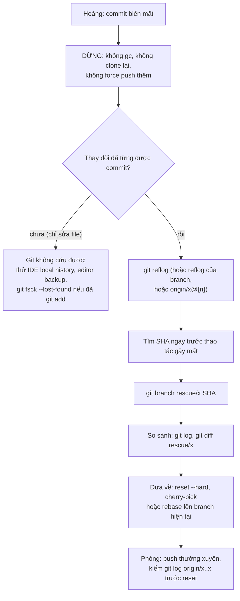
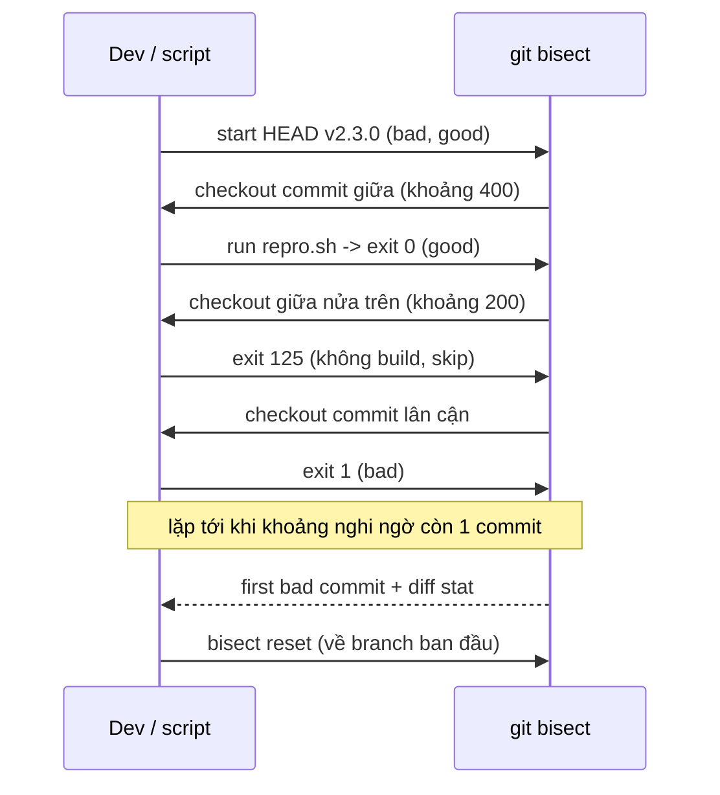
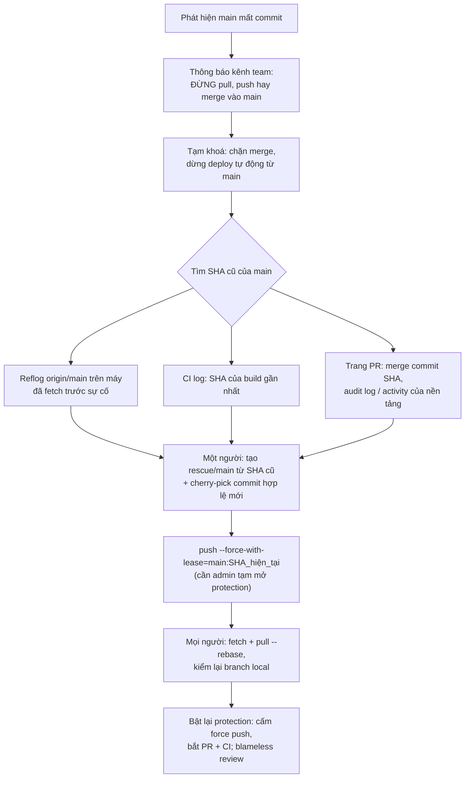

## Bối cảnh & vấn đề

Ba tình huống, cùng một tuần, cùng một team (minh hoạ):

- Thứ Hai, một dev muốn "đồng bộ với remote" và chạy `git reset --hard origin/feature/shift-management`. Hai ngày commit chưa push biến khỏi `git log`. Anh ấy nhắn nhóm: "mất hết rồi".
- Thứ Tư, một người khác có `main` local cũ từ hai ngày trước, sửa một hotfix rồi `git push --force` lên `main` vì "push bị reject". Ba PR đã merge của ba người biến khỏi `main`. CI build bản deploy tiếp theo từ `main` mới.
- Thứ Sáu, QA báo tổng tiền thanh toán sai khi có voucher. Bản `v2.3.0` ba tuần trước đúng. Giữa hai bản có 400 commit, không ai nhớ ai đụng vào phần voucher.

Cả ba đều có cách xử lý **có quy trình**, và cả ba đều dựa trên cùng một hiểu biết: Git hầu như không xoá gì ngay lập tức, nó chỉ dời con trỏ; và lịch sử commit là một cấu trúc có thể **tìm kiếm nhị phân**. Người hoảng loạn thường làm tình hình tệ hơn (force push chồng thêm, `git gc`, clone lại repo rồi xoá thư mục cũ). Người hiểu cơ chế sẽ dừng lại, tìm SHA, tạo branch cứu hộ, rồi mới sửa.

Bài này đi qua bốn công cụ: `reset` (ba chế độ), `reflog` (nhật ký con trỏ), force push có điều kiện (`--force-with-lease`, `--force-if-includes`, branch protection) và `bisect`. Mọi output đều chạy thật trên repo scratch. Nền về commit/ref/rebase nằm ở [bài 1](/tracks/engineering-practices/learn/git-history-merge-rebase).

## Khái niệm

### Ba vùng và ba chế độ reset

Git có ba "vùng": **HEAD** (commit hiện tại, qua branch), **index** (staging area, thứ sẽ vào commit tiếp theo) và **working tree** (file trên đĩa). `git reset <commit>` luôn dời branch hiện tại tới `<commit>`; chế độ chỉ quyết định nó có ghi đè hai vùng còn lại hay không:

- `--soft`: chỉ dời branch. Index và file giữ nguyên, nên mọi thay đổi của các commit bị "bỏ" giờ nằm sẵn trong staging. Dùng để gộp vài commit thành một (`reset --soft HEAD~3` rồi commit lại).
- `--mixed` (mặc định): dời branch và reset index; file trên đĩa giữ nguyên, thay đổi thành "unstaged".
- `--hard`: dời branch, reset index **và ghi đè working tree**. Thay đổi chưa commit trong file đã track bị **mất thật**, vì Git chưa từng lưu chúng thành object.

Điểm mấu chốt: với commit **đã commit**, cả ba chế độ chỉ làm mất con trỏ, không mất dữ liệu. Với thay đổi **chưa commit**, `--hard` là phá huỷ. Đây là lý do "commit sớm, commit thường" là một kỹ năng an toàn chứ không chỉ là thói quen.

### Reflog: nhật ký của con trỏ

Mỗi lần HEAD hoặc một branch đổi vị trí (commit, checkout, reset, rebase, merge, pull), Git ghi một dòng vào **reflog** local: `HEAD@{n}` là vị trí của HEAD n bước trước. Reflog chỉ tồn tại trên máy của bạn (không được push), và có hạn: theo mặc định `gc.reflogExpire` là 90 ngày cho entry còn reachable, `gc.reflogExpireUnreachable` là 30 ngày cho entry trỏ tới commit không còn reachable (verify với cấu hình của bạn). Commit không còn ref nào trỏ (kể cả reflog) chỉ bị xoá khi `git gc` chạy và đã qua thời gian `gc.pruneExpire` (mặc định 2 tuần).

Remote-tracking ref cũng có reflog: `origin/main@{1}` là vị trí của `origin/main` trước lần fetch gần nhất. Đây là chìa khoá khi cứu `main` bị force push: **máy nào đã fetch `main` trước sự cố đều giữ SHA cũ**.

Ví dụ: sau `reset --hard`, `git reflog` cho thấy `HEAD@{1}: commit: feat(shift): store shift times in UTC`; `git branch rescue HEAD@{1}` là cứu xong.

**Interview angle:** câu hỏi "my last two days of work are gone" kiểm tra bạn có phân biệt được commit (cứu được) với thay đổi chưa commit (không cứu được bằng Git) và có biết kiểm tra **trước** khi reset hay không.

### Force push, lease và include

`git push --force` ghi đè ref trên remote bằng ref local, bất kể remote đang ở đâu. Nếu ai đó đã push thêm, commit của họ biến mất khỏi branch. `--force-with-lease` thêm một điều kiện: "chỉ ghi đè nếu ref trên remote **vẫn bằng** giá trị `origin/<branch>` mà tôi biết". Nếu người khác đã push sau lần fetch cuối của bạn, push bị từ chối với `(stale info)`.

Lỗ hổng: `origin/<branch>` được cập nhật mỗi khi bạn **fetch**, kể cả fetch nền do IDE tự chạy. Sau một fetch như vậy, lease "khớp" dù bạn chưa từng nhìn thấy commit mới của đồng đội, và `--force-with-lease` ghi đè chúng một cách im lặng. `--force-if-includes` (Git 2.30+) vá chỗ này: nó yêu cầu đầu remote mà bạn sắp ghi đè phải **nằm trong lịch sử local của bạn** (đã được bạn tích hợp qua reflog), nếu không thì từ chối. Cấu hình khuyến nghị cho branch cá nhân: `git config --global push.useForceIfIncludes true` và luôn dùng `--force-with-lease`.

Cả hai cờ chỉ bảo vệ **người dùng có thiện chí**. Chúng không thay được **branch protection** trên server: với `main`, cách đúng là cấm force push cho mọi người (kể cả admin), bắt buộc PR + CI.

### git bisect

`git bisect` là **tìm kiếm nhị phân** trên lịch sử: bạn đánh dấu một commit `good` (chưa lỗi) và một commit `bad` (đã lỗi); Git checkout commit ở giữa; bạn trả lời good/bad; khoảng nghi ngờ giảm một nửa mỗi bước. Với N commit, cần khoảng ⌈log₂ N⌉ bước: 400 commit → khoảng 9 bước, 1.000 commit → khoảng 10.

`git bisect run <cmd>` tự động hoá: Git chạy lệnh ở mỗi bước và đọc **exit code**: `0` = good; `125` = "commit này không test được, bỏ qua" (ví dụ không build); `1`–`127` khác 125 = bad; mã khác (ví dụ 128+, bị kill bởi signal) làm bisect **dừng**. Vì vậy script repro phải trả exit code rõ ràng, và lỗi hạ tầng (không cài được dependency) nên trả 125 chứ không phải 1, nếu không bisect sẽ kết luận sai.

`--first-parent` (Git 2.29+) chỉ đi theo parent thứ nhất của merge commit, tức là bisect theo **từng PR đã merge vào `main`** thay vì đi vào commit trung gian của từng branch (thường không build được hoặc chưa hoàn chỉnh).

Bisect hiệu quả nhất khi lịch sử có commit nhỏ, mỗi commit build và test được. Đó là một lý do kỹ thuật thật sự cho các quy ước ở [bài 1](/tracks/engineering-practices/learn/git-history-merge-rebase).

### Revert: undo trên branch chung

`git revert <sha>` tạo một commit **mới** đảo ngược thay đổi của `<sha>`. Nó không viết lại lịch sử nên là cách duy nhất phù hợp để gỡ thay đổi trên `main` hay mọi branch chung. Với merge commit cần `-m 1` (giữ phía mainline). Quy tắc nhớ: **branch cá nhân thì reset/rebase, branch chung thì revert**.

### Recap

| Lệnh | Đổi gì | Mất gì | Dùng khi |
|---|---|---|---|
| `reset --soft X` | branch | không | Gộp commit |
| `reset --mixed X` | branch + index | không (thay đổi thành unstaged) | Bỏ stage, làm lại commit |
| `reset --hard X` | branch + index + file | thay đổi **chưa commit** | Bỏ hẳn local, đã chắc chắn |
| `revert X` | thêm commit đảo | không | Undo trên branch chung |
| `push --force-with-lease` | ref remote nếu lease khớp | commit người khác nếu đã fetch nền | Branch cá nhân sau rebase |
| `bisect run` | không (chỉ checkout tạm) | không | Tìm commit đầu tiên gây lỗi |

## Cơ chế hoạt động

### Quy trình "commit của tôi mất rồi"



Sơ đồ có hai nhánh vì chỉ có hai trường hợp. Bước B quan trọng không kém phần còn lại: `git gc --prune=now` hoặc xoá thư mục `.git` sẽ biến một sự cố cứu được thành mất thật. Bước G tạo **branch mới** thay vì reset ngay branch hiện tại: bạn luôn giữ được cả trạng thái hiện tại lẫn trạng thái cứu hộ để so sánh, và một ref mới làm commit "reachable" trở lại, không còn nguy cơ bị gc.

Một chi tiết của nhánh D: nếu file đã từng được `git add` (dù chưa commit), Git đã tạo **blob** cho nội dung đó. `git fsck --lost-found` liệt kê các blob/commit "dangling" và ghi chúng vào `.git/lost-found/`, nên đôi khi vẫn cứu được nội dung (không có tên file).

### Bisect thu hẹp khoảng nghi ngờ



Khi gặp `125`, Git không loại được nửa nào, nên nó chọn một commit gần đó để thử; mỗi lần skip tốn thêm ít nhất một bước. Nếu quá nhiều commit liên tiếp không build, bisect có thể kết thúc với "There are only 'skip'ped commits left to test" và đưa ra một **khoảng** thay vì một commit. Đó là chi phí thực tế của commit `wip` không build.

### Khôi phục main sau force push



Hai điểm then chốt. Thứ nhất, **chỉ một người** làm khôi phục; nếu ba người cùng "sửa" bằng force push, mỗi người sẽ ghi đè lần sửa của người trước. Thứ hai, khi đẩy bản khôi phục, dùng lease **tường minh** `--force-with-lease=main:<sha đang sai>`: nếu trong lúc bạn khôi phục có ai đó push thêm lên `main`, lệnh sẽ từ chối thay vì xoá luôn commit đó.

## Ví dụ thực tế

Tất cả chạy thật với git 2.50 (Apple Git-155) và Node 24, mỗi kịch bản trong một repo scratch có remote dạng bare repo.

### 1. "Hai ngày làm việc của tôi mất rồi" sau reset --hard

Trạng thái trước sự cố: hai commit local chưa push, một thay đổi chưa commit. Lệnh kiểm tra đáng lẽ phải chạy trước khi reset:

```text
$ git status -sb
## feature/shift-management...origin/feature/shift-management [ahead 2]
 M shift.txt
$ git fetch origin && git log --oneline origin/feature/shift-management..feature/shift-management
c83ba2e feat(shift): store shift times in UTC
1662d5f feat(shift): reject overlapping shifts
```

`[ahead 2]` và hai dòng log nói rõ: reset về remote sẽ bỏ hai commit này; `M shift.txt` nói có thay đổi chưa commit sẽ mất hẳn. Sự cố và cách cứu:

```text
$ git reset --hard origin/feature/shift-management
HEAD is now at 4f146b3 feat(shift): base
$ git reflog -5
4f146b3 HEAD@{0}: reset: moving to origin/feature/shift-management
c83ba2e HEAD@{1}: commit: feat(shift): store shift times in UTC
1662d5f HEAD@{2}: commit: feat(shift): reject overlapping shifts
4f146b3 HEAD@{3}: checkout: moving from main to feature/shift-management
4f146b3 HEAD@{4}: commit (initial): feat(shift): base
$ git branch rescue/shift HEAD@{1} && git log --oneline rescue/shift
c83ba2e feat(shift): store shift times in UTC
1662d5f feat(shift): reject overlapping shifts
4f146b3 feat(shift): base
$ grep draft shift.txt
(no match)
```

Hai commit cứu được trọn vẹn. Dòng "uncommitted draft" thì mất: nó chưa từng là object trong Git. Câu trả lời đầy đủ cho đồng đội: "Commit vẫn còn, đây là branch `rescue/shift`; phần chưa commit thì thử Local History của IDE". Và cách đúng để đồng bộ thay vì reset là `git pull --rebase`, giữ commit local và đặt chúng lên đầu remote.

### 2. --force-with-lease chặn được gì, và khi nào không

Alice amend commit trên `feat/x` trong khi Bob đã push thêm một commit lên cùng branch:

```text
--- case 1: alice has NOT fetched; --force-with-lease protects bob
$ git push --force-with-lease
 ! [rejected]        feat/x -> feat/x (stale info)
error: failed to push some refs to '.../origin.git'

--- case 2: IDE background fetch updated origin/feat/x; lease now passes silently
$ git push --force-with-lease --force-if-includes
 ! [rejected]        feat/x -> feat/x (remote ref updated since checkout)
hint: Updates were rejected because the tip of the remote-tracking branch has
hint: been updated since the last checkout. If you want to integrate the
hint: remote changes, use 'git pull' before pushing again.
$ git push --force-with-lease   (without --force-if-includes)
 + 468dfaa...05fbc30 feat/x -> feat/x (forced update)
$ git log --oneline origin/feat/x   # bob commit gone from remote
05fbc30 feat(x): step 1 (amended)
7f5f32e feat: base
```

Case 2 là followUp của câu hỏi force push: sau một `git fetch` (Alice không hề nhìn commit của Bob), `--force-with-lease` một mình vẫn xoá commit của Bob. Thêm `--force-if-includes` thì bị chặn vì đầu remote chưa nằm trong lịch sử local của Alice. Và cả hai cờ đều là lựa chọn của người push; chỉ **branch protection** trên server mới đảm bảo được cho `main`.

### 3. main bị force push: tìm lại và khôi phục

Dave có `main` cũ ở `release 1.4.0`, thêm một hotfix rồi `push --force`. Hai PR của Carol và Erin biến mất:

```text
--- origin/main before incident:
ff0a963 feat(erin): merged PR from erin
e955371 feat(carol): merged PR from carol
c230f0a chore: release 1.4.0
--- origin/main after dave force-push:
0f481d5 fix: dave hotfix
c230f0a chore: release 1.4.0
--- server reflog? (bare repo default core.logAllRefUpdates=false)
(empty)
```

Server (bare repo) mặc định không ghi reflog, nên không thể trông vào nó. Nhưng máy Carol đã fetch `main` trước sự cố:

```text
$ git fetch origin
 + ff0a963...0f481d5 main       -> origin/main  (forced update)
$ git reflog show origin/main -3
0f481d5 refs/remotes/origin/main@{0}: fetch origin: forced-update
ff0a963 refs/remotes/origin/main@{1}: fetch -q: fast-forward
e955371 refs/remotes/origin/main@{2}: update by push
$ git log --oneline origin/main..origin/main@{1}   # commit bị mất khỏi main
ff0a963 feat(erin): merged PR from erin
e955371 feat(carol): merged PR from carol
$ git log --oneline origin/main@{1}..origin/main   # commit của dave chỉ có trên main mới
0f481d5 fix: dave hotfix
```

Git in sẵn `(forced update)` và cả hai SHA ngay trong output của `fetch`, một tín hiệu cảnh báo đáng dạy cho cả team. Khôi phục: tạo `rescue/main` từ đầu cũ, giữ lại hotfix hợp lệ của Dave bằng cherry-pick (`-x` ghi nguồn gốc vào message), rồi đẩy lên với lease tường minh:

```text
$ git switch -c rescue/main origin/main@{1} && git cherry-pick -x origin/main
$ git log --oneline rescue/main
b9f8dd2 fix: dave hotfix
ff0a963 feat(erin): merged PR from erin
e955371 feat(carol): merged PR from carol
c230f0a chore: release 1.4.0
$ git push --force-with-lease=main:0f481d5 origin rescue/main:main
 + 0f481d5...b9f8dd2 rescue/main -> main (forced update)
--- erin: $ git pull --rebase
$ git log --oneline -4
b9f8dd2 fix: dave hotfix
ff0a963 feat(erin): merged PR from erin
e955371 feat(carol): merged PR from carol
c230f0a chore: release 1.4.0
```

Trên GitHub/GitLab, ngoài reflog của các máy dev còn có: merge commit SHA trên trang mỗi PR đã merge, SHA trong log CI/CD của các build gần nhất, và audit log/activity của repo ghi lại force push (vị trí cụ thể tuỳ nền tảng, verify). Commit cũ thường vẫn còn trên server một thời gian vì chưa bị gc, nên tạo lại ref từ SHA (qua UI hoặc API) là khả thi.

Phòng ngừa, theo thứ tự hiệu quả: (1) protection/ruleset trên `main` cấm force push và xoá branch, bắt buộc PR + status check, áp dụng **cả cho admin**; (2) quyền admin tối thiểu; (3) `push.useForceIfIncludes=true` và thói quen `--force-with-lease` cho branch cá nhân; (4) postmortem blameless: câu hỏi không phải "tại sao Dave làm vậy" mà "tại sao hệ thống cho phép một người với `main` cũ ghi đè `main`".

### 4. Bisect 400 commit với script repro

Regression: `total([{price: 100, qty: 2}], voucher 30)` phải bằng 170. Ba commit ở giữa lịch sử không build. Script repro trả exit code theo đúng hợp đồng của `bisect run`:

```bash
#!/usr/bin/env bash
# repro.sh — exit 0 = good, 1 = bad, 125 = không test được commit này (skip)
if [ -f build-broken.mjs ] && ! node --check build-broken.mjs 2>/dev/null; then exit 125; fi
node -e 'import("./total.mjs").then(({ total }) => {
  const got = total([{ price: 100, qty: 2 }], 30);
  process.exit(got === 170 ? 0 : 1);
})'
```

```text
$ git rev-list --count v2.3.0..HEAD
400
$ git bisect start HEAD v2.3.0
$ git bisect run ../repro.sh
Bisecting: 99 revisions left to test after this (roughly 7 steps)
Bisecting: 49 revisions left to test after this (roughly 6 steps)
Bisecting: 49 revisions left to test after this (roughly 6 steps)
Bisecting: 45 revisions left to test after this (roughly 6 steps)
Bisecting: 22 revisions left to test after this (roughly 5 steps)
Bisecting: 11 revisions left to test after this (roughly 4 steps)
Bisecting: 5 revisions left to test after this (roughly 3 steps)
Bisecting: 2 revisions left to test after this (roughly 2 steps)
Bisecting: 0 revisions left to test after this (roughly 1 step)
Bisecting: 0 revisions left to test after this (roughly 0 steps)
4d6d857662684aa8995c59a5814bd39ee51493f6 is the first bad commit
 notes.js  | 1 +
 total.mjs | 2 +-
bisect found first bad commit
$ git bisect log | grep -E "^git bisect (good|bad|skip)" | cut -c1-16
git bisect good
git bisect bad
git bisect skip
git bisect good
git bisect good
git bisect bad
git bisect bad
git bisect good
git bisect good
git bisect bad
git bisect bad
$ git show 4d6d857 -- total.mjs | tail -2
-export const total = (items, voucher = 0) => Math.max(0, items.reduce((s, i) => s + i.price * i.qty, 0) - voucher);
+export const total = (items, voucher = 0) => Math.max(0, items.reduce((s, i) => s + i.price * i.qty, 0) - voucher * 2);
$ git bisect reset
```

Mười một lần chạy script cho 400 commit (một lần rơi vào commit không build nên `skip`, dòng "49 revisions" lặp lại hai lần chính là bước đó). Commit tìm được có message `refactor(checkout): normalize voucher amount`: một refactor "không đổi hành vi" đã đổi hành vi. Việc tiếp theo không phải revert ngay, mà là hiểu *vì sao* (đọc PR, hỏi author), thêm test hồi quy chính là script repro, rồi revert hoặc sửa tuỳ mức khẩn cấp.

### 5. --first-parent: bisect theo PR

Bốn PR merge bằng merge commit, mỗi PR 3 commit; lỗi xuất hiện ở bước 2 của PR #43:

```text
$ git bisect start --first-parent HEAD good && git bisect run ../t.sh
5eb2d4d457890ba295764e99e33940c5d0e4eae0 is the first bad commit
    Merge pull request #43
$ git bisect start HEAD good && git bisect run ../t.sh
4e2096e0ac7c05e2e2adcc081dc8730416a8cb31 is the first bad commit
    pr43: step 2
```

`--first-parent` trả lời "PR nào?", thường là câu hỏi quan trọng hơn khi cần revert nhanh, và tránh được commit trung gian không build. Bisect thường trả lời "bước nào?", có ích khi commit trung gian sạch. Một cách làm hay: chạy `--first-parent` để tìm PR, rồi bisect bên trong PR đó nếu cần chi tiết.

## Trade-offs & lựa chọn thay thế

| Tình huống | Cách nhanh | Cách an toàn hơn | Ghi chú |
|---|---|---|---|
| Đồng bộ branch local với remote | `reset --hard origin/x` | `pull --rebase` | reset chỉ khi `git log origin/x..x` rỗng và `git status` sạch |
| Undo commit trên branch chung | `reset` + force push | `revert` | Branch chung: luôn revert |
| Ghi đè branch cá nhân sau rebase | `--force` | `--force-with-lease --force-if-includes` | Không bao giờ dùng cho `main` |
| Bảo vệ `main` | Quy định bằng lời | Protection/ruleset: cấm force push, bắt PR + CI | Áp dụng cả admin |
| Tìm commit gây lỗi | Đọc log, đoán | `bisect run` với repro | Bisect cần repro tự động và lịch sử build được |
| Bisect theo PR hay theo commit | `--first-parent` | Bisect đầy đủ | first-parent trước, chi tiết sau |

Khi nào **không** dùng bisect? Khi lỗi không nằm trong code của repo: thay đổi config/feature flag, dữ liệu, dependency được resolve khác (lockfile không commit), hạ tầng (version DB, kernel, instance type), hoặc lỗi chỉ xuất hiện dưới tải production. Lúc đó, công cụ tương ứng là: diff config và lịch sử flag, `git diff v2.3.0 HEAD -- package-lock.json`, deploy log đối chiếu với thời điểm metric xấu đi, và so sánh canary với bản cũ. Bisect vẫn có thể dùng nếu bạn dựng được repro trong staging (ví dụ một load test ngắn trả exit code theo p99), nhưng mỗi bước sẽ tốn vài phút thay vì vài giây; với 400 commit, 9–11 bước vẫn chấp nhận được.

Khi bisect dừng ở một **squash commit khổng lồ** (followUp của câu bisect): đi tiếp ở cấp nhỏ hơn. Lấy lại các commit gốc của PR (nền tảng thường giữ ref của PR, ví dụ `refs/pull/<n>/head` trên GitHub, verify) rồi bisect trên đó; hoặc chia diff theo file/thư mục, áp dần lên commit cha (`git checkout <sha> -- path/` từng phần) và chạy repro, đây chính là bisect bằng tay trên không gian file. Bài học dài hạn: PR nhỏ hơn.

## Edge cases & failure modes

- **Reflog đã hết hạn hoặc repo mới clone**: reflog là local và có hạn. Clone mới không có reflog của bạn. Nếu commit chưa từng được push và reflog đã bị expire + gc, dữ liệu mất thật. Chạy `git fsck --lost-found` trước khi bỏ cuộc.
- **Stash bị drop**: `git stash drop` không có trong reflog của branch, nhưng stash là commit; `git fsck --no-reflog | grep commit` liệt kê commit dangling, trong đó có stash vừa drop.
- **Worktree và reflog**: mỗi worktree có reflog HEAD riêng; tìm trong đúng worktree (`git worktree list`).
- **`--force-with-lease` không tham số sau fetch nền**: như ví dụ 2, bảo vệ biến mất. Bật `push.useForceIfIncludes` hoặc dùng lease tường minh `--force-with-lease=branch:<sha>`.
- **Server không có reflog**: bare repo tự host mặc định `core.logAllRefUpdates=false`; muốn có thì bật trên server hoặc dựa vào audit log của nền tảng và log CI.
- **Bisect với test flaky**: một kết quả sai ở giữa đưa bisect tới commit sai mà vẫn "tự tin". Chạy repro nhiều lần mỗi bước (pass chỉ khi N/N pass), hoặc kiểm lại kết quả bằng cách chạy repro trên commit cha và commit tìm được.
- **Bisect khi lỗi do tương tác nhiều commit**: commit A và B riêng lẻ đều ổn, cùng nhau thì lỗi. Bisect sẽ chỉ ra commit đến sau trong hai cái; đọc diff cả hai trước khi kết luận "lỗi của B".
- **Script repro trả mã sai**: dependency cài lỗi trả 1 → bisect đánh dấu bad sai. Phân biệt rõ: lỗi môi trường → 125, lỗi assert → 1. Script bị kill (OOM) → mã > 128 → bisect dừng.
- **Khôi phục main trong lúc người khác vẫn merge**: nếu không khoá merge trước, bản khôi phục ghi đè PR mới. Khoá trước, lease tường minh khi push.
- **Deploy tự động từ main bị force push**: production có thể đã chạy code thiếu ba PR (thiếu cả migration). Kiểm tra trạng thái deploy và schema trước khi đẩy lại `main`, vì deploy tiếp theo có thể chạy lại migration.

## Pitfalls

- ❌ `reset --hard origin/x` để "đồng bộ" → ✅ `git status` + `git log origin/x..x` trước; dùng `pull --rebase` để giữ commit local.
- ❌ Coi "không thấy trong `git log`" là mất → ✅ `git reflog`, `origin/x@{n}`, `git fsck`; tạo `rescue/*` branch trước khi làm gì khác.
- ❌ Clone lại repo rồi xoá thư mục cũ khi "Git hỏng" → ✅ thư mục cũ chứa reflog và object duy nhất có thể cứu bạn.
- ❌ `--force` sau rebase → ✅ `--force-with-lease --force-if-includes`, và chỉ trên branch cá nhân.
- ❌ Ba người cùng force push để "sửa" main → ✅ một người khôi phục, có thông báo, có khoá merge, lease tường minh.
- ❌ Bisect bằng tay khi có thể viết repro → ✅ `bisect run` với script exit 0/1/125; test hồi quy chính là script đó.
- ❌ Trả `exit 1` cho mọi lỗi trong script repro → ✅ lỗi môi trường/không build trả 125.
- ❌ Kết luận ngay "commit X gây lỗi, revert" → ✅ hiểu cơ chế lỗi, kiểm repro trên cha của X, thêm regression test.
- ❌ Chỉ dựa vào kỷ luật để bảo vệ `main` → ✅ branch protection/ruleset cấm force push, áp dụng cả admin; blameless postmortem.

## Tóm tắt

- `reset` luôn dời branch; `--soft` giữ index + file, `--mixed` giữ file, `--hard` ghi đè file: thay đổi **chưa commit** mất thật.
- Commit đã commit hầu như không mất ngay: **reflog** (local, mặc định 90/30 ngày) và `origin/x@{n}` giữ SHA cũ; cứu bằng `git branch rescue SHA`.
- Trước khi reset về remote: `git status -sb` (`ahead N`) và `git log origin/x..x`.
- `--force-with-lease` chặn ghi đè khi remote đổi, nhưng **fetch nền làm nó vô hiệu**; thêm `--force-if-includes`. `main` được bảo vệ bằng branch protection, không bằng cờ của client.
- Cứu `main` bị force push: khoá merge, tìm SHA cũ (reflog máy đã fetch, CI log, trang PR), một người khôi phục, push với lease tường minh, mọi người `pull --rebase`, rồi bật protection.
- `bisect` là tìm kiếm nhị phân: ~log₂N bước (400 commit ≈ 9–11 lần chạy); `bisect run` đọc exit 0/1–127/125; `--first-parent` bisect theo PR.
- Bisect không giúp khi lỗi do config, data, dependency resolve, hạ tầng hay chỉ dưới tải; dùng deploy log, lockfile diff, canary.
- Trên branch chung: **revert**, không reset.
