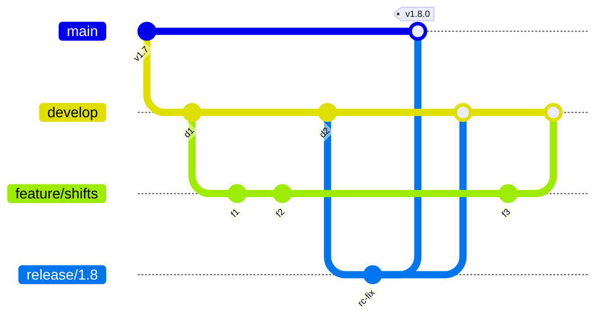
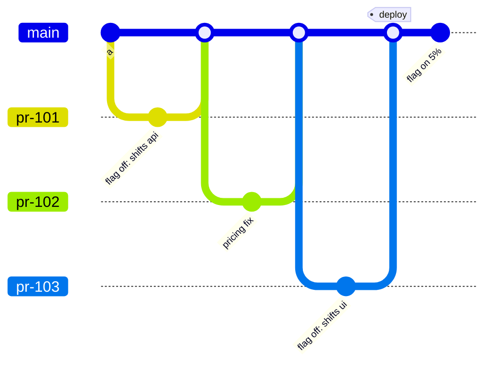
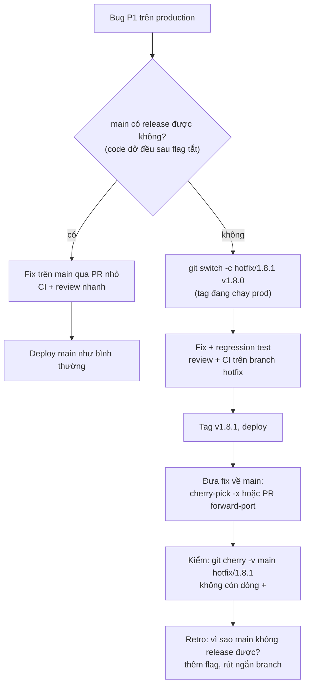
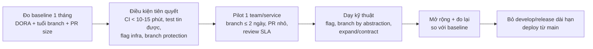

## Bối cảnh & vấn đề

Một team 8 người làm SaaS (minh hoạ) dùng mô hình "mỗi feature một branch, merge khi xong". Feature lớn nhất của quý, quản lý ca làm việc, sống trên branch riêng 5 tuần. Ngày merge, PR có 3.800 dòng thay đổi và 47 file conflict với `main`, vì trong 5 tuần đó người khác đã refactor module pricing và đổi schema bảng `employees`. Hai người mất hai ngày chỉ để giải conflict, QA phải test lại toàn bộ, và release trễ một tuần. Tuần sau, một bug thanh toán cần hotfix ngay nhưng `main` đang chứa nửa feature chưa test xong: không ai dám deploy `main`.

Cả hai vấn đề có chung một gốc: **tích hợp muộn**. Branch càng sống lâu, khoảng cách với `main` càng lớn, và chi phí merge tăng nhanh hơn tuyến tính vì các thay đổi chồng lên nhau. Branching strategy là cách team trả lời ba câu hỏi: code được tích hợp vào nhánh chung **bao lâu một lần**, cái gì được phép nằm trên nhánh chung (code chưa xong có được không?), và **release** được cắt từ đâu.

Bài này so sánh ba mô hình phổ biến (trunk-based, GitHub flow, GitFlow), giải thích vì sao nghiên cứu DORA liên kết trunk-based với hiệu suất delivery cao, chạy thật một hotfix từ tag khi `main` có code chưa release, và đưa ra lộ trình chuyển một team sang trunk-based kèm cách đo trước/sau. Công cụ quan trọng nhất cho trunk-based là feature flag, được tách thành [bài 4](/tracks/engineering-practices/learn/feature-flags).

## Khái niệm

### Continuous integration là một hành vi, không phải một tool

**Continuous integration** (CI) theo nghĩa gốc của Fowler là: mọi người tích hợp thay đổi của mình vào mainline **ít nhất mỗi ngày**, và mỗi lần tích hợp được kiểm bằng build + test tự động. Một server Jenkins/GitHub Actions chạy test trên branch sống 5 tuần **không phải** CI theo nghĩa này: nó kiểm từng branch riêng, nhưng không kiểm được branch đó với thay đổi của người khác cho tới ngày merge.

Lý do CI hoạt động: conflict và lỗi tích hợp được phát hiện khi chúng còn **nhỏ**. Hai người cùng sửa một hàm trong cùng một ngày thì giải conflict mất 5 phút; cùng sửa trong 5 tuần thì có thể phải thiết kế lại.

### Trunk-based development

**Trunk-based development** (TBD) là mô hình mà mọi người tích hợp vào một nhánh chung (`trunk`, thường là `main`) liên tục. Có hai biến thể: commit thẳng vào trunk (team nhỏ, pair programming, CI rất mạnh) hoặc **short-lived feature branch** qua PR, mỗi branch sống vài giờ tới 1–2 ngày. Release được cắt từ trunk, hoặc deploy trực tiếp từ trunk (continuous delivery/deployment).

Hệ quả: code chưa xong **sẽ** nằm trên trunk. TBD chỉ an toàn khi có kỹ thuật giữ code chưa xong không ảnh hưởng người dùng: **feature flag**, **branch by abstraction** (thay một implementation sau một interface, từng bước), **dark launch** (code chạy nhưng kết quả không hiển thị), và **expand/contract** cho migration DB. Trunk phải luôn ở trạng thái release được ("always green"): build đỏ là ưu tiên số một của cả team.

Ví dụ: tính năng checkout mới merge vào `main` 15 lần trong 2 tuần, tất cả nằm sau flag `checkout_v2` đang tắt; ngày release chỉ là bật flag cho 5% tenant.

### GitHub flow

**GitHub flow** đơn giản hoá: `main` luôn deploy được; mỗi thay đổi là một branch từ `main` → PR → review + CI → merge → deploy. Không có `develop`, không có release branch. Về bản chất, đây là TBD với feature branch, miễn là branch thật sự ngắn; nếu branch sống 3 tuần thì nó chỉ còn là "feature branching có PR".

### GitFlow

**GitFlow** (Vincent Driessen, 2010) dùng nhiều nhánh sống lâu: `main` chỉ chứa các bản đã release (có tag), `develop` là nhánh tích hợp, `feature/*` tách từ `develop`, `release/*` tách từ `develop` để ổn định bản phát hành, `hotfix/*` tách từ `main` cho sửa gấp và merge về cả `main` lẫn `develop`. Mô hình hợp với phần mềm **có version rõ ràng** và phải duy trì nhiều version song song: app mobile phát hành theo đợt qua store, thư viện, phần mềm cài on-premise cho khách hàng.

Cái giá: branch sống lâu, merge nhiều chiều, feedback chậm, dễ quên merge hotfix về `develop`. Chính tác giả đã thêm một "note of reflection" năm 2020 nói rằng với web app được deliver liên tục, nên dùng mô hình đơn giản hơn như GitHub flow thay vì GitFlow.

**Interview angle:** đừng trả lời "trunk-based tốt hơn". Hãy nói: trunk-based cho phần mềm deploy liên tục một version (SaaS); GitFlow-ish cho phần mềm phải duy trì nhiều version; và điều kiện tiên quyết để TBD an toàn.

### Release branch trong trunk-based

TBD không cấm release branch. Khi cần ổn định một bản (app mobile, khách hàng enterprise cần bản cố định), cắt `release/1.8` từ trunk **ngay trước** khi phát hành. Quy tắc của trunkbaseddevelopment.com: **sửa trên trunk trước, rồi cherry-pick sang release branch**; không phát triển feature trên release branch, không merge release branch ngược về trunk. Release branch chết khi version đó hết được hỗ trợ.

### Hotfix

**Hotfix** là sửa gấp cho bản đang chạy production mà không đợi chu kỳ release bình thường. Câu hỏi thực tế: sửa từ đâu?

- Nếu `main` luôn release được (mọi code chưa xong sau flag tắt): sửa trên `main`, deploy như mọi thay đổi khác. Đây là lý tưởng và là lý do mạnh nhất cho TBD + flag.
- Nếu `main` có code chưa release được: tạo `hotfix/x.y.z` từ **tag/commit đang chạy production**, sửa, test, release; rồi **đưa fix về `main`** (cherry-pick `-x` hoặc PR riêng). Bước cuối hay bị quên nhất, và hậu quả là regression: lần release sau từ `main` lại thiếu fix.

### DORA metrics

Chương trình nghiên cứu **DORA** (DevOps Research and Assessment) đo hiệu suất software delivery bằng bốn metric chính:

- **Deployment frequency**: bao lâu deploy lên production một lần.
- **Lead time for changes**: thời gian từ khi commit tới khi chạy trên production.
- **Change failure rate**: tỉ lệ deploy gây sự cố cần khắc phục (rollback, hotfix).
- **Failed deployment recovery time**: thời gian khôi phục sau một deploy hỏng (trước 2023 gọi là time to restore service / MTTR, verify).

Hai metric đầu đo **throughput**, hai metric sau đo **stability**; phát hiện quan trọng của nghiên cứu là các team tốt nhất giỏi **cả hai cùng lúc**, không phải đánh đổi tốc độ lấy ổn định. Báo cáo 2024 bổ sung **rework rate** (tỉ lệ deploy không có kế hoạch để sửa lỗi) (verify). DORA liệt kê trunk-based development là một **capability** có liên hệ với hiệu suất cao, với các dấu hiệu như: ít hơn ba branch đang hoạt động, branch merge vào trunk ít nhất mỗi ngày, không có giai đoạn code freeze/integration riêng (verify chi tiết trên dora.dev).

### Recap

| Mô hình | Nhánh sống lâu | Tích hợp | Hợp với |
|---|---|---|---|
| Trunk-based | Chỉ trunk (+ release branch ngắn khi cần) | Liên tục, ≤1–2 ngày | SaaS deploy liên tục |
| GitHub flow | Chỉ `main` | Mỗi PR | Web app, team nhỏ–vừa |
| GitFlow | `main`, `develop`, `release/*` | Theo feature/release | Nhiều version song song, release theo đợt |

## Cơ chế hoạt động

### Hình dạng lịch sử của hai mô hình



Đây là GitFlow: `feature/shifts` sống qua cả một chu kỳ release, `release/1.8` phải merge về hai nơi. Mỗi mũi tên merge là một chỗ có thể conflict hoặc bị quên. So sánh với trunk-based dưới đây.



Trong trunk-based, mỗi branch chỉ có một hai commit và merge trong ngày. Feature quản lý ca được tích hợp từng phần, sau flag, nên `main` luôn deploy được; "release" là thao tác bật flag, không phải merge.

### Hotfix khi main chứa code chưa release



Nhánh "có" ngắn hơn nhiều, và đó là toàn bộ lý lẽ. Nhánh "không" có ba bước dễ hỏng: tạo branch từ sai điểm (từ `main` thay vì tag), quên forward-port (H), và không kiểm tra lại (I). Bước I có thể tự động hoá trong CI của release: fail nếu `git cherry` còn commit `+` chưa có trên `main`.

### Lộ trình chuyển sang trunk-based



Thứ tự này quan trọng: đổi quy tắc branch **trước** khi có CI nhanh và flag là cách chắc chắn nhất để `main` vỡ liên tục, và team sẽ kết luận "trunk-based không hợp với chúng ta". Phần teams thường **đánh giá thấp** (followUp của câu hỏi): không phải Git, mà là (1) độ tin cậy của test suite (test flaky làm mọi người bỏ qua CI đỏ), (2) kỹ năng chia một feature lớn thành các bước nhỏ có thể merge mà không làm hỏng gì, và (3) kỷ luật dọn flag.

## Ví dụ thực tế

Output dưới đây chạy thật với git 2.50 và Node 24 trong repo scratch.

### 1. Hotfix từ tag khi main có code chưa release

Production chạy `v1.8.0`. `main` đã có hai commit chưa release, trong đó một feature dở **không** nằm sau flag:

```text
$ git log --oneline --decorate
5f72bfc (HEAD -> main) feat(pricing): new tax table (unreleased)
0c29d2e feat(shift): bulk edit (WIP, not behind a flag)
2ac6b6d (tag: v1.8.0) feat(shift): shift list
7ffda75 feat(pricing): base
```

Tạo hotfix từ đúng tag đang chạy, sửa, tag bản mới:

```text
$ git switch -c hotfix/1.8.1 v1.8.0
$ git commit -am "fix(shift): allow overnight shifts crossing midnight"
$ git tag -a v1.8.1 -m "release 1.8.1"
$ git log --oneline --decorate v1.8.0..v1.8.1
6ded20f (HEAD -> hotfix/1.8.1, tag: v1.8.1) fix(shift): allow overnight shifts crossing midnight
$ git diff --stat v1.8.0 v1.8.1
 shift.txt | 1 +
 1 file changed, 1 insertion(+)
```

`git diff --stat v1.8.0 v1.8.1` là bằng chứng gửi cho người duyệt release: bản hotfix chỉ khác production đúng một dòng, không mang theo bulk edit hay bảng thuế mới. Đưa fix về `main` và kiểm tra:

```text
$ git switch main && git cherry-pick -x hotfix/1.8.1
[main adb9cda] fix(shift): allow overnight shifts crossing midnight
$ git log -1 --format=%B
fix(shift): allow overnight shifts crossing midnight

(cherry picked from commit 6ded20f69175067ca152b313f650b94b8abbb428)

$ git cherry -v main hotfix/1.8.1   # "-" = patch đã có trên main
- 6ded20f69175067ca152b313f650b94b8abbb428 fix(shift): allow overnight shifts crossing midnight
```

`-x` ghi dòng "cherry picked from commit ..." để sau này truy được nguồn gốc. `git cherry` so **patch-id** (nội dung thay đổi), không so SHA, nên nhận ra fix đã có trên `main` dù SHA khác. Giờ giả sử có người thêm một fix thứ hai lên hotfix branch và quên đưa về:

```text
$ git cherry -v main hotfix/1.8.1
- 6ded20f69175067ca152b313f650b94b8abbb428 fix(shift): allow overnight shifts crossing midnight
+ 27c58eedc09117df36e97e93b2ede1bd9a129085 fix(shift): handle DST switch
```

Dòng `+` là fix sẽ biến mất ở release sau. Đưa lệnh này vào CI của release branch (fail nếu có `+`) trả lời followUp "làm sao đảm bảo hotfix không bao giờ bị mất".

### 2. Đo bốn DORA metrics từ git log và deploy log

Dữ liệu minh hoạ: một repo scratch 3 tuần (45 commit trong giờ làm việc) và `deploys.json` ghi 25 lần deploy (SHA, thời điểm, trạng thái, thời điểm khôi phục nếu hỏng). Tuần 1–2 deploy 2 lần/ngày, tuần 3 giảm còn 1 lần/ngày. Script tính lead time bằng cách lấy mọi commit **lần đầu** xuất hiện trong mỗi deploy (`git log prev..sha`):

```ts
// dora.ts — 4 DORA metrics từ git log + deploy log. Usage: node dora.ts <repo> <deploys.json>
import { execFileSync } from "node:child_process";
import { readFileSync } from "node:fs";

type Deploy = { sha: string; at: number; status: "ok" | "failed"; restoredAt: number | null };
const [repo, file] = process.argv.slice(2);
const deploys: Deploy[] = JSON.parse(readFileSync(file, "utf8")).sort((a: Deploy, b: Deploy) => a.at - b.at);
const git = (...args: string[]) => execFileSync("git", ["-C", repo, ...args], { encoding: "utf8" }).trim();

// Lead time for changes: mỗi commit lần đầu lên prod = thời điểm deploy - thời điểm commit
const leadHours: number[] = [];
let prev: string | null = null;
for (const d of deploys) {
  const range = prev ? `${prev}..${d.sha}` : d.sha;
  const times = git("log", "--format=%ct", range).split("\n").filter(Boolean).map(Number);
  for (const t of times) leadHours.push((d.at - t) / 3600);
  prev = d.sha;
}
const pct = (xs: number[], p: number) => { const s = [...xs].sort((a, b) => a - b); return s[Math.min(s.length - 1, Math.floor(p * s.length))]; };

const days = (deploys.at(-1)!.at - deploys[0].at) / 86400 + 1;
const workdays = new Set(deploys.map((d) => new Date(d.at * 1000).toISOString().slice(0, 10))).size;
const failed = deploys.filter((d) => d.status === "failed");
const restoreMin = failed.map((d) => (d.restoredAt! - d.at) / 60);

console.log(`window: ${days.toFixed(0)} days, ${deploys.length} deploys on ${workdays} distinct days`);
console.log(`deployment frequency : ${(deploys.length / workdays).toFixed(2)} / deploy-day  (${((deploys.length / days) * 7).toFixed(1)} / week)`);
console.log(`lead time for changes: p50 ${pct(leadHours, 0.5).toFixed(1)} h, p90 ${pct(leadHours, 0.9).toFixed(1)} h  (n=${leadHours.length} commits)`);
console.log(`change failure rate  : ${failed.length}/${deploys.length} = ${((100 * failed.length) / deploys.length).toFixed(1)}%`);
console.log(`failed deploy recovery: median ${pct(restoreMin, 0.5).toFixed(0)} min, max ${Math.max(...restoreMin).toFixed(0)} min`);
// (phần cắt theo tuần lặp lại logic trên, nhóm theo tuần)
```

```text
$ node dora.ts repo deploys.json
window: 21 days, 25 deploys on 15 distinct days
deployment frequency : 1.67 / deploy-day  (8.3 / week)
lead time for changes: p50 3.0 h, p90 8.0 h  (n=45 commits)
change failure rate  : 3/25 = 12.0%
failed deploy recovery: median 50 min, max 200 min

week  deploys  lead p50 (h)
   1       10           3.0
   2       10           3.0
   3        5           6.0
```

Cách đọc: tuần 3 giảm tần suất deploy một nửa và lead time p50 **tăng gấp đôi**, dù tốc độ commit không đổi. Đó là trực giác cốt lõi của DORA: batch to hơn → mỗi thay đổi chờ lâu hơn → mỗi deploy chứa nhiều thay đổi hơn → khi hỏng thì khó tìm nguyên nhân hơn. Khi đề xuất chuyển sang trunk-based (câu design), đây là các con số bạn đo trước/sau, cộng thêm tuổi branch trung bình, PR size và số lần conflict.

Ba lưu ý khi đo thật: (1) lead time bắt đầu từ **commit** hay từ **PR mở** phải thống nhất, và commit được rebase sẽ đổi thời gian committer (dùng `%ct` của commit trên `main`, hoặc thời điểm merge PR); (2) "failed" phải có định nghĩa rõ (rollback, hotfix, incident gắn với deploy), không phải "ai đó thấy lỗi"; (3) **không dùng DORA để xếp hạng cá nhân hay so team với team** (Goodhart's law: metric thành mục tiêu thì mất ý nghĩa; team sẽ deploy commit rỗng để tăng frequency).

## Trade-offs & lựa chọn thay thế

| Tiêu chí | Trunk-based | GitHub flow | GitFlow |
|---|---|---|---|
| Tuổi branch | Giờ – 1–2 ngày | Ngắn nếu có kỷ luật | Ngày – tuần, `develop` vĩnh viễn |
| Merge conflict | Nhỏ, thường xuyên | Nhỏ–vừa | Lớn, dồn cục |
| Code dở trên nhánh chung | Có, sau flag | Nên tránh, hoặc sau flag | Không (nằm ở feature branch) |
| Điều kiện cần | CI nhanh + tin cậy, flag, review nhanh | CI, review | Người quản lý release, kỷ luật merge nhiều chiều |
| Hotfix | Fix trên main, deploy | Fix trên main | `hotfix/*` từ `main`, merge về `main` + `develop` |
| Nhiều version song song | Release branch cắt từ trunk | Khó | Tự nhiên |
| Feedback | Nhanh nhất | Nhanh | Chậm |

Khi nào chọn gì:

- **SaaS/web deploy nhiều lần mỗi ngày, một version production**: trunk-based (hoặc GitHub flow với branch thật ngắn). Đây là trường hợp của hầu hết sản phẩm web hiện đại.
- **App mobile**: trunk-based cho phát triển + release branch cắt từ trunk cho mỗi bản nộp store (vì review của store và người dùng không cập nhật ngay nghĩa là nhiều version tồn tại song song). Hotfix: sửa trên trunk, cherry-pick sang release branch.
- **Thư viện/phần mềm on-premise phải hỗ trợ v2.x và v3.x cùng lúc**: release branch dài hạn theo major version (một dạng GitFlow rút gọn). `develop` riêng vẫn hiếm khi cần.
- **Team chưa có CI tin cậy và chưa có flag**: đừng nhảy thẳng sang trunk-based. Rút ngắn tuổi branch trước (giới hạn ≤ 3 ngày), đầu tư CI và flag, rồi mới bỏ `develop`.

Câu hỏi "team phải có gì trước khi chuyển từ GitFlow sang trunk-based" (followUp) có danh sách cụ thể: CI chạy dưới ~10–15 phút và đủ tin cậy để đỏ nghĩa là có lỗi thật; test tự động đủ phủ luồng quan trọng; hạ tầng feature flag; branch protection + merge queue nếu nhiều người merge cùng lúc; deploy tự động và rollback một nút; và văn hoá "build đỏ thì dừng lại sửa".

## Edge cases & failure modes

- **Trunk đỏ liên tục**: nhiều người merge cùng lúc, mỗi PR xanh riêng nhưng kết hợp thì đỏ (semantic conflict). Giải pháp: merge queue (test PR trên đỉnh `main` mới nhất trước khi merge), revert nhanh thay vì "fix forward" kéo dài, và quy tắc "ai làm đỏ thì revert trong 10 phút".
- **Flag không đủ để giấu thay đổi**: migration DB, đổi format message trên queue, đổi contract API công khai không thể giấu sau flag. Cần expand/contract: thêm cột/field mới tương thích ngược trước, chuyển dần, bỏ cái cũ sau.
- **Hotfix branch tạo từ sai điểm**: tạo từ `main` thay vì tag production thì kéo theo code chưa release; tạo từ tag nhưng production thực ra đang chạy bản khác (deploy lệch giữa các region). Luôn xác định SHA đang chạy từ hệ thống deploy, không từ trí nhớ.
- **Forward-port bị conflict**: `main` đã refactor vùng đó nên cherry-pick không áp được. Fix trên `main` phải được viết lại (cùng test hồi quy), và test hồi quy là thứ đảm bảo hành vi được giữ, không phải patch giống hệt.
- **Release branch sống quá lâu** trong trunk-based: fix bắt đầu được làm trực tiếp trên release branch rồi "sẽ merge về sau", và thế là bạn quay lại GitFlow mà không biết. Quy tắc trunk-first cho mọi fix.
- **Code freeze trước release**: dấu hiệu team không tin vào trunk; thường đi kèm batch to và lead time dài. Gốc rễ thường là test tự động không đủ.
- **DORA bị game hoá**: đếm deploy theo service nên tách thêm service để tăng số; CFR thấp vì không ghi nhận sự cố. Đo theo định nghĩa thống nhất, đọc các metric theo cặp (frequency với CFR), và dùng để team tự cải tiến, không để đánh giá.
- **Monorepo nhiều team trên một trunk**: CI phải chạy theo phần bị ảnh hưởng (affected builds), nếu không CI 60 phút sẽ phá TBD. CODEOWNERS để review đúng người.

## Pitfalls

- ❌ "Chúng tôi có CI" vì có Jenkins chạy trên feature branch 4 tuần → ✅ CI nghĩa là tích hợp vào mainline ít nhất mỗi ngày.
- ❌ Chuyển sang trunk-based bằng một thông báo → ✅ baseline, điều kiện tiên quyết (CI nhanh, flag, protection), pilot, đo lại.
- ❌ Merge code dở lên `main` mà không có flag → ✅ flag tắt mặc định, hoặc branch by abstraction, hoặc chưa nối vào route/UI.
- ❌ Hotfix từ `main` khi `main` có code chưa release → ✅ hotfix từ tag/SHA đang chạy production, `git diff --stat` để chứng minh phạm vi.
- ❌ Quên đưa hotfix về `main` → ✅ `cherry-pick -x` + `git cherry -v main hotfix/x` trong CI.
- ❌ Fix trên release branch rồi "merge về sau" → ✅ fix trên trunk trước, cherry-pick sang release.
- ❌ Dùng GitFlow cho SaaS một version vì "nó là chuẩn" → ✅ chọn theo cách phần mềm được release; chính tác giả GitFlow khuyên mô hình đơn giản hơn cho web app deliver liên tục.
- ❌ Dùng DORA để xếp hạng dev → ✅ dùng cho team tự cải tiến, đọc throughput cạnh stability.

## Tóm tắt

- CI là **hành vi**: tích hợp vào mainline ít nhất mỗi ngày; tích hợp muộn làm chi phí merge tăng nhanh.
- **Trunk-based**: branch sống ≤ 1–2 ngày, code dở sau flag/branch by abstraction, trunk luôn release được. Hợp SaaS deploy liên tục.
- **GitFlow**: `develop` + `release/*` + `hotfix/*`, hợp phần mềm nhiều version song song; cái giá là branch sống lâu và merge nhiều chiều.
- Release branch trong TBD: cắt từ trunk, **fix trên trunk trước rồi cherry-pick**, không merge ngược.
- Hotfix khi `main` không release được: branch từ **tag production**, fix + test, tag, rồi `cherry-pick -x` về `main` và kiểm bằng `git cherry -v`.
- Điều kiện trước khi chuyển sang TBD: CI < ~10–15 phút và tin cậy, flag infra, branch protection/merge queue, deploy + rollback tự động.
- DORA: deployment frequency, lead time, change failure rate, failed deployment recovery time; tốt nhất là giỏi cả throughput lẫn stability; không dùng để xếp hạng cá nhân.
- Phần hay bị đánh giá thấp: test flaky, kỹ năng chia nhỏ feature, và dọn flag.
