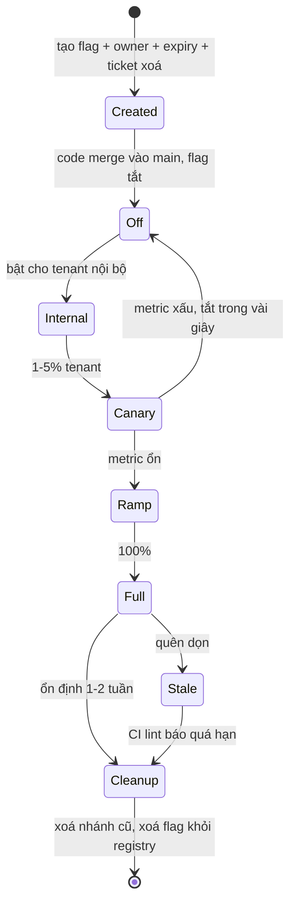
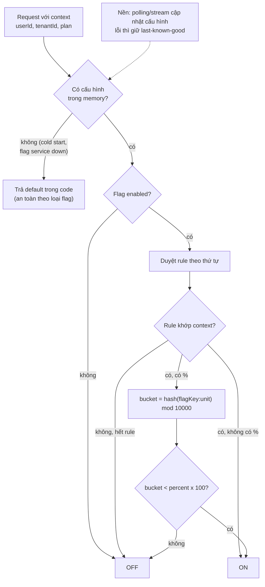

## Bối cảnh & vấn đề

Team đang làm checkout mới theo [trunk-based](/tracks/engineering-practices/learn/branching-strategies): mỗi ngày merge một hai PR nhỏ vào `main`, và `main` được deploy tự động lên production nhiều lần mỗi ngày. Câu hỏi hiển nhiên: nửa checkout mới, chưa xong, chưa test hết, đang nằm trên production. Làm sao người dùng không thấy nó? Và ngày ra mắt, làm sao bật cho 5% khách hàng trước, rồi tắt ngay trong vài giây nếu tỉ lệ thanh toán thất bại tăng?

Câu trả lời là **feature flag** (feature toggle): một điểm rẽ nhánh trong code mà giá trị được quyết định lúc **runtime** từ cấu hình bên ngoài, không phải lúc build. Flag tách hai việc mà trước đây luôn đi cùng nhau: **deploy** (đưa code lên server) và **release** (cho người dùng thấy tính năng). Deploy trở thành việc kỹ thuật thường xuyên, rủi ro thấp; release trở thành quyết định sản phẩm, có thể làm từng phần và đảo ngược.

Nhưng flag không miễn phí. Mỗi flag nhân đôi số trạng thái mà hệ thống có thể ở; flag cũ không ai dọn biến thành nợ; flag service chậm hoặc chết có thể làm hỏng chính những thứ nó được dùng để bảo vệ. Bài này giải thích các loại flag, cách một flag được đánh giá (targeting, % rollout ổn định), cache và kill switch, rồi đi qua các failure mode mà câu hỏi phỏng vấn hay xoáy vào, với code chạy thật.

## Khái niệm

### Deploy vs release

**Deploy** là cài một phiên bản code lên môi trường. **Release** là làm cho người dùng (một nhóm hoặc tất cả) dùng được tính năng. Khi không có flag, hai việc này trùng nhau: code lên server là người dùng thấy. Có flag, bạn deploy code tắt sẵn, rồi release bằng cách đổi cấu hình, theo nhóm, theo phần trăm, và rollback bằng cách tắt flag thay vì deploy lại.

Lợi ích lớn nhất không phải "bật tắt được", mà là **giảm kích thước của mỗi thay đổi rủi ro**: deploy nhỏ, thường xuyên; release tách riêng, có kiểm soát; rollback tính bằng giây.

### Bốn loại toggle

Pete Hodgson phân loại flag theo hai trục: **sống bao lâu** và **đổi động tới mức nào**. Phân loại này quan trọng vì mỗi loại cần quy tắc khác nhau:

- **Release toggle**: giấu tính năng chưa xong hoặc đang rollout. Nên sống **ngắn** (ngày tới vài tuần), phải có owner và ngày hết hạn, xoá ngay khi rollout 100% ổn định.
- **Experiment toggle**: A/B test, chia người dùng vào nhóm ổn định để đo metric. Sống bằng thời gian thí nghiệm; quyết định theo từng request/user với yêu cầu **sticky** (cùng user luôn cùng nhóm).
- **Ops toggle**: điều khiển hành vi vận hành: **kill switch** tắt một tính năng tốn tài nguyên khi quá tải, chuyển sang provider dự phòng, giảm chất lượng (degrade). Một số sống **lâu dài** có chủ đích.
- **Permission toggle**: bật tính năng theo gói/tenant/vai trò (beta program, tính năng enterprise). Thường sống lâu, và lúc đó nó gần với **entitlement** của sản phẩm hơn là flag; nên chuyển sang hệ thống quyền/gói thật khi ổn định.

Ví dụ: `checkout_v2` là release toggle (hết hạn 2026-11-01); `payments_enabled` là ops kill switch (permanent); `pricing_page_variant` là experiment; `sso_saml` cho tenant enterprise là permission toggle.

**Interview angle:** câu "flag ở 100% đã 8 tháng" kiểm tra bạn có phân biệt được release toggle (phải xoá) với ops/permission toggle (có thể sống lâu nhưng phải được khai báo là permanent).

### Flag và trunk-based development

Trunk-based cần một cách để code dở nằm trên `main` mà không ảnh hưởng người dùng. Release toggle là cách phổ biến nhất. Các kỹ thuật bổ trợ:

- **Branch by abstraction**: đặt một interface trước implementation cũ, viết implementation mới phía sau, chuyển dần call site; flag chọn implementation.
- **Dark launch**: code mới chạy song song với dữ liệu thật nhưng kết quả không trả cho người dùng (ví dụ tính giá bằng engine mới, so với engine cũ, log khác biệt).
- **Không nối vào UI/route**: code mới tồn tại nhưng chưa có đường vào. Đơn giản nhất, không cần flag, khi phù hợp.

Flag cũng làm đơn giản hoá hotfix: nếu mọi code chưa release đều sau flag tắt, `main` luôn release được và hotfix chỉ là một PR bình thường lên `main`.

### Đánh giá flag: targeting và % rollout

Một flag có trạng thái tổng (bật/tắt) và danh sách **rule** đánh giá theo **context** (user, tenant, gói, region, version app). Rule đầu tiên khớp quyết định kết quả. Rule phần trăm phải **ổn định** (sticky): cùng một user phải luôn nhận cùng kết quả, nếu không người dùng sẽ thấy UI nhảy qua lại giữa các request.

Cách chuẩn: băm `hash(flagKey + ":" + userId)` thành một số trong khoảng 0–9999 (**bucket**), bật nếu `bucket < percent × 100`. Ba tính chất có được miễn phí: (1) sticky, vì hash xác định; (2) **tăng dần không làm ai bị tắt**: user trong nhóm 5% (bucket < 500) vẫn nằm trong nhóm 20% (bucket < 2000); (3) có flagKey trong hash nên mỗi flag chọn một nhóm user **khác nhau**, tránh việc cùng một nhóm user luôn là "chuột bạch" cho mọi tính năng.

Chọn **đơn vị rollout** đúng: với SaaS multi-tenant, thường bucket theo `tenantId` thay vì `userId`, vì người trong cùng công ty thấy hai giao diện khác nhau sẽ gây nhầm lẫn và ticket support.

### Nơi đánh giá: server, client, edge

Flag có thể được đánh giá ở backend (SDK giữ cấu hình trong memory, cập nhật qua polling hoặc streaming), ở frontend (SDK trình duyệt nhận kết quả đã đánh giá cho user hiện tại) hoặc ở edge. Nguyên tắc: **quyết định có ý nghĩa bảo mật hoặc dữ liệu phải đánh giá ở server**. Flag trên client chỉ quyết định hiển thị; user có thể sửa nó trong DevTools. **OpenFeature** là một chuẩn mở (dự án CNCF) định nghĩa API đánh giá flag trung lập với nhà cung cấp, để code không bị khoá vào một vendor (verify trạng thái dự án).

### Kill switch

**Kill switch** là ops toggle dùng để tắt nhanh một tính năng hoặc phụ thuộc khi có sự cố. Yêu cầu khác với release toggle: nó phải hoạt động **đúng lúc hệ thống đang hỏng**. Điều đó nghĩa là: đánh giá cục bộ (không gọi mạng mỗi request), có trạng thái an toàn khi không lấy được cấu hình, có hiệu lực trong vài giây, không phụ thuộc chính thành phần đang hỏng, ai trực on-call cũng bật được, và được **diễn tập** định kỳ.

### Flag debt

**Flag debt** là chi phí của flag không còn cần nhưng chưa xoá: code có hai nhánh, nhánh cũ không ai test nữa, người đọc không biết nhánh nào đang chạy, và số tổ hợp trạng thái tăng theo 2ⁿ. Cách kiểm soát: mỗi release flag có **owner + ngày hết hạn** ngay khi tạo; một ticket "xoá flag" được tạo cùng lúc với flag; CI cảnh báo/fail khi flag quá hạn.

### Recap

| Loại | Tuổi thọ | Đổi động | Ví dụ | Quy tắc |
|---|---|---|---|---|
| Release | Ngày – tuần | Theo rollout | `checkout_v2` | Owner + expiry, xoá sau 100% |
| Experiment | Tuần | Mỗi request, sticky | `pricing_page_variant` | Chia nhóm ổn định, kết thúc bằng quyết định |
| Ops | Có thể lâu dài | Tức thì | `payments_enabled` | Fail-safe, cục bộ, diễn tập |
| Permission | Lâu dài | Theo tenant/gói | `sso_saml` | Chuyển sang entitlement thật |

## Cơ chế hoạt động

### Vòng đời một release flag



Trạng thái `Stale` là nơi hầu hết flag kết thúc nếu không có cơ chế ép buộc. Đường về `Cleanup` trong sơ đồ không đến từ thiện chí mà đến từ **CI**: linter so registry với ngày hiện tại và fail build. Đường `Canary → Off` là toàn bộ giá trị của flag: rollback không cần deploy.

### Đánh giá một flag trong request



Hai chi tiết thiết kế đáng nói. Thứ nhất, đánh giá xảy ra **trong process** với cấu hình đã có trong memory; không gọi mạng mỗi request, nên flag service chết không làm tăng latency của mọi request. Thứ hai, có **hai tầng dự phòng**: refresh lỗi thì giữ cấu hình cuối cùng lấy được (last-known-good); chưa từng lấy được (process vừa khởi động khi flag service đang chết) thì dùng **default viết trong code**. Default đó phải được chọn theo loại flag, như phần ví dụ cho thấy.

## Ví dụ thực tế

Code TypeScript chạy thật bằng Node 24 (type stripping); output dán nguyên văn.

### 1. Evaluator với targeting và % rollout sticky

```ts
// flags.ts — evaluator tối giản: targeting rule + % rollout sticky + default an toàn khi provider lỗi
import { createHash } from "node:crypto";

type Ctx = { userId: string; tenantId: string; plan?: "free" | "pro" | "enterprise" };
type Rule = { tenantIn?: string[]; planIn?: Ctx["plan"][]; percent?: number };
type Flag = { key: string; kind: "release" | "ops" | "experiment" | "permission"; enabled: boolean; rules: Rule[]; owner: string; expires?: string };

// bucket 0..9999 ổn định theo (flag key, userId): cùng user luôn cùng bucket cho một flag
export function bucket(flagKey: string, userId: string): number {
  const h = createHash("sha256").update(`${flagKey}:${userId}`).digest();
  return h.readUInt32BE(0) % 10_000;
}

export function evaluate(flag: Flag | undefined, ctx: Ctx, fallback: boolean): { on: boolean; reason: string } {
  if (!flag) return { on: fallback, reason: "FLAG_NOT_FOUND→default" };
  if (!flag.enabled) return { on: false, reason: "DISABLED" };
  for (const [i, r] of flag.rules.entries()) {
    if (r.tenantIn && !r.tenantIn.includes(ctx.tenantId)) continue;
    if (r.planIn && !r.planIn.includes(ctx.plan)) continue;
    if (r.percent === undefined) return { on: true, reason: `RULE_${i}_MATCH` };
    const b = bucket(flag.key, ctx.userId);
    return { on: b < r.percent * 100, reason: `RULE_${i}_PERCENT(${r.percent}%, bucket=${b})` };
  }
  return { on: false, reason: "NO_RULE_MATCH" };
}

const checkoutV2: Flag = { key: "checkout_v2", kind: "release", enabled: true, owner: "team-payments", expires: "2026-11-01",
  rules: [{ tenantIn: ["t-internal"] }, { planIn: ["pro", "enterprise"], percent: 5 }] };
// ... phần demo: 3 context, 10.000 user ở 5% và 20%, overlap với flag search_v3, provider down
```

```text
$ node flags.ts
1) targeting
   u-1 t-internal free: { on: true, reason: 'RULE_0_MATCH' }
   u-2 t-blue free: { on: false, reason: 'NO_RULE_MATCH' }
   u-3 t-blue pro: { on: false, reason: 'RULE_1_PERCENT(5%, bucket=9018)' }
2) distribution + stickiness over 10,000 pro users
   5%  → 504 users on; 20% → 1996 users on; of the 5% cohort still on at 20%: 504/504
3) same users first in line for every flag? (hash includes flag key)
   overlap of 5% cohorts checkout_v2 vs search_v3: 23 users (≈ 5% of 500 expected if independent)
4) provider down: flag config unavailable
   release flag, fallback=false : { on: false, reason: 'FLAG_NOT_FOUND→default' }
   kill switch 'payments_enabled', fallback=true : { on: true, reason: 'FLAG_NOT_FOUND→default' }
```

Đọc từng phần: `reason` là thứ bạn muốn log khi debug "tại sao user này thấy giao diện cũ"; 504/10.000 là sát 5%; khi tăng lên 20%, **cả 504** người cũ vẫn bật (không ai bị nhảy về giao diện cũ); hai flag khác nhau chọn hai nhóm gần như độc lập (23 người trùng, đúng kỳ vọng ~25). Phần 4 cho thấy default **phụ thuộc loại flag**: release flag mặc định tắt (tính năng mới không lộ ra khi không chắc), còn `payments_enabled` mặc định **bật** vì flag service chết không được phép tắt thanh toán của toàn bộ khách hàng.

### 2. Cache TTL, last-known-good và độ trễ kill switch

```ts
// client.ts — flag client có cache TTL + last-known-good; đo độ trễ của kill switch
type Snapshot = Record<string, boolean>;
let server: Snapshot = { "recommendations_enabled": true };
let serverUp = true;
const fetchFlags = async (): Promise<Snapshot> => { if (!serverUp) throw new Error("ECONNREFUSED flag-service:443"); return { ...server }; };

class FlagClient {
  private cache: Snapshot | null = null;
  private fetchedAt = -Infinity;
  private ttlMs: number; private defaults: Snapshot; private now: () => number;
  constructor(ttlMs: number, defaults: Snapshot, now: () => number) { this.ttlMs = ttlMs; this.defaults = defaults; this.now = now; }
  async isOn(key: string): Promise<{ on: boolean; source: string }> {
    if (this.now() - this.fetchedAt >= this.ttlMs) {
      try { this.cache = await fetchFlags(); this.fetchedAt = this.now(); }
      catch (e) { if (!this.cache) return { on: this.defaults[key] ?? false, source: `default (${(e as Error).message})` };
                  return { on: this.cache[key], source: "last-known-good (refresh failed)" }; }
    }
    return { on: this.cache![key], source: "cache" };
  }
}
// demo: on-call tắt flag lúc t=1s, đo thời điểm instance thực sự tắt với ttl 60s và 5s; rồi flag service chết
```

```text
$ node client.ts
ttl=60s: kill switch flipped at t=1s, this instance stopped at t=60s
ttl=5s: kill switch flipped at t=1s, this instance stopped at t=5s
t=0   { on: true, source: 'cache' }
t=10s { on: true, source: 'last-known-good (refresh failed)' }
cold start while flag service down: { on: false, source: 'default (ECONNREFUSED flag-service:443)' }
```

Dòng đầu là failure mode "cache flag lâu → kill switch chậm": on-call bấm tắt, nhưng mỗi instance tiếp tục phục vụ tính năng tới **một phút**, đúng lúc mỗi giây đều đắt. TTL ngắn hơn (hoặc SDK streaming đẩy thay đổi) giảm độ trễ đó. Hai dòng sau là hai tầng dự phòng: refresh lỗi thì giữ giá trị cuối cùng; khởi động lạnh lúc flag service chết thì dùng default trong code.

Từ đây ra thiết kế kill switch "đảm bảo chạy khi có sự cố" (followUp của câu failure modes): đánh giá trong process từ cấu hình đã cache; có đường cấu hình **độc lập** với flag service (biến môi trường hoặc file config đọc lại định kỳ, hoặc một hàng trong DB chính) cho các switch quan trọng nhất; độ trễ hiệu lực được đo và ghi trong runbook ("tối đa 5 giây"); trạng thái an toàn được chọn có chủ đích; và diễn tập (game day) bật/tắt thật định kỳ, vì kill switch chưa từng được bấm là kill switch không đáng tin.

### 3. Linter flag debt chạy trong CI

Registry flag là một file trong repo (hoặc export từ flag service), mỗi entry có owner, loại, ngày hết hạn:

```json
[
  { "key": "checkout_v2", "kind": "release", "owner": "team-payments", "expires": "2026-11-01", "rollout": 100, "since100": "2026-02-10" },
  { "key": "search_v3", "kind": "release", "owner": "team-search", "expires": "2026-12-15", "rollout": 20 },
  { "key": "payments_enabled", "kind": "ops", "owner": "team-payments", "permanent": true, "rollout": 100 },
  { "key": "new_invoice_pdf", "kind": "release", "owner": "team-billing", "expires": "2026-08-01", "rollout": 0 }
]
```

```ts
// flag-lint.ts — flag hết hạn, flag 100% quá lâu, flag trong code không có trong registry, flag chết
import { readFileSync, readdirSync } from "node:fs";
import { join } from "node:path";

type Entry = { key: string; kind: string; owner: string; expires?: string; permanent?: boolean; rollout: number; since100?: string };
const [root, today = new Date().toISOString().slice(0, 10)] = process.argv.slice(2);
const registry: Entry[] = JSON.parse(readFileSync(join(root, "flags.json"), "utf8"));
const used = new Map<string, string[]>();
for (const f of readdirSync(join(root, "src"))) {
  const src = readFileSync(join(root, "src", f), "utf8");
  for (const m of src.matchAll(/isOn\("([a-z0-9_]+)"/g)) used.set(m[1], [...(used.get(m[1]) ?? []), f]);
}
const days = (a: string, b: string) => Math.round((Date.parse(b) - Date.parse(a)) / 86_400_000);
let errors = 0;
const report = (level: "error" | "warn", msg: string) => { if (level === "error") errors++; console.log(`${level.padEnd(5)} ${msg}`); };

for (const e of registry) {
  if (!e.permanent && !e.expires) report("error", `${e.key}: release flag cần "expires" (owner ${e.owner})`);
  if (e.expires && e.expires < today) report("error", `${e.key}: hết hạn ${e.expires} (${days(e.expires, today)} ngày trước), owner ${e.owner}`);
  if (e.rollout === 100 && e.since100 && days(e.since100, today) > 30 && !e.permanent)
    report("warn", `${e.key}: đã 100% ${days(e.since100, today)} ngày, xoá nhánh cũ + flag`);
  if (!used.has(e.key)) report("warn", `${e.key}: có trong registry nhưng không còn được dùng trong code`);
}
for (const [k, files] of used) if (!registry.some((e) => e.key === k)) report("error", `${k}: dùng trong ${files.join(", ")} nhưng không có trong registry (typo?)`);
console.log(errors ? `FAIL (${errors} error)` : "PASS");
process.exit(errors ? 1 : 0);
```

```text
$ node flag-lint.ts app 2026-10-01; echo "exit=$?"
warn  checkout_v2: đã 100% 233 ngày, xoá nhánh cũ + flag
error new_invoice_pdf: hết hạn 2026-08-01 (61 ngày trước), owner team-billing
warn  new_invoice_pdf: có trong registry nhưng không còn được dùng trong code
error serch_v3_facets: dùng trong search.ts nhưng không có trong registry (typo?)
FAIL (2 error)
exit=1
```

Dòng đầu chính là followUp "flag ở 100% đã tám tháng": rủi ro là nhánh cũ vẫn nằm trong code, không ai test, và một lần ai đó tắt nhầm flag (hoặc flag service trả default `false`) sẽ đưa toàn bộ người dùng về code 8 tháng tuổi, có thể không còn tương thích với schema hiện tại. Việc cần làm: xác nhận với owner rằng không còn ai cần tắt, xoá nhánh cũ + test của nó trong một PR, rồi xoá flag khỏi registry và flag service (theo thứ tự đó). Dòng cuối là loại lỗi im lặng nhất: tên flag gõ sai, SDK trả default `false`, tính năng "không bao giờ bật" mà không ai biết vì sao.

## Trade-offs & lựa chọn thay thế

| Cách release | Rollback | Chi phí | Hợp với |
|---|---|---|---|
| Không flag, deploy = release | Deploy lại / revert (phút) | Thấp nhất | Thay đổi nhỏ, rủi ro thấp |
| Release toggle | Tắt flag (giây) | Nhánh code + dọn dẹp | Tính năng lớn trong trunk-based |
| Canary deploy (hạ tầng) | Dời traffic về bản cũ | Hạ tầng deploy | Thay đổi toàn bộ binary, không chọn theo user |
| Blue/green | Chuyển lại môi trường | Gấp đôi hạ tầng tạm thời | Đổi phiên bản cả hệ thống |
| Branch dài + merge khi xong | Revert merge lớn | Merge hell, feedback chậm | Hầu như không nên |
| Flag tự viết (DB/config) | Giây–phút | Tự lo cache, audit, UI | Ít flag, nhu cầu đơn giản |
| Flag service (vendor hoặc tự host) | Giây | Phí/vận hành, phụ thuộc mới | Nhiều team, nhiều flag, cần % rollout, audit |

Flag và canary deploy không thay thế nhau. Canary trả lời "binary mới có ổn không" (crash, latency, memory) với một phần traffic; flag trả lời "tính năng mới có ổn không" với một nhóm người dùng chọn theo ý nghĩa sản phẩm (tenant nội bộ, gói pro). Team trưởng thành dùng cả hai.

Khi nào **không** dùng flag: thay đổi nhỏ không có rủi ro hành vi (sửa typo, refactor có test), thay đổi không giấu được sau flag (migration schema phá tương thích, đổi format dữ liệu đã lưu; dùng expand/contract thay vì flag), và khi team chưa có kỷ luật dọn flag: mười flag hết hạn tệ hơn không có flag.

## Edge cases & failure modes

- **Flag debt bùng nổ tổ hợp**: n flag độc lập cho 2ⁿ trạng thái; 10 flag là 1.024 cấu hình, không ai test hết. Test cả hai nhánh của flag mà PR đụng tới; môi trường test dùng cấu hình flag giống production; xoá flag đúng hạn.
- **Default sai khi flag service lỗi**: release flag mặc định `true` sẽ lộ tính năng dở cho mọi người khi service chết; kill switch mặc định `false` sẽ tắt tính năng cốt lõi. Chọn default theo câu hỏi "khi không biết gì, trạng thái nào ít hại hơn" (fail-open vs fail-closed), ghi rõ trong registry.
- **Đánh giá khác nhau giữa FE và BE**: frontend thấy flag bật (cache trình duyệt), backend thấy tắt (đã đổi), user bấm nút mới và nhận 404/403. Giải pháp: backend là nguồn sự thật; frontend nhận kết quả đánh giá từ backend trong cùng response, hoặc API mới phải xử lý được cả hai trạng thái trong giai đoạn chuyển.
- **Tái sử dụng tên flag cũ**: một flag cũ đã "chết" nhưng vẫn còn code đọc nó trên một số server; đặt lại tên đó cho tính năng mới sẽ bật luôn code cũ. Vụ Knight Capital năm 2012 là ca kinh điển được SEC mô tả: một flag được dùng lại, một server không được deploy bản mới vẫn chạy code cũ phía sau flag đó, gây thiệt hại khoảng 460 triệu USD trong khoảng 45 phút (verify con số trong tài liệu SEC). Quy tắc: tên flag không bao giờ dùng lại; xoá code đọc flag trước khi xoá flag.
- **Flag bao migration dữ liệu không đảo ngược**: flag bật đường code mới có ghi dữ liệu theo format mới; tắt flag thì code cũ đọc phải format mới và hỏng. Tắt flag **không** phải rollback trong trường hợp này. Thiết kế tương thích hai chiều (expand/contract) hoặc ghi rõ "flag này là one-way sau bước X".
- **Cache flag lâu**: như ví dụ 2, TTL 60s nghĩa là kill switch có hiệu lực sau tới 60s trên mỗi instance; client mobile có thể cache hàng giờ. Đo và ghi lại độ trễ hiệu lực của mỗi switch quan trọng.
- **Flag service trên đường nóng**: gọi mạng tới flag service cho mỗi request khiến latency và availability của bạn phụ thuộc vào nó. Đánh giá local từ cấu hình đã đồng bộ.
- **% rollout theo user trong sản phẩm theo tenant**: hai người cùng công ty thấy hai giao diện khác nhau, báo bug cho nhau. Bucket theo tenant.
- **Sticky bị phá khi đổi đơn vị hoặc đổi hash**: đổi từ `userId` sang `tenantId`, hoặc đổi flagKey, làm mọi người được chia lại nhóm; experiment mất tính hợp lệ, user bị nhảy giao diện.
- **Flag thành công cụ phân quyền trá hình**: "bật tính năng X cho tenant A" qua flag lâu năm, không audit, không ai biết tenant nào có gì. Chuyển sang entitlement/permission thật khi ổn định.

## Pitfalls

- ❌ Tạo flag không owner, không ngày hết hạn → ✅ owner + expiry + ticket xoá ngay khi tạo; CI lint như ví dụ 3.
- ❌ Để release flag ở 100% hàng tháng → ✅ ổn định 1–2 tuần rồi xoá nhánh cũ; flag sống lâu phải khai báo `permanent` với loại ops/permission.
- ❌ Mọi flag mặc định `false` khi service lỗi → ✅ default theo loại: release tắt, kill switch của tính năng cốt lõi giữ trạng thái an toàn cho business.
- ❌ Gọi flag service qua mạng trong mỗi request → ✅ đánh giá trong process, đồng bộ nền, last-known-good.
- ❌ Dùng flag frontend để chặn truy cập dữ liệu → ✅ quyết định bảo mật luôn ở server.
- ❌ Dùng lại tên flag cũ → ✅ tên mới mỗi lần; xoá code đọc flag trước khi xoá flag.
- ❌ Nghĩ "tắt flag = rollback" cho mọi thay đổi → ✅ thay đổi dữ liệu cần expand/contract; ghi rõ flag one-way.
- ❌ Kill switch chưa từng được bấm → ✅ diễn tập, đo độ trễ hiệu lực, ghi vào runbook.

## Tóm tắt

- Flag tách **deploy** (kỹ thuật, thường xuyên) khỏi **release** (sản phẩm, từng phần, đảo ngược được trong giây).
- Bốn loại: **release** (ngắn, phải xoá), **experiment** (sticky, theo thời gian thí nghiệm), **ops/kill switch** (có thể lâu dài, phải fail-safe), **permission** (lâu dài, nên thành entitlement).
- % rollout ổn định bằng `hash(flagKey:unit) mod 10000`: sticky, tăng dần không tắt ai, mỗi flag một nhóm khác nhau; SaaS thường bucket theo tenant.
- Đánh giá trong process + last-known-good + default trong code chọn theo loại flag; quyết định bảo mật ở server.
- Kill switch: cục bộ, độc lập với thành phần đang hỏng, độ trễ hiệu lực được đo (TTL 60s = tới 60s chậm), diễn tập định kỳ.
- Failure mode: flag debt (2ⁿ trạng thái), default sai, FE/BE lệch, tái sử dụng tên, flag bao migration one-way, cache lâu.
- Kiểm soát flag debt bằng owner + expiry + CI lint, không bằng thiện chí.
