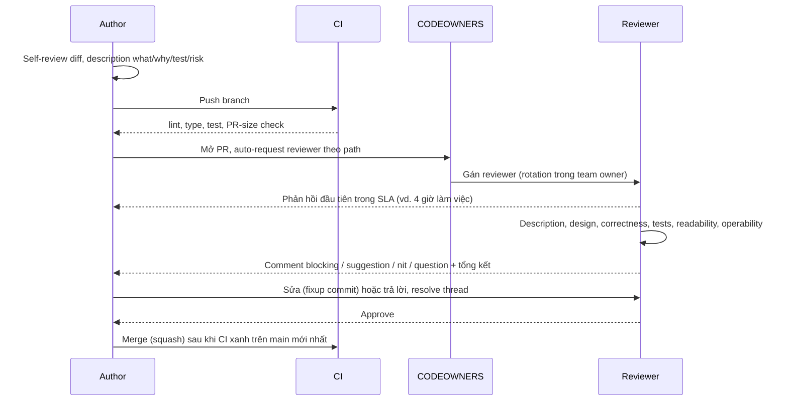
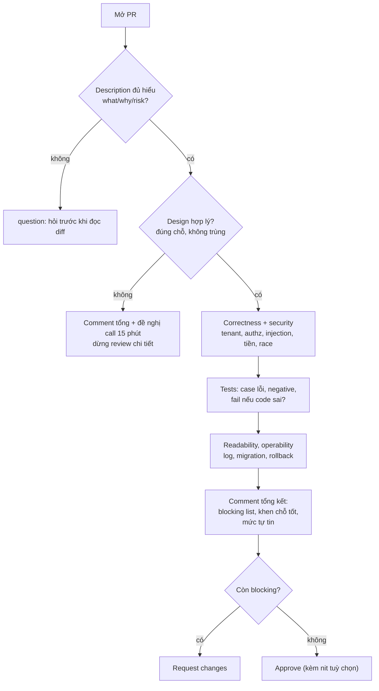

## Bối cảnh & vấn đề

Một PR (minh hoạ): tiêu đề "Address feature", description trống, 1.540 dòng thay đổi trong 38 file, kèm lời nhắn trên chat "please review ASAP, cần merge hôm nay". Reviewer mở ra, thấy migration, API, UI, refactor một helper dùng chung, và 900 dòng type được generate. Sau 20 phút, anh ấy để lại 6 comment về đặt tên và dấu chấm phẩy rồi approve, vì không có cách nào hiểu hết trong thời gian có. Hai tuần sau, một bug cross-tenant nằm đúng trong file thứ 23 của PR đó lên production.

Cùng team, chiều ngược lại: PR nhỏ, tốt, nhưng phải đợi trung bình **ba ngày** mới được review lần đầu. Dev chuyển sang việc khác, quay lại thì quên context, PR conflict với `main`, và họ bắt đầu gom nhiều thay đổi vào một PR "cho đỡ phải chờ nhiều lần", làm PR càng to và càng chờ lâu.

Hai câu chuyện là hai mặt của một hệ thống: **kích thước PR, chất lượng description, cách review và tốc độ review** ảnh hưởng lẫn nhau. Bài này đi qua từng phần: code review để làm gì, PR tốt trông thế nào, review theo thứ tự nào, cách viết comment phân mức độ trên một diff thật (chạy được, để chứng minh mỗi comment blocking), và cách chẩn đoán + sửa review chậm bằng dữ liệu. Phần giọng điệu, bất đồng và review PR của người senior hơn nằm ở [bài 6](/tracks/engineering-practices/learn/review-feedback-disagreement).

## Khái niệm

### Code review để làm gì

Mục tiêu của review không phải "bắt mọi bug" (test và tool làm việc đó tốt hơn) và càng không phải gatekeeping. Theo hướng dẫn của Google, tiêu chuẩn là: approve khi thay đổi **làm sức khoẻ tổng thể của codebase tốt lên**, dù chưa hoàn hảo; không có "code hoàn hảo", chỉ có code tốt hơn. Review có bốn giá trị thực tế:

1. **Giảm rủi ro**: người thứ hai thấy lỗi thiết kế, lỗ hổng bảo mật, edge case mà tác giả quen mắt bỏ qua.
2. **Chia sẻ kiến thức**: ít nhất hai người hiểu mỗi thay đổi, giảm "bus factor".
3. **Nhất quán**: codebase giữ được pattern chung, người mới học qua review.
4. **Truy vết**: PR + description là tài liệu "tại sao" gắn với từng dòng code, đọc lại được qua `git blame`.

Hệ quả: nếu review không còn tạo ra bốn thứ này (approve trong 2 phút cho PR 1.500 dòng), nó chỉ còn là nghi thức làm chậm.

### PR nhỏ

**PR nhỏ** là đòn bẩy lớn nhất. Hướng dẫn của Google ước lượng khoảng 100 dòng là kích thước hợp lý, 1.000 dòng thường là quá lớn (verify con số trong tài liệu gốc); nhiều team đặt ngưỡng mềm 200–400 dòng **logic** (không tính lockfile, code generate, snapshot). PR nhỏ được review nhanh hơn, kỹ hơn, ít conflict hơn, dễ revert hơn và bisect chính xác hơn.

"Nhỏ" nghĩa là **một mục đích**, không chỉ ít dòng. Một PR đổi tên 300 file một cách cơ học là "to nhưng dễ", có thể chấp nhận nếu tách riêng và nói rõ. Một PR 150 dòng vừa refactor helper chung vừa thêm tính năng là "nhỏ nhưng khó", nên tách thành hai.

Cách tách một feature "không ship từng phần được" (followUp của câu PR description): (1) tách refactor chuẩn bị ra trước ("make the change easy, then make the easy change"); (2) chia theo lớp có thể merge độc lập mà không ai dùng: migration expand → API sau flag → UI sau flag → bật flag; (3) **stacked PR**: chuỗi PR phụ thuộc nhau, mỗi cái review riêng; (4) branch by abstraction. Khả năng tách luôn tồn tại; cái thường thiếu là thói quen thiết kế để tách.

### PR description

Description tốt cho reviewer **bản đồ** trước khi đọc diff. Năm phần:

- **What**: thay đổi gì, 1–3 câu, link ticket.
- **Why**: vấn đề, động lực, quyết định thiết kế chính và phương án đã loại ("dùng outbox thay vì gọi Kafka trực tiếp vì...").
- **How tested**: test đã thêm, bước kiểm tay, screenshot/video cho UI.
- **Risk & rollout**: migration, flag, backward compatibility, cách rollback.
- **Reviewer guide**: đọc file nào trước, chỗ nào muốn được soi kỹ, chỗ nào là code cơ học.

Description không chỉ cho reviewer: sáu tháng sau, người debug sẽ tìm tới PR này từ `git blame`, và "why" là thứ duy nhất code không tự nói được.

### Self-review

Trước khi bấm "request review", tác giả đọc lại diff của chính mình trên giao diện PR (khác với đọc trong editor), chạy CI xanh, xoá code debug, và để lại comment chú thích ở chỗ khó hiểu. Self-review bắt được một phần lớn lỗi vặt, để reviewer dành thời gian cho phần có giá trị. Quy tắc: **CI đỏ thì chưa nhờ review**.

### Thứ tự review: từ tác động lớn tới nhỏ

Review theo thứ tự **tác động giảm dần**, vì một vấn đề ở tầng trên làm các comment ở tầng dưới vô nghĩa (không cần góp ý đặt tên cho một hàm sẽ bị xoá vì thiết kế sai):

1. **Design**: thay đổi này có nên tồn tại? Đặt đúng chỗ? Phù hợp kiến trúc, không trùng thứ đã có?
2. **Correctness**: logic, edge case (null, rỗng, âm, timezone, tiền), concurrency (race, idempotency, retry), error handling, **security** (authz, tenant isolation, injection, secret, PII trong log).
3. **Tests**: test hành vi mới và case lỗi; assertion có ý nghĩa; test có fail nếu code sai không?
4. **Readability**: tên, độ phức tạp, comment giải thích "why".
5. **Operability**: log/metric, migration an toàn, backward compatibility, cấu hình, rollback.
6. **Style**: để linter và formatter lo; con người không nên tốn comment cho dấu chấm phẩy.

**Interview angle:** câu trả lời mid-level liệt kê style và naming; câu trả lời senior bắt đầu từ design và security, nói rõ thứ gì để tool lo, và gắn mức độ cho mỗi comment.

### Comment có mức độ

Mỗi comment nói rõ nó **chặn merge** hay không. Quy ước phổ biến: `blocking:` (phải sửa trước merge: bug, bảo mật, mất dữ liệu), `suggestion:` (nên làm, tác giả quyết), `nit:` (chi tiết nhỏ, không chặn), `question:` (cần hiểu thêm, có thể thành blocking). Không gắn nhãn thì mọi comment trông như bắt buộc, và tác giả mất thời gian tranh luận chuyện không quan trọng. Chi tiết về giọng điệu và Conventional Comments ở [bài 6](/tracks/engineering-practices/learn/review-feedback-disagreement).

### Review một vùng code bạn không quen

(FollowUp của câu thứ tự review.) Bắt đầu từ description và test (test cho biết hành vi mong đợi), đọc interface/contract trước implementation, hỏi tác giả 10 phút walk-through nếu PR quan trọng, tập trung vào thứ bạn đánh giá được (failure mode, bảo mật, khả năng vận hành, độ dễ hiểu với người ngoài), mời code owner của vùng đó, và **nói rõ mức tự tin** trong comment tổng kết ("mình review kỹ phần API và test; phần tính phí nên có @owner xem").

### Tốc độ review

Google khuyến nghị phản hồi review **trong vòng tối đa một ngày làm việc**, lý tưởng là ngay khi xong việc đang làm dở (verify). Lý do: thời gian chờ review không chỉ làm chậm một PR, nó khiến tác giả chuyển ngữ cảnh, PR conflict, và tạo động lực gom PR to. Phản hồi đầu tiên nhanh quan trọng hơn approve nhanh: một comment "mình sẽ xem kỹ chiều nay, câu hỏi trước: X" đã gỡ được blocker.

### CODEOWNERS

File `CODEOWNERS` gán người/team chịu trách nhiệm cho từng đường dẫn; nền tảng tự request review từ owner và có thể bắt buộc owner approve. Dùng để đảm bảo vùng rủi ro (auth, billing, migration) luôn có người có context review, và để **phân tải** review theo team thay vì dồn vào một người.

## Cơ chế hoạt động

### Vòng đời một PR



Hai điểm trong sơ đồ hay bị bỏ qua. CI chạy **trước** khi người review nhìn vào: thời gian của người đắt hơn thời gian của máy. Và tác giả sửa bằng commit mới (`--fixup`), không force push đè lên, để reviewer xem được "đã sửa gì" giữa hai vòng; dọn lịch sử để lúc merge ([bài 1](/tracks/engineering-practices/learn/git-history-merge-rebase)).

### Reviewer đi qua một PR



Nhánh `CALL` là kỷ luật quan trọng nhất: khi thiết kế có vấn đề lớn, đừng để lại 40 comment chi tiết trên code có thể sẽ bị viết lại. Một comment tổng nêu vấn đề thiết kế và đề nghị nói chuyện trực tiếp tiết kiệm thời gian của cả hai.

## Ví dụ thực tế

### 1. Mẫu PR description

```markdown
## What
Thêm API quản lý địa chỉ giao hàng (CRUD + default address) cho checkout. Ticket: ADDR-12.

## Why
Checkout hiện bắt nhập lại địa chỉ mỗi lần (drop-off 18% ở bước này theo dashboard funnel).
Lưu địa chỉ theo (tenant_id, user_id); default address là cột boolean + partial unique index
thay vì bảng riêng, vì mỗi user chỉ có một default và query luôn đi kèm user.
Đã cân nhắc lưu trong profile JSON: loại vì cần validate và index theo tenant.

## How tested
- Unit: validate địa chỉ, đổi default (đảm bảo luôn đúng 1 default).
- Integration: CRUD qua API; **cross-tenant**: user tenant A đọc/sửa địa chỉ tenant B → 404.
- Tay: tạo 3 địa chỉ, đổi default, xoá default → địa chỉ mới nhất thành default.

## Risk & rollout
- Migration expand-only (bảng mới + index CONCURRENTLY), không đụng bảng cũ.
- UI sau flag `address_v2` (tắt mặc định). Rollback: tắt flag; bảng mới không ai đọc.

## Reviewer guide
Đọc `address.service.ts` trước (logic default), rồi test cross-tenant.
`src/gen/api-types.ts` là code generate, bỏ qua.
```

### 2. Review diff của câu hỏi debug, chứng minh từng comment bằng cách chạy nó

Diff trong PR:

```ts
// TODO: temporary, remove after demo
const DISCOUNT_RATE = 0.15;

export async function applyDiscount(orderId) {
  const order = await db.query(`SELECT * FROM orders WHERE id = ${orderId}`);
  order.total = order.total - order.total * DISCOUNT_RATE;
  await db.query(`UPDATE orders SET total = ${order.total} WHERE id = ${orderId}`);
  return order
}
```

Thay vì tranh luận lý thuyết, reviewer có thể chạy đúng logic đó (chuyển sang `node:sqlite` đồng bộ cho gọn) trên ba đơn hàng thuộc hai tenant, rồi chạy bản sửa:

```ts
// discount.ts — bản "before" giống diff + bản sửa, trên SQLite in-memory (Node 24)
import { DatabaseSync } from "node:sqlite";

const db = new DatabaseSync(":memory:");
db.exec(`CREATE TABLE orders (id INTEGER PRIMARY KEY, tenant_id TEXT NOT NULL, total REAL, total_cents INTEGER, discount_applied INTEGER NOT NULL DEFAULT 0);
         INSERT INTO orders VALUES (1, 't-blue', 19.99, 1999, 0), (2, 't-red', 250.00, 25000, 0), (3, 't-blue', 0.30, 30, 0);`);

const DISCOUNT_RATE = 0.15;
function applyDiscountBefore(orderId: string) {
  const order = db.prepare(`SELECT * FROM orders WHERE id = ${orderId}`).get() as { total: number };
  order.total = order.total - order.total * DISCOUNT_RATE;
  db.exec(`UPDATE orders SET total = ${order.total} WHERE id = ${orderId}`);
  return order;
}
console.log("1) float money:", applyDiscountBefore("1").total);
console.log("2) retry/double click:", applyDiscountBefore("1").total, "(discount applied twice)");
applyDiscountBefore("2 OR 1=1");
console.log("3) orderId = '2 OR 1=1' →", db.prepare("SELECT id, tenant_id, total FROM orders").all()
  .map((r) => `${r.id}/${r.tenant_id}=${r.total}`).join("  "));

// after: parameterized, integer cents (làm tròn half-up), tenant-scoped, idempotent, một câu UPDATE atomic
db.exec("UPDATE orders SET total_cents = 1999, discount_applied = 0 WHERE id = 1");
const RATE_BPS = 1500n; // 15.00% dạng basis points, lấy từ pricing rule/config
function applyDiscount(tenantId: string, orderId: number): { applied: boolean; totalCents?: number } {
  if (!Number.isSafeInteger(orderId)) throw new TypeError("orderId must be an integer");
  const row = db.prepare(
    `UPDATE orders
        SET total_cents = total_cents - (total_cents * ? + 5000) / 10000, discount_applied = 1
      WHERE id = ? AND tenant_id = ? AND discount_applied = 0
  RETURNING total_cents`).get(RATE_BPS, orderId, tenantId) as { total_cents: number } | undefined;
  return row ? { applied: true, totalCents: row.total_cents } : { applied: false };
}
console.log("4) after, first call :", applyDiscount("t-blue", 1));
console.log("5) after, retry      :", applyDiscount("t-blue", 1));
console.log("6) after, other tenant:", applyDiscount("t-blue", 2));
try { applyDiscount("t-blue", "2 OR 1=1" as unknown as number); } catch (e) { console.log("7) after, injection  :", (e as Error).message); }
console.log("8) small order 30 cents:", applyDiscount("t-blue", 3));
```

```text
$ node discount.ts
1) float money: 16.9915
2) retry/double click: 14.442775 (discount applied twice)
3) orderId = '2 OR 1=1' → 1/t-blue=12.27635875  2/t-red=12.27635875  3/t-blue=12.27635875
4) after, first call : { applied: true, totalCents: 1699 }
5) after, retry      : { applied: false }
6) after, other tenant: { applied: false }
7) after, injection  : orderId must be an integer
8) small order 30 cents: { applied: true, totalCents: 25 }
```

Dòng 3 đáng sợ nhất: một `orderId` độc hại ghi đè `total` của **mọi đơn hàng, của mọi tenant**, bằng cùng một giá trị. Từ output, comment review viết ra gần như tự động:

```text
blocking (security): SQL được nối chuỗi với orderId → injection. Với orderId = "2 OR 1=1",
  UPDATE ghi đè total của toàn bộ bảng orders, mọi tenant (đã chạy thử, output đính kèm).
  Dùng parameterized query và validate orderId là integer.
blocking (security): không kiểm tenant/quyền. User tenant A gọi được với order của tenant B.
  Thêm tenant_id vào WHERE (và check quyền áp discount ở layer trên).
blocking (correctness): tiền dạng float → 16.9915. Lưu và tính bằng integer minor units
  (cents) hoặc numeric; quy tắc làm tròn phải được thống nhất với nghiệp vụ.
blocking (correctness): read-modify-write không atomic, không idempotent. Retry hoặc double
  click áp discount 2 lần (19.99 → 14.44). Dùng một câu UPDATE có điều kiện
  `discount_applied = 0`, hoặc transaction + lock, kèm idempotency key nếu gọi qua API.
blocking (tests): chưa có test. Cần: áp một lần, retry không áp lại, cross-tenant, input xấu.
question: "TODO: temporary, remove after demo" — ticket nào theo dõi việc gỡ? Có cần lên main
  không, hay để sau flag `demo_discount` tắt mặc định?
suggestion: DISCOUNT_RATE hard-code → lấy từ pricing rule/config để đổi không cần deploy.
nit: SELECT * → chỉ lấy cột cần; thiếu type cho orderId; thiếu `;` (để formatter lo).

Tổng kết: hướng đi ổn (một hàm áp discount theo order), nhưng có 5 điểm blocking, trong đó
2 điểm bảo mật. Mình đính kèm script chạy thử và bản sửa gợi ý; sẵn sàng pair 20 phút.
```

Comment tổng kết làm ba việc: phân biệt rõ cái chặn và cái không, đưa **bằng chứng** thay vì ý kiến, và đề nghị giúp. Với followUp "it's just for the demo tomorrow": demo không phải lý do để đưa SQL injection lên `main`, vì code "tạm" lên `main` sẽ lên production. Đề xuất: giữ bản demo trên branch riêng deploy vào môi trường demo, hoặc merge sau flag tắt mặc định **sau khi** sửa hai lỗi bảo mật (mất 15 phút với bản sửa ở trên); các điểm còn lại tạo ticket.

### 3. Đo kích thước PR "cần review" trong CI

```ts
// pr-size.ts — số dòng "cần review" của PR: bỏ lockfile/generated, tách test. Usage: node pr-size.ts <repo> <base>
import { execFileSync } from "node:child_process";
const [repo, base = "origin/main"] = process.argv.slice(2);
const IGNORE = [/(^|\/)package-lock\.json$/, /(^|\/)pnpm-lock\.yaml$/, /\/gen\//, /\.snap$/];
const out = execFileSync("git", ["-C", repo, "diff", "--numstat", `${base}...HEAD`], { encoding: "utf8" });
let logic = 0, tests = 0, ignored = 0;
for (const line of out.trim().split("\n")) {
  const [add, del, file] = line.split("\t");
  const n = Number(add) + Number(del);
  if (IGNORE.some((r) => r.test(file))) ignored += n;
  else if (/\.test\.|__tests__|^test\//.test(file)) tests += n;
  else logic += n;
}
console.log(`logic ${logic}  tests ${tests}  ignored (lock/generated) ${ignored}  raw ${logic + tests + ignored}`);
if (logic > 400) { console.log("FAIL: > 400 logic lines; split the PR or add a review guide"); process.exit(1); }
console.log(logic > 200 ? "WARN: 200-400 logic lines; consider splitting" : "OK");
```

```text
$ node pr-size.ts size/repo main; echo "exit=$?"
logic 180  tests 140  ignored (lock/generated) 3301  raw 3621
OK
exit=0
```

Con số "raw 3621" là thứ giao diện PR hiển thị và làm reviewer hoảng; con số có ý nghĩa là **180 dòng logic + 140 dòng test**. Đo đúng thứ cần đo tránh hai lỗi: chặn nhầm PR cập nhật lockfile, và bỏ lọt PR 600 dòng logic bị "pha loãng" bởi test.

### 4. Chẩn đoán "review mất ba ngày" bằng dữ liệu

Dữ liệu mô phỏng (PRNG có seed) của một team 5 reviewer, trước và sau khi áp dụng: giới hạn PR size, SLA phản hồi đầu tiên 4 giờ làm việc, rotation reviewer qua CODEOWNERS. Mục đích là minh hoạ **cách đọc**, không phải số liệu ngành.

```text
$ node review-latency.ts
== before: 160 PRs, median open→merge 58 h, median wait for first review 40 h
   0-199    n= 22  first review  21 h  rounds 2
   200-399  n= 33  first review  35 h  rounds 2
   400-699  n= 66  first review  39 h  rounds 2
   700-+    n= 39  first review  52 h  rounds 3
   top reviewer lan did 66% of reviews; wait split: waiting 72% of total time
== after: 160 PRs, median open→merge 19 h, median wait for first review 10 h
   0-199    n= 57  first review   8 h  rounds 1
   200-399  n=103  first review  11 h  rounds 1
   top reviewer huy did 22% of reviews; wait split: waiting 50% of total time
```

Ba phát hiện từ "before" dẫn thẳng tới ba biện pháp: (1) **72% thời gian là chờ**, không phải sửa: vấn đề nằm ở hàng đợi, không ở chất lượng code → SLA phản hồi đầu tiên + slot review cố định mỗi ngày; (2) **một người làm 66% review**: bottleneck vì chỉ người đó có context → CODEOWNERS theo team + rotation + pair review để lan context; (3) PR càng to càng chờ lâu và càng nhiều vòng → giới hạn size, stacked PR. Sau vài sprint, đo lại cùng các chỉ số. Chú ý rằng thời gian chờ vẫn là 50% sau cải thiện: mục tiêu không phải về 0, mà là không để nó chiếm phần lớn.

Cân bằng tốc độ và độ sâu (followUp): **độ sâu theo rủi ro**, không theo thói quen. PR đổi copy UI: một reviewer, vài phút. PR đụng auth, billing, migration, tenant isolation: CODEOWNERS bắt buộc, hai reviewer, có thể walk-through. Phản hồi đầu tiên luôn nhanh; approve thì nhanh tuỳ rủi ro.

## Trade-offs & lựa chọn thay thế

| Cách đảm bảo chất lượng | Ưu điểm | Nhược điểm | Hợp với |
|---|---|---|---|
| PR review async | Có trace, linh hoạt timezone | Chờ đợi, comment dễ hiểu lầm | Mặc định cho hầu hết team |
| Pair/mob programming | Review liên tục, chia sẻ kiến thức mạnh | Tốn 2 người, mệt, khó khác timezone | Thay đổi phức tạp, onboarding |
| Review sau merge (ship/show/ask) | Không chặn flow | Lỗi đã lên main | Thay đổi rủi ro thấp, team tin nhau, có flag |
| Walk-through đồng bộ | Hiểu nhanh PR lớn | Tốn lịch, ít trace | PR lớn không tách được, thay đổi kiến trúc |
| Tool tự động (lint, SAST, type) | Nhanh, nhất quán | Chỉ bắt lỗi có pattern | Luôn bật, giải phóng người review khỏi style |

Không có cách duy nhất. Mô hình "Ship / Show / Ask" (Rouan Wilsenach, trên martinfowler.com) gợi ý: thay đổi rất nhỏ và an toàn thì *ship* (merge thẳng, có CI), thay đổi muốn chia sẻ thì *show* (merge rồi mở PR để mọi người xem), thay đổi cần ý kiến thì *ask* (PR chờ review). Chọn theo rủi ro, và luôn để tool làm phần máy làm được.

Về số reviewer: một reviewer có context tốt hơn ba reviewer approve vì phép lịch sự. Bắt buộc hai reviewer chỉ cho vùng rủi ro cao; áp cho mọi PR thì tăng thời gian chờ mà không tăng chất lượng tương ứng.

## Edge cases & failure modes

- **Rubber-stamp approve**: PR to + áp lực thời gian → approve không đọc. Dấu hiệu: approve trong vài phút cho PR hàng trăm dòng, không comment nào. Biện pháp: giới hạn size, đo "review min / 100 LOC", và văn hoá "approve nghĩa là bạn cùng chịu trách nhiệm".
- **Bikeshedding**: 30 comment về đặt tên, 0 comment về race condition. Tool lo style; reviewer bắt đầu từ design/correctness.
- **Review vô tận**: mỗi vòng reviewer tìm thêm thứ mới, PR sống 2 tuần. Quy tắc: vòng sau chỉ xét thay đổi mới và blocking cũ; ý tưởng mới không chặn thì tạo ticket.
- **Scope creep do review**: "tiện thể sửa luôn X" làm PR phình. Tác giả có quyền nói "để PR sau", và reviewer nên chấp nhận nếu không phải blocking.
- **Approve rồi tác giả push thêm thay đổi lớn**: bật "dismiss stale approvals" khi có commit mới (tuỳ nền tảng), hoặc quy ước re-request review.
- **CI xanh nhưng test không kiểm gì**: test gọi hàm mà không assert, hoặc mock luôn thứ đang test. Reviewer thử hỏi "nếu tôi xoá dòng X, test nào fail?".
- **Reviewer duy nhất có context nghỉ phép**: hàng đợi dừng hẳn. CODEOWNERS theo team, không theo cá nhân; rotation để lan context.
- **PR từ người ngoài team trên vùng của bạn**: chuẩn và quy ước có thể khác. CONTRIBUTING + template + checklist giúp cả hai bên.
- **Review khác timezone**: một vòng hỏi đáp tốn một ngày. Description đầy đủ, comment tự đủ ngữ cảnh, và gom câu hỏi trong một lần review thay vì nhỏ giọt.

## Pitfalls

- ❌ PR 1.500 dòng, description trống, "please review ASAP" → ✅ PR một mục đích, description what/why/how tested/risk/reviewer guide.
- ❌ Bắt đầu review từ style và naming → ✅ design → correctness/security → tests → readability → operability; style để linter.
- ❌ Comment không có mức độ → ✅ `blocking:`, `suggestion:`, `nit:`, `question:`, và một comment tổng kết.
- ❌ Tranh luận lý thuyết về bug → ✅ chạy thử, đưa output (như ví dụ 2) hoặc test fail.
- ❌ Approve PR mình không hiểu vì người viết senior → ✅ hỏi; nói rõ phần nào mình review được, mời owner phần còn lại.
- ❌ Coi review là việc làm khi rảnh → ✅ SLA phản hồi đầu tiên, slot review cố định, review được tính là công việc.
- ❌ Một người review mọi thứ → ✅ CODEOWNERS theo team + rotation; đo phân bố review.
- ❌ Bắt buộc 2 reviewer cho mọi PR → ✅ độ sâu theo rủi ro.

## Tóm tắt

- Review để giảm rủi ro, chia sẻ kiến thức, giữ nhất quán và để lại "why"; approve khi thay đổi làm codebase tốt lên, không đòi hoàn hảo.
- PR nhỏ, **một mục đích** (khoảng 100–400 dòng logic); tách bằng refactor trước, expand → API sau flag → UI, stacked PR.
- Description: what, why (kèm phương án đã loại), how tested, risk & rollout, reviewer guide. Self-review và CI xanh trước khi nhờ review.
- Thứ tự review: design → correctness/security → tests → readability → operability → style (tool).
- Comment có nhãn mức độ; với bug, đưa bằng chứng chạy được; một comment tổng kết có mức tự tin.
- Review chậm: đo chờ vs sửa, phân bố reviewer, theo PR size; sửa bằng SLA phản hồi đầu, CODEOWNERS + rotation, giới hạn size; đo lại.
- Độ sâu review theo rủi ro: vùng auth/billing/migration/tenant cần owner và có thể hai reviewer.
