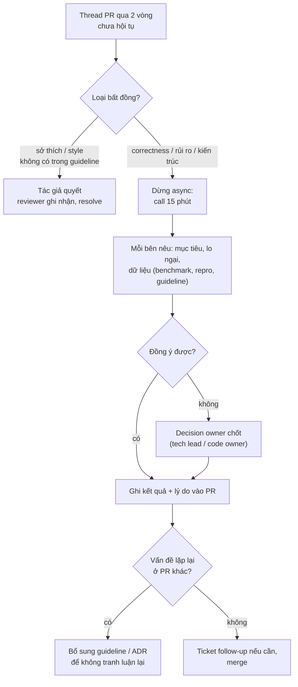
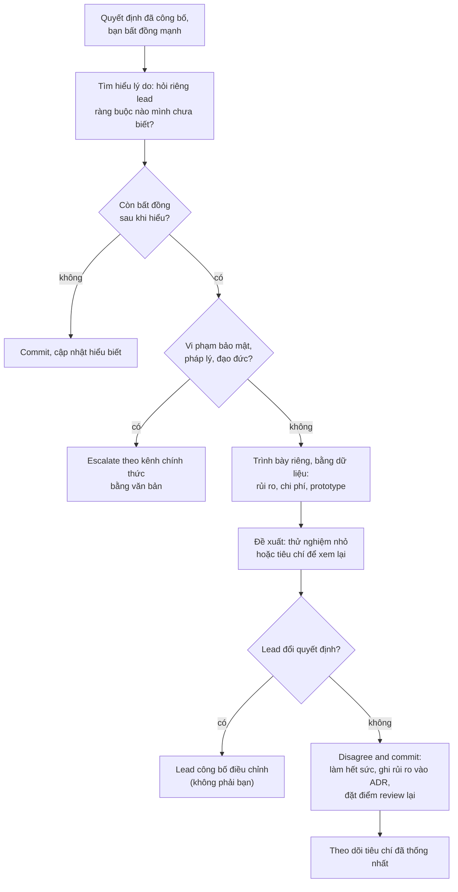

## Bối cảnh & vấn đề

Ba đoạn chat có thật kiểu này xảy ra ở hầu hết team (minh hoạ):

- Một PR có thread 15 comment giữa reviewer và tác giả về việc "có nên tách retry policy ra module chung không". Hai người đều đúng một phần, không ai nhường, PR treo 4 ngày, và cả hai bắt đầu trả lời cộc lốc hơn sau mỗi vòng.
- Một senior trong team để lại review kiểu "Why would you do it this way? This is obviously wrong." Kỹ thuật thì ông ấy thường đúng. Nhưng ba bạn junior bắt đầu gom PR lại, mở vào chiều thứ Sáu khi ông nghỉ, hoặc nhờ người khác review.
- Tech lead công bố trong buổi họp: "Chúng ta sẽ chuyển sang microservices cho module thanh toán quý tới." Bạn tin đây là sai lầm: team 6 người, chưa có observability, và vấn đề thật là một query chậm.

Cả ba không phải là vấn đề kỹ thuật thuần tuý. Chúng là vấn đề về **cách đưa thông tin kỹ thuật tới người khác** sao cho được tiếp nhận, và **cách ra quyết định** khi những người giỏi bất đồng. Ở level senior, interviewer hỏi những câu này để đo một thứ: bạn có biến bất đồng thành quyết định tốt hơn, hay biến nó thành xung đột kéo dài?

Bài này đưa ra công cụ cụ thể cho từng tình huống: quy ước comment có mức độ (Conventional Comments), cách viết lại một comment gay gắt, một "thang leo" để gỡ thread kéo dài, cách review PR của người senior hơn, và quy trình disagree-and-commit. Phần nền về thứ tự review và PR tốt nằm ở [bài 5](/tracks/engineering-practices/learn/pull-requests-code-review).

## Khái niệm

### Nói về code, không nói về người

Comment review mô tả **hành vi của code** và **hệ quả**, không mô tả người viết. "Hàm này có thể bị race khi hai request cùng trừ tồn kho" là thông tin; "bạn viết sai rồi" là phán xét. Câu đầu mời tác giả cùng giải quyết vấn đề; câu sau khiến họ phòng thủ, và người phòng thủ không còn nghe nội dung. Hai mẫu câu dễ dùng: "Code này làm X khi Y" và "Mình lo là Z; có lý do gì để không làm W không?".

Các từ cần tránh vì chúng nhắm vào người hoặc hạ thấp: "obviously", "just" ("just use a transaction" ngụ ý điều đó hiển nhiên và người viết kém vì không thấy), "you always/never", "why would you". Các từ này không thêm thông tin kỹ thuật nào.

### Conventional Comments: nhãn và mức độ

**Conventional Comments** là quy ước bắt đầu mỗi comment bằng một **nhãn** và tuỳ chọn **decoration**: `label (decorations): subject`. Nhãn phổ biến: `praise`, `nitpick`, `suggestion`, `issue`, `todo`, `question`, `thought`, `chore`, `note`; decoration: `(blocking)`, `(non-blocking)`, `(if-minor)`. Ví dụ: `issue (blocking): hai request đồng thời có thể cùng đọc stock=1...`, `nitpick: đổi tên thành tenantScopedQuery`.

Lợi ích không phải hình thức. Nhãn trả lời trước câu hỏi mà tác giả nào cũng thầm hỏi: "cái này có chặn merge không, hay chỉ là ý kiến?". Không có nhãn, tác giả hoặc coi mọi thứ là bắt buộc (mất thời gian vì nit), hoặc coi mọi thứ là tuỳ chọn (bỏ qua blocking). Và `praise:` có mặt trong danh sách nhãn để nhắc rằng khen chỗ làm tốt là một phần của review, không phải xã giao: nó cho tác giả biết pattern nào nên lặp lại.

### Hỏi thay vì phán khi không chắc

Khi bạn nghi ngờ nhưng chưa chắc, hãy **hỏi**: "Có lý do gì để không dùng transaction ở đây không?" Có thể có lý do bạn chưa biết (thao tác đã idempotent, có lock ở tầng trên). Câu hỏi để chỗ cho tác giả giải thích mà không mất mặt, và nếu bạn đúng, họ tự nhận ra. Nhưng đừng dùng câu hỏi để giấu phán xét ("Bạn có chắc là bạn hiểu transaction không?"): đó là phán xét đội lốt câu hỏi.

### Feedback qua văn hoá và timezone

Mức độ thẳng thắn "bình thường" khác nhau giữa các nền văn hoá. Erin Meyer (The Culture Map) mô tả các thang như **low-context vs high-context** (nói rõ mọi thứ vs ngụ ý qua ngữ cảnh) và **direct vs indirect negative feedback**: một câu "this is wrong" với người này là thẳng thắn bình thường, với người khác là xúc phạm; một câu "maybe we could consider..." với người này là lịch sự, với người khác là "tuỳ chọn, không cần làm". Trong team đa quốc gia, an toàn nhất là: **nội dung rõ ràng tuyệt đối** (nói rõ blocking hay không bằng nhãn), **giọng điệu trung tính**, và xác nhận lại khi nghi ngờ hiểu lầm ("để mình tóm tắt: bạn muốn tách module ngay, mình muốn đợi caller thứ hai, đúng không?").

Văn bản mất hết ngữ điệu và nét mặt, nên được đọc gay gắt hơn ý người viết. Vấn đề lớn, nhạy cảm, hoặc đã qua hai vòng mà không hội tụ thì **chuyển sang nói chuyện** (call, huddle), rồi ghi kết quả lại vào PR cho người ở timezone khác.

### SBI cho feedback về hành vi

Khi feedback không phải về một dòng code mà về **hành vi** của một người (cách review gay gắt, PR luôn to), dùng **SBI** (Situation-Behavior-Impact): tình huống cụ thể, hành vi quan sát được, tác động. "Trong PR 812 hôm thứ Ba (S), anh viết 'this is obviously wrong' và 'you always forget the tenant filter' (B); bạn P sau đó đã nhờ người khác review PR tiếp theo và hỏi em có nên đổi team không (I)." SBI tránh được tính từ ("anh hơi gay gắt") mà người nghe có thể phản bác, và tập trung vào thứ không thể phủ nhận: điều đã xảy ra và hậu quả của nó. Feedback hành vi luôn nói **riêng**, không trong comment PR.

### Sự thật thắng ý kiến, và sở thích thì tác giả quyết

Hướng dẫn của Google nêu hai nguyên tắc gọn để phân xử bất đồng trong review: **dữ liệu và sự thật kỹ thuật thắng ý kiến và sở thích cá nhân**; với vấn đề style, style guide là chuẩn, và những gì style guide không quy định thì theo **lựa chọn của tác giả** (hoặc nhất quán với code xung quanh). Nguyên tắc này cho bạn câu hỏi đầu tiên khi một thread kéo dài: đây là **correctness/rủi ro** (phải giải quyết, bằng dữ liệu) hay **sở thích** (tác giả quyết, reviewer ghi nhận và đi tiếp)?

### Disagree and commit

**Disagree and commit** là nguyên tắc: trước khi quyết định, mọi người nói hết bất đồng một cách thẳng thắn; sau khi người có quyền quyết đã quyết, mọi người **cam kết thực hiện hết sức** như thể đó là quyết định của mình, kể cả người đã phản đối. Hai vế đều quan trọng: không có "disagree" thì quyết định thiếu thông tin; không có "commit" thì quyết định bị phá ngầm ("làm theo cách của mình", làm nửa vời để chứng minh mình đúng).

Disagree-and-commit **không** áp dụng cho vi phạm bảo mật, pháp lý hay đạo đức: những thứ đó escalate qua kênh chính thức, không "commit". Và commit không có nghĩa là im lặng mãi mãi: bạn ghi rủi ro vào ADR và đặt điều kiện xem lại.

**Interview angle:** interviewer nghe xem bạn có (1) tìm hiểu lý do của bên kia trước, (2) bất đồng riêng tư và bằng dữ liệu, (3) chấp nhận quyết định và làm thật, (4) biết ngoại lệ. Câu trả lời "tôi cứ làm theo cách đúng" là red flag; câu "tôi im lặng làm theo" cũng vậy.

## Cơ chế hoạt động

### Thang leo khi một thread không hội tụ



Ba nhánh có ba "nghĩa vụ" khác nhau. Nhánh trái (sở thích) chấm dứt nhanh: reviewer nói rõ "mình vẫn thích X nhưng đây là lựa chọn của bạn" và resolve. Nhánh giữa chuyển kênh vì văn bản đã hết tác dụng; 15 phút nói chuyện thay cho hai ngày comment. Nhánh dưới cùng đảm bảo cuộc tranh luận chỉ xảy ra **một lần**: nếu cùng chủ đề xuất hiện ở PR thứ hai, nó xứng đáng một dòng trong guideline hoặc một ADR ([bài 9](/tracks/engineering-practices/learn/design-docs-adr-rfc)).

### Bất đồng với quyết định đã công bố



Điểm then chốt là bước B, thường bị bỏ qua: phần lớn các "quyết định sai" trông khác đi khi bạn biết ràng buộc mà người quyết định đang xử lý (cam kết với khách hàng, ngân sách, kế hoạch tuyển người, một yêu cầu compliance). Bước F diễn ra **riêng**: phản bác công khai một quyết định đã công bố đặt lead vào thế phải bảo vệ nó. Bước I: nếu lead đổi ý, để họ công bố, để quyết định vẫn có một chủ sở hữu rõ ràng.

## Ví dụ thực tế

### 1. Viết lại comment gay gắt

| Bản gốc | Vấn đề | Viết lại |
|---|---|---|
| "Why would you do it this way? This is obviously wrong." | Nhắm vào người, không nói sai ở đâu | `issue (blocking): đọc rồi ghi stock trong hai câu riêng nên hai request đồng thời có thể cùng trừ khi stock=1. Gợi ý: UPDATE ... SET stock = stock - 1 WHERE id = $1 AND stock > 0 RETURNING stock. Mình đính kèm repro.` |
| "Just use a transaction." | "Just" hạ thấp, thiếu lý do | `suggestion: bọc hai câu ghi trong một transaction để không bị nửa chừng nếu câu thứ hai lỗi. Có lý do gì để tách không?` |
| "You always forget the tenant filter." | Khái quát hoá về người, nói công khai | Trong PR: `issue (blocking): query này thiếu tenant_id, user tenant A đọc được dữ liệu tenant B.` Nếu lặp lại: nói riêng, và đề xuất **cơ chế** (lint rule, RLS, helper bắt buộc tenant) thay vì nhắc người. |
| "Rename this." | Không rõ blocking hay không, thiếu why | `nitpick (non-blocking): tenantScopedQuery nói rõ hơn ý "luôn có tenant", không bắt buộc.` |
| (Không có comment khen nào) | Tác giả chỉ biết mình sai gì | `praise: test cross-tenant này đúng thứ team cần, mình sẽ dùng lại pattern này.` |

Cột thứ ba dài hơn, và đó là chủ ý: viết lại tốn thêm 30 giây cho reviewer, tiết kiệm một vòng hỏi lại cho tác giả và giữ được người đó muốn mở PR tiếp.

### 2. Đo tín hiệu về cách review của team

Script đọc export comment review (dữ liệu minh hoạ), tính tỉ lệ thread có nhãn, đếm câu nhắm vào người, và tìm thread hai người tranh luận quá lâu. Đây là **tín hiệu để mở cuộc nói chuyện**, không phải công cụ chấm điểm.

```ts
// review-tone.ts — tín hiệu (không phải phán xét) về cách review: nhãn mức độ, câu nhắm vào người, thread kéo dài
import { readFileSync } from "node:fs";
type C = { pr: number; thread: string; by: string; body: string };
const cs: C[] = JSON.parse(readFileSync(process.argv[2], "utf8"));
const LABEL = /^(praise|nitpick|nit|suggestion|issue|todo|question|thought|chore|note|blocking)\b(\s*\((blocking|non-blocking|if-minor)\))?:/i;
const PERSONAL = /\b(you always|you never|why would you|obviously|just use|clearly|lazy|wrong)\b/i;

const reviewers = new Map<string, { n: number; labeled: number; personal: string[]; praise: number }>();
const threads = new Map<string, C[]>();
for (const c of cs) threads.set(`${c.pr}#${c.thread}`, [...(threads.get(`${c.pr}#${c.thread}`) ?? []), c]);
for (const [, t] of threads) {
  const c = t[0];                                  // comment mở thread là của reviewer
  const r = reviewers.get(c.by) ?? { n: 0, labeled: 0, personal: [], praise: 0 };
  r.n++; if (LABEL.test(c.body)) r.labeled++; if (/^praise/i.test(c.body)) r.praise++;   // nhãn: chỉ xét comment mở thread
  for (const x of t.filter((x) => x.by === c.by)) if (PERSONAL.test(x.body)) r.personal.push(`PR ${x.pr}: "${x.body}"`);
  reviewers.set(c.by, r);
}
for (const [name, r] of reviewers)
  console.log(`${name.padEnd(9)} threads=${r.n}  labeled=${Math.round((100 * r.labeled) / r.n)}%  praise=${r.praise}  person-directed=${r.personal.length}`),
  r.personal.forEach((p) => console.log(`    ↳ ${p}`));
for (const [id, t] of threads) {
  const people = new Set(t.map((x) => x.by));
  if (t.length >= 6 && people.size === 2) console.log(`thread ${id}: ${t.length} back-and-forth comments between ${[...people].join(" & ")} → move to a 15-min call, record outcome in the PR`);
}
```

```text
$ node review-tone.ts comments.json
senior-k  threads=3  labeled=33%  praise=0  person-directed=3
    ↳ PR 812: "Why would you do it this way? This is obviously wrong."
    ↳ PR 812: "Just use a transaction."
    ↳ PR 812: "You always forget the tenant filter."
mid-t     threads=4  labeled=100%  praise=1  person-directed=0
thread 820#g: 7 back-and-forth comments between mid-t & author-q → move to a 15-min call, record outcome in the PR
```

Hai dòng đầu là dữ liệu cho followUp "một senior review gay gắt và junior sợ mở PR". Cách xử lý: (1) nói **riêng** với người đó theo SBI, dẫn PR cụ thể và tác động cụ thể (junior né review), giả định thiện chí (thường họ quan tâm chất lượng và không nhận ra tác động); (2) đề xuất công cụ thay vì đòi "nhẹ nhàng hơn": nhãn Conventional Comments, một mục "praise" mỗi review, chuyển vấn đề lớn sang call; (3) đưa vào quy ước review của team để không phải chuyện cá nhân; (4) nếu không thay đổi, đưa lên manager, vì an toàn tâm lý của team là trách nhiệm của người quản lý. Dòng cuối là thread cần chuyển kênh, trường hợp ở ví dụ 3.

### 3. Gỡ thread 15 comment

Thread 820#g ở trên: reviewer muốn tách retry policy ra module chung "vì billing sẽ cần sprint sau", tác giả muốn giữ local "cho tới khi có caller thứ hai". Áp thang leo:

1. **Phân loại**: đây không phải bug, cũng không phải sở thích thuần tuý: là quyết định thiết kế với chi phí nhỏ cả hai chiều (two-way door).
2. **Chuyển kênh**: reviewer viết "Mình nghĩ text đang không hiệu quả, call 15 phút lúc 16h được không?".
3. **Trong call**: hỏi "điều gì khiến bạn đổi ý?". Hoá ra tác giả lo tách sớm sẽ khoá interface sai; reviewer lo hai bản copy sẽ lệch nhau. Giải pháp chung: giữ local nhưng đặt trong một file riêng với interface nhỏ, ghi `todo` tách khi billing thật sự dùng.
4. **Ghi lại** vào PR:

```markdown
**Decision (call 2026-09-22, @mid-t + @author-q):** giữ retry policy local trong
`payments/retry.ts`, interface `withRetry(fn, policy)`. Tách sang `shared/` khi có caller
thứ hai (ticket PAY-231). Lý do: tránh khoá interface khi mới có một use case; file riêng
giúp tách sau chỉ là di chuyển file. Resolving thread.
```

Followup "nếu bạn là tác giả và tin reviewer sai": trình bày lý do bằng dữ liệu (benchmark, ví dụ cụ thể), hỏi thẳng "điều gì sẽ thuyết phục bạn?", đề nghị thử nghiệm nhỏ; nếu vẫn bế tắc thì mời decision owner, và chấp nhận kết quả. Không merge lách khi còn blocking; không "resolve" thread của người khác khi họ chưa đồng ý.

### 4. Review PR của một senior khi bạn thấy lỗi thiết kế

Tình huống (minh hoạ): staff engineer mở PR thêm cache cho danh sách giá theo tenant, key cache là `prices:${category}`, thiếu tenant. Bạn là mid-level. Quy trình:

1. **Xác minh** trước khi viết: đọc code đường đi, viết repro nhỏ (hai tenant, cùng category, tenant B thấy giá tenant A). Có thể có lý do bạn chưa biết (cache này chỉ dùng cho bảng giá chung?).
2. **Đặt dạng câu hỏi + bằng chứng**:

```markdown
question (blocking): mình hiểu key `prices:${category}` là chung cho mọi tenant. Với
tenant có bảng giá riêng (t-blue, t-red), repro dưới đây cho thấy t-red nhận giá của
t-blue sau khi t-blue gọi trước. Mình có hiểu sai phạm vi của cache không?
<details><summary>repro</summary> ... output ... </details>
```

3. **Vấn đề lớn → đề nghị nói chuyện**: "Nếu đúng là cần tenant trong key thì có ảnh hưởng tới invalidation; 15 phút chiều nay được không?"
4. **Sau đó, góp ý quy trình**: thay đổi caching cho dữ liệu multi-tenant lẽ ra nên được bàn trong một design doc ngắn; đề xuất ngưỡng đó cho lần sau.

FollowUp "họ gạt đi mà không trả lời mối lo": nhắc lại **rủi ro cụ thể** bằng văn bản và xin xác nhận rõ ("anh có đồng ý là t-red sẽ thấy giá t-blue không? nếu không, mình đang hiểu sai chỗ nào?"); không approve (bạn có quyền request changes, seniority không đổi tiêu chuẩn); mời code owner hoặc người thứ ba; với rủi ro bảo mật/rò dữ liệu, escalate lên tech lead. Giữ giọng điệu như với bất kỳ ai: không kém tôn trọng, cũng không nhún nhường tới mức bỏ blocking.

### 5. Disagree and commit, và sáu tháng sau

Tin nhắn riêng gửi tech lead sau cuộc họp công bố chuyển module thanh toán sang microservice (minh hoạ):

```markdown
Anh ơi, em muốn hiểu thêm về quyết định tách payments trước khi bắt đầu. Em đã đọc lại
incident tháng 7 và thấy 3/4 lần chậm là do query `invoices_by_tenant` (p95 4.2s). Em lo:
(1) team 6 người chưa có distributed tracing, (2) tách service không sửa query đó.
Em có thể đã thiếu context (cam kết với khách hàng? kế hoạch team?). Nếu quyết định giữ
nguyên, em đề xuất: sửa query trước (ước 3 ngày), và mình thống nhất tiêu chí xem lại
sau 2 tháng: p95 checkout, số incident, lead time của team payments. Em sẽ làm hết sức
cho phương án anh chốt.
```

Tin nhắn có đủ: tìm hiểu lý do, dữ liệu cụ thể, thừa nhận có thể thiếu context, phương án thay thế nhỏ, tiêu chí xem lại, và cam kết. Nếu lead giữ quyết định, bạn commit: làm tốt phần việc của mình, ghi rủi ro và tiêu chí vào ADR của quyết định, không nói xấu sau lưng, không "làm ngầm" theo cách mình.

Sáu tháng sau quyết định tỏ ra tệ như bạn dự đoán (followUp): không "em đã nói rồi". Mang **dữ liệu theo tiêu chí đã thống nhất** vào một buổi retro blameless; tập trung vào "giờ làm gì" (gộp lại? đầu tư tracing? giữ nhưng sửa query?); đề xuất viết ADR mới supersede ADR cũ. Mục tiêu là quyết định tiếp theo tốt hơn và quan hệ làm việc còn nguyên, không phải thắng một cuộc tranh luận cũ.

## Trade-offs & lựa chọn thay thế

| Kênh | Hợp với | Rủi ro |
|---|---|---|
| Comment PR async | Vấn đề cụ thể, có trace, khác timezone | Leo thang giọng điệu, chậm khi qua lại nhiều vòng |
| Call/huddle 15 phút | Bất đồng thiết kế, cảm xúc đang lên, 2 vòng chưa hội tụ | Mất trace nếu không ghi lại; loại người không tham gia được |
| Nói riêng 1-1 | Feedback hành vi, bất đồng với quyết định đã công bố | Không minh bạch nếu kết quả không được ghi lại |
| Design doc / RFC | Bất đồng lớn, nhiều bên, khó đảo ngược | Chậm, có thể bị dùng để trì hoãn |
| Escalate decision owner | Bế tắc sau khi đã nói chuyện, cần quyết để đi tiếp | Lạm dụng thì team mất khả năng tự quyết |
| Thử nghiệm/prototype | Bất đồng dựa trên giả định kiểm được | Tốn thời gian; cần tiêu chí trước khi thử |

Khi nào chọn gì: mặc định async với nhãn rõ ràng; chuyển sang call sau hai vòng không hội tụ hoặc khi cảm thấy giọng điệu căng; feedback về **con người** luôn 1-1; bất đồng về hướng đi lớn thì đưa vào design doc với "alternatives considered"; bất đồng dựa trên giả định có thể đo ("cache sẽ giảm p95") thì thử nghiệm nhỏ với tiêu chí thống nhất trước. Escalate là bình thường và lành mạnh khi đã đi qua các bước trước; escalate ngay từ đầu là dấu hiệu né đối thoại.

## Edge cases & failure modes

- **Nhãn trở thành vũ khí**: mọi comment đều `issue (blocking)` để ép theo ý mình. Blocking chỉ cho correctness, bảo mật, mất dữ liệu, vi phạm guideline đã thống nhất; còn lại là suggestion.
- **"Disagree and commit" bị dùng để dập ý kiến**: lead nói "disagree and commit" trước khi nghe ai bất đồng. Vế "disagree" phải có không gian thật; nếu không, đó chỉ là ra lệnh.
- **Commit giả**: làm theo quyết định nhưng nửa vời để nó thất bại. Tệ hơn bất đồng công khai, vì team trả giá mà không học được gì.
- **Ngoại lệ bị lạm dụng**: gọi mọi bất đồng là "vấn đề đạo đức" để khỏi commit. Ngoại lệ dành cho bảo mật, pháp lý, an toàn dữ liệu người dùng, đạo đức thật sự.
- **Khác ngôn ngữ mẹ đẻ**: câu ngắn bằng tiếng Anh thứ hai thường bị đọc gay gắt hơn ý định ("No. Use X."). Người nhận nên giả định thiện chí; người viết nên thêm một mệnh đề lý do.
- **Feedback công khai về hành vi**: chỉ trích cách review của ai đó trong channel chung làm họ phòng thủ và làm cả team sợ. Hành vi: 1-1; quy ước chung: thảo luận như quy ước của team, không nhắm vào ai.
- **Reviewer im lặng vì ngại**: junior thấy vấn đề trong PR của senior nhưng không nói. Văn hoá review cần nói rõ "seniority không miễn review", và senior nên chủ động cảm ơn khi bị bắt lỗi.
- **Bất đồng kéo dài vì không có decision owner**: hai tech lead cùng cấp, không ai quyết. Cần một người được chỉ định cho mỗi loại quyết định (CODEOWNERS, ADR có "deciders").
- **Sáu tháng sau không có tiêu chí**: không thống nhất cách đo trước nên mọi đánh giá đều thành ý kiến. Luôn chốt tiêu chí xem lại khi commit.

## Pitfalls

- ❌ "This is obviously wrong" → ✅ mô tả code làm gì, khi nào, hậu quả; đề xuất cụ thể; có nhãn mức độ.
- ❌ Mọi comment trông như bắt buộc → ✅ Conventional Comments: `issue (blocking)`, `suggestion`, `nitpick (non-blocking)`, `question`, `praise`.
- ❌ Tranh luận 15 comment trong PR → ✅ sau 2 vòng không hội tụ: call 15 phút, ghi kết quả vào PR, guideline nếu lặp lại.
- ❌ Dùng review để áp đặt sở thích → ✅ sự thật thắng ý kiến; sở thích ngoài guideline thì tác giả quyết.
- ❌ Approve PR của senior dù thấy lỗi → ✅ câu hỏi + bằng chứng, request changes nếu cần, mời owner.
- ❌ Phản bác quyết định của lead trong channel chung → ✅ hỏi riêng lý do, trình bày riêng bằng dữ liệu, đề xuất tiêu chí xem lại.
- ❌ "Làm ngầm" theo cách của mình sau khi bị bác → ✅ disagree and commit; ghi rủi ro vào ADR.
- ❌ "Em đã nói rồi" sáu tháng sau → ✅ dữ liệu theo tiêu chí đã thống nhất, retro blameless, ADR mới.
- ❌ Feedback "anh hơi gay gắt" → ✅ SBI: tình huống, hành vi, tác động; nói riêng.

## Tóm tắt

- Comment mô tả **code và hệ quả**, không mô tả người; tránh "obviously", "just", "you always".
- **Conventional Comments** (`label (decoration): subject`) cho biết ngay comment có chặn merge không; `praise` là một phần của review.
- Không chắc thì hỏi; văn bản đọc gay gắt hơn ý người viết, nhất là qua văn hoá và ngôn ngữ thứ hai: nội dung rõ, giọng trung tính, tóm tắt lại để xác nhận.
- Thread không hội tụ: phân loại (sở thích → tác giả quyết; rủi ro → dữ liệu), call 15 phút, ghi quyết định vào PR, guideline/ADR nếu lặp lại.
- Review PR của senior: seniority không đổi tiêu chuẩn; xác minh, hỏi kèm bằng chứng, chuyển sang call, không approve khi còn blocking.
- Bất đồng với quyết định đã công bố: hiểu lý do → trình bày riêng bằng dữ liệu → đề xuất thử nghiệm/tiêu chí → **disagree and commit**; ngoại lệ là bảo mật/pháp lý/đạo đức.
- Feedback về hành vi: SBI, 1-1, đề xuất cơ chế; sáu tháng sau dùng tiêu chí đã thống nhất, không "đã bảo mà".
