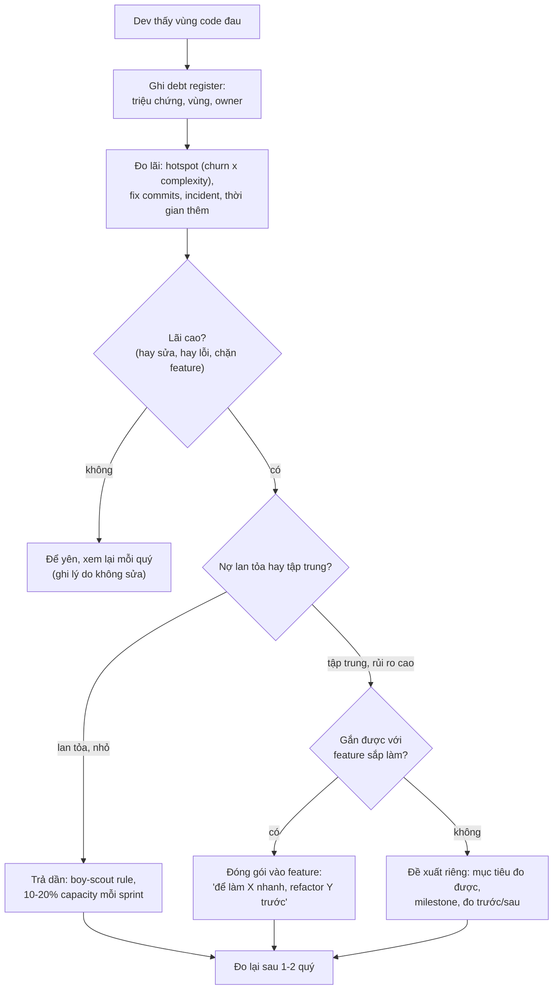
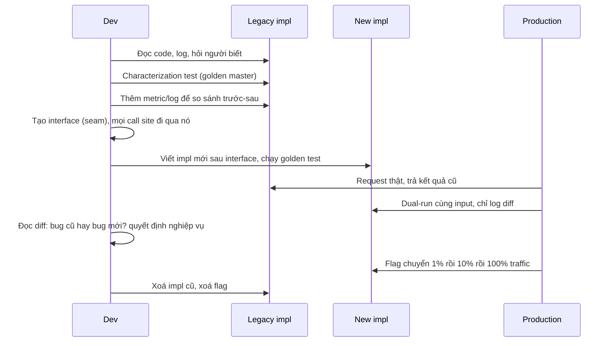

## Bối cảnh & vấn đề

Retro cuối sprint của một team (minh hoạ). Dev: "Mỗi lần sửa pricing là mất gấp ba thời gian ước lượng, tuần này lại có bug làm tròn. Code đó là nợ kỹ thuật, mình cần hai sprint để viết lại." PO: "Quý này có ba feature đã hứa với khách hàng. Viết lại thì được gì? Khách hàng có thấy gì khác không?" Cuộc nói chuyện kết thúc như mọi lần: không ai thuyết phục được ai, nợ vẫn nằm đó, và sprint sau dev lại mất gấp ba thời gian.

Cả hai bên đều có lý, và cả hai đều thiếu một thứ: **ngôn ngữ chung** để nói về nợ. Dev nói "code xấu", "phải viết lại", là ngôn ngữ của cảm giác. PO nghe thành "dev muốn làm việc thú vị thay vì việc có giá trị". Thứ PO cần nghe là: vùng này làm mỗi feature chậm bao nhiêu, gây bao nhiêu incident, rủi ro gì, trả nợ tốn bao nhiêu và lấy lại được gì, đo bằng cách nào.

Bài này xây dựng ngôn ngữ đó: tech debt theo nghĩa gốc (một khoản vay có lãi), phân loại để biết nợ nào chấp nhận được, cách **đo lãi suất** bằng dữ liệu git thay vì cảm giác, các cơ chế trả nợ không chặn roadmap, và kỹ thuật refactor một module legacy không có test mà không làm hỏng hành vi đang tạo ra doanh thu. Mọi đoạn code đều chạy thật.

## Khái niệm

### Tech debt: gốc và lãi

Ward Cunningham đưa ra ẩn dụ năm 1992: ship code chưa phản ánh đúng hiểu biết hiện tại giống như **vay nợ**, giúp đi nhanh hơn bây giờ, nhưng phải trả **lãi** mỗi lần đụng vào phần đó, cho tới khi trả **gốc** bằng cách refactor. Lãi là thời gian thêm, bug thêm, rủi ro thêm mỗi khi làm việc với vùng code đó. Gốc là chi phí sửa cho đúng.

Ẩn dụ này có hai hệ quả thực tế. Thứ nhất, nợ chỉ đắt khi **có lãi**: một module xấu mà không ai đụng tới trong hai năm gần như không tốn gì; một module hơi xấu mà mỗi sprint đều phải sửa thì rất đắt. Thứ hai, nợ không tự biến mất: lãi tích luỹ, và tới một lúc team dành phần lớn thời gian trả lãi thay vì làm feature.

Ví dụ: hard-code tỷ giá để kịp demo là vay; mỗi lần tỷ giá đổi phải deploy lại là trả lãi; chuyển sang bảng cấu hình là trả gốc.

### Tech Debt Quadrant

Fowler phân loại nợ theo hai trục: **deliberate vs inadvertent** (cố ý hay vô ý) và **reckless vs prudent** (liều lĩnh hay thận trọng):

- **Prudent + deliberate**: "Chúng ta phải ship bây giờ và sẽ xử lý hậu quả." Có ý thức, có kế hoạch trả. Đây là quyết định kinh doanh hợp lý.
- **Reckless + deliberate**: "Không có thời gian cho thiết kế." Biết là sai nhưng vẫn làm, không có kế hoạch.
- **Reckless + inadvertent**: "Layering là gì?" Không biết mình đang tạo nợ.
- **Prudent + inadvertent**: "Giờ chúng ta mới biết lẽ ra nên làm thế nào." Nợ sinh ra do **học được** trong quá trình làm, không tránh được, và là loại phổ biến nhất ở team tốt.

Vậy tech debt có luôn xấu không (câu easy)? Không. Nợ prudent-deliberate là công cụ: ship nhanh để kiểm chứng thị trường trước khi đầu tư. Thứ xấu là nợ **reckless**, và nợ **không ai ghi lại**: không ai biết nó tồn tại cho tới khi lãi đã lớn.

### Các loại nợ

Nợ không chỉ là "code xấu": **code** (trùng lặp, hàm 500 dòng), **kiến trúc** (module coupling chặt, sai ranh giới), **test** (thiếu test, test flaky), **dependency** (thư viện cũ, hết hỗ trợ bảo mật), **hạ tầng** (deploy thủ công, không IaC), **dữ liệu** (schema không còn khớp nghiệp vụ), **tài liệu và kiến thức** (chỉ một người hiểu). Loại hay bị bỏ qua nhất là **kiến thức**: một module chỉ một người hiểu là nợ có lãi suất bằng rủi ro người đó nghỉ việc.

### Lãi suất và hotspot

Cách khách quan nhất để đo lãi là nhìn vào **lịch sử thay đổi**. Adam Tornhill đề xuất **hotspot analysis**: file vừa **phức tạp** vừa **thay đổi thường xuyên** là nơi nợ đang thu lãi cao nhất. Complexity một mình không đủ (code phức tạp không ai đụng thì lãi gần 0); churn một mình cũng không đủ (file config thay đổi nhiều nhưng đơn giản). Tích của hai thứ, cộng thêm tỉ lệ commit `fix`, cho một danh sách ưu tiên mà PO có thể kiểm chứng.

### Debt register

Nợ phải **hữu hình**: ghi vào backlog như mọi việc khác, với trường mô tả tác động chứ không phải cảm giác. Một entry tốt có: vùng code, triệu chứng, **lãi** đo được (thời gian thêm mỗi lần đụng, số incident, rủi ro bảo mật), chi phí ước lượng để trả, **trigger** (khi nào bắt buộc phải trả: "trước khi thêm cổng thanh toán thứ ba"), và owner.

### Characterization test

Michael Feathers định nghĩa **legacy code** là code không có test. Khi refactor nó, bạn chưa biết hành vi "đúng" là gì; bạn chỉ biết hành vi **hiện tại** đang chạy production và có người phụ thuộc vào. **Characterization test** (golden master) ghi lại hành vi hiện tại trên nhiều input, kể cả những hành vi trông như bug, rồi dùng nó làm lưới an toàn: refactor không được làm đổi output. Nếu bạn muốn đổi hành vi, đó là một thay đổi **riêng**, có quyết định nghiệp vụ, không lẫn vào refactor.

### Strangler fig, branch by abstraction, dual-run

Ba kỹ thuật thay thế dần thay vì viết lại một lần:

- **Strangler fig** (Fowler): xây hệ thống mới bao quanh hệ thống cũ, chuyển từng phần chức năng/traffic sang, cho tới khi cái cũ không còn được gọi và có thể xoá. Đặt tên theo loài cây bóp nghẹt cây chủ.
- **Branch by abstraction**: trong cùng một codebase, đặt một interface trước implementation cũ, chuyển mọi call site sang interface, viết implementation mới phía sau, chuyển dần (bằng flag), rồi xoá cái cũ. Mỗi bước là một PR nhỏ, merge được vào trunk.
- **Dual-run / shadow**: chạy cả hai implementation trên request thật, trả kết quả của bản cũ, **so sánh** và log khác biệt của bản mới. Thư viện Scientist của GitHub phổ biến pattern này. Khi tỉ lệ khác biệt về 0 (hoặc chỉ còn khác biệt đã được giải thích), chuyển traffic.

### One-way và two-way door

Khung quyết định "build tốt bây giờ hay ship nhanh và nhận nợ": quyết định **two-way door** dễ đảo ngược (UI, implementation nội bộ, một thuật toán sau interface) thì ship nhanh, sửa sau rẻ; quyết định **one-way door** khó đảo ngược (data model, public API, mô hình tenant, định dạng dữ liệu đã lưu, lựa chọn bảo mật) thì làm kỹ, vì "sửa sau" có thể nghĩa là migration dữ liệu của mọi khách hàng. Khung này được phổ biến qua thư gửi cổ đông năm 2015 của Amazon.

**Interview angle:** câu "build well vs ship fast" muốn nghe bạn phân biệt được loại quyết định, mức bất định của sản phẩm, chi phí nợ ở vùng đó, và nếu nhận nợ thì **ghi lại + trigger trả nợ**.

### Recap

| Khái niệm | Một dòng | Ví dụ |
|---|---|---|
| Lãi | Chi phí thêm mỗi lần đụng vào | +2 ngày cho mỗi feature pricing |
| Quadrant | deliberate/inadvertent × reckless/prudent | "Ship để kịp hội chợ, trả trong sprint sau" |
| Hotspot | churn × complexity | `pricing.ts`: 156 commit, 512 nhánh |
| Characterization test | Ghi hành vi hiện tại làm lưới an toàn | 192 case golden của phí ship |
| Strangler fig | Thay dần từ bên ngoài | Route `/v2/pricing` sang service mới |
| Branch by abstraction | Thay dần sau interface trong codebase | `PricingEngine` với 2 implementation |
| Dual-run | Chạy song song, so sánh, trả kết quả cũ | Log diff giá cũ vs mới |

## Cơ chế hoạt động

### Từ "code này xấu" tới quyết định trả nợ



Sơ đồ có một nhánh quan trọng ít người nói tới: **E**, "để yên". Không phải nợ nào cũng đáng trả, và nói được "đây là nợ mà tôi chọn không trả, vì lý do này" là dấu hiệu senior (followUp "give an example of tech debt you chose NOT to fix"). Nhánh I thường là con đường thuyết phục PO dễ nhất: refactor không còn là "việc của dev" mà là bước đầu tiên của feature họ muốn, với ước lượng "có refactor" và "không refactor" để so sánh.

### Refactor legacy theo từng bước an toàn



Mỗi mũi tên là một PR nhỏ có thể rollback. Bước "đọc diff" là chỗ refactor legacy khác refactor thường: khác biệt có thể là **bug của bản mới** (sửa bản mới) hoặc **bug của bản cũ mà khách hàng đang phụ thuộc** (cần PO quyết: giữ, hay sửa có thông báo). Không bao giờ để bản mới "âm thầm sửa bug" trong một refactor.

## Ví dụ thực tế

Code chạy thật với Node 24 và git 2.50 trong repo scratch; lịch sử git là dữ liệu minh hoạ được sinh bằng script.

### 1. Hotspot analysis: lãi suất nằm ở đâu

Repo minh hoạ có 6 tháng lịch sử (261 commit). `legacy-report.ts` là file to và phức tạp nhất; `pricing.ts` cũng to và bị sửa liên tục.

```ts
// hotspots.ts — hotspot = churn (số commit đụng file) × complexity (số nhánh rẽ, xấp xỉ). Usage: node hotspots.ts <repo> [since]
import { execFileSync } from "node:child_process";
import { readFileSync } from "node:fs";
import { join } from "node:path";
const [repo, since = "6 months ago"] = process.argv.slice(2);
const git = (...a: string[]) => execFileSync("git", ["-C", repo, ...a], { encoding: "utf8" });

const churn = new Map<string, { commits: number; fixes: number }>();
let subject = "";
for (const line of git("log", `--since=${since}`, "--format=@%s", "--name-only").split("\n")) {
  if (line.startsWith("@")) { subject = line; continue; }
  if (!line.endsWith(".ts")) continue;
  const c = churn.get(line) ?? { commits: 0, fixes: 0 };
  c.commits++; if (subject.startsWith("@fix")) c.fixes++;
  churn.set(line, c);
}
const rows = git("ls-files", "*.ts").trim().split("\n").map((f) => {
  const src = readFileSync(join(repo, f), "utf8");
  const loc = src.split("\n").filter((l) => l.trim()).length;
  const branches = (src.match(/\b(if|for|while|case|catch)\b|&&|\|\||\?\?/g) ?? []).length; // xấp xỉ cyclomatic
  const c = churn.get(f) ?? { commits: 0, fixes: 0 };
  return { f, loc, branches, ...c, score: c.commits * branches };
}).sort((a, b) => b.score - a.score);
const max = rows[0].score;
console.log("file                   loc  branches  commits  fix-commits  hotspot");
for (const r of rows) console.log(`${r.f.padEnd(21)}${String(r.loc).padStart(5)}${String(r.branches).padStart(10)}${String(r.commits).padStart(9)}${String(r.fixes).padStart(13)}  ${"█".repeat(Math.round((20 * r.score) / max)).padEnd(20)} ${r.score}`);
```

```text
$ node hotspots.ts hot2/repo "2026-03-02"
file                   loc  branches  commits  fix-commits  hotspot
src/pricing.ts        1056       512      156           50  ████████████████████ 79872
src/address.ts         202        84       52            0  █                    4368
src/auth.ts            326       168       26            0  █                    4368
src/utils.ts           106        44       26            0                       1144
src/legacy-report.ts  1400       800        0            0                       0
```

Bảng này thay đổi cuộc nói chuyện với PO. `pricing.ts` chiếm phần lớn thay đổi của team trong 6 tháng, và gần 1/3 commit đụng nó là `fix`: đây là nơi lãi đang được trả mỗi tuần. `legacy-report.ts` xấu nhất theo mọi thước đo tĩnh, nhưng **không ai đụng vào trong 6 tháng**: viết lại nó là trả gốc cho một khoản nợ không có lãi. Đó là ví dụ cụ thể cho "tech debt bạn chọn không sửa": ghi vào register với lý do "lãi ≈ 0; xem lại nếu có yêu cầu báo cáo mới".

Giới hạn cần nói rõ: đếm nhánh bằng regex chỉ là xấp xỉ (tool thật dùng AST, ví dụ ESLint rule `complexity`); churn theo commit lệch nếu team commit rất nhỏ hoặc squash; và file bị đổi tên làm mất lịch sử nếu không dùng `--follow`. Dùng như **tín hiệu để bắt đầu điều tra**, rồi kết hợp với dữ liệu khác: thời gian thực tế của các ticket đụng vùng đó, incident gắn với nó.

### 2. Characterization test trước khi refactor

Module tính phí ship "legacy", không test, đang chạy production:

```ts
// legacy-shipping.ts — module "legacy" không có test (minh hoạ): ai cũng sợ sửa
export function shippingFee(o: any): number {
  var fee = 0;
  if (o.country == "VN") {
    if (o.weight <= 1) fee = 20000; else if (o.weight <= 5) fee = 20000 + Math.ceil(o.weight - 1) * 5000; else fee = 45000 + (o.weight - 5) * 4000;
    if (o.total >= 500000) fee = 0;
    if (o.express) fee = fee * 1.5;
  } else {
    fee = 150000 + o.weight * 30000;
    if (o.express) fee = fee + 100000;
  }
  if (o.coupon == "FREESHIP" && o.country == "VN") fee = 0;
  return Math.round(fee);
}
```

Golden master: sinh tổ hợp input bao quanh các ngưỡng (0, 1, 1.01, 5, 5.5 kg; tổng 499.999 và 500.000; express; coupon), ghi output của bản cũ, rồi so bản mới:

```ts
// golden.ts — characterization test: ghi lại hành vi HIỆN TẠI của legacy, rồi so bản mới với nó
import { shippingFee as legacy } from "./legacy-shipping.ts";
import { shippingFee as v2 } from "./shipping-v2.ts";
import { writeFileSync, existsSync, readFileSync } from "node:fs";

const inputs: any[] = [];
for (const country of ["VN", "US"]) for (const weight of [0, 0.5, 1, 1.01, 2.5, 5, 5.5, 12]) for (const total of [0, 499_999, 500_000])
  for (const express of [false, true]) for (const coupon of [undefined, "FREESHIP"]) inputs.push({ country, weight, total, express, coupon });

if (!existsSync("golden.json")) { writeFileSync("golden.json", JSON.stringify(inputs.map((i) => ({ i, out: legacy(i) })))); console.log(`recorded ${inputs.length} cases from legacy`); }
const golden: { i: any; out: number }[] = JSON.parse(readFileSync("golden.json", "utf8"));
const diffs = golden.filter((g) => v2(g.i) !== g.out);
console.log(`v2 vs golden: ${golden.length - diffs.length}/${golden.length} match`);
for (const d of diffs.slice(0, 5)) console.log("  DIFF", JSON.stringify(d.i), "legacy =", d.out, "v2 =", v2(d.i));
process.exitCode = diffs.length ? 1 : 0;
```

Lần refactor đầu tiên, dev "dọn" nhánh trên 5 kg cho nhất quán với nhánh 1–5 kg bằng cách làm tròn lên số kg:

```ts
    : VN.over5Base + Math.ceil(o.weight - 5) * VN.perKgOver5; // "cho nhất quán" với nhánh 1–5 kg
```

`golden.json` đã được ghi từ bản legacy ở lần chạy đầu (`recorded 192 cases from legacy`). Chạy bản refactor đầu tiên với nó:

```text
$ node golden-a.ts; echo "exit=$?"
v2 vs golden: 188/192 match
  DIFF {"country":"VN","weight":5.5,"total":0,"express":false} legacy = 47000 v2 = 49000
  DIFF {"country":"VN","weight":5.5,"total":0,"express":true} legacy = 70500 v2 = 73500
  DIFF {"country":"VN","weight":5.5,"total":499999,"express":false} legacy = 47000 v2 = 49000
  DIFF {"country":"VN","weight":5.5,"total":499999,"express":true} legacy = 70500 v2 = 73500
exit=1
```

Bốn khác biệt, đều ở 5,5 kg: bản "sạch hơn" tăng phí ship 2.000–3.000 đồng cho mọi đơn trên 5 kg. Có thể bản cũ là bug (lẽ ra phải làm tròn lên), cũng có thể là chính sách giá đã công bố với khách hàng. **Refactor không được tự quyết điều đó.** Bản refactor đúng giữ nguyên `(o.weight - 5) * perKgOver5`, và việc "làm tròn lên cho nhất quán" thành một ticket riêng có PO quyết:

```text
$ node golden.ts; echo "exit=$?"
v2 vs golden: 192/192 match
exit=0
```

Lưu ý giới hạn: 192 case chỉ bao các ngưỡng mà dev nghĩ tới. Với module tạo doanh thu, bổ sung bằng **dual-run** trên traffic thật (ví dụ 3) để bắt các input không ai nghĩ ra.

### 3. Dual-run trên production (minh hoạ)

```ts
// dual-run trong request path: trả kết quả cũ, so kết quả mới, log khác biệt (không throw)
export function shippingFeeExperiment(o: Order): number {
  const oldFee = legacyShippingFee(o);
  if (flags.isOn("shipping_v2_shadow", { tenantId: o.tenantId })) {
    try {
      const newFee = shippingFeeV2(o);
      if (newFee !== oldFee) metrics.increment("shipping_v2.mismatch"), log.warn({ o: redact(o), oldFee, newFee }, "shipping_v2 mismatch");
      else metrics.increment("shipping_v2.match");
    } catch (err) { metrics.increment("shipping_v2.error"); log.error({ err }, "shipping_v2 threw"); }
  }
  return oldFee; // người dùng luôn nhận kết quả của bản đang chạy
}
```

Ba điều kiện để dual-run an toàn: bản mới **không có side effect** (chỉ tính toán, không ghi DB, không gọi API ngoài), lỗi của bản mới **không bao giờ** ảnh hưởng request (try/catch, timeout), và log không chứa PII (`redact`). Sau vài ngày, dashboard `mismatch / (match + mismatch)` là bằng chứng để chuyển traffic: "0,00% mismatch trên 1,2 triệu đơn" thuyết phục hơn mọi lời hứa.

### 4. Debt register và cách nói với PO

```markdown
| id | Vùng | Triệu chứng | Lãi (đo được) | Gốc (ước) | Trigger | Owner |
|---|---|---|---|---|---|---|
| TD-14 | src/pricing.ts | 1 hàm 900 dòng, rule chồng nhau | 156/261 commit 6 tháng; 50 fix; ticket pricing trung bình 3.1x estimate; 2 incident làm tròn | 8-10 ngày (branch by abstraction + golden + dual-run) | Trước "giá theo khung giờ" (Q4) | @pricing-team |
| TD-15 | src/legacy-report.ts | 1.400 dòng, không test | 0 commit / 6 tháng | 15 ngày | Khi có yêu cầu báo cáo mới | (để yên) |
| TD-16 | lib xử lý PDF v2 | Hết hỗ trợ bảo mật | CVE mức high chưa vá được | 2 ngày | Ngay (rủi ro bảo mật) | @platform |
```

Câu nói với PO cho TD-14: "Feature 'giá theo khung giờ' quý tới đụng đúng vào `pricing.ts`. Làm thẳng: ước 15 ngày, rủi ro cao vì 1/3 thay đổi gần đây ở đây là sửa lỗi. Refactor trước 8–10 ngày, sau đó feature còn khoảng 5 ngày, và các rule giá sau đó nhanh hơn. Mình đo lại thời gian ticket pricing sau 2 tháng." Đó là ngôn ngữ của **tốc độ, rủi ro, chi phí**, có số liệu, có cách kiểm chứng.

### 5. Kể chuyện refactor legacy (khung cho câu CV)

Câu hỏi "bạn refactor legacy trên hệ thống đang chạy, chọn cái gì và làm sao không phá hành vi" cần một câu chuyện có cấu trúc. Khung (điền số liệu thật của bạn):

- **Chọn**: vùng nào, vì sao (hay lỗi, hay sửa, chặn feature mới; dữ liệu nào chứng minh: số commit, incident, thời gian ticket).
- **An toàn**: characterization test bao nhiêu case, seam/interface đặt ở đâu, flag hay dual-run, từng PR nhỏ cỡ nào, monitor gì sau deploy.
- **Với PO**: đóng gói vào feature hay xin thời gian riêng, thuyết phục bằng gì.
- **Kết quả**: bug giảm bao nhiêu, thời gian làm feature liên quan thay đổi thế nào, kích thước module trước/sau.
- **Không refactor**: phần nào xấu mà bạn để yên, vì sao (lãi thấp, rủi ro cao, sắp bị thay thế).

## Trade-offs & lựa chọn thay thế

| Cách trả nợ | Ưu | Nhược | Hợp với |
|---|---|---|---|
| Boy-scout rule (dọn khi chạm vào) | Không cần xin phép, liên tục | Chỉ dọn được vùng nhỏ; PR lẫn refactor + feature | Nợ nhỏ, lan tỏa |
| % capacity cố định (10–20%) | Đều đặn, dự đoán được | Dễ bị "mượn" khi gấp; có thể tiêu vào nợ không lãi | Team có backlog nợ rõ ràng |
| Gắn vào feature | Dễ thuyết phục, giá trị thấy ngay | Ước lượng feature to hơn | Nợ nằm trên đường đi của roadmap |
| Dự án trả nợ riêng | Xử lý được nợ lớn, tập trung | Khó xin, dễ trượt, không ship giá trị trong thời gian đó | Nợ tập trung, rủi ro cao, có mục tiêu đo được |
| Viết lại toàn bộ (big-bang rewrite) | Tự do thiết kế lại | Rủi ro rất cao: mất hành vi ẩn, hai hệ thống song song lâu, trễ | Hiếm khi; khi nền tảng cũ không thể chạy tiếp |

Khi nào chọn gì: nợ lan tỏa, nhỏ → boy-scout + capacity cố định. Nợ tập trung trên đường đi của roadmap → gắn vào feature. Nợ tập trung nhưng không gắn được, rủi ro cao (bảo mật, dependency hết hỗ trợ, module gây incident lặp lại) → dự án riêng với mục tiêu đo được, milestone, và ship từng phần (không phải "3 tháng sau sẽ xong"). Viết lại toàn bộ gần như luôn tệ hơn strangler fig: hệ thống cũ chứa nhiều năm hành vi ẩn (bug mà khách hàng đã phụ thuộc, case đặc biệt không ai ghi lại), và một bản viết lại phải tái hiện tất cả trong khi bản cũ vẫn tiếp tục thay đổi.

Về "build well vs ship fast": quyết định one-way door (data model, public API, tenant model, bảo mật) làm kỹ; two-way door ship nhanh; sản phẩm còn bất định (chưa biết có người dùng không) thì nghiêng về ship nhanh để học; vùng sẽ được mở rộng nhiều thì nợ ở đó đắt. Nếu nhận nợ: ghi lại, tạo ticket, đặt **trigger** cụ thể để trả.

## Edge cases & failure modes

- **"Tech debt" thành nhãn cho mọi thứ dev không thích**: mất uy tín với PO. Chỉ gọi là nợ khi nói được lãi; còn lại là sở thích.
- **Capacity 20% bị tiêu vào nợ không có lãi**: dev chọn việc thú vị (viết lại module ít dùng). Ưu tiên theo hotspot và trigger, không theo hứng thú.
- **Refactor kèm thay đổi hành vi**: một PR vừa đổi cấu trúc vừa "sửa luôn bug". Khi có sự cố, không ai biết nguyên nhân là refactor hay là sửa bug. Tách thành hai PR.
- **Golden master che bug**: characterization test giữ nguyên cả hành vi sai. Đó là chủ ý: ghi nhận nó, quyết định riêng; nhưng đừng để golden thành lý do không bao giờ sửa.
- **Golden master không đủ input**: chỉ bao các ngưỡng bạn nghĩ tới. Bổ sung input từ log production (đã ẩn danh) và dual-run.
- **Dual-run có side effect**: bản mới ghi DB hoặc gửi email trong chế độ shadow → dữ liệu nhân đôi. Shadow chỉ cho logic thuần, hoặc dùng sandbox/dry-run.
- **Strangler fig không bao giờ xong**: chuyển được 80% rồi dừng, team phải duy trì hai hệ thống mãi mãi. Đặt mốc xoá bản cũ ngay từ đầu, và đo phần trăm traffic còn đi qua bản cũ.
- **Nợ kiến thức**: người duy nhất hiểu module nghỉ việc giữa lúc refactor. Pair, ghi ADR, viết test trước là cách chuyển kiến thức vào repo.
- **Trả nợ trong lúc feature freeze**: "tháng sau rảnh sẽ trả" không bao giờ tới. Gắn với trigger và roadmap thay vì chờ thời gian rảnh.

## Pitfalls

- ❌ "Code này là nợ, cần hai sprint viết lại" → ✅ đo lãi (hotspot, fix commits, thời gian ticket, incident), đề xuất tăng dần có mục tiêu đo được.
- ❌ Trả nợ ở vùng xấu nhất → ✅ trả ở vùng có **lãi** cao nhất (churn × complexity); vùng xấu không ai đụng thì để yên, có ghi lý do.
- ❌ Nợ chỉ nằm trong đầu dev → ✅ debt register với lãi, gốc, trigger, owner.
- ❌ Refactor legacy không có test → ✅ characterization test trước, rồi mới đổi cấu trúc.
- ❌ Refactor "sửa luôn" hành vi trông như bug → ✅ giữ nguyên hành vi; đổi hành vi là quyết định nghiệp vụ, PR riêng.
- ❌ Big-bang rewrite → ✅ strangler fig / branch by abstraction, dual-run, chuyển traffic từng phần, mốc xoá bản cũ.
- ❌ Nhận nợ mà không ghi lại → ✅ ticket + trigger cụ thể ("trước khi thêm cổng thanh toán thứ ba").
- ❌ Nói với PO bằng ngôn ngữ code → ✅ tốc độ, rủi ro, chi phí, và cách đo lại.

## Tóm tắt

- Tech debt = khoản vay có **lãi** (chi phí thêm mỗi lần đụng vào) và **gốc** (chi phí sửa); nợ không lãi gần như không tốn gì.
- Quadrant của Fowler: prudent-deliberate là công cụ hợp lý; reckless và nợ không ghi lại mới là vấn đề; prudent-inadvertent là nợ "học được", không tránh được.
- Đo lãi bằng **hotspot** (churn × complexity, tỉ lệ fix) + thời gian ticket + incident; ưu tiên theo lãi, không theo độ xấu.
- Cơ chế: boy-scout, 10–20% capacity, gắn vào feature, dự án riêng có mục tiêu đo được; nói với PO bằng tốc độ, rủi ro, chi phí.
- Refactor legacy: characterization test (golden master) → seam/interface → impl mới → dual-run so sánh → flag chuyển traffic → xoá cũ; mỗi bước một PR có thể rollback.
- Refactor không đổi hành vi; khác biệt phát hiện được là quyết định nghiệp vụ riêng.
- One-way door làm kỹ, two-way door ship nhanh; nhận nợ thì ghi lại với trigger trả nợ.
