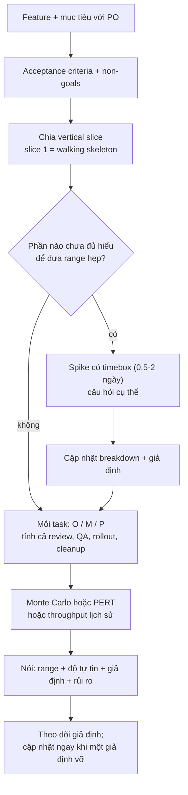
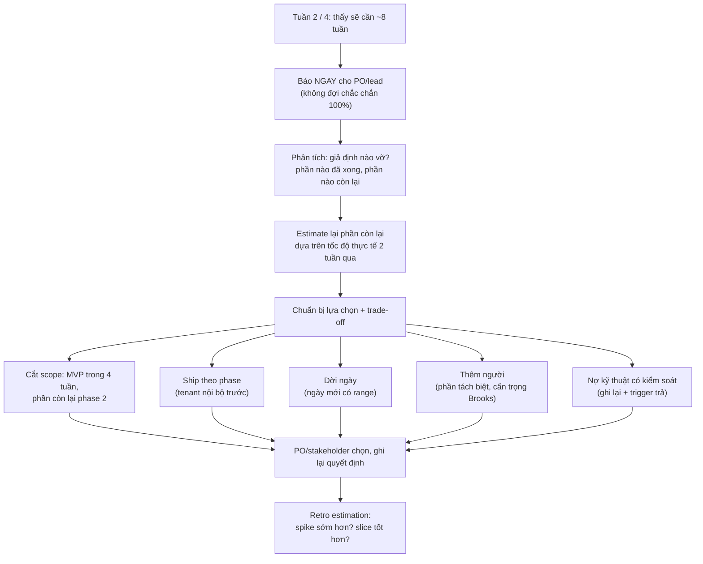

## Bối cảnh & vấn đề

Sprint planning (minh hoạ). PO: "Feature quản lý địa chỉ giao hàng mất bao lâu?" Dev nghĩ 5 giây: "Khoảng hai tuần." PO ghi "2 tuần" vào roadmap và hứa với khách hàng. Ba tuần sau, feature mới xong 60%: API của nhà cung cấp validate địa chỉ trả format khác docs, checkout phải sửa nhiều hơn dự kiến, QA tìm ra lỗi khi user xoá địa chỉ mặc định. Dev biết từ tuần thứ hai là sẽ trễ nhưng im lặng, làm thêm giờ, hy vọng đuổi kịp. Ngày deadline, PO nghe tin trễ lần đầu tiên, và cái mất không phải một tuần mà là **niềm tin**.

Lỗi trong câu chuyện không phải là con số "hai tuần" sai: estimate **luôn** sai, câu hỏi là sai bao nhiêu và theo hướng nào. Lỗi là ba thứ: một con số duy nhất không kèm độ bất định, không có giả định nào được nói ra (nên không ai biết khi nào estimate đã vỡ), và tin xấu được giữ lại. Estimation, ở level senior, là **giao tiếp về bất định** chứ không phải dự đoán chính xác.

Bài này đi qua toàn bộ chuỗi: chia feature lớn thành phần có thể giao và ước lượng được, vì sao estimate lệch một cách có hệ thống, kỹ thuật three-point/PERT/Monte Carlo (có code chạy thật để thấy "cộng most-likely" sai thế nào), cách nói với PO, và cách xử lý khi phát hiện trễ gấp đôi giữa chừng.

## Khái niệm

### Vì sao estimate: mục đích quyết định độ chính xác cần có

Fowler nhấn mạnh: estimate chỉ có giá trị khi nó giúp **ra một quyết định** (làm feature A hay B trước, có kịp hội chợ tháng 11 không, có cần thêm người không). Nếu không có quyết định nào phụ thuộc vào con số, estimate chi tiết là lãng phí. Ngược lại, khi có cam kết với khách hàng, estimate cần đủ tốt để quyết định đó an toàn. Câu hỏi đầu tiên khi được hỏi "bao lâu?" nên là "để quyết định gì?": câu trả lời cho "có kịp tháng 11 không" khác với "nên xếp nó trước hay sau feature B".

### Vertical slice vs horizontal layer

Chia feature theo **lớp ngang** (tuần 1 làm DB, tuần 2 làm API, tuần 3 làm UI) nghĩa là tới tuần 3 mới có thứ chạy được end-to-end, và mọi rủi ro tích hợp dồn về cuối. Chia theo **lát dọc** (vertical slice): mỗi phần đi xuyên qua mọi lớp và giao được một mẩu giá trị nhỏ có thể demo, test, đo. Lát đầu tiên thường là một **walking skeleton**: luồng mỏng nhất chạy được từ UI tới DB ("user thêm được một địa chỉ, không validate, không default").

Lát dọc lộ rủi ro sớm: chính lát đầu tiên chạm vào API provider, chạm vào checkout, chạm vào migration. Khi bất ngờ xảy ra, nó xảy ra ở ngày 2, không phải ngày 12. Tiêu chí **INVEST** cho mỗi phần: Independent, Negotiable, Valuable, Estimable, Small, Testable.

Chia theo lớp không phải lúc nào cũng sai: migration và API contract thường **nên** làm trước để FE và BE làm song song. Nhưng đó là thứ tự trong một lát, không phải lý do để mọi lớp làm xong mới tích hợp.

### Spike

**Spike** là một việc nghiên cứu có **timebox** (ví dụ 1 ngày) để trả lời một câu hỏi cụ thể làm estimate không chắc: "API provider có trả tọa độ không? rate limit bao nhiêu? sandbox có giống production không?". Output của spike là **câu trả lời + estimate được cập nhật**, không phải code production (code spike thường bỏ đi). Quy tắc: thứ gì làm bạn không dám đưa range hẹp thì tách thành spike và làm **trước** khi cam kết.

### Vì sao estimate lệch một cách có hệ thống

- **Cone of uncertainty** (McConnell): đầu dự án, sai số có thể gấp nhiều lần; nó chỉ thu hẹp khi bạn học thêm (requirement rõ hơn, spike xong, code chạy được). Estimate ở giai đoạn ý tưởng mà đưa ra như cam kết là đang hứa ở điểm rộng nhất của hình nón.
- **Planning fallacy**: con người ước lượng thời gian của chính mình theo kịch bản thuận lợi nhất, bỏ qua kinh nghiệm quá khứ.
- **Phân phối lệch phải**: một task có thể nhanh hơn dự kiến một chút (không thể âm), nhưng có thể chậm hơn rất nhiều (bug lạ, phụ thuộc trễ). Trung bình luôn lớn hơn giá trị "hay xảy ra nhất". Cộng các giá trị most-likely của nhiều task cho một tổng **gần như chắc chắn bị vượt** (ví dụ 1 cho thấy chỉ ~3% khả năng).
- **Quên việc không phải code**: review, sửa theo review, QA, sửa bug QA, deploy, rollout, cleanup flag, họp, on-call, hỗ trợ người khác.
- **Anchoring**: con số đầu tiên được nói ra (thường từ PO: "chắc khoảng một tuần nhỉ?") kéo mọi estimate sau về phía nó.

### Range và độ tự tin

Thay vì "2 tuần", nói "**15–18 ngày làm việc, 85% xong trong 18 ngày, với giả định API provider đúng như docs và QA bắt đầu từ ngày 10**". Câu này chứa: một khoảng (range), một mức tự tin, và **giả định** có thể kiểm. Giả định là phần quan trọng nhất: khi spike phát hiện API khác docs, cả bạn và PO đều biết ngay estimate đã vỡ và cần cập nhật.

### Three-point estimate, PERT, Monte Carlo

**Three-point estimate**: với mỗi task, ước ba giá trị: optimistic (O), most likely (M), pessimistic (P). Công thức **PERT** cho kỳ vọng: (O + 4M + P) / 6, lớn hơn M khi P xa hơn O (lệch phải). **Monte Carlo** đi xa hơn: lấy mẫu ngẫu nhiên thời gian của từng task theo phân phối (ví dụ tam giác O–M–P) hàng nghìn lần, cộng lại, và đọc ra phân vị (P50, P85, P95) của tổng. Kết quả là một câu trả lời dạng "85% xong trong 17 ngày" thay vì một con số.

**Throughput forecasting**: khi backlog gồm nhiều ticket tương tự, dùng dữ liệu thật: mỗi tuần team xong bao nhiêu ticket trong quá khứ, bốc lại mẫu để mô phỏng số tuần cần cho N ticket còn lại. Cách này không cần ước lượng từng ticket và tự động bao gồm mọi "việc không phải code" đã xảy ra trong lịch sử.

### Story points vs thời gian

**Story points** là đơn vị tương đối (task này to gấp đôi task kia), dùng ở cấp team để lập kế hoạch sprint qua velocity; ưu điểm là tách khỏi "ai làm" và tránh tranh cãi giờ chính xác. Nhược điểm: business không hiểu points, points bị quy đổi ngầm thành ngày, và velocity bị dùng sai để so sánh giữa team. Với stakeholder, luôn chuyển về **ngày lịch + range + độ tự tin**.

### Brooks's law

"Thêm người vào một dự án phần mềm đang trễ sẽ làm nó trễ hơn" (Brooks, The Mythical Man-Month). Lý do: người mới cần thời gian làm quen (và lấy thời gian của người cũ để hướng dẫn), chi phí giao tiếp tăng theo số cặp người, và nhiều việc không chia nhỏ được. Không có nghĩa là không bao giờ thêm người, mà là: thêm sớm, vào phần việc tách biệt rõ, và không kỳ vọng hiệu quả ngay.

**Interview angle:** interviewer nghe xem bạn có nói range + giả định, có tính việc không phải code, có báo sớm kèm phương án, và có biết các đòn bẩy (scope, thời gian, người, chất lượng) cùng cái giá của từng cái hay không.

## Cơ chế hoạt động

### Từ feature tới estimate có thể cam kết



Sơ đồ có hai vòng phản hồi ẩn. Vòng thứ nhất là spike (E → F): thay vì đệm thêm 3 lần cho phần chưa rõ, bạn mua thông tin bằng một ngày timebox. Vòng thứ hai là bước J: estimate không phải sự kiện một lần mà là một **giả thuyết** được theo dõi. Khi giả định "API provider đúng docs" vỡ, đó là tín hiệu cập nhật, không phải chờ tới deadline.

### Khi phát hiện trễ lớn giữa chừng



Thứ tự trong sơ đồ quan trọng: báo **trước**, phân tích **sau** nhưng nhanh (trong một hai ngày). Tin "có thể trễ, mình đang phân tích, thứ Năm có phương án" tốt hơn nhiều so với im lặng một tuần để có phân tích hoàn hảo. Và người chọn giữa O1–O5 là PO/stakeholder, vì đó là trade-off sản phẩm; việc của bạn là làm cho các lựa chọn và cái giá của chúng **rõ ràng**. "Làm thêm giờ âm thầm để kịp" không có trong danh sách: nó che giấu vấn đề, đẩy rủi ro chất lượng lên và không bền.

## Ví dụ thực tế

### 1. Breakdown của "Address Management"

```text
Feature: Address Management (lưu địa chỉ giao hàng, chọn mặc định ở checkout)
Mục tiêu: giảm drop-off ở bước nhập địa chỉ. Non-goals: validate địa chỉ quốc tế, bản đồ.

0. Spike: provider validate địa chỉ (timebox 1 ngày)
   Câu hỏi: format response, rate limit, sandbox, chi phí/request, lỗi timeout trả gì
1. Walking skeleton (slice 1): migration bảng addresses (expand), POST + GET list,
   form tối thiểu sau flag address_v2, không validate, không default
2. Slice 2: default address (partial unique index), đổi/xoá default, test cross-tenant
3. Slice 3: validate qua provider (theo kết quả spike), fallback khi provider timeout
4. Slice 4: checkout đọc default address (sau flag)
5. Rollout: tenant nội bộ → 10% tenant → 100%, monitor tỉ lệ lỗi + drop-off
6. Cleanup: xoá flag, xoá code nhập địa chỉ cũ

Dependency: API contract (slice 1) chốt trước để FE/BE song song; checkout team review slice 4.
Mỗi task ≤ 1-2 ngày, có DoD; migration / flag / cleanup là task riêng.
```

Slice 1 chạm vào migration, API, UI và flag ngay ngày đầu: nếu có vấn đề tích hợp (ví dụ middleware tenant không áp cho route mới), nó lộ ra lúc còn rẻ.

### 2. Three-point + Monte Carlo cho breakdown trên

```ts
// estimate.ts — three-point estimate + Monte Carlo cho một feature; so "cộng most-likely" với phân phối thật
type Task = { name: string; o: number; m: number; p: number }; // optimistic / most likely / pessimistic (ngày làm việc)
const tasks: Task[] = [
  { name: "spike: address provider API", o: 0.5, m: 1, p: 2 },
  { name: "migration addresses (expand)", o: 0.5, m: 1, p: 2 },
  { name: "API CRUD + default + tenant tests", o: 2, m: 3, p: 6 },
  { name: "FE list + form (flag)", o: 2, m: 3, p: 5 },
  { name: "checkout reads default address", o: 1, m: 1.5, p: 4 },
  { name: "review + QA + fixes", o: 1, m: 2, p: 5 },
  { name: "rollout by tenant + cleanup", o: 0.5, m: 1, p: 2 },
];
let seed = 2026;
const rand = () => { seed = (seed * 16807) % 2147483647; return seed / 2147483647; };
// lấy mẫu phân phối tam giác (o, m, p)
const tri = ({ o, m, p }: Task) => { const u = rand(), c = (m - o) / (p - o); return u < c ? o + Math.sqrt(u * (p - o) * (m - o)) : p - Math.sqrt((1 - u) * (p - o) * (p - m)); };

const sumM = tasks.reduce((s, t) => s + t.m, 0);
const pert = tasks.reduce((s, t) => s + (t.o + 4 * t.m + t.p) / 6, 0);
const runs = Array.from({ length: 20_000 }, () => tasks.reduce((s, t) => s + tri(t), 0)).sort((a, b) => a - b);
const q = (p: number) => runs[Math.floor(p * runs.length)];
const pLE = (d: number) => runs.filter((x) => x <= d).length / runs.length;

console.log(`sum of most-likely        : ${sumM.toFixed(1)} days  → P(done ≤ ${sumM}) = ${(100 * pLE(sumM)).toFixed(0)}%`);
console.log(`sum of PERT means         : ${pert.toFixed(1)} days`);
console.log(`Monte Carlo (20k runs)    : P50 ${q(0.5).toFixed(1)}  P85 ${q(0.85).toFixed(1)}  P95 ${q(0.95).toFixed(1)} days`);
console.log(`→ say: "${q(0.5).toFixed(0)}-${Math.ceil(q(0.85))} ngày làm việc, 85% xong trong ${Math.ceil(q(0.85))} ngày nếu provider API đúng như docs"`);

// Forecast theo throughput lịch sử: còn 38 ticket, mỗi tuần team xong bao nhiêu? (bốc lại mẫu từ 12 tuần qua)
const weekly = [6, 4, 7, 5, 3, 6, 8, 2, 5, 6, 4, 7];
const backlog = 38;
const weeks = Array.from({ length: 20_000 }, () => { let left = backlog, w = 0; while (left > 0) { left -= weekly[Math.floor(rand() * weekly.length)]; w++; } return w; }).sort((a, b) => a - b);
const wq = (p: number) => weeks[Math.floor(p * weeks.length)];
console.log(`\nthroughput forecast for ${backlog} tickets: P50 ${wq(0.5)} weeks, P85 ${wq(0.85)} weeks, P95 ${wq(0.95)} weeks`);
```

```text
$ node estimate.ts
sum of most-likely        : 12.5 days  → P(done ≤ 12.5) = 3%
sum of PERT means         : 13.9 days
Monte Carlo (20k runs)    : P50 15.3  P85 17.0  P95 18.1 days
→ say: "15-18 ngày làm việc, 85% xong trong 18 ngày nếu provider API đúng như docs"

throughput forecast for 38 tickets: P50 8 weeks, P85 9 weeks, P95 9 weeks
```

Dòng đầu là bài học lớn nhất của cả bài: cộng các giá trị "hay xảy ra nhất" của bảy task cho 12,5 ngày, và theo chính các ước lượng O/M/P của bạn, khả năng xong trong 12,5 ngày chỉ khoảng **3%**. Không phải vì ai đó lười; chỉ vì mỗi task lệch phải, và độ lệch cộng dồn. "Hai tuần" trong câu chuyện mở đầu chính là con số này.

Ghi chú: Monte Carlo ở đây giả định các task **độc lập**. Thực tế chúng thường tương quan (nếu provider khó tích hợp thì cả slice 3 lẫn QA đều chậm), làm đuôi phải còn dài hơn. Đó là thêm một lý do để nói P85 thay vì P50 khi có cam kết bên ngoài. Và "15–18 ngày làm việc" là ngày **làm việc tập trung**; chuyển sang ngày lịch cần trừ họp, on-call, nghỉ phép.

### 3. Nói estimate với PO, và khi PO nói "làm trong một nửa được không?"

```text
Estimate (2026-09-15, sau spike):
- 15–18 ngày làm việc cho 1 dev + 0.5 QA; 85% xong trước 2026-10-09.
- Giả định: (1) provider API đúng như sandbox đã test trong spike, (2) checkout team review
  slice 4 trong 2 ngày, (3) QA bắt đầu từ slice 2.
- Rủi ro lớn nhất: validate địa chỉ (slice 3). Nếu provider đổi format, +3–5 ngày.
- Mốc kiểm: hết slice 2 (dự kiến 2026-09-24). Nếu trễ quá 2 ngày tại mốc này, mình báo lại
  với estimate mới.
```

Khi PO nói "quá lâu, làm trong một nửa được không?" (followUp của câu estimate): không trả lời "được" (là hứa một con số bạn biết chỉ có vài phần trăm khả năng), cũng không trả lời "không" (đóng cửa). Hỏi lại **mục tiêu** đằng sau ngày đó (demo cho khách? hội chợ? cạnh tranh?), rồi đưa phương án theo các đòn bẩy:

- **Scope**: "Trong 8 ngày có thể giao slice 1–2 (lưu địa chỉ + default) sau flag cho tenant nội bộ; validate địa chỉ và checkout tích hợp vào phase 2."
- **Chất lượng/nợ có kiểm soát**: "Bỏ validate qua provider, chỉ validate format; ghi nợ với trigger trước khi bật cho 100%."
- **Người**: "Thêm một dev FE từ tuần sau cho slice 1 FE có thể rút 2–3 ngày, không phải một nửa."
- Thứ **không** nên cắt: test cross-tenant, migration an toàn, khả năng rollback.

PO chọn; bạn ghi lại lựa chọn và estimate mới cho phạm vi đó.

### 4. Tuần 2 của 4, phát hiện sẽ cần 8 tuần

Tin nhắn gửi PO và lead ngay khi thấy (minh hoạ):

```markdown
**Heads-up: Shift Management có khả năng trễ đáng kể.**
Sau 2 tuần, mình mới xong khoảng 30% (theo ticket: 7/23), so với kế hoạch 50%.
Nguyên nhân chính: giả định "ca làm không qua nửa đêm" sai — 40% ca thật ở 3 tenant pilot
là ca đêm, nên toàn bộ logic chồng ca và tính giờ phải xử lý khoảng thời gian qua ngày + DST.
Ước lượng lại phần còn lại theo tốc độ 2 tuần qua: thêm 5–7 tuần (tổng 7–9 tuần).

Phương án (mình sẽ chi tiết trong cuộc họp thứ Năm):
A. MVP 4 tuần: chỉ ca trong ngày, chặn tạo ca qua nửa đêm có thông báo; ca đêm ở phase 2.
B. Ship đầy đủ, dời ngày sang giữa tháng 11 (range 2026-11-10 → 11-24).
C. Thêm 1 dev cho phần báo cáo giờ công (tách biệt); rút ~1 tuần, không phải 4.
Mình đề xuất A nếu 3 tenant pilot chấp nhận được; cần PO xác nhận với họ.
```

Bốn thứ có mặt: báo sớm (tuần 2, không phải tuần 4), **giả định nào vỡ** và bằng chứng, estimate mới **dựa trên tốc độ thực tế** (không phải lại một con số lạc quan), và các phương án có trade-off rõ.

Estimate phần còn lại sao cho không lặp lại (followUp): dùng **tốc độ thực tế** của 2 tuần qua cho phần còn lại (reference class tốt nhất là chính dự án này); chia lại phần còn lại thành slice nhỏ và estimate O/M/P mới với những gì đã học; xác định giả định còn lại nào có thể vỡ và spike chúng ngay; đặt **mốc kiểm** hằng tuần (burn-up chart: đường "đã xong" so với đường "tổng phạm vi"; nếu đường tổng phạm vi cứ tăng, vấn đề là scope creep chứ không phải tốc độ).

## Trade-offs & lựa chọn thay thế

| Cách estimate | Ưu | Nhược | Khi nào dùng |
|---|---|---|---|
| Một con số (gut feel) | Nhanh | Không có bất định, thành cam kết ngầm | Không dùng cho cam kết; chỉ để sắp xếp thô |
| T-shirt size (S/M/L/XL) | Nhanh, đủ cho ưu tiên roadmap | Không ra ngày | Giai đoạn ý tưởng, xếp quý |
| Story points + velocity | Tương đối, cấp team, ổn định theo sprint | Khó giải thích với business, dễ bị quy đổi/so sánh sai | Lập kế hoạch sprint nội bộ |
| Three-point + PERT | Thể hiện bất định, dễ làm | Vẫn là ước lượng chủ quan từng task | Feature vài tuần, cần cam kết |
| Monte Carlo trên task | Ra phân vị (P50/P85) | Cần O/M/P, giả định độc lập | Cam kết bên ngoài quan trọng |
| Throughput forecasting | Dựa trên dữ liệu thật, không estimate từng ticket | Cần lịch sử ổn định, ticket tương đối đồng đều | Backlog nhiều ticket, team ổn định |

Khi nào chọn gì: dùng cách rẻ nhất đủ cho **quyết định** đang cần. Xếp ưu tiên quý: T-shirt. Sprint: points hoặc đếm ticket. Cam kết ngày với khách hàng: three-point + Monte Carlo (hoặc throughput nếu có dữ liệu), nói P85 kèm giả định. Và trong mọi trường hợp, đặt mốc kiểm để estimate được cập nhật.

Về **padding** (nhân 2, nhân 3 rồi không nói): nó "đúng" theo kiểu tình cờ, nhưng phá niềm tin khi bị phát hiện, và không giúp ai biết rủi ro nằm ở đâu. Thay vì đệm ngầm, hãy làm bất định **hiển thị**: range rộng hơn ở phần chưa rõ, kèm lý do, kèm spike để thu hẹp.

## Edge cases & failure modes

- **Task to gấp ba khi bắt đầu làm** (followUp của câu breakdown): dừng sau khi phát hiện (không đợi làm xong), báo ngay người phụ thuộc, chia lại task thành phần nhỏ hơn với những gì đã học, xem phần nào có thể tách ra sau, và cập nhật estimate tổng. Ghi lại vì sao breakdown ban đầu bỏ sót để cải thiện lần sau.
- **Estimate bị biến thành deadline**: "khoảng 3 tuần" được ghi vào hợp đồng. Viết estimate bằng văn bản có range và giả định; phân biệt rõ "estimate" và "commitment".
- **Scope creep im lặng**: mỗi tuần thêm "chỉ một chút", estimate không đổi. Burn-up chart với đường tổng phạm vi làm điều này hiển thị; mỗi yêu cầu thêm đi kèm câu hỏi "đổi lấy cái gì?".
- **Phụ thuộc team khác**: estimate của bạn đúng nhưng API của team khác trễ. Đưa phụ thuộc vào giả định, có ngày cần, có người liên hệ, có kế hoạch B (mock/contract trước).
- **Estimate thay người**: senior estimate theo tốc độ của mình, junior làm. Estimate theo người sẽ làm, hoặc cùng người đó estimate.
- **Velocity bị dùng để so sánh team hoặc đánh giá cá nhân**: points bị lạm phát, mất ý nghĩa. Velocity chỉ dùng nội bộ để lập kế hoạch.
- **Monte Carlo cho cảm giác chính xác giả**: "P85 = 17,0 ngày" với O/M/P đoán bừa vẫn là đoán bừa. Nói kết quả ở mức làm tròn hợp lý và luôn kèm giả định.
- **Thêm người muộn**: tuần 6 của 8 thêm hai người, tốc độ giảm vì onboarding. Nếu thêm người, thêm sớm và vào phần tách biệt.
- **Im lặng vì sợ**: dev giấu tin trễ vì văn hoá trừng phạt tin xấu. Đây là vấn đề của leadership: khen người báo sớm, không phải người "kịp" bằng cách âm thầm làm đêm.

## Pitfalls

- ❌ "Khoảng hai tuần" trong 5 giây → ✅ hỏi "để quyết định gì?", breakdown, spike phần chưa rõ, rồi range + độ tự tin + giả định.
- ❌ Cộng các giá trị most-likely → ✅ three-point + PERT/Monte Carlo; cộng M gần như chắc chắn bị vượt.
- ❌ Chỉ estimate thời gian code → ✅ tính review, sửa review, QA, deploy, rollout, cleanup, họp, on-call.
- ❌ Chia feature theo lớp (DB → API → UI) → ✅ vertical slice, walking skeleton trước; contract trước để FE/BE song song.
- ❌ Đệm ×3 ngầm → ✅ làm bất định hiển thị: range rộng ở phần chưa rõ + spike để thu hẹp.
- ❌ Im lặng tới deadline, làm thêm giờ âm thầm → ✅ báo ngay khi một giả định vỡ, kèm phân tích + phương án; PO chọn.
- ❌ "Được, em làm trong một nửa" → ✅ hỏi mục tiêu đằng sau ngày, đưa phương án scope/người/nợ có kiểm soát.
- ❌ Thêm người để cứu dự án trễ muộn → ✅ Brooks's law: thêm sớm, phần tách biệt, kỳ vọng thực tế.

## Tóm tắt

- Estimate để **ra quyết định**; độ chính xác cần có phụ thuộc vào quyết định đó.
- Chia feature theo **vertical slice** (walking skeleton trước), mỗi task ≤ 1–2 ngày có DoD; phần chưa rõ thành **spike** có timebox, làm trước khi cam kết.
- Estimate lệch có hệ thống: cone of uncertainty, planning fallacy, phân phối lệch phải, quên việc không phải code. Cộng most-likely của 7 task chỉ có ~3% khả năng đúng.
- Nói **range + độ tự tin + giả định + rủi ro + mốc kiểm**; dùng three-point/PERT/Monte Carlo hoặc throughput lịch sử khi có cam kết.
- "Làm trong một nửa": hỏi mục tiêu, đưa phương án theo scope/người/nợ có kiểm soát; không cắt test bảo mật và khả năng rollback.
- Phát hiện trễ lớn: báo ngay → giả định nào vỡ → estimate lại theo tốc độ thực tế → phương án (MVP, phase, dời ngày, thêm người, nợ có kiểm soát) → stakeholder chọn → retro.
- Brooks's law: thêm người vào dự án trễ thường làm nó trễ hơn, trừ khi sớm và vào phần tách biệt.
