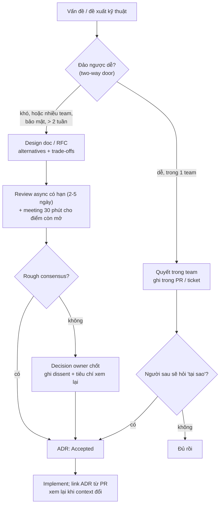
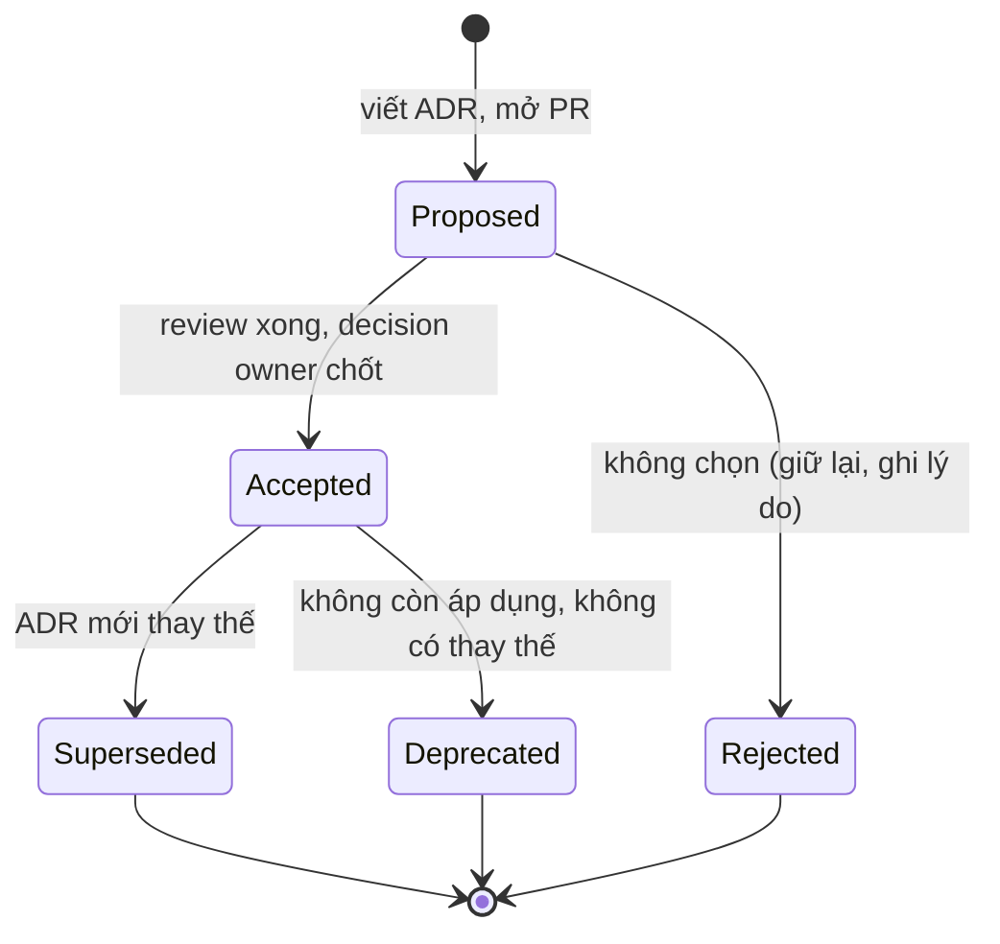

## Bối cảnh & vấn đề

Một dev mới vào team (minh hoạ) hỏi: "Sao mình dùng outbox polling cho event đơn hàng mà không gọi Kafka trực tiếp? Trông phức tạp quá." Không ai trả lời chắc chắn. Người quyết định đã nghỉ việc; lý do nằm trong một thread Slack 140 tin nhắn từ năm ngoái mà không ai tìm lại được. Hai tuần sau, dev mới đề xuất "đơn giản hoá" bằng cách bỏ outbox. Team mất một buổi họp dài để nhớ lại vì sao: Kafka lỗi giữa lúc ghi đơn và publish event đã làm mất event ba lần, kho không trừ tồn.

Cùng lúc, ở team bên cạnh, chiều ngược lại: mọi thay đổi, kể cả đổi thư viện logging, đều phải có design doc 10 trang, review hai tuần. Dev bắt đầu né bằng cách "làm nhỏ thôi, không cần doc", và những quyết định thật sự lớn trôi qua mà không ai xem.

Hai thất bại đối xứng: **không ghi gì** thì tổ chức mất trí nhớ và tranh luận lại cùng một vấn đề; **ghi mọi thứ bằng quy trình nặng** thì tài liệu thành bureaucracy và người ta lách. Bài này giải thích ba công cụ (design doc, RFC, ADR), ngưỡng nào cần cái nào, template có thể dùng ngay, quy trình review không thành bottleneck, cách đưa chúng vào một team đang quyết trong chat, và vì sao một RFC tốt là công cụ ảnh hưởng mạnh nhất khi bạn không có chức danh.

## Khái niệm

### Design doc

**Design doc** là tài liệu viết **trước khi build** một thay đổi đáng kể: vấn đề là gì, mục tiêu và phi mục tiêu, thiết kế đề xuất, **các phương án đã cân nhắc** và vì sao loại, rollout, rủi ro. Giá trị chính không nằm ở tài liệu mà ở **quá trình**: viết buộc tác giả nghĩ rõ; review cho phép người khác bắt lỗi thiết kế khi sửa còn rẻ (trên giấy thay vì sau 3 tuần code). Bài "Design Docs at Google" mô tả design doc là văn bản không chính thức, thường 10–20 trang cho dự án lớn, nhưng có thể chỉ 1–3 trang ("mini design doc") cho thay đổi nhỏ hơn (verify con số trong bài gốc).

Phần quan trọng nhất là **alternatives considered**: reviewer tin một đề xuất khi thấy tác giả đã nghiêm túc xem xét các cách khác và hiểu trade-off. Một design doc chỉ có một phương án thường là quyết định đã có sẵn, viết lại cho có.

### RFC

**RFC** (Request for Comments) là một design doc được đưa ra **lấy ý kiến rộng**, thường vượt khỏi team: nhiều team bị ảnh hưởng, hoặc đề xuất thay đổi chuẩn chung (ví dụ "chuẩn hoá error format cho mọi API", "chuyển search sang engine mới"). Tên mượn từ quy trình của IETF. Khác biệt với design doc chủ yếu là **phạm vi người review và quy trình**: có thời hạn lấy ý kiến, có người tổng hợp, có quyết định cuối được công bố. Nhiều công ty dùng hai từ thay nhau.

### ADR

**ADR** (Architecture Decision Record) là bản ghi **ngắn** (khoảng một trang) của **một** quyết định kiến trúc **đã chốt**, lưu cạnh code (`docs/adr/0007-use-outbox.md`). Format của Michael Nygard (2011): **Title**, **Status** (proposed, accepted, rejected, deprecated, superseded), **Context** (tình huống, ràng buộc, lực tác động), **Decision** (chúng ta sẽ làm gì), **Consequences** (được gì, mất gì, việc phải làm tiếp). ADR **bất biến** về nội dung: khi quyết định thay đổi, viết ADR mới "supersedes ADR 7", và ADR cũ chỉ đổi status thành "superseded by ADR 12". Kết quả là một **lịch sử quyết định** đọc được theo thời gian.

Giá trị: người mới hiểu "tại sao" mà không cần người cũ; team tránh tranh luận lại cùng vấn đề; khi bối cảnh đổi, bạn biết chính xác quyết định nào dựa trên giả định nào để xem lại.

### Design doc/RFC vs ADR

| | Design doc / RFC | ADR |
|---|---|---|
| Khi nào | Trước khi build, để chọn hướng | Sau khi chốt, để ghi lại |
| Độ dài | Vài trang tới hàng chục trang | ~1 trang |
| Nội dung | Vấn đề, mục tiêu, thiết kế, alternatives, rollout, rủi ro | Context, decision, consequences |
| Vòng đời | Draft → review → approved/rejected, sau đó thường không cập nhật | Bất biến; supersede bằng ADR mới |
| Nơi lưu | Wiki/Docs (dễ comment) | Trong repo, cạnh code |

Chúng bổ sung nhau: một design doc lớn thường sinh ra một hoặc vài ADR ("ADR 12: dùng outbox, xem RFC-034 cho phân tích đầy đủ"). Nhiều quyết định nhỏ hơn không cần design doc nhưng vẫn đáng một ADR.

### Ngưỡng: khi nào cần viết

Khung **one-way vs two-way door**: quyết định dễ đảo ngược (đổi thư viện nội bộ, implementation sau interface) thì quyết nhanh trong team, ghi chú ngắn trong PR. Quyết định khó đảo ngược hoặc ảnh hưởng rộng cần doc. Ngưỡng cụ thể nên được team viết ra, ví dụ cần design doc khi có ít nhất một điều sau: thay đổi **data model** hoặc **public API/contract** giữa team; ảnh hưởng **nhiều team**; có rủi ro **bảo mật/compliance/tiền**; tốn hơn khoảng **2 tuần** công; giới thiệu **công nghệ/hạ tầng mới** phải vận hành lâu dài. Cần ADR khi: một quyết định kiến trúc mà người sau sẽ hỏi "tại sao?".

**Interview angle:** câu "làm sao biết cái gì cần design doc" muốn nghe ngưỡng cụ thể dựa trên khả năng đảo ngược và phạm vi ảnh hưởng, không phải "mọi thứ" hay "khi cần".

### Review async và decision owner

Review hiệu quả: tác giả gửi doc, reviewer comment **async** trong thời hạn cố định (2–5 ngày làm việc), rồi một **meeting ngắn** (30 phút) chỉ để giải quyết các điểm còn mở, không để đọc doc. Mỗi doc có một **decision owner** (tech lead, architect, hoặc owner của hệ thống) chịu trách nhiệm chốt khi không đạt đồng thuận. Đồng thuận không có nghĩa là mọi người đồng ý: IETF mô tả "rough consensus" là mọi phản đối đã được **xem xét và trả lời**, không phải đã được thoả mãn. Người phản đối được ghi nhận trong doc/ADR.

Fowler mô tả một biến thể phi tập trung: **advice process**: ai cũng có thể ra quyết định kiến trúc, miễn là đã **hỏi ý kiến** những người bị ảnh hưởng và những người có chuyên môn, và ghi lại bằng ADR. Mô hình này hợp với tổ chức muốn tránh kiến trúc sư thành bottleneck.

### Ảnh hưởng không cần chức danh

Khi không có quyền quyết định chính thức, ảnh hưởng đến từ ba nguồn: **uy tín** (bạn giao việc tốt, giúp người khác, đúng nhiều lần), **chất lượng lập luận** (đề xuất viết rõ, có dữ liệu, có prototype, thừa nhận trade-off), và **quan hệ** (hiểu ưu tiên của từng team, tìm lợi ích chung, có đồng minh). RFC là công cụ ghép cả ba: nó buộc lập luận phải rõ, mời phản biện sớm (người được hỏi ý kiến sớm ít phản đối muộn), và để lại bằng chứng công khai cho đóng góp của bạn.

## Cơ chế hoạt động

### Từ vấn đề tới quyết định được ghi lại



Sơ đồ có hai đường vào ADR: từ design doc (quyết định lớn) và từ quyết định nhỏ mà vẫn đáng nhớ. Đường thứ hai là thứ hay bị quên nhất: rất nhiều "tại sao?" của người mới là về quyết định không đủ lớn để có design doc (vì sao dùng thư viện A thay B, vì sao tiền lưu bằng integer cents). Bước V đảm bảo không có doc nào treo mãi chờ đồng thuận: có hạn, có người chốt.

### Vòng đời một ADR



ADR bị **rejected** vẫn được giữ: "chúng ta đã xem xét GraphQL cho API public năm 2025 và không chọn vì..." là thông tin rất có giá trị khi ai đó đề xuất lại. ADR **superseded** cũng không bị xoá hay sửa nội dung; chỉ status đổi và trỏ sang ADR mới, nên lịch sử quyết định luôn đọc được.

## Ví dụ thực tế

### 1. Template ADR (Nygard + vài trường thực dụng)

```markdown
# 7. Dùng outbox cho event đơn hàng

Date: 2026-10-01
Deciders: @lead, @payments-owner
Consulted: @inventory-team, @platform

## Status

Accepted

## Context

Đơn hàng ghi vào Postgres rồi publish event lên Kafka trong cùng request. Khi Kafka chậm
hoặc lỗi giữa hai bước, đơn đã lưu nhưng event mất (3 lần trong Q2), kho không trừ tồn.
Ràng buộc: không thêm hạ tầng mới trong quý này; team 5 người vận hành.

## Decision

Ghi event vào bảng `outbox` trong cùng transaction với đơn hàng; một relay đọc outbox và
publish (at-least-once). Consumer idempotent theo `event_id`.

## Consequences

+ Không mất event khi Kafka lỗi; đơn và event nhất quán.
- Thêm độ trễ ~1–2 s; thêm process relay phải vận hành và giám sát.
- Consumer phải dedupe. Việc phải làm: metric `outbox_lag_seconds`, alert > 60 s.
Xem lại khi: throughput > 2.000 đơn/phút hoặc team có hạ tầng CDC.
```

"Xem lại khi" là trường nhỏ nhưng mạnh: nó ghi lại **giả định** mà quyết định dựa vào, để người sau biết khi nào nên mở lại cuộc thảo luận thay vì đoán.

### 2. Template design doc / RFC

```markdown
# RFC-034: Chuẩn hoá error response cho mọi API public
Author: @you · Reviewers: @api-team, @mobile, @web · Decision owner: @platform-lead
Status: In review (comments trước 2026-10-08) · Est. effort: 3 tuần (2 team)

## 1. Context & problem
3 format lỗi khác nhau giữa các service; mobile có 400 dòng code map lỗi; 12% ticket
support liên quan "lỗi không rõ". Tại sao bây giờ: API public v2 ra mắt Q1.
## 2. Goals / Non-goals
Goals: một format (RFC 9457 problem details), mã lỗi ổn định cho client. Non-goals: đổi
HTTP status hiện có; i18n message.
## 3. Proposed design
Shape, mapping từ exception, middleware dùng chung, ví dụ request/response. (diagram)
## 4. Alternatives considered
A. Giữ nguyên, viết adapter ở client — rẻ, nhưng mỗi client lặp lại.
B. Format tự định nghĩa — linh hoạt, nhưng không có tool/thư viện sẵn.
C. RFC 9457 (đề xuất) — chuẩn, có thư viện; cần mapping mã lỗi riêng trong `type`.
## 5. Rollout & migration
Header `Accept` opt-in → client chuyển → mặc định mới → bỏ format cũ (timeline, đo usage).
Backward compatibility, rollback plan.
## 6. Risks, security, observability, cost
Không lộ stack trace/PII trong `detail`; metric theo `type`.
## 7. Open questions
Mã lỗi đặt theo domain hay theo service?
```

Đọc trong 15–20 phút là mục tiêu: dài hơn thì reviewer đọc lướt và comment ở phần mở đầu. Phần 4 được viết **trước** phần 3 trong đầu tác giả: nếu bạn không viết được hai phương án thay thế có lý, có thể bạn chưa hiểu bài toán đủ.

### 3. Tool ADR nhỏ: tạo, lint, supersede, index

Chạy thật với Node 24 trong một repo scratch:

```ts
// adr.ts — tool ADR tối giản: new | supersede <n> | lint | index. ADR nằm ở docs/adr/NNNN-slug.md
import { readdirSync, readFileSync, writeFileSync, mkdirSync, existsSync } from "node:fs";
import { join } from "node:path";
const DIR = "docs/adr";
const STATUSES = ["Proposed", "Accepted", "Rejected", "Deprecated", "Superseded"];
const REQUIRED = ["## Status", "## Context", "## Decision", "## Consequences"];
const list = () => (existsSync(DIR) ? readdirSync(DIR).filter((f) => /^\d{4}-.*\.md$/.test(f)).sort() : []);
const slug = (t: string) => t.toLowerCase().normalize("NFD").replace(/[̀-ͯ]/g, "").replace(/đ/g, "d").replace(/[^a-z0-9]+/g, "-").replace(/^-|-$/g, "");
const read = (f: string) => readFileSync(join(DIR, f), "utf8");
const status = (src: string) => src.split("## Status")[1]?.trim().split("\n")[0] ?? "";

function create(title: string, extra = ""): string {
  mkdirSync(DIR, { recursive: true });
  const n = String(list().length + 1).padStart(4, "0");
  const file = `${n}-${slug(title)}.md`;
  writeFileSync(join(DIR, file), `# ${Number(n)}. ${title}\n\nDate: 2026-10-01\nDeciders: @lead, @owner\n\n## Status\n\nProposed${extra}\n\n## Context\n\nTODO\n\n## Decision\n\nTODO\n\n## Consequences\n\nTODO\n`);
  return file;
}
const [cmd, ...args] = process.argv.slice(2);
if (cmd === "new") console.log("created", create(args.join(" ")));
if (cmd === "supersede") {
  const old = list().find((f) => f.startsWith(args[0].padStart(4, "0")))!;
  const file = create(args.slice(1).join(" "), `\n\nSupersedes [ADR ${Number(args[0])}](${old})`);
  const src = read(old).replace(/## Status\n\n[^\n]+/, `## Status\n\nSuperseded by [ADR ${Number(file.slice(0, 4))}](${file})`);
  writeFileSync(join(DIR, old), src);
  console.log("created", file, "and marked", old, "as superseded");
}
if (cmd === "lint") {
  let bad = 0;
  for (const f of list()) {
    const src = read(f), errs: string[] = [];
    for (const h of REQUIRED) if (!src.includes(h)) errs.push(`missing "${h}"`);
    if (!STATUSES.some((s) => status(src).startsWith(s))) errs.push(`status "${status(src)}" not in ${STATUSES.join("/")}`);
    if (/^TODO$/m.test(src) && status(src).startsWith("Accepted")) errs.push("accepted ADR still has TODO sections");
    if (errs.length) { bad++; console.log(`✗ ${f}: ${errs.join("; ")}`); } else console.log(`✓ ${f}`);
  }
  process.exitCode = bad ? 1 : 0;
}
if (cmd === "index") for (const f of list()) console.log(`| [${read(f).split("\n")[0].replace("# ", "")}](${f}) | ${status(read(f)).replace(/\]\(.*?\)/, "]")} |`);
```

```text
$ node adr.ts new Dùng outbox cho event đơn hàng
created 0001-dung-outbox-cho-event-don-hang.md
$ node adr.ts new Chọn PostgreSQL RLS cho tenant isolation
created 0002-chon-postgresql-rls-cho-tenant-isolation.md
# (điền nội dung ADR 1, đổi cả hai sang Accepted; ADR 2 quên điền)
$ node adr.ts lint
✓ 0001-dung-outbox-cho-event-don-hang.md
✗ 0002-chon-postgresql-rls-cho-tenant-isolation.md: accepted ADR still has TODO sections
exit=1
$ node adr.ts supersede 1 Dùng CDC (logical replication) thay cho outbox polling
created 0003-dung-cdc-logical-replication-thay-cho-outbox-polling.md and marked 0001-dung-outbox-cho-event-don-hang.md as superseded
$ head -9 docs/adr/0001-*.md
# 1. Dùng outbox cho event đơn hàng

Date: 2026-10-01
Deciders: @lead, @owner

## Status

Superseded by [ADR 3](0003-dung-cdc-logical-replication-thay-cho-outbox-polling.md)

$ node adr.ts index
| [1. Dùng outbox cho event đơn hàng](0001-dung-outbox-cho-event-don-hang.md) | Superseded by [ADR 3] |
| [2. Chọn PostgreSQL RLS cho tenant isolation](0002-chon-postgresql-rls-cho-tenant-isolation.md) | Accepted |
| [3. Dùng CDC (logical replication) thay cho outbox polling](0003-dung-cdc-logical-replication-thay-cho-outbox-polling.md) | Proposed |
```

Ba thứ tool này làm thay con người: đánh số và đặt tên nhất quán (kể cả bỏ dấu tiếng Việt khỏi slug), chặn ADR "Accepted" mà nội dung còn TODO (lint chạy trong CI), và giữ liên kết hai chiều khi supersede. Ngoài thực tế có sẵn `adr-tools` (shell) và template MADR; tool tự viết chỉ để thấy cơ chế, chọn cái nhẹ nhất team chịu dùng.

### 4. Đưa ADR vào team đang quyết trong chat

Kế hoạch 6 tuần (minh hoạ), trả lời câu design "introduce ADRs in a team that decides ad hoc in chat":

| Tuần | Việc | Output kiểm được |
|---|---|---|
| 1 | Tự viết 3 ADR cho quyết định gần đây (outbox, RLS, integer cents) làm mẫu; thêm `docs/adr/` + template | PR với 3 ADR, team review như code |
| 1 | Đề xuất ngưỡng một trang: khi nào ADR, khi nào design doc | Một đoạn trong CONTRIBUTING |
| 2 | Thêm mục "ADR liên quan" vào PR template; lint ADR trong CI | Template + check |
| 2–4 | Mỗi khi chat có quyết định kiến trúc: "mình viết ADR 10 phút nhé" và tự viết bản nháp | 3–5 ADR mới |
| 4 | Thêm "đọc 10 ADR gần nhất" vào checklist onboarding | Onboarding doc |
| 6 | Retro: ADR nào được tham chiếu? tranh luận nào không lặp lại? người mới thấy có ích? | Điều chỉnh template/ngưỡng |

Chìa khoá là **bạn làm trước**: đề xuất quy trình mà chưa có ví dụ thì bị coi là bureaucracy; ba ADR tốt cho quyết định mọi người còn nhớ thì tự thuyết phục. Đo giá trị bằng hành vi: số lần ADR được link trong PR/thảo luận, câu hỏi "tại sao" của người mới được trả lời bằng link.

Chống bottleneck (followUp "design docs become a bottleneck"): ngưỡng rõ ràng để việc nhỏ **không cần** doc; timebox review (comment trong N ngày, im lặng là đồng ý: "lazy consensus"); decision owner được chỉ định ngay khi mở doc; cho phép **mini doc** một trang; và đo thời gian từ mở doc tới quyết định như một metric của team.

### 5. Ảnh hưởng không cần quyền: từ RFC tới pilot

Kịch bản (minh hoạ): bạn là senior ở một team, muốn ba team cùng chuẩn hoá error format (RFC-034 ở trên). Không ai báo cáo cho bạn.

1. **Hiểu động lực từng team**: mobile đau vì code map lỗi; web ít đau hơn; platform lo chi phí migration. Nói chuyện 1-1 trước khi viết.
2. **Viết RFC có dữ liệu**: 400 dòng code map lỗi ở mobile, 12% ticket support; alternatives thật sự; chi phí migration ước lượng.
3. **Mời phản biện sớm**: gửi bản nháp cho người có khả năng phản đối nhất (platform) trước khi công bố rộng; sửa theo góp ý của họ, ghi nhận tên họ.
4. **Prototype + pilot**: tự làm middleware cho một service của team bạn, đo kết quả (mobile xoá được bao nhiêu dòng map lỗi cho service đó).
5. **Chia sẻ kết quả, ghi công**: demo ngắn, cảm ơn team mobile đã thử; đề xuất rollout theo từng service.
6. **Chấp nhận điều chỉnh**: platform muốn giữ một trường cũ cho tương thích; đồng ý, ghi vào ADR.

Khi nó không hiệu quả (followUp "a time this didn't work"): câu chuyện tốt thường nói về một lần bạn đề xuất quá to, quá sớm, không có pilot, hoặc bỏ qua động lực của một team quan trọng, và bạn đã học gì (bắt đầu nhỏ hơn, nói chuyện 1-1 trước, đo trước khi đề xuất).

## Trade-offs & lựa chọn thay thế

| Cách ra quyết định | Ưu | Nhược | Hợp với |
|---|---|---|---|
| Quyết trong chat/call | Nhanh nhất | Mất trí nhớ, loại người khác timezone | Quyết định two-way door nhỏ |
| PR description | Gắn với code, có review | Khó tìm lại theo chủ đề | Quyết định nằm trong một PR |
| ADR | Ngắn, cạnh code, lịch sử rõ | Cần kỷ luật viết | Mọi quyết định kiến trúc đáng nhớ |
| Design doc trong team | Bắt lỗi thiết kế sớm | Tốn thời gian viết/review | Thay đổi lớn trong team |
| RFC rộng | Đồng thuận nhiều team, ảnh hưởng không cần quyền | Chậm, có thể bị kéo dài | Chuẩn chung, thay đổi liên team |
| Architecture review board | Nhất quán toàn tổ chức | Bottleneck, xa thực tế | Tổ chức lớn, compliance |
| Advice process + ADR | Phi tập trung, nhanh, vẫn có trace | Cần văn hoá tin tưởng và kỷ luật hỏi ý kiến | Tổ chức muốn trao quyền cho team |

Chọn theo **khả năng đảo ngược × phạm vi ảnh hưởng**. Mặc định nhẹ: quyết trong team + ADR. Design doc khi vượt ngưỡng. RFC khi nhiều team. Review board chỉ khi tổ chức thật sự cần nhất quán bắt buộc (bảo mật, compliance), và kể cả lúc đó, nên dùng advice process cho phần còn lại.

## Edge cases & failure modes

- **Design doc viết sau khi đã code xong**: thành tài liệu hợp thức hoá, không còn giá trị bắt lỗi. Viết khi còn rẻ để đổi hướng; prototype nhỏ là được, nhưng đừng xong 80% rồi mới hỏi ý kiến.
- **Doc chỉ có một phương án**: reviewer không biết tác giả đã cân nhắc gì. Yêu cầu tối thiểu hai alternatives thật sự (kể cả "không làm gì").
- **Review không có hạn**: doc treo hàng tuần, tác giả bỏ cuộc hoặc làm luôn. Timebox + decision owner.
- **Bikeshedding trong review doc**: 40 comment về tên field, 0 comment về rollout. Tác giả liệt kê "câu hỏi mình muốn được góp ý" ở đầu doc.
- **ADR bị sửa nội dung thay vì supersede**: mất lịch sử "tại sao lúc đó quyết vậy". Lint trong CI, review ADR như code.
- **ADR quá chung chung**: "Chúng ta sẽ dùng microservices." không có context, không có consequences. Một ADR = một quyết định cụ thể, có trade-off.
- **ADR không ai đọc**: lưu ở chỗ không ai tìm. Để trong repo, link từ PR và từ code (`// see ADR 7`), đưa vào onboarding.
- **RFC bị dùng để trì hoãn**: người phản đối yêu cầu "viết thêm phân tích" mãi. Decision owner và hạn chót.
- **Quyết định ngầm của người có quyền**: lead quyết trong chat, rồi yêu cầu người khác viết ADR hợp thức hoá. ADR vẫn có giá trị, nhưng nên ghi "Consulted: (không ai)" một cách trung thực để lần sau làm khác.
- **Quá nhiều ADR vụn**: mỗi thư viện nhỏ một ADR. Ngưỡng: người sau có hỏi "tại sao" không?

## Pitfalls

- ❌ Quyết định kiến trúc chỉ nằm trong thread chat → ✅ ADR một trang trong repo, link từ PR.
- ❌ Design doc 10 trang cho mọi thay đổi → ✅ ngưỡng theo khả năng đảo ngược, phạm vi, rủi ro, công sức; mini doc khi vừa đủ.
- ❌ Design doc không có alternatives → ✅ ít nhất hai phương án thật sự + trade-off; đó là phần reviewer tin nhất.
- ❌ Sửa ADR cũ khi quyết định đổi → ✅ ADR mới supersede; ADR cũ chỉ đổi status.
- ❌ Review doc không hạn, không người chốt → ✅ timebox 2–5 ngày, meeting 30 phút cho điểm mở, decision owner, ghi dissent.
- ❌ Đề xuất quy trình ADR mà chưa có ví dụ → ✅ tự viết 2–3 ADR mẫu trước, đo giá trị bằng hành vi.
- ❌ Ảnh hưởng bằng cách tranh luận to hơn → ✅ RFC có dữ liệu, mời phản biện sớm, pilot nhỏ, ghi công người khác.

## Tóm tắt

- **Design doc/RFC** viết **trước** khi build để chọn hướng (vấn đề, goals/non-goals, thiết kế, **alternatives**, rollout, rủi ro); **ADR** ghi **một** quyết định **đã chốt** (context, decision, consequences), ngắn, trong repo, bất biến.
- Ngưỡng cần doc: khó đảo ngược (data model, public API), nhiều team, bảo mật/tiền, > ~2 tuần, hạ tầng mới. Cần ADR: khi người sau sẽ hỏi "tại sao".
- Review: async có hạn + meeting ngắn + decision owner; rough consensus = mọi phản đối đã được trả lời, không phải đã được thoả mãn.
- Vòng đời ADR: proposed → accepted/rejected → deprecated/superseded; giữ cả ADR bị rejected.
- Đưa ADR vào team: tự viết mẫu, ngưỡng một trang, PR template + lint, onboarding, retro; chống bottleneck bằng ngưỡng, timebox, lazy consensus.
- Ảnh hưởng không cần quyền: uy tín + lập luận có dữ liệu + quan hệ; RFC, phản biện sớm, pilot, chia sẻ kết quả, ghi công.
