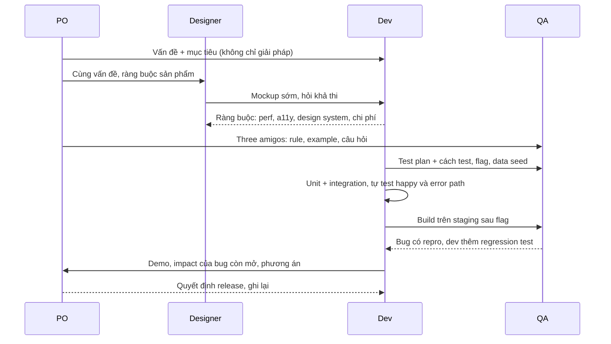
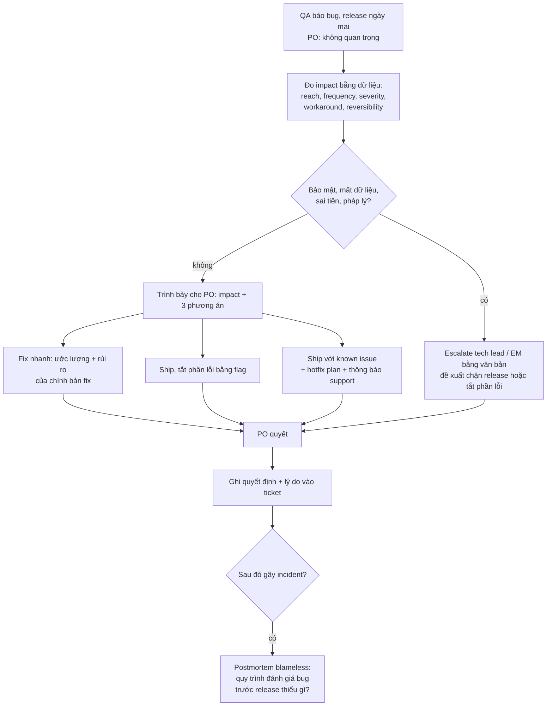

## Bối cảnh & vấn đề

Một team phân tán điển hình (minh hoạ): dev ở TP.HCM, PO ở Berlin, QA ở New York, designer làm việc với hai team khác cùng lúc. Một ngày bình thường:

- 15:30 giờ HCM, PO nhắn: "Dashboard cần real-time cho mọi tenant, khách hàng lớn yêu cầu." Dev biết query tổng hợp hiện tại mất 8 giây và chạy trên DB chính.
- Đêm đó, QA ở New York tìm ra bug: voucher phần trăm áp sai cho đơn bằng USD. Release là sáng mai giờ HCM. PO trả lời QA "not important, edge case". QA ghi chú vào ticket; dev đọc được lúc 8:00 sáng, hai tiếng trước giờ release.
- Designer gửi mockup một dropdown tự vẽ có animation, không dùng được bằng bàn phím.

Không tình huống nào là bài toán thuần kỹ thuật, và không tình huống nào giải quyết được bằng cách "code giỏi hơn". Chúng đòi hỏi biết **ai quyết cái gì**, trình bày **rủi ro bằng ngôn ngữ của người quyết**, và giao tiếp sao cho thông tin vượt qua được khoảng cách 12 múi giờ mà không rơi rớt.

Bài này đi qua từng mối quan hệ (PO, QA, designer), các công cụ cụ thể (impact framing có dữ liệu, three amigos, decision log, handoff template), cách làm việc async giữa các timezone (kèm script tính giờ chung có DST), và khung kể chuyện cho hai câu hỏi CV-level về ownership end-to-end và làm việc trong team quốc tế.

## Khái niệm

### Ai quyết cái gì

Hợp tác trơn tru bắt đầu từ việc rõ **quyền quyết định**:

- **PO** quyết **what và why**: vấn đề nào cần giải, ưu tiên, phạm vi, trade-off sản phẩm (ship có known issue hay dời ngày).
- **Engineering** quyết **how** và chịu trách nhiệm nói rõ **rủi ro kỹ thuật**: chi phí, khả năng, bảo mật, vận hành. Dev không được im lặng về rủi ro, và cũng không được tự quyết thay PO một trade-off sản phẩm.
- **QA** chịu trách nhiệm về **chiến lược kiểm thử và bằng chứng chất lượng**, không phải là "người cho phép release".
- **Designer** quyết **trải nghiệm**, trong ràng buộc mà engineering nêu ra.

Ngoại lệ quan trọng: rủi ro **bảo mật, mất dữ liệu, pháp lý** không phải là "trade-off sản phẩm" để PO quyết một mình. Đó là thứ phải escalate lên tech lead/engineering manager, bằng văn bản. Các framework như **DACI** (Driver, Approver, Contributors, Informed) giúp ghi rõ vai trò cho từng quyết định khi không hiển nhiên.

### Impact framing: nói rủi ro bằng ngôn ngữ của người quyết

"Bug này nghiêm trọng" là ý kiến. "Bug này ảnh hưởng 2,7% đơn hàng (1.620 đơn/30 ngày), ở cả 40 tenant, tập trung ở 3 tenant lớn nhất; mỗi đơn bị giảm giá dư khoảng X; không có workaround phía khách" là **impact**. Năm chiều để mô tả: **reach** (bao nhiêu user/tenant), **frequency** (bao lâu một lần), **severity** (mất tiền, mất dữ liệu, bảo mật, hay chỉ khó chịu), **workaround** (có cách né không), **reversibility** (sửa sau được không, hay dữ liệu sai đã lan ra hệ thống khác). Kèm theo luôn là **các phương án** và chi phí của mỗi phương án, để PO chọn được.

### Requirement vs vấn đề thật

Requirement là **một giải pháp** mà ai đó đã nghĩ ra cho một vấn đề. "Real-time cho mọi tenant" thường là cách nói của "khách hàng lớn muốn thấy đơn mới mà không phải bấm refresh". Câu hỏi đúng: **ai** cần, **để làm gì**, **tươi tới mức nào là đủ** (1 giây? 1 phút? 15 phút?), cho **bao nhiêu** tenant. Câu trả lời thường mở ra phương án rẻ hơn nhiều với 95% giá trị.

### Three amigos và shift-left

**Three amigos**: trước khi code, PO/BA (góc nhìn nghiệp vụ), dev (góc nhìn kỹ thuật) và QA (góc nhìn kiểm thử) cùng xem một story trong 15–30 phút. **Example mapping** (Matt Wynne) là format phổ biến: viết **rule** (quy tắc nghiệp vụ), mỗi rule vài **example** cụ thể, và các **câu hỏi** chưa trả lời được. Output là acceptance criteria dưới dạng ví dụ, cũng là test case.

**Shift-left** nghĩa là đưa kiểm thử về sớm hơn trong vòng đời: QA tham gia lúc refinement thay vì nhận build ở cuối. Lý do: lỗi requirement phát hiện ở refinement tốn vài phút; ở QA tốn vài ngày; ở production tốn incident. Dev tự test kỹ (unit, integration, happy + error path) trước khi chuyển; QA không phải lưới an toàn đầu tiên.

**Interview angle:** câu "làm việc với QA thay vì throw over the wall" muốn nghe: QA vào sớm, dev tự chịu trách nhiệm chất lượng, chia trách nhiệm automation rõ, và bug được biến thành regression test.

### Làm việc với designer

Mockup là **một giải pháp** cho một mục tiêu UX. Khi thiết kế đắt hoặc không khả thi, hỏi mục tiêu ("animation này giúp user hiểu điều gì?"), nêu **ràng buộc thật** (performance, responsive, accessibility, design system có sẵn, thời gian), và đưa **phương án** đạt phần lớn trải nghiệm với chi phí thấp hơn, tốt nhất là một prototype nhanh để cùng nhìn. Quyết định sớm, trước khi code, và ghi lại.

**Accessibility** không phải sở thích để thương lượng: WCAG là chuẩn được nhiều quy định pháp lý tham chiếu, và một component không dùng được bằng bàn phím loại bỏ một nhóm người dùng thật. Khi custom component phá accessibility, phương án thường là dùng pattern có sẵn trong WAI-ARIA Authoring Practices (combobox, listbox) hoặc component native, giữ được phần lớn giao diện mà designer muốn.

### Async-first

Trong team nhiều timezone, **async-first** nghĩa là mặc định giao tiếp bằng văn bản có thể đọc và trả lời bất cứ lúc nào, và chỉ dùng họp cho thứ thật sự cần đồng bộ. Nguyên tắc cụ thể:

- **Viết để người đọc hành động được mà không cần hỏi lại**: context, câu hỏi cụ thể, những gì đã thử, deadline cần trả lời.
- **Quyết định được ghi lại** ở nơi tìm được (decision log, ADR, ticket), không chỉ trong call.
- **Overlap hours** (giờ chung) dành cho việc cần đồng bộ: refinement, bất đồng, pairing. Giờ chung là tài nguyên khan hiếm, đừng tiêu vào status update.
- **Handoff** cuối ngày: trạng thái, blocker, câu hỏi, để người ở timezone kia bắt tay vào ngay.
- **Record** demo và meeting quan trọng cho người không dự được.

### Giao tiếp qua ngôn ngữ và văn hoá

Trong team mà nhiều người dùng tiếng Anh như ngôn ngữ thứ hai: viết câu ngắn và rõ, tránh thành ngữ; xác nhận hiểu bằng cách **tóm tắt lại** ("để mình tóm tắt: bạn muốn X trước thứ Năm, đúng không?"); nói thẳng nhưng lịch sự; và với tin xấu hoặc bất đồng, cân nhắc kênh có giọng nói. Phần feedback qua văn hoá được đi sâu ở [bài 6](/tracks/engineering-practices/learn/review-feedback-disagreement).

## Cơ chế hoạt động

### Một feature đi qua các vai trò



Đọc sơ đồ theo thời gian: QA và designer xuất hiện **trước** khi code, không phải sau. Điểm chạm cuối (Dev → PO) mang **impact + phương án**, không chỉ "có 3 bug". Và mỗi quyết định được ghi lại, vì người tham gia ở ba timezone khác nhau.

### Bug trước release mà PO nói không quan trọng



Hai nhánh khác nhau về **ai quyết**: nhánh "không" là trade-off sản phẩm, PO quyết sau khi có đủ thông tin; nhánh "có" không để PO quyết một mình. Bước H biến một cuộc tranh luận thành một quyết định có chủ: nếu sau đó có incident (followUp "PO ship và bug gây incident"), không ai cần đi tìm "ai đã nói gì", và postmortem tập trung vào câu hỏi đúng: quy trình đánh giá impact trước release có thiếu dữ liệu không, chứ không phải "lỗi của PO". Không "em đã nói rồi"; tham gia xử lý incident, rồi đề xuất cải tiến (ví dụ ngưỡng impact bắt buộc chặn release).

## Ví dụ thực tế

### 1. Biến "không quan trọng" thành dữ liệu

Bug: voucher phần trăm áp sai cho đơn không phải VND. Thay vì tranh luận, chạy query trên dữ liệu (ở đây là dữ liệu mô phỏng 30 ngày trong SQLite, Node 24; ngoài thực tế là read replica hoặc warehouse):

```ts
// impact.ts — "bug này nghiêm trọng không?" trả lời bằng dữ liệu 30 ngày (dữ liệu mô phỏng, seed cố định)
import { DatabaseSync } from "node:sqlite";
const db = new DatabaseSync(":memory:");
db.exec(`CREATE TABLE orders (id INTEGER PRIMARY KEY, tenant_id TEXT, currency TEXT, voucher TEXT, total_cents INTEGER, created_at TEXT)`);
// ... sinh 60.000 đơn cho 40 tenant: vài tenant lớn chiếm phần lớn đơn và bán quốc tế nhiều hơn
const r = db.prepare(`
  SELECT count(*) AS orders,
         count(DISTINCT tenant_id) AS tenants,
         round(100.0 * count(*) / (SELECT count(*) FROM orders), 2) AS pct_orders,
         sum(total_cents) / 100 AS gmv_affected
    FROM orders WHERE voucher IS NOT NULL AND currency <> 'VND'`).get();
console.log("affected (30 days):", { ...r });
console.log("top tenants:", db.prepare(`
  SELECT tenant_id, count(*) AS n FROM orders WHERE voucher IS NOT NULL AND currency <> 'VND'
   GROUP BY tenant_id ORDER BY n DESC LIMIT 3`).all().map((x) => `${x.tenant_id}=${x.n}`).join(", "));
```

```text
$ node impact.ts
affected (30 days): { orders: 1620, tenants: 40, pct_orders: 2.7, gmv_affected: 27536789 }
top tenants: t-01=594, t-02=233, t-03=205
```

"Edge case" hoá ra là 2,7% đơn hàng, ở **mọi** tenant, và 1/3 số đơn bị ảnh hưởng thuộc về một tenant lớn nhất. Tin nhắn cho PO (minh hoạ):

```markdown
**Bug VOUCHER-88 (voucher % sai với đơn USD): đề xuất không ship phần voucher USD ngày mai.**
Impact (30 ngày gần nhất): 1.620 đơn (2,7%), cả 40 tenant; t-01 chiếm 594 đơn.
Severity: sai tiền — mỗi đơn giảm dư, khách không thấy lỗi nên không báo; sửa sau phải
đối soát và có thể phải thu lại từ khách. Workaround: không có ở phía khách.
Phương án:
A. Fix nhanh (ước 3–4 giờ + test): rủi ro thấp, fix nằm trong hàm làm tròn; release trễ ~nửa ngày.
B. Ship đúng giờ, tắt voucher cho đơn non-VND bằng flag `voucher_multi_currency` (5 phút).
C. Ship nguyên trạng + hotfix trong 2 ngày (không khuyến nghị: sai tiền tích luỹ).
Đề xuất của mình: B ngay, A trong ngày mai. Cần PO chọn trước 10:00 giờ HCM.
```

Tin nhắn có đủ năm chiều impact, ba phương án kèm chi phí, một đề xuất, và **hạn trả lời** (vì PO ở timezone khác). Và vì đây là sai tiền, nếu PO vẫn chọn C, dev nên đưa tech lead vào cuộc (nhánh escalate), bằng văn bản và không phải sau lưng PO.

### 2. "Real-time cho mọi tenant" và ràng buộc DB

Hỏi lại: "Khách hàng lớn cần thấy gì, tươi tới mức nào?" Câu trả lời (minh hoạ): "Họ muốn thấy đơn mới trong vài phút để điều phối giao hàng; hiện tại phải refresh và chờ 8 giây." Định lượng ràng buộc: query tổng hợp 8 giây trên DB chính; 40 tenant × 50 người dùng × polling mỗi 5 giây ≈ 400 query/giây, gấp nhiều lần năng lực DB. Phương án:

| Phương án | Độ tươi | Chi phí | Rủi ro |
|---|---|---|---|
| A. Polling query hiện tại mỗi 5 s | ~5 s | Gần 0 dev, DB quá tải | Ảnh hưởng mọi tenant |
| B. Materialized view / bảng tổng hợp refresh mỗi 1 phút + cache | ~1 phút | 3–4 ngày | Thấp |
| C. Event từ đơn hàng → bảng read model cập nhật tăng dần + push qua SSE | vài giây | 2–3 tuần | Trung bình, thêm thành phần vận hành |
| D. B cho mọi tenant, C chỉ cho gói enterprise (phase 2) | 1 phút / vài giây | 4 ngày + 2–3 tuần sau | Thấp, theo phase |

Giải thích trade-off cho người không kỹ thuật (followUp): bắt đầu bằng **kết quả** họ quan tâm ("đơn mới hiện trong 1 phút mà không cần refresh"), dùng một ẩn dụ khi giúp được ("thay vì mỗi người tự đi đếm kho mỗi 5 giây, kho dán bảng số lượng cập nhật mỗi phút"), so sánh phương án bằng **thời gian, chi phí, rủi ro**, và nói rõ **đề xuất** của mình. Rồi quyết cùng PO, ghi lại, và thống nhất **tiêu chí thành công đo được** (ví dụ "p95 độ trễ hiển thị đơn mới < 90 giây, DB CPU không tăng quá 10%").

### 3. Example mapping với QA

```text
Story: Áp voucher phần trăm khi checkout
Rule 1: Giảm % trên subtotal, trước phí ship
  - Ex: subtotal 500.000 VND, PCT10 → giảm 50.000
  - Ex: subtotal 19,99 USD, PCT10 → giảm 2,00 USD (làm tròn half-up đến cent)
Rule 2: Không giảm quá trần của voucher
  - Ex: subtotal 5.000.000 VND, PCT10 trần 200.000 → giảm 200.000
Rule 3: Một đơn chỉ áp một voucher, retry không áp lại
  - Ex: double click "Áp dụng" → giảm một lần
Questions (chưa trả lời):
  ? Làm tròn theo currency của tenant hay của đơn?  → PO trả lời trước refinement sau
  ? Voucher có áp cho phí ship quốc tế không?
```

Ví dụ thứ hai của Rule 1 chính là bug VOUCHER-88: nếu buổi example mapping này diễn ra trước khi code, bug đã được bắt ở dạng một câu hỏi, không phải một incident. Đó là lý do QA cần vào sớm. Khi QA liên tục tìm bug ở cùng một vùng (followUp), đừng chỉ sửa từng bug: xem vùng đó thiếu test loại nào (thường là thiếu test tích hợp hoặc thiếu ví dụ cho một rule), thêm three amigos cho story ở vùng đó, xem có phải vùng là hotspot cần refactor không ([bài 7](/tracks/engineering-practices/learn/tech-debt-refactoring)), và pair dev với QA một buổi để dev hiểu QA test gì.

### 4. Overlap hours giữa ba timezone, có DST

Script tính giờ làm việc chung (9:00–18:00 local) bằng `Intl.DateTimeFormat`, chạy thật trên Node 24 cho ba ngày quanh mùa đổi giờ 2026 (Mỹ đổi ngày 8/3, châu Âu ngày 29/3):

```ts
// overlap.ts — giờ làm việc chung của team phân tán (9:00–18:00 local), có tính DST
const team = [
  { who: "HCM dev", tz: "Asia/Ho_Chi_Minh" },
  { who: "Berlin PO", tz: "Europe/Berlin" },
  { who: "NY QA", tz: "America/New_York" },
];
// offset (phút) của một timezone tại một thời điểm UTC
function offsetMin(tz: string, at: Date): number {
  const parts = new Intl.DateTimeFormat("en-US", { timeZone: tz, hourCycle: "h23", year: "numeric", month: "2-digit", day: "2-digit", hour: "2-digit", minute: "2-digit" }).formatToParts(at);
  const g = (t: string) => Number(parts.find((p) => p.type === t)!.value);
  return (Date.UTC(g("year"), g("month") - 1, g("day"), g("hour"), g("minute")) - at.getTime()) / 60000;
}
const fmt = (m: number) => `${String(Math.floor(((m % 1440) + 1440) % 1440 / 60)).padStart(2, "0")}:${String(((m % 60) + 60) % 60).padStart(2, "0")}`;
for (const day of ["2026-03-04", "2026-03-11", "2026-03-31"]) {
  const noonUtc = new Date(`${day}T12:00:00Z`);
  const windows = team.map((p) => { const off = offsetMin(p.tz, noonUtc); return { ...p, off, start: 9 * 60 - off, end: 18 * 60 - off }; });
  console.log(`${day}: ` + windows.map((w) => `${w.who} UTC${w.off >= 0 ? "+" : ""}${w.off / 60}`).join(", "));
  for (const [a, b] of [[0, 1], [1, 2], [0, 2]]) {
    const s = Math.max(windows[a].start, windows[b].start), e = Math.min(windows[a].end, windows[b].end);
    console.log(`   ${windows[a].who} ↔ ${windows[b].who}: ${e > s ? `${((e - s) / 60).toFixed(1)} h (${fmt(s + windows[a].off)}–${fmt(e + windows[a].off)} giờ ${windows[a].who.split(" ")[0]})` : "không có giờ chung"}`);
  }
  const s3 = Math.max(...windows.map((w) => w.start)), e3 = Math.min(...windows.map((w) => w.end));
  console.log(`   cả 3 người: ${e3 > s3 ? ((e3 - s3) / 60).toFixed(1) + " h" : "không có giờ chung → async-first là bắt buộc"}`);
}
```

```text
$ node overlap.ts
2026-03-04: HCM dev UTC+7, Berlin PO UTC+1, NY QA UTC-5
   HCM dev ↔ Berlin PO: 3.0 h (15:00–18:00 giờ HCM)
   Berlin PO ↔ NY QA: 3.0 h (15:00–18:00 giờ Berlin)
   HCM dev ↔ NY QA: không có giờ chung
   cả 3 người: không có giờ chung → async-first là bắt buộc
2026-03-11: HCM dev UTC+7, Berlin PO UTC+1, NY QA UTC-4
   HCM dev ↔ Berlin PO: 3.0 h (15:00–18:00 giờ HCM)
   Berlin PO ↔ NY QA: 4.0 h (14:00–18:00 giờ Berlin)
   HCM dev ↔ NY QA: không có giờ chung
   cả 3 người: không có giờ chung → async-first là bắt buộc
2026-03-31: HCM dev UTC+7, Berlin PO UTC+2, NY QA UTC-4
   HCM dev ↔ Berlin PO: 4.0 h (14:00–18:00 giờ HCM)
   Berlin PO ↔ NY QA: 3.0 h (15:00–18:00 giờ Berlin)
   HCM dev ↔ NY QA: không có giờ chung
   cả 3 người: không có giờ chung → async-first là bắt buộc
```

Ba kết luận vận hành: (1) dev và QA **không bao giờ** có giờ chung trong giờ hành chính, nên mọi bug report và câu trả lời giữa hai người phải tự đủ ngữ cảnh, và PO ở giữa là cầu nối tự nhiên; (2) giờ chung **dịch chuyển** quanh DST (cuộc họp cố định "15:00 Berlin" chạy ra ngoài giờ của ai đó trong ba tuần tháng 3); (3) cả ba người không có khung chung nào, nên một "daily standup cả team" bắt ai đó phải họp ngoài giờ mỗi ngày: thay bằng standup async (viết) và một buổi đồng bộ tuần luân phiên giờ.

### 5. Handoff cuối ngày và decision log

```markdown
**Handoff 2026-09-22 (HCM → NY), feature VOUCHER-88**
Status: fix làm tròn đã merge sau flag `voucher_multi_currency` (tắt). Deployed staging 17:40 HCM.
Cần bạn (QA NY): test 4 case USD trong ticket, comment #3 (data seed: tenant t-qa-02).
Blocker: chưa có. Nếu case 3 fail, KHÔNG bật flag; ghi output vào ticket, mình xem lúc 8:00 HCM.
Câu hỏi mở cho PO (Berlin): làm tròn theo currency của đơn — đã xác nhận trong decision log #14.
```

```markdown
## Decision log
| # | Ngày | Quyết định | Vì sao | Ai quyết / ai được hỏi | Link |
|---|---|---|---|---|---|
| 14 | 2026-09-22 | Làm tròn voucher theo currency của đơn, half-up | Khớp hoá đơn và cổng thanh toán | PO (quyết), dev, QA, finance (hỏi) | VOUCHER-88 |
| 15 | 2026-09-23 | Dashboard: refresh 1 phút cho mọi tenant; push real-time cho enterprise ở phase 2 | DB không chịu polling 5 s; 95% giá trị với 4 ngày | PO + tech lead | RFC-041 |
```

Handoff tốt trả lời trước ba câu người nhận sẽ hỏi: đang ở đâu, tôi cần làm gì, nếu gặp vấn đề thì làm gì mà không cần đợi bạn thức dậy. Decision log trả lời câu followUp "một quyết định được đưa ra trong call bạn không dự được, và nó ảnh hưởng xấu tới việc của bạn": nếu team có decision log, bạn đọc **lý do**; rồi trình bày tác động cụ thể bằng dữ liệu cho người quyết, đề xuất điều chỉnh, và đề xuất **cải tiến quy trình**: quyết định ảnh hưởng nhiều người cần một khung async (ví dụ 24 giờ để comment) trước khi chốt, và người vắng mặt được hỏi trước.

### 6. Khung STAR cho hai câu CV

Câu "bạn sở hữu feature end-to-end, từ phân tích tới production" và "bạn làm gì cụ thể để team đa timezone làm việc hiệu quả" là câu **kể chuyện**. Interviewer nghe hành động **của bạn**, không phải của team. Khung (điền số liệu thật của bạn; đừng bịa):

```text
Feature end-to-end (chọn MỘT feature thật, ví dụ dạng "quản lý địa chỉ" hoặc "quản lý ca"):
S: bối cảnh, ai dùng, vì sao quan trọng (1–2 câu)
T: trách nhiệm của bạn (analysis → production)
A theo pha:
  - Analysis: câu hỏi bạn hỏi PO, edge case bạn phát hiện (ví dụ ca qua nửa đêm)
  - Breakdown: slice, spike, estimate dạng range
  - Design: quyết định chính (schema, API, tenant isolation) và phương án đã loại
  - Testing: bạn test gì, QA test gì, three amigos/example mapping
  - Release: flag, rollout theo tenant, monitor gì
R: (điền số liệu thật) thời gian, số bug sau release, metric sản phẩm
Reflection: một điều bạn làm khác nếu làm lại; một lần push back PO và kết quả

Team đa timezone:
A cụ thể của bạn: handoff template, gom câu hỏi trước overlap hours, decision log,
  tóm tắt lại để xác nhận, record demo
Một lần giao tiếp hỏng: hiểu lầm gì, rework bao nhiêu, bạn đổi gì sau đó
R: (điền số liệu thật) số timezone, giờ overlap, kích thước team, rework giảm
```

FollowUp "một điều PO yêu cầu mà bạn push back" và "một hiểu lầm gây rework" là nơi câu chuyện thắng hoặc thua: kể cụ thể, nhận phần của mình, và nói rõ **thay đổi** bạn tạo ra sau đó (template, checklist, cách xác nhận).

## Trade-offs & lựa chọn thay thế

| Cách phối hợp | Ưu | Nhược | Khi nào |
|---|---|---|---|
| Họp đồng bộ | Nhanh hội tụ, có giọng nói | Tốn giờ chung khan hiếm, loại người khác timezone | Bất đồng, refinement khó, chuyện nhạy cảm |
| Async viết (ticket, doc, chat có cấu trúc) | Không phụ thuộc giờ, có trace | Chậm một vòng/ngày, dễ hiểu lầm | Mặc định cho team phân tán |
| Video ghi sẵn (demo, walk-through) | Truyền nhiều ngữ cảnh, xem lúc nào cũng được | Không hỏi lại được ngay | Demo, giải thích thiết kế, onboarding |
| Three amigos trước code | Bắt lỗi requirement sớm | 15–30 phút mỗi story | Story có rule nghiệp vụ không hiển nhiên |
| QA nhận build cuối sprint | Ít họp | Bug muộn, đắt, QA thành bottleneck | Hầu như không nên |
| Dev tự quyết trade-off sản phẩm | Nhanh | Sai người quyết, mất niềm tin PO | Không nên; nêu rủi ro, PO quyết |

Nguyên tắc chọn: tiêu giờ chung cho thứ **cần** đồng bộ (bất đồng, quyết định nhiều bên, chuyện con người); mọi thứ khác viết ra. Khi một thread async qua hai vòng mà chưa hội tụ, chuyển sang call trong overlap hours và ghi kết quả.

## Edge cases & failure modes

- **PO vắng mặt khi cần quyết gấp**: release sáng mai, PO đang ngủ. Có người được uỷ quyền (deputy) và quy tắc mặc định đã thống nhất trước ("bug sai tiền thì tắt bằng flag, quyết lại sau").
- **"Known issue" không được thông báo**: ship có bug mà support không biết, khách hàng gọi và support trả lời sai. Known issue phải đi kèm ghi chú cho support và kế hoạch hotfix có ngày.
- **QA thành người gác cổng**: dev "đẩy cho QA bắt", QA bị đổ lỗi khi bug lọt. Chất lượng là trách nhiệm của người viết code; QA cung cấp chiến lược và bằng chứng.
- **Designer bị bỏ qua ở bước thực hiện**: dev "tự điều chỉnh cho dễ" mà không báo, sản phẩm lệch thiết kế. Mọi thay đổi so với mockup được thống nhất trước, kể cả nhỏ.
- **Accessibility bị coi là "phase 2"**: không bao giờ tới. Kiểm bằng bàn phím và screen reader là một phần của DoD cho UI.
- **Quyết định trong call không ghi lại**: người khác timezone làm theo thông tin cũ cả ngày. Không có ghi chú = không có quyết định.
- **Overlap hours bị lấp đầy bởi status meeting**: giờ chung quý giá dùng để đọc báo cáo. Status viết async; giờ chung cho thảo luận.
- **Hiểu lầm do ngôn ngữ**: "should" bị hiểu là tuỳ chọn, "ASAP" bị hiểu khác nhau. Dùng ngày cụ thể và nói rõ bắt buộc hay không.
- **Họp cố định qua mùa DST**: lịch họp trôi một giờ với một nửa team trong vài tuần. Đặt họp theo timezone của người bị ảnh hưởng nhiều nhất, hoặc luân phiên.

## Pitfalls

- ❌ "Bug này nghiêm trọng" → ✅ impact có dữ liệu (reach, frequency, severity, workaround, reversibility) + phương án + đề xuất + hạn trả lời.
- ❌ Dev tự quyết ship hay không → ✅ PO quyết trade-off sản phẩm; bảo mật/mất dữ liệu/sai tiền thì escalate bằng văn bản.
- ❌ Làm theo requirement nguyên văn ("real-time cho mọi tenant") → ✅ hỏi vấn đề thật và độ tươi cần thiết, định lượng ràng buộc, đưa phương án theo phase.
- ❌ QA nhận build ở cuối → ✅ three amigos/example mapping trước code; dev tự test; bug → regression test.
- ❌ Từ chối mockup "không làm được" → ✅ hỏi mục tiêu UX, nêu ràng buộc, prototype phương án 90%/30%; accessibility không thương lượng.
- ❌ Quyết định trong call, không ghi → ✅ decision log/ADR, handoff có cấu trúc, record demo.
- ❌ Họp cả team mỗi ngày khi không có giờ chung → ✅ standup async, đồng bộ tuần luân phiên giờ.
- ❌ Kể chuyện CV bằng "team đã..." → ✅ hành động của bạn, số liệu thật, reflection.

## Tóm tắt

- PO quyết **what/why/ưu tiên**; engineering quyết **how** và phải nói rõ rủi ro; bảo mật, mất dữ liệu, sai tiền, pháp lý thì escalate, không để PO quyết một mình.
- Trình bày bug và ràng buộc bằng **impact có dữ liệu** + phương án + đề xuất + hạn trả lời; ghi lại quyết định.
- Requirement là một giải pháp: hỏi vấn đề thật và "tươi tới mức nào là đủ" trước khi bàn kiến trúc.
- QA vào sớm (three amigos, example mapping), dev tự chịu trách nhiệm chất lượng, bug thành regression test.
- Designer: hỏi mục tiêu UX, nêu ràng buộc, prototype phương án rẻ hơn; accessibility (WCAG, ARIA APG) không thương lượng.
- Team phân tán: async-first, decision log, handoff tự đủ ngữ cảnh, giờ chung cho việc cần đồng bộ; giờ chung dịch chuyển theo DST.
- Câu CV: STAR với hành động của bạn, số liệu thật, một lần push back và một lần giao tiếp hỏng cùng thay đổi bạn tạo ra.
