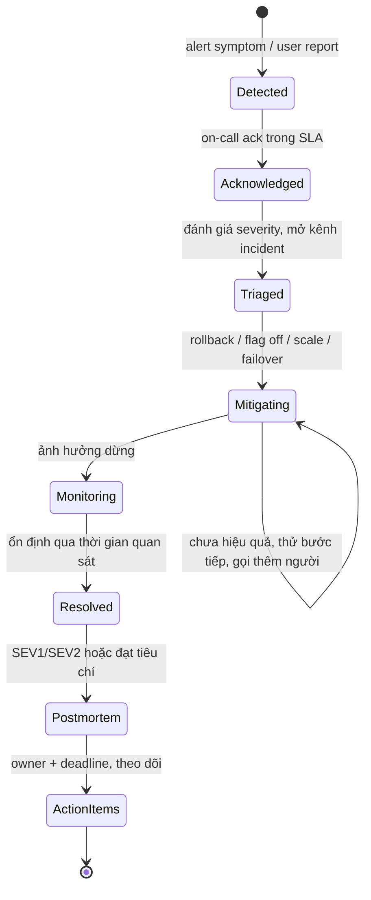
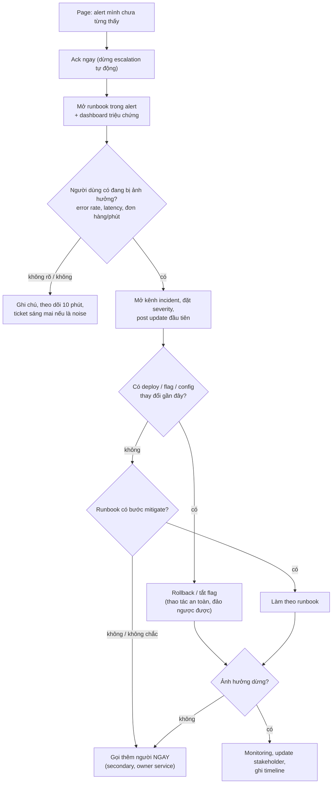
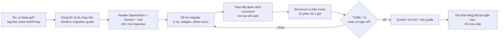

## Bối cảnh & vấn đề

Tuần on-call đầu tiên của một dev (minh hoạ): 49 lần bị page trong 4 tuần của rotation, 20 lần vào ban đêm. Phần lớn là "CPU > 70%" tự hết sau vài phút, hoặc "disk replica còn dưới 20%" mà không ai làm gì được lúc 2 giờ sáng. Tới lần page thứ 40, anh ấy acknowledge theo phản xạ và ngủ tiếp. Lần đó là thật: tỉ lệ lỗi checkout tăng vọt, và sự cố kéo dài 50 phút thay vì 10.

Hai tuần sau, postmortem được viết: "Root cause: on-call engineer không phản ứng kịp. Action: nhắc on-call cẩn thận hơn." Ba tháng sau, sự cố tương tự xảy ra lần nữa.

Câu chuyện chứa ba thất bại của cùng một hệ thống: **alert không actionable** dạy người ta bỏ qua alert; **postmortem đổ lỗi cho người** nên không sửa được hệ thống; và **action item không có cơ chế** ("cẩn thận hơn") nên không có gì thay đổi. Bài này đi qua on-call như một quy trình kỹ thuật: thiết kế alert, runbook, vai trò trong incident, thứ tự mitigate-trước; postmortem blameless có action item thật; và một chủ đề vận hành hay bị làm ẩu: **deprecate** một API mà nhiều team phụ thuộc, với code chạy thật cho header chuẩn và brownout.

## Khái niệm

### On-call và severity

**On-call** là luân phiên chịu trách nhiệm phản hồi sự cố production ngoài (và trong) giờ làm việc. Mục tiêu không phải là "sửa mọi thứ", mà là **giảm thời gian và phạm vi ảnh hưởng** tới người dùng. Mỗi team nên có định nghĩa **severity** rõ, ví dụ: SEV1: chức năng cốt lõi hỏng với nhiều khách hàng, mất tiền/dữ liệu, rò rỉ bảo mật; SEV2: suy giảm đáng kể hoặc một nhóm khách hàng bị ảnh hưởng; SEV3: lỗi nhỏ, có workaround. Severity quyết định ai được gọi, tần suất cập nhật và có cần postmortem hay không.

### Alert phải actionable

Một **alert** chỉ nên **page** người khi (1) có ảnh hưởng thật hoặc sắp có ảnh hưởng tới người dùng, (2) cần **con người** làm gì đó, và (3) cần làm **ngay**. Thứ không thoả cả ba thì là ticket, dashboard hoặc email, không phải page. Google SRE phân biệt alert theo **triệu chứng** (symptom: "tỉ lệ lỗi checkout > 2%", "p99 latency > 2s") với alert theo **nguyên nhân** (cause: "CPU > 70%"): triệu chứng gắn trực tiếp với trải nghiệm người dùng và ít báo động giả; nguyên nhân thì nhiều và hay không quan trọng (CPU cao mà người dùng không bị ảnh hưởng thì không có gì phải làm lúc 3 giờ sáng). Cách hiện đại là alert theo **SLO burn rate**: page khi tốc độ tiêu error budget đủ nhanh để vượt SLO nếu không ai can thiệp.

Alert ồn có chi phí thật: **alert fatigue** khiến người trực bỏ qua cả alert quan trọng, như câu chuyện mở đầu.

### Runbook

**Runbook** là hướng dẫn cho một alert cụ thể: alert nghĩa là gì, ảnh hưởng tới ai, kiểm tra gì trước (dashboard, query, log), các bước mitigate an toàn (rollback, tắt flag, scale, failover), khi nào escalate và gọi ai. Mỗi alert page người nên link tới runbook của nó. Runbook tốt cho phép một người **chưa từng thấy alert đó** làm đúng trong 15 phút đầu, đó chính là bài kiểm tra.

### Vai trò trong incident

Với sự cố lớn, tách vai trò để không ai vừa debug vừa trả lời 20 tin nhắn: **Incident Commander** (điều phối, quyết định, giữ bức tranh tổng), **Ops/Tech lead** (người thao tác kỹ thuật), **Comms lead** (cập nhật stakeholder, status page, support theo nhịp cố định), và **Scribe** (ghi timeline). Mô hình này bắt nguồn từ Incident Command System và được Google SRE mô tả trong "Managing Incidents". Với team nhỏ, một người có thể giữ hai vai, nhưng IC và người thao tác nên tách khi có thể.

### Mitigate trước, root cause sau

Thứ tự ưu tiên trong incident: **dừng ảnh hưởng** trước, hiểu nguyên nhân sau. Rollback deploy gần nhất, tắt feature flag, scale up, chuyển traffic, chặn một tenant gây tải: những thao tác này thường an toàn, đảo ngược được và nhanh hơn nhiều so với tìm bug. Debug root cause khi production còn đang cháy là kéo dài thời gian ảnh hưởng. Ngoại lệ: thu thập bằng chứng nhanh (snapshot log, heap dump, query đang chạy) **trước** khi rollback nếu nó không làm chậm đáng kể việc mitigate, vì rollback có thể xoá dấu vết.

### Toil

Google SRE định nghĩa **toil** là việc vận hành thủ công, lặp đi lặp lại, tự động hoá được, mang tính chữa cháy, không tạo giá trị lâu dài, và tăng tuyến tính theo quy mô dịch vụ. Ví dụ: mỗi tuần restart một worker bị treo bằng tay, mỗi tháng xoá log thủ công. On-call tốt dành thời gian sau mỗi rotation để **giảm toil**: tự động hoá, sửa alert ồn, sửa nguyên nhân gốc của sự cố lặp lại.

### Blameless postmortem

**Postmortem** là văn bản phân tích một sự cố để học từ nó. **Blameless** nghĩa là tập trung vào **hệ thống và quy trình đã cho phép lỗi xảy ra**, không đổ lỗi cho cá nhân. Lý do không phải là "tử tế": nếu kể thật bị trừng phạt, người ta sẽ giấu thông tin, và bạn mất chính dữ liệu cần để sửa hệ thống. Giả định nền: mọi người đều làm điều hợp lý nhất với thông tin họ có tại thời điểm đó.

Nội dung: tóm tắt, **impact** (ai, bao lâu, bao nhiêu tiền/đơn/request), **timeline** (phát hiện lúc nào, bằng cách nào, mitigate lúc nào), **root cause và contributing factors** (thường nhiều yếu tố, hiếm khi chỉ một), cái gì làm tốt, cái gì may mắn, và **action items** có owner + deadline, chia theo **phòng ngừa** (không xảy ra lại), **phát hiện** (biết sớm hơn), **giảm ảnh hưởng** (nhỏ hơn và ngắn hơn nếu xảy ra lại). SRE Book gợi ý viết postmortem khi có downtime người dùng thấy được vượt ngưỡng, mất dữ liệu, on-call phải can thiệp (rollback, chuyển traffic), thời gian xử lý vượt ngưỡng, hoặc monitoring thất bại (người dùng phát hiện trước).

**Interview angle:** câu "cùng loại incident xảy ra lại dù đã có postmortem" muốn nghe bạn nói về chất lượng action item (cơ chế thay vì "cẩn thận hơn"), việc theo dõi chúng tới khi xong, và phân tích đủ sâu tới contributing factors.

### Deprecation

**Deprecation** là quá trình ngừng hỗ trợ một API/tính năng có kế hoạch: thông báo rằng nó sẽ bị gỡ, khi nào, thay bằng gì, giúp consumer chuyển, rồi gỡ. **Sunset** là thời điểm nó ngừng hoạt động. Với HTTP API có hai header chuẩn: **`Deprecation`** (RFC 9745, giá trị là một structured-field date dạng `@<unix seconds>`, cho biết từ khi nào tài nguyên bị coi là deprecated, kèm link relation `deprecation` trỏ tới tài liệu) và **`Sunset`** (RFC 8594, HTTP-date, thời điểm dự kiến ngừng phục vụ) (verify chi tiết định dạng trong RFC). **Brownout** là tắt tạm thời có báo trước (ví dụ 15 phút) trước ngày sunset để lộ ra consumer chưa chuyển mà không ai biết.

## Cơ chế hoạt động

### Vòng đời một incident



Hai điểm hay bị hiểu sai. "Resolved" không có nghĩa là đã hiểu root cause: nghĩa là người dùng hết bị ảnh hưởng; root cause có thể vẫn đang được điều tra. Và vòng đời không kết thúc ở postmortem mà ở **action item được làm xong**: một postmortem đẹp mà action item nằm im trong backlog thì sự cố sẽ lặp lại.

### 15 phút đầu của một page lúc 3 giờ sáng



Sơ đồ trả lời câu followUp "page lúc 3 giờ sáng cho alert bạn không hiểu". Quyết định quan trọng nhất là nhánh K: **gọi thêm người sớm** không phải là thất bại. Một người mới vào rotation lúc 3 giờ sáng, mệt và chưa từng thấy alert đó, không nên một mình đoán; chi phí đánh thức một người khác thấp hơn nhiều so với 40 phút sự cố thêm. Nhánh G phản ánh thống kê thực tế mà nhiều team ghi nhận: phần lớn sự cố đến từ một thay đổi (deploy, config, flag), nên "gần đây có gì thay đổi?" là câu hỏi đầu tiên đáng giá nhất.

### Lộ trình deprecate một API nội bộ



Vòng D → E → F → G là phần tốn thời gian nhất và là nơi deprecation thường thất bại: công bố một lần rồi chờ ngày sunset, tới ngày đó mới phát hiện ba consumer không đọc email. Đo usage hằng tuần, liên hệ trực tiếp từng owner, và brownout là ba cơ chế biến "chúng tôi đã thông báo" thành "chúng tôi biết chắc ai còn dùng".

## Ví dụ thực tế

Code chạy thật với Node 24 và curl; dữ liệu alert là minh hoạ.

### 1. Alert nào đáng page?

Export lịch sử page 4 tuần của rotation, mỗi page ghi lại on-call đã làm gì:

```ts
// alerts.ts — alert nào đáng giữ? (export lịch sử page 4 tuần, dữ liệu minh hoạ)
type Page = { alert: string; at: string; action: "mitigated" | "none" | "auto-resolved"; ackMin: number; night: boolean };
// pages = 31 lần CPUHigh, 12 lần DiskFree replica, 4 lần CheckoutErrorRate, 2 lần PaymentWebhookLag
const by = new Map<string, Page[]>();
for (const p of pages) by.set(p.alert, [...(by.get(p.alert) ?? []), p]);
console.log("alert                            pages  actionable  at night  verdict");
for (const [a, ps] of [...by].sort((x, y) => y[1].length - x[1].length)) {
  const act = ps.filter((p) => p.action === "mitigated").length / ps.length;
  const verdict = act >= 0.5 ? "keep (symptom, actionable)" : act === 0 ? "delete or make ticket, not page" : "tune: threshold/duration, or alert on symptom";
  console.log(`${a.padEnd(32)} ${String(ps.length).padStart(5)}  ${(100 * act).toFixed(0).padStart(9)}%  ${String(ps.filter((p) => p.night).length).padStart(8)}  ${verdict}`);
}
```

```text
$ node alerts.ts
alert                            pages  actionable  at night  verdict
CPUHigh>70% (5m)                    31         13%        11  tune: threshold/duration, or alert on symptom
DiskFree<20% db-replica             12          0%         6  delete or make ticket, not page
CheckoutErrorRate>2% (SLO burn)      4        100%         1  keep (symptom, actionable)
PaymentWebhookLag>5m                 2        100%         2  keep (symptom, actionable)

total 49 pages in 4 weeks, 10 actionable (20%), 20 at night
```

Chỉ 20% page dẫn tới hành động. Hai alert theo **nguyên nhân** chiếm 43/49 page; hai alert theo **triệu chứng** đều actionable 100%. Hành động sau rotation: CPU → bỏ page, giữ trên dashboard, dựa vào alert triệu chứng (latency/error rate) để biết khi nào CPU thật sự gây hại; disk replica → không phải không quan trọng, nhưng không cần ai dậy lúc 2 giờ sáng: đổi thành alert **dự báo** ("đầy trong < 48 giờ" theo tốc độ tăng) gửi ticket giờ hành chính, kèm tự động dọn WAL/log cũ (giảm toil). Mục tiêu đặt ra: > 80% page actionable.

### 2. Runbook mẫu

```markdown
# Runbook: CheckoutErrorRate > 2% (SLO burn)
**Ý nghĩa:** > 2% request POST /checkout trả 5xx trong 5 phút; tốc độ này tiêu hết error budget
tháng trong ~1 ngày. **Ảnh hưởng:** khách không đặt được hàng = mất doanh thu trực tiếp. Mặc định SEV2,
SEV1 nếu > 10% hoặc > 15 phút.

## 1. Kiểm tra (≤ 5 phút)
- Dashboard "Checkout": error rate theo endpoint, theo tenant, theo payment provider.
- Deploy/flag gần đây: kênh #deploys, trang flag (lọc "changed in last 2h").
- Provider status: trang status của payment provider.

## 2. Mitigate (theo thứ tự, làm bước đầu tiên khớp)
- Có deploy checkout-api < 2h trước → rollback (`deploy rollback checkout-api`).
- Có flag liên quan checkout đổi < 2h → tắt flag.
- Lỗi chỉ ở một provider → bật flag `payments_failover_provider_b`.
- Lỗi chỉ ở một tenant với tải bất thường → bật rate limit tenant (`ratelimit set <tenant> 50rps`).

## 3. Escalate
- Không khớp bước nào, hoặc sau 15 phút chưa giảm → page secondary + owner @payments-oncall.
- Có dấu hiệu sai tiền/thanh toán trùng → SEV1, gọi EM, KHÔNG retry hàng loạt.

## 4. Giao tiếp
- Mở #inc-<ngày>-checkout, post update mỗi 15 phút: ảnh hưởng, đang làm gì, update tiếp lúc nào.
```

Lưu ý dòng cuối mục Escalate: runbook không chỉ nói làm gì mà còn nói **không** làm gì (retry hàng loạt khi nghi thanh toán trùng sẽ làm tệ hơn).

### 3. Template postmortem blameless

```markdown
# Postmortem: Checkout lỗi 50 phút, 2026-09-18 (SEV2)
Status: Action items in progress · Author: @oncall-a · Reviewers: @payments, @sre

## Tóm tắt
Deploy checkout-api 14:02 đổi timeout gọi provider từ 10 s xuống 1 s; ~18% request checkout lỗi
tới 14:52 khi rollback.

## Impact
- 50 phút, ~2.300 lần đặt hàng thất bại, ~31% khách thử lại thành công; ước tính doanh thu chậm/mất: X.
- 40 tenant bị ảnh hưởng; không có dữ liệu sai hoặc thanh toán trùng (đã đối soát).

## Timeline (UTC+7)
14:02 deploy · 14:05 alert CheckoutErrorRate page · 14:06 ack · 14:20 ack lại sau khi bỏ qua
(alert fatigue, xem contributing factors) · 14:41 gọi secondary · 14:50 xác định deploy · 14:52 rollback
· 15:10 resolved.

## Root cause & contributing factors
- Timeout 1 s thấp hơn p99 của provider (2,4 s); giá trị lấy từ môi trường staging dùng mock.
- Config timeout không có test/giới hạn; review không có người của payments (thiếu CODEOWNERS cho file config).
- Rotation có 49 page/4 tuần, 80% không actionable → page thật bị xử lý chậm.
- Runbook không có bước "kiểm tra deploy gần đây" ở đầu.

## Cái gì làm tốt / may mắn
Rollback một lệnh chạy trong 2 phút. May mắn: provider không tính phí request timeout.

## Action items
| Loại | Việc | Owner | Hạn |
|---|---|---|---|
| Phòng ngừa | Validate config timeout ≥ p99 provider (test + schema) | @payments-a | 2026-09-30 |
| Phòng ngừa | CODEOWNERS cho `config/payments/**` | @lead | 2026-09-22 |
| Phát hiện | Canary 5% cho checkout-api, auto-rollback khi error rate tăng | @platform-b | 2026-10-15 |
| Giảm ảnh hưởng | Runbook: bước 1 là kiểm tra deploy/flag gần đây | @oncall-a | 2026-09-21 |
| Giảm ảnh hưởng | Bỏ page CPUHigh, đổi DiskFree thành alert dự báo (giảm alert fatigue) | @sre-c | 2026-09-28 |
```

So với postmortem đầu bài ("on-call không phản ứng kịp, nhắc cẩn thận hơn"): bản này không có tên ai là nguyên nhân; câu hỏi là "vì sao hệ thống cho phép một config timeout sai lên production, và vì sao một page thật bị xử lý chậm". Mỗi action item là một **cơ chế** (test, CODEOWNERS, canary, runbook, alert) có owner và hạn, không phải lời nhắc.

Khi cùng loại incident xảy ra lại (followUp): kiểm tra (1) action item của lần trước có được **làm xong** không (thường là không: nằm trong backlog vì không ai theo dõi); (2) action item có phải **cơ chế** hay chỉ là "cẩn thận hơn", "training"; (3) phân tích có dừng ở nguyên nhân bề mặt ("config sai") thay vì contributing factors ("vì sao config sai đi qua được review và test"); (4) fix có ở đúng tầng (sửa một service trong khi lỗi là pattern ở mọi service). Cơ chế: review action item postmortem trong một cuộc họp định kỳ cho tới khi đóng.

### 4. Deprecate /v1/orders: header chuẩn, log consumer, brownout

```ts
// server.ts — endpoint cũ /v1/orders đang deprecate: header Deprecation/Sunset, log consumer, brownout theo lịch
import { createServer } from "node:http";
import { appendFileSync } from "node:fs";

const DEPRECATED_AT = Date.parse("2026-09-01T00:00:00Z");
const SUNSET = new Date("2026-12-31T23:59:59Z");
// brownout: tắt tạm thời có báo trước, để lộ consumer ẩn (giờ UTC)
const BROWNOUTS = [{ from: Date.parse("2026-10-15T09:00:00Z"), to: Date.parse("2026-10-15T09:15:00Z") }];
const now = () => Number(process.env.FAKE_NOW ? Date.parse(process.env.FAKE_NOW) : Date.now());

createServer((req, res) => {
  const client = String(req.headers["x-client-id"] ?? "unknown");
  if (req.url?.startsWith("/v1/orders")) {
    appendFileSync("v1-usage.log", `${new Date(now()).toISOString()} ${client} ${req.method} ${req.url}\n`);
    res.setHeader("Deprecation", `@${Math.floor(DEPRECATED_AT / 1000)}`);           // RFC 9745: structured-field date
    res.setHeader("Sunset", SUNSET.toUTCString());                                   // RFC 8594: HTTP-date
    res.setHeader("Link", '<https://docs.example.com/migrate-orders-v2>; rel="deprecation"; type="text/html", </v2/orders>; rel="successor-version"');
    const t = now();
    if (t > SUNSET.getTime() || BROWNOUTS.some((b) => t >= b.from && t < b.to)) {
      res.writeHead(410, { "content-type": "application/problem+json" });
      return res.end(JSON.stringify({ type: "https://docs.example.com/errors/endpoint-sunset", title: "Endpoint /v1/orders is retired", detail: "Use /v2/orders. Migration guide: https://docs.example.com/migrate-orders-v2" }));
    }
    res.writeHead(200, { "content-type": "application/json" });
    return res.end(JSON.stringify([{ id: 1, total: 199900 }]));
  }
  res.writeHead(404).end();
}).listen(Number(process.env.PORT ?? 3911), () => console.log("listening", process.env.FAKE_NOW ?? "real time"));
```

Chạy hai instance với thời gian giả: một trước brownout, một trong cửa sổ brownout:

```text
$ PORT=3911 FAKE_NOW=2026-10-01T08:00:00Z node server.ts &
$ PORT=3912 FAKE_NOW=2026-10-15T09:05:00Z node server.ts &
$ curl -si -H "x-client-id: billing-svc" localhost:3911/v1/orders
HTTP/1.1 200 OK
Deprecation: @1788220800
Sunset: Thu, 31 Dec 2026 23:59:59 GMT
Link: <https://docs.example.com/migrate-orders-v2>; rel="deprecation"; type="text/html", </v2/orders>; rel="successor-version"
content-type: application/json

[{"id":1,"total":199900}]

# during brownout window (2026-10-15 09:05Z):
$ curl -si -H "x-client-id: legacy-export" localhost:3912/v1/orders
HTTP/1.1 410 Gone
content-type: application/problem+json

{"type":"https://docs.example.com/errors/endpoint-sunset","title":"Endpoint /v1/orders is retired","detail":"Use /v2/orders. Migration guide: https://docs.example.com/migrate-orders-v2"}
```

`@1788220800` là 2026-09-01T00:00:00Z dạng Unix seconds. Response lỗi dùng format problem details (RFC 9457) với link tới migration guide, để dev nào thấy lỗi trong log biết ngay phải làm gì. Báo cáo usage từ log (sau vài request từ các consumer):

```ts
// usage.ts — ai còn gọi /v1/orders? (đọc log dạng "<iso> <client> <method> <url>")
import { readFileSync } from "node:fs";
const owners: Record<string, string> = { "billing-svc": "team-billing", "mobile-app-3.2": "team-mobile", "reporting-cron": "team-data" };
const rows = readFileSync(process.argv[2], "utf8").trim().split("\n").map((l) => l.split(" "));
const by = new Map<string, { n: number; last: string }>();
for (const [at, client] of rows) by.set(client, { n: (by.get(client)?.n ?? 0) + 1, last: at });
console.log("client            calls  last seen                 owner");
for (const [c, v] of [...by].sort((a, b) => b[1].n - a[1].n))
  console.log(`${c.padEnd(17)} ${String(v.n).padStart(5)}  ${v.last.padEnd(24)}  ${owners[c] ?? (c === "unknown" ? "??? không gửi client id → tra IP/API key" : "??? chưa biết owner → hỏi channel, xem brownout")}`);
```

```text
$ node usage.ts v1-usage.log
client            calls  last seen                 owner
billing-svc           3  2026-10-01T08:00:00.000Z  team-billing
reporting-cron        3  2026-10-01T08:00:00.000Z  team-data
mobile-app-3.2        1  2026-10-01T08:00:00.000Z  team-mobile
unknown               1  2026-10-01T08:00:00.000Z  ??? không gửi client id → tra IP/API key
legacy-export         1  2026-10-15T09:05:00.000Z  ??? chưa biết owner → hỏi channel, xem brownout
```

Dòng cuối là giá trị của brownout: `legacy-export` không có trong danh sách consumer đã biết, và chỉ lộ ra khi nó nhận 410 trong 15 phút có báo trước (nhiều khả năng ai đó sẽ hỏi trong channel "export của tôi lỗi"). Tốt hơn nhiều so với phát hiện nó vào ngày sunset. `mobile-app-3.2` là trường hợp khó nhất: app cũ trên máy người dùng không update được ngay, nên timeline cho mobile phải tính theo tỉ lệ người dùng còn ở version cũ, không theo lịch của backend.

Khi một team nói không kịp migrate trước deadline (followUp): hiểu **blocker** cụ thể (thiếu người? thiếu field trong v2? phụ thuộc release mobile?); nếu blocker hợp lệ, gia hạn **có điều kiện** (ngày mới, kế hoạch của họ, mốc kiểm) thay vì gia hạn vô thời hạn; giúp giảm chi phí cho họ (adapter, PR mẫu, pair một buổi); nếu v2 thiếu gì, đó là việc của bạn; và làm rõ cái giá của việc giữ v1 (chi phí vận hành, rủi ro bảo mật) với người quyết ưu tiên của cả hai team nếu cần.

## Trade-offs & lựa chọn thay thế

| Quyết định | Lựa chọn A | Lựa chọn B | Khi nào |
|---|---|---|---|
| Alert | Theo triệu chứng / SLO burn rate | Theo nguyên nhân (CPU, disk) | Page theo triệu chứng; nguyên nhân lên dashboard hoặc ticket |
| Mitigate | Rollback / tắt flag ngay | Fix forward | Rollback khi thay đổi gần đây là nghi phạm; fix forward khi rollback không an toàn (migration one-way) |
| Ai on-call | Dev của service (you build it, you run it) | Team ops/SRE riêng | Dev on-call tạo động lực sửa gốc; SRE riêng khi quy mô lớn, có ngưỡng chuyển giao |
| Postmortem | Mọi incident | Theo tiêu chí (SEV, thời gian, data loss) | Theo tiêu chí; incident nhỏ dùng bản rút gọn |
| Deprecation | Timeline cố định cứng | Theo usage (gỡ khi traffic = 0) | Kết hợp: timeline công bố + gỡ khi đạt usage/sign-off; API public cần thời gian dài hơn nội bộ |
| Gỡ endpoint | 410 Gone + link guide | Redirect/adapter sang v2 | Adapter khi rẻ và an toàn; 410 rõ ràng hơn khi semantics khác |

"You build it, you run it" có lợi lớn: người viết code thấy trực tiếp chi phí của alert ồn và bug, nên có động lực sửa gốc. Nhưng nó cần điều kiện: rotation đủ người (thường ≥ 5–8 người để mỗi người không trực quá thường xuyên), page ít và actionable, thời gian sau rotation được dành cho giảm toil, và bù đắp cho trực ngoài giờ.

## Edge cases & failure modes

- **Alert fatigue**: như câu chuyện mở đầu; đo tỉ lệ actionable mỗi rotation và sửa alert ồn như sửa bug.
- **Monitoring chết cùng hệ thống**: alert chạy trên cùng cluster đang hỏng nên không bao giờ bắn. Cần một kiểm tra từ bên ngoài (synthetic check, dead man's switch: alert khi **không** nhận được heartbeat).
- **Rollback không an toàn**: deploy có migration one-way; rollback code mà schema đã đổi thì code cũ hỏng. Expand/contract để mọi deploy rollback được; ghi rõ trong runbook deploy nào không rollback được.
- **Nhiều người cùng thao tác**: ba người cùng restart, scale, rollback trong một sự cố, không ai biết thay đổi nào có tác dụng. IC điều phối, mọi thao tác báo trong kênh incident.
- **Handoff giữa ca bị mất ngữ cảnh**: sự cố kéo dài qua đổi ca, người mới không biết đã thử gì. Timeline trong kênh incident và một bản handoff có trạng thái + giả thuyết + bước tiếp theo.
- **Postmortem thành buổi xử án**: người liên quan phòng thủ, thông tin bị giấu. Facilitator, ngôn ngữ blameless ("deploy đã đổi timeout", không phải "X đã đổi timeout"), và lãnh đạo làm mẫu.
- **Action item không ai theo dõi**: nằm im trong backlog, incident lặp lại. Review định kỳ tới khi đóng.
- **Consumer ẩn**: không gửi client id, gọi qua proxy, cron chạy mỗi tháng một lần (không xuất hiện trong log 2 tuần). Đo đủ dài (ít nhất một chu kỳ nghiệp vụ, ví dụ cuối tháng/quý), yêu cầu client id, brownout.
- **Sunset làm hỏng thứ không ngờ**: endpoint "nội bộ" được một khách hàng enterprise gọi trực tiếp. Brownout trước, khả năng bật lại nhanh trong vài tuần đầu sau sunset.

## Pitfalls

- ❌ Page cho CPU > 70% → ✅ page theo triệu chứng người dùng thấy (error rate, latency, SLO burn); nguyên nhân lên dashboard/ticket.
- ❌ Alert không có runbook → ✅ mỗi page link runbook: ý nghĩa, kiểm tra, mitigate theo thứ tự, escalate, giao tiếp.
- ❌ Debug root cause khi production còn cháy → ✅ mitigate trước (rollback, flag off, scale), root cause sau.
- ❌ Ngại gọi thêm người lúc 3 giờ sáng → ✅ gọi sớm khi không chắc; chi phí đánh thức thấp hơn chi phí sự cố kéo dài.
- ❌ Postmortem "root cause: lỗi con người" → ✅ contributing factors của hệ thống; action item là cơ chế, có owner + hạn, được theo dõi.
- ❌ Deprecate bằng một email → ✅ đo consumer, header Deprecation/Sunset/Link, migration guide, theo dõi hằng tuần, brownout, sunset khi traffic = 0 hoặc có sign-off.
- ❌ Gia hạn deprecation vô thời hạn → ✅ hiểu blocker, gia hạn có điều kiện, giúp giảm chi phí migrate.

## Tóm tắt

- On-call là giảm thời gian và phạm vi ảnh hưởng; severity rõ quyết định ai được gọi và nhịp cập nhật.
- Page chỉ khi có ảnh hưởng người dùng, cần con người, cần ngay; alert theo **triệu chứng**/SLO burn; đo tỉ lệ actionable (ví dụ chỉ 20% → sửa ngay).
- Runbook cho mỗi alert; vai trò IC / ops / comms / scribe; **mitigate trước, root cause sau**; câu hỏi đầu tiên: "gần đây có gì thay đổi?"; gọi thêm người sớm.
- Toil là việc thủ công lặp lại, tự động hoá được; dành thời gian sau rotation để giảm nó.
- Postmortem blameless: impact, timeline, contributing factors, action items theo phòng ngừa / phát hiện / giảm ảnh hưởng, có owner + hạn, theo dõi tới khi xong.
- Deprecation: đo consumer → công bố (lý do, thay thế, timeline, guide) → `Deprecation` (RFC 9745) + `Sunset` (RFC 8594) + `Link` → hỗ trợ → brownout → 410 khi traffic = 0 hoặc có sign-off.
