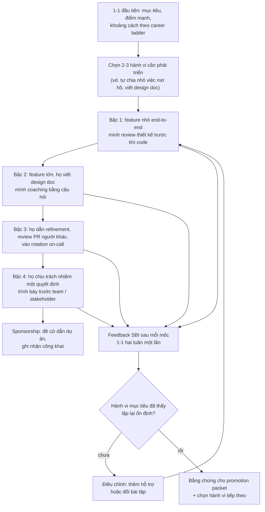
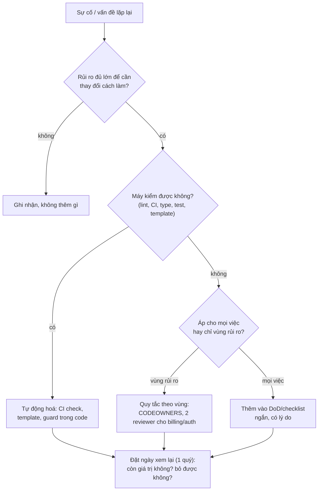

## Bối cảnh & vấn đề

Ba câu hỏi phỏng vấn senior thường đi cùng nhau, và cùng một câu chuyện có thể trả lời cả ba (minh hoạ):

Một team 7 người. Bạn là senior duy nhất. Mọi PR quan trọng đều chờ bạn review, mọi quyết định thiết kế đều hỏi bạn, và mỗi lần bạn nghỉ phép thì team chậm lại. Một bạn mid-level giỏi kỹ thuật nhưng chưa bao giờ tự dẫn một feature từ đầu tới cuối, và hỏi bạn "em cần làm gì để lên senior?". Cùng lúc, team vừa có hai sự cố do thiếu test cross-tenant và migration không có kế hoạch rollback, và manager đề nghị "thêm quy trình": checklist 30 mục cho mỗi PR, hai reviewer bắt buộc, họp review thiết kế hằng tuần.

Ba vấn đề, một gốc: **năng lực của team đang tập trung vào một người**. Cách gỡ không phải là bạn làm nhiều hơn, cũng không phải thêm nhiều quy định hơn, mà là (1) chuyển năng lực sang người khác qua mentoring có chủ đích, (2) chuyển kiến thức chất lượng thành **cơ chế** mà ai cũng dùng được (DoD rõ ràng, phần lớn được máy kiểm), và (3) chỉ giữ lại lượng process đủ để giảm rủi ro thật. Bài này đi qua từng phần, với template và một checker DoD chạy thật.

## Khái niệm

### Senior khác mid-level ở đâu

Khác biệt hiếm khi là kỹ năng code thuần. Các khung career ladder phổ biến mô tả senior qua: **phạm vi** (một feature end-to-end, rồi một hệ thống), **mức mơ hồ** xử lý được (nhận vấn đề chưa rõ, tự làm rõ và chia nhỏ), **ownership** (chịu trách nhiệm kết quả trên production, không chỉ code), **ảnh hưởng** (quyết định thiết kế được người khác tin, review nâng chất lượng người khác), và **nhân năng lực** (làm cho người xung quanh giỏi lên). Mentoring một người lên senior là mở rộng dần cả năm chiều đó, không phải dạy thêm framework.

### Mentoring, coaching, sponsorship

- **Mentoring**: chia sẻ kinh nghiệm và lời khuyên ("lần trước mình gặp chuyện này, mình đã..."). Hữu ích khi người kia thiếu bối cảnh.
- **Coaching**: hỏi để người kia tự tìm câu trả lời ("em thấy có những phương án nào? cái gì có thể hỏng?"). Hữu ích khi họ có đủ kiến thức nhưng cần rèn cách nghĩ.
- **Sponsorship**: dùng uy tín và vị trí của bạn để tạo **cơ hội được thấy** cho người khác: giới thiệu họ dẫn một dự án, nhắc tên họ trong buổi họp với lãnh đạo, đề cử họ trình bày thiết kế. Lara Hogan nhấn mạnh sponsorship là thứ thường thiếu nhất, vì lời khuyên không thăng chức được ai; cơ hội và sự ghi nhận thì có.

Một mentor giỏi chuyển giữa ba chế độ tuỳ tình huống, và nói rõ đang ở chế độ nào ("lần này mình chỉ hỏi thôi, em quyết").

### Ownership tăng dần

Ownership được giao theo **bậc**, mỗi bậc có lưới an toàn: task được định nghĩa rõ → feature nhỏ end-to-end (có bạn review thiết kế) → feature lớn có design doc do họ viết → một quyết định thiết kế họ chịu trách nhiệm trước team → dẫn người khác. Mỗi bậc, bạn lùi lại một bước: từ "mình quyết, em làm" sang "em đề xuất, mình duyệt", rồi "em quyết, báo mình", rồi "em quyết". Lùi quá nhanh là bỏ rơi; lùi quá chậm là không ai lớn lên.

### Review tư duy, không chỉ code

Khi review PR hoặc design doc của người bạn mentor, câu hỏi có giá trị nhất không phải "dòng này sai" mà là: "Em đã cân nhắc phương án nào khác?", "Cái gì có thể hỏng khi tải gấp 10?", "Nếu tenant B gọi API này thì sao?", "Rollback thế nào?". Những câu này dạy **cách nghĩ** mà người senior dùng, và sau vài tháng người kia bắt đầu tự hỏi trước khi bạn hỏi. Đó là dấu hiệu tiến bộ quan sát được.

### Feedback thường xuyên, cụ thể

Feedback hiệu quả là **sớm** (gần sự việc), **cụ thể** (dùng SBI: Situation, Behavior, Impact; xem [bài 6](/tracks/engineering-practices/learn/review-feedback-disagreement)), **cân bằng** (nói cả điều làm tốt cần lặp lại), và **riêng tư** cho điều cần cải thiện. Đo tiến bộ bằng **hành vi quan sát được** ("tự viết design doc cho feature X và xử lý được 3 comment phản biện"), không bằng cảm giác ("có vẻ tự tin hơn").

### Process là công cụ giảm rủi ro, có chi phí

Mọi process (review bắt buộc, checklist, họp thiết kế, approval) đều tồn tại để giảm một **rủi ro** hoặc tăng **phối hợp**, và đều có **chi phí**: thời gian chờ, chuyển ngữ cảnh, cảm giác bị kiểm soát, động lực lách. Lượng process đúng tăng theo: số người và số team phụ thuộc nhau, mức độ rủi ro (tiền, dữ liệu, an toàn), yêu cầu compliance, và chi phí của sai lầm (khó đảo ngược hay không). Một startup 4 người và một team fintech 60 người cần lượng process rất khác nhau, và cả hai đều sai nếu copy của nhau.

Ba nguyên tắc thực dụng: **tự động hoá trước quy định bằng lời** (một CI check chạy cho mọi người, mọi lúc; một quy định trong wiki thì phụ thuộc trí nhớ); **process tỉ lệ với rủi ro** (PR đổi copy UI không cần cùng quy trình với PR đổi tính tiền); **xem lại định kỳ và bỏ** những gì không ai thấy giá trị.

### Definition of Done

**Definition of Done** (DoD) là tập tiêu chí **chung cho mọi công việc** của team để coi một thứ là "xong". Scrum Guide mô tả DoD là bản mô tả chính thức trạng thái của increment khi nó đạt các thước đo chất lượng cần có. Khác với **acceptance criteria**, vốn **riêng cho từng story** (story này phải làm được gì), DoD trả lời "mọi story phải đạt chất lượng gì" (test, review, bảo mật, docs, deploy, monitor).

DoD tốt có ba tính chất: **cụ thể** (kiểm được, không phải "code chất lượng"), **tương xứng với rủi ro của sản phẩm** (SaaS multi-tenant có mục tenant isolation; app y tế có mục compliance), và **phần lớn được máy kiểm** để không phụ thuộc trí nhớ. "Done" nghĩa là **đang chạy trên production và được giám sát**, không phải "đã merge".

**Interview angle:** câu "định nghĩa DoD cho SaaS multi-tenant" muốn nghe các mục đặc thù (test cross-tenant âm tính, authz, migration expand/contract, flag + rollout theo tenant, không PII trong log) và lý do của từng mục, cùng với cách giữ DoD không thành gánh nặng.

## Cơ chế hoạt động

### Lộ trình mentor một mid-level lên senior



Đọc sơ đồ theo hai trục. Trục dọc là **ownership tăng dần**: mỗi bậc chuyển thêm quyền quyết định và trách nhiệm sang người được mentor. Trục ngang là **vòng phản hồi**: sau mỗi mốc có feedback cụ thể, và tiến bộ được đánh giá bằng hành vi lặp lại, không phải một lần làm tốt. Nút G (sponsorship) đặt sau khi có bằng chứng: đề cử ai đó cho cơ hội lớn khi họ chưa sẵn sàng là đặt họ vào thất bại công khai.

### Thêm một process mới hay không



Sơ đồ là câu trả lời cho triết lý "bao nhiêu process là đủ". Nhánh R là lựa chọn hợp lệ: không phải sự cố nào cũng cần quy trình mới. Nhánh T được ưu tiên vì nó **không tốn sự chú ý của con người**. Nhánh V giữ process tỉ lệ với rủi ro thay vì áp đồng loạt. Và mọi nhánh đều đi tới X: process không có ngày xem lại sẽ tích tụ mãi.

## Ví dụ thực tế

### 1. Growth plan một trang (minh hoạ)

```markdown
# Growth plan: @mid-dev → Senior (Q4 2026 – Q1 2027)
Mục tiêu của bạn ấy: dẫn được feature lớn và được team tin quyết định thiết kế.

| Hành vi mục tiêu | Bằng chứng quan sát được | Cơ hội | Hỗ trợ |
|---|---|---|---|
| Chia việc mơ hồ thành slice + spike | Breakdown "Shift Management" được team dùng nguyên, estimate dạng range | Dẫn refinement 2 epic | Mình review breakdown trước buổi họp, chỉ hỏi |
| Viết design doc có alternatives | 1 design doc qua review với ≥ 2 phương án thật | Doc "giá theo khung giờ" | 30 phút coaching trước khi gửi |
| Review nâng chất lượng người khác | Comment có nhãn, bắt ≥ 1 vấn đề correctness/tháng | Reviewer chính của module address | Mình review lại review của bạn ấy 1 tháng đầu |
| Ownership production | Vào rotation on-call, viết 1 postmortem | Rotation từ tháng 11 | Shadow mình 1 tuần trước |

1-1 hai tuần một lần: 1 điều làm tốt, 1 điều cải thiện (SBI), mốc tiếp theo.
Sponsorship: đề cử trình bày design doc ở buổi tech review liên team (tháng 1).
```

Ba điều làm growth plan này khác lời khuyên chung chung: hành vi được viết thành **bằng chứng quan sát được**, mỗi hành vi gắn với một **cơ hội thật** trong roadmap (không phải bài tập giả), và hỗ trợ **giảm dần** theo thời gian.

Câu followUp "kể về người bạn đã mentor, họ thay đổi gì nhờ bạn" cần một câu chuyện cụ thể theo khung này: trước (hành vi gì còn thiếu), bạn đã làm gì (cơ hội nào, hỗ trợ nào, feedback nào), sau (hành vi nào giờ họ tự làm, bằng chứng), và điều bạn học được về cách mentor. Điền chi tiết thật; interviewer nhận ra ngay câu chuyện bịa vì nó thiếu chi tiết khó chịu (lần họ thất bại và bạn đã xử lý thế nào).

### 2. Process đã bỏ hoặc đơn giản hoá (minh hoạ)

FollowUp của câu triết lý process: "kể một process bạn đã bỏ". Ví dụ có cấu trúc:

```text
Trước: họp "release approval" 45 phút mỗi thứ Năm, 8 người, đọc lại danh sách PR đã merge.
Vấn đề: lead time trung bình +3 ngày (PR merge thứ Sáu chờ tới thứ Năm sau); trong 6 tháng
cuộc họp chặn release 1 lần, và lần đó CI cũng đã bắt được.
Thay bằng: deploy tự động sau CI + canary 5%; flag cho tính năng lớn; release note tự sinh
từ Conventional Commits; chỉ thay đổi có migration hoặc đụng billing mới cần owner approve.
Kết quả sau 1 quý (điền số liệu thật): deploy frequency, lead time, change failure rate không tăng.
Giữ lại: owner approve cho migration/billing (rủi ro cao, máy chưa kiểm hết).
```

Câu chuyện tốt về bỏ process luôn có ba phần: **dữ liệu** cho thấy chi phí lớn hơn giá trị, **cơ chế thay thế** cho rủi ro mà process cũ đã từng che (không phải bỏ trắng), và **đo sau** để chứng minh không tệ đi.

### 3. Definition of Done cho SaaS multi-tenant

```markdown
# Definition of Done (áp cho mọi story; mục có ⚙ được CI kiểm)
Code & review
- ⚙ CI xanh: lint, typecheck, unit + integration test
- Review approved; vùng auth/billing/migration có CODEOWNERS approve
Test
- ⚙ Test cho hành vi mới + case lỗi
- ⚙ Test cross-tenant âm tính cho mọi query/endpoint đụng dữ liệu tenant
Security & privacy
- Authz kiểm ở server cho mọi endpoint mới; input được validate
- ⚙ Không log PII/secret (email, phone, token)
Data
- ⚙ Migration có mục Rollback; expand/contract, backward compatible với version đang chạy
Release
- ⚙ Flag + kế hoạch rollout theo tenant (nội bộ → % → 100%) cho tính năng hướng người dùng
- ⚙ Observability: log/metric cho luồng mới; alert nếu là luồng quan trọng
- Docs/API docs cập nhật; QA sign-off; demo cho PO
Done
- Deployed lên production, flag đã bật theo kế hoạch, theo dõi 24–48 giờ không có regression
```

Vì sao từng mục đặc thù multi-tenant có mặt: test cross-tenant âm tính vì lỗi rò dữ liệu giữa tenant là lỗi nặng nhất của loại sản phẩm này và hầu như không lộ ra trong test happy path; rollout theo tenant vì một tenant lớn bị lỗi là sự cố với một khách hàng quan trọng, trong khi một tenant nội bộ bị lỗi chỉ là bug; migration backward compatible vì nhiều phiên bản app chạy cùng lúc trong lúc deploy; không PII trong log vì log thường được giữ lâu, nhiều người đọc được, và gửi sang hệ thống bên thứ ba.

### 4. Phần "máy kiểm được" của DoD, chạy trong CI

```ts
// dod-check.ts — phần "máy kiểm được" của Definition of Done, chạy trong CI trên PR
// Usage: node dod-check.ts <pr.json>   (pr.json: { body, files: [{ path, patch }] })
import { readFileSync } from "node:fs";
type PR = { body: string; files: { path: string; patch: string }[] };
const pr: PR = JSON.parse(readFileSync(process.argv[2], "utf8"));
const has = (re: RegExp) => pr.files.some((f) => re.test(f.path));
const section = (name: string) => new RegExp(`^## ${name}\\s*\\n(?!\\s*(TODO|N/A|-)?\\s*$)[\\s\\S]+?(?=^## |$(?![\\s\\S]))`, "m").test(pr.body);
const checks: [string, boolean, string][] = [];
const rule = (name: string, applies: boolean, ok: boolean, why: string) => applies && checks.push([name, ok, why]);

rule("tests changed with src", has(/^src\/.*\.ts$/), has(/\.test\.ts$/), "logic mới cần test cho hành vi mới + case lỗi");
rule("cross-tenant negative test", pr.files.some((f) => /^src\/.*(repo|query|service)/.test(f.path) && /tenant/i.test(f.patch)),
     pr.files.some((f) => /\.test\.ts$/.test(f.path) && /other tenant|cross-tenant|tenant B/i.test(f.patch)), "code đụng tenant cần test tenant A không thấy dữ liệu tenant B");
rule("migration has rollback plan", has(/migrations\//), section("Rollback"), "migration phải nói rõ rollback/expand-contract");
rule("no PII in logs", has(/\.ts$/), !pr.files.some((f) => /^\+.*log\.(info|debug|warn)\(.*(email|phone|password|token)/m.test(f.patch)), "không log PII/secret");
rule("UI change has screenshot", has(/\.tsx$/), /!\[.*\]\(.*\)| /metrics\.|logger\.|span/.test(f.patch)), "luồng mới cần log/metric");

let fail = 0;
for (const [name, ok, why] of checks) { if (!ok) fail++; console.log(`${ok ? "✓" : "✗"} ${name}${ok ? "" : `  — ${why}`}`); }
console.log(fail ? `DoD: ${fail} item(s) missing (human items like QA sign-off and post-release monitoring are checked in the ticket)` : "DoD (automated part): OK");
process.exitCode = fail ? 1 : 0;
```

Hai PR mẫu: một PR thêm "default address" thiếu test, log email người dùng, migration có mục Rollback chỉ ghi "TODO"; một PR đầy đủ.

```text
$ node dod-check.ts pr-bad.json
✗ tests changed with src  — logic mới cần test cho hành vi mới + case lỗi
✗ cross-tenant negative test  — code đụng tenant cần test tenant A không thấy dữ liệu tenant B
✗ migration has rollback plan  — migration phải nói rõ rollback/expand-contract
✗ no PII in logs  — không log PII/secret
✗ UI change has screenshot  — UI cần screenshot/video
✗ feature flag + rollout plan  — tính năng mới: flag + kế hoạch rollout theo tenant
✗ observability  — luồng mới cần log/metric
DoD: 7 item(s) missing (human items like QA sign-off and post-release monitoring are checked in the ticket)
exit=1

$ node dod-check.ts pr-good.json
✓ tests changed with src
✓ cross-tenant negative test
✓ migration has rollback plan
✓ no PII in logs
✓ UI change has screenshot
✓ feature flag + rollout plan
✓ observability
DoD (automated part): OK
exit=0
```

Các rule này là **heuristic** (regex trên đường dẫn và patch), không phải bằng chứng: một test có chữ "tenant B" chưa chắc đã kiểm đúng; một log không có chữ "email" vẫn có thể chứa PII. Giá trị của checker là **nhắc đúng lúc** và biến DoD từ một trang wiki thành thứ hiện ra trong mỗi PR; reviewer vẫn chịu trách nhiệm phần phán đoán. Khi team nói "DoD làm chậm" (followUp), dữ liệu để trả lời: chi phí của hai sự cố gần nhất (thời gian xử lý, khách hàng ảnh hưởng) so với vài phút mỗi PR; tự động hoá thêm để giảm phần thủ công; áp mục nặng theo **rủi ro** (rollout theo tenant chỉ cho tính năng hướng người dùng, không cho refactor nội bộ); và đề nghị thử 1 tháng rồi xem lại cùng nhau, bỏ mục nào không bắt được gì.

### 5. Ảnh hưởng không cần chức danh, trong team của chính mình

Phần lớn ảnh hưởng của một senior không đến từ quyền quyết định mà từ những việc như ví dụ 3 và 4: viết ra một chuẩn chất lượng, tự động hoá nó, làm mẫu bằng PR của chính mình, và giúp người khác đạt nó. Cùng khung với [bài 9](/tracks/engineering-practices/learn/design-docs-adr-rfc): uy tín từ việc giao hàng tốt và giúp đỡ người khác; hiểu ưu tiên của từng người (dev muốn ít chờ, manager muốn ít sự cố, PO muốn ship đúng hẹn) và đề xuất thứ phục vụ được cả ba; bắt đầu bằng pilot nhỏ (một repo, một tháng); chia sẻ kết quả bằng số liệu; ghi công những người đã thử và góp ý. Khi nó không hiệu quả, thường là vì đề xuất quá to, quá sớm, hoặc chỉ phục vụ ưu tiên của chính người đề xuất.

## Trade-offs & lựa chọn thay thế

| Quyết định | Lựa chọn A | Lựa chọn B | Khi nào |
|---|---|---|---|
| Cách giúp người khác | Mentoring (kể kinh nghiệm) | Coaching (hỏi để họ tự tìm) | Thiếu bối cảnh → mentor; đủ kiến thức, cần rèn cách nghĩ → coach |
| Giao việc khó | Giao sớm, lưới an toàn | Đợi họ "sẵn sàng" | Giao sớm với lưới an toàn; "sẵn sàng" đến từ làm, không từ chờ |
| Đảm bảo chất lượng | Quy định + checklist thủ công | Tự động hoá trong CI | Tự động hoá trước; checklist cho phần phán đoán |
| Phạm vi process | Đồng loạt cho mọi việc | Theo vùng rủi ro | Theo rủi ro: CODEOWNERS, 2 reviewer cho billing/auth |
| DoD | Một DoD cho cả team | DoD + bổ sung theo loại việc | Một DoD ngắn + mục bổ sung cho UI, migration, API public |
| Ai mentor | Chỉ senior | Mọi người mentor người mới hơn mình | Mọi người; senior mentor cả cách mentor |

Process không phải đối lập với tốc độ. Process tốt (CI nhanh, DoD được máy kiểm, review theo rủi ro) **tăng** tốc độ vì giảm rework và sự cố; process tệ (họp approval, checklist 30 mục thủ công, chữ ký cho mọi thay đổi) giảm tốc độ mà không giảm rủi ro tương ứng. Câu hỏi đúng không phải "nhiều hay ít process" mà là "process này giảm rủi ro nào, với chi phí bao nhiêu, và máy có làm thay được không".

## Edge cases & failure modes

- **Mentor biến thành người làm thay**: người được mentor hỏi, bạn viết luôn code. Nhanh hôm nay, không ai lớn lên. Hỏi lại trước khi trả lời; viết code chỉ khi pair và họ cầm bàn phím.
- **Giao ownership mà không trao quyền**: "em chịu trách nhiệm feature này" nhưng mọi quyết định vẫn phải hỏi bạn. Trách nhiệm phải đi kèm quyền quyết định tương ứng.
- **Lưới an toàn quá dày**: bạn review và sửa mọi thứ trước khi ai thấy; người kia không bao giờ trải nghiệm hậu quả nhỏ. Cho phép sai lầm nhỏ, đảo ngược được.
- **Sponsorship thiên vị**: chỉ đề cử người giống mình. Ghi lại cơ hội đã trao cho ai, xem phân bố.
- **Process chỉ thêm, không bớt**: mỗi sự cố thêm một mục, sau 2 năm checklist 40 mục không ai đọc. Ngày xem lại cho mọi process; bỏ mục không bắt được gì.
- **DoD thành checkbox**: tick hết mà không làm thật. Phần máy kiểm được thì để máy kiểm; phần còn lại reviewer hỏi bằng chứng (link test, screenshot).
- **DoD quá nặng cho việc nhỏ**: sửa typo cũng phải có rollout plan. Rule theo điều kiện (như checker ở trên chỉ áp rule khi đường dẫn khớp).
- **"Done" là merged**: tính năng merge nhưng flag chưa bật, chưa ai theo dõi production; bug lộ ra sau hai tuần khi không ai còn nhớ. Done = chạy trên production + đã theo dõi.
- **Senior thành bottleneck vì "chỉ mình làm được"**: nghỉ phép là team dừng. Đo: bao nhiêu PR/quyết định cần bạn; mục tiêu là con số đó giảm dần.

## Pitfalls

- ❌ Mentoring bằng lời khuyên chung ("đọc thêm sách", "tự tin hơn") → ✅ hành vi mục tiêu cụ thể, cơ hội thật trong roadmap, feedback SBI, bằng chứng quan sát được.
- ❌ Làm thay người được mentor → ✅ coaching bằng câu hỏi, ownership tăng dần, lưới an toàn giảm dần.
- ❌ Chỉ mentor, không sponsor → ✅ tạo cơ hội được thấy: đề cử dẫn dự án, ghi nhận công khai.
- ❌ Thêm checklist sau mỗi sự cố → ✅ hỏi "máy kiểm được không?"; tự động hoá trước, quy tắc theo vùng rủi ro, ngày xem lại.
- ❌ DoD là "code reviewed + merged" → ✅ DoD có test cross-tenant, authz, migration an toàn, flag + rollout, observability, deployed + monitored.
- ❌ DoD một trang wiki không ai đọc → ✅ phần máy kiểm được chạy trong CI; phần còn lại trong PR template.
- ❌ Bảo vệ process bằng "quy định là quy định" → ✅ nói rủi ro nó giảm, chi phí của nó, và sẵn sàng bỏ khi dữ liệu nói không còn giá trị.

## Tóm tắt

- Senior khác mid ở **phạm vi, mức mơ hồ, ownership, ảnh hưởng và nhân năng lực**; mentor lên senior là mở rộng dần năm chiều đó.
- Mentoring (kể kinh nghiệm), coaching (hỏi), **sponsorship** (tạo cơ hội được thấy); sponsorship thường thiếu nhất.
- Ownership tăng dần theo bậc với lưới an toàn giảm dần; review **tư duy** bằng câu hỏi; feedback SBI thường xuyên; đo bằng hành vi quan sát được.
- Process là công cụ giảm rủi ro có chi phí; tỉ lệ với số người, phụ thuộc, rủi ro, compliance; **tự động hoá trước quy định**, theo vùng rủi ro, có ngày xem lại.
- **DoD** là chuẩn chung cho mọi việc (khác acceptance criteria riêng từng story); với SaaS multi-tenant: test cross-tenant âm tính, authz, không PII trong log, migration expand/contract có rollback, flag + rollout theo tenant, observability, **deployed + monitored**.
- Phần máy kiểm được của DoD chạy trong CI (heuristic, nhắc đúng lúc); "DoD làm chậm" được trả lời bằng chi phí sự cố, tự động hoá, áp theo rủi ro và thử nghiệm có hạn.
- Ảnh hưởng không cần chức danh: làm mẫu, tự động hoá chuẩn chất lượng, pilot nhỏ, chia sẻ số liệu, ghi công người khác.
