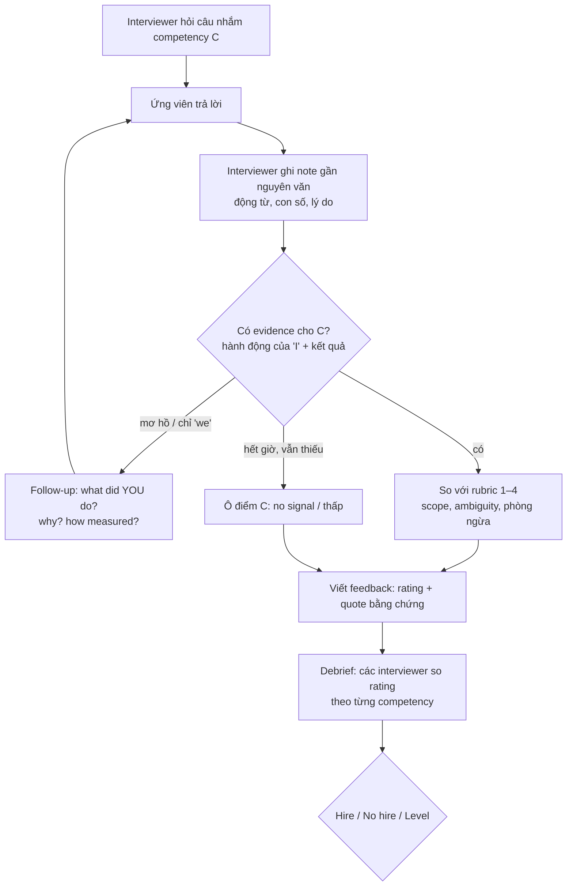
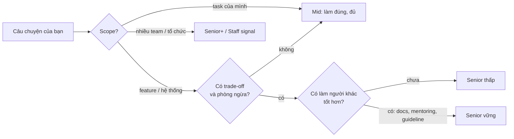

## Bối cảnh & vấn đề

Hai ứng viên cùng trả lời câu "What are your strengths as an engineer?". Người thứ nhất nói trôi chảy trong 40 giây: "I'm a fast learner, a team player, and I'm very passionate about clean code." Người thứ hai ngập ngừng hơn: "Tôi nghĩ điểm mạnh rõ nhất là debug sự cố xuyên tầng. Quý trước, checkout bị timeout chỉ ở một vài tenant; tôi lần từ network tab xuống log API rồi xuống query plan, thấy một index thiếu cho filter theo tenant. Sửa xong, p95 về lại dưới ngưỡng alert." Người thứ nhất nghe tự tin hơn, nhưng gần như chắc chắn người thứ hai được chấm cao hơn.

Lý do là interviewer **không chấm độ trôi chảy**. Trong một buổi behavioral được tổ chức tử tế, interviewer có một danh sách **competency** (năng lực cần đo, ví dụ ownership, collaboration, judgment) và một **rubric** (thang điểm có mô tả từng mức). Việc của họ là ghi lại **bằng chứng** (evidence: hành động cụ thể bạn đã làm, kèm kết quả), rồi so bằng chứng đó với rubric. Ba tính từ không có ví dụ là không có bằng chứng, nên ô điểm của competency đó bị để trống hoặc chấm thấp.

Nhiều kỹ sư giỏi trượt behavioral vì họ chuẩn bị nó như một bài nói chuyện (nói hay, nói tự tin) thay vì như một bài **trình bày bằng chứng**. Bài này giải thích cơ chế chấm: interviewer nghe gì, ghi gì, debrief ra sao, và vì sao ở level senior thang điểm khắt khe hơn. Hiểu cơ chế này trước thì các bài sau (STAR, story bank, từng loại câu hỏi) mới có chỗ bám. Bài cũng xử lý nhóm câu "tự đánh giá" (strengths, weakness, ba từ, senior nghĩa là gì) vì đây là nơi ứng viên hay nói chung chung nhất.

## Khái niệm

### Behavioral question và giả định "quá khứ dự đoán tương lai"

**Behavioral question** là câu hỏi về một tình huống bạn **đã** trải qua, thường bắt đầu bằng "Tell me about a time…" hoặc "Give me an example of…". Giả định đằng sau: cách bạn đã hành xử trong tình huống thật là dấu hiệu tốt hơn cho cách bạn sẽ hành xử, so với điều bạn **nói** bạn sẽ làm. Vì thế câu trả lời bằng thì giả định ("I would talk to the person first…") cho một câu hỏi về quá khứ gần như luôn bị chấm thấp: nó cho biết bạn biết đáp án sách vở, không cho biết bạn đã làm.

Khác với behavioral là **hypothetical / situational question** ("Imagine you join our team and find…"). Ở đây trả lời bằng "I would…" là đúng, nhưng câu trả lời mạnh vẫn neo vào kinh nghiệm thật: "Tôi sẽ làm A, B, C; thực tế tôi đã gặp tình huống gần giống khi…". Track này có cả hai loại (`type: behavioral` và `type: scenario`), và cách trả lời khác nhau ở thì động từ, không khác nhau ở nhu cầu bằng chứng.

**Interview angle:** nếu bạn nghe "Tell me about a time…" mà không có câu chuyện, nói thật "Tôi chưa gặp đúng tình huống đó, gần nhất là…" tốt hơn nhiều so với chuyển sang "I would…" mà không báo.

### Competency và signal

**Competency** là năng lực công ty muốn đo, được viết thành danh sách trước buổi phỏng vấn. Mỗi công ty đặt tên khác nhau: Amazon có Leadership Principles (Ownership, Dive Deep, Have Backbone; Disagree and Commit, Earn Trust…), nhiều công ty khác dùng bộ gọn hơn như *ownership, collaboration, communication, judgment, growth*. **Signal** là phần bằng chứng trong câu trả lời của bạn chứng minh (hoặc phản bác) một competency.

Một câu hỏi thường nhắm một signal chính và vài signal phụ. "Tell me about a conflict with a teammate" nhắm *collaboration* chính, phụ là *communication* và *judgment*. Câu trả lời mạnh cố ý cho interviewer đủ chất liệu để điền cả signal chính lẫn phụ. Câu trả lời yếu thường lạc signal: được hỏi về conflict nhưng kể một câu chuyện kỹ thuật mà không có người nào bất đồng.

**Interview angle:** trước khi trả lời, tự hỏi "câu này muốn tôi chứng minh điều gì?" trong 2–3 giây. Bài [STAR/STARR](/tracks/behavioral/learn/star-starr) có bước này ở đầu flow.

### Structured interview và rubric

**Structured interview** là cách tổ chức phỏng vấn trong đó mọi ứng viên cho cùng một vị trí được hỏi cùng bộ câu (hoặc cùng bộ competency) và chấm theo cùng một rubric. Google re:Work khuyến nghị cách này vì nó giảm thiên kiến và dự đoán hiệu suất tốt hơn phỏng vấn tự do (verify con số cụ thể của các nghiên cứu meta-analysis; nguồn hay được trích là Schmidt & Hunter). Rubric thường có 4 mức, mỗi mức mô tả **hành vi quan sát được**, không phải cảm giác.

Ví dụ một rubric cho *ownership* (minh hoạ): mức 1 "chỉ làm phần được giao, không theo dõi sau khi bàn giao"; mức 2 "hoàn thành task end-to-end nhưng dừng ở lúc merge"; mức 3 "chủ động theo dõi kết quả sau release, xử lý vấn đề phát sinh"; mức 4 "nhận ra vấn đề không ai giao, xử lý tận gốc, và thay đổi hệ thống/quy trình để nó không lặp lại". Đọc rubric kiểu này, bạn thấy ngay vì sao "PR merged" là điểm dừng của mức 2.

**Interview angle:** bạn không thấy rubric thật, nhưng có thể đoán gần đúng: mức cao luôn có **tác động lan rộng hơn** và **phòng ngừa** chứ không chỉ "sửa xong".

### Evidence, scope và follow-up

Interviewer ghi lại gần như nguyên văn những gì bạn nói, đặc biệt các động từ hành động và con số. Sau đó họ gạch chân phần **evidence**: hành động *của bạn*, lý do bạn chọn, kết quả. Phần "we did…" thường không được tính, vì interviewer không biết bạn có trong "we" đó hay không. Phần "I think it's important to…" (quan điểm) cũng không được tính là bằng chứng.

**Follow-up** là công cụ chính để lấy evidence. Khi câu trả lời mơ hồ, interviewer đào: "What did *you* do specifically?", "Why that approach?", "How did you measure it?", "What would you do differently?". Ở level senior, interviewer được dặn đào ít nhất 2 tầng. Câu chuyện bịa hoặc mượn của người khác thường vỡ ở tầng thứ hai, vì chi tiết không có thật thì không có gì để đào.

**Scope** là phạm vi tác động của câu chuyện: một task, một feature, một hệ thống, một team, nhiều team. Cùng một hành vi tốt (viết test cho code legacy) ở scope "chính PR của tôi" chấm khác với scope "tôi viết guideline, thêm CI gate, ba team khác áp dụng".

**Interview angle:** câu trả lời "đủ dài" là câu đủ evidence cho interviewer điền rubric, không phải câu kéo dài 5 phút. Chừa chỗ cho follow-up.

### Mid vs senior: cùng câu hỏi, thang điểm khác

Cùng câu "Tell me about a production incident", ứng viên mid được kỳ vọng tìm ra root cause và fix; ứng viên senior được kỳ vọng thêm: mitigate trước khi điều tra, giao tiếp với stakeholder, viết postmortem, thay đổi hệ thống (alert, test, runbook) và lan truyền bài học. Nói cách khác, senior được chấm thêm ở ba trục: **ambiguity** (xử lý khi không ai nói rõ phải làm gì), **scope** (ảnh hưởng ra ngoài task của mình) và **multiplier effect** (làm người khác tốt hơn).

Hệ quả thực tế: một câu chuyện hoàn hảo ở mức mid có thể bị chấm "meets mid, below senior". Khi chọn story cho vòng senior, chọn những câu có quyết định trade-off, có người khác bị ảnh hưởng, có bước phòng ngừa. Câu behavioral-038 ("senior engineer nghĩa là gì với bạn") hỏi thẳng vào ba trục này.

**Interview angle:** bất cứ câu nào, thêm một câu cuối "sau đó tôi đã thay đổi X để team không gặp lại" là cách rẻ nhất để chạm signal senior.

### Câu hỏi tự đánh giá: strengths, weakness, ba từ

Nhóm câu "What are your strengths?", "What is one area you are actively working to improve?", "Describe yourself in three words" có vẻ dễ nên ứng viên hay chuẩn bị qua loa. Thực ra chúng đo **self-awareness** (tự nhận thức): bạn có nhìn mình chính xác không, có khớp với bằng chứng không, có đang chủ động cải thiện không. Mỗi tính từ phải đi kèm một ví dụ thật, nếu không thì đó chỉ là lời tự khen.

Với weakness, interviewer tìm ba thứ: điểm yếu **thật** (không phải "I'm a perfectionist"), **liên quan nhưng không chí mạng** cho vai trò, và **đang có hành động cụ thể** với tiến độ đo được. Ví dụ trung thực cho một full-stack chủ yếu làm Node/React: "chưa có kinh nghiệm production với AWS; tôi đang deploy một side project lên ECS, đã xong phần VPC và RDS". Câu "ba từ" thì thêm một yêu cầu: ba từ nên kể cùng một câu chuyện về bạn và khớp với các câu trả lời khác trong buổi.

**Interview angle:** follow-up kinh điển là "How will we know in six months whether you've improved?". Hãy chuẩn bị một chỉ số (số PR có metric trước/sau, một chứng chỉ, một service đã deploy).

## Cơ chế hoạt động

Diagram dưới đây là vòng đời của một câu trả lời, từ lúc bạn nghe câu hỏi tới lúc nó thành một ô điểm trong buổi debrief. Hiểu vòng này giúp bạn thấy câu trả lời bị "rơi" ở đâu.



Điểm quan trọng nhất là nhánh **"hết giờ, vẫn thiếu"**. Một buổi behavioral 45 phút thường có 4–6 câu chính. Nếu bạn dùng 6 phút cho phần Situation của câu đầu, interviewer không còn thời gian để hỏi follow-up, và một competency có thể bị ghi "no signal". No signal thường bị đọc như tín hiệu xấu, vì interviewer không thể bảo vệ bạn trong debrief nếu không có quote nào để trích.

Nhánh follow-up không phải là dấu hiệu bạn trả lời sai. Interviewer đào vì họ cần evidence cụ thể để viết feedback. Câu trả lời tốt nhất là câu trả lời mà follow-up đào xuống thấy **thêm chi tiết nhất quán**, không phải câu trả lời không bị hỏi thêm.

Ở bước **debrief**, mỗi interviewer đọc feedback của mình theo từng competency. Feedback mạnh có dạng "Strong on ownership: candidate noticed the cache invalidation bug nobody owned, fixed it, and added a test that blocks the pattern in CI." Feedback yếu có dạng "Seemed like a nice person, good communicator." Bạn muốn interviewer có đủ chất liệu để viết loại thứ nhất.

Diagram thứ hai là cách interviewer quyết định level dựa trên cùng một câu chuyện:



Diagram này đơn giản hoá; rubric thật có nhiều trục hơn. Nhưng nó cho thấy vì sao cùng một incident được kể theo hai cách có thể ra hai level khác nhau: phần **sau khi fix** (alert, test, runbook, chia sẻ cho team) là phần đẩy câu chuyện từ "Mid" sang "Senior vững".

## Ví dụ thực tế

Phần này đi qua ba câu tự đánh giá của track, mỗi câu một cặp trả lời yếu và mạnh (minh hoạ; số liệu là ví dụ, bạn phải thay bằng số thật của mình), kèm cách interviewer nghe.

### "What are your strengths as an engineer?" (behavioral-005)

```text
WEAK (minh hoạ)
"I'm a fast learner, a team player, and I'm really passionate about clean
code. I always try to write maintainable software and I care a lot about
quality."
```

Interviewer ghi: ba tính từ, không có ví dụ, không có kết quả. Rubric *self-awareness* để trống. Câu "always try" là quan điểm, không phải bằng chứng.

```text
STRONG (minh hoạ)
"Two things. First, I can debug problems that cross layers. Last quarter
checkout requests were timing out for a handful of tenants only. I traced it
from the browser's network tab to the API logs to the query plan, found a
missing composite index on (tenant_id, created_at), and p95 dropped from about
2.4 s back under our 400 ms alert threshold. Second, I own features after they
ship: for the address module I added a dashboard and an alert on validation
errors, which caught a provider format change two weeks later before users
reported it. My teammates would probably add that I write things down — I'm
usually the one turning a Slack thread into a decision record."
```

Bình luận: hai điểm mạnh, mỗi cái một ví dụ có hành động và kết quả. Câu cuối trả lời trước follow-up ("teammates would say…") và gắn điểm mạnh với **lợi ích cho team**. Lưu ý độ dài: khoảng 110 từ tiếng Anh, tức dưới một phút nói.

### "What is one area you are actively working to improve?" (behavioral-006)

```text
WEAK (minh hoạ)
"I'm a perfectionist. Sometimes I spend too much time making my code perfect."
```

Đây là red flag số một của câu này: điểm yếu giả, nghe như học thuộc, và không có hành động.

```text
STRONG (minh hoạ)
"Cloud infrastructure. My production experience is Node, React and SQL; the
services I worked on were deployed by a separate platform team, so I've never
owned an AWS deployment end-to-end. Over the last two months I've been
deploying a side project — a small Node API with Postgres — on ECS Fargate with
RDS, and I've done VPC, IAM roles and a CI pipeline so far. Next is
autoscaling and alarms. If I joined, I'd want to pair with whoever owns your
infra for the first few deploys."
```

Bình luận: điểm yếu thật và liên quan (vai trò senior full-stack thường cần deploy), nhưng không chí mạng; có tiến độ cụ thể và bước tiếp theo; kết bằng cách giảm rủi ro cho team mới. Đây là loại câu trả lời giúp interviewer viết "honest about gaps, has a plan".

### "Describe yourself in three words" (behavioral-050) và "What does senior mean to you?" (behavioral-038)

Với "ba từ", câu trả lời mạnh chọn ba từ khớp với vai trò và mỗi từ một câu bằng chứng: "**Ownership**: tôi tự nhận on-call cho checkout sau một sự cố và viết runbook. **Pragmatic**: tôi đã đề xuất ship MVP sau feature flag thay vì chờ đủ ba tích hợp. **Curious**: tôi đọc query plan của mọi query chậm thay vì chỉ thêm cache." Ba từ này cùng kể một câu chuyện: người làm chủ kết quả, cân nhắc chi phí, và đi tới gốc.

Với behavioral-038, câu trả lời mạnh có hai nửa: một định nghĩa có cấu trúc và một tự đánh giá trung thực.

```text
STRONG (minh hoạ, rút gọn)
"To me a senior engineer owns outcomes, not tickets; makes trade-offs
explicit; and makes the people around them better. On the first two I have
evidence — I've owned features from analysis to production monitoring, and I
write short decision notes when we pick between options. Where I'm still
growing is the third at scale: I've mentored one or two people at a time and
improved our review checklist, but I haven't driven a decision across several
teams yet. That's part of why this role appeals to me."
```

Interviewer nghe: định nghĩa đúng ba trục (ownership, judgment, multiplier), có bằng chứng, có khoảng trống thật và liên kết với vị trí. Không phòng thủ.

### Template tự đánh giá (điền vào)

```text
STRENGTH #1: ____________________
  Bằng chứng (S/A/R trong 2–3 câu): ________________________________
  Con số: ____ trước → ____ sau (nguồn: dashboard / ticket / ước lượng)
  Lợi ích cho team: _______________________________________________

WEAKNESS (thật, liên quan, không chí mạng): ____________________
  Vì sao nó tồn tại (bối cảnh, không bào chữa): ____________________
  Đang làm gì (cụ thể, có ngày): ___________________________________
  Chỉ số 6 tháng tới: _____________________________________________

THREE WORDS: ________ / ________ / ________
  Mỗi từ một câu ví dụ: ____________________________________________

"SENIOR MEANS…": ownership + judgment + multiplier
  Đã có (bằng chứng): ______________________________________________
  Còn thiếu + kế hoạch: ____________________________________________
```

## Trade-offs & lựa chọn thay thế

| Lựa chọn khi trả lời | Được gì | Mất gì / rủi ro | Dùng khi |
|---|---|---|---|
| Nhiều điểm mạnh (4–5), mỗi cái một câu | Phủ rộng | Không cái nào đủ evidence | Hầu như không nên |
| 2–3 điểm mạnh có ví dụ | Evidence rõ, dễ ghi note | Bỏ sót một điểm mạnh khác | Mặc định |
| Weakness kỹ thuật (AWS, NestJS) | Cụ thể, dễ chứng minh tiến độ | Nếu là core của job thì nguy hiểm | Kỹ năng không phải trọng tâm JD |
| Weakness hành vi (estimate lạc quan, ít đo lường) | Cho thấy tự nhận thức sâu | Dễ nghe như cái cớ nếu thiếu hành động | Khi có bằng chứng đã cải thiện |
| Story scope nhỏ, bạn làm chủ hoàn toàn | Rõ "I" | Có thể không đủ senior | Câu easy, opener |
| Story scope lớn, nhiều người | Cho thấy tầm | Khó tách phần của bạn | Câu hard/senior, nhưng phải tách rõ "I" |

Khi chọn giữa weakness kỹ thuật và weakness hành vi, đọc JD. Nếu JD ghi "AWS required" thì nói AWS là weakness là tự loại mình; khi đó chọn một weakness hành vi có bằng chứng cải thiện, và xử lý khoảng trống AWS ở câu hỏi riêng (behavioral-042, bài [Story bank](/tracks/behavioral/learn/story-bank-opener)). Nếu JD chỉ ghi "nice to have", weakness kỹ thuật kèm kế hoạch là lựa chọn an toàn và cụ thể nhất.

Với scope, quy tắc thực dụng: câu easy dùng story nhỏ, rõ ràng; câu hard và senior dùng story lớn nhất mà bạn vẫn kể được phần "I" trong ba câu.

## Edge cases & failure modes

- **Interviewer không theo rubric** (startup nhỏ, phỏng vấn "vibe"): bằng chứng vẫn thắng, nhưng chủ động hơn: kết mỗi câu bằng một câu tóm tắt signal ("so the short version is I own things past the merge").
- **Interviewer chỉ hỏi một câu rồi đào sâu 30 phút**: đây là kiểu "deep dive" (Amazon gọi là dive deep). Chọn story có chiều sâu kỹ thuật thật; story nông sẽ hết chất liệu sau 5 phút.
- **Bạn không có câu chuyện cho competency được hỏi**: nói thật và đưa câu gần nhất, hoặc chuyển sang "Tôi chưa gặp, đây là cách tôi sẽ làm và vì sao". Bịa thì vỡ ở follow-up tầng hai.
- **Ba từ mâu thuẫn với phần còn lại**: bạn nói "collaborative" nhưng mọi câu chuyện đều là "I alone fixed it". Interviewer ghi nhận sự không nhất quán, và đó là điểm trừ cho self-awareness.
- **Câu hỏi "senior là gì" trong khi bạn chưa có title senior**: không cần title. Định nghĩa bằng hành vi, chỉ ra hành vi bạn đã có, và nói thẳng phần còn thiếu.
- **Phỏng vấn bằng tiếng Anh, bạn nói chậm**: interviewer chấm nội dung, không chấm accent. Câu ngắn, động từ mạnh, con số rõ còn tốt hơn câu dài phức tạp.

## Pitfalls

- ❌ Liệt kê tính từ ("hard-working, passionate") → ✅ mỗi điểm mạnh một ví dụ có hành động và kết quả, vì interviewer chỉ ghi được evidence.
- ❌ Weakness giả ("perfectionist", "work too hard") → ✅ weakness thật, liên quan, kèm hành động và chỉ số, vì câu này đo self-awareness.
- ❌ Trả lời "I would…" cho câu "Tell me about a time…" → ✅ kể chuyện thật ở thì quá khứ; nếu không có, nói thật rồi mới chuyển sang giả định.
- ❌ Dùng 3 phút cho Situation → ✅ S+T dưới 30 giây để chừa thời gian cho Action và follow-up, vì no signal bị đọc như tín hiệu xấu.
- ❌ Chỉ nói "we" → ✅ "we" cho bối cảnh, "I" cho phần bạn làm, vì "we" không được tính là evidence.
- ❌ Dừng câu chuyện ở "fix xong" → ✅ thêm bước phòng ngừa và lan truyền bài học, vì đó là phần rubric senior chấm.
- ❌ Chuẩn bị đáp án học thuộc từng chữ → ✅ nhớ khung và con số, vì follow-up sẽ kéo bạn ra khỏi kịch bản.

## Tóm tắt

- Interviewer chấm **evidence** theo **competency** và **rubric**, không chấm độ trôi chảy.
- Evidence = hành động của "I" + lý do + kết quả đo được; "we" và quan điểm không được tính.
- Follow-up là cách interviewer lấy evidence; câu chuyện thật có chi tiết nhất quán khi bị đào sâu.
- Senior được chấm thêm ở **ambiguity, scope, multiplier effect**; phần phòng ngừa và chia sẻ bài học đẩy level lên.
- Strengths: 2–3 điểm, mỗi điểm một ví dụ. Weakness: thật, liên quan, không chí mạng, có hành động.
- "Ba từ" phải khớp với các câu trả lời khác; "senior là gì" = định nghĩa bằng hành vi + tự đánh giá trung thực.
- Thiếu thời gian cho follow-up có thể khiến một competency bị ghi "no signal".
