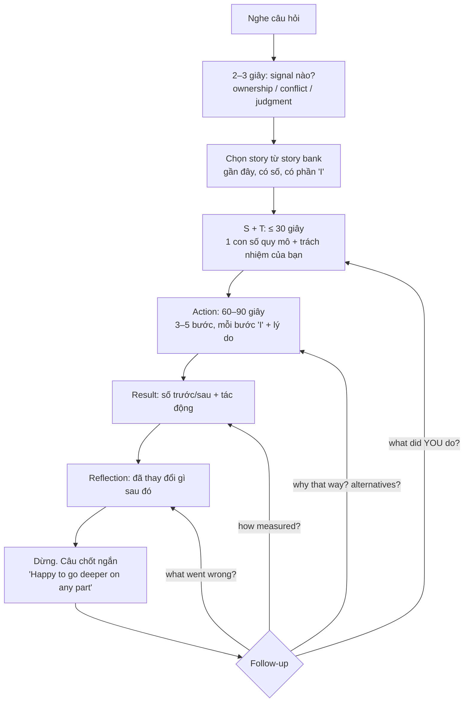
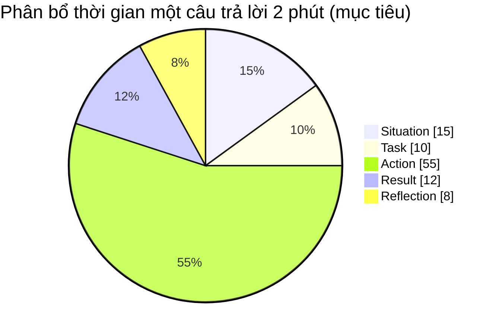

## Bối cảnh & vấn đề

Ứng viên được hỏi "Tell me about the biggest technical challenge you've faced." Anh ta bắt đầu bằng lịch sử công ty, kiến trúc tổng thể, sáu module, ba team, khách hàng ở hai châu lục. Hai phút rưỡi trôi qua, interviewer vẫn chưa biết vấn đề là gì. Rồi phần quan trọng nhất được nói gọn trong một câu: "So we added some caching and optimized queries, and it was much faster." Interviewer hỏi "How much faster?" và nhận được "A lot, the business was happy."

Câu chuyện đó có thể là thật và có thể là một thành tích tốt. Nhưng trên tờ feedback, interviewer chỉ ghi được: "long context, vague action, no measurable result". Vấn đề không phải nội dung mà là **cấu trúc**: thời gian bị dồn vào phần không được chấm (bối cảnh), phần được chấm (hành động của bạn, lý do, kết quả) bị nén lại, và không có con số nào để bảo vệ.

**STAR** (Situation, Task, Action, Result) là khung kể chuyện được hầu hết hướng dẫn phỏng vấn khuyến nghị, kể cả trang tuyển dụng của Amazon. Track này dùng biến thể **STARR**, thêm **Reflection** ở cuối, vì ở level senior "bạn học được gì và đã thay đổi gì" là signal riêng. Bài này dạy cách dùng khung đó đúng tỷ lệ, cách nói "I" mà không nghe khoe khoang, cách xử lý số liệu khi bạn không nhớ chính xác, và cách để follow-up làm câu chuyện mạnh lên thay vì làm nó vỡ.

## Khái niệm

### Situation: bối cảnh tối thiểu

**Situation** là đủ bối cảnh để người nghe hiểu vì sao vấn đề khó hoặc quan trọng, và không hơn. Mục tiêu là 1–3 câu, khoảng 15–20 giây. Hãy chọn đúng những chi tiết mà phần Action sẽ dùng tới: nếu Action nói về index theo tenant, Situation phải có "multi-tenant" và "một số tenant lớn"; nếu không, bỏ.

Một mẹo thực dụng: Situation nên chứa **một con số mô tả quy mô hoặc mức độ** ("p95 từ 600 ms lên 2,4 s", "migration trên bảng 80 triệu dòng", "deadline demo trong 5 ngày"). Con số này làm người nghe hiểu ngay độ khó, thay cho cả đoạn mô tả kiến trúc.

**Interview angle:** nếu interviewer cần thêm bối cảnh, họ sẽ hỏi. Bối cảnh thiếu thì dễ bù; bối cảnh thừa thì ăn mất thời gian follow-up.

### Task: trách nhiệm của bạn

**Task** trả lời "bạn chịu trách nhiệm gì trong tình huống đó?". Đây là câu ngắn nhất (1 câu) nhưng quan trọng vì nó **định nghĩa phần "I"** cho cả câu chuyện. "I owned the checkout API" khác với "I was asked to help the team lead investigate" và khác với "Nobody owned it, I picked it up". Câu cuối là một signal ownership mạnh, nhưng chỉ nói khi đúng là vậy.

Task cũng là nơi nói ràng buộc: thời hạn, không được downtime, không được mất dữ liệu. Ràng buộc biến một việc "nhiều việc" thành một việc "khó", và đó là khác biệt mà red flag của behavioral-009 ("the 'challenge' was just a lot of work") nhắm vào.

**Interview angle:** interviewer sẽ đối chiếu Task với Action: nếu bạn nói "I owned it" mà Action toàn "we", câu chuyện mất độ tin.

### Action: phần được chấm nhiều nhất

**Action** chiếm khoảng 50–60% thời lượng. Đây là chuỗi bước **bạn** đã làm, mỗi bước kèm **lý do** ("vì sao bước đó") và, nếu có, **khó khăn hoặc phương án bị loại**. Ba thành phần này làm Action từ "danh sách việc" thành "bằng chứng về judgment".

Cấu trúc tốt cho Action thường là 3–5 bước theo thời gian: chẩn đoán (đo, thu hẹp phạm vi), quyết định (các lựa chọn và lý do chọn), thực thi (cách giảm rủi ro), và bước ngoài phạm vi (monitoring, docs, chia sẻ). Động từ mạnh và cụ thể: "I pulled the trace", "I proposed", "I tested on a production-sized copy", thay vì "I worked on", "I helped with", "I was involved in".

**Interview angle:** follow-up phổ biến nhất của Action là "What alternative did you seriously consider, and why didn't you go with it?" (follow-up của behavioral-009). Chuẩn bị sẵn một phương án bị loại cho mỗi story.

### Result: con số và tác động

**Result** là kết quả đo được, cộng với **tác động** lên user, business hoặc team. "p95 về 450 ms" là kết quả; "timeout alert dừng, ticket support về checkout giảm" là tác động. Nếu kết quả không tốt (story về failure), Result vẫn phải trung thực: chuyện gì đã xảy ra, bạn khắc phục ra sao.

**Số liệu thật** là phần nhiều ứng viên yếu nhất, và behavioral-044 ("Your CV has no numbers…") hỏi thẳng vào nó. Nguyên tắc: không bịa số chính xác mà bạn không bảo vệ được. Nếu không nhớ chính xác, nói **khoảng** và **nguồn**: "theo dashboard lúc đó, khoảng 2 giây xuống dưới 500 ms". Nếu không có số đo, nói thật và nói bạn đã thay đổi gì: "lúc đó chúng tôi chưa đo trước/sau, đó là bài học; giờ tôi luôn ghi baseline".

**Interview angle:** follow-up của 044 là "How did you measure that, and what else changed at the same time that could explain the improvement?". Câu trả lời mạnh nêu cách đo (APM, log, query `EXPLAIN ANALYZE`) và loại trừ yếu tố gây nhiễu (traffic thấp hơn, deploy khác cùng tuần).

### Reflection: bài học và thay đổi hành vi

**Reflection** là 1–2 câu cuối: bạn học được gì, và quan trọng hơn, **bạn đã làm khác đi thế nào** sau đó. "I learned communication is important" là reflection rỗng. "Since then I add slow-query alerts per tenant before onboarding a large customer, and I added that to our onboarding checklist" là reflection có bằng chứng.

Reflection là chỗ câu chuyện mid trở thành câu chuyện senior: nó cho thấy bạn biến một sự kiện thành **thay đổi hệ thống** hoặc **thay đổi thói quen**. Với câu "hardest bug" (behavioral-025), reflection thường là observability hoặc test bạn thêm để lần sau tìm nhanh hơn.

**Interview angle:** nhiều interviewer hỏi thẳng "What would you do differently?" nếu bạn không nói. Nói trước thì bạn kiểm soát được câu chuyện.

### "I" và "we"

Quy tắc đơn giản: **"we" cho bối cảnh và kết quả chung, "I" cho hành động của bạn**. "We had a checkout outage. I was on call; I rolled back the release first, then I…". Ứng viên Việt Nam (và nhiều nền văn hoá châu Á) hay thấy nói "I" là thiếu khiêm tốn; nhưng trong behavioral interview, "we" làm interviewer không chấm được bạn. Bạn vẫn có thể ghi công người khác một cách rõ ràng: "My teammate handled the frontend; I did the API and the migration."

**Interview angle:** red flag "Only 'we' — no personal contribution" xuất hiện ở nhiều câu của track (041, 046). Nếu thật sự bạn chỉ đóng góp một phần nhỏ, chọn story khác.

### Học nhanh như một câu chuyện STAR

Câu "Tell me about a time you had to learn a new technology or domain quickly" (behavioral-016) hay bị trả lời bằng danh sách nguồn học ("I read the docs, watched videos"). Dùng STAR thì Action là **phương pháp** học có hệ thống: docs chính thức trước, POC nhỏ để kiểm chứng hiểu biết, đọc code có sẵn trong repo, hỏi người biết những câu cụ thể, áp dụng ngay vào task thật. Result là **giao được gì trong bao lâu**. Reflection là phương pháp bạn tái sử dụng, và hiện đang áp dụng cho khoảng trống nào.

**Interview angle:** follow-up "What did you get wrong at first because you were new to it?" kiểm tra bạn có thật sự đi qua giai đoạn học không. Chuẩn bị một lỗi cụ thể (ví dụ: dùng sai consumer group, quên `await` trong transaction).

## Cơ chế hoạt động

Flow dưới đây là cách xử lý một câu behavioral từ lúc nghe tới hết follow-up. Nó giống diagram trong overview của track, nhưng có thêm các bước bạn làm trong đầu trước khi mở miệng.



Có ba điểm cần giải thích. Thứ nhất, bước **chọn signal** trước khi chọn story: cùng một incident có thể dùng cho câu ownership, câu pressure, hay câu learning, nhưng phần nhấn mạnh khác nhau. Với câu ownership, nhấn mạnh việc bạn nhận việc không ai giao; với câu pressure, nhấn mạnh cách bạn ưu tiên khi thời gian ít.

Thứ hai, bước **dừng**. Nhiều ứng viên sợ khoảng lặng nên nói thêm chi tiết sau Reflection, làm câu trả lời phình ra và che mất câu chốt. Câu trả lời 2 phút rồi dừng, để interviewer chọn chỗ đào, là cách tương tác tốt nhất.

Thứ ba, các mũi tên follow-up quay về **đúng phần** của STAR. "Why that way?" quay về Action, "How measured?" quay về Result. Nếu bạn chuẩn bị story theo đúng năm phần, mỗi follow-up có sẵn một ngăn chứa chi tiết. Diagram thứ hai cho thấy tỷ lệ thời gian mục tiêu:



Đây là con số mục tiêu, không phải luật. Câu "hardest bug" có thể dành 65% cho Action vì phần chẩn đoán là trọng tâm; câu "failure" có thể dành nhiều hơn cho Reflection. Điều không đổi: Situation không bao giờ là phần dài nhất.

## Ví dụ thực tế

### Đo một câu trả lời đã viết ra

Cách luyện hiệu quả nhất là **viết** câu trả lời ra, đo, rồi mới nói to. Script TypeScript dưới đây đếm từ từng phần STARR, ước lượng thời gian nói (khoảng 140 từ/phút cho người nói tiếng Anh không phải bản xứ, con số ước lượng), đếm "I", "we" và số liệu, rồi cảnh báo các lỗi cấu trúc. Chạy bằng Node 22+ (`--experimental-strip-types`), không cần cài gì.

```ts
// star-check.ts: đo một câu trả lời STAR đã viết ra (đọc to ~140 từ/phút)
type Part = "S" | "T" | "A" | "R" | "R2";
const WPM = 140;

function check(label: string, answer: Record<Part, string>) {
  const words = (s: string) => s.split(/\s+/).filter(Boolean);
  const total = Object.values(answer).reduce((n, s) => n + words(s).length, 0);
  console.log(`\n== ${label}: ${total} words ≈ ${Math.round((total / WPM) * 60)} s`);
  for (const [k, s] of Object.entries(answer) as [Part, string][]) {
    const pct = Math.round((words(s).length / total) * 100);
    console.log(`${k.padEnd(2)} ${String(pct).padStart(3)}%  ${"#".repeat(Math.round(pct / 4))}`);
  }
  const all = Object.values(answer).join(" ");
  const i = (all.match(/\bI\b/g) ?? []).length;
  const we = (all.match(/\bwe\b/gi) ?? []).length;
  const nums = (all.match(/\d[\d.,]*\s?(%|ms|s|x|k|min|h|tenants?|users?)?/g) ?? []).length;
  console.log(`"I": ${i}  "we": ${we}  numbers: ${nums}`);
  const a = words(answer.A).length / total;
  if (a < 0.5) console.log("WARN Action < 50% of the answer");
  if (words(answer.S).length + words(answer.T).length > total * 0.3) console.log("WARN Situation+Task > 30%");
  if (we > i) console.log('WARN more "we" than "I"');
  if (nums === 0) console.log("WARN no numbers in the answer");
  if (!answer.R2.trim()) console.log("WARN no reflection");
}

check("weak", {
  S: "So at my previous company we had this big e-commerce platform with a lot of tenants and a lot of different modules, and the checkout was a really important part of it, and there were many teams working on it, and we had some performance problems that the business was complaining about for quite a while.",
  T: "We needed to make it faster.",
  A: "We looked into it and we added some caching and optimized some queries.",
  R: "After that it was much faster and everyone was happy.",
  R2: "",
});

check("strong", {
  S: "On a multi-tenant e-commerce platform, checkout p95 had crept from 600 ms to about 2.4 s at peak for a few large tenants.",
  T: "I owned the checkout API, so I took the investigation.",
  A: "I first checked whether it was all tenants or some: it was 3 tenants with the largest order history. I pulled the slow query from the APM trace and read its plan; it was scanning the orders table by tenant and sorting in memory. I proposed a composite index on tenant_id and created_at, tested it on a production-sized copy, and built it online during low traffic. I also added a per-tenant latency panel so we would see this pattern earlier.",
  R: "p95 for those tenants went back to about 450 ms, and the timeout alerts stopped.",
  R2: "Next time I would add slow-query alerts before a tenant grows that large, which I later added to our checklist.",
});
```

Output thật (Node 24.21):

```text
$ node --experimental-strip-types star-check.ts

== weak: 85 words ≈ 36 s
S   66%  #################
T    7%  ##
A   15%  ####
R   12%  ###
R2   0%  
"I": 0  "we": 5  numbers: 0
WARN Action < 50% of the answer
WARN Situation+Task > 30%
WARN more "we" than "I"
WARN no numbers in the answer
WARN no reflection

== strong: 148 words ≈ 63 s
S   16%  ####
T    7%  ##
A   54%  ##############
R   10%  ###
R2  14%  ####
"I": 8  "we": 1  numbers: 6
```

Đọc output: câu trả lời yếu ngắn hơn nhưng 66% là bối cảnh, không có "I", không có số. Câu mạnh dài gần gấp đôi mà vẫn dưới một phút rưỡi khi nói (bản viết là bản nén; khi nói bạn sẽ thêm vài câu chuyển, thường lên khoảng 2 phút). Script chỉ đo **hình dạng**, không đo nội dung: một câu trả lời qua hết cảnh báo vẫn có thể yếu nếu lý do trong Action nông. Các số trong ví dụ là minh hoạ; khi luyện, dùng số thật của bạn.

### Weak vs strong cho "hardest bug" (behavioral-025)

```text
WEAK (minh hoạ)
"We had a bug where some users saw wrong prices. It was very hard to find
because it only happened sometimes. After a few days we found it was a cache
issue and we fixed it. Then it worked."
```

Interviewer nghe: không có phương pháp, không có giả thuyết bị loại, root cause chỉ là "a cache issue". Gần với red flag "It just started working after I restarted it".

```text
STRONG (minh hoạ)
S: "Some customers intermittently saw another store's prices on product pages
   — maybe 1 in 500 page views, only in production."
T: "I owned the product API and its Redis cache, so I took it."
A: "I couldn't reproduce locally, so I first added the tenant id and cache key
   to the log line for every price response. Within a day the logs showed the
   wrong price always came from a cache hit, never from the DB. My first
   hypothesis was a race between two writers; I ruled it out because the bad
   values were consistent, not stale. Then I compared keys: the key was built
   from the product slug only, and two tenants had products with the same slug
   after a recent import. The cache key had never included the tenant id
   because, when it was written, every slug was globally unique."
R: "I added the tenant id to the key with a versioned prefix so old entries
   expired naturally, and the reports stopped the same day. I added a test that
   creates two tenants with the same slug."
R: "The bigger lesson: any cache key in a multi-tenant system must start with
   the tenant. I wrote a small key-builder helper and a lint rule that flags
   raw redis.get calls, so the next person can't make the same mistake."
```

Bình luận: có **giả thuyết sai đã loại** (race) và **bằng chứng** dẫn tới root cause (log key + tenant). Moment "realized" mà follow-up hỏi là lúc so key của hai tenant. Reflection biến bug thành thay đổi hệ thống (helper + lint), đúng signal senior. Câu chuyện này cũng dùng lại được cho câu ownership và câu "raised the bar" (bài [Leadership](/tracks/behavioral/learn/leadership-without-authority)).

### Template STARR (điền vào)

```text
CÂU HỎI / SIGNAL: _________________________________________

S (≤ 3 câu, 1 con số quy mô): _____________________________
T (trách nhiệm của tôi + ràng buộc): ______________________
A (3–5 bước):
  1. Tôi ______ vì ______
  2. Tôi ______ vì ______  (phương án bị loại: ______ vì ______)
  3. Tôi ______ vì ______  (khó khăn giữa chừng: ______)
  4. Ngoài phạm vi: monitoring / docs / chia sẻ: ______
R (số trước → sau, nguồn đo, tác động user/business): ______
R (đã thay đổi gì sau đó, bằng chứng): ____________________

FOLLOW-UP CHUẨN BỊ SẴN
  Why that way? ______   Alternatives? ______
  How measured? ______   What went wrong? ______
```

## Trade-offs & lựa chọn thay thế

| Khung | Cấu trúc | Hợp với | Hạn chế |
|---|---|---|---|
| STAR | Situation, Task, Action, Result | Câu "Tell me about a time", phổ biến nhất | Thiếu bài học, dễ dừng ở kết quả |
| STARR / STAR+L | STAR + Reflection (hoặc Learning) | Senior, câu failure, câu incident | Reflection rỗng thì phản tác dụng |
| CAR | Challenge, Action, Result | Câu ngắn, follow-up nhanh | Mất phần "trách nhiệm của tôi" |
| SOAR | Situation, Obstacle, Action, Result | Câu "biggest challenge", nhấn vào trở ngại | Dễ kể lể khó khăn |
| Present–Past–Future | Hiện tại, quá khứ, tương lai | "Tell me about yourself" | Không dùng cho câu behavioral |

Chọn khung theo câu hỏi, không theo sở thích. Câu "Tell me about a time" dùng STARR. Câu "biggest challenge" có thể nhấn Obstacle như SOAR, nhưng vẫn dành đa số thời gian cho Action. Câu opener "Tell me about yourself" không phải STAR (xem bài [Story bank](/tracks/behavioral/learn/story-bank-opener)). Câu scenario giả định dùng cấu trúc "các bước tôi sẽ làm + lý do + một kinh nghiệm thật gần nhất".

Về độ dài: câu trả lời 1,5–2 phút rồi để follow-up thường tốt hơn câu 4 phút đầy đủ. Ngoại lệ là khi interviewer im lặng, không hỏi thêm: khi đó hỏi ngược "Would you like me to go deeper into the diagnosis or the rollout?".

## Edge cases & failure modes

- **Story quá cũ** (4–5 năm trước): chi tiết mờ, số liệu mất, và nó phản ánh level cũ của bạn. Ưu tiên story 1–2 năm gần đây; dùng story cũ chỉ khi nó là ví dụ mạnh nhất và bạn còn nhớ chi tiết.
- **Không nhớ số chính xác**: nói khoảng + nguồn ("khoảng 2 giây theo dashboard"). Không bao giờ bịa số chính xác như "giảm 73,4%"; follow-up "how did you measure?" sẽ lộ ngay.
- **Kết quả bị nhiễu**: traffic giảm cùng tuần, một team khác cũng deploy tối ưu. Nói thẳng yếu tố gây nhiễu và cách bạn tách (so cùng giờ tuần trước, so tenant không đổi). Điều này làm câu trả lời **mạnh hơn**, vì nó cho thấy tư duy đo lường.
- **Bị ngắt giữa chừng**: interviewer cắt ngang để hỏi. Trả lời câu hỏi, rồi hỏi "Shall I continue with what happened next?" thay vì bỏ dở.
- **Câu chuyện có thông tin nhạy cảm** (tên khách hàng, sự cố bảo mật chưa công bố): ẩn danh hoá ("một khách hàng tài chính lớn"), bỏ chi tiết khai thác. Interviewer tôn trọng việc bạn giữ bí mật.
- **Kỹ thuật quá sâu cho interviewer không chuyên** (HR, manager): giữ cấu trúc, đổi độ sâu: "một index thiếu khiến database phải đọc toàn bảng" thay vì nói tên toán tử trong query plan.
- **Học thuộc cả đoạn**: khi bị hỏi chệch kịch bản, bạn khựng. Nhớ năm phần và con số, không nhớ câu chữ.

## Pitfalls

- ❌ Situation dài 2 phút → ✅ 1–3 câu với một con số quy mô, vì bối cảnh không được chấm.
- ❌ Action là danh sách việc ("we added caching and optimized queries") → ✅ 3–5 bước, mỗi bước có "I" và lý do, vì judgment nằm ở lý do.
- ❌ "Much faster", "significantly" → ✅ số trước/sau và nguồn đo, hoặc thừa nhận chưa đo và nói đã đổi cách làm.
- ❌ Bịa số chính xác → ✅ số ước lượng có nguồn, vì số bịa vỡ ở follow-up đầu tiên.
- ❌ Bỏ qua phương án bị loại → ✅ chuẩn bị một alternative và lý do loại, vì đây là follow-up gần như chắc chắn ở câu technical challenge.
- ❌ Reflection rỗng ("I learned a lot") → ✅ thay đổi cụ thể và bằng chứng đã áp dụng.
- ❌ Kể "challenge" chỉ là nhiều việc → ✅ chọn vấn đề có ràng buộc thật (không downtime, dữ liệu lớn, nguyên nhân không rõ).
- ❌ Nói tiếp sau khi đã xong vì sợ khoảng lặng → ✅ câu chốt ngắn rồi dừng, để interviewer chọn chỗ đào.

## Tóm tắt

- **STARR** = Situation, Task, Action, Result, Reflection; mục tiêu khoảng 2 phút.
- Situation + Task ≤ 30%, **Action 50–60%**, Result và Reflection phần còn lại.
- Action = 3–5 bước, mỗi bước "I" + lý do; chuẩn bị sẵn một phương án bị loại.
- Result cần **số thật** hoặc khoảng ước lượng có nguồn; không bịa số chính xác.
- Reflection phải là **thay đổi hành vi/hệ thống** có bằng chứng, không phải "tôi học được nhiều".
- "We" cho bối cảnh, "I" cho hành động; ghi công người khác một cách cụ thể.
- Viết câu trả lời ra và đo hình dạng trước khi luyện nói; nhớ khung và số, không nhớ câu chữ.
