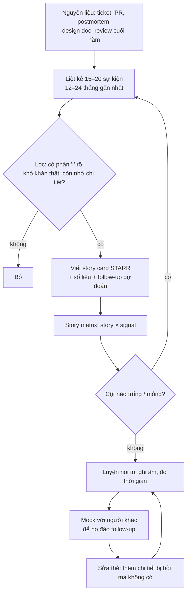
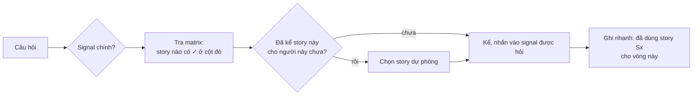

## Bối cảnh & vấn đề

Ba ngày trước buổi phỏng vấn, một kỹ sư mở danh sách 50 câu behavioral và bắt đầu chuẩn bị từng câu một. Tới câu thứ 15 thì anh nhận ra mình đang viết lại cùng một câu chuyện incident lần thứ tư, với chi tiết hơi khác nhau mỗi lần. Tới câu 30 thì hết thời gian. Trong buổi phỏng vấn, câu "Tell me about a time you disagreed with your lead" rơi vào nhóm anh chưa chuẩn bị, và anh phải nghĩ ra một câu chuyện ngay tại chỗ, kể lộn xộn và không có kết quả.

Cách làm đúng ngược lại: chuẩn bị **câu chuyện** trước, rồi ánh xạ câu chuyện vào câu hỏi. Một sự cố production được kể kỹ có thể trả lời câu incident, câu ownership, câu pressure, câu hardest bug và câu learning, chỉ đổi phần nhấn mạnh. Tám đến mười câu chuyện thật, mỗi câu phục vụ 3–4 loại câu hỏi, là đủ cho gần như mọi buổi behavioral. Bộ câu chuyện đó gọi là **story bank**.

Bài này dạy cách xây story bank (chọn story nào, ghi gì, kiểm tra độ phủ), rồi dùng nó cho nhóm câu mở đầu: "Tell me about yourself", dự án bạn tự hào nhất, dự án lớn nhất bạn từng tham gia, giải thưởng trên CV, và câu khó chịu nhất với nhiều ứng viên: "CV của bạn ghi kỹ năng X mà tôi không thấy trong dự án nào". Phần mở đầu quyết định ấn tượng đầu tiên và định hướng các câu follow-up sau, nên nó đáng được chuẩn bị kỹ như một câu STAR.

## Khái niệm

### Story bank là gì và vì sao 8–10 câu

**Story bank** là bộ câu chuyện thật từ công việc của bạn, mỗi câu được ghi lại theo cấu trúc [STARR](/tracks/behavioral/learn/star-starr) với số liệu và các follow-up dự đoán. Con số 8–10 đến từ thực tế: một vòng behavioral 45–60 phút có 4–6 câu chính, một quy trình đầy đủ có 2–3 vòng có phần behavioral; bạn cần đủ câu để không phải kể lại cùng một chuyện cho cùng một hội đồng, nhưng không nhiều tới mức không nhớ nổi chi tiết.

Story bank không phải kịch bản học thuộc. Mỗi mục là một **thẻ** (story card) ghi ý chính: một dòng tiêu đề, S/T một câu, 3–5 bước Action, số liệu, bài học, signal mà câu chuyện chứng minh được, và 2–3 follow-up bạn đoán trước. Khi luyện, bạn kể từ thẻ, mỗi lần một cách hơi khác, để quen với việc kể chứ không phải đọc.

**Interview angle:** interviewer có kinh nghiệm nhận ra ngay câu trả lời học thuộc (nhịp đều, không có ngập ngừng tự nhiên, khựng lại khi bị hỏi chệch). Thẻ ý chính giúp bạn linh hoạt.

### Chọn story: các nguồn và tiêu chí

Nguồn story tốt nhất là những thứ đã để lại dấu vết: ticket bạn đóng, PR lớn, postmortem, design doc, tin nhắn cảm ơn, review cuối năm. Julia Evans gọi tài liệu tổng hợp những việc này là **brag document**; nếu bạn chưa có, dành một buổi tối lục lại lịch sử commit và ticket của 12–24 tháng gần nhất. Bạn sẽ nhớ ra nhiều câu chuyện hơn mình nghĩ.

Tiêu chí chọn: **gần đây** (1–2 năm, chi tiết còn rõ), **có phần "I" rõ ràng**, **có khó khăn thật** (ràng buộc, bất đồng, sai lầm), **có số liệu hoặc có thể thu thập lại số liệu**, và **đa dạng** (không phải 8 câu đều là performance tuning). Bộ story nên có ít nhất một câu cho mỗi nhóm: feature end-to-end, incident, migration hoặc thay đổi rủi ro, bất đồng, thất bại, học nhanh, giúp người khác, cải thiện quy trình.

**Interview angle:** bất cứ story nào bạn chọn cũng có thể bị đào sâu kỹ thuật. Chỉ đưa vào bank những câu bạn sẵn sàng vẽ kiến trúc và giải thích quyết định.

### Story matrix: kiểm tra độ phủ

**Story matrix** là bảng story × signal: mỗi hàng là một câu chuyện, mỗi cột là một signal (ownership, conflict, failure, incident, influence, deadline, learning, mentoring, feedback, ambiguity). Đánh dấu ô nào câu chuyện chứng minh được một cách thuyết phục. Bảng này cho bạn hai thông tin: **khoảng trống** (cột không có dấu nào: phải tìm thêm story) và **điểm mỏng** (cột chỉ có một dấu: nếu câu đó đã dùng ở vòng trước, bạn không còn dự phòng).

Overview của track có một bảng matrix mẫu. Phần Ví dụ thực tế bên dưới có một script nhỏ tự động in matrix và cảnh báo khoảng trống.

**Interview angle:** câu hỏi về conflict và failure là hai cột hay trống nhất, vì ứng viên ngại kể. Đó cũng là hai cột interviewer senior hay hỏi nhất.

### "Tell me about yourself": Present–Past–Future

Câu behavioral-001 **không phải** câu STAR. Nó là phần giới thiệu 60–90 giây theo khung **Present → Past → Future**. **Present**: bạn đang là ai và làm gì (vai trò, số năm, stack chính, loại sản phẩm, phần bạn own). **Past**: 2–3 điểm nhấn liên quan tới vị trí đang ứng tuyển, chọn lọc chứ không liệt kê theo thời gian. **Future**: vì sao bạn ở đây hôm nay, một lý do cụ thể về công ty hoặc vai trò.

Câu này có một chức năng chiến lược: nó **định hướng follow-up**. Điểm nhấn bạn chọn ở phần Past là những gì interviewer sẽ hỏi tiếp, nên hãy chọn những câu chuyện mạnh nhất trong story bank. Kết thúc bằng một câu mở cửa ("Tôi có thể kể thêm về phần tenant isolation nếu anh/chị quan tâm") là cách mời interviewer vào vùng bạn mạnh.

**Interview angle:** red flag lớn nhất là đọc lại CV theo thứ tự thời gian trong 5 phút. Interviewer đã có CV; họ muốn nghe bạn chọn cái gì quan trọng.

### Dự án lớn nhất và dự án tự hào nhất

Hai câu nghe giống nhau nhưng đo khác nhau. behavioral-046 ("biggest and most important project, team size, domain, your part") đo **khả năng mô tả quy mô và vị trí của bạn trong đó**: domain, số user/tenant/request, số người trong team và cơ cấu (BE/FE/QA), bạn là IC hay owner module nào, 2–3 việc bạn own. Ứng viên không trả lời được team bao nhiêu người hay hệ thống phục vụ bao nhiêu user sẽ bị nghi là không thật sự hiểu dự án.

behavioral-004 ("project you are most proud of") đo **giá trị của bạn**: vì sao *bạn* tự hào. Câu trả lời mạnh dùng STAR với 2–3 quyết định kỹ thuật quan trọng bạn đưa ra, và phần Reflection giải thích niềm tự hào (học được điều khó, tác động tới người dùng, giúp team). Follow-up gần như chắc chắn là "What was the hardest technical decision, and what alternatives did you reject?".

**Interview angle:** cả hai câu có red flag giống nhau: mô tả sản phẩm thay vì đóng góp của mình.

### Giải thưởng của team: tách phần "I"

behavioral-041 hỏi về một giải thưởng team ghi trên CV. Đây là cái bẫy dễ thấy: giải thưởng thuộc về team, nên phản xạ tự nhiên là nói "we". Câu trả lời mạnh có ba phần: giải ghi nhận điều gì (delivery đúng hạn, chất lượng, khách hàng hài lòng), **phần cụ thể của bạn** (feature nào, fix nào, cải thiện quy trình nào, hỗ trợ ai), và mối liên hệ giữa phần của bạn với lý do team được giải.

Follow-up "If I asked a teammate from that time, what would they say you did?" kiểm tra tính nhất quán. Trả lời bằng một câu cụ thể ("họ sẽ nói tôi là người viết lại pipeline import và gỡ việc phải chạy tay mỗi tối thứ Sáu").

**Interview angle:** nếu thật lòng phần của bạn nhỏ, nói rõ ("tôi đóng góp module X, phần lớn công là của Y"). Trung thực ở đây tăng độ tin cho các câu khác.

### Khoảng trống trên CV: trung thực có cấu trúc

behavioral-042 xử lý tình huống CV ghi kỹ năng (NestJS, AWS…) mà không có dự án nào thể hiện. Interviewer không bắt lỗi chuyện bạn thiếu kinh nghiệm; họ kiểm tra **bạn có thổi phồng không**. Câu trả lời có cấu trúc gồm ba phần: nói rõ mức độ thật ("chưa dùng trong production; tôi đã làm X trong side project"), **kinh nghiệm chuyển giao** (Express/Node architecture sang NestJS module và DI; Kafka và caching sang các dịch vụ managed tương đương), và **kế hoạch ramp-up** nếu vào team.

Follow-up hay gặp là một câu kỹ thuật thực hành: "Walk me through how you would deploy a Node.js service you built on AWS today." Chuẩn bị một câu trả lời trung thực ở mức bạn thật sự biết, và nói rõ phần nào bạn đã làm tay, phần nào bạn mới đọc.

**Interview angle:** red flag là "overclaims production experience and collapses under follow-up". Một khoảng trống được thừa nhận kèm kế hoạch thường không làm bạn trượt; một lời nói dối bị phát hiện thì gần như chắc chắn.

## Cơ chế hoạt động

Diagram đầu là quy trình xây story bank, từ nguyên liệu thô tới bộ thẻ sẵn sàng luyện.



Vòng lặp quan trọng nhất là từ **mock** quay về **sửa thẻ**. Lần đầu kể cho người khác nghe, bạn sẽ bị hỏi những câu không ngờ tới ("bảng đó lớn bao nhiêu?", "ai review migration?"). Mỗi câu không trả lời được là một chi tiết cần ghi thêm vào thẻ, hoặc một dấu hiệu story đó chưa đủ chắc để đưa vào bank.

Diagram thứ hai là cách dùng story bank trong buổi phỏng vấn: ánh xạ câu hỏi sang story và theo dõi những gì đã kể.



Trong cùng một vòng, tránh dùng một story cho hai câu. Giữa các vòng khác nhau (người phỏng vấn khác), dùng lại story mạnh nhất là bình thường, vì mỗi interviewer chấm competency riêng. Việc ghi nhanh story đã dùng nghe có vẻ thừa nhưng giúp tránh lặp lại khi đã mệt ở vòng thứ ba.

## Ví dụ thực tế

### Kiểm tra độ phủ story bank bằng script

Script dưới đây giữ story bank như dữ liệu, in matrix và cảnh báo khoảng trống, story thiếu số liệu, story quá cũ. Story trong ví dụ là minh hoạ; thay bằng của bạn.

```ts
// story-bank.ts: kiểm tra story bank phủ đủ signal chưa
const SIGNALS = ["ownership", "conflict", "failure", "incident", "influence",
  "deadline", "learning", "mentoring", "feedback", "ambiguity"] as const;
type Signal = (typeof SIGNALS)[number];

type Story = { id: string; title: string; ageMonths: number; hasNumbers: boolean; signals: Signal[] };

const bank: Story[] = [
  { id: "S1", title: "Checkout end-to-end", ageMonths: 8, hasNumbers: true, signals: ["ownership", "deadline"] },
  { id: "S2", title: "Cross-tenant cache bug", ageMonths: 5, hasNumbers: true, signals: ["incident", "ownership", "learning"] },
  { id: "S3", title: "Zero-downtime column split", ageMonths: 12, hasNumbers: true, signals: ["ownership", "failure", "influence"] },
  { id: "S4", title: "Disagreed with lead on queue design", ageMonths: 18, hasNumbers: false, signals: ["conflict", "influence"] },
  { id: "S5", title: "Ramped up on Kafka in 2 weeks", ageMonths: 26, hasNumbers: true, signals: ["learning", "deadline"] },
  { id: "S6", title: "Onboarded a junior on the API", ageMonths: 10, hasNumbers: false, signals: ["mentoring"] },
];

const pad = (s: string, n: number) => s.slice(0, n).padEnd(n);
console.log(pad("story", 34) + SIGNALS.map((s) => s.slice(0, 4)).join(" "));
for (const st of bank)
  console.log(pad(`${st.id} ${st.title}`, 34) + SIGNALS.map((s) => (st.signals.includes(s) ? " ✓  " : " .  ")).join(" "));

const cover = Object.fromEntries(SIGNALS.map((s) => [s, bank.filter((b) => b.signals.includes(s)).length]));
const gaps = SIGNALS.filter((s) => cover[s] === 0);
const thin = SIGNALS.filter((s) => cover[s] === 1);
console.log("\ngaps (0 stories):", gaps.join(", ") || "none");
console.log("thin (1 story, no backup):", thin.join(", ") || "none");
for (const st of bank) {
  if (!st.hasNumbers) console.log(`${st.id}: no numbers yet, collect before the interview`);
  if (st.ageMonths > 24) console.log(`${st.id}: ${st.ageMonths} months old, check you still remember details`);
}
```

Output thật (Node 24.21, `node --experimental-strip-types story-bank.ts`):

```text
story                             owne conf fail inci infl dead lear ment feed ambi
S1 Checkout end-to-end             ✓    .    .    .    .    ✓    .    .    .    .  
S2 Cross-tenant cache bug          ✓    .    .    ✓    .    .    ✓    .    .    .  
S3 Zero-downtime column split      ✓    .    ✓    .    ✓    .    .    .    .    .  
S4 Disagreed with lead on queue de .    ✓    .    .    ✓    .    .    .    .    .  
S5 Ramped up on Kafka in 2 weeks   .    .    .    .    .    ✓    ✓    .    .    .  
S6 Onboarded a junior on the API   .    .    .    .    .    .    .    ✓    .    .  

gaps (0 stories): feedback, ambiguity
thin (1 story, no backup): conflict, failure, incident, mentoring
S4: no numbers yet, collect before the interview
S5: 26 months old, check you still remember details
S6: no numbers yet, collect before the interview
```

Đọc output: bank sáu câu này **thiếu hẳn** story về feedback và ambiguity (cần ít nhất hai câu nữa), và bốn signal chỉ có một câu (conflict, failure, incident, mentoring), nghĩa là nếu hai vòng cùng hỏi conflict thì vòng sau không còn câu dự phòng. Ownership có ba câu, dư dả. Đây đúng là hình dạng phổ biến của story bank lần đầu: nhiều câu kỹ thuật, ít câu về con người.

### "Tell me about yourself" (behavioral-001): weak vs strong

```text
WEAK (minh hoạ)
"I graduated in 2021 from university in software engineering. Then in 2022 I
joined my company as a junior developer. My first project was a financial
platform where I used Node.js and React. After that I moved to a frontend
project. After that I worked on a backend migration. Now I work on an
e-commerce platform. In my free time I like playing football and..."
```

Bình luận: đọc lại CV theo thời gian, không có điểm nhấn, không có lý do ứng tuyển, lạc sang đời tư. Interviewer không biết hỏi gì tiếp.

```text
STRONG (minh hoạ)
Present: "I'm a full-stack engineer with about [N] years of
experience, mostly TypeScript — Node on the backend, React and Next.js on the
frontend, and SQL databases. For the last two years I've been on a
multi-tenant e-commerce platform where I own features end-to-end, from
breaking down requirements to watching them in production."
Past: "Two things I'd highlight. Before that, I helped migrate a monolith to
Node services talking over Kafka, which is where I learned to care about
backward compatibility. And on the current platform I've done most of the
tenant-aware authorization and a couple of zero-downtime schema migrations."
Future: "I'm looking for a team where I can own a product area for the long
term and take on more of the infrastructure side, which is why your platform
team's role caught my eye. Happy to go deeper into the tenant isolation work
if that's useful."
```

Bình luận: khoảng 140 từ, dưới 90 giây. Hai điểm nhấn ở phần Past là hai story mạnh nhất trong bank, nên follow-up sẽ rơi vào vùng bạn chuẩn bị kỹ. Câu cuối mời interviewer chọn hướng.

### Dự án lớn nhất (behavioral-046): khung 4 ý

```text
STRONG (minh hoạ, điền số thật của bạn)
Domain + scale: "A B2B2C e-commerce platform: retailers run their stores on it,
around [N] tenants and [M] daily orders at peak."
Team: "About [12] engineers — [5] backend, [4] frontend, [2] QA, a tech lead —
split across two time zones. I was a senior IC owning checkout and addresses."
My part: "I designed the checkout API and its idempotency handling, I wrote
the tenant-scoped data access layer the other modules now use, and I ran two
of our zero-downtime migrations."
Result + lesson: "Checkout has had no double-charge incident since launch. If I
did it again I'd put tenant scoping in the database with row-level security,
not just in the application layer."
```

Bình luận: dấu ngoặc vuông là chỗ điền số thật; đừng đi phỏng vấn với ngoặc vuông còn trống. Câu cuối trả lời trước follow-up "what would you design differently today".

### Khoảng trống trên CV (behavioral-042): weak vs strong

```text
WEAK (minh hoạ)
"Yes, I've used NestJS and AWS a lot. I know them well."
(follow-up: "Which AWS services, and how did you handle IAM?")
"Uh... EC2, S3... the DevOps team did most of the setup."
```

```text
STRONG (minh hoạ)
"Honestly: I haven't used NestJS or AWS in production. My production backend
work is Express, where I built our own module structure and dependency
wiring, so Nest's modules and DI map closely to what I've done by hand. I've
built a small Nest API as a side project with guards and interceptors. On AWS,
our deployments were owned by a platform team; I've since deployed my side
project on ECS with RDS and set up the IAM roles myself. If I joined, I'd ask
to shadow the first few deploys and take one service's pipeline as my own
within the first quarter."
```

### Template story card (điền vào)

```text
ID / TIÊU ĐỀ: ______        Thời điểm: ____ (tháng/năm)
SIGNAL: [ ] ownership [ ] conflict [ ] failure [ ] incident [ ] influence
        [ ] deadline [ ] learning [ ] mentoring [ ] feedback [ ] ambiguity
S (1 câu + 1 con số quy mô): _______________________________
T (tôi chịu trách nhiệm gì, ràng buộc gì): _________________
A: 1. ______ vì ______   2. ______ vì ______   3. ______ vì ______
   Phương án bị loại: ______   Người khác tham gia (ghi công): ______
R: ____ → ____ (nguồn: ______)   Tác động: ______
Reflection (đã thay đổi gì sau đó): _______________________
Follow-up dự đoán: 1. ______  2. ______  3. ______
Chi tiết nhạy cảm cần ẩn danh: ______
```

## Trade-offs & lựa chọn thay thế

| Cách chuẩn bị | Ưu điểm | Nhược điểm | Khi nào hợp |
|---|---|---|---|
| Chuẩn bị từng câu hỏi một | Cảm giác đầy đủ | Lặp story, không bao giờ xong, khựng với câu lạ | Không nên làm chính |
| Story bank 8–10 câu + matrix | Phủ rộng, linh hoạt, dễ nhớ | Cần một buổi tối đào lại lịch sử | Mặc định |
| Story bank quá lớn (20+) | Nhiều lựa chọn | Không nhớ nổi chi tiết, kể nông | Hiếm khi |
| Học thuộc nguyên văn | Trôi chảy | Nghe máy móc, vỡ khi bị hỏi chệch | Chỉ cho 2 câu đầu: intro và câu chốt |
| Ứng biến hoàn toàn | Tự nhiên | Lộn xộn, thiếu số, quên Result | Không nên |

Lựa chọn hợp lý là kết hợp: story bank cho các câu "Tell me about a time", và **gần như học thuộc** đúng hai đoạn ngắn là phần giới thiệu (Present–Past–Future) và câu trả lời cho khoảng trống lớn nhất trên CV của bạn. Hai đoạn này được hỏi ở gần như mọi buổi, và nói trôi chảy ở đó tạo đà cho phần còn lại.

Với câu dự án lớn nhất và tự hào nhất, có thể dùng cùng một dự án hoặc hai dự án khác nhau. Dùng hai dự án khác nhau cho thấy độ rộng; dùng cùng một dự án thì phải đổi góc (quy mô và vị trí cho câu 046, quyết định và giá trị cho câu 004).

## Edge cases & failure modes

- **Bạn mới đi làm 1–2 năm**: story bank vẫn đủ 8 câu nếu lấy cả dự án học, side project, open source, hoạt động team. Nói rõ bối cảnh ("trong một side project…"), đừng ngụy trang thành production.
- **Phần lớn công việc là outsourcing, không own sản phẩm lâu dài**: chọn story có quyết định của bạn bên trong scope được giao (thiết kế module, xử lý incident, đề xuất với khách hàng). Câu "Why leaving" ở bài [Career](/tracks/behavioral/learn/career-motivation-closing) có thể nối với mong muốn own sản phẩm lâu dài.
- **NDA và thông tin khách hàng**: ẩn danh hoá tên khách hàng, sản phẩm, số liệu kinh doanh nhạy cảm. Có thể nói tỷ lệ ("giảm khoảng 80%") thay vì con số tuyệt đối nếu cần.
- **Interviewer cắt ngang phần giới thiệu sau 30 giây**: họ muốn đi thẳng vào chuyên môn. Gói lại bằng một câu Future và dừng.
- **Bị hỏi "tell me about yourself" lần thứ ba trong cùng ngày**: vẫn kể đầy đủ; mỗi interviewer cần ghi riêng. Có thể đổi điểm nhấn phần Past theo vai trò người hỏi (engineer nghe kỹ thuật, manager nghe ownership).
- **Story tốt nhất liên quan tới một người vẫn đang làm ở công ty cũ và bạn kể không hay về họ**: đổi góc kể sang hành động của bạn, mô tả người kia công bằng, hoặc chọn story khác.
- **Khoảng trống bị hỏi bằng câu kỹ thuật sâu ngay lập tức**: trả lời tới đúng mức bạn biết, nói rõ ranh giới ("đến đây là phần tôi đã làm; phần auto scaling tôi mới đọc docs").

## Pitfalls

- ❌ Chuẩn bị theo danh sách câu hỏi → ✅ chuẩn bị story rồi ánh xạ, vì một story tốt trả lời được 3–4 câu.
- ❌ Story bank toàn câu kỹ thuật → ✅ có ít nhất một câu cho conflict, failure, feedback, mentoring, vì đó là các cột interviewer senior hỏi nhiều.
- ❌ "Tell me about yourself" = đọc CV theo năm → ✅ Present–Past–Future, 60–90 giây, Past chọn 2–3 điểm nhấn mạnh nhất.
- ❌ Mô tả dự án thay vì đóng góp → ✅ 2–3 việc bạn own, nói bằng "I".
- ❌ Không biết team bao nhiêu người, hệ thống phục vụ bao nhiêu user → ✅ thu thập lại các con số đó trước buổi phỏng vấn.
- ❌ Thổi phồng kỹ năng trên CV → ✅ nói rõ mức thật + kinh nghiệm chuyển giao + kế hoạch, vì lời nói dối bị lộ là trượt.
- ❌ Giải thưởng team kể bằng "we" → ✅ tách phần cụ thể của bạn và liên hệ với lý do team được giải.
- ❌ Học thuộc từng chữ mọi câu → ✅ chỉ gần-thuộc intro và câu khoảng trống; còn lại kể từ thẻ ý chính.

## Tóm tắt

- **Story bank** 8–10 câu thật, mỗi câu phục vụ 3–4 loại câu hỏi; ghi thành thẻ STARR có số liệu và follow-up dự đoán.
- Dùng **story matrix** (story × signal) để tìm cột trống và cột mỏng; conflict, failure, feedback thường thiếu.
- Nguồn story: ticket, PR, postmortem, design doc, review; ưu tiên 1–2 năm gần đây.
- "Tell me about yourself" = **Present–Past–Future** trong 60–90 giây, kết bằng một câu mở cửa cho follow-up.
- Dự án lớn nhất: domain, quy mô, team, phần của bạn, kết quả; dự án tự hào: quyết định và lý do tự hào.
- Giải thưởng team: tách phần "I" và nối với lý do được giải.
- Khoảng trống trên CV: mức độ thật + kinh nghiệm chuyển giao + kế hoạch ramp-up; không bao giờ thổi phồng.
