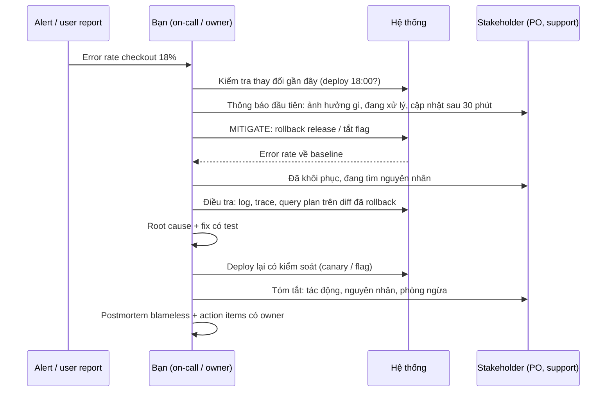
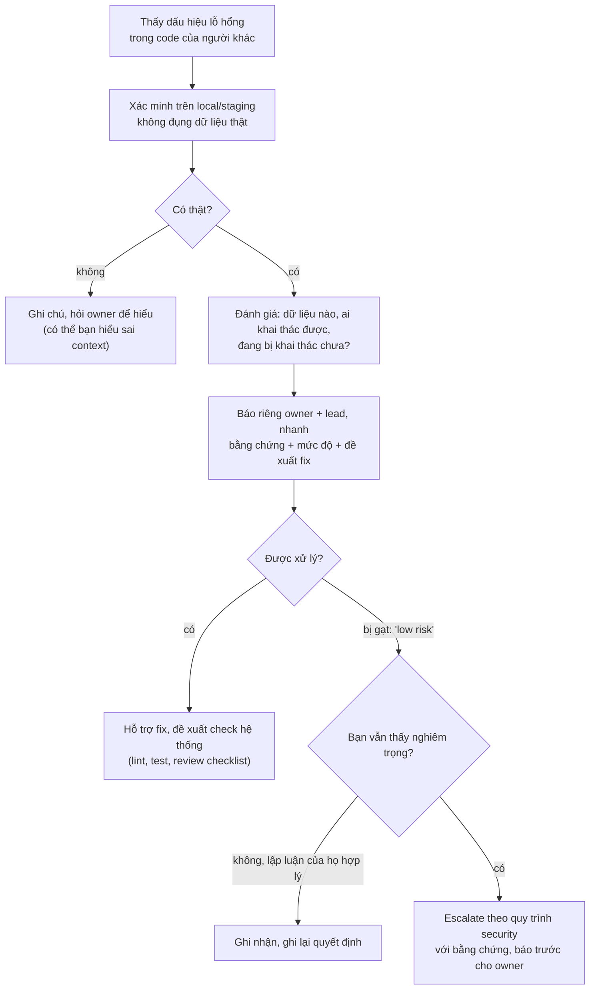

## Bối cảnh & vấn đề

Thứ Sáu, 19 giờ 40. Alert báo tỷ lệ lỗi của checkout lên 18%. Kỹ sư on-call mở log, thấy một stack trace lạ trong module tính phí vận chuyển, và lao vào đọc code để tìm nguyên nhân. 40 phút sau anh tìm ra: release lúc 18 giờ đổi format địa chỉ, một provider bên ngoài từ chối request. Anh viết fix, chờ CI, deploy lúc 21 giờ. Trong 80 phút đó, khách hàng không đặt được hàng, support nhận hàng chục ticket, và product owner biết chuyện qua một tin nhắn của khách hàng chứ không phải qua team kỹ thuật.

Root cause được tìm đúng, fix đúng. Nhưng khi kể câu chuyện này trong phỏng vấn, interviewer sẽ nhíu mày ở hai chỗ: **tại sao không rollback release lúc 18 giờ ngay khi alert kêu**, và **tại sao stakeholder không được báo**. Red flag đầu tiên của behavioral-010 nói thẳng: "Jumped straight to root-causing while users were still affected." Red flag thứ hai: "No prevention step afterwards."

Câu chuyện incident là một trong những câu mạnh nhất có thể có trong story bank, vì nó chứng minh cùng lúc kỹ năng kỹ thuật, ownership, khả năng chịu áp lực và giao tiếp. Nhưng nó chỉ mạnh khi bạn kể đúng **thứ tự ưu tiên** của một người xử lý incident có kinh nghiệm: giảm thiệt hại trước, hiểu sau, phòng ngừa cuối cùng, và giao tiếp xuyên suốt. Bài này dạy thứ tự đó, cùng với hai chủ đề liên quan: báo tin xấu cho stakeholder và lên tiếng khi thấy vấn đề bảo mật trong code của một người được kính trọng.

## Khái niệm

### Mitigate trước, root cause sau

**Mitigation** là hành động giảm hoặc chặn tác động lên người dùng mà không cần hiểu đầy đủ nguyên nhân: rollback release, tắt feature flag, scale thêm instance, chuyển traffic, chặn một tenant gây quá tải. **Root cause analysis** là tìm hiểu vì sao nó xảy ra. Google SRE Book đặt mục tiêu ưu tiên rõ: khôi phục dịch vụ trước, điều tra sau, vì mỗi phút điều tra trong khi người dùng bị ảnh hưởng là một phút thiệt hại.

Lý do thứ tự này đúng: phần lớn incident xảy ra ngay sau một thay đổi (deploy, config, migration, đột biến traffic). Nếu alert kêu 20 phút sau một release, rollback release đó là phép thử rẻ nhất: nếu lỗi biến mất, bạn vừa khôi phục dịch vụ vừa thu hẹp nguyên nhân về một diff. Nếu lỗi không biến mất, bạn loại được một giả thuyết lớn.

**Interview angle:** interviewer nghe xem trong câu chuyện của bạn, **bước đầu tiên** là gì. "Tôi kiểm tra có deploy gần đây không và rollback" là câu mở đầu Action mạnh.

### Vai trò trong incident

Câu hỏi "What was your role?" trong behavioral-010 không thừa. Trong một incident có tổ chức, có các vai trò khác nhau: **incident commander** (điều phối, ra quyết định), **người điều tra/thực hiện** (ops/dev làm mitigation và chẩn đoán), **người giao tiếp** (cập nhật stakeholder). Ở team nhỏ, một người có thể giữ nhiều vai. Nói rõ bạn ở vai nào cho interviewer biết phần "I" thuộc về đâu.

Nếu bạn không phải on-call nhưng là người phát hiện, hoặc là owner của module bị lỗi, hãy nói rõ. "Tôi không on-call tuần đó, nhưng tôi là người viết module tính phí, nên tôi vào kênh incident và nhận phần điều tra" là một câu Task cho thấy ownership.

**Interview angle:** nếu bạn chỉ quan sát trong incident, đừng kể nó như câu chuyện của bạn. Chọn story khác.

### Lần theo sự cố xuyên tầng

behavioral-045 hỏi về sự cố đi qua backend, database và frontend. Interviewer muốn thấy **phương pháp thu hẹp phạm vi** theo từng tầng: ở **frontend**, network tab cho biết request nào chậm hoặc lỗi, status code, payload; ở **backend**, log và trace (correlation id, span) cho biết thời gian nằm ở đâu; ở **database**, query plan, lock wait, connection pool cho biết vì sao query chậm. Mỗi tầng loại bỏ hoặc xác nhận một nhóm giả thuyết.

Câu trả lời mạnh nêu **công cụ cụ thể** (follow-up "Which tools did you use, specifically?"): Chrome DevTools, log tập trung, APM/tracing, `EXPLAIN ANALYZE` hoặc execution plan, bảng thống kê của DB. Nếu lúc đó thiếu công cụ (chưa có tracing), nói ra, và nói bạn đã bổ sung gì sau đó; đó chính là Reflection mà hint của câu yêu cầu.

**Interview angle:** "fix ở tầng nào" thường là "nhiều tầng": index ở DB, timeout và retry ở BE, loading state và thông báo lỗi ở FE. Câu trả lời nêu cả fix tạm và fix gốc cho thấy judgment.

### Giao tiếp trong incident

Stakeholder không kỹ thuật (PO, support, account manager, khách hàng) cần biết bốn điều, theo thứ tự: **chuyện gì đang xảy ra** với người dùng (không phải với server), **mức ảnh hưởng** (bao nhiêu người, chức năng nào), **đang làm gì**, và **khi nào có cập nhật tiếp theo**. Cam kết thời điểm cập nhật tiếp theo, kể cả khi chưa có tin mới, là thứ giảm lo lắng nhiều nhất.

Follow-up "How did you communicate with non-technical stakeholders?" kiểm tra bạn có làm điều này không, hay chỉ nói chuyện trong kênh kỹ thuật. Chi tiết kỹ thuật ở mức tối thiểu: "một thay đổi tối nay làm hỏng bước tính phí vận chuyển" là đủ; tên hàm và stack trace để dành cho postmortem.

**Interview angle:** câu trả lời mạnh có một câu kiểu "Tôi gửi cập nhật mỗi 30 phút trong kênh support, kể cả khi chỉ để nói 'vẫn đang xử lý'."

### Postmortem và phòng ngừa

**Postmortem** là tài liệu viết sau incident: timeline, tác động, root cause, các yếu tố góp phần, và **action item** có owner và hạn. **Blameless** nghĩa là tập trung vào hệ thống và quy trình đã cho phép lỗi xảy ra, không phải vào người gây ra lỗi. Câu "dev X quên validate" là đổ lỗi; câu "không có contract test giữa chúng ta và provider, nên thay đổi format đi qua CI mà không ai phát hiện" là blameless.

Ở phần Result và Reflection của câu incident, action item là phần interviewer chấm level: mid dừng ở "fix bug"; senior có "thêm contract test, thêm alert theo tỷ lệ lỗi provider, cập nhật runbook rollback, chia sẻ postmortem cho các team khác".

**Interview angle:** nói **một** action item cụ thể đã hoàn thành có giá trị hơn liệt kê năm cái chưa làm.

### Báo tin xấu

behavioral-028 không nhất thiết là incident: tin xấu có thể là trễ tiến độ, không làm được như cam kết, phát hiện bug dữ liệu ảnh hưởng báo cáo tháng trước. Nguyên tắc chung: **báo sớm, trực tiếp, kèm phương án**. Báo sớm vì tin xấu càng để lâu càng đắt (stakeholder mất thời gian lên kế hoạch dựa trên thông tin sai). Trực tiếp vì tin xấu qua người thứ ba hoặc qua phát hiện tình cờ làm mất niềm tin nhiều hơn chính tin xấu.

Cấu trúc một lần báo: chuyện gì xảy ra, ảnh hưởng tới họ, nguyên nhân ngắn gọn (không đổ lỗi), đang làm gì, **các lựa chọn** họ có (cắt scope, lùi ngày, chấp nhận rủi ro), và lần cập nhật tiếp theo. Follow-up "How do you decide how much technical detail to include?" có đáp án: đủ để họ ra quyết định, không hơn.

**Interview angle:** interviewer tìm con số "thời gian từ lúc bạn biết tới lúc bạn báo". Câu "tôi báo trong vòng một giờ sau khi xác nhận" là bằng chứng mạnh.

### Lên tiếng về bảo mật khi là người mới

behavioral-033 là scenario: tuần đầu tiên, bạn thấy một lỗ hổng bảo mật trong code của một senior được kính trọng. Câu này đo **courage** (dám lên tiếng) cộng với **judgment** (lên tiếng đúng cách). Thứ tự đúng: **xác minh** trước (reproduce trên môi trường không phải production, không khai thác dữ liệu thật), **đánh giá mức độ** (dữ liệu nào bị lộ, ai khai thác được), rồi **báo riêng và nhanh** cho owner và lead, qua kênh phù hợp (không đăng chi tiết khai thác trong kênh chung).

Đóng khung vấn đề là **lỗ hổng của hệ thống** ("review và test của chúng ta chưa bắt được loại lỗi này") chứ không phải lỗi cá nhân, giúp người kia không phòng thủ. Nếu họ gạt đi ("low risk") mà bạn vẫn thấy nghiêm trọng, đó là lúc **escalate theo quy trình security** của công ty, với bằng chứng, không phải tranh cãi.

**Interview angle:** red flag ở câu này là im lặng vì "mình mới", hoặc ngược lại, đăng lỗ hổng lên kênh chung để chứng tỏ.

## Cơ chế hoạt động

Diagram dưới đây là thứ tự hành động trong một incident mà câu chuyện của bạn nên phản ánh. Lưu ý giao tiếp chạy song song suốt quá trình, không phải bước cuối.



Ba điểm. Thứ nhất, **thông báo đầu tiên đi trước mitigation**, hoặc gần như cùng lúc: stakeholder cần biết sớm để support trả lời khách hàng, ngay cả khi bạn chưa biết gì về nguyên nhân. Thứ hai, **điều tra diễn ra sau khi dịch vụ đã khôi phục**, nên áp lực thời gian giảm hẳn và bạn có thể điều tra kỹ. Thứ ba, **deploy lại có kiểm soát**: fix vội cho incident là nguồn incident thứ hai phổ biến.

Diagram thứ hai là cây quyết định cho scenario bảo mật (behavioral-033):



Nhánh "báo trước cho owner" trước khi escalate là chi tiết quan trọng: nó giữ quan hệ, vì người kia không bị bất ngờ. Nhánh "có thể bạn hiểu sai context" cũng quan trọng với người mới: có khi lỗ hổng đã được giảm thiểu ở tầng khác (WAF, network policy) mà bạn chưa biết.

## Ví dụ thực tế

### Production incident (behavioral-010): weak vs strong

```text
WEAK (minh hoạ)
"One evening checkout was failing. I looked at the logs and found an error in
the shipping module. It took a while but I found the bug — the address format
had changed. I fixed it and deployed. After that it worked fine."
```

Bình luận: không có mitigation, không có vai trò, không có giao tiếp, không có phòng ngừa, không có số. Đúng cả hai red flag của câu hỏi.

```text
STRONG (minh hoạ, số là ví dụ)
S: "On a Friday evening our checkout error rate jumped from under 1% to about
   18%, about 20 minutes after a release."
T: "I wasn't on call, but I'd written the shipping-fee integration that the
   stack traces pointed to, so I joined the incident channel and took the
   investigation while the on-call engineer coordinated."
A: "First I checked what had changed: one release at 18:00. I asked the
   on-call to roll it back rather than wait for a diagnosis — error rate was
   back to baseline about 10 minutes later. In parallel I posted in the support
   channel: checkout is failing for some customers, we're rolling back, next
   update in 30 minutes. Then, with users safe, I diffed the release: we had
   started sending the address with a combined street-and-number field, and
   the shipping provider rejected it with a 400 that our code turned into a
   500. I wrote the fix with a test against the provider's documented format
   and we released it Monday behind a flag, turned on for 5% first."
R: "Total customer impact was about 35 minutes. In the postmortem I owned two
   action items: a contract test against the provider's sandbox in CI, and an
   alert on provider 4xx rate. The contract test caught a second format
   change three months later before it reached production."
Reflection: "The lesson I took: roll back first, ask questions later — and
   have someone talk to the business from minute one."
```

Bình luận: thứ tự đúng (rollback trước), vai trò rõ, giao tiếp song song, deploy lại có kiểm soát, action item có bằng chứng hiệu quả. Follow-up "How did you communicate with non-technical stakeholders?" đã có câu trả lời sẵn trong Action.

### Mẫu tin nhắn cho stakeholder

```text
[19:52] Checkout incident — update 1
Impact: some customers can't complete checkout (about 1 in 5 attempts) since
~19:40. Orders already placed are not affected.
Doing now: rolling back tonight's release; we expect recovery within 15 min.
Support: please tell customers to retry in 20 minutes.
Next update: 20:20 or sooner if resolved.

[20:05] Checkout incident — update 2 (resolved)
Checkout is working normally since 20:02. Root cause looks like tonight's
change to the address format; we'll confirm and share a short summary on
Monday, including how we'll prevent it.
```

Bình luận: không có thuật ngữ kỹ thuật, có tỷ lệ ảnh hưởng, có hướng dẫn cho support, có giờ cập nhật tiếp theo. Kể rằng bạn gửi những tin như thế này là một chi tiết rất thuyết phục trong phỏng vấn.

### Báo tin xấu (behavioral-028): strong (minh hoạ, rút gọn)

```text
"Two weeks before a client launch, I found that the data import we'd built was
silently dropping rows with non-ASCII characters in product names — about 3%
of the catalog. I confirmed it within an hour and told the PO and the client's
technical contact that afternoon, not at the next weekly sync. I explained
what was affected, that no customer had seen it yet because the store wasn't
live, that I had a fix but re-importing would take two days of the client's
time, and gave two options: re-import everything, or re-import only the
affected 3% using a list I'd generate. They chose the second. The client's
contact later told our PM the early call was why they trusted our launch
estimate."
```

### Template incident story (điền vào)

```text
TRIỆU CHỨNG (người dùng thấy gì, khi nào, bao nhiêu): __________________
VAI TRÒ CỦA TÔI (on-call / owner / người phát hiện): ___________________
THAY ĐỔI GẦN NHẤT trước sự cố: _________________________________________
MITIGATION (làm gì, mất bao lâu tới khi khôi phục): ____________________
GIAO TIẾP (ai, kênh nào, nhịp cập nhật): _______________________________
CHẨN ĐOÁN theo tầng: FE ______ → BE ______ → DB ______
  Giả thuyết đã loại: ______ vì ______
ROOT CAUSE: ____________________   FIX (tạm / gốc): ____________________
SỐ: thời gian phát hiện ____, MTTR ____, người dùng ảnh hưởng ____
ACTION ITEM tôi own + bằng chứng hiệu quả: _____________________________
CÔNG CỤ tôi ước đã có lúc đó: _________________________________________
```

## Trade-offs & lựa chọn thay thế

| Quyết định trong incident | Lựa chọn A | Lựa chọn B | Khi nào chọn gì |
|---|---|---|---|
| Khôi phục | Rollback ngay | Fix forward (hotfix) | Rollback khi có deploy nghi vấn và rollback an toàn; fix forward khi rollback không được (migration không đảo ngược được, dữ liệu đã ghi theo format mới) |
| Điều tra | Ngay khi đang lỗi | Sau khi khôi phục | Chỉ điều tra trong lúc lỗi khi không có cách mitigate nào, hoặc cần bằng chứng sẽ mất sau rollback (chụp lại log, heap dump trước) |
| Giao tiếp | Ngay khi xác nhận | Khi đã có nguyên nhân | Gần như luôn chọn ngay; im lặng bị hiểu là không biết hoặc không quan tâm |
| Mức chi tiết | Kỹ thuật | Tác động và thời gian | Stakeholder không kỹ thuật cần tác động; kỹ thuật để cho postmortem |
| Báo tin xấu | Báo khi chắc chắn 100% | Báo khi đủ chắc + nói rõ mức chắc | Báo sớm kèm mức độ chắc chắn ("chúng tôi nghĩ…, sẽ xác nhận trước 15h") |

Lưu ý hàng đầu tiên: "luôn rollback" không đúng tuyệt đối. Rollback code sau khi migration đã thay đổi schema theo cách không tương thích có thể làm tình hình tệ hơn. Đây là lý do các migration nên theo expand/contract để mỗi bước rollback được (track [SQL](/tracks/sql-postgres) có bài về zero-downtime migration). Nói được ngoại lệ này trong phỏng vấn là một signal senior.

## Edge cases & failure modes

- **Incident do chính bạn gây ra**: kể nó, đó là story mạnh cho cả câu failure. Nhận trách nhiệm ngay trong câu Task ("release đó là của tôi"), rồi kể phần xử lý và phòng ngừa. Xem bài [Thất bại](/tracks/behavioral/learn/failure-mistakes).
- **Không tìm ra root cause**: xảy ra thật. Nói thật, kể bạn đã thu hẹp tới đâu, thêm observability gì để lần sau bắt được, và có tái diễn không.
- **Rollback cũng lỗi** (artifact cũ bị xoá, migration không đảo ngược): kể cách bạn xử lý, và action item về quy trình rollback. Đây là câu chuyện senior rất mạnh.
- **Stakeholder giận dữ trong lúc incident**: không tranh luận lúc đó; ghi nhận, tiếp tục cập nhật theo nhịp, xử lý cảm xúc sau khi dịch vụ ổn định.
- **Lỗ hổng bảo mật đang bị khai thác**: không còn là "báo riêng rồi chờ", mà là kích hoạt quy trình incident security ngay (thường có kênh và người trực riêng).
- **Bạn không có quyền production**: Action vẫn có thể mạnh: bạn chẩn đoán, chuẩn bị lệnh rollback, viết tin nhắn, người có quyền thực hiện. Nói rõ phân vai.
- **Câu chuyện incident quá kỹ thuật cho interviewer HR**: giữ thứ tự (mitigate, giao tiếp, nguyên nhân, phòng ngừa), giảm độ sâu kỹ thuật.

## Pitfalls

- ❌ Mở đầu Action bằng đọc code tìm bug → ✅ mở đầu bằng "thay đổi gần nhất là gì" và mitigation, vì người dùng đang bị ảnh hưởng.
- ❌ Stakeholder biết qua khách hàng → ✅ thông báo đầu tiên trong vài phút, có giờ cập nhật tiếp theo.
- ❌ Dừng ở "deploy fix xong" → ✅ postmortem blameless và ít nhất một action item bạn own, có bằng chứng hiệu quả.
- ❌ Đổ lỗi người viết code lỗi → ✅ nói về khoảng trống của hệ thống (test, alert, review) đã cho phép lỗi lọt qua.
- ❌ Không nhớ công cụ đã dùng → ✅ nêu cụ thể (DevTools, log tập trung, tracing, execution plan), vì follow-up hỏi đúng điều này.
- ❌ Chờ chắc chắn 100% mới báo tin xấu → ✅ báo sớm kèm mức độ chắc chắn và lựa chọn.
- ❌ Im lặng về lỗ hổng vì là người mới, hoặc đăng lên kênh chung → ✅ xác minh, báo riêng nhanh, escalate theo quy trình nếu cần.

## Tóm tắt

- Thứ tự incident: **mitigate → giao tiếp → root cause → fix có kiểm soát → postmortem**; giao tiếp chạy song song từ phút đầu.
- Nói rõ **vai trò** của bạn trong incident để interviewer biết phần "I".
- Sự cố xuyên tầng: thu hẹp từ FE (network) → BE (log, trace) → DB (plan, lock), nêu công cụ cụ thể.
- Stakeholder cần: tác động, đang làm gì, khi nào cập nhật tiếp; không cần stack trace.
- Postmortem **blameless** với action item có owner; action item bạn hoàn thành là phần chấm level.
- Tin xấu: **sớm, trực tiếp, kèm lựa chọn**; thời gian từ lúc biết tới lúc báo là bằng chứng.
- Lỗ hổng bảo mật: xác minh, báo riêng nhanh, đóng khung là vấn đề hệ thống, escalate có bằng chứng nếu bị gạt.
