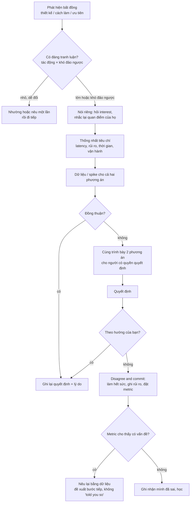
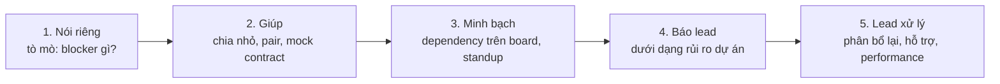

## Bối cảnh & vấn đề

Được hỏi "Tell me about a conflict with a teammate", nhiều ứng viên chọn một trong hai câu trả lời an toàn giả. Kiểu thứ nhất: "Thật ra tôi hiếm khi có conflict, tôi khá dễ tính." Interviewer nghe thành: hoặc bạn né xung đột (red flag "Avoided the conflict entirely"), hoặc bạn không đủ quan tâm để bất đồng về điều gì. Kiểu thứ hai: một câu chuyện trong đó người kia sai rành rành, bạn đúng, và cuối cùng mọi người nhận ra bạn đúng. Interviewer nghe thành: bạn kể người khác như một nhân vật phản diện (red flag "The other person was simply wrong/incompetent").

Trong team phần mềm, bất đồng là bình thường và thường là **tốt**: hai người nhìn cùng một thiết kế từ hai góc khác nhau là cách phát hiện rủi ro sớm. Thứ interviewer đo không phải là bạn có conflict hay không, mà là **bạn xử lý nó thế nào**: có tìm hiểu quan điểm bên kia không, có đưa bằng chứng thay vì nói to hơn không, có biết khi nào nhường và khi nào giữ không, và quan hệ sau đó ra sao.

Bài này đi qua năm biến thể của câu hỏi conflict trong track: với teammate hoặc tech lead, với product owner về scope, disagree-and-commit, teammate liên tục trễ cam kết, và stakeholder khó tính. Chúng có chung một bộ khái niệm nền, nhưng khác nhau ở **ai có quyền quyết định** cuối cùng, và đó là thứ thay đổi chiến lược của bạn.

## Khái niệm

### Conflict về vấn đề và conflict về con người

**Task conflict** là bất đồng về nội dung công việc: thiết kế, cách làm, ưu tiên, estimate. **Relationship conflict** là căng thẳng giữa người với người: khó chịu, mất lòng tin, giao tiếp gắt. Nghiên cứu tâm lý tổ chức thường cho thấy task conflict vừa phải có thể có ích còn relationship conflict hầu như luôn có hại (verify mức độ của kết luận này; các meta-analysis cho kết quả không đồng nhất). Kỹ năng then chốt là **giữ task conflict không biến thành relationship conflict**.

Trong câu chuyện phỏng vấn, chọn một task conflict có thực chất (bất đồng về thiết kế queue, về cách migration, về scope MVP), và kể cách bạn giữ quan hệ trong lúc bất đồng. Câu chuyện thuần relationship conflict ("anh ấy khó chịu với tôi") khó kể tốt vì dễ thành đổ lỗi.

**Interview angle:** câu chốt mạnh của mọi câu conflict là quan hệ sau đó: "Sau dự án đó, anh ấy là người đầu tiên tôi nhờ review thiết kế."

### Position và interest

**Position** là cái người ta nói họ muốn ("phải dùng Kafka"), **interest** là lý do đằng sau ("tôi sợ mất message khi service downstream chết"). Hai position có thể trái ngược mà interest lại tương thích: người muốn Kafka lo mất message, người muốn gọi HTTP đồng bộ lo độ phức tạp vận hành; một outbox table với retry có thể thoả cả hai. Khung này đến từ sách đàm phán *Getting to Yes* (Fisher & Ury).

Hành động cụ thể: trước khi phản biện, hỏi "điều gì làm anh lo nhất nếu đi hướng của tôi?" và nhắc lại quan điểm của họ cho tới khi họ đồng ý bạn đã hiểu đúng. Bước này thường làm giảm nửa căng thẳng, vì người kia cảm thấy được nghe.

**Interview angle:** follow-up của behavioral-023 ("What did the people who disagreed with you care about?") kiểm tra đúng kỹ năng này; nó áp dụng cho mọi câu conflict.

### Dữ liệu, prototype và tiêu chí khách quan

Khi hai kỹ sư bất đồng về thiết kế, tranh luận bằng ý kiến thường kéo dài vì không ai có lý do để đổi ý. Có ba cách chuyển cuộc tranh luận sang bằng chứng. **Dữ liệu**: số liệu production, benchmark, chi phí ước tính, lịch sử incident. **Prototype/spike**: một nửa ngày làm thử cả hai cách trên một trường hợp thật. **Tiêu chí khách quan**: thống nhất trước "chúng ta sẽ chọn theo tiêu chí gì" (latency p99, thời gian dev, khả năng rollback, chi phí vận hành), rồi mới chấm từng phương án.

Bước thống nhất tiêu chí là bước mạnh nhất, vì nó biến "tôi vs anh" thành "chúng ta vs bài toán". Nếu hai bên đồng ý tiêu chí mà vẫn chấm khác nhau, ít nhất bạn biết chính xác bất đồng nằm ở đâu.

**Interview angle:** follow-up của behavioral-012 là "What would you do if they still disagreed after you presented the data?". Câu trả lời mạnh: tìm ai có quyền quyết định, cùng nhau trình bày cả hai phương án cho người đó, rồi commit với kết quả.

### Riêng tư trước, công khai sau

Phản biện ý tưởng của một người trong cuộc họp đông người dễ biến thành chuyện thể diện, nhất là trong các văn hoá coi trọng thứ bậc. Nguyên tắc thực dụng: **lần đầu nêu bất đồng nghiêm túc, nói riêng** (1:1, tin nhắn trực tiếp, comment trong design doc thay vì trong standup). Nếu cần quyết định chung, đưa ra cuộc họp **sau khi** hai bên đã hiểu quan điểm của nhau, và trình bày như "hai phương án" chứ không phải "phương án của X có vấn đề".

Ngoại lệ: bất đồng về bảo mật hoặc rủi ro mất dữ liệu sắp lên production không chờ được một cuộc 1:1 vào tuần sau; khi đó nói thẳng ngay, nhưng vẫn tập trung vào rủi ro, không vào người.

**Interview angle:** interviewer thường hỏi "Did you raise it in the meeting or privately?"; trả lời có lý do cho lựa chọn của bạn.

### Ai có quyền quyết định

Đây là khác biệt lớn nhất giữa các biến thể. Với **teammate ngang cấp**, không ai có quyền quyết định tuyệt đối; bạn thuyết phục hoặc cùng đưa lên lead. Với **tech lead**, họ thường có quyền quyết định kỹ thuật cuối cùng; việc của bạn là đảm bảo họ quyết định với đủ thông tin. Với **product owner**, họ có quyền quyết định về sản phẩm (cái gì, cho ai, khi nào), còn bạn chịu trách nhiệm **làm rõ trade-off kỹ thuật** (chi phí, rủi ro, phương án thay thế). Với **client hoặc stakeholder**, họ thường là người trả tiền hoặc chịu kết quả, nên lựa chọn cuối cùng là của họ, sau khi bạn đã trình bày rõ rủi ro.

Hiểu điều này giúp tránh hai lỗi đối xứng ở behavioral-013: "Just did what the PO said without raising concerns" (không làm phần việc của mình) và "Refused to build it" (giành phần quyết định của người khác).

**Interview angle:** câu "tôn trọng quyền quyết định sản phẩm của PO, trách nhiệm của tôi là làm rõ trade-off" là reflection mà hint của 013 chờ.

### Disagree and commit

**Disagree and commit** (Amazon viết thành nguyên tắc "Have Backbone; Disagree and Commit") nghĩa là: khi bạn không đồng ý, bạn **nói rõ**, có dữ liệu, qua kênh đúng, ngay cả khi điều đó không thoải mái; nhưng khi quyết định đã được đưa ra, bạn **thực hiện hết sức** như thể đó là quyết định của bạn. Hai nửa đều quan trọng. Thiếu nửa đầu là im lặng a dua. Thiếu nửa sau là phá ngầm: làm theo cách của mình ("Quietly implemented it their own way", red flag của behavioral-024), hoặc làm nửa vời để chứng minh mình đúng.

Trong lúc commit, bạn vẫn có thể (và nên) **giảm rủi ro trong khuôn khổ quyết định**: thêm metric để biết sớm nếu quyết định sai, ghi lại rủi ro đã nêu, đề xuất điểm xem lại ("sau 1 tháng chúng ta nhìn số liệu"). Nếu quyết định hoá ra sai, bạn nêu lại bằng dữ liệu, không bằng "I told you so".

**Interview angle:** follow-up của 024 hỏi đúng chỗ khó: "If the decision turned out to be wrong, how did you raise it without saying 'I told you so'?". Câu trả lời mạnh: đưa số liệu đã đặt từ trước, đề xuất bước tiếp theo, không nhắc lại ai đã nói gì.

### Teammate trễ cam kết và stakeholder khó tính

behavioral-032 (teammate liên tục trễ, chặn việc của bạn) là scenario kiểm tra thứ tự leo thang. Bước đầu là **tò mò, không phán xét**: nói chuyện riêng để hiểu nguyên nhân (blocker kỹ thuật, estimate sai, quá tải, việc cá nhân). Bước tiếp theo là **giúp và giảm phụ thuộc**: chia nhỏ task, pair, thống nhất contract API để bạn làm song song với mock. Bước ba là **làm rõ kỳ vọng công khai** trong board/standup. Chỉ khi vẫn ảnh hưởng delivery mới báo lead, và báo dưới dạng **rủi ro dự án** ("API thanh toán trễ 2 tuần, ảnh hưởng ngày release"), không phải phàn nàn về người.

behavioral-034 (stakeholder hoặc client khó tính) yêu cầu bạn **mô tả họ công bằng**: "khó" cụ thể ở điểm nào (đổi yêu cầu liên tục, deadline không thực tế, giao tiếp gắt), và **áp lực của họ** là gì (họ cũng có sếp, có khách hàng). Hành động: thiết lập kênh và nhịp giao tiếp rõ, ghi lại thoả thuận bằng văn bản, đưa lựa chọn thay vì từ chối.

**Interview angle:** red flag chung của hai câu là nói về người kia với giọng khinh thường. Interviewer nghe cách bạn nói về người vắng mặt để đoán bạn sẽ nói gì về họ.

## Cơ chế hoạt động

Diagram dưới đây là luồng xử lý một bất đồng kỹ thuật, từ lúc phát hiện tới khi đã có quyết định.



Bước đầu tiên dễ bị bỏ qua nhất: **có đáng tranh luận không**. Không phải bất đồng nào cũng xứng đáng một cuộc thảo luận dài. Tên biến, cách tổ chức folder, thư viện test giữa hai lựa chọn tương đương: nêu một lần rồi theo người đang own. Những quyết định khó đảo ngược (schema, contract API công khai, lựa chọn hạ tầng) mới đáng đầu tư dữ liệu và spike. Nói được tiêu chí này trong phỏng vấn cho thấy judgment.

Nhánh "cùng trình bày 2 phương án" là cách leo thang lành mạnh: bạn và người bất đồng **cùng** đi gặp người quyết định, mỗi người trình bày phương án của mình công bằng. So với việc bạn đi một mình tới gặp manager của người kia (red flag của behavioral-023: "Went around the lead to their manager as a first step"), cách này giữ được lòng tin.

Diagram thứ hai là thang leo thang cho scenario teammate trễ cam kết:



Mỗi bậc chỉ đi tiếp khi bậc trước không đủ. Bậc 4 không phải là "mách": nó là trách nhiệm của bạn với delivery, và nếu bạn đã đi qua bậc 1–3, người kia sẽ không bất ngờ. Bậc 5 không còn là việc của bạn.

## Ví dụ thực tế

### Conflict với tech lead (behavioral-012): weak vs strong

```text
WEAK (minh hoạ)
"My tech lead wanted to use a message queue for something simple, which was
clearly over-engineering. I told him it was a bad idea in the planning meeting.
He didn't really listen at first, but eventually after it caused problems,
everyone agreed with me."
```

Bình luận: người kia là phản diện, phản biện công khai, "cuối cùng mọi người đồng ý với tôi" không có dữ liệu, không có reflection. Hai red flag cùng lúc.

```text
STRONG (minh hoạ)
S: "We needed to sync order status from our service to a partner's
   fulfilment system. My tech lead proposed putting Kafka in between; I thought
   a simple outbox table plus a retrying worker was enough for our volume."
T: "I was going to build it, so I wanted us to pick the option we could
   operate well."
A: "I asked him privately what worried him about the simpler option. His real
   concern was losing events if the partner was down for hours — which was
   fair; it had happened once. So I suggested we agree on criteria first:
   no lost events, under a minute of delay normally, and something our
   three-person team could run. I spent half a day on a spike of the outbox
   version and showed it survived a 6-hour simulated partner outage with
   retries and no loss, at about 400 events a day. I also listed what Kafka
   would cost us: a cluster we didn't run yet, and new on-call knowledge."
R: "He agreed to the outbox for now, with a written trigger to revisit if we
   passed about 50 events a second. It ran for over a year without losing an
   event."
Reflection: "What I took away is that he and I wanted the same thing; he just
   remembered an outage I hadn't been there for. Asking what he was afraid of
   was more useful than my benchmark."
```

Bình luận: hỏi interest, thống nhất tiêu chí, spike có số, ghi trigger để xem lại, mô tả tech lead công bằng (concern của anh ấy "fair"). Câu trả lời cũng có sẵn đáp án cho follow-up "what if they still disagreed": trigger xem lại chính là cách để cả hai cùng sống với quyết định.

### Disagree and commit (behavioral-024): strong (minh hoạ, rút gọn)

```text
"Our lead decided to ship the new pricing rules as one big release instead of
behind a flag per tenant, to hit a sales date. I said once, in the design
review, that I thought a per-tenant rollout was safer, and showed the two
tenants with unusual discount setups. He heard it and kept the decision —
the sales date mattered and the flag work would add a week. From then on I
built it his way, and inside that decision I added a reconciliation report
that compared old and new prices per tenant on the first day. The report
flagged one of the two tenants I'd worried about; we fixed it in hours
instead of after invoices went out. In the retro I didn't say 'I told you
so' — I showed the report and proposed we make it a standard step for
pricing changes. It is now."
```

### Disagreement với PO (behavioral-013): khung trả lời

```text
1. Mục tiêu của PO (business): __________________ (hỏi trước khi phản biện)
2. Lo ngại của tôi, định lượng: chi phí ____ ngày, rủi ro ____, ảnh hưởng ____
3. Phương án thay thế (MVP / phase / flag / scope cắt): ____________________
4. Ai quyết định: PO (sản phẩm). Tôi: trình bày trade-off rõ ràng, bằng văn bản.
5. Kết quả: PO chọn ______; feature ship ______; số liệu sau ______
6. Câu chuyện ngược (follow-up "PO was right"): lần tôi sai là ______
```

Follow-up "Tell me about a time the PO was right and you were wrong" rất phổ biến. Chuẩn bị sẵn một câu: ví dụ bạn phản đối một feature vì nghĩ ít người dùng, PO có dữ liệu từ support cho thấy ngược lại. Có câu này cho thấy bạn không phải người lúc nào cũng thắng tranh luận.

### Template conflict story (điền vào)

```text
BẤT ĐỒNG về: ______  với: ______ (vai trò, không cần tên)
VÌ SAO QUAN TRỌNG (tác động, khó đảo ngược): ______
INTEREST của họ (họ lo điều gì): ______   INTEREST của tôi: ______
NÓI Ở ĐÂU (riêng / design doc / họp) và vì sao: ______
TIÊU CHÍ đã thống nhất: ______
BẰNG CHỨNG (số, spike, incident cũ): ______
AI QUYẾT ĐỊNH, quyết định gì: ______
NẾU TÔI THUA: tôi commit thế nào, đặt metric gì: ______
KẾT QUẢ + QUAN HỆ SAU ĐÓ: ______
REFLECTION (tôi hiểu thêm gì về góc nhìn bên kia / tôi sai ở đâu): ______
```

## Trade-offs & lựa chọn thay thế

| Cách xử lý bất đồng | Khi nào hợp | Rủi ro |
|---|---|---|
| Nhường ngay | Quyết định nhỏ, dễ đảo ngược, người kia own phần đó | Thành thói quen né, không ai nghe góc nhìn của bạn |
| Nêu một lần rồi theo | Quyết định vừa, bạn không chắc chắn | Người kia không nhận ra mức lo ngại của bạn |
| Dữ liệu + spike | Quyết định lớn, khó đảo ngược | Tốn thời gian; spike thiên vị phương án của bạn |
| Cùng đưa lên người quyết định | Hai bên đều có lý, không hội tụ | Nếu làm sớm quá, người kia thấy bị qua mặt |
| Escalate một mình | Rủi ro nghiêm trọng (bảo mật, dữ liệu) bị gạt | Mất lòng tin nếu chưa nói với người kia trước |
| Thoả hiệp (lấy một nửa mỗi bên) | Cả hai phương án có phần đúng | Thoả hiệp kém có thể tệ hơn cả hai phương án gốc |

Quy tắc chọn: mức đầu tư vào bất đồng tỷ lệ với **tác động × độ khó đảo ngược**. Một quyết định đảo ngược được trong một ngày không đáng một tuần tranh luận; hãy thử và đo. Một quyết định về schema dữ liệu hay contract công khai thì đáng spike và đáng ghi lại. Với thoả hiệp, cẩn thận: "dùng Kafka cho một nửa event" thường là tệ nhất của cả hai thế giới. Thoả hiệp tốt thường là **theo thời gian** (làm đơn giản bây giờ, ghi trigger để nâng cấp) chứ không phải chia đôi thiết kế.

## Edge cases & failure modes

- **Bạn sai**: story conflict mạnh nhất đôi khi là story bạn sai. Kể cách bạn nhận ra và đổi ý; đây là bằng chứng mạnh về self-awareness và cũng trả lời trước follow-up "PO was right".
- **Người kia có chức danh cao hơn nhiều** (architect, CTO): vẫn áp dụng như nhau, nhưng chuẩn bị bằng chứng kỹ hơn và hỏi nhiều hơn khẳng định ("Em có thể đang thiếu context, nhưng em thấy số liệu này…").
- **Khác biệt văn hoá**: trong một số văn hoá, im lặng không phải đồng ý và "yes" không có nghĩa là cam kết. Xác nhận lại bằng văn bản. Bài [Feedback & remote](/tracks/behavioral/learn/feedback-remote) đi sâu hơn.
- **Người kia không đổi ý và không có ai quyết định** (hai team ngang nhau): đề xuất một thử nghiệm có thời hạn và tiêu chí đo, hoặc tách để mỗi bên own phần của mình qua contract rõ.
- **Teammate trễ vì vấn đề cá nhân** (sức khoẻ, gia đình): bảo vệ sự riêng tư của họ; với lead, chỉ nói về tác động lên delivery, không kể chi tiết cá nhân.
- **Stakeholder vượt qua team, yêu cầu trực tiếp cá nhân bạn**: ghi nhận, đưa yêu cầu về kênh chung (ticket, PO), không tự hứa ngoài kế hoạch.
- **Bạn chưa từng có conflict nghiêm trọng**: dùng một bất đồng nhỏ về thiết kế nhưng kể kỹ quá trình. Không bịa conflict lớn.

## Pitfalls

- ❌ "Tôi không có conflict" → ✅ chọn một task conflict thật, vì interviewer đo cách xử lý, không phải tần suất.
- ❌ Người kia là phản diện → ✅ mô tả interest của họ công bằng, vì interviewer nghe cách bạn nói về người vắng mặt.
- ❌ Phản biện lần đầu trong cuộc họp đông người → ✅ nói riêng trước, đưa ra họp dưới dạng hai phương án.
- ❌ Tranh luận bằng ý kiến → ✅ thống nhất tiêu chí, rồi dữ liệu và spike.
- ❌ Đi thẳng tới manager của người kia → ✅ cùng trình bày cho người quyết định, hoặc báo người kia trước khi escalate.
- ❌ Commit nhưng làm theo cách của mình → ✅ làm hết sức theo quyết định, giảm rủi ro trong khuôn khổ đó, đặt metric.
- ❌ "I told you so" khi quyết định sai → ✅ đưa dữ liệu, đề xuất bước tiếp, không nhắc ai nói gì.
- ❌ Báo lead về teammate như phàn nàn → ✅ báo như rủi ro dự án, sau khi đã thử nói riêng và giúp.

## Tóm tắt

- Interviewer đo **cách bạn xử lý** bất đồng; chọn task conflict thật, giữ nó không thành relationship conflict.
- Hỏi **interest** sau position; nhắc lại quan điểm của họ trước khi phản biện.
- Chuyển tranh luận sang **tiêu chí khách quan**, dữ liệu, spike; đầu tư tỷ lệ với tác động × độ khó đảo ngược.
- Biết **ai có quyền quyết định**: PO quyết sản phẩm, bạn làm rõ trade-off; lead quyết kỹ thuật, bạn đảm bảo đủ thông tin.
- **Disagree and commit**: nói rõ một lần với dữ liệu, rồi làm hết sức; đặt metric để biết sớm nếu sai.
- Teammate trễ: nói riêng → giúp → minh bạch → báo lead như rủi ro dự án.
- Stakeholder khó tính: mô tả công bằng, hiểu áp lực của họ, ghi lại thoả thuận, đưa lựa chọn.
- Câu chốt mạnh của mọi câu conflict là **quan hệ sau đó**.
