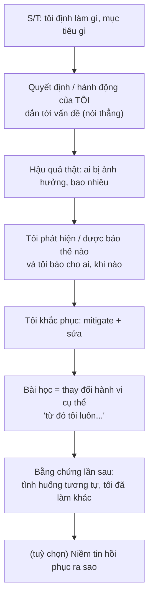
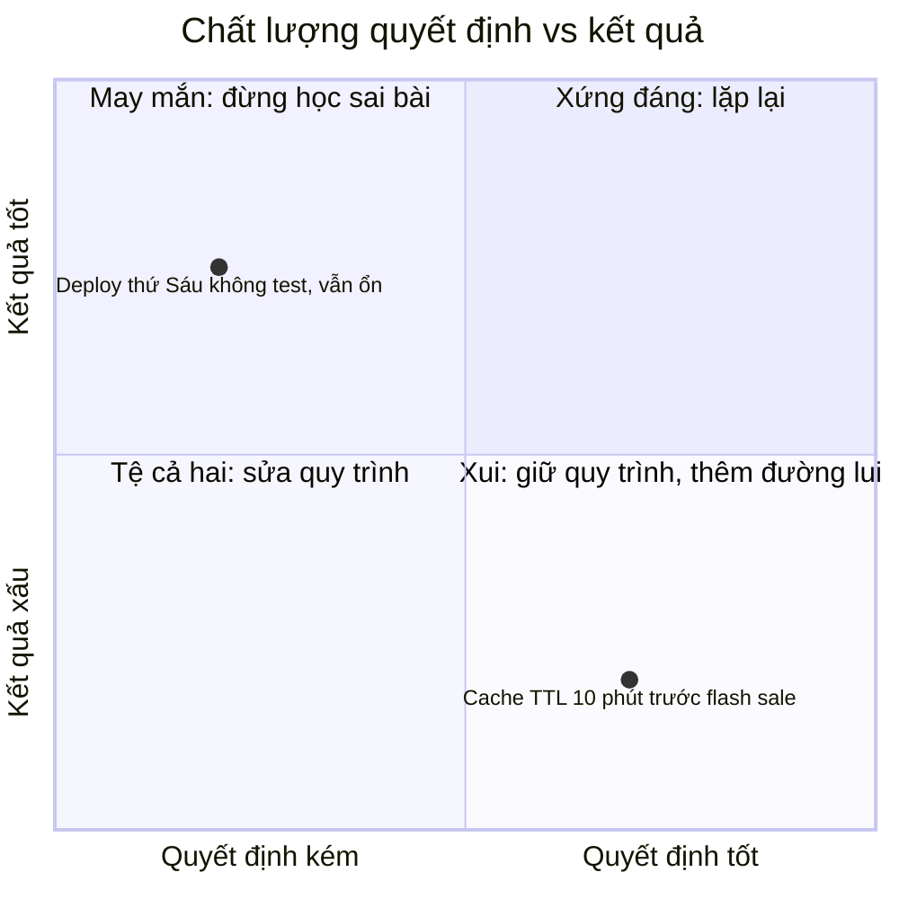

## Bối cảnh & vấn đề

"Tell me about a time you failed." Đây là câu nhiều ứng viên sợ nhất, và câu trả lời phổ biến nhất là một thành công đội lốt thất bại: "Tôi từng làm việc quá sức để kịp deadline, và team đã ship thành công, nhưng tôi học được rằng cần cân bằng hơn." Câu khác cũng phổ biến: một thất bại thật, nhưng là lỗi của người khác ("requirement thay đổi liên tục", "QA không test kỹ", "khách hàng huỷ hợp đồng").

Cả hai đều trúng red flag của behavioral-011: "Fake failure that is actually a success" và "Blames others or circumstances". Lý do interviewer hỏi câu này không phải để tìm điểm trừ, mà để đo ba thứ khó đo bằng câu khác: bạn có **nhận trách nhiệm** không, bạn có **học được** điều gì thay đổi hành vi không, và bạn có **an toàn để làm việc cùng** không (người không bao giờ nhận sai là người nguy hiểm trong một team, vì lỗi của họ sẽ bị giấu cho tới khi to ra).

Bài này đi qua bốn biến thể: thất bại cá nhân, quyết định kỹ thuật sai trên production, dự án bị huỷ, và xây lại niềm tin sau khi có chuyện. Chúng có chung một nguyên tắc: **phần trách nhiệm của bạn phải rõ, bài học phải là thay đổi hành vi có bằng chứng**. Và một khái niệm hay bị bỏ qua: quyết định tệ khác với kết quả tệ.

## Khái niệm

### Chọn thất bại nào để kể

Một thất bại tốt để kể có bốn đặc điểm. **Thật**: nó thực sự không như mong muốn, có hậu quả. **Có phần của bạn**: một quyết định hoặc hành động của bạn góp phần, không chỉ hoàn cảnh. **Không chí mạng**: không phải sự cố làm lộ dữ liệu khách hàng do bạn vi phạm quy trình, không phải chuyện liên quan tới đạo đức. **Có bài học đã áp dụng**: bạn làm khác đi sau đó, và có lần sau để chứng minh.

Các loại thất bại phù hợp cho kỹ sư: estimate sai nghiêm trọng, bỏ sót edge case dẫn tới bug production, không hỏi sớm khi bị kẹt, migration lỗi phải rollback, chọn thư viện sai, review qua loa để lọt bug, không lên tiếng khi thấy dự án đi sai hướng. Tránh: thất bại quá nhỏ (một typo), quá xa (thời sinh viên), hoặc không thể thiếu trong job (ví dụ ứng tuyển vai trò security mà kể chuyện để lộ secret vì không biết secret là gì).

**Interview angle:** mức nghiêm trọng vừa phải là thất bại có tác động thật lên người dùng hoặc team, nhưng đã được khắc phục và không lặp lại.

### Accountability khác blame

**Accountability** (nhận trách nhiệm) là nói rõ phần của bạn: "tôi estimate 3 ngày mà không đọc kỹ module thanh toán". **Blame** là gán lỗi cho người hoặc hoàn cảnh: "requirement không rõ". Hai cái có thể cùng đúng: requirement có thể thật sự không rõ. Nhưng câu trả lời mạnh nói phần hoàn cảnh ngắn gọn và trung tính, rồi tập trung vào phần **bạn kiểm soát được**: "Requirement có chỗ mơ hồ, và tôi đã không hỏi lại trước khi estimate. Đó là phần của tôi."

Điều này tương ứng với văn hoá **blameless postmortem** trong SRE: khi phân tích sự cố của hệ thống, không đổ lỗi cho cá nhân. Nhưng khi chính bạn kể câu chuyện của mình, bạn nhận phần của mình. Hai điều không mâu thuẫn: blameless là cách team nhìn người khác, accountability là cách bạn nhìn chính mình.

**Interview angle:** follow-up của 011 "How did your manager react?" kiểm tra phía sau câu chuyện: bạn báo cho manager hay manager tự phát hiện? Báo sớm là điểm cộng lớn.

### Quyết định tệ và kết quả tệ

Một quyết định có thể hợp lý với thông tin lúc đó mà vẫn ra kết quả tệ (bad luck), và một quyết định tệ vẫn có thể ra kết quả tốt (good luck). Đánh giá quyết định chỉ bằng kết quả gọi là **resulting** (thuật ngữ của Annie Duke trong *Thinking in Bets*, verify). behavioral-026 ("a decision that turned out to be wrong in production") có follow-up "With the same information again, would you make the same decision?" kiểm tra đúng khái niệm này.

Câu trả lời mạnh tách hai câu hỏi. **Với thông tin lúc đó, quyết định có hợp lý không?** Có thể có ("chúng tôi chọn cache TTL 10 phút vì dữ liệu giá thay đổi vài lần một ngày; không ai biết đội marketing sắp chạy flash sale đổi giá mỗi phút"). **Quy trình có thể tốt hơn không?** Gần như luôn có ("lẽ ra tôi nên hỏi PO về các kịch bản thay đổi giá; giờ tôi luôn hỏi 'dữ liệu này đổi nhanh nhất là bao lâu'"). Nói "tôi vẫn sẽ chọn như vậy, nhưng tôi sẽ thêm một feature flag để đảo ngược nhanh" là một câu trả lời trưởng thành.

**Interview angle:** red flag của 026 là "Hides the mistake or minimizes impact". Nói rõ tác động trước khi giải thích lý do.

### Reversible và irreversible

Jeff Bezos phân biệt quyết định **two-way door** (đảo ngược được, nên quyết nhanh) và **one-way door** (khó đảo ngược, nên quyết cẩn thận) (verify nguồn: thư gửi cổ đông Amazon 2015). Khung này hữu ích trong câu chuyện về quyết định sai: nếu quyết định của bạn là two-way door, sai là chi phí bình thường của tốc độ, và bài học là đảo ngược nhanh hơn. Nếu là one-way door (schema, xoá dữ liệu, contract công khai), bài học thường là quy trình kỹ hơn: review, rollout dần, backup trước.

Nhiều quyết định sai trên production trở nên đau vì chúng là two-way door bị biến thành one-way door: không có feature flag, không có rollback plan, migration không có bước đảo ngược. Reflection mạnh thường là "lần sau, tôi biến quyết định thành đảo ngược được trước khi ra quyết định".

**Interview angle:** dùng được khung này một cách tự nhiên trong câu trả lời là signal senior rõ.

### Dự án bị huỷ và tín hiệu bị bỏ qua

behavioral-031 hỏi về dự án thất bại hoặc bị huỷ, và đặc biệt "What was your part in it?". Dự án huỷ thường có nguyên nhân lớn hơn bạn (business đổi hướng, ngân sách, khách hàng rút), và câu trả lời trung thực thừa nhận điều đó. Nhưng phần "your part" hỏi: bạn đã thấy **tín hiệu** gì sớm, bạn có **lên tiếng** không, bạn **cứu vãn** được gì?

Tín hiệu sớm phổ biến: requirement thay đổi mỗi sprint mà không ai hỏi vì sao, demo bị hoãn nhiều lần, không có người dùng thật thử nghiệm, chỉ số thành công không được định nghĩa, stakeholder chính vắng mặt ở các buổi review. Câu trả lời mạnh nói "tôi đã thấy X, tôi nêu một lần trong retro nhưng không theo đuổi; lần sau tôi sẽ viết rõ rủi ro và hỏi ai có thể quyết định dừng hay tiếp". Phần cứu vãn: code tái sử dụng được, bài học về discovery, quan hệ khách hàng.

**Interview angle:** follow-up "Looking back, what signal did you ignore?" gần như chắc chắn xuất hiện. Chuẩn bị một tín hiệu cụ thể.

### Xây lại niềm tin

behavioral-039 hỏi về việc xây lại niềm tin sau khi có chuyện: incident do bạn, trễ cam kết, một cuộc bất đồng căng thẳng. Niềm tin bị tổn hại không được sửa bằng một lời xin lỗi; nó được sửa bằng **hành vi nhất quán theo thời gian**. Trình tự thường là: **nhận trách nhiệm rõ ràng** (không biện minh), **sửa hậu quả**, **minh bạch hơn mức bình thường** trong một thời gian (cập nhật chủ động), **cam kết nhỏ và giữ đúng** (thay vì một lời hứa lớn), và **xin feedback** để biết niềm tin đã hồi phục chưa.

Follow-up "How long did it take, and how did you know it was restored?" đòi bằng chứng: lead bắt đầu giao lại việc quan trọng, stakeholder ngừng hỏi kiểm tra hằng ngày, người từng căng thẳng chủ động nhờ bạn review.

**Interview angle:** câu chuyện xây lại niềm tin thường là phần tiếp của một câu failure. Có thể kể nối hai câu này bằng cùng một story.

## Cơ chế hoạt động

Diagram dưới đây là cấu trúc của một câu chuyện failure mạnh. Nó khác STAR thông thường ở chỗ phần **lỗi của tôi** và phần **thay đổi hành vi** được tách rõ, và có thêm bằng chứng "lần sau".



Hai mũi tên cuối là chỗ phân biệt câu trả lời trung bình với câu trả lời mạnh. "Tôi học được rằng phải cẩn thận hơn" là một bài học chung chung, không kiểm chứng được. "Từ đó tôi luôn đọc code của module mình sắp estimate ít nhất 30 phút trước khi đưa con số, và lần estimate tính năng hoàn tiền sau đó tôi lệch khoảng 15% thay vì gấp đôi" là bài học có hành vi và có bằng chứng.

Bước **"tôi báo cho ai, khi nào"** cũng quan trọng. Thất bại được báo sớm bởi chính bạn cho thấy độ tin cậy. Thất bại bị người khác phát hiện và bạn chỉ thừa nhận khi bị hỏi thì ngược lại.

Diagram thứ hai là cách đánh giá một quyết định sai (cho behavioral-026), tách chất lượng quyết định khỏi kết quả:



Góc phải dưới ("quyết định tốt, kết quả xấu") là nơi câu chuyện của behavioral-026 thường rơi vào nếu bạn đã ra quyết định cẩn thận. Bài học ở đó không phải "quyết định sai" mà là "thêm đường lui" (flag, rollback, alert). Góc trái trên ("quyết định kém, kết quả tốt") nguy hiểm vì nó dạy sai bài học; nhận ra một lần mình đã may mắn cũng là một câu chuyện tốt.

## Ví dụ thực tế

### "Tell me about a time you failed" (behavioral-011): weak vs strong

```text
WEAK (minh hoạ)
"I once worked on a feature where the requirements kept changing. QA didn't
catch some bugs and it went to production with problems. It wasn't really my
fault, but I learned that communication is very important."
```

Bình luận: đổ lỗi cho requirement và QA, không có phần của mình, bài học chung chung. Trúng cả hai red flag.

```text
STRONG (minh hoạ)
S/T: "I estimated a refund feature at three days. It touched the payment
   module, which I hadn't worked in before."
A (my mistake): "I gave the estimate after reading the ticket, not the code.
   On day two I found the payment module had no abstraction for partial
   amounts — refunds needed changes in four places and a migration. I kept
   going, hoping to catch up, and only told my lead on day four."
Impact: "It took eight days. The release slipped a week, and the PO had
   already told two customers the date."
Fix: "When I finally raised it, I came with a breakdown of what was left and
   two options: ship full refunds first and partial refunds a week later, or
   wait for both. We shipped full refunds on the original date plus two days."
Lesson: "Two changes I've kept since. I read the code for at least half an
   hour before estimating anything in a module I don't know, and I give a
   range, not a number. And I raise a slip the day I see it — I set myself a
   rule: if I'm 30% over at the halfway point, I tell my lead that day."
Evidence: "On the next payment feature I estimated 5 to 8 days, flagged on day
   three that it would be near 8, and it landed on day 7."
```

Bình luận: lỗi của mình được nói thẳng (estimate không đọc code, báo muộn), tác động thật (trễ một tuần, PO đã hứa với khách hàng), cách sửa có lựa chọn, bài học là hai quy tắc hành vi, và có bằng chứng lần sau. Follow-up "How did your manager react?" có thể trả lời: "Anh ấy không vui vì biết muộn, và nói thẳng điều đó; chính câu đó tạo ra quy tắc báo sớm của tôi."

### Quyết định sai trên production (behavioral-026): strong (minh hoạ, rút gọn)

```text
"I chose to cache product prices for 10 minutes to take load off the
database; prices changed a few times a day then. Two months later marketing
ran a flash sale that changed prices every few minutes, and for about 40
minutes some customers saw an old price at checkout. I owned the decision, so
I said so in the incident channel, turned the TTL down to 30 seconds as a
mitigation, and then replaced the TTL with invalidation on price updates.
With the same information I'd still cache — the load problem was real — but
I'd ask 'what's the fastest this data can change?' and I'd ship it behind a
flag so the TTL could change without a deploy. Both are in our caching
checklist now."
```

### Xây lại niềm tin (behavioral-039): khung

```text
1. Niềm tin bị tổn hại thế nào (sự kiện, ai mất niềm tin): ______
2. Nhận trách nhiệm (câu tôi đã nói, không biện minh): ______
3. Sửa hậu quả: ______
4. Minh bạch hơn bình thường (cập nhật gì, bao lâu): ______
5. Cam kết nhỏ và giữ đúng (ví dụ cụ thể): ______
6. Xin feedback (hỏi ai, hỏi gì): ______
7. Bằng chứng hồi phục (hành vi của họ thay đổi thế nào, sau bao lâu): ______
```

### Template failure story (điền vào)

```text
TÔI ĐỊNH LÀM: ______
QUYẾT ĐỊNH/HÀNH ĐỘNG CỦA TÔI gây ra vấn đề (1 câu, không "nhưng"): ______
YẾU TỐ HOÀN CẢNH (ngắn, trung tính): ______
HẬU QUẢ (ai, bao nhiêu, bao lâu): ______
TÔI BÁO CHO AI, KHI NÀO (sau bao lâu từ lúc biết): ______
KHẮC PHỤC: ______
BÀI HỌC = QUY TẮC HÀNH VI ("từ đó tôi luôn…"): ______
BẰNG CHỨNG LẦN SAU: ______
VỚI THÔNG TIN LÚC ĐÓ, QUYẾT ĐỊNH CÓ HỢP LÝ KHÔNG? ______
```

## Trade-offs & lựa chọn thay thế

| Loại thất bại để kể | Ưu điểm | Rủi ro | Khi nào chọn |
|---|---|---|---|
| Estimate / trễ hạn | Phổ biến, dễ đồng cảm, bài học rõ | Hơi nhẹ ở level senior | Câu failure chung, vòng đầu |
| Bug production do bạn | Tác động thật, kết hợp với incident story | Nếu bug nghiêm trọng về dữ liệu, cần kể khéo | Câu failure và câu decision sai |
| Quyết định kỹ thuật sai | Cho thấy judgment, hợp senior | Cần giải thích kỹ thuật rõ | behavioral-026, vòng senior |
| Không lên tiếng | Cho thấy tự nhận thức sâu | Có thể nghe như thiếu courage | Dự án bị huỷ, câu "signal ignored" |
| Thất bại về con người (mentoring, feedback) | Hiếm, gây ấn tượng | Khó đo kết quả | Vòng với manager |

Ở level senior, ưu tiên thất bại có **quyết định** trong đó (bạn chọn A thay vì B) hơn thất bại thuần **thực thi** (bạn quên làm X). Thất bại về quyết định cho interviewer chất liệu để hỏi về judgment, cái mà rubric senior chấm nặng. Nhưng nếu thất bại thực thi có bài học hành vi mạnh và bằng chứng rõ, nó vẫn tốt hơn một câu chuyện quyết định mơ hồ.

## Edge cases & failure modes

- **Thất bại quá nghiêm trọng** (làm mất dữ liệu khách hàng, vi phạm bảo mật nghiêm trọng): có thể kể nếu bạn xử lý xuất sắc và có thay đổi hệ thống lớn, nhưng rủi ro cao. Nếu có lựa chọn khác, chọn câu khác cho vòng đầu.
- **Bạn chưa từng thất bại đáng kể**: gần như chắc chắn không đúng; nhìn lại các estimate lệch, các PR bị revert, các feature ít người dùng. "Tôi chưa từng thất bại" là red flag tự thân.
- **Manager phản ứng tệ** (la mắng, đổ lỗi): kể trung tính, tập trung vào phần bạn làm; không biến câu failure thành câu phàn nàn về sếp.
- **Thất bại do cả team, bạn chỉ là một phần**: nói rõ phần của bạn, kể cả khi nhỏ ("phần của tôi là tôi thấy dấu hiệu từ sprint 3 mà không nói").
- **Interviewer đào xem bạn có bị đuổi/kỷ luật không**: trả lời thật, ngắn gọn; chuyển về bài học.
- **Dự án bị huỷ vì lý do bạn không thể biết**: nói thẳng; phần "your part" khi đó là cách bạn bàn giao, cứu vãn, và giữ tinh thần team.
- **Niềm tin không bao giờ hồi phục hoàn toàn**: có thể kể thật; nói điều bạn học được về việc phòng ngừa thay vì sửa chữa.

## Pitfalls

- ❌ Thất bại giả là thành công ("tôi làm việc quá chăm") → ✅ thất bại thật có hậu quả, vì câu này đo accountability.
- ❌ Đổ lỗi requirement, QA, khách hàng → ✅ nói hoàn cảnh ngắn gọn, tập trung vào phần bạn kiểm soát.
- ❌ Giấu hoặc giảm nhẹ tác động → ✅ nói rõ tác động trước khi giải thích lý do.
- ❌ Bài học chung chung ("giao tiếp quan trọng") → ✅ quy tắc hành vi cụ thể + bằng chứng đã áp dụng lần sau.
- ❌ Đánh giá quyết định chỉ bằng kết quả → ✅ tách "hợp lý với thông tin lúc đó?" và "quy trình có thể tốt hơn?".
- ❌ Dự án huỷ = "hoàn toàn lỗi của management" → ✅ nêu tín hiệu bạn đã thấy và việc bạn đã (hoặc lẽ ra nên) làm.
- ❌ Xây lại niềm tin = một lời xin lỗi → ✅ hành vi nhất quán theo thời gian, cam kết nhỏ giữ đúng, xin feedback.
- ❌ Chọn thất bại không thể thiếu trong job → ✅ chọn thất bại liên quan nhưng không chí mạng cho vai trò.

## Tóm tắt

- Interviewer đo **accountability, learning, an toàn để làm cùng**; "tôi chưa từng thất bại" là red flag.
- Chọn thất bại **thật, có phần của bạn, không chí mạng, đã có bài học áp dụng**.
- Accountability là nói phần của mình; blameless là cách nhìn người khác; hai cái không mâu thuẫn.
- Tách **chất lượng quyết định** khỏi **kết quả**; trả lời "với thông tin lúc đó, có hợp lý không?".
- Biến quyết định thành **two-way door** (flag, rollback) là bài học senior phổ biến và mạnh.
- Dự án huỷ: nêu tín hiệu sớm bạn đã thấy, bạn có lên tiếng không, bạn cứu vãn gì.
- Niềm tin hồi phục bằng hành vi nhất quán: nhận trách nhiệm, sửa, minh bạch, cam kết nhỏ giữ đúng, xin feedback.
