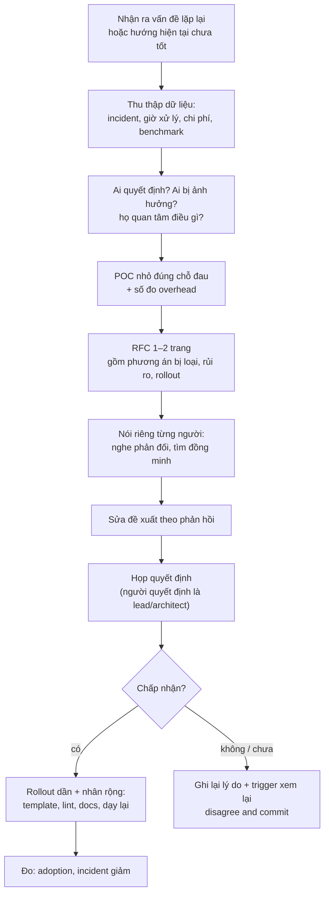
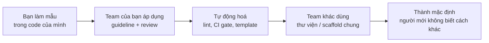

## Bối cảnh & vấn đề

Một kỹ sư nhận ra team đang gặp lại cùng một loại bug lần thứ ba trong quý: dữ liệu của tenant này lọt sang query của tenant khác vì ai đó quên thêm điều kiện `tenant_id`. Anh viết một tin nhắn dài trong kênh team: "Chúng ta cần tenant isolation ở tầng database, row-level security, không thể tiếp tục như thế này." Tin nhắn nhận ba emoji và một câu "đồng ý, để sau sprint này". Sáu tuần sau, chưa có gì thay đổi. Bug thứ tư xảy ra.

Anh không sai về kỹ thuật. Anh thất bại ở **ảnh hưởng**: biến một ý đúng thành một quyết định được thực hiện. Ở level senior, đây là kỹ năng cốt lõi, vì phần lớn thay đổi quan trọng (pattern dùng chung, chuẩn chất lượng, migration lớn) cần nhiều người đồng ý và làm, trong khi bạn thường không phải người có quyền ra lệnh. Đó là lý do nhóm câu hỏi "leadership without authority" có mặt ở hầu hết vòng behavioral senior.

Bài này đi qua bốn câu của track: ảnh hưởng một quyết định kỹ thuật không có quyền chính thức (behavioral-023), quyết định bạn dẫn dắt có tác động ngoài team (035), nâng engineering bar (037), và mentoring (017). Chúng chung một cơ chế: **ảnh hưởng đến từ bằng chứng, sự tin tưởng và việc làm cho điều đúng trở nên dễ làm**, không đến từ việc nói to hơn.

## Khái niệm

### Formal authority và influence

**Formal authority** là quyền đến từ vị trí: manager phân việc, tech lead chốt thiết kế, architect phê duyệt. **Influence** là khả năng thay đổi điều người khác nghĩ và làm mà không dùng quyền đó. Ở cấp IC senior, gần như mọi thay đổi vượt ra ngoài code của bạn đều cần influence.

Influence có vài nguồn chính. **Chuyên môn** (bạn hiểu vấn đề sâu hơn, có dữ liệu). **Uy tín tích luỹ** (bạn từng đề xuất đúng, từng giao đúng cam kết). **Quan hệ** (người ta tin bạn vì đã làm cùng). **Chữ viết** (một đề xuất rõ ràng đi xa hơn một cuộc nói chuyện). **Làm mẫu** (một PR chạy được thuyết phục hơn mười slide). Câu chuyện mạnh cho behavioral-023 thường dùng ít nhất ba nguồn.

**Interview angle:** red flag của 023 là "Influence = repeating the argument louder". Interviewer tìm chuỗi hành động có cấu trúc, không phải sự kiên trì đơn thuần.

### Bằng chứng: dữ liệu, POC, chi phí

Đề xuất thay đổi chỉ có trọng lượng khi nó trả lời "vì sao bây giờ, và bao nhiêu". **Dữ liệu** biến cảm giác thành sự thật: "bốn incident trong hai quý cùng nguyên nhân, tổng khoảng 9 giờ xử lý và hai lần phải báo khách hàng". **POC** (proof of concept) biến "có thể làm được" thành "đây, nó chạy": một nhánh nhỏ áp dụng row-level security cho một bảng, kèm số đo overhead. **Chi phí** cho thấy bạn hiểu phía bên kia: thay đổi tốn bao nhiêu ngày, ai phải học gì, rủi ro migration.

Một POC tốt nhỏ và đúng chỗ đau: không phải làm lại toàn bộ hệ thống, mà làm một trường hợp thật, đủ để người hoài nghi nhất phải nói "ok, vậy thì vấn đề còn lại là X".

**Interview angle:** follow-up của 023 hỏi những người bất đồng quan tâm điều gì. Dữ liệu chi phí trong đề xuất chính là cách bạn trả lời mối quan tâm của họ trước khi họ hỏi.

### RFC / design doc ngắn

**RFC** (request for comments) hay **design doc** là tài liệu đề xuất một thay đổi, để người khác đọc và phản hồi trước khi quyết định. Một RFC tốt cho thay đổi cỡ team dài 1–2 trang: vấn đề (có số), mục tiêu và không-mục-tiêu, phương án đề xuất, **các phương án đã cân nhắc và lý do loại**, rủi ro, kế hoạch rollout, câu hỏi mở. Phần phương án bị loại quan trọng vì nó cho thấy bạn đã nghĩ về cách của người khác.

Chữ viết có lợi thế lớn trong team phân tán: người ở múi giờ khác đọc được, người ít nói trong họp góp ý được, và quyết định được ghi lại cho người đến sau. Phần Ví dụ thực tế có template.

**Interview angle:** nói "tôi viết một RFC hai trang" kèm một chi tiết về nội dung (ví dụ phần không-mục-tiêu) đáng tin hơn "tôi đề xuất trong họp".

### Nói chuyện riêng trước khi họp

Trước khi đưa đề xuất ra cuộc họp quyết định, nói chuyện riêng với từng người bị ảnh hưởng hoặc có tiếng nói. Văn hoá Nhật gọi là *nemawashi* (đào quanh gốc trước khi chuyển cây). Mục đích không phải vận động hành lang, mà là **nghe phản đối sớm** khi bạn còn sửa được đề xuất, và để không ai bị bất ngờ trong cuộc họp. Người bị bất ngờ trong họp có xu hướng phản đối để giữ thể diện.

Trong các cuộc nói chuyện này, bạn tìm **đồng minh** (người cũng chịu cái đau, sẵn sàng nói thay bạn), và **điều chỉnh đề xuất** theo phản hồi (giảm phạm vi, đổi thứ tự rollout). Một đề xuất đi vào họp mà đã có ba người ủng hộ và hai phản đối đã được xử lý gần như chắc chắn được thông qua.

**Interview angle:** câu "tôi gặp riêng QA lead và hai backend dev trước khi đưa RFC ra họp" là bằng chứng cụ thể của kỹ năng này.

### Tác động ngoài team và nhân rộng

behavioral-035 hỏi về quyết định có tác động **ngoài công việc hoặc team của bạn**. Ở đây khác biệt giữa một thay đổi tốt và một thay đổi có tầm là **nhân rộng**: thay đổi có sống được khi bạn không có mặt không? Các cơ chế nhân rộng: **template/scaffold** (service mới tự có sẵn pattern), **thư viện dùng chung** (helper tenant-aware data access), **docs và ví dụ**, **CI gate hoặc lint** (máy nhắc thay người), **dạy lại** (buổi chia sẻ, pairing với team khác).

Follow-up "What's the evidence that it is still being used today?" rất khó nếu bạn chỉ thuyết phục được một lần. Bằng chứng tốt: số service/module dùng helper, lint rule chặn được bao nhiêu PR, team khác tự áp dụng mà không cần bạn.

**Interview angle:** nói được "điều làm nó lan toả là chúng tôi làm cho cách đúng là cách dễ nhất" là reflection mà hint của 035 chờ.

### Nâng engineering bar mà không thành cảnh sát code

behavioral-037 hỏi về việc nâng chuẩn (test, review, observability, migration safety). Có hai cách nâng chuẩn. Cách **cảnh sát**: block PR, comment gắt, yêu cầu theo ý mình. Nó có tác dụng ngắn hạn và tạo phản kháng. Cách **paved road** (con đường trải sẵn): làm cho cách đúng là cách dễ nhất, bằng template, tooling, automation, và làm mẫu trước bằng code của chính bạn.

Trình tự thường hiệu quả: **làm mẫu** (PR của bạn có test và metric), **viết guideline/checklist ngắn** dựa trên lỗi thật của team, **tự động hoá** phần máy làm được (lint, CI gate, PR template), **dạy qua review** (giải thích why, phân biệt "phải sửa" với "gợi ý"), **đo** (incident giảm, thời gian review, coverage của luồng quan trọng). Follow-up "teammates who saw it as slowing them down" cần câu trả lời có số: chi phí thêm là bao nhiêu phút mỗi PR, và nó tiết kiệm được gì.

**Interview angle:** câu "tôi đánh dấu comment review là `nit:` hay `blocking:` để người nhận biết cái gì bắt buộc" là chi tiết nhỏ nhưng thuyết phục.

### Mentoring có chủ đích

behavioral-017 có red flag "Mentoring = answering questions when asked". Mentoring có chủ đích nghĩa là bạn **chủ động thiết kế** sự phát triển của người kia: hiểu mục tiêu của họ, giao task **tăng dần** độ khó, pair programming ở phần khó, review **giải thích why** thay vì chỉ sửa, để họ **tự debug trước** rồi mới gợi ý, và đo tiến bộ (họ tự làm được gì mà trước đây không).

Một kỹ thuật hữu ích: khi họ hỏi, đáp bằng câu hỏi trước ("em đã thử gì? em nghĩ lỗi ở tầng nào?"). Nó chậm hơn đưa đáp án trong ngắn hạn, nhưng dạy được cách nghĩ. Khi thời gian gấp (incident), đưa đáp án rồi giải thích sau.

**Interview angle:** follow-up "What would you do differently if you mentored them again?" cần một bài học thật, ví dụ "tôi đã giao task quá lớn quá sớm".

## Cơ chế hoạt động

Diagram dưới đây là quy trình ảnh hưởng một quyết định kỹ thuật khi bạn không có quyền chốt. Mỗi bước tăng khả năng đề xuất được chấp nhận và giảm rủi ro mất lòng tin.



Có hai chỗ cần giải thích. Bước **"Ai quyết định? Ai bị ảnh hưởng?"** đến trước POC vì nó định hướng POC: nếu người quyết định lo về hiệu năng, POC phải có số đo hiệu năng; nếu QA lo về test, POC phải có cách test. Một POC trả lời câu hỏi không ai hỏi là công sức phí.

Nhánh **"không / chưa"** không phải thất bại. Ghi lại lý do từ chối và một trigger cụ thể ("nếu thêm một incident cùng loại, chúng ta xem lại") giữ đề xuất sống mà không phải tranh cãi tiếp. Nhiều đề xuất được chấp nhận ở lần thứ hai, khi trigger xảy ra và mọi người nhớ rằng bạn đã nói trước một cách bình tĩnh. Hint của 023 cũng hỏi: nếu không thành công, bạn học được gì về cách thuyết phục.

Diagram thứ hai là "phễu nhân rộng" của một thay đổi, cho câu 035 và 037:



Mỗi bước sang phải giảm sự phụ thuộc vào bạn. Ở bước A, thay đổi chỉ sống khi bạn viết code. Ở bước E, thay đổi là "cách mọi thứ được làm ở đây". Câu chuyện senior mạnh thường đi tới ít nhất bước C, vì tự động hoá là chỗ thay đổi ngừng cần sự kiên trì của một người.

## Ví dụ thực tế

### Ảnh hưởng quyết định (behavioral-023): weak vs strong

```text
WEAK (minh hoạ)
"I thought we should use row-level security for tenant isolation. I kept
bringing it up in meetings for a few months. Eventually my manager agreed and
told the team to do it."
```

Bình luận: lặp lại lập luận ("kept bringing it up"), không có dữ liệu, quyết định đến từ quyền của manager chứ không phải từ ảnh hưởng của bạn. Không có phần người bất đồng quan tâm điều gì.

```text
STRONG (minh hoạ)
S: "We had three cross-tenant data bugs in two quarters, all from a query
   missing its tenant filter. The tech lead's position was that code review
   would catch them."
T: "I didn't own the data layer, but I'd fixed two of the three bugs, so I
   wanted to change how we enforced isolation."
A: "I pulled the incidents together: about nine hours of engineering time and
   two customer notifications. I asked the tech lead and our DBA separately
   what worried them about database-level enforcement — the lead feared a big
   migration, the DBA feared query overhead. So I built a POC on our two
   busiest tables: a session variable set per request and a row-level policy.
   Overhead on our hottest query was within noise on a production-sized copy.
   I wrote a two-page RFC with a rollout one table at a time behind a flag, and
   a section on what we were NOT doing — no schema split. I walked the QA lead
   through it before the review because tests would change most for them."
R: "The lead approved a pilot on the two tables. After a month with no issues
   we rolled it to the rest over a quarter. We haven't had a cross-tenant bug
   since."
Reflection: "The turning point wasn't my argument — it was asking the DBA what
   he was afraid of and measuring exactly that."
```

Bình luận: dữ liệu, hỏi interest từng người, POC đúng chỗ lo ngại, RFC có không-mục-tiêu, nói chuyện riêng trước họp, rollout dần. Reflection trả lời trước follow-up.

### Nâng engineering bar (behavioral-037): strong (minh hoạ, rút gọn)

```text
"Migrations were our most common cause of incidents — three in six months, all
from locking a big table during deploy. I started by writing my own
migrations in the expand/contract style and explaining why in the PR
description. Then I turned the three incidents into a one-page checklist and
added a CI check that flags migrations which add a NOT NULL column without a
default or create an index without CONCURRENTLY. Two teammates felt it slowed
them down; I measured it — the check added under a minute to CI, and the
checklist about ten minutes per migration PR. I showed that next to the
roughly six hours each incident had cost. We had no migration incidents in
the following two quarters, and another team copied the CI check."
```

### Mentoring (behavioral-017): khung

```text
NGƯỜI (vai trò, kinh nghiệm, không cần tên): ______
HỌ GẶP KHÓ GÌ (cụ thể): ______   MỤC TIÊU CỦA HỌ: ______
TÔI LÀM GÌ (chủ động, không chỉ trả lời):
  - Task tăng dần: ______ → ______ → ______
  - Pair ở phần: ______    Review giải thích why: ví dụ ______
  - Để họ tự debug trước: lần ______
THAY ĐỔI CỦA HỌ (tự làm được gì, sau bao lâu): ______
TÁC ĐỘNG LÊN TEAM: ______
TÔI SẼ LÀM KHÁC GÌ: ______
```

### Template RFC ngắn

```markdown
# RFC: Tenant isolation ở tầng database (row-level security)
Author: ___  Status: draft → review → accepted/rejected  Date: YYYY-MM-DD

## Problem (có số)
3 cross-tenant bugs trong 2 quý, ~9 giờ xử lý, 2 lần báo khách hàng.

## Goals / Non-goals
Goals: không query nào đọc được dữ liệu tenant khác kể cả khi quên filter.
Non-goals: không tách schema/DB theo tenant; không đổi API.

## Proposal
Session variable `app.tenant_id` mỗi request + policy trên từng bảng.

## Alternatives considered
1. Chỉ dựa vào code review — đã thất bại 3 lần.
2. Lint rule cho query thiếu tenant filter — bổ trợ, không đủ (raw SQL, ORM).
3. Schema-per-tenant — chi phí migration và vận hành quá lớn.

## Risks & rollout
Overhead (POC: trong nhiễu đo), migration từng bảng sau flag, rollback = tắt policy.

## Open questions
Job batch chạy không có tenant context thì sao?
```

## Trade-offs & lựa chọn thay thế

| Cách tạo thay đổi | Tốc độ | Độ bền | Rủi ro | Khi nào dùng |
|---|---|---|---|---|
| Nói trong họp / chat | Nhanh | Thấp | Bị quên | Thay đổi nhỏ, ai cũng đồng ý |
| RFC + review | Trung bình | Cao | Chậm nếu RFC quá dài | Thay đổi khó đảo ngược, nhiều người bị ảnh hưởng |
| POC trước rồi đề xuất | Trung bình | Cao | POC thành production mà chưa ai đồng ý | Khi tranh cãi về "có làm được không" |
| Làm mẫu trong code của mình | Chậm | Trung bình | Chỉ sống khi bạn còn làm | Chuẩn chất lượng, pattern mới |
| Tự động hoá (lint, CI) | Chậm lúc đầu | Rất cao | Phản kháng nếu chưa thuyết phục | Sau khi team đã đồng ý về nguyên tắc |
| Nhờ manager ra lệnh | Nhanh | Trung bình | Mất lòng tin, mọi người làm chống đối | Hầu như không nên làm bước đầu |

Thứ tự thường hiệu quả: làm mẫu và thu dữ liệu → RFC và nói chuyện riêng → quyết định → tự động hoá. Tự động hoá trước khi có đồng thuận (thêm CI gate mà không ai được hỏi) là cách nhanh nhất để thành "cảnh sát code". Nhờ manager ra lệnh chỉ hợp lý khi đó là quyết định thuộc quyền manager và bạn đã đi qua các bước trên; khi đó bạn không "nhờ ra lệnh", mà đưa đề xuất cho người có quyền quyết định.

## Edge cases & failure modes

- **Đề xuất bị từ chối**: vẫn là story tốt nếu bạn kể được bạn học gì về thuyết phục và đã commit thế nào. Nhiều interviewer coi story thất bại về influence là trưởng thành hơn story luôn thắng.
- **Người quyết định không rõ** (hai team ngang nhau): tìm người có quyền ở cấp trên chung, hoặc đề xuất thử nghiệm có thời hạn.
- **Đồng minh rút lui trong cuộc họp**: đây là lý do nói chuyện riêng phải xác nhận rõ ("anh có sẵn sàng nói ý kiến này trong họp không?").
- **POC thành production**: rủi ro thật. Ghi rõ "POC, không dùng production" và xoá nhánh nếu không được chấp nhận.
- **Mentee không tiến bộ**: có thể do mismatch về cách học, quá tải, hoặc kỳ vọng không rõ. Thử đổi cách, hỏi họ trực tiếp, và báo lead nếu ảnh hưởng tới delivery.
- **Bạn là người mới**: influence dựa trên uy tín tích luỹ chưa có. Bắt đầu nhỏ: một PR cải thiện, một doc, một bug fix khó; uy tín đến trước đề xuất lớn.
- **Thay đổi lan sang team khác nhưng họ dùng sai**: nhân rộng cần docs, ví dụ, và một kênh hỏi đáp; không chỉ publish thư viện.

## Pitfalls

- ❌ Lặp lại lập luận to hơn → ✅ dữ liệu, POC, RFC, nói chuyện riêng, vì influence cần chuỗi hành động có cấu trúc.
- ❌ Đi thẳng tới manager của lead → ✅ nói với lead trước, cùng trình bày cho người quyết định nếu không hội tụ.
- ❌ POC trả lời câu hỏi không ai hỏi → ✅ hỏi người quyết định lo gì, rồi POC đúng chỗ đó.
- ❌ RFC không có phương án bị loại → ✅ ghi rõ cách của người khác và lý do loại, vì đó là cách cho thấy bạn đã nghe.
- ❌ Nâng chuẩn bằng block PR và comment gắt → ✅ làm mẫu, checklist từ lỗi thật, tự động hoá, đo chi phí và lợi ích.
- ❌ Thay đổi chỉ sống khi bạn còn ở đó → ✅ template, thư viện, lint, docs, dạy lại.
- ❌ Mentoring = trả lời khi được hỏi → ✅ task tăng dần, pair phần khó, review giải thích why, để họ tự debug trước.

## Tóm tắt

- Influence đến từ **chuyên môn, uy tín, quan hệ, chữ viết, làm mẫu**, không từ chức danh hay âm lượng.
- Trình tự: **dữ liệu → hiểu người quyết định lo gì → POC đúng chỗ → RFC ngắn → nói riêng → họp → rollout dần**.
- RFC tốt có **không-mục-tiêu** và **phương án đã loại**.
- Bị từ chối: ghi lý do + trigger xem lại, disagree and commit.
- Tác động ngoài team cần **nhân rộng**: template, thư viện, lint, docs; bằng chứng là adoption hiện tại.
- Nâng bar theo kiểu **paved road**, đo chi phí thêm và lợi ích để trả lời người phản đối.
- Mentoring có chủ đích: mục tiêu của họ, task tăng dần, giải thích why, để họ tự làm, đo tiến bộ.
