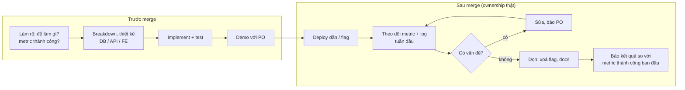
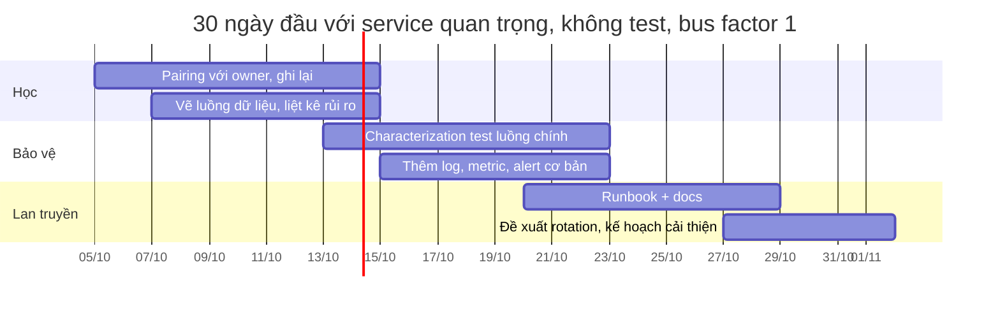

## Bối cảnh & vấn đề

Hai kỹ sư cùng giao feature địa chỉ giao hàng. Người thứ nhất làm đúng ticket: API, form, validation, test, PR được merge, ticket chuyển sang Done. Người thứ hai làm y như vậy, rồi làm thêm ba việc không ai yêu cầu: thêm một panel theo dõi tỷ lệ validation lỗi theo provider, viết nửa trang docs về format địa chỉ của từng quốc gia, và hai tuần sau, khi panel cho thấy tỷ lệ lỗi tăng vọt ở một provider, mở ticket và sửa trước khi có người dùng phàn nàn.

Khi được hỏi "Tell me about a time you owned something end-to-end", người thứ nhất kể tới lúc merge. Đó chính là red flag của behavioral-015: "Ownership ended at 'PR merged'". Người thứ hai có câu chuyện về **ownership thật**: quan tâm tới kết quả, không chỉ tới việc hoàn thành task. Follow-up "What happened after it shipped? How did you know it was working?" là câu mà chỉ người thứ hai trả lời được.

Ownership là signal được hỏi nhiều nhất ở vòng senior, dưới nhiều hình thức: own end-to-end (015), vượt ra ngoài vai trò (029), cải thiện quy trình (021), tiếp quản một service rủi ro (022). Và nó gắn chặt với một kỹ năng mà nhiều ứng viên yếu: **đo impact**. behavioral-044 ("Your CV has no numbers. Pick your strongest claim…") hỏi thẳng vào nó. Bài này dạy cả hai: ownership trông như thế nào trong câu chuyện, và làm sao biến "nhanh hơn nhiều" thành con số bảo vệ được.

## Khái niệm

### Ownership là quan tâm tới kết quả

**Ownership** trong ngữ cảnh kỹ thuật là chịu trách nhiệm về **kết quả** của một thứ, không chỉ về **output** (code, PR, ticket). Kết quả là: người dùng dùng được không, nó có chạy ổn trên production không, nó có giải quyết vấn đề business ban đầu không. Amazon diễn đạt nguyên tắc này là "Leaders… never say 'that's not my job'".

Trong câu chuyện, ownership thể hiện qua toàn bộ vòng đời: **làm rõ requirement** (hỏi "để làm gì" chứ không chỉ "làm gì"), **breakdown và thiết kế** (DB, API, FE), **test**, **demo** với PO, **deploy**, **theo dõi sau release** (metric, log, feedback người dùng), **xử lý vấn đề phát sinh**, và **dọn dẹp** (xoá flag, cập nhật docs). Phần sau release là phần phân biệt.

**Interview angle:** chuẩn bị sẵn câu trả lời cho "How did you know it was working?" với một metric cụ thể và nơi bạn xem nó.

### Vượt ra ngoài vai trò mà không giẫm chân

behavioral-029 hỏi về việc giải quyết vấn đề nằm ngoài trách nhiệm trực tiếp: module của team khác, hạ tầng, quy trình. Câu chuyện mạnh có sự cân bằng tinh tế: bạn **chủ động** (không bỏ qua vấn đề vì "không phải việc của tôi"), nhưng bạn **phối hợp với owner** (không tự sửa code của team khác trái quy trình, không merge vào repo của họ khi họ không biết).

Trình tự thường là: điều tra đủ để có bằng chứng, liên hệ owner với bằng chứng và đề xuất ("tôi thấy X, nghĩ nguyên nhân là Y, tôi có thể gửi PR nếu các bạn muốn"), để owner quyết định cách sửa, và hỗ trợ tới khi xong. Follow-up "How did the owning team react to you getting involved?" kiểm tra bạn đã làm đúng cách chưa.

**Interview angle:** reflection mà hint của 029 chờ là "ranh giới giữa ownership và giẫm chân team khác", nói rõ bạn đặt ranh giới đó ở đâu.

### Cải thiện process và developer experience

behavioral-021 hỏi về cải thiện quy trình hoặc developer experience (DX): build chậm, review lâu, deploy thủ công, test flaky, onboarding khó. Câu chuyện mạnh đi theo vòng **đo → đề xuất → triển khai → thuyết phục → duy trì**. Đo trước để có baseline ("CI mất 22 phút, trong đó 14 phút là cài dependency"). Đề xuất có chi phí rõ. Triển khai nhỏ trước. Thuyết phục team áp dụng, xử lý phản kháng. Và quan trọng nhất: **làm sao để thay đổi được duy trì** khi bạn không còn để ý.

Follow-up "Did anyone resist? How did you handle it?" hầu như luôn có. Phản kháng là bình thường (người ta quen cách cũ), và câu trả lời mạnh cho thấy bạn hiểu lý do phản kháng, không coi đó là cứng đầu.

**Interview angle:** số liệu trước/sau là xương sống của câu này; không có số thì câu chuyện cải thiện quy trình nghe như ý kiến cá nhân.

### 30 ngày đầu với một service rủi ro

behavioral-022 là scenario: bạn vào team, thấy một service quan trọng không có test và chỉ một người hiểu. Hai lỗi đối xứng: **viết lại ngay** (rủi ro cao, người mới chưa hiểu tại sao code như vậy, và xúc phạm người đang own), và **không làm gì** (chấp nhận bus factor bằng 1). **Bus factor** là số người phải "biến mất" trước khi dự án bị kẹt; bằng 1 là rủi ro nghiêm trọng.

Kế hoạch tốt cân bằng **học** và **giao giá trị sớm**: tuần 1–2 học từ người hiểu (pairing, ghi lại, vẽ luồng dữ liệu), xác định rủi ro lớn nhất; tuần 2–3 viết **characterization test** (test ghi lại hành vi hiện tại, kể cả kỳ quặc, để mọi thay đổi sau đó được phát hiện) cho luồng quan trọng nhất và thêm observability; tuần 3–4 viết runbook, đề xuất rotation, đưa kế hoạch cải thiện có ưu tiên cho lead. Không rewrite. Nếu sau này cần thay thế, dùng mô hình **strangler fig** (thay dần từng phần, cái cũ và mới chạy song song).

**Interview angle:** follow-up "That person is defensive about their code" kiểm tra kỹ năng con người: bắt đầu bằng việc học từ họ, ghi công họ, và đóng khung việc viết test là bảo vệ họ (không ai phải gọi họ lúc 2 giờ sáng nữa).

### Impact đo được: baseline, metric, attribution

**Impact** là thay đổi đo được mà công việc của bạn tạo ra. Để nói về impact một cách bảo vệ được, cần ba thứ. **Baseline**: số đo trước thay đổi, cùng điều kiện (cùng khung giờ, cùng loại tải). **Metric đúng**: metric phản ánh điều người dùng hoặc business quan tâm (p95 latency thay vì latency trung bình, tỷ lệ checkout thành công thay vì số request). **Attribution**: lập luận rằng chính thay đổi của bạn tạo ra khác biệt, không phải yếu tố khác (traffic giảm, một deploy khác cùng tuần, mùa thấp điểm).

Follow-up của behavioral-044 là "How did you measure that, and what else changed at the same time that could explain the improvement?". Câu trả lời mạnh nêu nguồn đo (APM, log, dashboard DB), so sánh cùng điều kiện, và chủ động loại trừ yếu tố gây nhiễu: "traffic tuần sau còn cao hơn 6%, nên không phải do tải giảm".

**Interview angle:** nếu bạn thực sự không có số, nói thật, nói cách bạn ước lượng ("theo những gì tôi nhớ từ dashboard lúc đó, khoảng…"), và nói bạn đã đổi cách làm (luôn ghi baseline trước khi tối ưu). Đó là reflection của hint 044.

### Loại metric để thu thập

Không phải mọi impact đều là latency. Nhóm metric phổ biến cho kỹ sư full-stack: **hiệu năng** (p95/p99 latency, throughput, DB CPU, cache hit rate, bundle size, LCP), **độ tin cậy** (error rate, số incident, MTTR, số lần rollback), **delivery** (thời gian từ ticket tới production, thời gian CI, thời gian review), **business** (tỷ lệ chuyển đổi, số ticket support, số tenant onboard được), **team** (thời gian onboarding người mới, số người tự làm được việc X).

Danh sách "Numbers to collect" trong overview của track là checklist tốt. Thu thập ngay khi còn ở công ty hiện tại; sau khi nghỉ, bạn không còn truy cập dashboard.

**Interview angle:** chọn một hoặc hai metric chính cho mỗi story và nhớ chắc chúng; năm metric mơ hồ kém hơn một metric chắc chắn.

## Cơ chế hoạt động

Diagram dưới đây là vòng đời ownership của một feature. Phần trong khung "sau merge" là phần mà red flag của 015 chỉ ra là hay bị thiếu.



Chú ý mũi tên đầu tiên: **metric thành công được hỏi từ lúc làm rõ requirement**, không phải nghĩ ra sau khi ship. Nếu bạn hỏi PO "chúng ta biết feature này thành công khi nào?" ngay từ đầu, phần "báo kết quả" ở cuối có sẵn số để so. Đây cũng là cách tự nhiên nhất để có số liệu cho câu chuyện phỏng vấn sau này.

Diagram thứ hai là kế hoạch 30 ngày cho scenario 022, thể hiện thứ tự ưu tiên:



Các giai đoạn chồng lên nhau có chủ đích: bạn bắt đầu viết test trong lúc vẫn học, vì viết test là một cách học (mỗi test fail ngoài dự kiến dạy bạn một hành vi). Không có giai đoạn "rewrite" trong 30 ngày. Kết quả cuối không phải code mới mà là **bus factor lớn hơn 1** và một kế hoạch có ưu tiên cho lead quyết định.

## Ví dụ thực tế

### Biến claim thành con số (behavioral-044)

Bạn có một claim trên CV: "Introduced caching for hot APIs, improving performance significantly." Script dưới đây minh hoạ cách tính số liệu bảo vệ được từ dữ liệu latency export ra từ log hoặc APM, cùng khung giờ trước và sau thay đổi, kèm số request để loại trừ giả thuyết "traffic thấp hơn". Dữ liệu là minh hoạ; với dữ liệu thật bạn có hàng nghìn mẫu.

```ts
// impact.ts: biến "nhanh hơn nhiều" thành số có thể bảo vệ
// Input: latency (ms) export từ log/APM cho cùng khung giờ, trước và sau thay đổi.
const before = [180, 220, 240, 260, 310, 350, 420, 900, 1450, 2100, 2300, 2600];
const after = [150, 160, 170, 175, 190, 200, 210, 240, 260, 300, 380, 450];
const reqsBefore = 48_200; // số request cùng khung giờ (để loại trừ "traffic thấp hơn")
const reqsAfter = 50_900;

function pct(xs: number[], p: number): number {
  const s = [...xs].sort((a, b) => a - b);
  const i = Math.ceil((p / 100) * s.length) - 1; // nearest-rank
  return s[Math.max(0, i)];
}
const row = (name: string, b: number, a: number) =>
  console.log(`${name.padEnd(10)} ${String(b).padStart(6)} → ${String(a).padStart(6)}  (${(((a - b) / b) * 100).toFixed(0)}%)`);

row("p50 ms", pct(before, 50), pct(after, 50));
row("p95 ms", pct(before, 95), pct(after, 95));
row("max ms", Math.max(...before), Math.max(...after));
row("requests", reqsBefore, reqsAfter);
const slow = (xs: number[]) => xs.filter((x) => x > 1000).length / xs.length;
console.log(`> 1 s     ${(slow(before) * 100).toFixed(0)}% → ${(slow(after) * 100).toFixed(0)}% of sampled requests`);
```

Output thật (Node 24.21, `node --experimental-strip-types impact.ts`):

```text
p50 ms        350 →    200  (-43%)
p95 ms       2600 →    450  (-83%)
max ms       2600 →    450  (-83%)
requests    48200 →  50900  (6%)
> 1 s     33% → 0% of sampled requests
```

Đọc output và một bài học ẩn. p95 giảm 83%, p50 giảm 43%: cache giúp nhiều nhất ở đuôi chậm, đúng như kỳ vọng khi các request chậm là cache miss xuống DB. Số request **tăng** 6%, nên không thể giải thích bằng "traffic thấp hơn". Nhưng để ý: với chỉ 12 mẫu, p95 **bằng đúng max**. Đó là lý do bạn không tính percentile từ vài mẫu chọn tay; dùng số percentile mà APM tính trên toàn bộ request, và nói rõ nguồn khi trả lời.

Câu trả lời phỏng vấn từ dữ liệu này (minh hoạ):

```text
"The clearest one is the Redis cache on our product-listing API. Before, p95
in the evening peak was around 2.5 seconds — that's from our APM dashboard, same
hour on comparable weekdays. After, it was around 450 ms, and p50 dropped less,
from about 350 to 200, which makes sense because the slow requests were the
cache misses. Traffic was actually about 6% higher in the 'after' week, so it
wasn't lower load. One honest caveat: the same sprint we also added an index on
one of the underlying queries, so I'd attribute most but not all of the tail
improvement to the cache — the index alone, measured on staging, took p95 to
roughly 1.6 s."
```

Bình luận: nguồn đo, cùng điều kiện, giải thích vì sao p50 và p95 khác nhau, loại trừ traffic, và **chủ động nêu yếu tố gây nhiễu** (index cùng sprint) kèm cách tách. Câu trả lời này mạnh hơn nhiều so với một con số "giảm 80%" trơn, vì follow-up đã được trả lời trước.

### Ownership end-to-end (behavioral-015): weak vs strong

```text
WEAK (minh hoạ)
"I built the address management feature. I did the API and the frontend, wrote
tests, and it was merged on time. The PO was happy."
```

```text
STRONG (minh hoạ)
"Address management was assigned as three tickets — API, form, validation. I
took all three because they shared one data model, and I asked the PO first
what success looked like: fewer failed deliveries from bad addresses. I
designed the schema per country format, built the API and form, and shipped it
behind a flag to 10% of tenants. Because I wanted to see the delivery-failure
number move, I added a panel for validation failures per provider. Two weeks in
it showed one provider rejecting 12% of addresses after they changed a postcode
rule; I fixed it the same day, before support saw a ticket. After a month at
100%, failed deliveries tagged 'bad address' were down by roughly a third per
the logistics report. Then I removed the flag and wrote half a page of docs on
country formats."
```

### Template ownership/impact (điền vào)

```text
VIỆC: ______  Ai giao phần nào, phần nào tôi tự nhận: ______
METRIC THÀNH CÔNG (hỏi lúc đầu): ______
VÒNG ĐỜI: làm rõ ____ · thiết kế ____ · test ____ · rollout ____
SAU MERGE: theo dõi gì, ở đâu ____ · vấn đề phát hiện ____ · xử lý ____
DỌN DẸP: flag ____ · docs ____
IMPACT: ____ → ____ (nguồn ____, cùng điều kiện ____)
YẾU TỐ GÂY NHIỄU và cách tách: ______
NẾU NGOÀI VAI TRÒ: owner là ai, tôi liên hệ thế nào, họ phản ứng ra sao: ______
```

## Trade-offs & lựa chọn thay thế

| Tình huống | Lựa chọn A | Lựa chọn B | Chọn thế nào |
|---|---|---|---|
| Thấy bug ở module team khác | Tự sửa, gửi PR | Báo owner kèm bằng chứng, đề nghị giúp | B trước; A khi owner đồng ý hoặc quy trình cho phép |
| Service không test, bus factor 1 | Rewrite | Characterization test + docs + strangler dần | Gần như luôn B trong 30 ngày đầu |
| Cải thiện DX | Áp dụng cho cả team ngay | Thử ở một repo, đo, rồi mở rộng | B, trừ khi thay đổi nhỏ và ai cũng đồng ý |
| Số liệu impact | Số chính xác bạn không chắc | Khoảng ước lượng có nguồn | Luôn B nếu không chắc |
| Nhiều metric | Kể năm metric | Một metric chính + một phụ | B; dư metric làm loãng |
| Ownership sau release | Theo dõi tay hằng ngày | Alert + dashboard | B; theo dõi tay không bền |

Hàng đầu tiên cần nói thêm: ở một số tổ chức, gửi PR vào repo team khác là bình thường (inner source); ở nơi khác, đó là vi phạm. Đọc văn hoá trước. Trong câu trả lời phỏng vấn, nêu rõ bạn đã hỏi owner trước, và cho thấy bạn hiểu vì sao điều đó quan trọng (owner chịu on-call cho code đó).

## Edge cases & failure modes

- **Bạn làm outsourcing và không có quyền xem metric production**: ownership vẫn thể hiện được: bạn hỏi khách hàng về kết quả, đề xuất thêm metric, theo dõi bug report. Nói thật về giới hạn truy cập.
- **Không có số liệu nào**: nói thật, đưa ước lượng có lập luận ("CSV 200 MB trước mất khoảng 40 phút, giờ chạy trong giờ nghỉ trưa"), và nói bạn giờ luôn đo baseline.
- **Impact là của team, bạn chỉ góp phần**: nói rõ phần của bạn và phần của người khác; tránh nhận hết.
- **Vượt ra ngoài vai trò nhưng owner phản ứng tệ**: kể trung thực, tập trung vào cách bạn điều chỉnh (đưa bằng chứng, để họ dẫn), và kết quả cuối.
- **Người duy nhất hiểu service rời đi trong tuần đầu**: ưu tiên ghi lại tối đa trong thời gian còn lại (ghi màn hình buổi pairing, liệt kê "những điều chỉ anh biết"), rồi test và observability.
- **Cải thiện process bị bỏ sau khi bạn chuyển team**: là bài học thật về duy trì; kể nó như một câu failure nhỏ và nói bạn đã đổi cách (tự động hoá thay vì dựa vào thói quen).
- **Số liệu của bạn bị interviewer nghi**: giải thích phương pháp đo bình tĩnh; nếu bạn không chắc, nói thẳng mức chắc chắn.

## Pitfalls

- ❌ Ownership dừng ở "PR merged" → ✅ theo dõi sau release, xử lý vấn đề, dọn dẹp, báo kết quả, vì đó là phần phân biệt.
- ❌ Không biết feature có hiệu quả không → ✅ hỏi metric thành công từ đầu và đo lại sau.
- ❌ Tự sửa code team khác mà không báo → ✅ bằng chứng + liên hệ owner + đề nghị giúp, để owner quyết định.
- ❌ Rewrite service legacy trong tháng đầu → ✅ học, characterization test, observability, docs, kế hoạch có ưu tiên.
- ❌ "Significantly faster" → ✅ baseline + metric + nguồn + loại trừ yếu tố gây nhiễu.
- ❌ Bịa số chính xác → ✅ khoảng ước lượng có nguồn, nói mức chắc chắn.
- ❌ Tính percentile từ vài mẫu tự chọn → ✅ dùng số APM tính trên toàn bộ request, nói rõ nguồn.
- ❌ Cải thiện DX dựa vào thói quen của bạn → ✅ tự động hoá để nó sống khi bạn không để ý.

## Tóm tắt

- Ownership = chịu trách nhiệm **kết quả**, không chỉ output; phần sau merge là phần được chấm.
- Hỏi **metric thành công** từ lúc làm rõ requirement, đo lại sau release.
- Vượt ra ngoài vai trò: **chủ động** nhưng **phối hợp với owner**, không giẫm chân.
- Cải thiện process: đo → đề xuất → thử nhỏ → thuyết phục → **duy trì bằng tự động hoá**.
- Service rủi ro, bus factor 1: học, **characterization test**, observability, runbook; không rewrite trong tháng đầu.
- Impact bảo vệ được cần **baseline, metric đúng, attribution**; chủ động nêu yếu tố gây nhiễu.
- Thu thập số liệu **khi còn truy cập được**; một metric chắc chắn hơn năm metric mơ hồ.
