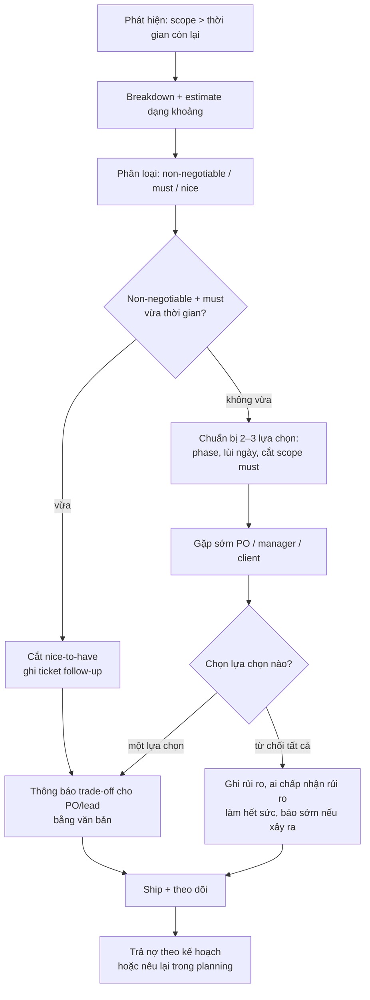
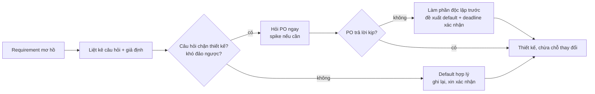

## Bối cảnh & vấn đề

Còn sáu ngày tới buổi demo với khách hàng lớn. Feature export báo cáo mới xong 60%. Kỹ sư phụ trách làm điều mà rất nhiều người làm dưới áp lực: anh im lặng bỏ phần test của job export, bỏ luôn kiểm tra tenant trên API mới ("để sau"), làm thêm buổi tối, và kịp demo. Hai tuần sau, một tenant tải về được báo cáo có dòng dữ liệu của tenant khác, vì API mới quên filter.

Câu chuyện có một thứ đúng (kịp deadline) và hai thứ sai nghiêm trọng: **đánh đổi một thứ không được phép đánh đổi** (tenant isolation), và **đánh đổi một cách im lặng** (không ai biết test bị bỏ, nên không ai biết có nợ cần trả). Red flag của behavioral-014 nói thẳng: "Cut testing silently to hit the date."

Ưu tiên dưới áp lực là chủ đề của năm câu hỏi trong track: trade-off dưới deadline gắt (014), push back deadline hoặc scope với management hoặc client (027), chọn speed thay vì quality và có đúng không (030), quyết định không làm gì (036), và làm việc với requirement mơ hồ (020). Chúng đo cùng một năng lực: **judgment** khi tài nguyên không đủ. Interviewer muốn thấy bạn phân biệt được cái gì cắt được và cái gì không, cắt một cách minh bạch, và biến "không" thành lựa chọn để người khác quyết định.

## Khái niệm

### Must-have, nice-to-have và non-negotiable

Khi thời gian không đủ, việc đầu tiên là phân loại scope. **Must-have**: thiếu nó thì feature không đạt mục tiêu (export CSV cho luồng chính). **Nice-to-have**: có thì tốt, thiếu thì vẫn dùng được (style Excel, progress bar đẹp). Khung **MoSCoW** (Must, Should, Could, Won't) là một cách phân loại phổ biến. Nhưng có một loại thứ ba quan trọng hơn cả: **non-negotiable**, những thứ không bao giờ cắt dù deadline thế nào: bảo mật (auth, permission, tenant isolation), toàn vẹn dữ liệu (không mất, không sai, migration rollback được), và tuân thủ pháp lý.

Non-negotiable khác must-have ở chỗ: must-have là về **giá trị** cho người dùng, non-negotiable là về **thiệt hại** nếu sai. Một feature thiếu nice-to-have vẫn ship được; một feature thiếu tenant check không được ship, kể cả khi nó "chạy".

**Interview angle:** follow-up của 030 là "Where do you draw the line — what would you never trade for speed?". Trả lời bằng danh sách non-negotiable cụ thể, không phải "quality".

### Technical debt có chủ đích

**Technical debt** là chi phí tương lai phát sinh từ một lựa chọn nhanh hôm nay. Martin Fowler chia nợ theo hai trục: **deliberate/inadvertent** (cố ý hay vô tình) và **prudent/reckless** (thận trọng hay liều lĩnh). Nợ tốt là **deliberate + prudent**: "chúng ta biết đây là cách tạm, chúng ta ship bây giờ và sẽ xử lý X trong sprint sau". Nợ tệ là reckless: "không có thời gian cho design" hoặc bỏ test mà không ai biết.

Nợ có chủ đích có ba đặc điểm: **được ghi lại** (ticket follow-up với lý do và chi phí ước tính), **được thông báo** (PO và lead biết), và **có kế hoạch trả** (sprint cụ thể, hoặc trigger cụ thể). Follow-up của 014 "Did you pay back the debt you took on? If not, why?" kiểm tra đặc điểm thứ ba. Trả lời thật, kể cả khi chưa trả: "chưa, vì ưu tiên đổi; tôi đã nêu lại trong planning và nó đang ở top backlog".

**Interview angle:** nói "tôi tạo ticket follow-up ngay trong PR và link vào description" là chi tiết cho thấy nợ được quản lý.

### Reversibility: thước đo rủi ro khi chọn speed

Khi chọn speed thay vì quality (behavioral-030), câu hỏi then chốt là: **lựa chọn này có đảo ngược được dễ không?** Code trong một module nội bộ, sau feature flag, có test cho luồng chính: đảo ngược dễ, nên cắt góc ở đây là hợp lý. Schema dữ liệu, contract API công khai, dữ liệu đã ghi sai format, lỗ hổng bảo mật đã bị khai thác: rất khó hoặc không thể đảo ngược.

Khung đánh giá thực dụng gồm bốn câu hỏi: **dễ đảo ngược không?** **ảnh hưởng dữ liệu hoặc bảo mật không?** **bao nhiêu người bị ảnh hưởng nếu sai?** **chúng ta có phát hiện được nhanh không** (monitoring)? Nếu cả bốn câu đều nghiêng về "an toàn", chọn speed là hợp lý. Đây cũng là khung two-way door / one-way door ở bài [Thất bại](/tracks/behavioral/learn/failure-mistakes).

**Interview angle:** câu 030 hỏi "Was it the right call?". Đánh giá trung thực, kể cả khi nhìn lại nó sai; tiêu chí bạn dùng bây giờ quan trọng hơn kết quả.

### Push back bằng lựa chọn

behavioral-027 hỏi về việc push back deadline hoặc scope từ management hoặc client. Nói "không làm được" là chấm dứt cuộc nói chuyện. Nói "với deadline này, đây là ba lựa chọn" là bắt đầu một cuộc nói chuyện. Các lựa chọn thường xoay quanh **tam giác scope–time–resources** (đôi khi thêm quality, nhưng quality trong nghĩa non-negotiable thì không nằm trên bàn): cắt scope, chia phase (MVP trước, phần còn lại sau), lùi ngày, thêm người (thường không giúp trong ngắn hạn, theo Brooks's law), hoặc chấp nhận rủi ro có ghi lại.

Push back hiệu quả cần **dữ liệu chuẩn bị trước**: breakdown task, estimate dạng **khoảng** (5–8 ngày, không phải "6 ngày"), rủi ro chính, và phần đã chắc chắn. Và cần **thời điểm**: càng sớm càng có nhiều lựa chọn. Push back một tuần trước deadline có ba lựa chọn; push back một ngày trước chỉ còn một.

**Interview angle:** follow-up "What if they said no to all your options?" có đáp án: làm rõ rủi ro bằng văn bản, thống nhất ai chấp nhận rủi ro đó, rồi làm hết sức trong khuôn khổ (disagree and commit), và báo sớm nếu rủi ro xảy ra.

### Quyết định không làm gì

behavioral-036 ("How do you decide what not to work on?") là câu senior. Nó đo khả năng nói "không" hoặc "chưa" với những thứ có giá trị nhưng không đáng nhất lúc này. Khung đơn giản: **tác động** (user/business) × **chi phí** × **rủi ro nếu không làm** × **khả năng đảo ngược**. Thứ có tác động thấp, chi phí cao, rủi ro thấp nếu bỏ qua là ứng viên số một để không làm: refactor "cho đẹp" một module ít thay đổi, tối ưu sớm một endpoint chưa có tải, feature nice-to-have không ai yêu cầu.

Nói "không" cũng là kỹ năng giao tiếp: giải thích lý do bằng ưu tiên chung ("nếu làm cái này, cái kia trễ một tuần"), đưa thời điểm xem lại ("sau release Q4"), và ghi lại để không bị quên. Follow-up "Tell me about something you deprioritized that came back to bite you" cần một câu chuyện thật: ví dụ bạn hoãn thêm index cho một bảng đang lớn dần, và ba tháng sau nó gây timeout.

**Interview angle:** câu trả lời mạnh có một ví dụ cụ thể về thứ bạn **đã chọn không làm** và kết quả của quyết định đó.

### Requirement mơ hồ

behavioral-020 hỏi về làm việc với requirement không đầy đủ. Phản xạ yếu là hoặc chờ (bị block cho tới khi PO trả lời), hoặc đoán (làm theo ý mình rồi rework). Phản xạ mạnh nằm ở giữa: **liệt kê câu hỏi và giả định** thành văn bản, **hỏi sớm** những câu chặn thiết kế (thường chỉ 2–3 câu là thật sự quan trọng), làm **spike/prototype** cho phần không thể trả lời bằng lời, đề xuất **default hợp lý** cho phần còn lại và **ghi lại** để PO xác nhận, và **thiết kế để dễ thay đổi** ở chỗ còn mơ hồ.

Tiêu chí "tự quyết hay chờ": quyết định **đảo ngược được** và **ít người bị ảnh hưởng** thì tự quyết với default có ghi lại; quyết định **khó đảo ngược** (schema, contract với bên ngoài, quy tắc tính tiền) thì phải chờ, hoặc tìm người khác có thẩm quyền.

**Interview angle:** follow-up "What do you do when the PO is unavailable and you're blocked?" có đáp án: làm phần không phụ thuộc trước, đề xuất default bằng văn bản với deadline xác nhận ("nếu tới thứ Năm chưa có ý kiến, tôi đi theo phương án A"), tìm người có thẩm quyền thay thế.

## Cơ chế hoạt động

Diagram dưới đây là quy trình xử lý khi scope không vừa với deadline, từ lúc phát hiện tới lúc có thoả thuận.



Điểm quan trọng nhất là ô **"Phân loại"** đứng trước mọi quyết định cắt, và **non-negotiable không bao giờ xuất hiện trong danh sách lựa chọn để cắt**. Nếu non-negotiable cộng must-have không vừa thời gian, lựa chọn là lùi ngày hoặc cắt một must-have, không phải bỏ tenant check. Ô "Thông báo trade-off bằng văn bản" là thứ biến một quyết định im lặng thành một quyết định minh bạch; nó là khác biệt giữa red flag và câu trả lời mạnh của 014.

Diagram thứ hai là cách xử lý requirement mơ hồ (behavioral-020):



Diagram này cho thấy không phải câu hỏi nào cũng cần chờ. Chia câu hỏi thành "chặn thiết kế" và "không chặn" là cách giữ tiến độ: phần lớn câu hỏi về UX hay edge case nhỏ có thể có default và được xác nhận sau, còn câu hỏi về quy tắc tính tiền hay schema thì phải trả lời trước khi code.

## Ví dụ thực tế

### Chấm nhanh backlog trước deadline

Script dưới đây minh hoạ cách chấm nhanh một backlog khi còn 7 ngày dev. Điểm số là thô (thang 1–5, tự chấm), chỉ để **mở cuộc nói chuyện** với PO chứ không thay cho nó. Non-negotiable luôn được xếp trước, bất kể điểm.

```ts
// prioritize.ts: chấm nhanh backlog trước deadline (thang 1–5, chỉ để mở cuộc nói chuyện)
type Item = { name: string; impact: number; cost: number; riskIfSkipped: number; nonNegotiable?: boolean };

const items: Item[] = [
  { name: "Tenant check on new export API", impact: 3, cost: 1, riskIfSkipped: 5, nonNegotiable: true },
  { name: "Export to CSV (core flow)", impact: 5, cost: 2, riskIfSkipped: 4 },
  { name: "Export to Excel with styling", impact: 2, cost: 3, riskIfSkipped: 1 },
  { name: "Refactor report module", impact: 2, cost: 4, riskIfSkipped: 2 },
  { name: "Progress bar for long exports", impact: 3, cost: 2, riskIfSkipped: 2 },
  { name: "Retry + idempotency on export job", impact: 3, cost: 2, riskIfSkipped: 4 },
];

const score = (i: Item) => (i.impact + i.riskIfSkipped) / i.cost;
const sorted = [...items].sort((a, b) => Number(!!b.nonNegotiable) - Number(!!a.nonNegotiable) || score(b) - score(a));
let budget = 7; // ngày dev còn lại
for (const i of sorted) {
  const fits = i.nonNegotiable || i.cost <= budget;
  if (fits) budget -= i.cost;
  console.log(`${fits ? "DO  " : "LATER"} ${i.name.padEnd(36)} score=${score(i).toFixed(1)} cost=${i.cost}${i.nonNegotiable ? " [non-negotiable]" : ""}`);
}
console.log(`days left: ${budget}`);
```

Output thật (Node 24.21, `node --experimental-strip-types prioritize.ts`):

```text
DO   Tenant check on new export API       score=8.0 cost=1 [non-negotiable]
DO   Export to CSV (core flow)            score=4.5 cost=2
DO   Retry + idempotency on export job    score=3.5 cost=2
DO   Progress bar for long exports        score=2.5 cost=2
LATER Export to Excel with styling         score=1.0 cost=3
LATER Refactor report module               score=1.0 cost=4
days left: 0
```

Đọc output: tenant check đứng đầu không phải vì điểm cao mà vì non-negotiable. Retry và idempotency cho job export được làm trước progress bar dù impact ngang nhau, vì rủi ro nếu bỏ (export chạy hai lần, file trùng) cao hơn. Excel và refactor bị hoãn: đó là danh sách "LATER" bạn mang tới PO, kèm câu hỏi "Excel có phải must cho khách hàng này không?". Nếu PO nói có, bạn quay lại sơ đồ phía trên: lùi ngày hoặc cắt một must khác, không phải cắt tenant check. Chú ý budget về đúng 0: kế hoạch không có buffer là rủi ro, một điểm nên nói ra trong cuộc họp.

### Trade-off dưới deadline (behavioral-014): weak vs strong

```text
WEAK (minh hoạ)
"We had a tight deadline for a demo, so I skipped some tests and worked late
to get it done. We made the deadline and the client was happy."
```

Bình luận: đúng red flag ("cut testing silently"), không có phân loại, không có thông báo, không có trả nợ.

```text
STRONG (minh hoạ)
S: "Six working days before a demo for our largest client, the report export
   was about 60% done."
T: "I owned the export feature and the estimate."
A: "I broke what was left into six items and sorted them with the PO in a
   20-minute call: tenant checks on the new API and idempotent export jobs
   were non-negotiable for me, CSV was the client's must-have, Excel styling
   and a refactor were not. I said clearly that we'd demo CSV only, and that
   I'd skip end-to-end tests for the progress bar but keep integration tests
   on the export job and the tenant filter. I opened two follow-up tickets in
   the PR — Excel export, and the progress-bar tests — and linked them in the
   release notes."
R: "We demoed on time with CSV. The client asked for Excel, which we shipped
   two sprints later. The progress-bar tests were done the following sprint;
   the refactor is still in the backlog, and I think that's correct — nobody
   has touched the module since."
Reflection: "The thing I'd keep is saying the trade-off out loud. The thing
   I'd change: I'd have flagged the 60% earlier — at the halfway point."
```

Bình luận: phân loại có non-negotiable, trade-off nói rõ với PO, nợ được ghi và trả (một phần, và giải thích vì sao phần còn lại không trả là đúng). Trả lời trước follow-up "Did you pay back the debt?".

### Push back với client (behavioral-027): khung

```text
1. Yêu cầu: ______ trước ngày ______ ; vì sao cứng (demo/hợp đồng/go-live): ______
2. Dữ liệu tôi chuẩn bị: breakdown ____ task, estimate ____–____ ngày, rủi ro chính ____
3. Gặp khi nào (càng sớm càng tốt): ______
4. Lựa chọn:
   A. Phase 1 (scope ____) đúng hạn, phase 2 sau ____ ngày
   B. Toàn bộ scope, lùi tới ______
   C. Đúng hạn, toàn bộ scope, chấp nhận rủi ro ______ (ghi lại, ai chấp nhận)
5. Họ chọn: ______ ; kết quả delivery: ______
6. Giữ niềm tin thế nào khi báo tin xấu: ______
```

### Template trade-off story (điền vào)

```text
ÁP LỰC: ______ (deadline gì, vì sao cứng)
PHÂN LOẠI: non-negotiable ______ | must ______ | nice ______
QUYẾT ĐỊNH CẮT: ______   GIỮ: ______
REVERSIBILITY của phần cắt (dễ đảo ngược? ảnh hưởng dữ liệu/bảo mật?): ______
THÔNG BÁO CHO AI, BẰNG GÌ: ______
NỢ GHI Ở ĐÂU, KẾ HOẠCH TRẢ: ______   ĐÃ TRẢ CHƯA: ______
KẾT QUẢ: ______
NHÌN LẠI, ĐÚNG HAY SAI, TIÊU CHÍ HIỆN TẠI: ______
```

## Trade-offs & lựa chọn thay thế

| Lựa chọn khi thiếu thời gian | Được | Mất | Hợp khi |
|---|---|---|---|
| Cắt scope nice-to-have | Giữ ngày, giữ chất lượng | Feature nghèo hơn | Hầu hết các trường hợp, lựa chọn đầu tiên |
| Chia phase (MVP + phase 2) | Giữ ngày cho phần quan trọng | Hai lần release, chi phí phối hợp | Khách hàng cần một phần ngay |
| Lùi ngày | Giữ scope và chất lượng | Mất kế hoạch của người khác | Deadline mềm, hoặc non-negotiable không vừa |
| Thêm người | Có thể nhanh hơn về dài hạn | Chậm hơn ngắn hạn (onboarding, phối hợp) | Hiếm khi cứu được deadline gần |
| Làm thêm giờ | Giữ cả ngày lẫn scope | Mệt, lỗi tăng, không bền | Ngắn hạn, một lần, có ý thức |
| Cắt test/quality im lặng | Giữ ngày | Nợ ẩn, rủi ro không ai biết | Không bao giờ |
| Cắt test có chủ đích, ghi nợ | Giữ ngày | Nợ minh bạch phải trả | Phần dễ đảo ngược, không đụng dữ liệu/bảo mật |

Khi chọn, bắt đầu từ trên xuống: cắt nice-to-have trước, chia phase nếu chưa đủ, lùi ngày nếu vẫn chưa đủ. Làm thêm giờ là công cụ hợp lệ nhưng không nên là kế hoạch mặc định; nếu câu chuyện của bạn là "chúng tôi làm thêm mỗi tối hai tuần", interviewer sẽ hỏi vì sao không ai điều chỉnh scope. Hai hàng cuối cho thấy cùng một hành động (cắt test) có thể là red flag hoặc là quyết định hợp lý, tuỳ vào việc nó **im lặng** hay **có chủ đích và minh bạch**.

## Edge cases & failure modes

- **Deadline do hợp đồng, không thể lùi, scope không thể cắt**: lựa chọn còn lại là chấp nhận rủi ro có ghi lại, thêm người có kinh nghiệm (không phải người mới), và báo sớm từng mốc trễ.
- **PO nói mọi thứ đều là must-have**: hỏi "nếu chỉ ship được một thứ, đó là gì?" rồi lặp lại; hoặc đưa ra ước lượng cho từng mục và để chi phí tự nói.
- **Bạn chọn speed và nó đúng**: vẫn là story tốt cho 030; nói tiêu chí bạn đã dùng và vì sao nó đúng, không chỉ "may mắn".
- **Bạn chọn speed và nó sai**: kể như một câu failure, với tiêu chí bạn đã đổi.
- **Nợ không bao giờ được trả**: phổ biến. Nói thật, nêu bạn đã làm gì để nó được ưu tiên lại, và có thể nợ đó không đáng trả (module không ai đụng tới).
- **Requirement mơ hồ vì chính business chưa biết**: đây là discovery, không phải lỗi của PO. Đề xuất thử nghiệm nhỏ (flag, A/B, prototype cho người dùng thật) thay vì chờ requirement hoàn hảo.
- **Bạn bị áp lực bởi chính estimate lạc quan của mình**: thừa nhận, và nói bạn giờ estimate dạng khoảng và báo trễ ngay khi thấy.

## Pitfalls

- ❌ Cắt test hoặc bảo mật im lặng → ✅ phân loại non-negotiable trước, nói trade-off thành lời, ghi nợ.
- ❌ "Không làm được" → ✅ 2–3 lựa chọn có dữ liệu, để người có thẩm quyền chọn.
- ❌ Push back sát deadline → ✅ push back ngay khi thấy, vì càng sớm càng nhiều lựa chọn.
- ❌ Estimate một con số → ✅ estimate dạng khoảng, nói rủi ro chính.
- ❌ Nợ không có ticket, không có kế hoạch → ✅ ticket follow-up link trong PR, nêu lại trong planning.
- ❌ "Quality" là ranh giới mơ hồ → ✅ danh sách non-negotiable cụ thể: auth, tenant isolation, toàn vẹn dữ liệu, migration rollback được.
- ❌ Chờ PO trả lời mọi câu hỏi mới làm → ✅ chia câu hỏi chặn và không chặn; default có ghi lại cho phần không chặn.
- ❌ Làm thêm giờ là kế hoạch mặc định → ✅ điều chỉnh scope trước, làm thêm giờ là ngoại lệ có ý thức.

## Tóm tắt

- Phân loại scope: **non-negotiable** (bảo mật, dữ liệu, tuân thủ) / must / nice; non-negotiable không bao giờ nằm trong danh sách cắt.
- Trade-off phải **nói thành lời**, ghi bằng văn bản, nợ có ticket và kế hoạch trả.
- Chọn speed khi phần cắt **dễ đảo ngược**, không đụng dữ liệu/bảo mật, phát hiện nhanh được nếu sai.
- Push back bằng **lựa chọn** có dữ liệu (breakdown, estimate khoảng, rủi ro), càng sớm càng tốt.
- Quyết định không làm: tác động × chi phí × rủi ro nếu bỏ × khả năng đảo ngược; nói "chưa" kèm thời điểm xem lại.
- Requirement mơ hồ: liệt kê câu hỏi và giả định, hỏi sớm câu chặn thiết kế, default có ghi lại cho phần còn lại.
- Interviewer hỏi "đã trả nợ chưa?" và "đúng hay sai?": trả lời thật, tiêu chí hiện tại quan trọng hơn kết quả.
