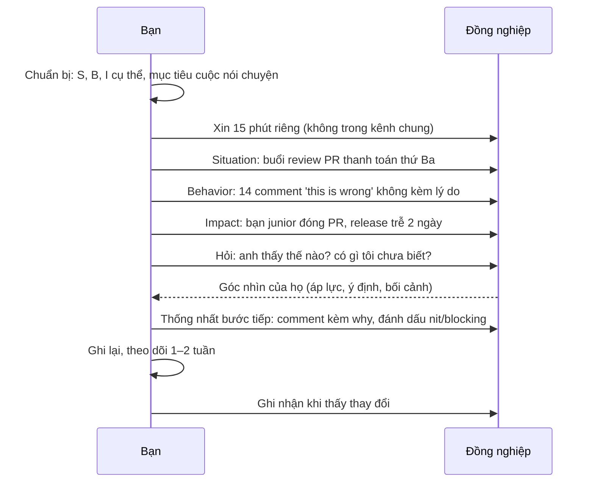
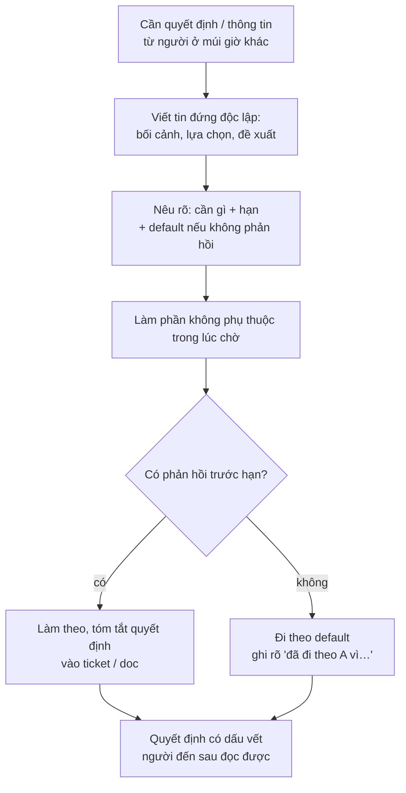

## Bối cảnh & vấn đề

Một kỹ sư ở Việt Nam làm việc với product owner ở một múi giờ cách 5 tiếng. Trong buổi sync cuối ngày, PO mô tả một thay đổi cho luồng hoàn tiền, hỏi "Does that make sense?", và kỹ sư trả lời "Yes". Hai ngày sau, demo cho thấy anh đã hiểu sai một nửa yêu cầu. Với PO, "yes" nghĩa là "tôi hiểu và đồng ý". Với kỹ sư, "yes" nghĩa là "tôi đang nghe" và anh định hỏi lại sau qua chat, nhưng rồi ngại làm phiền.

Câu chuyện này không phải lỗi kỹ thuật, cũng không phải lỗi của riêng ai. Nó là một **khác biệt giao tiếp** điển hình trong team phân tán, và đúng loại câu chuyện mà behavioral-043 hỏi: "Tell me about a cultural or communication difference that caused a problem, and how you handled it." Interviewer làm việc với team đa quốc gia biết chuyện này xảy ra hằng tuần; họ muốn biết bạn có **nhận ra** nó và có **thói quen** để phòng ngừa không.

Bài này gom bốn câu hỏi về giao tiếp giữa người với người: nhận feedback khó nghe (018), đưa feedback khó (019), khác biệt văn hoá và giao tiếp (043), và môi trường làm việc bạn cần (007). Điểm chung: interviewer đánh giá xem làm việc cùng bạn có **dễ không**, khi mọi thứ không suôn sẻ: bạn có nghe được lời phê bình, có nói được điều khó nói, và có viết đủ rõ để người ở múi giờ khác làm tiếp mà không cần hỏi lại.

## Khái niệm

### Feedback là dữ liệu

**Feedback** là thông tin về tác động của hành vi của bạn lên người khác hoặc lên công việc. Thái độ mà interviewer tìm ở behavioral-018 là coi feedback như **dữ liệu**, không phải tấn công: nó có thể đúng một phần, sai một phần, nhưng luôn cho biết một người đã trải nghiệm bạn như thế nào. Red flag hai chiều: "Can't recall any critical feedback" (hoặc bạn không nghe, hoặc không ai dám nói với bạn) và "Feedback was wrong so they ignored it".

Câu trả lời mạnh có trình tự: **phản ứng ban đầu** (nói thật, kể cả khi bạn đã phòng thủ: điều này đáng tin hơn "tôi cảm ơn ngay"), **hỏi thêm để hiểu** (ví dụ cụ thể, tác động), **kế hoạch thay đổi** cụ thể, và **bằng chứng** đã thay đổi (feedback lần sau, hành vi đo được).

**Interview angle:** follow-up "Have you ever received feedback you disagreed with?" có đáp án mạnh: bạn hỏi thêm, tìm phần đúng trong đó (thường là tác động có thật dù nguyên nhân khác), giải thích góc nhìn của bạn một lần, và điều chỉnh phần hợp lý.

### SBI: Situation, Behavior, Impact

**SBI** (Situation–Behavior–Impact, mô hình của Center for Creative Leadership) là khung đưa feedback cụ thể và không phán xét. **Situation**: khi nào, ở đâu ("trong buổi review PR thanh toán hôm thứ Ba"). **Behavior**: hành vi quan sát được, không phải tính cách ("anh viết 'this is wrong' ở 14 comment mà không giải thích"). **Impact**: tác động lên bạn, team, hoặc công việc ("bạn junior đóng PR và không mở lại trong hai ngày; release bị trễ").

Sự khác biệt giữa "anh review quá gắt" (phán xét tính cách) và SBI ở trên là người nghe có thể **làm gì đó** với SBI. Họ không thể đổi tính cách, nhưng họ có thể viết comment kèm lý do. Sau SBI, **hỏi và lắng nghe** ("anh thấy thế nào?") rồi **thống nhất bước tiếp theo**.

**Interview angle:** hint của 019 nêu đúng trình tự: chọn thời điểm và kênh riêng tư, nói theo SBI, lắng nghe, thống nhất bước tiếp theo.

### Radical Candor: quan tâm và thẳng thắn

Kim Scott mô tả feedback tốt bằng hai trục: **care personally** (quan tâm tới người đó) và **challenge directly** (nói thẳng điều cần nói). Có cả hai là **radical candor**. Thẳng mà không quan tâm là **obnoxious aggression** (gắt, làm tổn thương). Quan tâm mà không thẳng là **ruinous empathy** (né tránh để giữ hoà khí, cuối cùng hại người đó vì họ không biết để sửa). Không có cả hai là **manipulative insincerity**.

Ruinous empathy là bẫy phổ biến nhất với kỹ sư ở các văn hoá trọng hoà khí: bạn thấy đồng nghiệp làm điều gây hại cho team nhưng không nói, rồi phàn nàn với người khác. Câu chuyện mạnh cho 019 thường là câu chuyện bạn **vượt qua** sự ngại ngùng đó.

**Interview angle:** interviewer hỏi "Why did you decide to say something rather than let it go?". Câu trả lời tốt nói về tác động lên team và lên chính người kia.

### High-context và low-context

Trong một số văn hoá giao tiếp, ý nghĩa nằm chủ yếu trong **lời nói rõ ràng** (low-context: nói thẳng, "no" là no, ghi lại mọi thứ). Trong văn hoá khác, ý nghĩa nằm nhiều trong **ngữ cảnh** (high-context: im lặng, giọng điệu, những gì không nói). Erin Meyer trong *The Culture Map* phân tích các khác biệt này theo nhiều trục như giao tiếp, đưa feedback tiêu cực, ra quyết định, và cách bất đồng (verify cách xếp hạng cụ thể của từng quốc gia; đây là xu hướng, không phải quy luật cho từng cá nhân).

Hệ quả thực tế trong team phân tán: "yes" có thể không có nghĩa là đồng ý, im lặng trong họp không có nghĩa là không có ý kiến, và feedback trực tiếp từ đồng nghiệp ở văn hoá low-context có thể nghe gắt dù họ không có ý đó. Thói quen phòng ngừa: **xác nhận bằng văn bản** sau mỗi quyết định, **tóm tắt lại** bằng lời của mình ("để tôi nhắc lại xem tôi hiểu đúng chưa…"), hỏi **câu mở** thay vì câu có/không ("Bạn thấy rủi ro nào ở phương án này?" thay vì "OK không?").

**Interview angle:** follow-up của 043 là "How do you make sure silence in a meeting isn't mistaken for agreement?". Đáp án: hỏi từng người, cho thời gian góp ý bằng văn bản sau họp, ghi quyết định và hạn phản hồi.

### Viết async rõ ràng

**Asynchronous communication** là giao tiếp không cần cả hai bên online cùng lúc: tin nhắn, comment trên ticket, design doc, PR description. Trong team nhiều múi giờ, chất lượng giao tiếp async quyết định tốc độ: một câu hỏi mơ hồ gửi cuối ngày của bạn có thể mất 24 giờ để có câu trả lời, rồi thêm 24 giờ vì câu trả lời cũng mơ hồ.

Một tin nhắn async tốt **đứng độc lập**: đủ bối cảnh để người đọc không cần hỏi lại, nêu rõ **cần gì** (thông tin, quyết định, review), **hạn** khi nào, và **default** nếu không có phản hồi ("nếu tới 10 giờ sáng mai giờ bạn không có ý kiến, tôi đi theo phương án A"). Default là kỹ thuật mạnh nhất vì nó biến một câu hỏi chặn thành một câu hỏi không chặn.

**Interview angle:** nhắc một thói quen cụ thể ("tôi luôn viết cuối ngày một update ba dòng: đã xong, đang làm, cần gì") là bằng chứng mạnh cho kỹ năng làm việc phân tán.

### Môi trường làm việc bạn cần

behavioral-007 ("How do you like to work with a team, and what kind of environment helps you do your best work?") có vẻ là câu mềm, nhưng nó đo **sự phù hợp** và **sự trưởng thành**. Câu trả lời mạnh mô tả cách làm việc thật (ownership rõ, feedback thẳng thắn, viết rõ, PR nhỏ, review nhanh), kèm một ví dụ ngắn khi môi trường như vậy giúp bạn giao kết quả, và một câu về việc **bạn thích nghi** khi môi trường khác đi.

Reflection mà hint chờ: bạn là người **đóng góp** vào môi trường tốt, không chỉ đòi hỏi. "Tôi cần feedback thẳng thắn" mạnh hơn khi đi kèm "và tôi cũng là người bắt đầu thói quen đó trong team bằng cách xin feedback sau mỗi demo".

**Interview angle:** follow-up "Tell me about a time the team environment was not like that" kiểm tra bạn có chỉ làm tốt trong điều kiện lý tưởng không.

## Cơ chế hoạt động

Diagram dưới đây là một cuộc nói chuyện đưa feedback khó theo SBI, từ chuẩn bị tới theo dõi sau đó.



Ba điểm cần giải thích. Thứ nhất, bước **hỏi** sau Impact không phải hình thức: đôi khi người kia có bối cảnh bạn không biết (họ đang bị áp lực deadline, hoặc đã nói với junior trước đó). Cuộc nói chuyện là hai chiều, không phải bản án. Thứ hai, **bước tiếp theo phải cụ thể** và do cả hai thống nhất ("đánh dấu nit/blocking"), không phải "anh nhẹ nhàng hơn nhé". Thứ ba, bước cuối **ghi nhận khi thấy thay đổi** thường bị quên, nhưng nó đóng vòng phản hồi và giữ quan hệ.

Diagram thứ hai là vòng ra quyết định async trong team nhiều múi giờ, thể hiện vai trò của default:



Điểm mấu chốt là bước **default**: nó cho phép công việc tiếp tục mà không cần cả hai online cùng lúc, và tôn trọng quyền quyết định của người kia (họ có thể phản đối trước hạn). Default chỉ nên dùng cho quyết định **đảo ngược được**; với quyết định khó đảo ngược, chờ hoặc tìm người có thẩm quyền khác (xem bài [Ưu tiên](/tracks/behavioral/learn/prioritization-pressure)).

## Ví dụ thực tế

### Nhận feedback khó (behavioral-018): weak vs strong

```text
WEAK (minh hoạ)
"My manager said I should communicate more. I said okay, and now I
communicate more."
```

Bình luận: không có ví dụ, không có phản ứng thật, không có thay đổi cụ thể hay bằng chứng.

```text
STRONG (minh hoạ)
S: "In a mid-year review my lead told me that people on the US side felt they
   only found out about my blockers at the next sync — sometimes a day late."
A: "Honestly, my first reaction was defensive; I thought I was being
   considerate by not pinging people at night their time. I asked for an
   example, and he pointed to an API contract question I sat on for two days.
   That landed. I changed two things: I post a three-line end-of-day update in
   the team channel — done, doing, blocked — and when I'm blocked I post the
   question immediately with a default: 'if I don't hear back by your morning,
   I'll go with option A.'"
R: "In the next review the same PO mentioned the updates as something they
   relied on, and the defaults meant I was rarely blocked more than half a day."
Reflection: "What I learned is that 'not bothering people' was really me
   optimising for my comfort, not for their information."
```

### Đưa feedback khó (behavioral-019): strong (minh hoạ, rút gọn)

```text
"A senior teammate's reviews were blunt — 'wrong', 'no' — and a junior on our
team had stopped opening PRs to him. I asked him for fifteen minutes one-on-one
and used a specific example: in the payment PR on Tuesday, fourteen comments
said 'this is wrong' without a reason, and the junior closed the PR and was
two days late. Then I asked how he saw it. It turned out he was reviewing
twenty PRs a week and writing fast; he hadn't noticed the effect. We agreed he'd
prefix comments with 'nit:' or 'blocking:' and add one line of why on blocking
ones, and I offered to take some of his review load. A month later the junior
was sending him PRs again. For follow-up questions about culture: he's from a
very direct culture, so I kept it factual and short — no softening paragraphs."
```

### Khác biệt văn hoá (behavioral-043): khung

```text
KHÁC BIỆT: ______ (yes ≠ đồng ý, im lặng, mức thẳng thắn, kỳ vọng update, timezone)
VẤN ĐỀ NÓ GÂY RA (cụ thể, có số): ______ (rework bao nhiêu ngày, hiểu lầm gì)
TÔI NHẬN RA THẾ NÀO: ______
TÔI ĐIỀU CHỈNH GÌ: [ ] xác nhận bằng văn bản  [ ] tóm tắt lại  [ ] câu hỏi mở
                   [ ] update chủ động        [ ] default trong câu hỏi async
KẾT QUẢ: ______
THÓI QUEN GIỮ ĐẾN NAY: ______
```

### Mẫu tin nhắn async đứng độc lập

```text
[Refund flow] Need a decision on partial refunds by Thu 10:00 your time

Context: refunds currently return the full order amount. Ticket asks for
partial refunds per line item.
Question: when a discounted order is partially refunded, do we refund the
line's discounted price (A) or its list price minus a share of the order
discount (B)?
My proposal: A — simpler, matches what the invoice shows the customer.
If I don't hear back by Thu 10:00 your time, I'll build A behind a flag;
switching to B later is about a day of work.
Not blocked meanwhile: I'm doing the API and the DB changes, which are the
same for both.
```

Bình luận: tiêu đề có cần gì và hạn; bối cảnh đủ để đọc độc lập; hai lựa chọn rõ; đề xuất kèm lý do; default kèm chi phí đổi ý; nói rõ bạn không bị block. Người đọc có thể trả lời bằng một chữ "A" hoặc "B".

### Template feedback story (điền vào)

```text
NHẬN FEEDBACK
  Ai, về gì: ______   Phản ứng ban đầu (thật): ______
  Tôi hỏi thêm gì: ______   Kế hoạch thay đổi: ______
  Bằng chứng đã thay đổi: ______
ĐƯA FEEDBACK
  S: ______   B: ______   I: ______
  Kênh/thời điểm (vì sao riêng tư): ______   Họ nói gì: ______
  Bước tiếp đã thống nhất: ______   Kết quả sau ____ tuần: ______
```

## Trade-offs & lựa chọn thay thế

| Lựa chọn giao tiếp | Ưu điểm | Nhược điểm | Hợp khi |
|---|---|---|---|
| Feedback trực tiếp 1:1 | Riêng tư, hai chiều | Cần thời gian chung, khó với timezone | Feedback khó, nhạy cảm |
| Feedback bằng văn bản | Rõ, có dấu vết, qua timezone | Mất giọng điệu, dễ nghe gắt | Feedback nhỏ, cụ thể (review code) |
| Feedback công khai | Nhanh, cả team học | Mất thể diện, phòng thủ | Hầu như chỉ cho lời khen |
| Họp sync | Nhanh hội tụ, đọc được phản ứng | Tốn giờ chung, người ít nói bị lấn | Bất đồng phức tạp, cần cảm xúc |
| Async + default | Không chặn, tôn trọng timezone | Chậm nếu câu hỏi mơ hồ | Quyết định đảo ngược được |
| Design doc + comment | Mọi người góp ý theo nhịp riêng | Chậm, cần người chốt | Quyết định lớn, nhiều bên |

Nguyên tắc chung: **khen công khai, góp ý riêng tư**, và **chọn kênh theo độ nhạy cảm và độ phức tạp**. Feedback về code cụ thể đi qua review là bình thường; feedback về hành vi (cách review, cách giao tiếp) nên nói riêng, tốt nhất bằng giọng nói hoặc video vì văn bản mất giọng điệu. Với team nhiều múi giờ, mặc định là async có default, và dành giờ chung ít ỏi cho những thứ async làm không tốt: bất đồng có cảm xúc, brainstorm, và xây quan hệ.

## Edge cases & failure modes

- **Feedback bạn nhận là sai**: vẫn tìm phần tác động có thật ("tôi không đồng ý nguyên nhân, nhưng đúng là họ đã trải nghiệm như vậy"), giải thích góc nhìn một lần, điều chỉnh phần hợp lý.
- **Feedback từ người có chức danh thấp hơn** (junior góp ý cho bạn): là story rất mạnh cho 018, vì nó cho thấy bạn tạo môi trường an toàn để người khác nói.
- **Người nhận feedback phản ứng mạnh** (khóc, giận, phủ nhận): dừng lại, cho thời gian, hẹn nói tiếp; không ép thống nhất ngay.
- **Feedback về một người ở team khác, bạn không có quan hệ**: cân nhắc qua lead của họ hoặc của bạn, nhưng vẫn ưu tiên nói trực tiếp nếu có thể.
- **Timezone chỉ có 1–2 giờ chồng lấn**: bảo vệ khoảng đó cho những gì cần sync; mọi thứ khác async.
- **Khác biệt văn hoá bị dùng như lý do** ("họ là người X nên mới vậy"): tránh khái quát hoá trong câu trả lời; nói về hành vi cụ thể và cách bạn điều chỉnh.
- **Môi trường lý tưởng bạn mô tả trái với công ty đang phỏng vấn** (bạn thích remote hoàn toàn, họ yêu cầu lên văn phòng): trung thực; nó là thông tin cho cả hai bên.

## Pitfalls

- ❌ "Tôi không nhớ có feedback tiêu cực nào" → ✅ một feedback thật, phản ứng thật, thay đổi cụ thể và bằng chứng.
- ❌ Bỏ qua feedback vì nó sai → ✅ tìm phần tác động có thật, điều chỉnh phần hợp lý.
- ❌ Feedback về tính cách ("anh gắt quá") → ✅ SBI với hành vi quan sát được và tác động cụ thể.
- ❌ Góp ý trong kênh chung → ✅ riêng tư, tốt nhất bằng giọng nói cho feedback về hành vi.
- ❌ Né feedback để giữ hoà khí (ruinous empathy) → ✅ nói vì quan tâm tới người đó và team.
- ❌ Coi "yes" và im lặng là đồng ý → ✅ tóm tắt lại, hỏi câu mở, xác nhận bằng văn bản.
- ❌ Tin nhắn async mơ hồ, không hạn → ✅ đứng độc lập, cần gì, hạn, default.
- ❌ Mô tả môi trường lý tưởng như danh sách đòi hỏi → ✅ nói cả cách bạn góp phần tạo ra môi trường đó và thích nghi khi nó khác.

## Tóm tắt

- Feedback là **dữ liệu**; câu trả lời mạnh có phản ứng thật, hỏi thêm, thay đổi cụ thể, bằng chứng.
- Đưa feedback theo **SBI** (Situation, Behavior, Impact), riêng tư, rồi hỏi và thống nhất bước tiếp.
- **Radical candor**: quan tâm và thẳng thắn cùng lúc; tránh ruinous empathy.
- Team đa văn hoá: "yes" và im lặng không phải đồng ý; **tóm tắt lại, câu hỏi mở, xác nhận bằng văn bản**.
- Async tốt: tin nhắn **đứng độc lập**, nói rõ cần gì, hạn, và **default** nếu không có phản hồi.
- Môi trường làm việc: mô tả cách bạn làm việc thật, ví dụ, và cách bạn **đóng góp** và **thích nghi**.
- Khen công khai, góp ý riêng tư; chọn kênh theo độ nhạy cảm và độ phức tạp.
