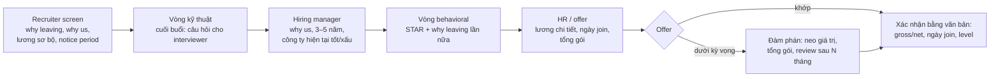
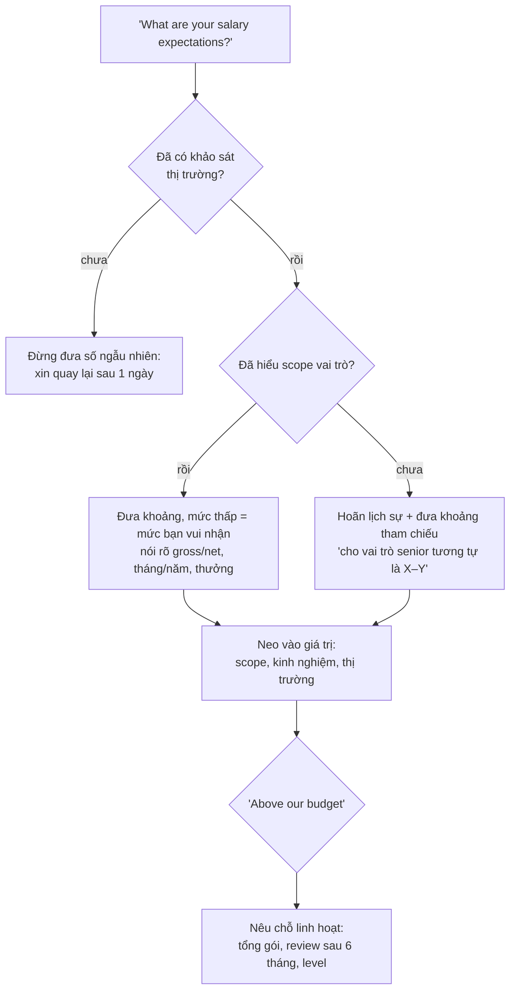

## Bối cảnh & vấn đề

Buổi phỏng vấn kỹ thuật đi rất tốt. Ở 10 phút cuối, hiring manager hỏi mấy câu "nhẹ": vì sao bạn muốn rời công ty hiện tại, vì sao chọn chúng tôi, mong muốn lương thế nào, khi nào join được, và bạn có câu hỏi gì không. Ứng viên trả lời: "Công ty cũ quy trình lộn xộn, sếp không ghi nhận", "Vì công ty lớn, văn hoá tốt", "Lương bao nhiêu cũng được, miễn hợp lý", "Tôi có thể nghỉ ngay tuần sau", và "Dạ không, em hỏi hết rồi."

Năm câu trả lời đó, mỗi câu trúng một red flag: phàn nàn về công ty cũ, câu trả lời chung chung áp dụng cho mọi công ty, không chuẩn bị về lương, sẵn sàng bỏ ngang việc (công ty mới sẽ lo bạn cũng làm vậy với họ), và không có câu hỏi nào. Một buổi kỹ thuật mạnh có thể bị kéo xuống ở phần cuối, vì những câu này đo thứ mà bài kỹ thuật không đo: **động lực**, **sự chín chắn**, **mức độ phù hợp lâu dài**, và **độ tin cậy**.

Bài này gom bảy câu hỏi về career, motivation và logistics: why leaving (002), why this company (003), 3–5 năm tới (040), công ty hiện tại tốt/xấu (047), lương (048), ngày join và thời gian rảnh (049), và câu hỏi cho interviewer (008). Chúng không cần STAR, nhưng cần **chuẩn bị trước** như mọi câu khác, vì câu trả lời ứng biến ở đây thường là câu trả lời thật nhất theo nghĩa xấu nhất.

## Khái niệm

### Hướng tới, không chạy khỏi

behavioral-002 ("Why are you looking to leave?") có một nguyên tắc: nói về điều bạn **hướng tới**, không phải điều bạn **chạy khỏi**. "Tôi muốn own một sản phẩm lâu dài và đi sâu vào phần hạ tầng" là hướng tới. "Công ty tôi làm outsourcing nên không được own gì" là chạy khỏi, dù hai câu mô tả cùng một sự thật. Interviewer nghe câu thứ hai và tự hỏi: lý do bạn rời họ sau này sẽ là gì?

Cấu trúc ba phần: **một câu trân trọng** điều bạn đã học ở vai trò hiện tại, **điều bạn tìm kiếm** tiếp theo (scope, loại sản phẩm, domain, cơ hội kỹ thuật cụ thể), và **liên kết** với vị trí đang ứng tuyển. Lý do thật có thể gồm lương; đó là bình thường, nhưng nếu đó là lý do duy nhất bạn nói thì là red flag ("Only mentions salary").

**Interview angle:** follow-up "What would your current company need to change for you to stay?" kiểm tra tính nhất quán. Câu trả lời nên khớp với điều bạn nói mình tìm kiếm.

### Why this company: cụ thể hay không có

behavioral-003 có một bài kiểm tra đơn giản: nếu câu trả lời của bạn đúng cho mọi công ty, nó chưa đạt. "Great culture, big company" là red flag chính của câu. Câu trả lời mạnh có ba lý do cụ thể: một về **sản phẩm hoặc vấn đề** họ giải quyết, một về **kỹ thuật hoặc cách làm** (quy mô, stack, kiến trúc, văn hoá kỹ thuật) khớp với kinh nghiệm của bạn, một về **phát triển** (bạn đóng góp gì và học gì).

Để có ba lý do cụ thể, phải nghiên cứu: trang sản phẩm, engineering blog, tech talk, JD (đọc kỹ phần "you'll work on"), tin gần đây (gọi vốn, ra thị trường mới), profile của người sẽ phỏng vấn. Follow-up "What do you know about our tech stack or engineering challenges?" đòi đúng phần nghiên cứu này.

**Interview angle:** nhắc một chi tiết công khai cụ thể (một bài blog, một con số họ công bố) là bằng chứng rõ nhất rằng bạn quan tâm thật.

### 3–5 năm tới: có hướng, linh hoạt, gắn với vai trò

behavioral-040 ("Where do you see yourself in three to five years?") đo hai điều: bạn có **động lực phát triển** không, và bạn có **ở lại đủ lâu** không. Câu trả lời mạnh có một **hướng** (đi sâu kỹ thuật theo track staff/principal, hoặc kết hợp tech lead), một **domain quan tâm** (distributed systems, platform, quy mô e-commerce), và **liên hệ** với vai trò này (những gì bạn sẽ học và đóng góp ở đây giúp bạn tới đó), kèm **bước cụ thể** bạn đang làm.

Tránh hai cực: quá mơ hồ ("tôi chưa nghĩ tới") và quá cứng hoặc lệch vai trò ("tôi muốn làm CTO trong 3 năm", "tôi muốn chuyển sang data science"). Follow-up "What would make you leave a job within a year?" có câu trả lời trung thực và hợp lý: vai trò khác hẳn mô tả, không có cơ hội học, vấn đề đạo đức.

**Interview angle:** câu "trong 3 năm tôi muốn là người mà team tìm tới khi có quyết định kiến trúc khó, và vai trò này cho tôi điều đó qua X" vừa có hướng vừa gắn với vị trí.

### Công ty hiện tại: chín chắn và kín đáo

behavioral-047 ("What is good about your current company, what is not, and what would you improve?") là bài kiểm tra **sự chín chắn và lòng trung thành**, không phải lời mời xả. Cấu trúc: **hai điều tốt cụ thể** (con người, domain, quy trình review, cơ hội học), **một điều chưa tốt mang tính hệ thống**, nói trung tính ("quy trình release còn thủ công, mất khoảng hai ngày"), và **điều bạn đã làm hoặc đề xuất** để cải thiện, biến điểm yếu thành câu chuyện ownership.

Ranh giới: không nêu tên người, không kể chuyện nội bộ nhạy cảm, không tiết lộ thông tin khách hàng. Cũng đừng nói "không có gì xấu" vì nghe như học thuộc.

**Interview angle:** follow-up "Did you try to change that yourself?" là lý do bạn nên chọn điểm yếu mà bạn **đã** cố cải thiện.

### Lương: chuẩn bị số, đưa khoảng, neo vào giá trị

behavioral-048 là câu nhiều kỹ sư ngại nhất. Nguyên tắc: **chuẩn bị số trước** buổi phỏng vấn bằng khảo sát thị trường cho level, stack và địa điểm (báo cáo lương của các trang tuyển dụng, levels.fyi cho công ty có dữ liệu, hỏi người quen). Đưa **khoảng** mà mức thấp nhất vẫn là mức bạn vui lòng nhận; nói rõ **gross hay net, tháng hay năm, có tính thưởng/tháng 13 không**. Ở Việt Nam, lương thường được đàm phán theo net hằng tháng trong khi nhiều công ty nước ngoài dùng gross hằng năm; nhầm hai cái có thể lệch 20–30% (verify mức lệch theo thuế và bảo hiểm hiện hành).

**Neo vào giá trị** (scope vai trò, kinh nghiệm liên quan, khảo sát thị trường), không vào nhu cầu cá nhân ("tôi vừa mua nhà"). Nếu bị hỏi quá sớm, có thể hoãn lịch sự: "Tôi muốn hiểu rõ scope vai trò trước; mức tôi đang nhắm cho vai trò senior tương tự là khoảng X–Y." Tổng gói (bảo hiểm, remote, ngân sách học tập, equity, số ngày nghỉ) cũng là thứ để đàm phán.

**Interview angle:** follow-up "That's above our budget for this level. What flexibility do you have?" cần câu trả lời chuẩn bị sẵn: bạn linh hoạt ở đâu (tổng gói, thời điểm review lương, level) và không linh hoạt ở đâu.

### Ngày join và thời gian rảnh: độ tin cậy

behavioral-049 gộp hai câu logistics, cả hai đo **độ tin cậy**. Ngày join: nói đúng **notice period** theo hợp đồng và kế hoạch bàn giao. Theo Bộ luật Lao động Việt Nam 2019, thời hạn báo trước khi người lao động đơn phương chấm dứt thường là 45 ngày với hợp đồng không xác định thời hạn và 30 ngày với hợp đồng xác định thời hạn 12–36 tháng (verify với hợp đồng của bạn và quy định hiện hành). Hứa join ngay khi còn việc dở dang làm công ty mới lo bạn sẽ đối xử với họ như vậy.

Thời gian rảnh: 1–2 sở thích **thật**, ngắn gọn; nếu có, một cái liên quan tới học hỏi (side project, đọc sách kỹ thuật, thể thao đồng đội). Red flag là bịa sở thích nghe ấn tượng mà không nói được gì khi bị hỏi thêm.

**Interview angle:** follow-up "Is there anything that could delay that start date, such as other offers?" cần câu trả lời trung thực: nếu bạn đang có quy trình khác, nói có (không cần nói chi tiết), và nói timeline quyết định của bạn.

### Câu hỏi cho interviewer

behavioral-008 ("What questions do you have for us?") là câu cuối gần như mọi buổi, và "không có câu hỏi" là red flag. Câu hỏi tốt có hai chức năng: **bạn đánh giá họ** (bạn cũng đang chọn công ty), và **tín hiệu senior** (câu hỏi cho thấy bạn nghĩ về những gì quan trọng). Chuẩn bị 3–5 câu và chọn theo người phỏng vấn.

Với **engineer**: "Một thay đổi đi từ ticket tới production như thế nào?", "Incident gần nhất là gì và team học được gì?", "Tech debt lớn nhất hiện tại là gì?". Với **manager**: "Thành công ở vị trí này sau 6 tháng trông như thế nào?", "Senior ở đây khác mid ở điểm nào?". Về **văn hoá**: "Khi có bất đồng kỹ thuật, quyết định được đưa ra thế nào?", "Team dùng AI tool với policy gì?". Tránh hỏi thứ có trên website, và để lương/phúc lợi cho vòng HR.

**Interview angle:** follow-up "Based on what you've heard, what concerns do you have about this role?" là cơ hội: nêu một lo ngại thật một cách xây dựng ("Tôi nghe on-call rotation chỉ có 3 người; team có kế hoạch mở rộng không?").

## Cơ chế hoạt động

Diagram dưới đây là các câu hỏi career/HR xuất hiện ở đâu trong một quy trình phỏng vấn điển hình. Nó cho thấy vì sao cùng một câu (why leaving) có thể bị hỏi ba lần bởi ba người, và vì sao câu trả lời phải nhất quán.



Có hai điểm quan trọng. Thứ nhất, **lương xuất hiện hai lần**: sơ bộ ở recruiter screen và chi tiết ở vòng offer. Con số bạn nói ở recruiter screen trở thành mỏ neo cho cả quy trình, nên phải chuẩn bị nó trước cuộc gọi đầu tiên, không phải trước vòng offer. Thứ hai, các interviewer **so ghi chú** trong debrief; nếu bạn nói với recruiter là "muốn đi sâu kỹ thuật" và với manager là "muốn làm quản lý", sự không nhất quán sẽ bị để ý.

Diagram thứ hai là cách xử lý câu hỏi lương khi bị hỏi:



Nhánh "xin quay lại sau một ngày" nghe như né, nhưng nó tốt hơn nhiều so với một con số đưa ra ngẫu nhiên rồi bị mắc kẹt cả quy trình. Nhánh cuối cho thấy "linh hoạt" không có nghĩa là hạ khoảng ngay; nó có nghĩa là mở các biến khác ra bàn.

## Ví dụ thực tế

### Why leaving (behavioral-002): weak vs strong

```text
WEAK (minh hoạ)
"Honestly, the management at my company is not great, and I don't get
recognised for my work. Also the salary is low."
```

```text
STRONG (minh hoạ)
"I've learned a lot where I am — working with product teams in several
countries taught me how to own features end-to-end and communicate across
time zones. What I'm looking for next is to own one product for the long term,
rather than moving between client projects, and to take on more of the
infrastructure side — deployment, observability. This role is on a platform
team that owns its services in production, which is exactly that."
```

Bình luận: một câu trân trọng, điều hướng tới (own sản phẩm lâu dài, hạ tầng), liên kết với vai trò. Không có câu phàn nàn nào, nhưng vẫn trung thực về lý do.

### Why this company (behavioral-003): strong (minh hoạ, khung điền)

```text
"Three reasons. The product: [vấn đề họ giải quyết, một chi tiết cụ thể bạn
đọc được]. The engineering: your blog post on [chủ đề] describes [vấn đề kỹ
thuật], which is close to the multi-tenant data isolation I've worked on. And
growth: the role owns services in production, which is the part of my
experience I most want to deepen."
```

### Công ty hiện tại (behavioral-047): strong (minh hoạ, rút gọn)

```text
"Good: the people — I've had a lead who gives very direct feedback — and the
code review culture; every PR gets a real review within a day. Not so good:
releases were manual and took about two days of coordination. I wrote a
release checklist and scripted the two most error-prone steps, which brought it
to about half a day; fully automating it needed infra access we didn't have,
and that's part of why I'm interested in a team that owns its pipeline."
```

### Câu hỏi cho interviewer (behavioral-008): bộ chuẩn bị

```text
VỚI ENGINEER
  1. Walk me through how a change goes from a ticket to production here.
  2. What was the last incident, and what changed afterwards?
  3. What's the piece of tech debt the team talks about most?
VỚI HIRING MANAGER
  4. What would success in this role look like after six months?
  5. What separates a senior from a mid-level engineer on this team?
VĂN HOÁ
  6. When two engineers disagree on a design, how is it decided?
  7. What's the team's policy on AI coding tools and reviewing their output?
CÂU CHỐT (nếu còn thời gian)
  8. Is there anything in my background that gives you pause for this role?
```

Câu 8 là câu mạnh nhưng rủi ro: nó mời interviewer nói lo ngại, cho bạn cơ hội trả lời ngay. Chỉ dùng khi bạn đủ bình tĩnh để nghe câu trả lời mà không phòng thủ.

### Template chuẩn bị career/HR (điền vào)

```text
WHY LEAVING: trân trọng ______ | tìm kiếm ______ | liên kết vai trò ______
WHY US: sản phẩm ______ | kỹ thuật ______ (nguồn: ______) | phát triển ______
3–5 NĂM: hướng ______ | domain ______ | bước đang làm ______ | gắn vai trò ______
CÔNG TY HIỆN TẠI: tốt 1 ______ tốt 2 ______ | chưa tốt ______ | tôi đã làm ______
LƯƠNG: khoảng ____–____ (gross/net, tháng/năm, thưởng ____) | nguồn khảo sát ______
       linh hoạt ở: ______   không linh hoạt ở: ______
NGÀY JOIN: notice ____ ngày theo hợp đồng | kế hoạch bàn giao ______
THỜI GIAN RẢNH: ______ (thật, nói được 2 phút)
CÂU HỎI CHO HỌ: 1 ______ 2 ______ 3 ______
```

## Trade-offs & lựa chọn thay thế

| Câu hỏi | Cách A | Cách B | Khi nào chọn |
|---|---|---|---|
| Lương bị hỏi sớm | Đưa khoảng ngay | Hoãn + khoảng tham chiếu | A nếu đã khảo sát và hiểu scope; B nếu scope chưa rõ |
| Lương | Một con số | Khoảng | Gần như luôn khoảng, mức thấp là mức bạn vui nhận |
| Why leaving | Nói lý do thật tiêu cực | Đóng khung hướng tới | B, nhưng vẫn phải đúng sự thật |
| 3–5 năm | Track kỹ thuật | Track lead/quản lý | Theo mong muốn thật, gắn với lộ trình công ty có |
| Ngày join | Join sớm, bàn giao ngắn | Đúng notice, bàn giao đủ | B; A chỉ khi công ty cũ đồng ý |
| Câu hỏi cho interviewer | Hỏi về phúc lợi | Hỏi về công việc, team, quyết định | B ở vòng kỹ thuật và manager; A để cho HR |
| Có offer khác | Giấu | Nói có, không cần chi tiết | B, kèm timeline quyết định |

Về câu 3–5 năm, cả hai track đều hợp lệ. Điều quan trọng là **khớp với thực tế công ty**: nếu công ty có track IC tới staff/principal, nói về track kỹ thuật là tự nhiên; nếu họ đang tuyển senior để sau này lead team, nhắc mong muốn kết hợp kỹ thuật và dẫn dắt người khác là hợp lý. Đọc JD và hỏi recruiter về lộ trình trước buổi phỏng vấn.

## Edge cases & failure modes

- **Bạn bị cho nghỉ (layoff) hoặc rời vì lý do tiêu cực thật**: nói ngắn, trung tính, không bào chữa ("công ty tái cơ cấu, team tôi bị cắt"), rồi chuyển sang điều bạn tìm kiếm. Layoff không phải điều đáng xấu hổ.
- **Bạn làm ở công ty hiện tại chưa lâu** (dưới một năm): interviewer lo về độ gắn bó. Giải thích lý do cụ thể (vai trò khác mô tả) và nói điều bạn tìm kiếm để ở lâu.
- **Công ty đang phỏng vấn có tin xấu gần đây** (layoff, sự cố lớn): có thể hỏi một cách tôn trọng ("tôi đọc về đợt tái cấu trúc; nó ảnh hưởng tới team này thế nào?"). Đó là câu hỏi hợp lý của người cân nhắc nghiêm túc.
- **Recruiter đòi lương hiện tại**: ở một số nơi việc hỏi này bị hạn chế (verify theo địa phương). Có thể trả lời bằng kỳ vọng thay vì lương hiện tại.
- **Offer thấp hơn khoảng bạn đưa**: hỏi lý do (level, budget), đàm phán tổng gói, hoặc từ chối lịch sự. Đừng chấp nhận ngay rồi bất mãn sau.
- **Bạn chưa biết mình muốn gì trong 5 năm**: nói một hướng bạn đang thử nghiệm và vì sao vai trò này giúp bạn tìm ra; trung thực hơn bịa kế hoạch.
- **Hết giờ, interviewer hỏi "any questions?" với 2 phút còn lại**: hỏi một câu quan trọng nhất, và xin gửi thêm qua recruiter.

## Pitfalls

- ❌ Phàn nàn về sếp, công ty cũ → ✅ trân trọng một điều, nói điều bạn hướng tới.
- ❌ "Great culture, big company" → ✅ ba lý do cụ thể có nguồn nghiên cứu, vì câu trả lời chung là chưa đạt.
- ❌ "Chưa nghĩ tới" 3–5 năm → ✅ một hướng, một domain, bước đang làm, gắn với vai trò.
- ❌ Nói "không có gì xấu" về công ty hiện tại → ✅ một điểm hệ thống, nói trung tính, kèm việc bạn đã làm.
- ❌ Đưa lương ngẫu nhiên hoặc một con số → ✅ khoảng có khảo sát, nói rõ gross/net, neo vào giá trị.
- ❌ Hứa nghỉ ngay không bàn giao → ✅ đúng notice period và kế hoạch bàn giao.
- ❌ Bịa sở thích → ✅ 1–2 sở thích thật, ngắn.
- ❌ "Không có câu hỏi" → ✅ 3–5 câu chuẩn bị theo người phỏng vấn, về công việc, team và cách ra quyết định.

## Tóm tắt

- Why leaving: **hướng tới**, không chạy khỏi; một câu trân trọng, điều tìm kiếm, liên kết vai trò.
- Why us: **ba lý do cụ thể** (sản phẩm, kỹ thuật, phát triển) có nguồn nghiên cứu.
- 3–5 năm: có hướng, linh hoạt, gắn với vai trò, có bước cụ thể đang làm.
- Công ty hiện tại: hai điều tốt, một điều chưa tốt mang tính hệ thống, điều bạn đã làm; không nêu tên, không lộ thông tin.
- Lương: **chuẩn bị trước buổi đầu tiên**, đưa khoảng, gross/net rõ ràng, neo vào giá trị, biết chỗ linh hoạt.
- Ngày join theo notice period và kế hoạch bàn giao; sở thích thật; nói thật về offer khác.
- Luôn có **3–5 câu hỏi** cho interviewer; câu hỏi tốt là tín hiệu senior và giúp bạn đánh giá họ.
- Các interviewer so ghi chú: câu trả lời career phải **nhất quán** qua các vòng.
