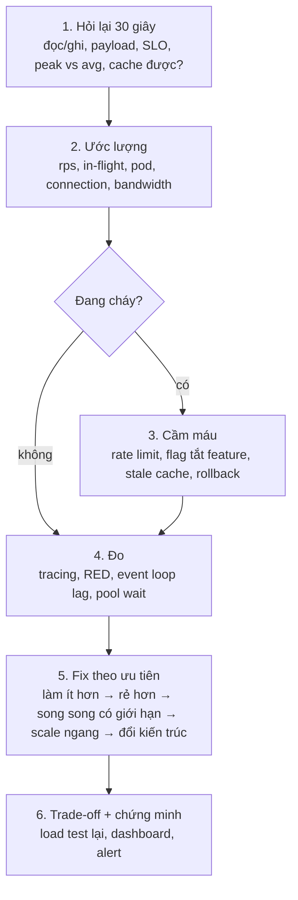
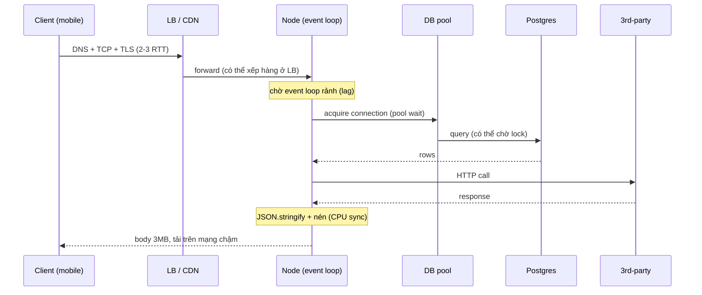
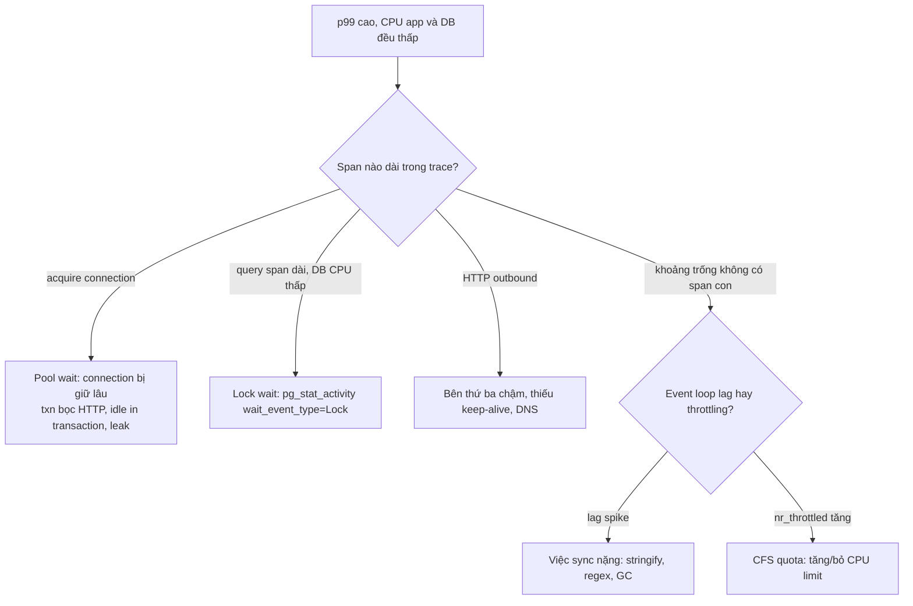

## Bối cảnh & vấn đề

Câu mở màn quen thuộc của vòng phỏng vấn senior: *"Chúng tôi có một API phải chịu 10,000 request mỗi giây. Bạn làm thế nào?"*. Ứng viên mid-level thường trả lời ngay: "Dùng Kubernetes, autoscale, thêm Redis, thêm load balancer". Câu trả lời đó không sai về công nghệ, nhưng **sai về thứ tự**: chưa biết 10k request đó làm gì, chưa biết thành công nghĩa là gì (p99 bao nhiêu?), chưa biết tài nguyên nào cạn trước. 10k rps đọc một trang sản phẩm cache được và 10k rps ghi đơn hàng có transaction là hai bài toán khác hẳn: bài đầu giải bằng vài pod Node và CDN, bài sau là bài toán database (batch, queue, sharding).

Biến thể thứ hai: *"API bị báo là chậm"*. Dashboard trung bình 80 ms, user vẫn kêu. Log server nói 40 ms, user trên mobile thấy 3 giây. Middleware đo thời gian báo 0–1 ms. CPU app 40%, CPU DB 20%, slow query log trống, nhưng p99 là 2 giây. Mỗi câu là một cái bẫy đo lường: **con số bạn đang nhìn không đo cái bạn nghĩ**.

Bài này là khung suy nghĩ dùng lại cho mọi scenario trong track: **hỏi lại → ước lượng → đo → khoanh vùng → fix theo ưu tiên → trade-off và chứng minh**. Các bài sau (spike, database, event loop, memory, logging) đều là trường hợp cụ thể của khung này. Lý thuyết nền nằm ở các track khác và được link thay vì dạy lại: [percentile và histogram](/tracks/observability/learn/metrics-percentiles), [load testing](/tracks/observability/learn/load-testing), [capacity planning](/tracks/observability/learn/capacity-planning), [back-of-envelope](/tracks/system-design/learn/back-of-envelope), [connection pooling](/tracks/sql-postgres/learn/connection-pooling), [CPU limit trong container](/tracks/os-concurrency/learn/container-resources).

Các con số "đo thật" trong bài chạy trên laptop Apple Silicon, Node 24.21, autocannon 8, Docker Desktop. Tuyệt đối thì phụ thuộc máy; **tỉ lệ và hình dạng** mới là thứ đáng nhớ.

## Khái niệm

### Throughput, latency và concurrency

**Throughput** là số request hệ thống hoàn thành mỗi giây (rps). **Latency** là thời gian một request ở trong hệ thống, từ lúc tới đến lúc trả lời xong. **Concurrency** (hay in-flight) là số request đang được xử lý cùng lúc. Ba con số này không độc lập: biết hai thì suy ra cái thứ ba. Người mới hay nói "server chịu được 1,000 user", câu này vô nghĩa nếu không nói 1,000 user đó gửi bao nhiêu request mỗi giây và mỗi request mất bao lâu.

Ví dụ: 2,000 rps với latency 50 ms nghĩa là ở bất kỳ thời điểm nào cũng có khoảng 100 request đang dở dang. Nếu mỗi request giữ một DB connection trong toàn bộ 50 ms, bạn cần 100 connection; nếu chỉ giữ 5 ms (thời gian query), bạn cần 10.

### Little's Law

**Little's Law**: `L = λ × W`, trong đó `L` là số item trung bình trong hệ thống, `λ` là arrival rate, `W` là thời gian trung bình mỗi item ở trong hệ thống. Định luật này đúng cho **mọi** hệ thống ổn định (arrival rate bằng departure rate), không cần giả định phân phối. Nó áp dụng cho từng tài nguyên riêng: request đang chờ trong pod, connection đang bận trong pool, message đang xử lý trong worker.

Sức mạnh của nó trong phỏng vấn là biến câu hỏi mơ hồ thành phép nhân. "Pool bao nhiêu là đủ?" → `rps_db × thời_gian_giữ_connection`. "Latency tăng gấp đôi thì sao?" → in-flight tăng gấp đôi, memory giữ request tăng gấp đôi, pool cần gấp đôi; nếu pool không tăng, request phải **chờ** pool, latency tăng thêm, in-flight tăng tiếp: một vòng xoáy.

```text
rps = 2000, W_request = 50 ms  → in-flight requests = 2000 × 0.05  = 100
W_db_hold = 5 ms               → busy connections   = 2000 × 0.005 = 10
pods = 5, pool = 4/pod         → 20 connections (2× headroom) ✓
```

**Interview angle:** nói ra công thức và áp vào **thời gian giữ tài nguyên**, không phải thời gian request. Đây là lý do "không gọi HTTP bên thứ ba khi đang giữ connection".

### Percentile và tail latency

**Percentile p99** là giá trị mà 99% request nhanh hơn. **Average** che tail: 99 request 50 ms cộng 1 request 3 s cho average ~80 ms, nhưng p99 là 3 s, và nếu user tải trang 100 lần một ngày thì họ gặp con số 3 s mỗi ngày. Percentile phải tính từ **histogram** gộp lại; không được lấy trung bình p99 của các pod (`(p99_A + p99_B) / 2` không phải p99 của hệ thống). Chi tiết ở [metrics & percentiles](/tracks/observability/learn/metrics-percentiles).

### Fan-out và tail amplification

Khi một trang hay một request gọi **N** dependency song song và phải chờ **cái chậm nhất**, xác suất dính ít nhất một call chậm là `1 - (1 - p)^N`. Với p = 1% (tức p99 của từng service):

```text
N = 1   → 1%
N = 40  → 33%
N = 100 → 63%
```

Nghĩa là với request fan-out, **p99 của từng service là p50 của trải nghiệm user**. Fix gồm: giảm N (BFF/aggregate endpoint), giảm tail từng service (timeout, cache), **hedged request** cho đọc idempotent (gửi bản thứ hai tới replica khác nếu bản đầu chưa về sau p95, lấy cái về trước; nguy hiểm vì tăng tải và không dùng cho write), render từng phần thay vì chờ tất cả.

### Chạy vs chờ

Thời gian của một request gồm hai loại: **chạy** (CPU đang làm việc cho nó) và **chờ** (đợi event loop rảnh, đợi connection từ pool, đợi row lock, đợi bên thứ ba, đợi network). CPU thấp ở cả app lẫn DB mà p99 cao gần như luôn là **chờ**. "Slow query log trống" chỉ nói query *chạy* nhanh; nó không nói request *chờ* bao lâu trước khi query được chạy.

### RED và USE

**RED** (Rate, Errors, Duration) cho từng endpoint/service: biết *cái gì* đang tệ. **USE** (Utilization, Saturation, Errors) cho từng tài nguyên: CPU, event loop, pool, memory, disk, network. Saturation là phần hay bị quên: pool 100% utilization chưa chắc xấu, nhưng `waitingCount > 0` kéo dài (saturation) là có hàng đợi. Xem [RED/USE và runtime metrics](/tracks/observability/learn/red-use-runtime).

### Closed model vs open model trong load test

**Closed model** (autocannon `-c 100`, k6 VU mặc định): có N "user", mỗi user gửi request, **chờ response**, rồi mới gửi tiếp. Khi server chậm, tải tự giảm. **Open model** (k6 `constant-arrival-rate`): request tới theo lịch cố định bất kể server chậm hay không, giống traffic thật từ hàng nghìn user độc lập. Closed model bị **coordinated omission**: trong lúc server đứng, load generator cũng ngừng gửi, nên các request "lẽ ra" bị chờ không bao giờ được đo; p99 báo cáo đẹp hơn thực tế nhiều lần (đo thật ở phần ví dụ).

### CPU throttling (CFS quota)

Trong Kubernetes, `resources.limits.cpu: 1` được thực thi bằng **CFS quota**: mỗi chu kỳ 100 ms, container được dùng tối đa 100 ms CPU **tính tổng mọi thread**. Node không chỉ có một thread: V8 GC chạy song song, libuv threadpool (zlib, crypto, `fs`, `dns.lookup`) mặc định 4 thread. Một burst dùng 4 thread trong 25 ms là hết quota, cả process bị **dừng hẳn** tới chu kỳ sau. Trung bình CPU vẫn chỉ 45–50%, nhưng latency nhảy từng bậc vài chục đến ~100 ms. Xác nhận bằng `container_cpu_cfs_throttled_periods_total` hoặc `nr_throttled` trong `cpu.stat`. Chi tiết ở [container resources](/tracks/os-concurrency/learn/container-resources).

| Khái niệm | Câu nhớ nhanh |
|---|---|
| Little's Law | in-flight = rps × thời gian giữ |
| p99 vs average | Average che tail, không trung bình hoá percentile |
| Fan-out | `1 - 0.99^N`, N = 100 → 63% |
| Chạy vs chờ | CPU thấp + p99 cao = đang chờ |
| Closed vs open model | Closed tự giảm tải, giấu latency |
| CFS throttling | Quota tính mọi thread, dừng cả process |

## Cơ chế hoạt động

### Khung trả lời 6 bước



**Bước 1, hỏi lại.** Với "10k rps": peak hay trung bình, kéo dài bao lâu; đọc hay ghi; payload bao lớn; SLO (p99 < 200 ms?); request làm gì (đọc cache, query DB, gọi bên thứ ba, tính toán CPU); data có cache được không, stale bao lâu chấp nhận được; multi-tenant không. Mỗi câu trả lời đổi bottleneck: đọc cache thì event loop là giới hạn, query DB thì pool và DB, gọi bên thứ ba thì quota của họ.

**Bước 2, ước lượng.** Lấy ví dụ card 003: 10k rps, mỗi request 1 Redis GET, 20% miss chạy query 5 ms, response 5 KB.
- CPU/request của Node cho loại endpoint này cỡ 0.1–1 ms tuỳ máy và việc kèm theo (parse HTTP, stringify, log, middleware). Đo thật bên dưới: ~0.1 ms trên laptop cho handler tối giản, nên 1 vCPU production với middleware thật thường là 1,000–3,000 rps.
- Chạy mỗi pod ≤ 60–70% CPU: với 1,000 rps/core → 10k / 650 ≈ 15–16 pod 1-vCPU; với 2,000 rps/core → ~8. Thêm N+1 cho rolling deploy và mất một AZ.
- DB: 20% × 10k = 2,000 query/s × 5 ms = **10 connection bận**. Nhưng 15 pod × pool 10 = 150 > `max_connections` mặc định 100 → giảm pool/pod về 3–4 hoặc dùng PgBouncer.
- Redis: 10k GET/s là nhẹ cho một node. Bandwidth: 10k × 5 KB = 50 MB/s ≈ 400 Mbit/s, ổn.
- Câu chốt: **con số phải đo bằng load test 1 pod rồi nhân lên**, không dựa vào benchmark framework trên mạng ("Fastify 70k rps" là hello world).

**Bước 4, đo.** Chia đường đi của request thành đoạn và hỏi đoạn nào dài.

### Một request đi qua đâu



Mỗi mũi tên là một chỗ latency có thể trốn:
- **Phía client/network** (card 025): server đo từ lúc nhận request tới lúc ghi xong vào socket buffer. Nó không thấy DNS, TCP + TLS handshake (mobile RTT 100–300 ms × 2–3), thời gian chờ ở LB, và **thời gian tải body**: 3 MB trên mạng 10 Mbit/s là 24 Mbit / 10 = 2.4 s, dù server chỉ mất 40 ms. Đo bằng RUM (Resource Timing: `responseStart` vs `responseEnd`), LB access log (target processing time vs total), so TTFB với content download.
- **Event loop lag**: request đã tới socket nhưng callback chưa được chạy vì loop đang bận việc sync của request khác. Đo bằng `monitorEventLoopDelay()`.
- **Pool wait**: thời gian `pool.connect()` chờ, không phải thời gian query. Phải có span riêng hoặc metric `waitingCount`.
- **Lock wait** trong DB: `pg_stat_activity.wait_event_type = 'Lock'`.
- **Bên thứ ba**: span HTTP outbound, timeout.

### Khoanh vùng khi CPU thấp mà p99 cao



Query hữu ích nhất cho nhánh DB (card 009):

```sql
SELECT pid, state, wait_event_type, wait_event, now() - xact_start AS tx_age, left(query, 80)
FROM pg_stat_activity
WHERE state <> 'idle'
ORDER BY tx_age DESC NULLS LAST;
```

`state = 'idle in transaction'` với `tx_age` vài giây là connection bị giữ trong transaction mà không làm gì: dấu hiệu transaction bọc HTTP call hoặc leak (bài [Database dưới tải](/tracks/scenario-scale/learn/database-under-load)). Khoảng trống 900 ms trong trace "không có span con" thường là event loop bị block, GC pause, CPU throttling, hoặc một thư viện không được instrument.

**Interview angle:** nói "slow query log chỉ đo thời gian chạy" và kể ra 4 loại chờ (pool, lock, bên thứ ba, event loop/throttling) cùng cách đo từng loại.

## Ví dụ thực tế

### Little's Law đo được

Server trả lời sau đúng 50 ms (`setTimeout`), autocannon closed model với số connection khác nhau:

```ts
import http from 'node:http';
import autocannon from 'autocannon';
let inFlight = 0, maxInFlight = 0;
const srv = http.createServer((req, res) => {
  inFlight++; maxInFlight = Math.max(maxInFlight, inFlight);
  setTimeout(() => { inFlight--; res.end('ok'); }, 50); // W = 50 ms
}).listen(3001);
for (const c of [10, 100, 400]) {
  maxInFlight = 0;
  const r = await autocannon({ url: 'http://localhost:3001', connections: c, duration: 5 });
  console.log(`connections=${c} rps=${Math.round(r.requests.average)} p50=${r.latency.p50}ms p99=${r.latency.p99}ms maxInFlight=${maxInFlight} L/W=${c / 0.05}`);
}
```

```text
connections=10  rps=190  p50=52ms p99=67ms  maxInFlight=10  L/W=200
connections=100  rps=1830  p50=53ms p99=85ms  maxInFlight=100  L/W=2000
connections=400  rps=7049  p50=55ms p99=94ms  maxInFlight=400  L/W=8000
```

`λ = L / W` khớp gần đúng (190 ≈ 200, 1830 ≈ 2000); phần hụt là overhead thật trên latency 50 ms. Đọc theo chiều ngược: closed model với 10 connection **không thể** tạo quá ~200 rps với service 50 ms, dù service chịu được 7,000. Đây là câu trả lời đầu tiên cho card 005 "test hay service là bottleneck": số connection của load generator phải ≥ `rps mục tiêu × latency`, tức 10k × 0.05 = 500.

### Coordinated omission: closed vs open model

Server trả lời 5 ms, nhưng mỗi vài giây event loop bị block 1 s (giả lập GC pause hay một `JSON.stringify` to). Chạy 12 giây với hai kiểu tải:

```text
closed  : sent=11801 p50=6ms p99=14ms max=1021ms
open    : sent=12000 p50=10ms p99=1029ms max=1340ms
```

Cùng một server, closed model báo **p99 = 14 ms**, open model (1,000 req/s theo lịch, latency tính từ thời điểm *lẽ ra* gửi) báo **p99 = 1,029 ms**. Closed model chỉ có 10 request bị kẹt trong mỗi lần stall (10 connection đều đang chờ), còn traffic thật có hàng trăm user gửi trong 1 giây đó. Kết luận cho card 005: dùng k6 `constant-arrival-rate` hoặc wrk2, chạy load generator **gần service** (cùng VPC), nhiều instance, keep-alive bật, và luôn đối chiếu với metric **phía server** (rps ở LB, event loop lag, pool wait, DB CPU). Nếu service CPU 30% và lag thấp mà rps không lên, bottleneck là máy test (CPU laptop, Wi-Fi, VPN).

```ts
// k6 open model: giữ 10k req/s bất kể server chậm (minh hoạ, cấu hình k6)
export const options = { scenarios: { load: {
  executor: 'constant-arrival-rate', rate: 10000, timeUnit: '1s',
  duration: '5m', preAllocatedVUs: 2000, maxVUs: 5000 } } };
```

### Đo capacity một process

Endpoint: chờ 1 ms (giả lập Redis), `JSON.stringify` một object 5.6 KB. autocannon 100 connection, chạy ở process khác, server tự báo CPU:

```text
bytes 5655
rps=7189 p50=11ms p99=60ms server_cpu_ms_per_req=0.096
```

~0.1 ms CPU/request trên một core laptop cho handler gần như rỗng. Production thêm auth, validation, logging, tracing, ORM, và vCPU cloud thường chậm hơn core laptop: đó là lý do ước lượng 1,000–3,000 rps/vCPU, và lý do **phải đo endpoint thật**. Card 003 follow-up: "1 pod đứng ở 600 rps mà CPU chỉ 35%": CPU thấp mà không lên thêm nghĩa là đang **chờ** (pool nhỏ, bên thứ ba, CPU throttling, hoặc load generator thiếu connection).

### Middleware đo sai (card 027)

```ts
app.use((req, res, next) => {            // SAI: chỉ đo phần đồng bộ trước await đầu tiên
  const start = Date.now(); next();
  console.log(`broken  ${req.path} ${Date.now() - start}ms`);
});
app.use((req, res, next) => {            // ĐÚNG: đo tới khi response kết thúc
  const t0 = process.hrtime.bigint();
  res.on('finish', () => console.log(`finish  ${req.route?.path} ${Number(process.hrtime.bigint() - t0) / 1e6}ms`));
  res.on('close', () => { if (!res.writableFinished) console.log('client aborted'); });
  next();
});
app.get('/orders/:id', async (req, res) => {
  await new Promise((r) => setTimeout(r, 800));
  res.json({ id: req.params.id });
});
```

```text
broken  /orders/123 1ms
finish  /orders/:id 887.213375ms status=200
```

`next()` trả về ngay khi handler async gặp `await` đầu tiên. Fix: `res.on('finish')` (và `close` cho client ngắt sớm), đồng hồ monotonic (`process.hrtime.bigint()`/`performance.now()`), label bằng **route template** `/orders/:id` thay vì `req.path` để tránh cardinality bùng nổ. Tốt hơn: dùng OpenTelemetry HTTP instrumentation. Follow-up "middleware báo 800 ms mà trace handler 50 ms": 750 ms nằm ở middleware chạy trước (body parsing, auth gọi IdP), event loop lag trước khi callback được chạy, hoặc ghi body lớn ra client chậm (finish chỉ bắn khi đã flush xong).

### Thời gian từng đoạn cho client thấy: Server-Timing

```http
HTTP/1.1 200 OK
Server-Timing: db;dur=412, cache;desc="miss";dur=2, render;dur=38, ext-pricing;dur=910
```

Header này hiện trong DevTools tab Timing, cho frontend và QA thấy ngay đoạn nào chậm mà không cần quyền vào APM. Không đưa thông tin nhạy cảm (tên bảng nội bộ, query) vào header public.

### CPU throttling đo được

Container 8 core, process Node làm 5 ms JS mỗi 20 ms (~25% một core), mỗi giây bắn 4 `pbkdf2` async (~67 ms mỗi cái, chạy trên libuv threadpool). Trung bình ~0.5 core. Đo độ trễ của timer 20 ms trong 15 giây:

```text
docker (không limit):  lag p50=0.4ms p99=10.1ms max=96.3ms | nr_throttled 0
docker --cpus=1:       lag p50=0.5ms p99=64.9ms max=76.9ms | nr_throttled 67
```

Trung bình dùng khoảng **một nửa** limit, nhưng p99 lag tăng **6 lần** và gần như mỗi giây có một lần throttled: 4 thread threadpool cùng main thread tiêu hết 100 ms quota trong ~20 ms đầu chu kỳ, phần còn lại cả process đứng. Đây chính là card 026. Fix: tăng hoặc bỏ CPU limit (giữ `requests` để scheduler xếp chỗ), giảm burst (GC do allocation lớn, nén trong app), `UV_THREADPOOL_SIZE` hợp với CPU thật. Cách loại trừ nguyên nhân tail khác: GC pause (`--trace-gc`), noisy neighbour, pod mới start chưa warm (JIT, connection).

## Trade-offs & lựa chọn thay thế

| Công cụ đo | Thấy được | Không thấy | Khi nào dùng |
|---|---|---|---|
| Average latency | Xu hướng thô | Tail, user bị ảnh hưởng | Gần như không bao giờ làm SLO |
| Histogram p50/p95/p99 theo route | Tail theo endpoint | Đoạn nào chậm | RED dashboard, SLO |
| Distributed tracing (OTel) | Span dài nhất, fan-out, gap | Event loop lag (chỉ thấy gap) | Câu "chậm ở đâu" |
| `Server-Timing` / log timing từng bước | Breakdown cho một request | Tổng thể | Chưa có tracing, debug nhanh |
| RUM (Resource/Navigation Timing) | Trải nghiệm thật: DNS, TLS, download | Bên trong server | Server nhanh mà user chậm |
| `monitorEventLoopDelay`, ELU | Event loop bị block | Nguyên nhân cụ thể | Node service bất kỳ |
| `--cpu-prof` / flame graph | Hàm nào tốn CPU | Thời gian chờ | CPU cao |
| `pg_stat_activity`, `pg_stat_statements` | Lock wait, query tốn tổng | Pool wait phía app | DB nghi ngờ |
| Load test closed model | Max throughput thô | Latency thật khi quá tải | Smoke, so sánh A/B |
| Load test open model | Latency đúng ở rps mục tiêu | Cần generator mạnh hơn | Capacity, SLO |

**Chọn thế nào.** Bắt đầu từ RED theo route để biết endpoint và percentile nào xấu, rồi trace để biết đoạn nào. Khi trace có gap không giải thích được, nhìn event loop lag và throttling. Khi server nhanh mà user chậm, chuyển sang RUM và payload. Load test: closed model cho câu "pod chịu tối đa bao nhiêu", open model cho câu "ở 10k rps p99 là bao nhiêu".

**Card 058: "1k rps hôm nay, 10k quý sau, cái gì vỡ trước?"** Không đoán: load test tăng dần 2×, 3×, rồi 10× trên staging giống production, xem tài nguyên nào bão hoà trước. Thứ tự hay gặp: DB (connection, query thiếu index lộ ra ở 10×, lock nóng) → cache stampede/hot key → quota bên thứ ba → egress và chi phí log. App stateless thường là tầng dễ scale nhất. Kế hoạch: sửa theo ROI (cache, bỏ N+1, index, PgBouncer, read replica), thêm cơ chế an toàn (rate limit, load shedding, circuit breaker, autoscale có min replica), một capacity model đơn giản (rps → pod, connection, cost), và bắt đầu sớm những thay đổi kiến trúc (queue, sharding) vì chúng mất nhiều tháng. Nếu load test nói DB đứng ở 4,000 rps: xếp phương án theo chi phí và thời gian: cache và bỏ query thừa (ngày), read replica (tuần), vertical scale DB (giờ, nhưng có trần), tách read model/CQRS hoặc shard (tháng).

**Fix theo ưu tiên** luôn theo cùng thứ tự: làm ít việc hơn (cache, projection, pagination) → làm việc rẻ hơn (index, batch, bỏ N+1) → song song có giới hạn → scale ngang → đổi kiến trúc. Scale ngang đứng thứ tư vì nó đẩy tải xuống tầng dưới: thêm pod khi DB 95% CPU chỉ làm DB chết nhanh hơn.

## Edge cases & failure modes

- **Load generator là bottleneck**: laptop, Wi-Fi, VPN, một process autocannon/k6 đã 100% CPU. Dấu hiệu: server CPU thấp, lag thấp, rps không lên khi tăng connection.
- **Load test một URL cache được** rồi báo đó là capacity: cache hit 100%, production thì không. Dùng tập dữ liệu và phân phối key giống thật.
- **Staging nhỏ hơn production**: 2 pod + DB nhỏ vs 20 pod. Ngoại suy tuyến tính chỉ đúng cho tầng stateless; DB, Redis, quota bên thứ ba không nhân tuyến tính. Ngoại suy theo **tài nguyên bão hoà đầu tiên**, và xác nhận bằng một lần test ở quy mô production trước sự kiện lớn.
- **Trung bình hoá percentile** giữa pod hay giữa phút: con số không có nghĩa. Gộp histogram.
- **Label `req.path`** trong metric: mỗi `/orders/123` thành một series, Prometheus phình và dashboard chậm.
- **Coordinated omission** trong cả APM: nếu chỉ đo request đã được xử lý, request bị LB/kernel từ chối hoặc client timeout không bao giờ vào histogram. Đối chiếu error rate và LB metric.
- **Throttling ẩn**: CPU trung bình 45%, p99 tăng bậc ~100 ms. Luôn xem `throttled_periods` khi có CPU limit.
- **Pod mới start**: JIT chưa warm, connection pool trống, cache local rỗng; p99 của pod đó cao trong 1–2 phút. Đừng kết luận từ pod vừa deploy.

## Pitfalls

- ❌ Đề xuất "Kubernetes + Redis" trước khi hỏi request làm gì → ✅ 30 giây hỏi: đọc/ghi, payload, SLO, peak, cache được không. Thiếu SLO thì "chịu được 10k rps" không có định nghĩa thành công.
- ❌ Nói average latency → ✅ p95/p99 theo endpoint, từ histogram.
- ❌ Set pool "càng lớn càng tốt" → ✅ pool = rps_db × thời gian giữ × headroom, và tổng mọi pod < `max_connections`.
- ❌ Trích benchmark framework làm capacity → ✅ load test 1 pod với endpoint thật, rồi nhân.
- ❌ Tin con số rps client in ra → ✅ đối chiếu metric server và LB; open model cho latency.
- ❌ Kết luận "DB ổn vì CPU thấp" → ✅ kiểm tra pool wait, lock wait, idle in transaction.
- ❌ Đổ lỗi điện thoại user → ✅ so TTFB với content download, kiểm tra payload và nén.
- ❌ Middleware tự viết với `Date.now()` quanh `next()` → ✅ `res.on('finish')`, monotonic clock, route template, hoặc OTel.
- ❌ Viết lại code hay thêm cache trước khi đo → ✅ đo, sửa đúng đoạn, đo lại sau fix.

## Câu chuyện hành vi: chứng minh bottleneck

Câu behavioral (card 059) chấm **phương pháp** hơn kết quả. Khung STAR với các con số cần có:
- **Situation**: triệu chứng có số: "p99 checkout 1.8 s ở 600 rps, SLO 400 ms".
- **Task**: mục tiêu đo được và deadline.
- **Action**: cách đo (trace thấy span acquire connection chiếm 70%, `pg_stat_activity` thấy `idle in transaction`), một **giả thuyết sai đã loại bằng dữ liệu** ("tưởng thiếu index, `EXPLAIN ANALYZE` cho thấy query 3 ms"), fix cụ thể (đưa HTTP call ra ngoài transaction).
- **Result**: số trước/sau, chi phí, và load test chứng minh.
- **Reflection**: alert/test thêm vào để lỗi không quay lại. Điền bằng câu chuyện thật của bạn.

## Tóm tắt

- Mọi scenario scale đi theo khung: **hỏi lại → ước lượng → cầm máu nếu cháy → đo → fix theo ưu tiên → trade-off và chứng minh**.
- **Little's Law**: in-flight = rps × thời gian giữ tài nguyên. Dùng nó cho pool, pod, worker và số connection của load generator.
- **p99, không phải average**; với fan-out N call, `1 - 0.99^N` request dính tail (N = 100 → 63%).
- CPU thấp + p99 cao = **chờ**: pool wait, lock wait, bên thứ ba, event loop lag, CFS throttling (đo được: p99 lag ×6 ở 50% limit).
- Server 40 ms, user 3 s: handshake, LB queue, và **tải body** (3 MB trên 10 Mbit/s = 2.4 s). Đo bằng RUM và LB log.
- Closed model che latency khi quá tải (đo được: p99 14 ms vs 1,029 ms); dùng open model và metric phía server.
- Ước lượng pod bằng load test 1 pod thật, chạy ≤ 65% CPU, nhớ `pods × pool ≤ max_connections`.
- Middleware timing đo tới `finish`, label bằng route template.
