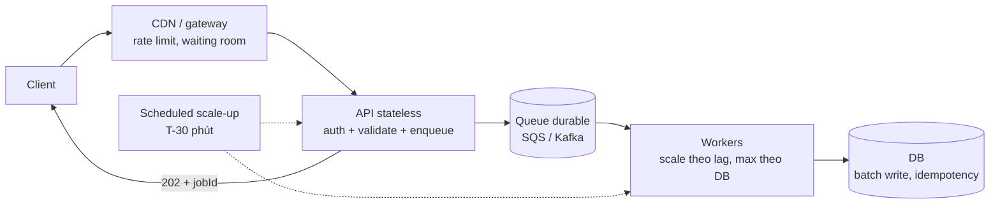
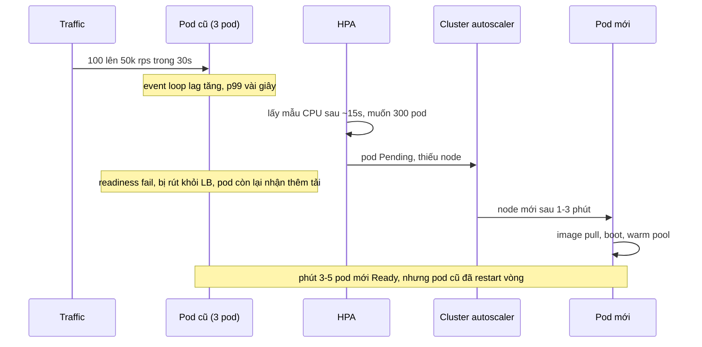
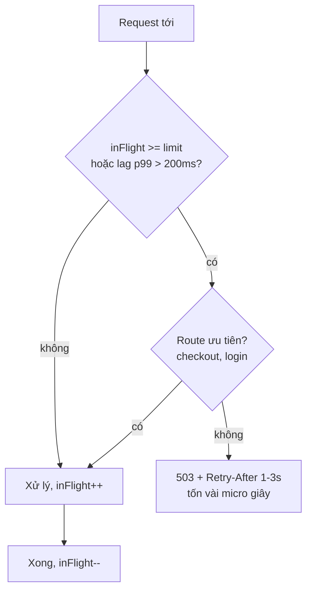

## Bối cảnh & vấn đề

Một hệ thống bán hàng chạy êm 23 giờ mỗi ngày với vài request mỗi phút. Đúng 20:00 có flash sale, traffic nhảy từ 100 lên 50,000 rps trong khoảng 30 giây. HPA cấu hình theo CPU 70%. Năm phút sau, mọi thứ sập: pod cũ quá tải nên event loop lag 3 giây, readiness probe fail, pod bị rút khỏi LB, các pod còn lại nhận thêm tải và fail theo. Pod mới chưa kịp lên vì cluster còn đang xin thêm node. Client thấy timeout, bấm lại, app mobile tự retry 3 lần, gateway retry 3 lần, API retry 3 lần: service thanh toán vốn chỉ chậm từ 50 ms lên 2 s giờ nhận gấp 64 lần tải và chết hẳn.

Không bước nào trong chuỗi đó là "bug" theo nghĩa thông thường. Mỗi cơ chế (autoscale, health check, retry) đều được thêm vào với ý tốt. Vấn đề là chúng **không được thiết kế cho quá tải**, và quá tải là chuyện *khi nào* chứ không phải *nếu*. Bài này dạy cách suy nghĩ về peak: tách nhận khỏi xử lý, làm toán backlog trước khi nói "queue sẽ hấp thụ", scale theo tín hiệu đúng và đúng lúc, từ chối có chủ đích khi vượt capacity, và không tự nhân tải bằng retry.

Nền tảng chi tiết ở các track khác: [timeout & retry](/tracks/distributed-systems/learn/timeouts-retries), [circuit breaker, bulkhead, shedding](/tracks/distributed-systems/learn/circuit-breaker-bulkhead-shedding), [resources & autoscaling](/tracks/devops-cicd/learn/resources-autoscaling), [probes](/tracks/devops-cicd/learn/probes-pod-lifecycle), [consumer lag](/tracks/messaging-kafka/learn/consumer-groups-offsets-lag), [outbox](/tracks/messaging-kafka/learn/outbox-cdc-sagas), [stampede protection](/tracks/caching/learn/stampede-protection), [HTTP/CDN caching](/tracks/caching/learn/http-cdn-caching). Góc nhìn reliability của retry storm có ở [scenario reliability](/tracks/scenario-reliability/learn/retry-storms-overload).

## Khái niệm

### Tách nhận khỏi xử lý: 202 Accepted + queue

**`202 Accepted`** (RFC 9110) nghĩa là "đã nhận, chưa xử lý xong". API chỉ làm phần rẻ (auth, validate, ghi vào queue durable, vài ms) rồi trả 202 kèm **job id** và cách theo dõi: `Location: /jobs/{id}` để poll, webhook, hoặc push qua WebSocket/SSE. Worker kéo việc từ queue với tốc độ mà tầng dưới chịu được. Nhờ vậy API chịu được burst gấp nhiều lần capacity xử lý.

Điều kiện bắt buộc: client gửi **idempotency key** để retry không tạo job trùng; queue phải **durable** (SQS, Kafka, bảng Postgres), không phải array trong RAM. Không hợp cho thao tác user cần kết quả ngay (đăng nhập, kiểm tra tồn kho lúc thanh toán). Nếu queue down: trả `503` + `Retry-After` (không trả 202 cho thứ chưa được lưu); order không mất vì client chưa nhận lời hứa và sẽ retry với cùng key.

```http
POST /orders HTTP/1.1
Idempotency-Key: 7f3c...

HTTP/1.1 202 Accepted
Location: /orders/jobs/8812
Retry-After: 2
```

**Interview angle:** 202 là một **lời hứa**; chỉ trả khi dữ liệu đã nằm ở nơi sống sót qua crash.

### Sync vs async split

Một handler `POST /orders` làm 6 việc tuần tự (validate, ghi order, gửi email, push, sync CRM, audit log) có p99 bằng tổng tail của cả 6. Chỉ giữ **sync** những gì client cần để biết kết quả: validate, giữ tồn kho, ghi order trong transaction ngắn, trả `201`. Phần còn lại publish thành event. Vấn đề: "ghi DB rồi `await producer.send()`" không đủ, vì process có thể crash giữa hai bước (order có, event mất) hoặc send thành công mà transaction rollback (event ma). **Transactional outbox** ghi order và một row `outbox` trong **cùng transaction**; một relay đọc outbox và publish sau, at-least-once, nên consumer phải idempotent. Audit log bắt buộc theo compliance thì ghi cùng transaction hoặc qua outbox, không fire-and-forget.

### Backlog và toán drain

Queue không tạo thêm capacity; nó **đổi "sập" thành "chậm"**. Khi inflow > capacity, backlog tăng với tốc độ `inflow − capacity`. Sau peak, backlog được drain với tốc độ `capacity − inflow_sau_peak`. Metric quan trọng là **age of oldest message** (nó chính là độ trễ user cảm nhận), không chỉ depth.

### Autoscaling: phản ứng, theo lịch, theo tín hiệu dẫn trước

**Reactive autoscaling** (HPA) đọc metric định kỳ (mặc định khoảng 15 s), tính số replica mong muốn, tạo pod. Pod mới có thể cần **node mới** (cluster autoscaler: 1–3 phút trở lên), image pull, app boot, readiness, warm connection/cache: tổng cộng 2–5 phút (verify theo môi trường). **Scheduled scaling** tăng sẵn trước giờ peak đã biết. **Scale theo tín hiệu dẫn trước** (rps, queue depth/lag) phản ứng sớm hơn CPU, đặc biệt với worker I/O-bound có CPU thấp dù đang tụt lại. KEDA cung cấp scaler cho Kafka lag và SQS `ApproximateNumberOfMessagesVisible`.

Giới hạn: với Kafka, số consumer có ích ≤ số **partition**; pod thừa ngồi không. Và scale consumer là **tăng tải lên DB/downstream**, nên `maxReplicas` phải đặt theo capacity tầng dưới chứ không theo lag.

### Rate limiting (429) vs load shedding (503)

**`429 Too Many Requests`** (RFC 6585): **client này** vượt quota của nó (per user, API key, tenant); server vẫn khoẻ. **`503 Service Unavailable`** (RFC 9110): **server** hết capacity hoặc bảo trì, không lỗi của client cụ thể nào; load shedding dùng 503. Cả hai nên có `Retry-After`. Client: exponential backoff + jitter, tôn trọng `Retry-After`, không retry request không idempotent nếu thiếu idempotency key. Alert tách riêng: 429 thường là bình thường, 503 là sự cố. Gotcha: LB/CDN có thể đổi 503 của bạn thành trang lỗi hoặc tự retry.

**Load shedding** là chủ động từ chối một phần request để phần còn lại thành công đúng hạn. Mục tiêu là **goodput** (request thành công trong deadline), không phải throughput. Không shed thì hàng đợi tăng vô hạn, *mọi* request cùng chậm rồi timeout: server bận cả ngày làm việc cho những client đã bỏ đi.

### Retry storm

**Retry storm**: dependency chậm → caller timeout → retry → dependency nhận thêm tải → chậm hơn. Với retry ở nhiều tầng, tải nhân theo cấp số nhân: 3 tầng, mỗi tầng 3 retry = tối đa `4 × 4 × 4 = 64` call ở tầng cuối cho một request của user. Phòng: retry ở **một tầng** (gần client, có idempotency), backoff + **jitter**, **retry budget** (retry ≤ ~10% request), circuit breaker, deadline propagation (timeout tầng ngoài ≥ tổng tầng trong), và server bị gọi tự shed bằng 503 nhanh.

| Khái niệm | Câu nhớ nhanh |
|---|---|
| 202 + queue | Nhận nhanh, xử lý đều, idempotency key, queue durable |
| Outbox | Order + event cùng transaction |
| Drain | backlog = (in − cap) × T, drain = backlog / cap |
| Autoscale | Lịch cho peak đã biết, lag cho worker, CPU là trễ |
| 429 vs 503 | Lỗi của client này vs server hết capacity |
| Shedding | Giữ goodput, từ chối sớm và rẻ |
| Retry storm | `(1+r)^tầng`, retry một tầng + budget + jitter |

## Cơ chế hoạt động

### Peak ×1000: API nhận nhanh, worker xử lý đều



Đây là câu trả lời cho card 012 (23 giờ yên, 1 giờ ×1000). Từng tầng:
1. **Hỏi lại**: peak có giờ cố định không; việc nào cần kết quả sync; SLO ở peak có được nới không.
2. **Phần đọc** đi qua CDN/cache (`Cache-Control: public, max-age=30, stale-while-revalidate=30` nếu không phụ thuộc user).
3. **Phần ghi** qua API stateless → queue → worker. Worker autoscale theo **lag/oldest age**, `maxReplicas` theo capacity DB.
4. **Scheduled scaling** 15–30 phút trước peak cho API, worker, và cả DB/Redis nếu cần; pre-warm cache; overprovision node (pause pod) để pod mới không phải chờ node. Reactive HPA chỉ bù sai số dự báo.
5. **Phanh**: rate limit theo user, load shedding khi vượt, waiting room cho flash sale.
Cost: trả tiền peak 1–2 giờ thay vì 24 giờ.

### Timeline 5 phút đầu của flash sale (card 013)



Trong 2–5 phút đầu, pod cũ gánh gấp hàng trăm lần tải. Nếu liveness probe kiểm tra DB hay latency, pod quá tải bị **kill** (không chỉ rút khỏi LB), restart mất thêm thời gian boot: cascading failure. Fix: scheduled scale-up trước giờ sale, `minReplicas` cao trong khung giờ đó, overprovisioning, scale theo rps/queue thay vì CPU, **liveness chỉ kiểm tra process còn sống** (không phụ thuộc DB), và load shedding ở gateway để pod cũ trả 503 nhanh thay vì chết.

### Admission control trong process



Shed **càng sớm càng rẻ**: CDN/gateway (rate limit, waiting room) → LB → app (admission control theo in-flight hoặc event loop lag) → trước khi lấy DB connection. Ưu tiên: giữ checkout/đăng nhập, bỏ recommendation, search suggestion, analytics, bot; tenant có SLA cao được giữ; request đã chờ quá deadline thì bỏ luôn vì client đã timeout. `Retry-After` có **jitter** để khi hết shed, client không quay lại cùng lúc. Đo tỉ lệ shed như một SLI.

```ts
import { monitorEventLoopDelay } from 'node:perf_hooks';
const h = monitorEventLoopDelay({ resolution: 20 }); h.enable();
let inFlight = 0;
app.use((req, res, next) => {
  const lagMs = h.percentile(99) / 1e6;
  if ((lagMs > 200 || inFlight > 500) && !req.path.startsWith('/checkout')) {
    res.set('Retry-After', String(1 + Math.floor(Math.random() * 3)));
    return res.status(503).json({ error: 'overloaded' });
  }
  inFlight++; res.on('close', () => inFlight--); next();
});
setInterval(() => h.reset(), 5000).unref();
```

## Ví dụ thực tế

### Load shedding đo được: goodput 28/s vs 222/s

Server có capacity khoảng 250 rps (mỗi request 5 ms chờ I/O + 4 ms CPU sync). Load generator open model bắn **400 req/s trong 20 giây** qua 200 keep-alive connection (giống LB giữ connection), latency tính từ thời điểm lẽ ra gửi, deadline 1 s. Hai cấu hình: không shed, và shed khi `inFlight >= 20`.

```ts
const SHED = process.env.SHED === '1';
let inFlight = 0;
http.createServer((req, res) => {
  if (SHED && inFlight >= 20) {
    res.writeHead(503, { 'Retry-After': String(1 + Math.floor(Math.random() * 3)) });
    return res.end('overloaded');
  }
  inFlight++;
  setTimeout(() => {
    const t = performance.now(); while (performance.now() - t < 4); // 4 ms CPU
    inFlight--; res.end('ok');
  }, 5);
}).listen(3005);
```

```text
SHED=0  offered=400/s  goodput(ok<=1s)=28/s   ok-but-late=7445  503=0     p99(ok)=988ms
SHED=1  offered=400/s  goodput(ok<=1s)=222/s  ok-but-late=0     503=3552  p99(ok)=177ms
```

Không shed: server vẫn làm việc hết công suất, nhưng hàng đợi dồn lên nên **7,445 response về sau deadline** (client đã bỏ đi, công sức vứt bỏ) và goodput chỉ còn **28/s**. Có shed: 3,552 request bị từ chối ngay với 503, đổi lại **222/s** thành công đúng hạn (gần capacity) với p99 177 ms. Đây là lập luận định lượng cho card 015: không shed không có nghĩa là "phục vụ mọi người", mà là "phục vụ không ai đúng hạn".

### Retry storm đo được: 64×

Chuỗi `client → gateway → api → service` thật bằng 3 HTTP server Node, service luôn trả 503, mỗi tầng retry tối đa 3 lần. 100 request của user:

```ts
async function callWithRetry(url: string, retries: number) {
  for (let attempt = 0; attempt <= retries; attempt++) {
    const r = await fetch(url); await r.arrayBuffer();
    if (r.ok) return 200;
  }
  return 503;
}
```

```text
client 3 + gateway 3 + api 3 retries         service hits= 6400  amplification=64x
gateway 3 + api 3 (client none)              service hits= 1600  amplification=16x
retry only at one layer (gateway 3)          service hits=  400  amplification=4x
no retries                                   service hits=  100  amplification=1x
```

Đúng `(1+3)^3 = 64`. Trong production, service "chỉ chậm" từ 50 ms lên 2 s đủ làm mọi tầng timeout, và đúng lúc nó yếu nhất thì nhận gấp 64 lần tải (card 022). Fix theo ưu tiên: retry ở một tầng (4×), thêm retry budget để tổng retry ≤ 10% (≈1.1×), jitter để không đồng bộ, circuit breaker mở khi tỉ lệ lỗi vượt ngưỡng để fail fast và trả fallback, và không retry ngay khi nhận 503 có `Retry-After`. Idempotency key được kiểm tra ở **service sở hữu side effect** (unique constraint trên key), nên retry từ bất kỳ tầng nào cũng an toàn.

### Toán drain backlog (card 018)

```text
inflow  = 100k/min, capacity = 20k/min, duration = 60 min
backlog = (100k - 20k) × 60       = 4.8M messages ở cuối peak
drain   = 4.8M / 20k              = 240 min sau peak (nếu inflow về 0)
SLO 10 phút ⇒ capacity ≥ 100k/min (≈5× worker) VÀ downstream chịu 100k/min
```

Order cuối peak chờ khoảng 4 giờ, trong khi business muốn 10 phút. Có ba đòn bẩy: tăng capacity worker **và** tầng dưới (DB, payment) lên ~5×; giảm việc mỗi message (batch write, tách phần bắt buộc như giữ tồn kho khỏi phần để sau như email, analytics); hoặc thương lượng SLO (xác nhận nhận order ngay, xử lý trong 1 giờ). Theo dõi **age of oldest message** và alert khi vượt SLO; kiểm tra retention (SQS mặc định 4 ngày, tối đa 14 ngày; Kafka theo `retention.ms`, verify cấu hình của bạn). Autoscale theo **oldest age** gần với SLO hơn depth, vì depth 100k có thể là 10 giây hay 2 giờ tuỳ throughput; dùng depth khi throughput mỗi pod ổn định, công thức: `replicas = lag / (throughput_mỗi_pod × thời_gian_drain_mong_muốn)`.

### Endpoint đọc nhiều: 500 lên 8,000 rps, DB 100% (card 028)

**15 phút đầu: cầm máu, không tối ưu code.**
- Rate limit endpoint theo IP/API key, giảm page size tối đa, tắt filter/sort nặng bằng feature flag, trả **stale cache** thay vì lỗi.
- Xác định nguồn: top IP/user-agent/API key trong access log. Traffic thật (campaign) hay bot/crawler hay **bug client** (retry loop, polling mỗi 100 ms)?
- Cache hit ratio có tụt không? Hit từ 95% xuống 20% ngay sau deploy thường do: đổi format cache key (prefix version mới), đổi serializer, TTL bị set 0, Redis restart/flush, hoặc thêm một tham số vào key (locale, userId) làm key bùng nổ. Hậu quả là **stampede**: mọi miss cùng đổ xuống DB.
- Nói rõ: scale app pod **không giúp** khi DB là bottleneck.

**Sau đó**: cache-aside + stale-while-revalidate + singleflight (một request rebuild mỗi key), CDN cho response public, keyset pagination thay `OFFSET`, index đúng cho `WHERE + ORDER BY`, read replica. Postmortem: alert trên cache hit ratio và DB CPU, rate limit mặc định cho mọi endpoint public.

### Read API 10k rps, peak 30k, stale 60 s (card 010)

Cache từ ngoài vào: **CDN** (`s-maxage=30, stale-while-revalidate=30`) hấp thụ phần lớn traffic nếu response không theo user; Redis cache-aside cho miss; in-process LRU nhỏ cho key rất nóng. Origin: pod stateless, response **pre-serialized** (lưu Buffer đã nén theo version), CPU ≤ 65%, `minReplicas` đủ cho peak đã biết. DB chỉ nhận miss: read replica, PgBouncer, singleflight. Thứ vỡ trước khi traffic tăng: stampede khi key nóng hết hạn → DB connection → Redis hot key/bandwidth → egress cost. Load test ở 1.5× peak và có shedding khi vượt. Follow-up "giá theo user": tách phần chung (CDN cache) khỏi phần riêng (giá, gọi API nhỏ riêng, `private, no-store`), hoặc cache key theo **nhóm giá** (tier) chứ không theo user.

## Trade-offs & lựa chọn thay thế

| Lựa chọn | Được | Mất | Khi nào |
|---|---|---|---|
| Provision cho peak 24/7 | Đơn giản, không scale lag | Trả tiền 23 giờ không dùng | Peak không đoán được, downtime rất đắt |
| Container: scheduled + reactive | Rẻ nhất cho peak có giờ | Phải dự báo, vài phút lag cho phần vượt | Flash sale, giờ cao điểm cố định |
| Serverless (Lambda) | Scale nhanh theo request, 0 đồng khi idle | Concurrency limit theo account/region (thường mặc định 1,000, verify, xin tăng được), cold start, mỗi invocation một DB connection | Peak gai, tải thấp phần lớn thời gian |
| Queue + 202 | Hấp thụ spike, worker chạy đều | Không có kết quả ngay, cần idempotency, UX poll/webhook | Việc không cần kết quả sync |
| Rate limit 429 | Chặn một client ồn | Có thể chặn nhầm client hợp lệ | Public API, multi-tenant |
| Load shedding 503 | Giữ goodput khi cả hệ thống quá tải | Một phần user thấy lỗi | Vượt capacity, không scale kịp |
| Waiting room | Biến 1M request thành dòng đều | UX chờ, độ phức tạp | Flash sale, mở bán vé |

**Card 017, chọn cái nào cho peak 1 giờ/ngày.** Peak có giờ cố định và team đã chạy Kubernetes: container + scheduled scaling + queue/worker, DB được size cho peak (hoặc scale theo lịch nếu là Aurora/managed có hỗ trợ). Peak không đoán trước (bài viral): overprovision một phần, scale theo rps, waiting room, shedding; serverless hợp nếu concurrency limit và cold start chấp nhận được. Serverless với Postgres: 3,000 execution đồng thời mở 3,000 connection → `too many clients`; cần **RDS Proxy** (hoặc PgBouncer) và giới hạn reserved concurrency. Giá theo GB-giây của Lambda đắt hơn container khi tải cao liên tục. Chốt bằng: tầng dưới (DB) thường là giới hạn thật, không phải compute.

**Card 014, consumer scale theo CPU mà lag 2 triệu.** Consumer I/O-bound có CPU thấp dù tụt lại; CPU không đo "việc tồn". Scale theo lag/oldest age (KEDA). Với 12 partition mà cần ×3 throughput: tăng partition (đổi phân phối key, ảnh hưởng ordering), xử lý song song **trong** consumer theo key (giữ ordering per key), batch xử lý, hoặc làm mỗi message rẻ hơn. Hạ CPU target xuống 10% là sai cách.

## Edge cases & failure modes

- **Liveness phụ thuộc DB**: DB chậm trong spike → mọi pod fail liveness → bị restart đồng loạt → mất toàn bộ capacity. Liveness chỉ kiểm process; readiness mới được phụ thuộc tình trạng.
- **Queue down**: API trả 503 + `Retry-After`, không trả 202, không buffer trong RAM. Client retry với cùng idempotency key.
- **Thundering herd khi hết shed**: mọi client có cùng `Retry-After` quay lại cùng giây. Jitter trong `Retry-After` và backoff phía client.
- **Retry 429 trong vòng lặp chặt** (SDK đối tác): rate limit theo key tăng dần (penalty box), trả `Retry-After` lớn hơn, chặn ở gateway trước khi vào app, liên hệ đối tác.
- **Scale worker vượt capacity DB**: lag giảm nhưng DB chết, kéo theo API. `maxReplicas` theo downstream.
- **Partition nóng**: một tenant lớn làm key → một partition gánh hết, scale consumer không giúp.
- **Cold start chồng cold cache**: pod mới lên với cache local rỗng, tất cả miss xuống DB đúng lúc peak. Pre-warm, hoặc dùng cache chung.
- **Fire-and-forget promise** làm phần "async": crash là mất, lỗi không ai thấy. Dùng queue/outbox.

## Pitfalls

- ❌ "Queue sẽ hấp thụ peak" mà không làm toán → ✅ backlog = (in − cap) × T, drain = backlog / cap, so với SLO.
- ❌ Tin HPA theo CPU phản ứng trong vài giây → ✅ scheduled scale + overprovision; pod mới mất phút.
- ❌ Autoscale consumer theo CPU → ✅ theo lag/oldest age, max theo downstream, nhớ giới hạn partition.
- ❌ Trả 500 cho mọi kiểu quá tải, hoặc 429 khi cả hệ thống quá tải → ✅ 429 cho quota của client, 503 + `Retry-After` cho server hết capacity.
- ❌ Xếp hàng mọi request trong memory "để không mất" → ✅ shed sớm; hàng đợi vô hạn chỉ làm mọi request trễ (đo: goodput 28/s).
- ❌ Thêm retry ở mọi tầng "cho chắc" → ✅ một tầng, budget, jitter, circuit breaker (đo: 64× → 4×).
- ❌ Scale API pod khi DB 100% CPU → ✅ cầm máu ở endpoint (rate limit, stale cache, flag), rồi giảm query.
- ❌ Thêm queue nhưng client vẫn chờ kết quả sync → ✅ 202 + job id + poll/webhook.
- ❌ Gửi email/CRM trong request → ✅ outbox + consumer idempotent + DLQ.

## Tóm tắt

- Tách **nhận** (auth, validate, enqueue, 202) khỏi **xử lý** (worker kéo theo tốc độ DB chịu); 202 chỉ khi đã lưu durable, kèm job id và idempotency key.
- Queue đổi sập thành chậm: làm **toán backlog/drain** và theo dõi **oldest age**.
- Peak đã biết → **scheduled scaling** + overprovision; reactive HPA mất 2–5 phút; worker scale theo **lag**, max theo downstream.
- **429** = client vượt quota; **503 + Retry-After (jitter)** = server hết capacity.
- **Load shedding** giữ goodput: đo được 222/s đúng hạn so với 28/s khi không shed.
- **Retry storm** nhân `(1+r)^tầng` (đo được 64×): retry một tầng, budget, jitter, circuit breaker, deadline.
- Endpoint đọc quá tải: cầm máu trước (rate limit, stale, flag), tìm nguồn (bot, bug client, cache hit tụt), sau đó cache + singleflight + CDN + index.
- Liveness không phụ thuộc DB; waiting room cho flash sale.
