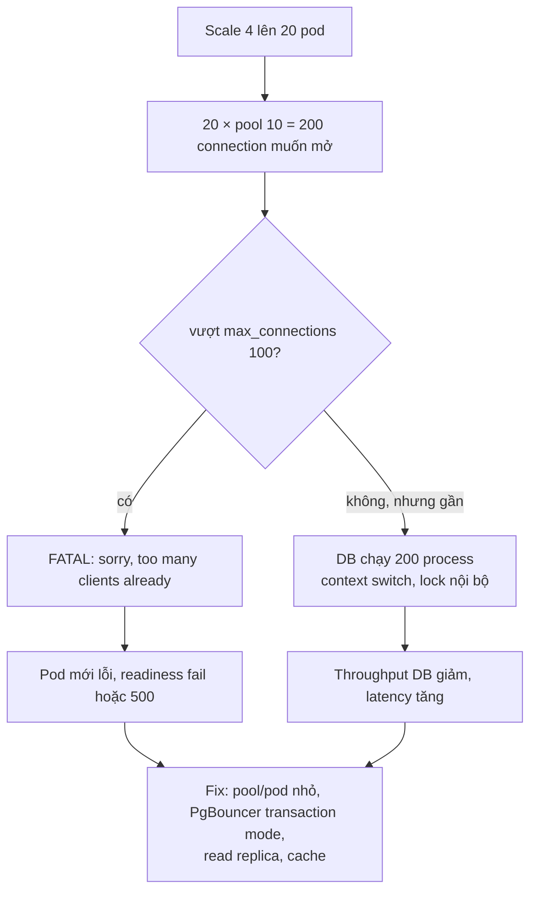
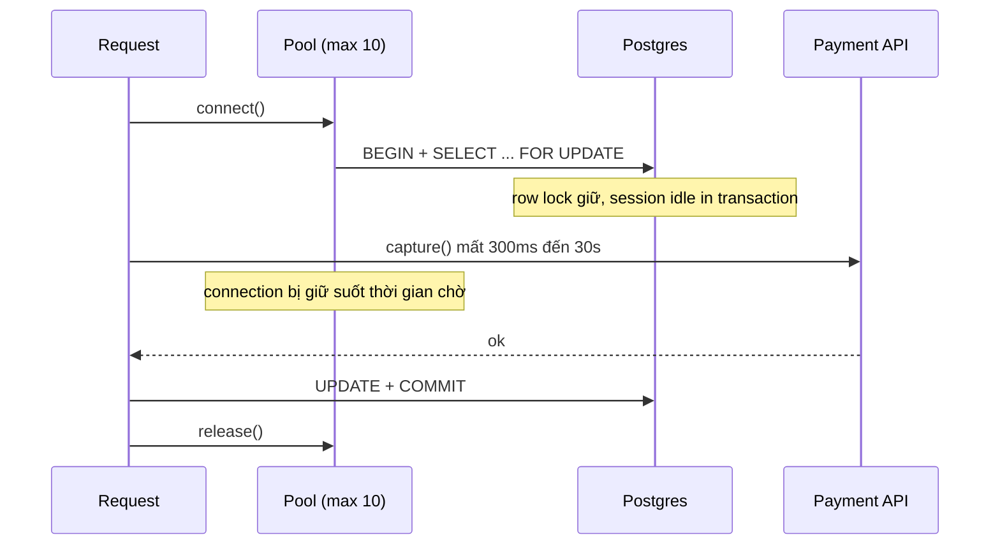

## Bối cảnh & vấn đề

Ba sự cố có cùng một kết luận sai "database yếu quá":

1. Team scale API từ 4 lên 20 pod để chịu thêm traffic. Error rate **tăng** thay vì giảm, log đầy `sorry, too many clients already`.
2. Dưới tải, mọi request treo dần. Metric pool cho thấy `waitingCount` tăng đều, `idleCount = 0`. Nhưng DB CPU chỉ 5%: database gần như đang ngủ.
3. Endpoint `/orders` chạy tốt ở dev. Ở production 500 rps, DB CPU 90% dù mỗi query chỉ mất 0.03 ms.

Trong cả ba, Postgres không chậm. Thứ cạn là **connection** (tài nguyên có hạn, đắt) và **số round-trip** (mỗi query là một lượt mạng + parse + plan + lock + commit). Ứng dụng Node rất dễ đốt hai thứ đó: một `Promise.all` trên 20,000 phần tử, một vòng `for` có `await query` bên trong, một transaction giữ connection trong lúc chờ API thanh toán 30 giây.

Bài này đi qua các kịch bản "DB là tài nguyên cạn trước" và cách sửa có đo đạc. Lý thuyết nền: [connection pooling & PgBouncer](/tracks/sql-postgres/learn/connection-pooling), [locking](/tracks/sql-postgres/learn/locking-concurrency), [access patterns](/tracks/sql-postgres/learn/access-patterns), bulk import ở [scenario large data](/tracks/scenario-data/learn/bulk-import-delete-backfill), idempotency ở [scenario reliability](/tracks/scenario-reliability/learn/double-charge-idempotency). Số đo thật trên PostgreSQL 17.11 (Docker, `max_connections=30`), Node 24.21, `pg` 8.

## Khái niệm

### Connection Postgres là một process

Mỗi connection tới Postgres là một **backend process** riêng, tốn vài MB RAM và có chi phí context switch, snapshot, lock table. `max_connections` mặc định là **100**, trong đó `superuser_reserved_connections` (mặc định 3) giữ cho superuser. Tăng lên 2,000 không phải fix: hàng nghìn process tranh CPU và lock nội bộ làm throughput **giảm**. Số connection đang chạy query có ích thường chỉ cỡ vài lần số core của DB.

Hệ quả cho app: tổng connection = `số pod × pool max (+ job, migration, admin)`. Scale pod là **nhân** connection. 20 pod × pool 10 = 200 > 100.

### Pool, acquire và pool wait

**Pool** (`pg.Pool`) giữ một số connection mở sẵn và cho mượn. `pool.query()` tự mượn và trả; `pool.connect()` trả một `client` mà **bạn phải `release()`**. Khi mọi connection đang bị mượn, request mới **chờ** trong hàng đợi của pool (`waitingCount`). Mặc định `connectionTimeoutMillis = 0` nghĩa là **chờ mãi**: request treo thay vì fail nhanh.

Theo Little's Law (bài [Triage](/tracks/scenario-scale/learn/triage-estimation)), số connection cần = `rps × thời gian giữ connection`. Thời gian giữ không phải thời gian query mà là **từ lúc mượn tới lúc trả**. Gọi HTTP 300 ms trong lúc giữ connection làm thời gian giữ tăng 100 lần.

### Pool leak và idle in transaction

**Pool leak**: một nhánh code mượn client mà không trả (return sớm, exception không có `finally`). Mỗi lần nhánh đó chạy, pool mất vĩnh viễn một connection. Từ phía DB, connection đó hiện là **`idle in transaction`** nếu đã `BEGIN`: nó còn giữ snapshot (chặn VACUUM dọn row cũ) và mọi row lock đã lấy. `idle_in_transaction_session_timeout` cho Postgres tự cắt các session như vậy.

### N+1 query

**N+1**: 1 query lấy danh sách N item, rồi N query (hoặc 2N) lấy dữ liệu con cho từng item. Ở dev có 3 order nên không ai thấy; ở production mỗi khách có 50 order thành **101 query/request**, tuần tự. Mỗi query nhanh (0.03 ms ở DB) nhưng mỗi query là một round-trip mạng, một lần parse/bind, và connection bị giữ suốt cả chuỗi. Phát hiện bằng `pg_stat_statements` (calls rất cao, mean rất thấp), trace có hình "cầu thang" span, hoặc log số query mỗi request.

### Bounded vs unbounded concurrency

`Promise.all(items.map(fn))` chạy **mọi** phần tử cùng lúc: 20,000 request tới supplier, 20,000 query tranh pool 10 connection, 20,000 promise + response trong RAM. Đó là **unbounded concurrency**. **Bounded concurrency** (`p-limit`, `p-map` với `concurrency: 10`) giữ tối đa K việc đang chạy. Tuần tự hoàn toàn (`for await`) là K = 1: an toàn nhưng 20,000 × 200 ms = 67 phút.

Song song đúng chỗ thì rất tốt: ba call độc lập 40 + 60 + 120 ms tuần tự là 220 ms, `Promise.all` là ≈ 120 ms (cái chậm nhất). Chỉ song song khi không phụ thuộc dữ liệu, và nhớ rằng nó tăng concurrency tức thời lên downstream.

### Promise không có cancel

Khi một phần tử reject, `Promise.all` reject ngay, nhưng **các call khác vẫn chạy**: vẫn giữ connection, vẫn ghi DB, kết quả bị bỏ. Lỗi đến sau không gây unhandled rejection (`Promise.all` đã gắn handler) nhưng bị **nuốt**, không ai log. Muốn huỷ thật: truyền `AbortSignal` chung xuống `fetch` hoặc driver hỗ trợ, `abort()` khi một cái lỗi hoặc client ngắt. Với query Postgres đang chạy: `pg_cancel_backend(pid)` (driver gửi cancel request qua connection riêng), hoặc `statement_timeout`.

| Combinator | Hành vi | Dùng khi |
|---|---|---|
| `Promise.all` | Reject ở lỗi đầu, còn lại vẫn chạy | Cần tất cả kết quả |
| `Promise.allSettled` | Chờ hết, trả status từng cái | Partial response, job batch |
| `Promise.any` | Cái thành công đầu tiên | Hedged read |
| `Promise.race` | Cái settle đầu tiên | Timeout thủ công |

### Batch write và COPY

Mỗi `INSERT` riêng là một round-trip và (ở autocommit) một **commit**, tức một lần flush WAL. 5,000 event/s = 5,000 commit/s. **Batch** gom N row vào một câu: multi-row `VALUES`, `INSERT ... SELECT * FROM unnest($1::uuid[], $2::int[], ...)`, hoặc `COPY ... FROM STDIN` (stream định dạng text/binary, nhanh nhất cho khối lớn). Protocol Postgres giới hạn **65,535 parameter** mỗi câu (số parameter là int16 trong Bind message), nên multi-row `VALUES` với 5 cột chỉ được ~13,000 row; `unnest` dùng **5 parameter bất kể số row**.

**Interview angle:** nói "commit là đơn vị tốn kém" và "số parameter cố định với unnest" là dấu hiệu đã làm thật.

## Cơ chế hoạt động

### Vì sao scale pod làm lỗi tăng



Ngắn hạn: giảm pool mỗi pod (vd 4), đặt `connectionTimeoutMillis` để fail nhanh, rollback số pod nếu DB đang quá tải. Dài hạn: **PgBouncer / RDS Proxy** ở **transaction pooling mode**: hàng nghìn client connection chia nhau vài chục server connection, mỗi server connection chỉ bị chiếm trong một transaction. Đổi lại không dùng được session state: `SET` (dùng `SET LOCAL` trong transaction), advisory lock theo session, `LISTEN/NOTIFY`, temp table qua nhiều transaction. Prepared statement ở protocol level được PgBouncer hỗ trợ từ 1.21 với `max_prepared_statements` (verify bản bạn dùng). Sau khi có PgBouncer, pool mỗi pod vẫn nên nhỏ (cỡ số request DB đồng thời thực tế của pod) và `default_pool_size` của PgBouncer theo số core DB.

### Transaction bọc HTTP call



50 rps × 30 s giữ = cần **1,500 connection**. Pool 10 cạn sau vài trăm ms, mọi request khác (kể cả endpoint không liên quan) xếp hàng chờ pool. DB rảnh vì connection chỉ ngồi chờ. Fix là đổi thứ tự (card 007): đọc → gọi payment **ngoài transaction** với idempotency key và timeout → transaction ngắn cập nhật trạng thái có điều kiện (`WHERE status = 'pending'`). Nếu payment thành công mà UPDATE lỗi: ghi trạng thái trung gian trước khi gọi (`payment_pending` + key), một reconciler đối chiếu với provider theo key và hoàn tất hoặc refund; vì có idempotency key nên gọi lại capture không trừ tiền hai lần.

```ts
app.post('/orders/:id/confirm', async (req, res) => {
  const order = await repo.findPending(req.params.id);            // pool.query, trả connection ngay
  if (!order) return res.status(404).end();
  const payment = await paymentApi.capture(order.paymentId, {
    idempotencyKey: `confirm:${order.id}`, signal: AbortSignal.timeout(5000),
  });
  const client = await pool.connect();
  try {
    await client.query('BEGIN');
    const r = await client.query(
      `UPDATE orders SET status = 'confirmed' WHERE id = $1 AND status = 'pending'`, [order.id]);
    await client.query('COMMIT');
    res.json({ ok: r.rowCount === 1, payment });
  } catch (e) {
    await client.query('ROLLBACK').catch(() => {});
    throw e;
  } finally {
    client.release();                                             // luôn trả, mọi nhánh
  }
});
```

Phòng ngừa: `connectionTimeoutMillis`, metric `waitingCount`/`totalCount`, `idle_in_transaction_session_timeout` (vd 30 s) ở DB, và luật review "không I/O ngoài trong transaction".

## Ví dụ thực tế

### Too many clients và pool leak, tái hiện

```ts
// 5 "pod", mỗi pod Pool max 10, max_connections = 30
const pods = Array.from({ length: 5 }, () => new pg.Pool({ ...cfg, max: 10 }));
await Promise.all(pods.flatMap((p) => Array.from({ length: 10 }, () =>
  p.query('SELECT pg_sleep(0.3)').catch((e) => count(e.message)))));

// leak: return sớm không release, pool max 5, connectionTimeoutMillis 1000
async function confirmOrder(id: number) {
  const client = await pool.connect();
  await client.query('BEGIN');
  const { rows } = await client.query('SELECT 1 WHERE $1::int < 0', [id]); // "not found"
  if (rows.length === 0) return 404;            // leak client + transaction mở
  client.release(); return 200;
}
```

```text
5 pods x pool 10 vs max_connections=30 -> { 'sorry, too many clients already': 20 }
req 1: 404  total=1 idle=0 waiting=0
...
req 5: 404  total=5 idle=0 waiting=0
req 6: timeout exceeded when trying to connect  total=5 idle=0 waiting=0
req 7: timeout exceeded when trying to connect  total=5 idle=0 waiting=0
[ { state: 'idle in transaction', count: '5' } ]
```

Đúng 30 connection thành công, 20 nhận `too many clients` (test dùng user `postgres` là superuser nên dùng được cả 3 slot reserved; user app thường chỉ có 27). Với leak, 5 request 404 đầu tiên lấy hết pool, request thứ 6 trở đi fail sau 1 s nhờ `connectionTimeoutMillis`. **Không có timeout đó, chúng treo mãi.** Từ phía DB, 5 session `idle in transaction`: chính là dấu hiệu bạn sẽ thấy trong `pg_stat_activity` khi debug card 007.

### N+1 vs `ANY($1)`: 101 query thành 3

Dữ liệu: 200,000 order (1,000 khách × 200), mỗi order 3 item và 1 shipment, đủ index. 400 request, 20 concurrent, pool 10.

```ts
// N+1
const orders = await q('SELECT * FROM orders WHERE customer_id = $1 ORDER BY created_at DESC LIMIT 50', [id]);
for (const o of orders.rows) {
  o.items = (await q('SELECT * FROM order_items WHERE order_id = $1', [o.id])).rows;
  o.shipping = (await q('SELECT * FROM shipments WHERE order_id = $1', [o.id])).rows[0];
}
// batched: 3 query, group trong code
const ids = orders.map((o) => o.id);
const [items, ships] = await Promise.all([
  q('SELECT order_id, sku, qty FROM order_items WHERE order_id = ANY($1::bigint[])', [ids]),
  q('SELECT order_id, carrier, status FROM shipments WHERE order_id = ANY($1::bigint[])', [ids]),
]);
const byOrder = Map.groupBy(items.rows, (r) => r.order_id);
```

```text
N+1              queries/request=101  throughput=65 req/s    p50=299.9ms p99=508.1ms
ANY($1) batched  queries/request=3    throughput=1074 req/s  p50=16.9ms  p99=36.0ms

pg_stat_statements:
 calls  | mean_ms | query
 20050  | 0.034   | SELECT * FROM order_items WHERE order_id = $1
 20050  | 0.023   | SELECT * FROM shipments WHERE order_id = $1
 401    | 0.647   | SELECT order_id, sku, qty FROM order_items WHERE order_id = ANY(...)
```

**16 lần** throughput, p99 từ 508 ms xuống 36 ms, với cùng index. Đó là lý do "thêm index" không phải fix cho N+1: query đã nhanh (0.03 ms), thứ tốn là **101 round-trip** và connection bị giữ suốt chuỗi. `pg_stat_statements` cho đúng chữ ký: calls cực cao, mean cực thấp. Lựa chọn khác: một query `JOIN` + `json_agg`, DataLoader cho GraphQL, eager loading (`include`) của ORM; và chỉ select cột cần. Follow-up "`Promise.all` trên 50 order có fix không?": giảm latency (song song) nhưng vẫn 101 query, và giờ một request chiếm tới 10 connection cùng lúc, nên pool cạn nhanh hơn dưới tải. Không fix gốc.

### Ghi 20,000 event: từng câu vs unnest vs COPY

```ts
const insertBatch = (c, b) => c.query(
  `INSERT INTO events (id, tenant_id, type, payload, created_at)
   SELECT * FROM unnest($1::uuid[], $2::int[], $3::text[], $4::jsonb[], $5::timestamptz[])
   ON CONFLICT (id) DO NOTHING`,
  [b.map((e) => e.id), b.map((e) => e.tenantId), b.map((e) => e.type),
   b.map((e) => JSON.stringify(e.payload)), b.map((e) => e.createdAt)]);
```

```text
1 INSERT per event (10 concurrent)         8108 ms     2467 rows/s  rows=20000
unnest batch of 500 (sequential)            309 ms    64807 rows/s  rows=20000
COPY FROM STDIN (one stream)                863 ms    23165 rows/s  rows=20000
replay same batch: first rowCount=500, second rowCount=0
multi-row VALUES with 70,000 params -> bind message has 4464 parameter formats but 0 parameters
```

Đọc kết quả:
- Batch 500 nhanh **26 lần** so với từng câu, dù từng câu đã chạy 10 luồng song song. Card 030: 5k event/s từng câu là 5k commit/s; batch 500 là 10 commit/s.
- `COPY` ở đây chậm hơn unnest vì test đẩy từng dòng qua `Readable.from` (overhead JS mỗi row) với khối nhỏ 20k row. COPY thắng rõ khi khối lớn (hàng triệu row, file sẵn) và khi dùng format binary; với batch vài trăm row trong consumer, unnest là đủ và đơn giản hơn. **Đo trên workload của bạn**, đừng thuộc lòng "COPY luôn nhanh nhất".
- `ON CONFLICT (id) DO NOTHING`: replay cùng batch lần hai ghi **0 row**. Queue là at-least-once nên đây là bắt buộc.
- Multi-row `VALUES` với 14,000 row × 5 cột = 70,000 parameter vượt giới hạn int16: số parameter bị tràn thành 70,000 − 65,536 = **4,464** và server báo lỗi khó hiểu ở trên. Đây là gotcha có thật; unnest tránh được vì chỉ có 5 parameter.

Quy trình consumer đúng: gom batch theo **500 row hoặc 200 ms**, cái nào tới trước; ghi; **commit offset/ack sau khi batch ghi thành công**; batch lỗi thì chia đôi để tìm row hỏng, row hỏng vào DLQ. Batch thêm tối đa 200 ms latency cho mỗi event: không chấp nhận được khi event cần đọc lại ngay (read-your-writes cho user), còn với analytics/audit thì không sao. SQL Server khác: tối đa 2,100 parameter mỗi câu và 1,000 row trong `VALUES`; dùng table-valued parameter hoặc `SqlBulkCopy`.

### Job enrich 20,000 sản phẩm (card 020)

```ts
import pLimit from 'p-limit';
const limit = pLimit(10);                        // ≤ 10 call supplier cùng lúc
for await (const page of repo.streamToEnrich({ pageSize: 500 })) {   // keyset, không load 20k row
  const results = await Promise.allSettled(page.map((p) => limit(async () => {
    const data = await withRetry(() => supplier.get(`/items/${p.sku}`), {
      retries: 5, on: [429, 502, 503], respectRetryAfter: true, jitter: 'full' });
    return { id: p.id, data };
  })));
  const ok = results.flatMap((r) => (r.status === 'fulfilled' ? [r.value] : []));
  await repo.updateMany(ok);                     // UPDATE ... FROM unnest(...)
  await checkpoint.save(page.at(-1)!.id);        // chạy lại được từ chỗ dừng
  logFailures(results);
}
```

Chọn concurrency 5, 50 hay 500: theo **quota của supplier** (rate limit tài liệu ghi, hoặc đo khi bắt đầu nhận 429) và theo Little's Law: muốn 50 req/s với latency 200 ms cần 10 concurrent. Bắt đầu thấp, tăng dần, dùng token bucket nếu quota tính theo giây. Đừng vượt pool DB của job.

## Trade-offs & lựa chọn thay thế

| Vấn đề | Lựa chọn | Được | Mất |
|---|---|---|---|
| Quá nhiều connection | Tăng `max_connections` | Nhanh | RAM, context switch, throughput giảm |
| | Pool/pod nhỏ hơn | Không tốn gì | Pool wait nếu giữ connection lâu |
| | PgBouncer transaction mode | Hàng nghìn client, ít server conn | Mất session state, thêm một hop |
| | RDS Proxy | Managed, hợp Lambda | Chi phí, pinning khi dùng session feature |
| N+1 | `ANY($1)` + group trong code | 3 query cố định, đơn giản | Code group thủ công |
| | `JOIN` + `json_agg` | 1 round-trip | Query phức tạp, row lặp nếu không aggregate |
| | DataLoader | Tự batch trong GraphQL | Cache per-request, debug khó hơn |
| Ghi nhiều | Từng câu | Đơn giản, latency thấp | Commit/s cao |
| | Batch unnest | 26× nhanh hơn (đo), parameter cố định | Thêm ≤ 200 ms latency |
| | COPY | Nhanh nhất cho khối rất lớn | Không `ON CONFLICT` trực tiếp (dùng staging table) |
| Spike ghi | Buffer trong RAM | Dễ viết | OOM, mất data, không backpressure |
| | Queue durable + worker | Không mất, backpressure tự nhiên | Hạ tầng thêm, eventual |

**Card 029: ingestion 5k ghi/s gặp spike ×10.** Ưu tiên **không mất, không trùng** hơn latency. Ngay lập tức: rate limit theo client, reject sớm payload sai, `429`/`503` + `Retry-After` thay vì để DB chết. Kiến trúc: API validate → ghi vào log/queue durable (Kafka/SQS/Kinesis) → `202`; worker **kéo** với tốc độ DB chịu được (backpressure tự nhiên vì consumer pull). Ghi hiệu quả: batch, append-only, partition theo thời gian; idempotency bằng unique `event_id` + `ON CONFLICT DO NOTHING`. Partition key phân bố đều (không để một tenant lớn làm key duy nhất). Đo: queue depth/oldest age, write latency, DLQ rate. Queue cũng đầy: tuyến phòng thủ cuối là **từ chối ở cửa** (503/429) và để client giữ dữ liệu retry, hoặc ghi tạm ra object storage (S3) theo batch để nạp lại sau; không bao giờ nhận rồi vứt.

## Edge cases & failure modes

- **Exception giữa transaction không có `finally`**: leak một connection mỗi lần; sau N lỗi, toàn service treo. Mọi `pool.connect()` phải có `try/finally release()`.
- **`release(err)` với connection hỏng**: truyền lỗi vào `release(err)` để pool huỷ connection thay vì trả lại connection đang ở trạng thái lạ (transaction dở).
- **`idle in transaction` giữ snapshot**: chặn VACUUM, bảng phình (bloat). Đặt `idle_in_transaction_session_timeout`.
- **Buffer trong RAM cho spike (card 031)**: `buffer` không giới hạn → OOMKill; đã trả 202 nhưng event chỉ nằm trong RAM → crash/deploy là mất; `splice` rồi `insertMany` lỗi là mất batch; `setInterval` async chạy chồng khi insert > 1 s. Fix: queue durable trước khi trả 202. Nếu buộc phải buffer trong process: giới hạn số item/bytes, trả 503 khi đầy, flush khi SIGTERM (ngừng nhận, flush, rồi thoát; xem [graceful shutdown](/tracks/nodejs/learn/graceful-shutdown)), retry batch lỗi, không chạy chồng flush.
- **Batch lỗi một row** làm fail cả batch: chia đôi đệ quy, row hỏng vào DLQ.
- **Lambda / serverless**: mỗi execution một connection; 3,000 concurrent = 3,000 connection. Proxy bắt buộc.
- **Read replica lag**: chuyển đọc sang replica làm user không thấy dữ liệu vừa ghi; route đọc-sau-ghi về primary.
- **Hủy request nhưng query vẫn chạy**: client ngắt, Postgres vẫn chạy query 30 s. `statement_timeout` theo role/endpoint, huỷ bằng `pg_cancel_backend` khi `req` close.

## Pitfalls

- ❌ Tăng `max_connections` lên 2,000 → ✅ pool nhỏ + PgBouncer; DB tốt nhất với số connection active cỡ vài lần số core.
- ❌ Scale pod mà không tính `pods × pool` → ✅ tổng connection là một ngân sách, chia cho pod, job, admin.
- ❌ Chỉ tăng pool khi `waitingCount` cao → ✅ tìm ai giữ connection lâu (leak, transaction bọc HTTP); pool to hơn chỉ dời điểm cạn.
- ❌ `connectionTimeoutMillis = 0` (mặc định) → ✅ timeout vài giây để fail nhanh và lộ lỗi.
- ❌ Fix N+1 bằng index → ✅ gộp query (`ANY`, `JOIN`, DataLoader); đo được 101 → 3 query, 16× throughput.
- ❌ `Promise.all` trên 20,000 phần tử → ✅ `p-limit`/`p-map`, đọc theo trang, `allSettled` + checkpoint.
- ❌ Thay `Promise.all` bằng `for await` tuần tự rồi coi là xong → ✅ bounded concurrency; tuần tự là 67 phút.
- ❌ Tin `Promise.all` huỷ các call còn lại → ✅ `AbortController` truyền xuống.
- ❌ Multi-row `VALUES` cho batch lớn → ✅ unnest (5 parameter) hoặc COPY; nhớ giới hạn 65,535.
- ❌ Ack message trước khi ghi DB → ✅ ack sau khi batch commit, idempotent bằng `ON CONFLICT`.

## Tóm tắt

- Connection Postgres là process đắt; `max_connections` mặc định 100; **scale pod nhân connection** → PgBouncer transaction mode, pool/pod nhỏ.
- Pool cần = rps × **thời gian giữ**; không gọi HTTP trong transaction; `try/finally release()`; `connectionTimeoutMillis` để fail nhanh.
- `waitingCount` cao + DB rảnh = leak hoặc connection bị giữ lâu; xác nhận bằng `idle in transaction` trong `pg_stat_activity`.
- N+1 phát hiện bằng `pg_stat_statements` (calls cao, mean thấp); gộp bằng `ANY($1)`/JOIN: đo được 16× throughput.
- Song song có giới hạn (`p-limit`), không unbounded; `Promise.all` không huỷ gì, dùng `AbortSignal`.
- Ghi theo batch (500 row/200 ms), unnest giữ số parameter cố định, `ON CONFLICT DO NOTHING`, ack sau commit: đo được 26× nhanh hơn từng câu.
- Spike ghi: queue durable + worker kéo, không buffer trong RAM; 202 chỉ khi đã lưu bền.
