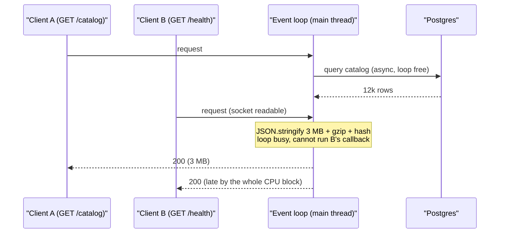
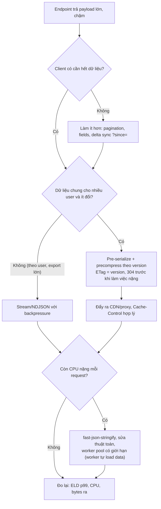

## Bối cảnh & vấn đề

Một mobile app gọi `GET /catalog` khoảng 200 lần mỗi giây. Endpoint trả toàn bộ catalog của tenant: 12,000 sản phẩm, khoảng 3 MB JSON. Trên dashboard, p99 của **chính endpoint này** là 1.8 s, nhưng điều làm on-call bối rối là p99 của `GET /health` và `POST /login` (vốn chỉ vài ms) cũng nhảy lên hơn 1 s. CPU pod đứng ở 100% một core, event loop lag vài trăm ms, readiness probe bắt đầu fail, pod bị rút khỏi load balancer, pod còn lại gánh thêm tải.

Không có query chậm, không có lock. Thủ phạm là **công việc đồng bộ trên main thread**: build object, `JSON.stringify`, gzip, hash để tính ETag, tất cả chạy trên cùng một thread JavaScript mà mọi request khác đang chờ. Node xử lý I/O song song rất tốt, nhưng CPU work thì xếp hàng. Mỗi ms tiêu cho một payload lớn là một ms **mọi request khác phải đợi**.

Bài này đi theo thứ tự một người làm performance thực sự đi: hỏi đúng câu trước khi tối ưu, đo xem thời gian nằm ở đâu, rồi áp dụng fix theo thứ tự rẻ nhất trước: làm ít việc hơn, làm một lần thay vì mỗi request, đẩy việc ra khỏi process (CDN/proxy), stream thay vì buffer, và chỉ khi còn lại CPU thật sự thì mới dùng worker. Cuối bài là quy trình săn nguyên nhân khi một pod đứng ở CPU 100% trong production.

Nền tảng ở track Node: [event loop phases](/tracks/nodejs/learn/event-loop-phases), [CPU work & workers](/tracks/nodejs/learn/cpu-work-workers), [stream pipelines](/tracks/nodejs/learn/stream-pipelines), [profiling](/tracks/nodejs/learn/observability-profiling). HTTP caching chi tiết ở [HTTP/CDN caching](/tracks/caching/learn/http-cdn-caching). Phần quá tải và load shedding ở bài trước: [peak & overload](/tracks/scenario-scale/learn/spikes-overload).

## Khái niệm

### Event loop blocking và event loop lag

**Event loop** là vòng lặp trên một thread duy nhất chạy mọi callback JavaScript: handler HTTP, `.then`, timer. I/O (socket, file, DNS) được libuv và kernel làm song song, nhưng **mỗi đoạn JS đồng bộ chạy tới hết rồi mới nhường**. `JSON.stringify(bigObject)` là một lời gọi đồng bộ: nó không có điểm `await` ở giữa, nên trong lúc nó chạy, không callback nào khác được chạy, kể cả việc accept connection mới hay trả lời health check.

**Event loop lag** (event loop delay) là độ trễ giữa lúc một callback lẽ ra được chạy và lúc nó thực sự chạy. Nếu mỗi request 3 MB tốn 30 ms CPU và có 10 request đến cùng lúc, request thứ 10 phải chờ ~300 ms trước khi được chạm tới, và request `/health` chen giữa cũng chờ như vậy. Đó là lý do một endpoint nặng làm chậm **mọi** endpoint.

Đo bằng `perf_hooks.monitorEventLoopDelay()`: Node đặt một timer có độ phân giải cố định và ghi lại độ trễ vào histogram; bạn export p50/p99/max thành metric. Để biết riêng một lời gọi tốn bao nhiêu, bọc nó bằng `performance.now()`. Ngưỡng tham khảo: p99 lag dưới ~50 ms là lành mạnh với API thông thường; hàng trăm ms là có CPU work đồng bộ đáng kể.

**Interview angle:** câu trả lời mạnh nêu được *cơ chế* (single thread, sync không nhường) và *cách đo* (ELD histogram + timing quanh lời gọi + CPU profile), không chỉ "JSON lớn thì chậm".

### Chi phí của một response lớn

Một response 3 MB không phải một chi phí mà là chuỗi chi phí, mỗi cái nằm ở một chỗ khác nhau: (1) **query + hydrate** object từ DB, đa phần là I/O nhưng ORM map row thành entity là CPU; (2) **serialize** (`JSON.stringify`), CPU đồng bộ trên main thread; (3) **hash** để tính ETag, CPU; (4) **compress**, CPU (zlib của Node chạy trên threadpool nếu dùng API async, nhưng vẫn tốn core); (5) **network**, gửi bytes qua mạng, phía client còn phải parse.

Vì vậy trước khi tối ưu, câu hỏi đầu tiên (card 032) là: **thời gian nằm ở chặng nào?** Ai gọi, bao nhiêu lần/giây, client có dùng hết 3 MB không, dữ liệu đổi bao lâu một lần, size sau nén là bao nhiêu, phân bố latency theo chặng (DB / serialize / compress / transfer) ra sao, và p99 tệ là do endpoint này hay do nó làm chậm endpoint khác. Một trace có span cho từng chặng trả lời gần hết các câu này.

### Nén: gzip, brotli và chỗ đặt nén

**gzip** (deflate) nhanh, hỗ trợ ở mọi nơi. **brotli** nén tốt hơn với text, nhưng ở quality cao (10–11) **rất chậm**: đo trên payload 2.7 MB của bài này, brotli quality 11 mất ~4.7 s, trong khi gzip level 6 mất ~9 ms và brotli quality 4 mất ~6 ms với kích thước gần ngang. Quy tắc: response **động** dùng gzip 6 hoặc brotli 4–5; brotli 11 chỉ dành cho asset **tĩnh** nén trước một lần lúc build hoặc lúc publish.

**Nén ở đâu?** Nén tốn CPU, nên đặt nó ở chỗ CPU rẻ và không chặn app: reverse proxy (nginx, Envoy), load balancer hoặc CDN. Nếu cả app (`compression()` middleware) và CDN đều nén, bạn trả CPU hai lần, hoặc CDN phải giải nén rồi nén lại. Middleware nén còn **buffer** output để có block đủ lớn mà nén, nên với **Server-Sent Events** (SSE) mỗi event nhỏ bị giữ lại trong buffer và không tới client theo thời gian thực, trừ khi gọi `res.flush()` sau mỗi event hoặc loại `text/event-stream` khỏi filter của middleware (card 034).

### ETag và 304: tiết kiệm băng thông, không tự tiết kiệm CPU

**ETag** là định danh phiên bản của một response. Client gửi lại nó trong `If-None-Match`; nếu khớp, server trả `304 Not Modified` không body. Express tạo ETag mặc định bằng cách **hash body đã được tạo xong**. Nghĩa là để trả 304, server vẫn query, build object, stringify 3 MB, rồi hash, chỉ bỏ bước gửi. Băng thông giảm, CPU thì không (card 035).

Fix: ETag phải tính được **trước** khi làm việc nặng, từ thứ rẻ như `catalog_version` hoặc `max(updated_at)` của tenant. Handler kiểm tra `If-None-Match` ngay đầu, khớp thì trả 304 mà không chạm tới object lớn.

### Pre-serialize: làm một lần cho mỗi phiên bản

Nếu cùng một catalog 3 MB phục vụ hàng nghìn user và chỉ đổi mỗi giờ một lần (card 041), stringify và nén nó ở mỗi request là lãng phí thuần. **Pre-serialize** nghĩa là khi dữ liệu đổi (hoặc lần đầu có request sau khi đổi), tạo một lần `Buffer` JSON và luôn cả bản gzip/brotli, key theo version, giữ trong memory, Redis hoặc object storage sau CDN. Request chỉ còn `res.end(buffer)`: không stringify, không nén, không hash.

Phải xử lý: **stampede** khi version mới ra và hàng trăm request cùng muốn build (dùng single-flight: một promise build chung), dọn bản cũ để không giữ mãi nhiều version trong RAM, và dữ liệu **cá nhân hoá** thì không chia sẻ được (tách phần chung khỏi phần theo user).

### Streaming JSON và NDJSON

**Streaming** gửi response theo từng mảnh ngay khi có, thay vì dựng xong cả chuỗi 3 MB trong memory. Memory của process chỉ giữ vài row cùng lúc và client nhận byte đầu sớm. Nhưng stream đúng có ba điều kiện: format hợp lệ (dấu `[`, dấu phẩy, `]`), **backpressure** (khi `res.write()` trả `false` thì phải dừng đọc nguồn tới khi `'drain'`), và xử lý lỗi/huỷ (client ngắt thì huỷ query).

**NDJSON** (newline-delimited JSON) bỏ cái mảng bao ngoài: mỗi dòng là một JSON object độc lập. Không phải quản lý dấu phẩy, client parse được từng dòng ngay khi nhận (không cần streaming JSON parser), và nếu stream bị cắt giữa chừng, các dòng đã nhận vẫn dùng được. Đổi lại, client phải biết format này (`Content-Type: application/x-ndjson`), và trình duyệt/tool chung không đọc như JSON thường. Lưu ý khi stream: status `200` đã gửi đi trước khi biết có lỗi giữa chừng hay không, nên lỗi ở row 50,000 chỉ có thể báo bằng cách cắt kết nối hoặc ghi một dòng lỗi cuối (card 042).

### Worker threads và structured clone

**`worker_threads`** cho chạy JS trên thread khác với event loop riêng. Nhưng dữ liệu đi qua `workerData` hoặc `postMessage` bằng **structured clone**: main thread phải duyệt và copy toàn bộ object **đồng bộ** trước khi gửi. Clone một object 3 MB tốn cỡ ngang một lần stringify, nên "đẩy `JSON.stringify(bigObject)` sang worker" chỉ chuyển chi phí từ chỗ này sang chỗ khác, rồi còn copy chuỗi kết quả về (card 039).

Worker có ích khi **input/output nhỏ, tính toán lớn** (hash, nén, tính toán số học), khi worker tự load dữ liệu (nhận `reportId`, tự query, tự serialize, trả về một `ArrayBuffer` qua `transferList` không copy), và luôn qua **pool có giới hạn** (piscina) với hàng đợi có giới hạn, không `new Worker()` mỗi request.

### fast-json-stringify

`fast-json-stringify` (Fastify dùng cho response schema) nhận **JSON Schema** của response và sinh sẵn một hàm serialize chuyên cho đúng shape đó. `JSON.stringify` tổng quát phải kiểm tra kiểu từng giá trị, duyệt key, xử lý `toJSON`; hàm sinh sẵn biết trước field nào, kiểu gì, nên nhanh hơn với object có shape cố định (mức tăng tuỳ payload, phải đo). Lợi ích phụ: field không có trong schema bị **bỏ**, nên không vô tình lộ `passwordHash`.

Pitfall (card 040): schema lỗi thời làm field mới **im lặng biến mất** khỏi response; giá trị sai kiểu bị ép kiểu thay vì báo lỗi; và nó vẫn đồng bộ, chỉ giảm hằng số. Payload 30 MB vẫn chặn loop.

### Độ phức tạp thuật toán ẩn trong code "bình thường"

Rất nhiều sự cố CPU 100% không đến từ JSON mà từ một vòng lặp lồng nhau trông vô hại: `products.map(p => promos.find(x => x.skus.includes(p.sku)))`. Với 20,000 product × 5,000 promo × vài SKU mỗi promo, đó là hàng trăm triệu phép so sánh, đồng bộ (card 052). Fix là đổi cấu trúc dữ liệu: build một `Map<sku, promo>` một lần (O(P + S)), rồi tra O(1) cho mỗi product. Đo trong bài: 705 ms xuống 2.8 ms.

## Cơ chế hoạt động

### Một request nặng chặn mọi request khác



Trong lúc chờ DB, loop rảnh và phục vụ được request khác: đó là phần Node làm tốt. Khi row về, callback của A chạy và làm toàn bộ CPU work trong **một lượt**. Socket của B đã có dữ liệu nhưng callback của B chỉ được chạy sau khi lượt của A kết thúc. Nếu có nhiều request catalog cùng lúc, các lượt CPU nối đuôi nhau và B chờ tổng của chúng. Health check timeout theo đúng cơ chế này, nên pod bị đánh dấu unhealthy dù process vẫn "sống".

Toán capacity đơn giản: nếu một request catalog tốn `c` ms CPU, một core chịu tối đa `1000 / c` request/giây **cho toàn bộ process**, chưa tính mọi endpoint khác. Với 200 rps × (8 ms stringify + 9 ms gzip) ≈ 3.4 core-giây mỗi giây: không một process Node nào chịu nổi, và thêm pod chỉ là trả tiền cho cùng một việc lặp lại.

### Thứ tự áp dụng fix



Thứ tự này đi từ thay đổi có lợi nhất và rẻ nhất (card 036). **Làm ít hơn** loại bỏ chi phí ở mọi chặng: một app chỉ hiển thị 50 sản phẩm đầu không cần 12,000; delta sync (`?since=version`) biến mỗi lần mở app từ 3 MB thành vài KB. **Làm một lần** (pre-serialize + ETag theo version) biến chi phí theo request thành chi phí theo lần đổi dữ liệu. **Đẩy ra ngoài** (CDN) làm request không tới origin nữa. Chỉ dữ liệu thật sự riêng cho từng request mới cần stream, và chỉ CPU còn sót lại sau tất cả mới đáng dùng worker. Làm ngược thứ tự (thêm worker trước) là trả độ phức tạp để giữ nguyên lượng việc lãng phí.

### Backpressure khi stream

Khi stream từ DB ra HTTP, nguồn (DB cursor) thường nhanh hơn đích (mobile client trên 3G). `res.write()` trả `false` khi buffer nội bộ vượt `highWaterMark`: đó là tín hiệu "dừng lại". Nếu bỏ qua, mọi row dồn vào memory của process và streaming mất hết ý nghĩa. `stream.pipeline()` hoặc vòng `for await` có `await once(res, 'drain')` xử lý việc dừng/tiếp tục, và `pipeline` còn huỷ nguồn khi client ngắt kết nối hoặc khi có lỗi.

## Ví dụ thực tế

### Đo chi phí và event loop lag

Script dưới đây chạy thật trên Node 24 (laptop, số liệu sẽ khác trên máy bạn) với payload tổng hợp 12,000 object ~2.7 MB. Dữ liệu tổng hợp lặp lại nên nén rất tốt; dữ liệu thật thường stringify chậm hơn và nén kém hơn.

```ts
import { monitorEventLoopDelay, performance } from 'node:perf_hooks';
import { gzipSync, brotliCompressSync, constants } from 'node:zlib';

const items = Array.from({ length: 12_000 }, (_, i) => ({
  id: `sku-${i}`, name: `Product ${i} lorem ipsum`, price: i * 1.5,
  tags: ['a', 'b', 'c'], stock: i % 50, desc: 'x'.repeat(120),
}));

let t = performance.now();
const s = JSON.stringify(items);
console.log('payload MB', (Buffer.byteLength(s) / 1e6).toFixed(2), 'stringify ms', (performance.now() - t).toFixed(1));
t = performance.now(); JSON.parse(s);
console.log('parse ms', (performance.now() - t).toFixed(1));

t = performance.now(); const g = gzipSync(s, { level: 6 });
console.log('gzip6 ms', (performance.now() - t).toFixed(1), 'KB', (g.length / 1024).toFixed(0));
t = performance.now(); const b = brotliCompressSync(s, { params: { [constants.BROTLI_PARAM_QUALITY]: 11 } });
console.log('brotli11 ms', (performance.now() - t).toFixed(1), 'KB', (b.length / 1024).toFixed(0));
// same call with BROTLI_PARAM_QUALITY: 4 printed as 'brotli4'

// lag: stringify every 50 ms, ELD histogram samples every 10 ms
const h = monitorEventLoopDelay({ resolution: 10 }); h.enable();
let n = 0;
const iv = setInterval(() => {
  JSON.stringify(items);
  if (++n === 20) {
    clearInterval(iv); h.disable();
    const ms = (ns: number) => (ns / 1e6).toFixed(1);
    console.log('ELD p50 ms', ms(h.percentile(50)), 'p99', ms(h.percentile(99)), 'max', ms(h.max));
  }
}, 50);
```

```text
payload MB 2.74 stringify ms 7.9
parse ms 6.0
gzip6 ms 8.6 KB 113
brotli11 ms 4726.1 KB 36
brotli4 ms 6.3 KB 44
ELD p50 ms 11.0 p99 19.7 max 20.3
```

Ba bài học từ số liệu. Thứ nhất, một lần stringify "chỉ" 8 ms, nhưng nhân 200 rps là 1.6 core-giây mỗi giây cho riêng stringify; vấn đề nằm ở **tần suất × chi phí**, không ở một lần gọi. Thứ hai, brotli 11 cho response động là thảm hoạ: 4.7 **giây** CPU để tiết kiệm 77 KB so với gzip. Thứ ba, histogram ELD có sàn bằng độ phân giải (ở đây ~10 ms) nên đọc nó theo **xu hướng và chênh lệch** so với baseline, không đọc số tuyệt đối (verify hành vi của histogram trên version Node bạn dùng). Trong production, export `p99` và `max` mỗi 10–30 s thành metric, và alert khi p99 vượt ngưỡng trong vài phút liên tục.

### ETag theo version, 304 trước khi làm việc nặng, buffer dựng sẵn

```ts
type Prepared = { version: number; etag: string; json: Buffer; gzip: Buffer };
const prepared = new Map<string, Prepared>();          // tenantId -> latest only
const building = new Map<string, Promise<Prepared>>(); // single-flight

async function getPrepared(tenantId: string): Promise<Prepared> {
  const version = await repo.catalogVersion(tenantId); // cheap: SELECT version ...
  const cur = prepared.get(tenantId);
  if (cur?.version === version) return cur;
  const key = `${tenantId}:${version}`;
  let p = building.get(key);
  if (!p) {
    p = (async () => {
      const json = Buffer.from(JSON.stringify(await repo.catalog(tenantId)));
      const gzip = await gzipAsync(json, { level: 6 }); // async zlib: threadpool
      const out = { version, etag: `"c${version}"`, json, gzip };
      prepared.set(tenantId, out); // replaces old version, no unbounded growth
      return out;
    })().finally(() => building.delete(key));
    building.set(key, p);
  }
  return p;
}

app.get('/catalog', async (req, res) => {
  const p = await getPrepared(req.tenantId);
  res.setHeader('ETag', p.etag);
  res.setHeader('Cache-Control', 'private, max-age=60');
  if (req.headers['if-none-match'] === p.etag) return res.status(304).end();
  const gz = /\bgzip\b/.test(String(req.headers['accept-encoding'] ?? ''));
  res.setHeader('Content-Type', 'application/json');
  res.setHeader('Vary', 'Accept-Encoding');
  if (gz) res.setHeader('Content-Encoding', 'gzip');
  res.end(gz ? p.gzip : p.json);
});
```

Sau thay đổi này, request thường chỉ tốn một query `SELECT version` nhỏ và một `res.end(buffer)`. Stringify và gzip chạy một lần mỗi khi catalog đổi, và nhờ single-flight, 200 request cùng lúc sau khi đổi chỉ kích hoạt **một** lần build. Nếu app có `compression()` toàn cục, endpoint này phải được loại ra (header `Content-Encoding` đã set), nếu không sẽ nén lại một buffer đã nén. Ghi chú: Express tự set ETag yếu dựa trên hash body nếu bạn không set; khi đã set thủ công, có thể tắt `app.set('etag', false)` để khỏi hash 3 MB vô ích.

### Sửa endpoint "streaming" hỏng (card 038)

Code gốc gọi `res.end(']')` **đồng bộ** ngay sau khi gắn listener, nên response kết thúc là `[]` trước khi row nào tới, và các `res.write` sau đó ném `ERR_STREAM_WRITE_AFTER_END`. Không có dấu phẩy giữa phần tử (`[{..}{..}]`), bỏ qua giá trị trả về của `write` (không backpressure), không xử lý `error` của DB stream và không huỷ query khi client ngắt. Bản đúng bằng async iteration:

```ts
import { once } from 'node:events';

app.get('/export', async (req, res) => {
  const rows = db.queryStream('SELECT * FROM orders ORDER BY id'); // object mode
  let aborted = false;
  res.on('close', () => { if (!res.writableFinished) { aborted = true; rows.destroy(); } });
  res.setHeader('Content-Type', 'application/x-ndjson');
  try {
    for await (const row of rows) {
      if (!res.write(JSON.stringify(row) + '\n')) await once(res, 'drain');
    }
    res.end();
  } catch (err) {
    if (!aborted) {
      log.error({ err }, 'export failed mid-stream');
      res.destroy(err as Error); // headers already sent: signal failure by cutting the stream
    }
  }
});
```

NDJSON loại bỏ hoàn toàn bài toán dấu phẩy. Nếu buộc phải giữ JSON array, ghi `'['` trước vòng lặp, ghi `','` trước mọi phần tử trừ phần tử đầu, và `']'` sau vòng lặp. `once(res, 'drain')` là chỗ backpressure thực sự xảy ra: vòng `for await` không lấy row tiếp theo cho tới khi client đọc kịp, và DB cursor cũng dừng theo. Một chi tiết thực tế: nếu client ngắt khi đang chờ `drain`, sự kiện đó có thể không bao giờ đến; `rows.destroy()` trong handler `close` làm vòng lặp kết thúc thay vì treo. `stream.pipeline(rows, toNdjson, res)` là lựa chọn ngắn hơn và tự xử lý cả lỗi lẫn huỷ.

Input/output minh hoạ (không chạy thật):

```text
$ curl -s localhost:3000/export | head -2
{"id":1,"total":120.5,"status":"paid"}
{"id":2,"total":80,"status":"refunded"}
```

### Vòng lặp lồng nhau: 705 ms xuống 2.8 ms (card 052)

```ts
// before: O(products × promos × skusPerPromo)
products.map((p) => {
  const promo = promos.find((x) => x.skus.includes(p.sku));
  return { ...p, finalPrice: promo ? p.price * (1 - promo.rate) : p.price };
});

// after: build index once, O(totalSkus + products)
const bySku = new Map<string, Promotion>();
for (const promo of promos) for (const sku of promo.skus) if (!bySku.has(sku)) bySku.set(sku, promo);
products.map((p) => {
  const promo = bySku.get(p.sku);
  return { ...p, finalPrice: promo ? p.price * (1 - promo.rate) : p.price };
});
```

```text
nested ms 705
map ms 2.8
```

Số đo thật trên 20,000 product và 5,000 promo, mỗi promo 2 SKU. Với tenant thật có promo chứa hàng chục SKU, bản lồng nhau dễ lên tới vài giây như trong card. Lưu ý giữ đúng ngữ nghĩa: `find` trả promo **đầu tiên** khớp, nên khi build `Map` dùng `if (!bySku.has(sku))` để giữ promo đầu, không ghi đè bằng promo sau. Nếu business cần "promo tốt nhất", đó là một quy tắc khác, phải hỏi rõ. Dài hạn, phép join này có thể đẩy xuống DB (`JOIN promotion_skus`) với index đúng.

### Săn CPU 100% trong production (card 051)

Pod đứng ở 100% một core, ELD 2 s, health check fail. Quy trình:

1. **Cầm máu trước**: nếu pod sắp bị kill, đừng để mất bằng chứng. Rút một pod khỏi LB (label selector hoặc cho readiness fail có chủ đích) nhưng không kill, các pod khác tiếp tục phục vụ. Nếu nguyên nhân là một endpoint đã biết, rate limit hoặc tắt nó bằng feature flag.
2. **Thu CPU profile**: với process đang chạy, gửi `SIGUSR1` để bật inspector (chỉ khi port không lộ ra ngoài), port-forward, dùng Chrome DevTools ghi profile 30 s. Cách khác: chạy một pod với `node --cpu-prof --cpu-prof-dir=/tmp/prof` và tái hiện tải. Mở file `.cpuprofile` dưới dạng flame graph.
3. **Đọc flame graph**: tìm frame rộng nhất ở đỉnh stack. Ứng viên quen thuộc: `JSON.stringify`/`JSON.parse` lớn, regex **catastrophic backtracking** trên input do user nhập, crypto đồng bộ (`pbkdf2Sync`, `bcrypt` sync), vòng lặp lồng nhau, template rendering, log serialize object lớn. Nếu phần lớn thời gian là **GC**, vấn đề là memory (xem bài [memory leak](/tracks/scenario-scale/learn/memory-leaks-production)), không phải code nóng.
4. **Đối chiếu với thời điểm**: CPU tăng sau deploy nào, tenant nào, endpoint nào (trace + log theo `tenantId`). Một tenant với 20,000 sản phẩm thường là "input lớn bất thường" lộ ra thuật toán bậc hai.
5. **Fix và rào chắn**: sửa nguyên nhân, thêm giới hạn kích thước input, alert theo ELD p99, và tách liveness khỏi những gì phụ thuộc vào loop bận (liveness nên chỉ kiểm process, timeout đủ rộng) để một đợt CPU cao không gây restart dây chuyền.

**Interview angle:** người phỏng vấn muốn nghe "lấy profile trên pod đã cách ly", không phải "tăng CPU limit" hay "restart".

## Trade-offs & lựa chọn thay thế

| Kỹ thuật | Giảm cái gì | Chi phí / rủi ro | Hợp khi |
|---|---|---|---|
| Pagination / fields / delta sync | Mọi chặng | Đổi contract API, client phải sửa | Client không cần toàn bộ dữ liệu |
| ETag theo version + 304 | Băng thông, và CPU nếu kiểm tra sớm | Cần nguồn version tin cậy | Client gọi lặp lại dữ liệu ít đổi |
| Pre-serialize + precompress | Stringify, nén, hash mỗi request | RAM cho buffer, invalidation, stampede | Dữ liệu chung, đổi thưa |
| CDN / proxy cache | Request tới origin | Cache key, purge, dữ liệu riêng tư | Public hoặc theo tenant với key rõ |
| Nén ở proxy | CPU của app | Một hop cấu hình thêm | Mọi response động |
| Stream / NDJSON | Memory đỉnh, TTFB | Lỗi giữa chừng khó báo, client phải hỗ trợ | Export lớn, dữ liệu theo request |
| fast-json-stringify | Hằng số serialize | Schema lệch làm mất field | Shape cố định, framework hỗ trợ |
| Worker pool | CPU trên main thread | Clone/copy dữ liệu, pool sizing | Input nhỏ, tính toán lớn |
| Sửa thuật toán | CPU, thường gấp hàng trăm lần | Cần hiểu ngữ nghĩa | Có vòng lặp lồng nhau trên dữ liệu lớn |

**Khi nào chọn cái nào.** Luôn bắt đầu bằng câu hỏi "client có cần nhiều dữ liệu như vậy không", vì nó là thay đổi duy nhất giảm cả DB, CPU, network và client. Với dữ liệu chung ít đổi, pre-serialize cộng ETag theo version cộng CDN gần như xoá bài toán. Với export riêng cho từng request (báo cáo của user, dump đơn hàng), chọn stream, ưu tiên NDJSON nếu bạn kiểm soát client, JSON array nếu phải tương thích client có sẵn; với export rất lớn, cân nhắc job nền ghi file vào object storage rồi trả link (xem [download & export](/tracks/scenario-files/learn/download-range-export)). Worker là lựa chọn cuối, cho CPU còn sót lại và chỉ khi dữ liệu đi vào/ra worker nhỏ.

**JSON array vs NDJSON** (card 042): JSON array tương thích mọi client và tool nhưng client phải đợi `]` hoặc dùng streaming parser, và một stream bị cắt cho ra JSON không hợp lệ. NDJSON parse theo dòng, chịu được cắt giữa chừng, dễ resume (`?after=lastId`), nhưng là format riêng mà client phải biết. Với export nội bộ hoặc pipeline dữ liệu, chọn NDJSON.

## Edge cases & failure modes

- **Health check chết theo endpoint nặng**: liveness timeout 1 s trong khi ELD 2 s → kubelet restart pod đang bận → tải dồn sang pod khác → chuỗi restart. Liveness chỉ kiểm process còn phản hồi với timeout rộng; giảm CPU work là fix thật.
- **Stampede khi version mới**: 200 request cùng thấy version mới và cùng build 3 MB. Không có single-flight thì một lần đổi dữ liệu gây một đợt CPU spike.
- **Pre-serialize mỗi tenant**: 5,000 tenant × 3 MB × 2 encoding = 30 GB nếu giữ hết trong RAM. Giới hạn bằng LRU theo bytes, hoặc đẩy buffer ra Redis/object storage.
- **ETag lệch giữa pod**: nếu ETag là hash của object được build với thứ tự key khác nhau, hai pod trả ETag khác nhau cho cùng dữ liệu và client không bao giờ được 304. ETag theo version tránh vấn đề này.
- **Client ngắt giữa stream**: không huỷ DB cursor thì query chạy tới hết, giữ connection pool. Dùng `pipeline` hoặc `destroy()` trong `close`.
- **Lỗi giữa stream**: status 200 đã gửi. Client phải kiểm tra tính đầy đủ (NDJSON: dòng trailer `{"done":true,"count":N}`; array: parse thành công).
- **Proxy buffer**: nginx mặc định buffer response từ upstream; với SSE/stream thời gian thực cần `X-Accel-Buffering: no` hoặc `proxy_buffering off` cho route đó.
- **Worker pool đầy**: pool không có giới hạn hàng đợi biến quá tải CPU thành quá tải memory. Đặt `maxQueue`, trả 503 khi đầy.
- **Input do user kiểm soát**: regex trên chuỗi dài, JSON body 50 MB, `JSON.parse` trên payload webhook không giới hạn size. Đặt limit body (`express.json({ limit: '1mb' })`) và timeout.

## Pitfalls

- ❌ Tối ưu `JSON.stringify` trước khi biết thời gian nằm ở chặng nào → ✅ trace theo chặng (DB / serialize / compress / transfer) và đo ELD.
- ❌ Brotli quality 11 cho response động → ✅ gzip 6 hoặc brotli 4–5; brotli 11 chỉ cho asset tĩnh nén trước (đo: 4.7 s vs 9 ms).
- ❌ `compression()` trong app trong khi CDN cũng nén, áp cho cả SSE → ✅ nén ở một chỗ (proxy/CDN), loại `text/event-stream` hoặc `res.flush()`.
- ❌ ETag tính từ hash của body → ✅ ETag từ version, kiểm `If-None-Match` trước khi query/serialize.
- ❌ "Đẩy stringify sang worker bằng `workerData`" → ✅ không tạo object lớn trên main thread; worker tự load dữ liệu, trả `ArrayBuffer` qua `transferList`.
- ❌ `new Worker()` mỗi request → ✅ pool có giới hạn và hàng đợi có giới hạn.
- ❌ Stream bằng `on('data')` + `res.write()` bỏ qua giá trị trả về → ✅ `pipeline` hoặc `for await` + `once(res, 'drain')`.
- ❌ Thêm pod để chữa CPU 100% do vòng lặp bậc hai → ✅ profile, đổi cấu trúc dữ liệu (`Map`), giới hạn input.
- ❌ Tin fast-json-stringify "tự động đúng" → ✅ test contract response, review schema khi thêm field.

## Tóm tắt

- Node chạy mọi JS trên một thread: CPU work đồng bộ (stringify, nén sync, hash, vòng lặp lớn) làm **mọi** request chờ, kể cả `/health`.
- Đo bằng `monitorEventLoopDelay` (p99/max theo thời gian), `performance.now()` quanh lời gọi nghi ngờ, và CPU profile/flame graph trên pod đã cách ly.
- Thứ tự fix: làm ít hơn (pagination, delta) → làm một lần (pre-serialize + precompress theo version, single-flight) → đẩy ra ngoài (CDN, nén ở proxy) → stream/NDJSON với backpressure → giảm hằng số (fast-json-stringify) → worker pool.
- ETag chỉ tiết kiệm CPU khi tính từ version và kiểm trước khi làm việc nặng.
- gzip 6 / brotli 4–5 cho response động; brotli 11 chỉ cho static. Nén ở một chỗ, cẩn thận với SSE.
- Worker không miễn phí: structured clone copy dữ liệu đồng bộ; dùng khi input/output nhỏ.
- CPU 100% thường là thuật toán: vòng lặp lồng nhau trên tenant lớn; `Map` index đổi 705 ms thành 2.8 ms.
