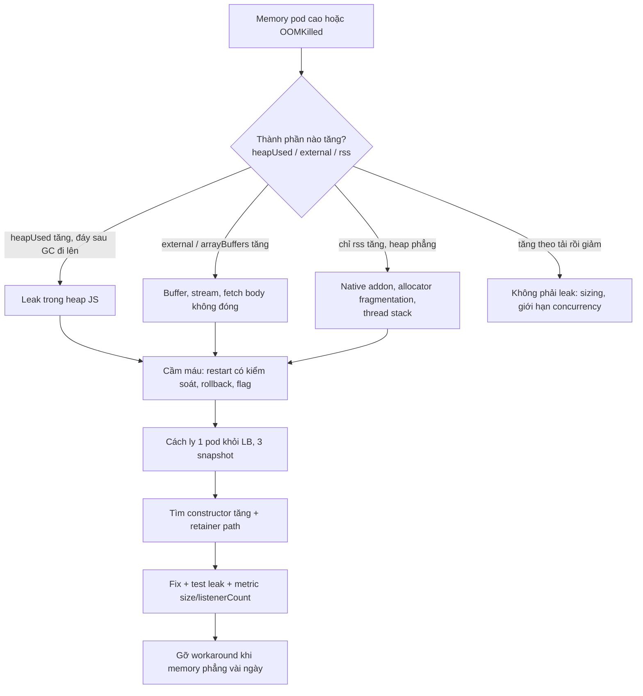
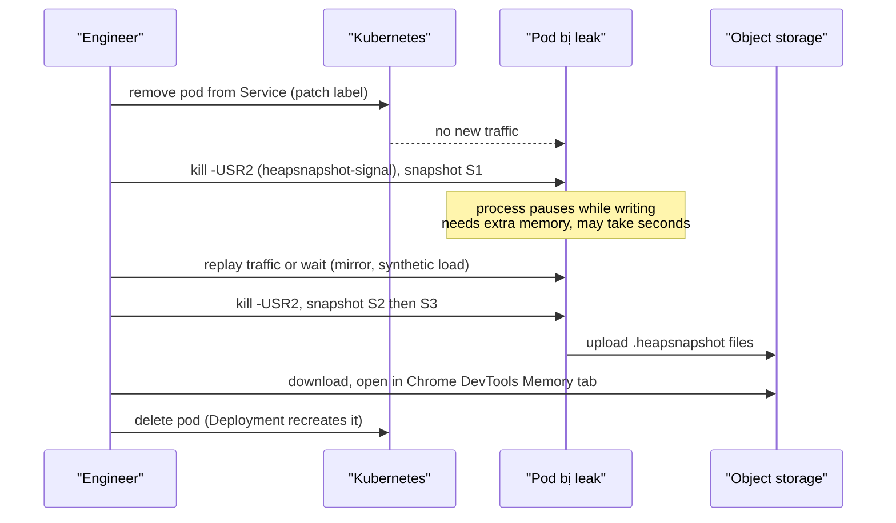

## Bối cảnh & vấn đề

Thứ Hai, một service Node bị `OOMKilled` lần đầu. Thứ Ba, lại bị. Dashboard cho thấy memory của mỗi pod đi lên gần như thẳng, khoảng 200 MB mỗi ngày, rồi rơi về đáy khi pod bị kill (exit code 137) và lại leo lên: hình **răng cưa** quen thuộc. Phản xạ đầu tiên của nhiều team là tăng memory limit từ 1 GiB lên 2 GiB. Kết quả: răng cưa dài gấp đôi, sự cố thưa hơn, nhưng mỗi lần kill vẫn làm mất các request đang chạy, và không ai biết vì sao.

Ngược lại, một team khác thấy pod đứng ở 1.2 GB RSS và lập tức gọi đó là "leak", rồi mất hai ngày đuổi theo một thứ không tồn tại: process chỉ đang dùng nhiều memory vì tải cao, và memory ổn định sau khi tải giảm. Cả hai sai lầm đều đến từ cùng một gốc: **không phân biệt được "dùng nhiều memory" và "memory không bao giờ được trả lại"**.

Bài này dạy quy trình đầy đủ: đọc số memory đúng cách để **chứng minh** có leak, **cầm máu** để production ổn định trong lúc tìm nguyên nhân, dùng **3-snapshot technique** để tìm object bị giữ và **retainer** (ai đang giữ nó), nhận ra các leak kinh điển trong code Node, và sizing heap cho container để process chết có kiểm soát thay vì bị kernel giết.

Nền tảng GC, generational heap và công cụ ở [memory, GC & leaks](/tracks/nodejs/learn/memory-gc-leaks) và [profiling](/tracks/nodejs/learn/observability-profiling). Phía CPU của cùng câu chuyện ở bài trước: [event loop và payload lớn](/tracks/scenario-scale/learn/event-loop-big-payloads).

## Khái niệm

### Các con số của process.memoryUsage()

**RSS** (resident set size) là toàn bộ memory vật lý mà process đang chiếm: heap JS, code, stack, Buffer, memory của native addon và phần allocator đã xin từ OS mà chưa trả lại. Kubernetes và cgroup kill theo con số gần với RSS (chính xác hơn là working set của container). **`heapTotal`** là kích thước heap V8 đã cấp, **`heapUsed`** là phần đang chứa object còn sống (hoặc chưa được GC dọn). **`external`** là memory ngoài heap do object JS sở hữu, chủ yếu là `Buffer`/`ArrayBuffer`; **`arrayBuffers`** là tập con của `external`.

Vì vậy RSS 1.2 GB tự nó không nói gì. Có thể là heap lớn vì cache hợp lệ, có thể là Buffer của upload đang chạy, có thể là allocator giữ lại memory sau một đỉnh tải (glibc malloc không luôn trả memory về OS ngay). Cần nhìn **từng thành phần theo thời gian** để biết phần nào đang lớn.

**Interview angle:** câu trả lời tốt tách RSS thành heap và ngoài heap, rồi hỏi "theo thời gian thì sao?" trước khi kết luận.

### Leak khác tải cao như thế nào

**Memory leak** trong ngôn ngữ có GC nghĩa là object không còn cần nữa nhưng vẫn **reachable** (có đường tham chiếu từ một root như biến global, module scope, closure đang sống, timer, listener), nên GC không được phép thu hồi. Dấu hiệu của leak là **baseline sau GC tăng theo thời gian hoặc theo số lượng sự kiện** (request, connection, job) và không trở về khi tải giảm.

Tải cao trông khác: memory tăng theo số request **đang xử lý**, rồi giảm khi tải giảm; sau một đợt GC lớn, `heapUsed` quay về mức cũ. Bằng chứng thuyết phục (card 043): biểu đồ `heapUsed` vài ngày (đáy của răng cưa GC đi lên hay phẳng), tương quan với traffic (đêm traffic thấp mà heap vẫn tăng là dấu hiệu leak), và so sánh heap snapshot cách nhau một khoảng thời gian có cùng một loại object tăng mãi.

### Root, retainer, shallow và retained size

GC bắt đầu từ các **root** (global object, stack hiện tại, handle của native) và đánh dấu mọi thứ đi tới được. **Retainer** của một object là object đang tham chiếu tới nó; **retainer path** là chuỗi tham chiếu từ root xuống object đó. Tìm leak thực chất là tìm retainer path: "cái `Socket` đã đóng này còn sống vì `priceBus._events.tick[1234]` là một closure tham chiếu tới nó".

**Shallow size** là kích thước của riêng object; **retained size** là tổng memory sẽ được giải phóng nếu object đó bị xoá (nó và mọi thứ chỉ nó giữ). Một `Map` có shallow size nhỏ nhưng retained size 300 MB là thủ phạm điển hình; sort theo retained size trong DevTools để thấy nó.

### 3-snapshot technique

Heap snapshot chụp toàn bộ object graph tại một thời điểm. Một snapshot riêng lẻ khó đọc vì app nào cũng có hàng triệu object. **3-snapshot technique** (card 044): (1) warm up app để cache hợp lệ, JIT, connection pool ổn định rồi chụp **S1**; (2) chạy workload nghi ngờ gây leak, chụp **S2**; (3) chạy thêm cùng workload, chụp **S3**. Trong DevTools mở S3, chọn view "Objects allocated between Snapshot 1 and Snapshot 2": những object được tạo trong giai đoạn 1→2 mà **vẫn còn sống ở S3** là ứng viên leak, vì phần tạm thời đã có cơ hội bị GC. View "Comparison" giữa S2 và S3 cho thấy constructor nào có `# Delta` dương đều đặn.

### Các leak kinh điển trong Node

- **Cache không giới hạn**: `Map`/object ở module scope chỉ `set` mà không xoá; TTL chỉ kiểm khi đọc nên entry hết hạn vẫn nằm đó (card 045).
- **Listener không gỡ**: `emitter.on()` trong handler theo connection/request, closure giữ socket và dữ liệu phiên; dấu hiệu là `MaxListenersExceededWarning` (card 046).
- **Timer không clear**: `setInterval` trong handler; timer là root nên mọi thứ closure chạm tới đều sống (card 046).
- **Resource không đóng**: body của `fetch` không đọc/huỷ giữ socket và buffer (card 047), stream không `destroy()`, file handle không `close()`.
- **Context sống lâu ngoài ý muốn**: `AsyncLocalStorage` store chứa object lớn bị "dính" vào resource sống lâu (card 050).
- **Closure giữ nhiều hơn bạn nghĩ**: một callback chỉ dùng `id` nhưng được tạo trong scope có `bigPayload`; trên thực tế engine có thể giữ cả scope dùng chung giữa các closure (verify hành vi cụ thể theo version V8).

### Heap limit và container limit

V8 có giới hạn cho **old space** (nơi object sống lâu nằm). Khi heap chạm giới hạn và GC không thu hồi được, Node chết với `FATAL ERROR: ... JavaScript heap out of memory`: chết có kiểm soát, có stack trace và có thể lấy heap snapshot. Nếu **cgroup** của container chạm limit trước, kernel giết process bằng `SIGKILL` (exit 137, `OOMKilled`): không log, không snapshot, request đang chạy mất sạch.

`--max-old-space-size=4096` trong container 2 GiB (card 048) làm V8 tin rằng còn rất nhiều chỗ, nên GC lười hơn, heap phình tới khi RSS vượt 2 GiB và kernel kill trước khi V8 kịp thấy áp lực. Quy tắc: old space khoảng **70–75% container limit** (1536 MB cho 2 GiB), phần còn lại cho young generation, Buffer/`external`, code, stack thread và allocator; workload nhiều Buffer (upload, zlib) cần tỷ lệ thấp hơn. Node bản mới tự tính heap mặc định theo memory khả dụng, có thể đọc cả cgroup limit (verify theo version), nhưng đừng dựa vào mặc định: set rõ và kiểm tra bằng `v8.getHeapStatistics().heap_size_limit`.

## Cơ chế hoạt động

### Quy trình: leak hay không, rồi làm gì



Bước đầu tiên luôn là **chia nhỏ con số**. Export `heapUsed`, `heapTotal`, `external`, `rss` thành metric riêng (hầu hết client Prometheus cho Node làm sẵn). Nếu chỉ có RSS từ Kubernetes, bạn không phân biệt được leak trong heap với Buffer bị giữ hay fragmentation. Nhánh "tăng theo tải rồi giảm" là kết luận hợp lệ: không có leak, chỉ cần limit lớn hơn, giới hạn concurrency (số upload song song, kích thước batch) hoặc streaming thay vì buffer.

Bước cầm máu đứng **trước** bước tìm nguyên nhân vì production phải ổn định ngay, còn root cause có thể mất một tuần. Nhưng cầm máu không được xoá bằng chứng: luôn giữ lại ít nhất một pod (hoặc snapshot tự động) để điều tra.

### Chụp snapshot an toàn trên production



Chụp heap snapshot là thao tác **dừng cả process** (stop-the-world) trong lúc V8 duyệt toàn bộ heap và ghi file; với heap 1 GB có thể mất từ vài giây tới hàng chục giây, và cần thêm memory đáng kể, có thể gần bằng kích thước heap (verify trên version của bạn). Làm trên pod đang nhận traffic nghĩa là mọi request trên pod đó đứng im, health check timeout, và nếu memory thêm đẩy RSS vượt limit thì pod bị OOMKill **giữa lúc chụp**. Vì thế: rút pod khỏi Service trước (đổi label để selector không khớp, Deployment sẽ tạo pod thay thế), đảm bảo còn headroom memory, rồi mới chụp.

Cách kích hoạt: khởi động process với `--heapsnapshot-signal=SIGUSR2` để gửi signal là có snapshot, hoặc expose một endpoint admin được bảo vệ gọi `v8.writeHeapSnapshot()`. Lưới an toàn: `--heapsnapshot-near-heap-limit=2` tự ghi tối đa 2 snapshot khi heap gần chạm limit, để lần crash tiếp theo để lại bằng chứng. Nếu pod không có traffic sau khi rút khỏi LB, cần mirror traffic hoặc tạo tải tổng hợp để leak tiếp tục xảy ra giữa S1 và S3. Nhớ rằng heap snapshot chứa **dữ liệu thật** (token, PII trong memory): xử lý file như dữ liệu nhạy cảm.

## Ví dụ thực tế

### Cache không giới hạn: đo heap theo vòng (card 045)

Code của card: `priceCache` là `Map` ở module scope, key gồm `tenantId:sku:currency:userId`, TTL 60 s chỉ được kiểm khi đọc. Không có chỗ nào xoá entry, và vì key có `userId`, số key bằng users × SKU × currency: không bị chặn trên. Script dưới mô phỏng 5 "ngày", mỗi ngày 200,000 key mới, rồi so với phiên bản giới hạn 10,000 entry (chạy thật với `node --expose-gc` trên Node 24, số liệu sẽ khác trên máy bạn).

```ts
const BOUNDED = process.env.BOUNDED === '1';
const cache = new Map<string, { value: unknown; at: number }>();
const MAX = 10_000;
function set(k: string, v: { value: unknown; at: number }) {
  if (BOUNDED && cache.size >= MAX) cache.delete(cache.keys().next().value!); // evict oldest insert
  cache.set(k, v);
}
const mb = (n: number) => (n / 2 ** 20).toFixed(0).padStart(4);
for (let round = 1; round <= 5; round++) {
  for (let i = 0; i < 200_000; i++)
    set(`t1:sku-${i % 5000}:VND:user-${round}-${i}`, { value: { amount: i, currency: 'VND' }, at: Date.now() });
  global.gc!(); // only to read a clean baseline in this demo
  const m = process.memoryUsage();
  console.log(`round=${round} entries=${String(cache.size).padStart(7)} heapUsed=${mb(m.heapUsed)}MB rss=${mb(m.rss)}MB`);
}
```

```text
# unbounded
round=1 entries= 200000 heapUsed=  64MB rss= 135MB
round=2 entries= 400000 heapUsed= 124MB rss= 220MB
round=3 entries= 600000 heapUsed= 192MB rss= 263MB
round=4 entries= 800000 heapUsed= 245MB rss= 321MB
round=5 entries=1000000 heapUsed= 299MB rss= 381MB
# BOUNDED=1
round=1 entries=  10000 heapUsed=   7MB rss= 109MB
round=2 entries=  10000 heapUsed=   7MB rss= 133MB
round=3 entries=  10000 heapUsed=   7MB rss= 134MB
round=4 entries=  10000 heapUsed=   7MB rss= 145MB
round=5 entries=  10000 heapUsed=   7MB rss= 153MB
```

Bản không giới hạn: `heapUsed` tăng tuyến tính (~60 MB mỗi vòng) **ngay cả sau GC cưỡng bức**, đúng dấu hiệu leak. Bản giới hạn: `heapUsed` phẳng ở 7 MB. Để ý RSS của bản giới hạn vẫn nhích lên dù heap phẳng: allocator và V8 giữ lại memory đã xin từ OS. Đó chính là lý do RSS một mình không chứng minh được leak (card 043).

Fix production: dùng `lru-cache` với `max` (số entry) hoặc `maxSize` + `sizeCalculation` (bytes) và `ttl`; xem lại key, vì giá thường phụ thuộc tier/nhóm khách hàng chứ không phụ thuộc từng `userId`, bỏ `userId` khỏi key giảm số key hàng nghìn lần. Cache cần chia sẻ giữa pod thì dùng Redis có TTL và `maxmemory-policy`. Export `priceCache.size` thành metric. `WeakMap` **không** phải fix: key của `WeakMap` phải là object, và entry chỉ được thu hồi khi key object không còn ai giữ, còn ở đây key là string được tạo mới mỗi lần.

### Snapshot diff trông như thế nào (card 044)

Output minh hoạ (không phải chạy thật) của view Comparison giữa S2 và S3 cho service trên:

```text
Constructor            # New    # Deleted   # Delta    Size Delta
(string)               412,880     1,204   +411,676   +26.3 MB
Object                 206,551       610   +205,941   +13.2 MB
(concatenated string)  200,004         0   +200,004    +6.4 MB
Array                    1,022     1,019         +3      +0.1 KB
```

Mở `Object` → chọn một instance → panel **Retainers** hiện: `value in Map @123456` ← `priceCache in system / Context` ← `getPrice()`. Retainer path dẫn thẳng vào biến module scope. Delta xấp xỉ bằng số request trong khoảng thời gian giữa hai snapshot là tín hiệu mạnh: mỗi request để lại một entry.

### WebSocket để lại listener và timer (card 046)

```ts
io.on('connection', (socket) => {
  const session = loadSessionSnapshot(socket.data.userId); // ~200 KB
  const onTick = (t: Tick) => {
    if (session.watchlist.includes(t.symbol)) socket.emit('tick', t);
  };
  priceBus.on('tick', onTick);
  const timer = setInterval(() => {
    socket.emit('heartbeat', { at: Date.now(), watched: session.watchlist.length });
  }, 10_000);

  socket.once('disconnect', () => {
    priceBus.off('tick', onTick); // closure no longer reachable from priceBus
    clearInterval(timer);         // timer no longer a GC root
  });
});
```

Code gốc gắn listener vào `priceBus` (sống suốt đời process) và tạo `setInterval` mà không bao giờ gỡ. Cả hai closure tham chiếu `socket` và `session` 200 KB, nên mỗi connection **từng mở** để lại ~200 KB cộng một socket chết, và mỗi tick còn tốn CPU gọi `emit` lên socket đã đóng: memory tăng theo tổng số connection từng có, đúng như mô tả của card. Bản sửa giữ reference tới handler và timer để gỡ chính xác trong `disconnect`. Thiết kế tốt hơn: dùng room theo symbol (`socket.join('sym:AAPL')`, một listener duy nhất `priceBus.on('tick', t => io.to('sym:' + t.symbol).emit('tick', t))`), số listener không còn phụ thuộc số connection.

Test bắt leak trước production: mở 1,000 connection, đóng hết, rồi assert `priceBus.listenerCount('tick') === 0` và số timer active (`process.getActiveResourcesInfo()`) trở về baseline.

### fetch body không được đọc (card 047)

```ts
async function check(url: string) {
  const res = await fetch(url, { signal: AbortSignal.timeout(2000) });
  if (!res.ok) {
    await res.body?.cancel(); // release the connection back to the pool
    return { url, ok: false, status: res.status };
  }
  return { url, ok: true, data: await res.json() };
}
```

`fetch` của Node (undici) giữ connection cho tới khi body được đọc hết hoặc huỷ. Nhánh lỗi của code gốc trả về mà không chạm body, nên connection không quay về pool; việc dọn dẹp phụ thuộc vào GC, mà GC không chạy theo lịch của bạn (undici docs khuyên luôn consume hoặc cancel body; verify chi tiết theo version). Chỉ khi một số service trả lỗi thì connection rò, và sau vài giờ (30 service × mỗi 5 s), pool cạn, request mới phải chờ connection và timeout. Tăng timeout không sửa gì. Đo: số socket ESTABLISHED (`ss -tanp | grep node | wc -l`) tăng theo thời gian, heap snapshot có nhiều `Response`/stream đang pending.

### AsyncLocalStorage giữ cả req (card 050)

```ts
// ❌ store holds the whole request: body, socket, headers
als.run({ req }, next);

// ✅ store holds small, immutable values
als.run({ requestId: req.id, tenantId: req.tenantId, userId: req.user?.id }, next);
```

Store của ALS được lan truyền vào **mọi async resource tạo ra trong context**: promise, timer, socket, listener. Nếu bên trong request A, code lần đầu khởi tạo lazy một singleton (connection pool, `setInterval` refresh config, promise cache dùng chung), resource sống lâu đó **thừa kế context của A** và giữ store mãi. Store chứa `req` thì giữ luôn body, socket, headers của A. Hệ quả kép: memory tăng, và log từ job nền chạy trong timer đó in ra `requestId` của A dù A đã xong từ hàng giờ trước. Fix: store chỉ chứa giá trị nhỏ; khởi tạo singleton/timer ở startup ngoài mọi request; job nền tự `als.run({ jobId }, ...)`; tránh `enterWith` vì nó đổi context của phần còn lại trong luồng đồng bộ hiện tại thay vì chỉ trong callback như `run`. Từ Node 24, ALS mặc định dùng cơ chế AsyncContextFrame (verify), nhưng nguyên tắc "context đi theo resource được tạo trong nó" không đổi.

### Sizing heap cho container (card 048)

```bash
node --max-old-space-size=1536 -e "console.log(require('v8').getHeapStatistics().heap_size_limit / 2**20, 'MB')"
# 1728 MB
node -e "console.log(require('v8').getHeapStatistics().heap_size_limit / 2**20, 'MB')"
# 4288 MB  (on a laptop with lots of RAM, no cgroup limit)
```

Chạy thật trên Node 24. Hai điều rút ra: `heap_size_limit` lớn hơn giá trị `--max-old-space-size` vì nó gồm cả young generation, nên budget thực cho heap cao hơn con số bạn đặt; và mặc định phụ thuộc môi trường, nên một image chạy ổn trên máy dev có thể có giới hạn hoàn toàn khác trong container. Với limit 2 GiB: `--max-old-space-size=1536`, cộng `--heapsnapshot-near-heap-limit=2`, rồi theo dõi `external` và RSS để xác nhận phần ngoài heap vừa đủ. Nếu pod bị OOMKill mà heap chỉ 600 MB, nhìn vào `external` (Buffer của upload/zlib), số thread, native addon (sharp, bcrypt) và fragmentation của allocator.

### Mitigation khi fix mất một tuần (card 049)

Pod OOMKill mỗi ~30 giờ. Trong lúc chờ fix:

1. **Restart có kiểm soát trước khi OOM**: rolling restart mỗi 24 giờ, hoặc process tự kiểm `heapUsed` vượt ngưỡng (vd 85% limit) thì fail readiness, drain request và thoát với graceful shutdown. Đủ replica và PodDisruptionBudget để restart không giảm capacity.
2. **Giảm tốc độ leak**: rollback version đầu tiên có răng cưa (so memory curve với lịch deploy), tắt feature nghi ngờ bằng flag, đặt giới hạn tạm cho cache.
3. **Thu bằng chứng**: `--heapsnapshot-near-heap-limit`, snapshot trên pod cách ly, alert theo **tốc độ tăng** của `heapUsed` (MB/giờ) chứ không chỉ ngưỡng tuyệt đối.
4. **Chống tạm thời thành vĩnh viễn**: ticket có owner và deadline, workaround ghi trong runbook kèm link ticket, metric leak rate trên dashboard, tiêu chí gỡ rõ ràng (memory phẳng 3 ngày sau fix). Một restart hàng đêm "mãi mãi" che giấu leak tiếp theo, làm mất cache warm mỗi ngày và sẽ hỏng ngay khi traffic tăng làm leak nhanh hơn chu kỳ restart.

### Kể lại một câu chuyện leak (card 060)

Câu hỏi behavioral cần cấu trúc rõ, số liệu thật và bài học. Khung mẫu (ẩn danh): service đồng bộ dữ liệu bị OOMKill mỗi hai ngày sau một release. **Thu hẹp**: tách metric thành heap và external, thấy `heapUsed` tăng còn `external` phẳng; so lịch deploy thấy răng cưa bắt đầu từ release có thêm cache kết quả theo user. **Chứng minh**: 3 snapshot trên pod cách ly, Comparison cho thấy `Object` và `(string)` tăng đúng bằng số request, retainer path dẫn tới `Map` ở module scope. **Thay đổi**: LRU có `max` và `ttl`, bỏ `userId` khỏi key, metric `cache_size`, test assert size bị chặn; trong lúc chờ release, restart có kiểm soát mỗi 24 giờ. **Kết quả và bài học**: memory phẳng, gỡ restart sau một tuần, thêm rule review "mọi cache ở module scope phải có giới hạn". Người phỏng vấn đánh giá cách bạn **chứng minh** chứ không chỉ cách bạn đoán.

## Trade-offs & lựa chọn thay thế

| Công cụ / cách làm | Cho biết gì | Chi phí | Dùng khi |
|---|---|---|---|
| Metric `memoryUsage()` theo thời gian | Leak hay tải, phần nào tăng | Gần như 0 | Luôn bật |
| Heap snapshot (3-snapshot) | Object nào, ai giữ | Dừng process, thêm memory, file chứa dữ liệu thật | Đã chứng minh leak heap |
| `--heapsnapshot-near-heap-limit` | Trạng thái ngay trước khi chết | Ghi file lớn lúc gần crash | Leak hiếm, khó tái hiện |
| Allocation timeline / sampling heap profiler | Code path nào allocate | Overhead khi bật | Biết leak, chưa biết chỗ tạo object |
| Metric chuyên biệt (`cache.size`, `listenerCount`) | Xu hướng của nghi phạm cụ thể | Phải biết nghi phạm | Sau fix, chống tái phát |
| Restart có kiểm soát | Không tìm gì, chỉ cầm máu | Mất cache warm, che giấu leak | Tạm thời, có deadline |
| Tăng memory limit | Kéo dài chu kỳ | Tiền, che giấu | Chỉ khi là tải thật, không phải leak |

**Khi nào chọn cái nào.** Metric chia thành phần luôn đi trước vì nó rẻ và trả lời câu hỏi đầu tiên: có phải leak không, và leak trong heap hay ngoài heap. Heap snapshot chỉ hữu ích cho leak **trong heap**; nếu `external` tăng, tìm Buffer/stream không đóng bằng cách đọc code đường upload/download và đếm socket, file handle. Sampling heap profiler phù hợp khi snapshot cho thấy "rất nhiều `Object`" nhưng retainer không rõ ràng, vì nó trả lời "object được tạo ở dòng code nào". Restart và tăng limit là công cụ cầm máu hợp lệ, miễn là có deadline và không thay cho việc tìm nguyên nhân.

## Edge cases & failure modes

- **OOMKill giữa lúc chụp snapshot**: snapshot cần thêm memory; pod gần limit sẽ bị kill và mất cả bằng chứng lẫn request. Rút khỏi LB, chụp khi còn headroom, hoặc dùng `--heapsnapshot-near-heap-limit` với limit được đặt đúng.
- **Leak ngoài heap**: snapshot sạch nhưng RSS tăng. Nghi phạm: Buffer giữ bởi stream không đóng, native addon, `zlib` không đóng, thread pool. Đếm `external`, file descriptor (`ls /proc/<pid>/fd | wc -l`), socket.
- **Fragmentation**: workload allocate nhiều Buffer kích thước khác nhau làm RSS cao dù heap và external ổn. Thử allocator khác (jemalloc qua `LD_PRELOAD`) hoặc giảm churn Buffer (verify trên image của bạn).
- **Leak chỉ xảy ra với một nhánh lỗi**: như card 047, staging không có service lỗi nên không tái hiện. Test riêng các nhánh lỗi và timeout.
- **Leak theo tenant/input hiếm**: một tenant có 1 triệu SKU làm cache phình. Giới hạn theo bytes, không chỉ theo số entry.
- **Heap gần limit, GC chạy liên tục**: trước khi crash, process dành phần lớn CPU cho GC, latency tăng vọt, health check fail. Triệu chứng giống CPU 100%; CPU profile cho thấy phần lớn là GC.
- **Snapshot chứa secrets/PII**: lưu có mã hoá, giới hạn quyền truy cập, xoá sau khi điều tra xong.
- **Liveness probe dựa trên memory**: kill thô bạo giữa request; dùng readiness + graceful shutdown để thoát chủ động.

## Pitfalls

- ❌ Thấy RSS 1.2 GB là kết luận leak → ✅ xem `heapUsed`/`external` theo thời gian, đáy sau GC có đi lên không, có tương quan với tải không.
- ❌ Tăng memory limit làm "fix" → ✅ chỉ là cầm máu kéo dài chu kỳ; tìm retainer.
- ❌ `--max-old-space-size` lớn hơn container limit → ✅ ~70–75% limit, kiểm tra `heap_size_limit`, để process chết có kiểm soát.
- ❌ Chụp heap snapshot trên pod đang nhận traffic → ✅ rút khỏi LB trước, đảm bảo headroom memory.
- ❌ So sánh chỉ hai snapshot ngay sau khởi động → ✅ warm up trước S1, dùng 3 snapshot để lọc object tạm.
- ❌ `Map` ở module scope làm cache với TTL kiểm khi đọc → ✅ LRU có `max`/`maxSize` + `ttl`, metric size.
- ❌ `emitter.on()`/`setInterval` trong handler theo connection mà không gỡ → ✅ gỡ trong `disconnect`/`close`, hoặc thiết kế room/subscription.
- ❌ Bỏ qua body của `fetch` ở nhánh lỗi → ✅ luôn `await res.body?.cancel()` hoặc đọc hết.
- ❌ Đặt `req` vào `AsyncLocalStorage` → ✅ chỉ ID nhỏ; khởi tạo singleton/timer ngoài request.
- ❌ Restart hàng đêm thành giải pháp vĩnh viễn → ✅ workaround có ticket, owner, deadline và tiêu chí gỡ.

## Tóm tắt

- RSS cao không phải bằng chứng leak; leak là **baseline sau GC tăng theo thời gian/sự kiện** và không giảm khi tải giảm.
- Tách `heapUsed`, `external`, `rss` thành metric riêng để biết leak nằm trong heap hay ngoài heap.
- Cầm máu trước (restart có kiểm soát, rollback, flag), nhưng giữ bằng chứng và đặt deadline cho workaround.
- 3-snapshot technique trên pod đã cách ly: object tạo giữa S1–S2 còn sống ở S3 là ứng viên; đọc retainer path để biết ai giữ.
- Leak kinh điển: cache không giới hạn, listener và timer không gỡ, body/stream không đóng, ALS store chứa object lớn.
- `--max-old-space-size` ≈ 70–75% container limit để Node chết có kiểm soát thay vì bị OOMKill; dùng `--heapsnapshot-near-heap-limit` làm lưới an toàn.
- Sau fix: metric cho nghi phạm (`cache.size`, `listenerCount`), test leak, và rule review để không tái phát.
