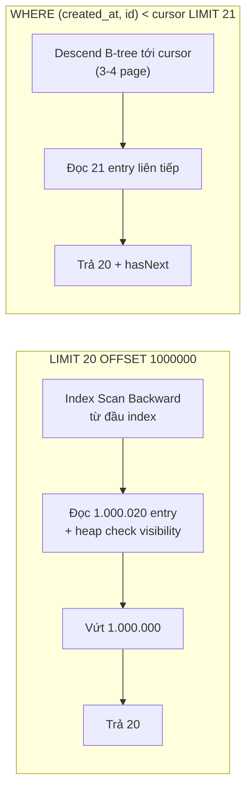
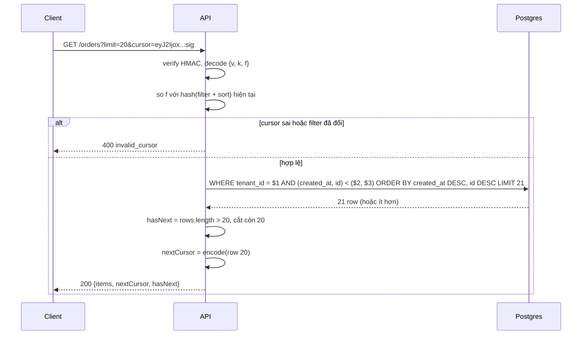

## Bối cảnh & vấn đề

Endpoint `GET /orders?page=1` trả trong 20 ms. Một ngày, alert p99 kêu: vài request mất 4 giây, và log cho thấy chúng đều là `page=5000`. Không có deploy, không có thay đổi index. Cùng tuần, support chuyển tới ticket "lúc scroll danh sách đơn, có đơn hiện hai lần, có đơn không bao giờ hiện". Hai triệu chứng nghe như hai bug riêng, nhưng chung một gốc: API dùng **offset pagination** (`LIMIT 20 OFFSET (page-1)*20`), và offset mô tả **vị trí** trong kết quả chứ không mô tả **row nào**.

Bài này là playbook cho họ câu hỏi "list endpoint chậm / sai ở trang sau". Nó không dạy lại B-tree hay planner từ đầu. Nếu chưa chắc về cấu trúc index, đọc [B-tree index](/tracks/sql-postgres/learn/btree-indexes) và [đọc EXPLAIN](/tracks/sql-postgres/learn/planner-explain) trước. Phần thiết kế API (query param, response envelope, sort allow-list) nằm ở [Pagination, filtering & sorting](/tracks/api-design/learn/pagination-filtering). Ở đây ta tập trung vào **tình huống production**: đo thế nào, chọn gì, cái gì vỡ, và verify ra sao.

Mọi con số trong bài đến từ một lab thật: PostgreSQL 18.6 trong Docker, bảng `orders` 5 triệu row (982 MB kèm index), cứ 3 row chung một `created_at` (giống bulk import), tenant 42 chiếm 2 triệu row. Máy lab là laptop dùng chung với nhiều container khác nên số tuyệt đối dao động; **tỉ lệ** giữa các cách mới là thứ đáng nhớ.

**Interview angle:** câu đầu tiên interviewer muốn nghe là một câu hỏi ngược: "API đang dùng OFFSET hay cursor? sort theo cột nào, có index khớp không, ai đang gọi page 5.000?". Trả lời "thêm index" ngay là red flag, vì index thường đã được dùng rồi.

## Khái niệm

### Offset pagination

**Offset pagination** là "bỏ qua n row đầu của kết quả đã sort rồi lấy k row": `ORDER BY created_at DESC LIMIT 20 OFFSET 100000`. Nó hấp dẫn vì đơn giản và cho phép **nhảy trang** (page 1, 2, … 500). Vấn đề là database không có cách nào "nhảy" tới row thứ 100.000: B-tree lưu khoá theo thứ tự nhưng **không lưu số thứ tự** (rank) của từng entry. Vì vậy executor phải đi qua 100.020 entry, với mỗi entry thường còn phải ghé heap để kiểm tra visibility (MVCC), rồi vứt 100.000 entry đầu.

Kết quả: chi phí tuyến tính theo offset, **O(offset + limit)**. Index chỉ giúp khỏi phải sort, không giúp bỏ qua. Ngoài ra offset neo vào vị trí, nên khi có row mới chen lên đầu giữa hai lần gọi, mọi row bị đẩy xuống và trang sau lặp lại vài row của trang trước.

### Keyset (seek) pagination

**Keyset pagination** (còn gọi seek method hay cursor pagination) lấy trang tiếp theo **từ giá trị khoá sort của row cuối** trang trước: `WHERE (created_at, id) < ($lastTs, $lastId) ORDER BY created_at DESC, id DESC LIMIT 21`. Với index `(created_at, id)`, planner **seek** thẳng tới vị trí của cursor trong B-tree (O(log n)) rồi đọc đúng 21 entry. Chi phí gần như hằng số ở mọi độ sâu.

Cái giá: không nhảy trang được (không biết trang 500 bắt đầu từ giá trị nào nếu chưa đi qua 499 trang), cursor gắn chặt với một kiểu sort cụ thể, và khoá sort phải là **thứ tự toàn phần** (total order). Ví dụ: feed, infinite scroll, API public, sync job đều hợp với keyset.

### Tie-breaker

**Tie-breaker** là cột unique thêm vào cuối khoá sort để không có hai row "bằng nhau". `ORDER BY created_at` một mình không phải thứ tự toàn phần khi nhiều row trùng timestamp (bulk import trong cùng một giây, hoặc độ chính xác millisecond của client). Khi đó thứ tự giữa các row trùng **không xác định**, và cursor chỉ chứa `created_at` sẽ hoặc bỏ sót (dùng `<`) hoặc lặp (dùng `<=`) các row cùng nhóm ở biên trang. Thêm `id` vào cả `ORDER BY`, cursor và index là cách sửa chuẩn.

### Row value comparison

`(a, b) < (x, y)` trong Postgres là **so sánh theo thứ tự từ điển**: tương đương `a < x OR (a = x AND b < y)`. Postgres dùng được index composite `(a, b)` cho biểu thức này như một **Index Cond** (plan ở phần ví dụ hiện `Index Cond: (ROW(created_at, id) < ROW(...))`). Điều kiện ngầm: **cả hai cột cùng chiều** so sánh. Nếu sort `created_at DESC, id ASC` (mixed direction), row value cho kết quả sai. SQL Server không hỗ trợ row value comparison, nên luôn phải viết dạng `OR` mở rộng.

### Opaque cursor

**Opaque cursor** là chuỗi client nhận về và gửi lại nguyên vẹn, không được hiểu cấu trúc bên trong. Thường là `base64url(JSON{v, k, f})`: `v` là version format, `k` là giá trị khoá của row cuối, `f` là hash của filter + sort lúc tạo cursor. "Opaque" **không** có nghĩa là bí mật: base64 ai cũng decode được. Muốn chống sửa tay thì ký **HMAC** (`payload.sig`); muốn giấu hẳn nội dung thì mã hoá (AES-GCM). Nền tảng về HMAC và so sánh constant-time có ở [Hashing, encryption và secrets](/tracks/web-security/learn/crypto-secrets).

### Total count và capped count

`count(*)` với filter phải đếm mọi row khớp. Postgres không có counter sẵn cho mỗi filter (MVCC: mỗi transaction có thể thấy số row khác nhau). Keyset không giải quyết count. Ba lựa chọn rẻ hơn: **capped count** (`count(*) FROM (... LIMIT 10001)` → "10.000+"), **ước lượng** từ `EXPLAIN` (`Plan Rows`), hoặc **counter/summary table** cập nhật theo event.

### Deferred join và seek table

Khi buộc phải có "nhảy tới trang 500", **deferred join** chạy OFFSET trên một index hẹp chỉ để lấy `id` (index-only scan, không ghé heap của row bị vứt), rồi join lấy cột đầy đủ cho đúng 50 id. Vẫn O(n) nhưng hằng số nhỏ hơn nhiều. **Seek table** đi xa hơn: job định kỳ lưu mốc `(created_at, id)` của mỗi trang thứ 100; nhảy trang 500 = seek tới mốc gần nhất rồi OFFSET nhỏ.

### Deep paging trong Elasticsearch

Elasticsearch phân trang bằng `from + size`, nhưng mỗi shard phải trả `from + size` hit cho coordinating node gộp và sort, nên chi phí nhân theo số shard. Vì thế có giới hạn `index.max_result_window` (mặc định 10.000). Deep paging đúng cách là **`search_after`** (keyset của ES) với sort có tie-breaker, cộng **PIT** (point in time) để kết quả ổn định giữa các request. Chi tiết query DSL có ở [Query DSL, BM25 & phân trang sâu](/tracks/nosql-search/learn/query-dsl-relevance).

**Interview angle:** nói được "OFFSET là O(n) vì B-tree không lưu rank" và "keyset cần khoá sort unique" là hai câu phân biệt người hiểu cơ chế với người thuộc từ khoá.

## Cơ chế hoạt động

### OFFSET đọc và vứt, keyset seek



Bên trái, executor không có "lối tắt": node `Limit` phía trên chỉ biết đếm row đi qua nó, nên node scan phía dưới phải sinh ra 1.000.020 row. Mỗi row sinh ra thường kéo theo một lần ghé heap (trừ khi index-only scan và page all-visible). Bên phải, điều kiện cursor là **Index Cond**, nên B-tree được dùng để định vị điểm bắt đầu, giống tra từ điển: đi từ root xuống leaf, rồi đọc tiếp theo chiều sort. Số page chạm vào không phụ thuộc cursor nằm sâu bao nhiêu.

### Vòng đời một request keyset



Ba chi tiết đáng chú ý. Thứ nhất, lấy `limit + 1` row để biết `hasNext` mà không cần `COUNT`. Thứ hai, cursor là **input của user**: phải verify chữ ký, kiểm tra version, kiểm tra kiểu dữ liệu, và vẫn truyền vào SQL bằng parameter. Thứ ba, nếu filter hoặc sort đổi mà client gửi cursor cũ, server **từ chối rõ ràng** thay vì trả một trang vô nghĩa.

### Trang trước: đảo điều kiện và chiều sort

Đi lùi từ row đầu tiên của trang hiện tại: đảo dấu so sánh (`>`), đảo chiều sort (`ASC, ASC`), lấy `n + 1`, cắt còn `n` (row thừa là row **xa nhất** theo chiều đi lùi, chính là dấu hiệu `hasPrevious`), rồi **reverse** để trả lại đúng thứ tự hiển thị. Cùng một index `(created_at, id)` phục vụ cả hai chiều vì B-tree scan được xuôi lẫn ngược. Không cần giữ "stack cursor" trên server.

**Interview angle:** vẽ được hai nhánh của sơ đồ đầu và giải thích vì sao `Limit` không thể đẩy "bỏ qua n row" xuống index là đủ cho câu 001.

## Ví dụ thực tế

### Đo OFFSET và keyset trên 5 triệu row

Lab: bảng `orders(id, tenant_id, created_at, status, total, email, note, shipped_at)`, index `(created_at, id)` và `(tenant_id, created_at, id)`, `VACUUM ANALYZE` xong. Script Node đo median của 3–5 lần chạy cùng một query:

```ts
// bench.mjs (rút gọn): đo median thời gian một query qua pg Pool
const q = "SELECT id, created_at, total FROM orders ORDER BY created_at DESC, id DESC LIMIT 20 OFFSET $1";
for (const off of [0, 10_000, 100_000, 1_000_000, 4_000_000]) await median(`OFFSET ${off}`, q, [off]);
const c = (await pool.query("SELECT created_at, id FROM orders ORDER BY created_at DESC, id DESC OFFSET 3999999 LIMIT 1")).rows[0];
await median("keyset after row 4,000,000",
  "SELECT id, created_at, total FROM orders WHERE (created_at, id) < ($1, $2) ORDER BY created_at DESC, id DESC LIMIT 21",
  [c.created_at, c.id]);
```

```text
OFFSET 0                           median 1.5 ms
OFFSET 10,000                      median 3.7 ms
OFFSET 100,000                     median 9.2 ms
OFFSET 1,000,000                   median 726.8 ms
OFFSET 4,000,000                   median 21186.1 ms
keyset after row 4,000,000         median 2.2 ms
```

Từ 100k tới 1M, thời gian tăng gần 80 lần chứ không phải 10 lần, vì vùng index/heap cần đọc không còn nằm gọn trong `shared_buffers` 256 MB và bắt đầu đọc từ disk. Đây là điều thường thấy ở production: OFFSET không chỉ tuyến tính mà còn "rơi khỏi cache" khi đủ sâu. `EXPLAIN (ANALYZE, BUFFERS)` cho thấy rõ cơ chế:

```text
-- OFFSET 1000000
Limit (actual rows=20.00 loops=1)
  Buffers: shared hit=14381 read=3448
  ->  Index Scan Backward using orders_created_id on orders (actual rows=1000020.00 loops=1)

-- keyset ở độ sâu 4.000.000
Limit (actual rows=21.00 loops=1)
  Buffers: shared hit=3 read=1
  ->  Index Scan Backward using orders_created_id on orders (actual rows=21.00 loops=1)
        Index Cond: (ROW(created_at, id) < ROW('2023-02-08 13:55:30+00'::timestamp with time zone, 1000001))
```

Đọc dòng `actual rows=1000020` dưới `Limit rows=20`: đó là bằng chứng "đọc rồi vứt". Keyset chạm **4 buffer** ở độ sâu 4 triệu.

### Tie-breaker: tái hiện bug "thiếu đơn ở biên trang"

Dữ liệu lab có 3 row chung mỗi `created_at`. Đi qua 3.000 row mới nhất với page size 20, ba cách viết cursor:

```ts
// BUG: cursor chỉ có created_at
`... AND ($1::timestamptz IS NULL OR created_at ${op} $1) ORDER BY created_at DESC LIMIT 20`
// FIX: tie-breaker + row value
`... AND ($1::timestamptz IS NULL OR (created_at, id) < ($1, $2)) ORDER BY created_at DESC, id DESC LIMIT 20`
```

```text
cursor created_at < : returned 2858, distinct 2858, missing 142, duplicates 0
cursor created_at <=: returned 3335, distinct 3000, missing 0, duplicates 335
cursor (created_at,id) < : returned 3000, distinct 3000, missing 0
```

Dùng `<` thì mất 142 row (mỗi lần biên trang rơi giữa một nhóm 3 row trùng timestamp, phần còn lại của nhóm bị bỏ qua). Dùng `<=` thì không mất nhưng lặp 335 row, và nếu một nhóm trùng lớn hơn page size, client **kẹt vĩnh viễn** ở cùng một trang. Chỉ cursor có tie-breaker cho đúng 3.000/3.000. Lưu ý: `OR ... IS NULL` cho trang đầu tiện nhưng có thể làm planner khó dùng index; production nên viết hai query (có cursor và không cursor) hoặc dựng SQL động (câu follow-up của 003).

### Mixed direction: row value sai, OR đúng

Yêu cầu "mới nhất trước, cùng timestamp thì id nhỏ trước" = `ORDER BY created_at DESC, id ASC`. Cursor là row `(00:00:30, id 9)`; các row tiếp theo đúng phải là id 10, 11 (cùng 00:00:30) rồi 6:

```text
-- BUG: (created_at, id) < ('2023-01-01 00:00:30', 9)
 id |       created_at
  6 | 2023-01-01 00:00:20+00      ← mất id 10, 11
  7 | 2023-01-01 00:00:20+00
  8 | 2023-01-01 00:00:20+00
-- FIX: created_at < $1 OR (created_at = $1 AND id > $2)
 10 | 2023-01-01 00:00:30+00
 11 | 2023-01-01 00:00:30+00
  6 | 2023-01-01 00:00:20+00
```

Dạng `OR` đúng nhưng planner không biến nó thành điểm seek. Trên bảng 300k row với index `(created_at DESC, id ASC)`, plan của `OR` thuần là `Filter` + `Rows Removed by Filter: 66718`. Thêm một điều kiện **dư thừa nhưng sargable** cho cột đầu biến nó thành seek:

```sql
WHERE created_at <= $1 AND (created_at < $1 OR id > $2)
ORDER BY created_at DESC, id ASC LIMIT 20;
-- Index Only Scan using ev_mixed on ev
--   Index Cond: (created_at <= '2023-01-10 00:00:00+00')
--   Filter: ((created_at < '2023-01-10 00:00:00+00') OR (id > 77000))
--   Buffers: shared hit=4 read=1      (so với hit=993 read=258 của OR thuần)
```

### NULL trong cột sort

Tenant 42 có 2.000.000 row, 500.000 row `shipped_at IS NULL`. Với cursor naive:

```text
-- (shipped_at, id) < ('2100-01-01', 0)       → reachable = 1.500.000   (mất toàn bộ 500k row NULL)
-- (shipped_at, id) < (NULL, 4999990)         → reachable = 0           (cursor nằm trên row NULL: trang rỗng)
SELECT (NULL::int, 1) < (5, 2);               → NULL, không phải true
```

So sánh với NULL ra NULL, mà `WHERE` chỉ giữ row có điều kiện **true**. Cách sửa là cursor **hai pha** (đi hết phần non-NULL, rồi chuyển sang `shipped_at IS NULL AND id < $lastId`, cursor mang cờ `phase`), hoặc sort theo `COALESCE(shipped_at, '-infinity')` với expression index khớp đúng biểu thức. Nhớ rằng mặc định Postgres đặt NULL **cuối khi ASC, đầu khi DESC**, nên phải ghi rõ `NULLS LAST` cả trong `ORDER BY` lẫn index.

### Trang trước

Trang hiện tại (page size 4, DESC/DESC) bắt đầu ở `(00:00:10, 233285)`. Trang trước:

```sql
SELECT id, created_at FROM (
  SELECT id, created_at FROM ev WHERE (created_at, id) > ('2023-01-10 00:00:10+00', 233285)
  ORDER BY created_at ASC, id ASC LIMIT 5) p          -- n + 1
ORDER BY created_at DESC, id DESC;
-- 233290 | 00:00:30   ← row thừa (xa nhất) → hasPrevious = true, cắt bỏ
-- 233289 | 00:00:30
-- 233288 | 00:00:20
-- 233287 | 00:00:20
-- 233286 | 00:00:20
```

Trong code: lấy rows theo ASC, `hasPrev = rows.length > n`, `items = rows.slice(0, n).reverse()`. Cắt **trước** khi reverse, nếu không bạn sẽ vứt nhầm row gần nhất.

### Cursor opaque có chữ ký và filter hash

```ts
import { createHash, createHmac, timingSafeEqual } from "node:crypto";
type Cursor = { v: 1; k: [string, string]; f: string };   // k = [created_at ISO, id as string]
const KEY = process.env.CURSOR_KEY!;
const sign = (p: string) => createHmac("sha256", KEY).update(p).digest("base64url");
export const filterHash = (filter: object, sort: string) =>
  createHash("sha256").update(JSON.stringify({ filter, sort })).digest("base64url").slice(0, 16);

export function encodeCursor(c: Cursor): string {
  const p = Buffer.from(JSON.stringify(c)).toString("base64url");
  return `${p}.${sign(p)}`;
}
export function decodeCursor(s: string, expectedF: string): Cursor {
  const [p, sig] = s.split(".");
  const want = p ? Buffer.from(sign(p)) : Buffer.alloc(0);
  if (!p || !sig || Buffer.byteLength(sig) !== want.length || !timingSafeEqual(Buffer.from(sig), want))
    throw new Error("invalid_cursor");
  const c = JSON.parse(Buffer.from(p, "base64url").toString());
  if (c.v !== 1 || c.f !== expectedF || !Array.isArray(c.k) || Number.isNaN(Date.parse(c.k[0])) || !/^\d+$/.test(c.k[1]))
    throw new Error("invalid_cursor");
  return c;
}
```

```text
> const f = filterHash({ status: "paid" }, "created_at:desc")
> const c = encodeCursor({ v: 1, k: ["2026-09-01T10:00:00.123Z", "98231"], f })
'eyJ2IjoxLCJrIjpbIjIwMjYtMDktMDFUMTA6MDA6MDAuMTIzWiIsIjk4MjMxIl0sImYiOiJ...'
> decodeCursor(c, filterHash({ status: "open" }, "created_at:desc"))
Uncaught Error: invalid_cursor
```

(minh hoạ: output REPL rút gọn.) Lưu ý `timingSafeEqual` **throw** nếu hai buffer khác độ dài, nên kiểm độ dài trước. Giữ `id` dạng string vì `bigint` vượt `Number.MAX_SAFE_INTEGER`. Timestamp phải giữ đủ độ chính xác: `timestamptz` của Postgres có microsecond, còn `Date` của JS chỉ có millisecond, nên cursor dựng từ `Date` có thể lệch biên. Cách an toàn là select thêm `created_at::text` hoặc dùng `id` có thứ tự thời gian (UUIDv7, snowflake) làm khoá sort.

### Total count: ba cách và cái giá

Tenant 42, `status = 'paid'` (500.000 row), có index `(tenant_id, status)`:

```text
{ exact: 500000, estimate: 499400 }
exact count(*)                     median 102.0 ms
capped count LIMIT 10001           median 3.7 ms
EXPLAIN estimate                   median 3.6 ms
```

Với 500k row, count chính xác còn chịu được (102 ms vì là index-only scan trên index hẹp). Nó tăng tuyến tính: 12 triệu row là vài giây, và tệ hơn nhiều khi visibility map không cập nhật (phải ghé heap). Estimate ở đây lệch 0,1% vì filter đơn giản. Với filter có các cột tương quan, estimate có thể lệch hàng chục lần (xem [query chậm](/tracks/scenario-data/learn/slow-query-triage)).

### Jump-to-page bằng deferred join

Tenant 42, page size 50:

```text
plain OFFSET page 500              median 23.0 ms
deferred join page 500             median 9.1 ms
plain OFFSET page 10,000           median 1745.7 ms
deferred join page 10,000          median 86.3 ms
```

Plan của deferred join ở page 10.000: subquery là `Index Only Scan Backward using orders_tenant_created_id ... (actual rows=500000) Heap Fetches: 0`, sau đó chỉ 50 lần `Index Scan using orders_pkey`. Buffers giảm từ 22.280 xuống 2.678. Điều kiện để có `Heap Fetches: 0` là visibility map đã được VACUUM đánh dấu; bảng ghi nhiều hoặc có transaction dài giữ xmin thì index-only scan quay về ghé heap (follow-up của 008, xem [MVCC & VACUUM](/tracks/sql-postgres/learn/mvcc-vacuum)).

### N+1 và JOIN + LIMIT trong list endpoint

Bảng `order_items` 900k row. Hai bug của câu 057, đo thật:

```text
N+1 (no FK index): 21 queries, 2276 ms
N+1 (FK index):    21 queries, 141 ms
JOIN ... LIMIT 20: 20 rows but 7 distinct orders; last order 299994 got 4 items (has 5)
LATERAL fix: 1 query, 20 orders, 60 items, 11 ms
ANY($ids) fix: 2 queries total, 60 items, 54 ms for the items query
```

N+1 tốn round-trip tuyến tính theo page size; thiếu index trên `order_items.order_id` (Postgres không tự tạo index cho cột FK) làm mỗi query con thành seq scan. "Fix" bằng JOIN thì `LIMIT 20` đếm **row đã join**, nên trang chỉ còn 7 đơn và đơn cuối bị cắt mất item. Sửa đúng: phân trang **bảng cha trước** (subquery với keyset), rồi lấy con bằng `= ANY($ids)` hoặc `LATERAL json_agg`:

```sql
SELECT o.*, coalesce(it.items, '[]') AS items
FROM (SELECT * FROM orders WHERE tenant_id = $1 AND (created_at, id) < ($2, $3)
      ORDER BY created_at DESC, id DESC LIMIT 21) o
LEFT JOIN LATERAL (
  SELECT json_agg(i ORDER BY i.id) AS items FROM order_items i WHERE i.order_id = o.id
) it ON true
ORDER BY o.created_at DESC, o.id DESC;
```

Nền tảng N+1 và DataLoader có ở [Truy cập dữ liệu từ app](/tracks/sql-postgres/learn/access-patterns).

### Relay connection map sang keyset

Relay Cursor Connections chuẩn hoá đúng ý tưởng trên: args `first`/`after` (tiến), `last`/`before` (lùi); response `edges { cursor node }` và `pageInfo { hasNextPage hasPreviousPage startCursor endCursor }`. Map sang SQL: `after` → decode → `(created_at, id) < (...)`, `LIMIT first + 1`; `last/before` → đảo điều kiện và chiều sort, `LIMIT last + 1`, reverse. Mỗi edge có cursor riêng nên client tiếp tục được từ bất kỳ item nào. Spec cho phép gửi cả `first` và `last` nhưng **khuyên không nên** vì kết quả khó hiểu; server có thể trả lỗi validation cho trường hợp đó (verify với phiên bản spec bạn theo). `totalCount` không thuộc spec lõi; nếu có, chỉ resolve khi client xin và có thể là ước lượng. Phía GraphQL server xem [GraphQL và gRPC](/tracks/api-design/learn/graphql-grpc).

### Elasticsearch: UI vs export 40M document

```ts
const pit = await es.openPointInTime({ index: "products", keep_alive: "2m" });
let after: unknown[] | undefined;
try {
  for (;;) {
    const r = await es.search({
      size: 5000, pit: { id: pit.id, keep_alive: "2m" },
      sort: [{ updated_at: "desc" }, { product_id: "asc" }],   // tie-breaker unique
      ...(after && { search_after: after }),
    });
    if (r.hits.hits.length === 0) break;
    await sink(r.hits.hits);
    after = r.hits.hits.at(-1)!.sort;
  }
} finally {
  await es.closePointInTime({ id: pit.id });
}
```

(minh hoạ: không chạy trong lab.) Với UI, giới hạn số trang (người dùng hiếm khi đi quá vài chục trang) và dùng `search_after`. Với data team cần 40M document, câu trả lời tốt nhất thường là **export từ source of truth** (DB/data lake) chứ không cào cluster search; nếu buộc phải đọc ES thì `search_after` + PIT (có thể sliced song song), và luôn đóng PIT vì PIT mở giữ segment cũ không cho merge xoá (tốn disk và heap). Tăng `max_result_window` lên 10 triệu chỉ dời vấn đề vào heap của coordinating node.

## Trade-offs & lựa chọn thay thế

| Cách | Chi phí trang sâu | Nhảy trang | Ổn định khi data đổi | Độ phức tạp | Hợp khi |
|---|---|---|---|---|---|
| OFFSET | O(offset) | Có | Trùng/sót khi insert/delete | Thấp | Admin, dataset nhỏ, page ≤ ~100 |
| Keyset | ~hằng số | Không | Tốt (neo vào giá trị) | Trung bình | Feed, infinite scroll, API public, sync |
| Deferred join + OFFSET | O(offset) nhưng rẻ hơn 5–20x | Có | Như OFFSET | Trung bình | Back-office buộc có "trang 500" |
| Seek table | ~hằng số + OFFSET nhỏ | Gần đúng | Stale theo chu kỳ job | Cao | Jump-to-page trên bảng rất lớn |
| ES `from/size` | Nhân theo shard | Có | Đổi theo refresh | Thấp | ≤ 10.000 hit đầu |
| ES `search_after` + PIT | ~hằng số | Không | Ổn định trong PIT | Trung bình | Deep paging, export từ ES |

Chọn theo **câu hỏi sản phẩm**, không theo sở thích. Nếu người dùng chỉ scroll tiếp, keyset là mặc định. Nếu product nói "người dùng thật sự vào trang 5.000", hỏi tiếp họ đang **tìm gì**: thường là tìm một đơn cụ thể (thiếu filter/search) hoặc đang export bằng tay (thiếu export API). Khi phải giữ jump-to-page, kết hợp: keyset cho next/prev, deferred join cho nhảy trang, chặn độ sâu tối đa hoặc buộc filter theo khoảng ngày, chạy trên replica với `statement_timeout` riêng.

Total count cũng là một quyết định sản phẩm. "12.345.678 kết quả" hiếm khi giúp ai; "10.000+" thường đủ. Nếu finance cần số chính xác theo status mỗi 5 giây cho 2.000 tenant, đó không còn là count trong request mà là **summary table** cập nhật theo event (hoặc trigger), đọc O(1).

## Edge cases & failure modes

- **Cột sort bị sửa**: keyset theo `price` mà khách sửa giá của row đang làm cursor. Cursor mang **giá trị cũ** nên vẫn chạy đúng về mặt SQL, nhưng row đó có thể xuất hiện lại ở trang sau hoặc biến mất. Với cột mutable, chấp nhận và để client dedupe theo id, hoặc sort theo cột bất biến.
- **Độ chính xác timestamp**: cursor dựng từ JS `Date` (ms) trên cột `timestamptz` (µs) làm `(created_at, id) < (...)` lệch ở biên. Dùng text ISO đầy đủ hoặc khoá sort là id có thời gian.
- **Cursor cũ sau khi đổi sort/index**: mobile cache cursor nhiều ngày. Version `v` trong cursor cho phép server đọc format cũ trong giai đoạn chuyển, hoặc trả `400 invalid_cursor` để client tải lại từ đầu. Xoay HMAC key thì chấp nhận nhiều key cùng lúc.
- **Index không khớp chiều**: index `(created_at, id)` phục vụ `DESC, DESC` (scan ngược) nhưng không phục vụ `DESC, ASC`; plan sẽ là sort hoặc filter dài.
- **Tenant khổng lồ**: cùng query keyset rất nhanh cho tenant 1.000 row nhưng trang đầu của tenant 20M row với filter hiếm (`status = 'disputed'`) có thể phải đi qua rất nhiều entry trước khi gom đủ 20 row khớp. Index phải chứa cả cột filter: `(tenant_id, status, created_at, id)` hoặc partial index.
- **Crawler/script gọi page sâu**: một client tự động đi qua toàn bộ list bằng OFFSET tạo tải O(n²) tổng. Rate limit theo client, chặn độ sâu, đưa họ sang export API.
- **ES PIT quên đóng**: PIT giữ segment cũ, disk và heap tăng tới khi `keep_alive` hết hạn; job chết giữa chừng mà keep_alive dài thì giữ lâu.
- **Facet count lệch số kết quả**: `terms` aggregation trên nhiều shard là xấp xỉ, và refresh giữa hai request làm hai số khác nhau (chi tiết ở [bài reporting & read model](/tracks/scenario-data/learn/reporting-read-models-guardrails)).

## Pitfalls

- ❌ "Page sâu chậm → thêm index" → ✅ đọc `EXPLAIN (ANALYZE, BUFFERS)`: index đã được dùng, `actual rows` của node scan là offset + limit. Vấn đề là OFFSET, không phải thiếu index.
- ❌ Cursor chỉ có `created_at` → ✅ khoá sort unique `(created_at, id)` ở cả `ORDER BY`, cursor và index. Đổi `<` thành `<=` rồi dedupe ở client chỉ đổi "sót" thành "lặp" và có thể kẹt trang.
- ❌ Row value `(a, b) < (x, y)` cho sort mixed direction → ✅ viết `OR` mở rộng, thêm điều kiện dư thừa sargable cho cột đầu, index khớp chiều. Hoặc hỏi product có thật cần mixed direction không.
- ❌ Cursor base64 không ký, chứa offset hoặc tenant id → ✅ HMAC + version + filter hash, validate kiểu sau khi decode, vẫn dùng parameterized query.
- ❌ `count(*)` chính xác cho mọi list → ✅ capped count, estimate, hoặc summary table; hỏi product cần chính xác tới đâu.
- ❌ Bỏ qua NULL trong cột sort → ✅ cursor hai pha hoặc `COALESCE` + expression index, ghi rõ `NULLS LAST`.
- ❌ Sửa N+1 bằng `JOIN ... LIMIT 20` → ✅ phân trang bảng cha trước, rồi `= ANY($ids)` hoặc `LATERAL json_agg`. Sửa N+1 bằng `Promise.all` 20 query chỉ giảm latency, không giảm tải DB.
- ❌ Tăng `max_result_window` của Elasticsearch → ✅ `search_after` + PIT, và export lớn đi từ source of truth.

## Tóm tắt

- OFFSET là **O(offset + limit)** vì B-tree không lưu rank; trong lab 5M row: 1,5 ms ở trang đầu, 727 ms ở offset 1M, 21 s ở offset 4M, trong khi keyset ở cùng độ sâu là 2,2 ms.
- Offset neo vào **vị trí** nên scroll bị trùng/sót khi data đổi; keyset neo vào **giá trị** nên insert phía trên không làm lệch.
- Keyset cần khoá sort **unique** (tie-breaker `id`), index khớp `ORDER BY`, `LIMIT n+1` cho `hasNext`; thiếu tie-breaker làm mất 142/3.000 row trong lab.
- Row value comparison chỉ đúng khi mọi cột cùng chiều; mixed direction cần `OR` + điều kiện dư thừa sargable. NULL cần cursor hai pha hoặc sentinel.
- Cursor opaque = base64url(JSON) + HMAC + version + filter hash; cursor là input không tin cậy.
- Total count: capped count (3,7 ms) hoặc estimate thay vì count chính xác; jump-to-page dùng deferred join (86 ms so với 1,7 s ở page 10.000).
- List có quan hệ con: phân trang bảng cha trước rồi mới lấy con; index cột FK.
- Elasticsearch: `from + size ≤ 10.000`; deep paging bằng `search_after` + PIT, và export lớn nên đọc từ DB/data lake.
