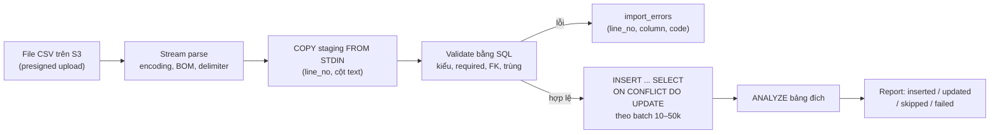
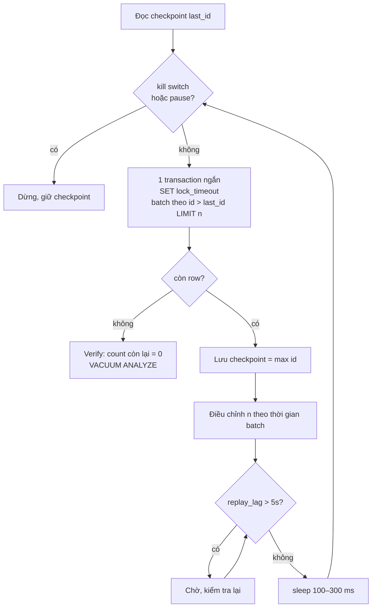

## Bối cảnh & vấn đề

Ba ticket trong cùng một sprint. Một: job import file nhà cung cấp 1 triệu dòng chạy 40 phút mỗi đêm, và hôm nào file to thì chạy lấn sang giờ làm việc. Hai: legal yêu cầu xoá đơn hàng cũ hơn 3 năm, khoảng 10 triệu row trong bảng 500 triệu row; ai đó đề xuất "chạy một câu `DELETE` lúc 2 giờ sáng". Ba: cần điền cột mới `region_code` cho 100 triệu đơn; bản thử đầu tiên chạy nhanh lúc đầu rồi chậm dần tới mức mỗi batch mất 20 giây.

Ba việc này có chung một bản chất: **ghi hàng loạt lên một database đang phục vụ người dùng**. Thứ bạn tối ưu không chỉ là "xong nhanh", mà là "xong mà không ai khác nhận ra": không khoá lâu, không làm replica tụt lại, không làm đầy disk vì WAL, không để lại job nửa chừng không biết chạy tiếp từ đâu. Bốn câu hỏi của track áp dụng trọn vẹn: đọc bao nhiêu row, giữ lock/transaction bao lâu, sinh bao nhiêu WAL/dead tuple, ai khác bị ảnh hưởng.

Bài này không dạy lại WAL, MVCC hay lock từ đầu. Nếu cần, đọc [Storage & WAL](/tracks/sql-postgres/learn/storage-wal), [MVCC & VACUUM](/tracks/sql-postgres/learn/mvcc-vacuum), [Locking](/tracks/sql-postgres/learn/locking-concurrency). Phần expand/contract khi thêm cột có ở [Expand-contract & backfill](/tracks/scenario-migration/learn/expand-contract-backfill); API upload file có ở [Async & bulk API](/tracks/api-design/learn/async-bulk-uploads). Xoá cả năm dữ liệu bằng partition nằm ở bài sau, [Retention](/tracks/scenario-data/learn/retention-partition-soft-delete).

Số đo trong bài lấy từ lab PostgreSQL 18.6 trong Docker trên laptop dùng chung, client Node 24 cùng máy (round-trip rất thấp, nên chi phí round-trip ở production qua mạng còn tệ hơn).

**Interview angle:** câu mở đầu tốt cho mọi scenario ghi hàng loạt là hỏi lại kích thước tương đối: "10M trên 500M là 2%: batched delete hợp lý; nếu là 80% thì tôi sẽ copy phần giữ lại và swap".

## Khái niệm

### Chi phí của một INSERT

Một `INSERT` một row qua ORM tốn: một **round-trip** mạng, chi phí parse/plan, ghi heap + mỗi index, ghi WAL, và nếu chạy ở chế độ autocommit thì một **commit**. Commit mặc định (`synchronous_commit = on`) chờ WAL được **fsync** xuống disk trước khi trả lời. Với 1 triệu row tách rời, bạn trả 1 triệu lần round-trip và 1 triệu lần fsync. 40 phút cho 1 triệu row là khoảng 2,4 ms mỗi row, gần như toàn bộ là chờ đợi chứ không phải làm việc.

Vì thế tối ưu import luôn đi theo hướng **gộp**: gộp nhiều row vào một statement (multi-row `VALUES`, `unnest` mảng), gộp nhiều statement vào một transaction, và tốt nhất là `COPY`, một luồng dữ liệu duy nhất không cần plan từng row.

### COPY FROM STDIN và staging table

**`COPY ... FROM STDIN`** stream dữ liệu CSV/text/binary vào bảng qua wire protocol; server parse và chèn theo lô, không có round-trip mỗi row. **Staging table** là bảng tạm (thường `TEMP` hoặc `UNLOGGED`, không index, mọi cột kiểu `text`) để nạp dữ liệu thô trước. Lý do: file từ bên ngoài luôn bẩn (sai kiểu, thiếu cột, trùng khoá), và bạn muốn validate bằng SQL **trước** khi chạm vào bảng thật, rồi merge bằng `INSERT ... SELECT ... ON CONFLICT`.

Ví dụ: `COPY staging (line_no, sku, name, price, qty) FROM STDIN WITH (FORMAT csv, HEADER)` rồi `SELECT line_no FROM staging WHERE price !~ '^\d+(\.\d+)?$'` để lấy dòng lỗi.

### Giới hạn 65.535 bind parameter

Message `Bind` của Postgres wire protocol mã hoá số parameter bằng **số nguyên 16-bit**, nên một statement có tối đa **65.535 parameter**. Multi-row INSERT 10.000 row × 8 cột = 80.000 parameter: vượt giới hạn. Test với 500 row thì không bao giờ thấy. SQL Server giới hạn **2.100** parameter mỗi request, thấp hơn nhiều. Cách tránh hẳn: truyền mỗi cột là **một mảng** rồi `unnest`, chỉ 8 parameter cho bất kỳ số row nào.

### Batched delete

PostgreSQL **không có `DELETE ... LIMIT`** (cũng không có `ORDER BY` trong DELETE). MySQL có `DELETE ... ORDER BY ... LIMIT n`, SQL Server có `DELETE TOP (n)`. Ở Postgres, chọn khoá bằng subquery có `LIMIT` rồi xoá theo khoá:

```sql
DELETE FROM orders WHERE id IN (
  SELECT id FROM orders WHERE created_at < '2023-01-01' ORDER BY id LIMIT 5000);
```

Lặp tới khi `rowCount = 0`, mỗi vòng một transaction ngắn. `ctid` (vị trí vật lý của tuple) cũng dùng được trong một statement, nhưng không ổn định giữa các statement vì UPDATE/VACUUM FULL làm nó đổi.

### Foreign key không có index

Khi bạn xoá một row cha, Postgres phải kiểm tra (hoặc cascade) các row con tham chiếu tới nó, bằng một **trigger nội bộ** chạy query kiểu `SELECT 1 FROM order_items WHERE order_id = $1`. Postgres **tự tạo index cho PK/unique** ở phía được tham chiếu, nhưng **không tự tạo index cho cột FK** ở bảng con. Không có index đó, mỗi row cha bị xoá kéo theo một **seq scan** bảng con. 5.000 row cha × seq scan 50 triệu row con = batch 40 giây.

### WAL, replica lag và replication slot

Mọi thay đổi ghi vào **WAL** (write-ahead log) trước. Replica nhận WAL và **replay** lại. DELETE 10 triệu row sinh WAL cho từng tuple, cộng **full-page image** cho page đầu tiên bị sửa sau mỗi checkpoint. Replica replay không kịp → **replay lag** tăng → người dùng đọc từ replica thấy dữ liệu cũ. **Replication slot** giữ WAL cho tới khi consumer xác nhận; một slot CDC chết vẫn giữ WAL mãi, nên `pg_wal` đầy disk primary.

### Backfill resumable

**Backfill** là điền dữ liệu cho cột/bảng mới trên dữ liệu đã có. Phiên bản an toàn có bốn tính chất: đi theo **khoá PK tăng dần** (keyset, không OFFSET), mỗi batch **một transaction ngắn**, lưu **checkpoint** sau mỗi batch để resume sau crash, và **idempotent** (chạy lại một batch không ghi đè giá trị đúng mà app vừa ghi).

**Interview angle:** "Postgres không có DELETE LIMIT" và "Postgres không tự index cột FK" là hai gotcha mà interviewer dùng để phân biệt người đã thật sự chạy job xoá lớn.

## Cơ chế hoạt động

### Pipeline import



Mỗi bước có một lý do. **Stream parse** để memory không phụ thuộc kích thước file. **COPY vào staging** vì nhanh nhất và vì staging chấp nhận mọi thứ (cột `text`), nên không có dòng nào làm hỏng cả lô. **Validate bằng SQL** trên staging xử lý một triệu dòng trong vài giây, và giữ được `line_no` để báo lỗi chính xác cho khách. **Merge theo batch** để mỗi transaction không quá dài (lock, WAL burst, replica lag). **ANALYZE** cuối cùng để planner biết bảng vừa đổi lớn; nếu không, query sáng hôm sau dùng statistics cũ (xem [query chậm](/tracks/scenario-data/learn/slow-query-triage)).

Hai chi tiết ở bước merge. `ON CONFLICT (sku) DO UPDATE ... WHERE (...) IS DISTINCT FROM (EXCLUDED...)` chỉ update row thật sự thay đổi: row giống hệt không tạo tuple mới, không sinh WAL, không gửi gì sang replica. Và import phải **idempotent**: unique `(tenant_id, file_sha256)` trên bảng `imports` làm cho upload lại cùng file trả về cùng job.

### Vòng lặp batch an toàn



Vòng lặp này dùng chung cho xoá theo batch và backfill. **Batch nhỏ** (1k–10k row, dưới khoảng 1 giây) giữ lock row ngắn và chia WAL thành dòng chảy đều thay vì một cú sốc. **`lock_timeout`** làm batch bỏ cuộc nhanh khi đụng row đang bị app khoá, thay vì xếp hàng và kéo cả hàng đợi lock theo. **Checkpoint** trong một bảng `job_checkpoints` cho phép kill job bất cứ lúc nào. **Throttle theo replica lag** biến job thành "công dân tốt": nó tự chậm lại khi hệ thống bận. **Adaptive batch size** (batch > 500 ms thì giảm một nửa, < 100 ms thì gấp đôi) tự thích nghi khi tải thay đổi trong ngày.

Ước lượng: 10 triệu row / 5.000 = 2.000 batch; mỗi batch 200 ms + sleep 300 ms → khoảng 17 phút, cộng thời gian chờ lag (verify trên hệ thống của bạn).

**Interview angle:** vẽ vòng lặp này và nói rõ "kill switch, checkpoint, throttle theo lag" là đủ cho câu 027 lẫn 033.

## Ví dụ thực tế

### Bốn cách insert: đo thật

Bảng `supplier_items(sku text PRIMARY KEY, name text, price numeric, qty int)`. Insert từng row chạy với 20.000 row (1 triệu thì quá lâu), các cách còn lại với 1 triệu row:

```ts
// 1. từng row, autocommit
for (const r of rows) await c.query("INSERT INTO supplier_items VALUES ($1,$2,$3,$4)", r);
// 2. từng row trong 1 transaction: BEGIN ... COMMIT bao quanh vòng lặp trên
// 3. multi-row VALUES, 1000 row/statement (4000 parameter)
await c.query(`INSERT INTO supplier_items VALUES ${b.map((_, j) => `($${j*4+1},$${j*4+2},$${j*4+3},$${j*4+4})`).join(",")}`, b.flat());
// 4. unnest mảng, 10000 row/statement, luôn 4 parameter
await c.query("INSERT INTO supplier_items SELECT * FROM unnest($1::text[], $2::text[], $3::numeric[], $4::int[])", cols);
// 5. COPY FROM STDIN, gửi theo chunk 5000 dòng
await pipeline(Readable.from(chunks), c.query(copyFrom("COPY supplier_items FROM STDIN WITH (FORMAT csv)")));
```

```text
1 INSERT/row, autocommit           n=  20000  32711 ms      611 rows/s
1 INSERT/row, 1 transaction        n=  20000   4528 ms    4,417 rows/s
multi-row INSERT 1000 rows/stmt    n=1000000   7877 ms  126,948 rows/s
unnest arrays 10000 rows/stmt      n=1000000   3095 ms  323,069 rows/s
COPY FROM STDIN, 5000-line chunks  n=1000000   2014 ms  496,549 rows/s
```

Từ dòng 1 sang dòng 2, chỉ bỏ 20.000 lần commit đã nhanh hơn 7 lần: phần lớn thời gian là **chờ fsync**. Từ dòng 2 sang 3, gộp row vào statement bỏ thêm round-trip và chi phí plan: nhanh thêm khoảng 30 lần. COPY nhanh nhất, gần 500.000 row/giây trên row hẹp (số tuyệt đối phụ thuộc index, trigger, disk; verify trên hệ thống của bạn). So với dòng 1, đó là 800 lần: job 40 phút xuống dưới 5 giây cho phần nạp, đủ dư cho mục tiêu "dưới 2 phút" kể cả khi thêm validate và merge.

Có một bẫy nhỏ lab đã vấp: lần đo COPY đầu tiên gửi **mỗi dòng một chunk** và chỉ đạt 26.632 row/giây, chậm hơn cả multi-row INSERT. Mỗi `write()` nhỏ là một message `CopyData` và một syscall. Gộp thành chunk 5.000 dòng đưa nó lên 496.549 row/giây. "Dùng COPY" chưa đủ; phải đưa dữ liệu vào COPY theo khối.

### Lỗi 65.535 parameter và DELETE LIMIT

```ts
// 10.000 row × 8 cột = 80.000 parameter
await c.query(`INSERT INTO t VALUES ${placeholders}`, b.flat());
await c.query("DELETE FROM supplier_items WHERE qty = 1 LIMIT 10");
```

```text
10000 x 8 params: bind message has 14464 parameter formats but 0 parameters
DELETE LIMIT: syntax error at or near "LIMIT"
```

Thông báo lỗi đầu tiên rất khó hiểu nếu không biết cơ chế: 80.000 mod 65.536 = **14.464**. Driver ghi số parameter vào trường 16-bit, giá trị bị tràn, và server thấy một message `Bind` tự mâu thuẫn. Bạn sẽ không đoán được nguyên nhân từ log nếu không biết giới hạn này. Cách sửa: `unnest` (dòng 4 ở benchmark), batch size `floor(65535 / số cột)` và nhỏ hơn nhiều cho an toàn, hoặc COPY. Dòng thứ hai xác nhận Postgres 18 vẫn không có `DELETE ... LIMIT`.

### FK không index làm batch delete chậm 40 giây

Plan của một batch delete khi `order_items.order_id` không có index (minh hoạ: dạng output của `EXPLAIN ANALYZE` cho DELETE, số liệu theo kịch bản câu 028):

```text
EXPLAIN (ANALYZE) DELETE FROM orders
WHERE id IN (SELECT id FROM orders WHERE created_at < '2023-01-01' ORDER BY id LIMIT 5000);
 Delete on orders (actual time=412.3..412.3 rows=0 loops=1)
   ...
 Trigger for constraint order_items_order_id_fkey: time=39871.2 calls=5000
 Trigger audit_orders_delete: time=911.4 calls=5000
```

Dòng quyết định là `Trigger for constraint ...: time=39871.2 calls=5000`: phần xoá thật chỉ 412 ms, còn 40 giây nằm trong trigger FK. Giảm batch xuống 500 không giúp gì: tổng thời gian vẫn vậy, chỉ chia nhỏ ra. Sửa:

```sql
CREATE INDEX CONCURRENTLY order_items_order_id_idx ON order_items (order_id);
```

Sau đó xoá **bảng con trước** theo batch rồi mới bảng cha (kiểm soát được kích thước mỗi transaction thay vì để cascade làm), và kiểm tra trigger audit ghi một row cho mỗi row bị xoá: có thể tạm tắt cho job, có chủ đích và có ghi log. SQL Server cũng không tự tạo index cho cột FK, nên cùng bệnh và cùng thuốc.

### Backfill: vì sao chậm dần

```sql
-- BUG: mỗi batch tìm lại từ đầu bảng
UPDATE orders SET region_code = compute_region(zip)
WHERE id IN (SELECT id FROM orders WHERE region_code IS NULL LIMIT 5000);
```

Không có index cho `region_code IS NULL`, nên subquery là **seq scan từ đầu bảng**. Batch 1 gặp 5.000 row NULL ngay ở đầu. Batch thứ 10.000 phải đi qua 50 triệu row **đã xử lý** (cộng dead tuple do chính các UPDATE trước sinh ra) mới gom đủ 5.000 row NULL. Chi phí mỗi batch tăng tuyến tính theo tiến độ, tổng là **O(n²)**: từ 50 ms lên 20 giây là đúng hình dạng đó.

Bản đúng: keyset theo PK + checkpoint, mỗi batch đọc đúng 5.000 row bất kể đã đi xa bao nhiêu:

```ts
let { last_id: lastId } = await getCheckpoint("backfill_region");
let size = 5000;
for (;;) {
  if (await killSwitch("backfill_region")) break;
  const t0 = Date.now();
  const { rows } = await db.query(`
    WITH b AS (SELECT id FROM orders WHERE id > $1 ORDER BY id LIMIT $2),
    u AS (
      UPDATE orders o SET region_code = r.code
      FROM b JOIN addresses a ON a.order_id = b.id JOIN regions r ON r.zip = a.zip
      WHERE o.id = b.id AND o.region_code IS NULL          -- idempotent
    )
    SELECT max(id) AS max_id FROM b`, [lastId, size]);
  if (rows[0].max_id == null) break;                         // hết row
  lastId = rows[0].max_id;
  await saveCheckpoint("backfill_region", lastId);
  const ms = Date.now() - t0;
  size = ms > 500 ? Math.max(500, size / 2) : ms < 100 ? Math.min(20000, size * 2) : size;
  await waitForReplicas(5000);
  await sleep(100);
}
```

(minh hoạ: không chạy trong lab.) `max_id` lấy từ CTE `b` chứ không từ `RETURNING` của UPDATE, vì nếu cả 5.000 row đã có giá trị (app đã dual-write) thì UPDATE trả 0 row, và vòng lặp phải vẫn tiến lên. Nếu buộc phải tìm theo điều kiện thay vì PK, tạo **partial index** `ON orders (id) WHERE region_code IS NULL`: index co lại dần khi backfill tiến triển. Với UUIDv4 (không tuần tự), keyset theo `id` vẫn chạy được vì UUID có thứ tự so sánh, chỉ là row trong một batch nằm rải rác khắp heap, nên I/O ngẫu nhiên hơn; có thể chia keyspace thành các khoảng hex để chạy song song.

Kết thúc backfill: kiểm tra `count(*) WHERE region_code IS NULL = 0` (trên replica), rồi mới siết ràng buộc mà không khoá lâu:

```sql
ALTER TABLE orders ADD CONSTRAINT orders_region_nn CHECK (region_code IS NOT NULL) NOT VALID;  -- nhanh
ALTER TABLE orders VALIDATE CONSTRAINT orders_region_nn;   -- quét bảng, chỉ SHARE UPDATE EXCLUSIVE
ALTER TABLE orders ALTER COLUMN region_code SET NOT NULL;  -- PG12+ dùng CHECK hợp lệ, bỏ qua quét
```

### Throttle theo replica lag

```ts
async function waitForReplicas(maxLagMs = 5000) {
  for (;;) {
    const { rows } = await primary.query(
      "SELECT coalesce(max(extract(epoch FROM replay_lag)) * 1000, 0) AS lag_ms FROM pg_stat_replication");
    if (Number(rows[0].lag_ms) < maxLagMs) return;
    await sleep(2000);
  }
}
```

Một gotcha: `replay_lag` là **NULL** khi hệ thống idle (không có WAL mới để đo), và cũng là thời gian của lần đo gần nhất chứ không phải "bây giờ". `coalesce(..., 0)` coi NULL là không lag, hợp lý với idle nhưng có thể sai nếu replica đứng hẳn. Kiểm tra thêm khoảng cách byte: `pg_wal_lsn_diff(pg_current_wal_lsn(), replay_lsn)`, và đừng quên replica không nằm trong `pg_stat_replication` (đã mất kết nối) cũng là tín hiệu dừng.

## Trade-offs & lựa chọn thay thế

| Cách | Tốc độ | Rủi ro production | Khi nào |
|---|---|---|---|
| INSERT từng row qua ORM | ~600 row/s | Thấp nhưng chạy mãi | Vài trăm row |
| Multi-row VALUES | ~127k row/s | Giới hạn 65.535 param | Batch vừa, không có COPY |
| `unnest` mảng | ~323k row/s | Mảng lớn tốn memory app | Upsert từ app, mọi kích thước |
| `COPY` vào staging + merge | ~500k row/s | Cần quyền COPY FROM STDIN | Import file lớn |
| DELETE một câu | Nhanh trên giấy | Lock dài, WAL burst, lag, không dừng được | Bảng nhỏ |
| Batched DELETE | Chậm, đều | Thấp, có throttle | Xoá vài % bảng |
| Copy keepers + swap | Nhanh khi giữ ít | Cutover cần cẩn thận | Xoá phần lớn bảng |
| Partition DETACH/DROP | Gần như tức thì | Phải thiết kế trước | Retention theo thời gian |

Với import: COPY + staging là mặc định cho file; `unnest` cho upsert từ code; multi-row VALUES chỉ khi bị kẹt với ORM. Chọn chính sách lỗi rõ ràng: **all-or-nothing** (dữ liệu tài chính, sai một dòng là sai cả kỳ) hay **partial accept** (catalog, dòng hợp lệ vào trước), và hiển thị cho người dùng biết. Dừng sớm khi tỉ lệ lỗi vượt khoảng 10%: thường là khách dùng sai template, báo một lỗi rõ ràng tốt hơn trả về một triệu dòng lỗi.

Với xoá: tỉ lệ quyết định. Dưới khoảng 10–20% bảng thì batched delete. Phần lớn bảng thì copy phần giữ lại sang bảng mới và swap (bài [Retention](/tracks/scenario-data/learn/retention-partition-soft-delete)). Xoá theo thời gian lặp lại mỗi tháng thì đầu tư partition một lần.

## Edge cases & failure modes

- **Hai import cùng tenant chạm cùng SKU**: hai upsert đồng thời có thể deadlock nếu thứ tự row khác nhau, hoặc ghi đè lẫn nhau. Serialize theo tenant (advisory lock `pg_advisory_xact_lock(tenant_id)` hoặc queue một job/tenant), và merge theo thứ tự `ORDER BY sku` để thứ tự lấy lock nhất quán.
- **Statement khổng lồ dưới giới hạn param**: vẫn tốn memory parse/plan phía server, giữ lock lâu, sinh một cú WAL burst, và lỗi một row làm rollback cả lô.
- **Autovacuum chen vào giữa job xoá**: batch chậm đi vì I/O cạnh tranh. Đừng tắt nó: vacuum đang dọn chính dead tuple do bạn tạo ra, tắt thì bloat và index scan còn chậm hơn. Giảm tốc job, hoặc chạy `VACUUM` chủ động sau mỗi N triệu row.
- **Replica lag và `pg_wal` phình**: pause job (cần kill switch có sẵn), kiểm tra `pg_stat_replication` (`write_lag`, `flush_lag`, `replay_lag`) và `pg_replication_slots` (slot `active = false` có `restart_lsn` tụt xa là thủ phạm giữ WAL). Người dùng thấy dữ liệu cũ sau khi ghi: route read-after-write về primary vài giây.
- **Crash giữa chừng**: không checkpoint thì chạy lại từ 0; checkpoint lưu **sau** commit batch, nên batch cuối có thể chạy lại, và vì thế batch phải idempotent.
- **App ghi trong lúc backfill**: app phải dual-write cột mới **trước** khi backfill bắt đầu, nếu không row tạo trong lúc backfill đi qua sẽ rơi vào khoảng đã xử lý và mãi NULL. Điều kiện `region_code IS NULL` trong batch ngăn ghi đè giá trị app vừa set.
- **Mapping đổi giữa chừng**: product đổi region cho 3 zip code khi backfill đã đi 50%. Backfill dùng mapping cũ cho nửa đầu; cần một lượt sửa có mục tiêu (`WHERE zip IN (...)`) sau khi xong, hoặc đưa version của mapping vào dữ liệu.
- **Encoding file của khách**: CSV từ Excel có BOM, có thể là Windows-1258/UTF-16, delimiter `;` theo locale. Detect trước, báo lỗi rõ ràng thay vì nạp rác.

## Pitfalls

- ❌ `Promise.all` một triệu INSERT → ✅ COPY hoặc batch; `Promise.all` chỉ cạn pool và vẫn trả một triệu commit.
- ❌ Multi-row INSERT với batch "càng to càng tốt" → ✅ tính `rows × columns < 65.535` (SQL Server < 2.100), hoặc `unnest`. Test với kích thước production.
- ❌ Gửi COPY từng dòng một → ✅ gộp chunk vài nghìn dòng; lab đo được khác biệt 19 lần.
- ❌ Upsert không có `IS DISTINCT FROM` → ✅ chỉ update row thật sự đổi; nếu không, import hằng đêm tạo hàng triệu tuple mới giống hệt, WAL và bloat vô ích.
- ❌ `DELETE ... LIMIT` copy từ runbook MySQL → ✅ subquery chọn PK có `LIMIT` (Postgres), `DELETE TOP (n)` (SQL Server).
- ❌ Batch delete chậm thì giảm batch size → ✅ đọc `EXPLAIN ANALYZE` của DELETE, tìm dòng `Trigger for constraint`; index cột FK ở bảng con.
- ❌ Một câu DELETE 10M row "lúc ban đêm" → ✅ batch nhỏ, transaction ngắn, throttle theo lag, kill switch, checkpoint.
- ❌ Backfill bằng `WHERE col IS NULL LIMIT n` → ✅ keyset theo PK; hoặc partial index nếu buộc tìm theo điều kiện.
- ❌ `ALTER COLUMN SET NOT NULL` ngay sau backfill → ✅ `CHECK ... NOT VALID` + `VALIDATE CONSTRAINT` trước, để tránh quét bảng dưới `ACCESS EXCLUSIVE`.
- ❌ Quên `ANALYZE` sau khi nạp → ✅ gọi ở cuối job; autoanalyze trên bảng lớn có thể chờ rất lâu mới tự chạy.

## Tóm tắt

- Import chậm vì round-trip và commit/fsync mỗi row, không phải vì "DB yếu". Lab: 611 row/s (từng row) → 4.417 (một transaction) → 127k (multi-row) → 323k (`unnest`) → 497k row/s (COPY theo chunk).
- Luồng chuẩn: stream parse → `COPY` vào staging có `line_no` → validate bằng SQL → `import_errors` → upsert theo batch với `IS DISTINCT FROM` → `ANALYZE`; idempotent theo `(tenant_id, file_sha256)`.
- Giới hạn 65.535 bind parameter/statement (SQL Server 2.100); lỗi lộ ra kiểu "bind message has 14464 parameter formats"; tránh bằng `unnest` hoặc COPY.
- Postgres không có `DELETE ... LIMIT`: xoá theo PK chọn từ subquery có `LIMIT`, lặp tới `rowCount = 0`.
- Cột FK không được tự index; thiếu index biến mỗi batch delete thành hàng nghìn seq scan bảng con (`Trigger for constraint ... calls=5000`).
- Job ghi hàng loạt cần: batch nhỏ, transaction ngắn, `lock_timeout`, checkpoint, idempotent, throttle theo replica lag, kill switch.
- Backfill theo `IS NULL LIMIT` là O(n²); keyset theo PK cho chi phí hằng số mỗi batch. Kết thúc bằng `NOT VALID` + `VALIDATE` trước `SET NOT NULL`.
