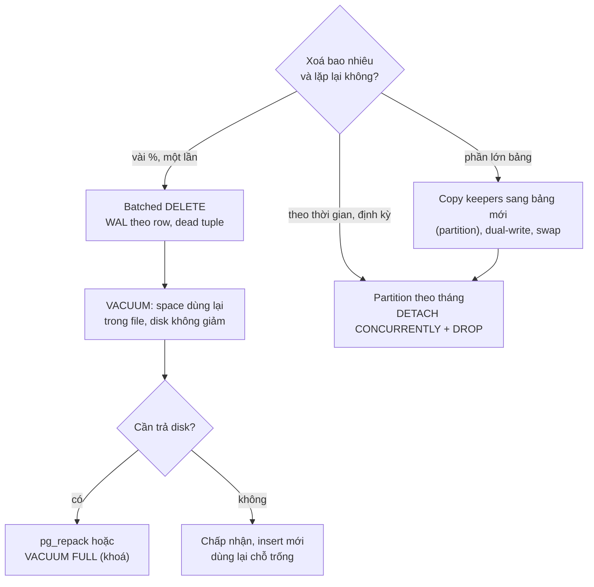
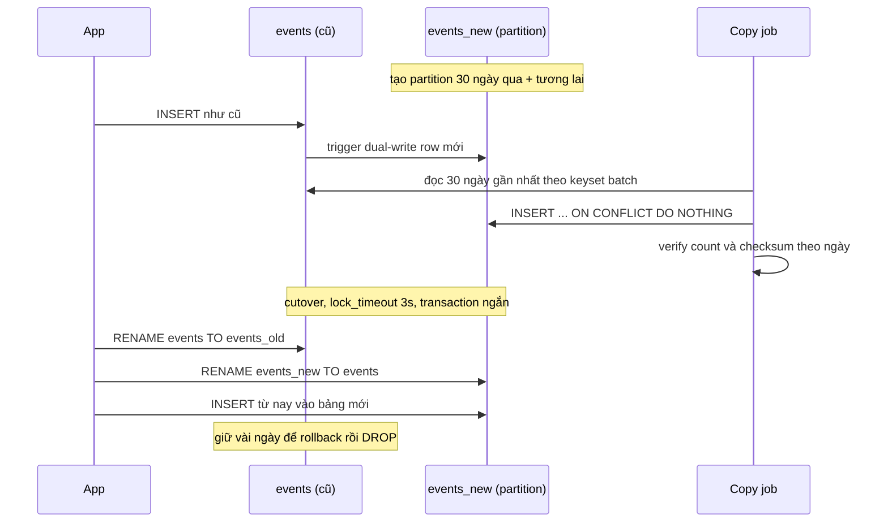

## Bối cảnh & vấn đề

Bảng `events` có 400 triệu row, và chính sách mới chỉ giữ 30 ngày. Một engineer chạy batched delete cả cuối tuần, xoá được 60% bảng 900 GB. Thứ Hai, biểu đồ disk **không nhích**, vài query còn chậm hơn trước, và replica lag cả cuối tuần nhảy lên xuống. Cùng lúc, team user báo hai bug từ tính năng "xoá tài khoản" (soft delete): người đã xoá tài khoản không đăng ký lại được bằng email cũ, và trang support vẫn hiện user đã xoá. Rồi legal chuyển tới một yêu cầu GDPR: "xoá toàn bộ dữ liệu của tôi", trong khi hệ thống có backup 35 ngày, Elasticsearch, warehouse và file CSV export cũ trên S3.

Cả ba câu chuyện xoay quanh một câu hỏi: **xoá dữ liệu thật sự nghĩa là gì**, và làm sao để việc xoá rẻ. Câu trả lời ngắn: trong Postgres, `DELETE` không trả disk; xoá rẻ nhất là xoá **cả file** (partition); soft delete là một lựa chọn sản phẩm có chi phí khắp codebase; và "xoá" theo nghĩa pháp lý là một workflow chạm mọi bản sao.

Bài này dựa trên [MVCC & VACUUM](/tracks/sql-postgres/learn/mvcc-vacuum) (vì sao tuple chết vẫn chiếm chỗ) và [Data modeling](/tracks/sql-postgres/learn/data-modeling). Kỹ thuật batched delete có ở bài trước, [Ghi hàng loạt](/tracks/scenario-data/learn/bulk-import-delete-backfill). Đổi schema dưới tải (rename, swap) có ở [DDL under traffic](/tracks/scenario-migration/learn/ddl-under-traffic).

Số đo lấy từ lab PostgreSQL 18.6 trong Docker: bảng `ev` 2 triệu row, và bảng `events` partition theo tháng năm 2025 với 3 triệu row.

**Interview angle:** câu đầu tiên nên hỏi lại khi nghe "xoá dữ liệu cũ" là: xoá bao nhiêu phần trăm, lặp lại định kỳ hay một lần, và có ràng buộc pháp lý (giữ hoá đơn, quyền xoá) không.

## Khái niệm

### Bloat và vì sao disk không giảm

Trong MVCC, `DELETE` chỉ **đánh dấu** tuple là chết (ghi `xmax`); dữ liệu vẫn nằm trên page. `VACUUM` thường dọn tuple chết và ghi chỗ trống vào **free space map** để insert sau này dùng lại, nhưng chỉ trả lại hệ điều hành các page trống **ở cuối file**. Page trống ở giữa file vẫn là một phần của file. Index cũng vậy: entry chết được dọn, nhưng page index nửa rỗng vẫn nằm đó. Phần dung lượng thừa này gọi là **bloat**.

Bloat không chỉ tốn disk. Scan phải đọc nhiều page hơn cần (nhiều page gần rỗng), cache chứa ít dữ liệu hữu ích hơn, và planner nếu chưa `ANALYZE` vẫn tưởng bảng còn 900 GB dữ liệu thật. Muốn trả disk thật cần **viết lại** bảng: `VACUUM FULL` hoặc `CLUSTER` (giữ `ACCESS EXCLUSIVE` suốt quá trình, gần như downtime), hoặc **pg_repack**/pg_squeeze (viết lại online, chỉ lock ngắn lúc cuối, cần thêm dung lượng tạm bằng kích thước bảng + index). Index riêng lẻ thì `REINDEX INDEX CONCURRENTLY` (PG12+).

### Partition

**Declarative partitioning** chia một bảng logic thành nhiều bảng vật lý theo **partition key**: `PARTITION BY RANGE (created_at)` với mỗi tháng một partition. Mỗi partition là một bảng thật, có file riêng, index riêng (index tạo trên bảng cha tự lan xuống), statistics riêng. Xoá một tháng dữ liệu = `DETACH PARTITION` + `DROP TABLE`: xoá file, không sinh WAL theo row, không tạo dead tuple, không bloat.

Lưu ý cú pháp: `ALTER TABLE ... DROP PARTITION p_2022` là **MySQL**. Postgres không có lệnh đó; partition là bảng, nên dùng `DROP TABLE orders_2022` hoặc `DETACH` rồi drop/archive.

### Ràng buộc của partition trong Postgres

PK và unique constraint trên bảng partition phải **chứa partition key**: `PRIMARY KEY (id, created_at)`, vì mỗi partition chỉ tự kiểm tra unique trong chính nó. Hệ quả: lookup theo `id` một mình không biết partition nào, phải hỏi mọi partition. FK từ bảng khác trỏ **vào** bảng partition được hỗ trợ từ PG12 (verify), nhưng phải trỏ tới khoá chứa partition key. `DETACH`/`DROP` thường cần `ACCESS EXCLUSIVE` trên bảng cha trong thời gian ngắn; `DETACH PARTITION ... CONCURRENTLY` (PG14+) giảm xuống `SHARE UPDATE EXCLUSIVE`, nhưng không chạy trong transaction block và không dùng được khi có default partition.

### Partition pruning

**Pruning** là việc planner (lúc plan) hoặc executor (lúc chạy) loại bỏ partition không thể chứa row khớp. Nó chỉ xảy ra khi điều kiện so sánh **trực tiếp** cột partition key với giá trị: `created_at >= '2025-09-01'`. Bọc key trong cast/function (`created_at::date = ...`) làm planner không suy ra được khoảng, nên quét mọi partition. Giá trị chỉ biết lúc chạy (`now()`, tham số của prepared statement) vẫn prune được ở **execution time** (runtime pruning, PG11+), thể hiện bằng dòng `Subplans Removed: N` trong plan.

### Copy keepers + swap

Khi phải xoá **phần lớn** bảng (95%), xoá từng row là cách tệ nhất: sinh WAL cho 95% row, để lại bảng 95% rỗng. Ngược lại: tạo bảng mới, **copy 5% cần giữ** sang, rồi đổi tên (swap) trong một transaction ngắn. Nhân dịp đó, bảng mới nên là bảng partition, để retention từ nay là `DROP`.

### Soft delete

**Soft delete** đánh dấu row đã xoá (`deleted_at timestamptz`) thay vì xoá thật, để khôi phục được, giữ lịch sử, hoặc giữ tham chiếu từ bảng khác. Cái giá: mọi query phải nhớ lọc `deleted_at IS NULL`, mọi unique constraint phải loại row đã xoá, và bảng không bao giờ nhỏ lại. Đó là một mối quan tâm **xuyên suốt** (cross-cutting), không phải một cột.

**Partial unique index** `CREATE UNIQUE INDEX ... ON users (lower(email)) WHERE deleted_at IS NULL` chỉ áp unique cho row đang sống. SQL Server gọi là filtered index. MySQL không có partial index; thay bằng generated column (`active_email` = `email` khi chưa xoá, NULL khi đã xoá; unique cho phép nhiều NULL) hoặc `UNIQUE(email, deleted_token)`.

### Erasure

**Erasure** (quyền được xoá, GDPR Điều 17) là yêu cầu xoá dữ liệu cá nhân ở **mọi nơi** nó tồn tại. Soft delete **không phải** erasure: dữ liệu vẫn nằm đó. Kỹ thuật thường dùng: hard delete, **anonymize** (giữ đơn hàng cho kế toán nhưng thay tên/email/địa chỉ bằng giá trị vô danh), và **crypto-shredding** (mã hoá PII bằng key riêng cho từng user; xoá key thì mọi bản sao, kể cả backup, thành vô nghĩa).

**Interview angle:** nói được "VACUUM thường chỉ trả disk ở cuối file" và "PK của bảng partition phải chứa partition key" là hai dấu hiệu bạn đã vận hành partition thật.

## Cơ chế hoạt động

### Ba đường xoá dữ liệu cũ



Sơ đồ đọc từ câu hỏi đầu tiên: tỉ lệ và tần suất. **Batched DELETE** phù hợp xoá một phần nhỏ, một lần; nó sinh WAL cho từng row và để lại chỗ trống mà chỉ insert sau này lấp được. **Copy keepers** hợp khi giữ lại ít. **Partition** là đáp án cho retention định kỳ: chi phí xoá không còn phụ thuộc số row. Đường giữa chảy về đường dưới: một lần migration copy-keepers là cơ hội để chuyển sang partition.

### Migration copy-keepers + swap với gián đoạn dưới một phút



**Dual-write** bằng trigger trên bảng cũ đảm bảo row mới phát sinh trong lúc copy không bị sót. `ON CONFLICT DO NOTHING` làm cho row vừa được trigger ghi vừa được job copy không gây lỗi. **Verify** theo ngày (count, `sum(hashtext(...))`) trước khi cutover. Cutover chỉ là hai câu `RENAME` cộng chuyển sequence ownership, grant, trigger, trong một transaction có `lock_timeout` ngắn và retry. Rủi ro lớn nhất là thứ **tham chiếu bảng theo OID**: view, function có `%ROWTYPE`, FK từ bảng khác. Sau `RENAME`, view `v_recent_events` **vẫn trỏ vào bảng cũ** (giờ tên là `events_old`), vì view lưu OID chứ không lưu tên. Phải tạo lại view trong cùng transaction cutover.

**Interview angle:** câu follow-up "view trỏ vào đâu sau rename" là bẫy kinh điển của câu 032; trả lời "vào bảng cũ, vì view bind theo OID" ghi điểm ngay.

## Ví dụ thực tế

### Disk không giảm sau DELETE

Bảng `ev` 2 triệu row, xoá 60% row **đầu** bảng (id nhỏ nhất, nằm ở đầu file), rồi xoá thêm 5% ở **cuối**:

```sql
SELECT pg_size_pretty(pg_table_size('ev')) heap, pg_size_pretty(pg_indexes_size('ev')) idx;
DELETE FROM ev WHERE id <= 1200000;  VACUUM ev;
DELETE FROM ev WHERE id > 1900000;   VACUUM ev;
VACUUM FULL ev;
```

```text
 before                  | heap 162 MB | idx 86 MB
 after DELETE+VACUUM     | heap 162 MB | idx 86 MB
 after deleting tail too | heap 153 MB | idx 86 MB
 after VACUUM FULL       | heap  56 MB | idx 30 MB
```

Xoá 60% và VACUUM: kích thước **không đổi một byte**, vì page trống nằm ở đầu file. Xoá 5% cuối: VACUUM cắt được đúng phần đuôi, 9 MB. Chỉ `VACUUM FULL` (viết lại bảng) mới đưa heap về 56 MB và index về 30 MB, và trong suốt thời gian đó bảng bị `ACCESS EXCLUSIVE`: không ai đọc được. Trên bảng 900 GB, đó là hàng giờ downtime; vì vậy production dùng pg_repack (cần dung lượng trống bằng kích thước bảng + index; nếu chỉ còn 15% disk thì repack **từng bảng/index nhỏ** trước, hoặc chuyển dữ liệu sang tablespace/disk khác, hoặc chấp nhận để insert mới lấp chỗ trống). Đo bloat trước khi quyết định bằng `pgstattuple` (chính xác, đọc cả bảng) hoặc query ước lượng từ statistics; sau đó `ANALYZE`.

### Pruning: khi nào quét 12 partition, khi nào quét 1

Bảng `events` partition theo tháng năm 2025, 3 triệu row, index `(user_id, created_at)`:

```text
-- 1. không lọc theo partition key
EXPLAIN SELECT * FROM events WHERE user_id = 42 ORDER BY created_at DESC LIMIT 20;
 Limit
   ->  Append
         ->  Index Scan Backward using events_2025_12_user_id_created_at_idx on events_2025_12
         ->  Index Scan Backward using events_2025_11_user_id_created_at_idx on events_2025_11
         ... (đủ 12 partition)

-- 2. bọc key trong cast
EXPLAIN SELECT count(*) FROM events WHERE created_at::date = '2025-09-01';
   ->  Parallel Append
         ->  Parallel Seq Scan on events_2025_03   Filter: ((created_at)::date = '2025-09-01'::date)
         ... (đủ 12 partition, seq scan)

-- 3. range sargable
EXPLAIN SELECT count(*) FROM events WHERE created_at >= '2025-09-01' AND created_at < '2025-09-02';
   ->  Parallel Seq Scan on events_2025_09   (chỉ 1 partition)

-- 4. now(): runtime pruning
EXPLAIN ANALYZE SELECT count(*) FROM events WHERE created_at >= now() - interval '300 days';
   ->  Parallel Append
         Subplans Removed: 11
         ->  Parallel Seq Scan on events_2025_12
```

Query 1 là lý do "partition làm vài query chậm hơn": tìm theo `user_id` phải hỏi cả 12 partition (với 84 partition thì 84 lần descend index, cộng planning time lớn hơn). Có một điểm sáng: vì partition được sắp theo thời gian và mỗi index trả theo `created_at DESC`, planner dùng **ordered Append** (không cần Sort), bắt đầu từ partition mới nhất và **dừng sớm** khi đủ 20 row. Query 2 là bẫy cast; viết lại thành range như query 3 thì chỉ còn 1 partition (chú ý timezone: ngày nghiệp vụ ở `Asia/Ho_Chi_Minh` là `'2025-09-01 00:00+07'` tới `'2025-09-02 00:00+07'`). Query 4 cho thấy `now()` không chặn pruning: plan ban đầu có mọi partition, executor loại 11 cái lúc chạy.

### DETACH + DROP so với DELETE: đo WAL

```sql
DELETE FROM events WHERE created_at < '2025-02-01';         -- tháng 1, khoảng 268k row
ALTER TABLE events DETACH PARTITION events_2025_02 CONCURRENTLY;
DROP TABLE events_2025_02;                                  -- tháng 2
```

```text
wal_for_delete_jan       14 MB
wal_for_detach_drop_feb  14 kB
ERROR:  ALTER TABLE ... DETACH CONCURRENTLY cannot run inside a transaction block
```

Một tháng dữ liệu hẹp: DELETE sinh 14 MB WAL (và để lại 268k dead tuple chờ vacuum), DETACH + DROP sinh 14 kB, khoảng 1.000 lần ít hơn. Với bảng thật vài chục GB mỗi tháng, đó là khác biệt giữa "replica lag cả cuối tuần" và "không ai nhận ra". Dòng lỗi cuối là gotcha vận hành: migration tool bọc mọi thứ trong transaction sẽ không chạy được `DETACH ... CONCURRENTLY`; phải đánh dấu migration đó là non-transactional. Luôn đặt `SET lock_timeout = '3s'` trước DETACH/DROP: dù nhanh, chúng vẫn cần lock trên bảng cha và có thể xếp hàng sau một query báo cáo dài, kéo theo mọi query khác (xem [lock queue](/tracks/scenario-data/learn/slow-query-triage)).

### Soft delete: unique và lọc

```sql
ALTER TABLE users ADD CONSTRAINT users_email_key UNIQUE (email);
INSERT INTO users(email, deleted_at) VALUES ('an@example.com', now());   -- user đã xoá
INSERT INTO users(email) VALUES ('an@example.com');                     -- đăng ký lại
-- ERROR:  duplicate key value violates unique constraint "users_email_key"

ALTER TABLE users DROP CONSTRAINT users_email_key;
CREATE UNIQUE INDEX users_email_active_uq ON users (lower(email)) WHERE deleted_at IS NULL;
INSERT INTO users(email) VALUES ('an@example.com');                     -- OK
INSERT INTO users(email) VALUES ('AN@example.com');
-- ERROR:  duplicate key value violates unique constraint "users_email_active_uq"
-- DETAIL:  Key (lower(email))=(an@example.com) already exists.
```

```text
 id |     email      | deleted
  1 | an@example.com | t
  3 | an@example.com | f
```

Partial unique index sửa bug thứ nhất và nhân tiện chặn trùng khác hoa thường. Bug thứ hai (trang support hiện user đã xoá) là bug **quên filter**, và sẽ tái diễn với mỗi query mới nếu dựa vào trí nhớ. Các lớp phòng thủ: view `active_users` cho mọi đọc thông thường; global filter của ORM (Prisma client extension, TypeORM `@DeleteDateColumn` tự lọc khi dùng `find`); hoặc Row Level Security (xem [Postgres RLS](/tracks/multi-tenancy/learn/postgres-rls)); và test cho mọi repository. Câu hỏi khó hơn: FK từ `orders` trỏ vào user đã soft-delete vẫn hợp lệ với DB, nhưng về nghiệp vụ thì sao? Thường là giữ tham chiếu (đơn hàng cũ vẫn có chủ), nhưng chặn tạo quan hệ **mới** tới user đã xoá ở tầng ứng dụng.

## Trade-offs & lựa chọn thay thế

| Cách | Chi phí xoá | Disk trả lại | Lock | Điều kiện |
|---|---|---|---|---|
| Batched DELETE | WAL theo row, dead tuple | Không (chỉ đuôi file) | Row lock ngắn | Không đổi schema |
| DELETE + pg_repack | Như trên + viết lại | Có | Lock ngắn lúc cuối | Disk trống ~ kích thước bảng |
| DELETE + VACUUM FULL | Như trên + viết lại | Có | ACCESS EXCLUSIVE suốt | Có cửa sổ downtime |
| Copy keepers + swap | Chỉ ghi phần giữ lại | Có (drop bảng cũ) | Lock ngắn lúc rename | Dual-write, xử lý view/FK |
| Partition DETACH + DROP | Gần như 0 | Có, ngay | Ngắn (CONCURRENTLY) | Thiết kế trước, PK chứa key |
| `TRUNCATE` partition | Gần như 0 | Có | ACCESS EXCLUSIVE | Xoá toàn bộ partition |

**Chọn partition key** theo hai tiêu chí cùng lúc: cột xuất hiện trong **hầu hết WHERE** và cột khớp với **retention**. Với `orders` 2 tỷ row, tăng 3 triệu/ngày, 95% query trong 90 ngày: `created_at` theo tháng (khoảng 90 triệu row mỗi partition, 84 partition cho 7 năm) cho pruning tốt và retention bằng detach. `tenant_id` (hash/list) hợp khi mọi query đều theo tenant và cần cô lập tenant lớn; sub-partition cả hai làm số partition bùng nổ. Giữ số partition ở mức hàng trăm, không phải hàng chục nghìn, vì planning time và memory tăng theo.

Còn bài toán "mở một đơn bất kỳ theo `id` từ 7 năm trước": `id` không chứa thời gian thì phải hỏi mọi partition. Ba cách: id có thời gian (UUIDv7, snowflake) để suy ra `created_at`; bảng lookup nhỏ `order_id → created_at`; hoặc URL mang ngày. Dữ liệu lạnh (trên 2 năm) có thể chuyển sang tablespace rẻ, hoặc detach → export Parquet lên S3, truy vấn bằng Athena với SLA chậm hơn. Công cụ support tìm theo email trên cả 7 năm sau khi partition sẽ quét mọi partition: cần index email trên từng partition (vẫn 84 lần descend) hoặc đẩy sang search index riêng.

**Soft delete hay hard delete**: soft delete khi cần undo trong cửa sổ ngắn, audit, hoặc tham chiếu lịch sử. Hard delete (kèm bảng archive hoặc event log) khi tỉ lệ row đã xoá lớn, khi có nghĩa vụ xoá thật, hoặc khi chi phí "nhớ filter" ở khắp nơi quá cao. Thường kết hợp: soft delete 30 ngày, rồi job hard delete/anonymize.

## Edge cases & failure modes

- **DETACH xếp hàng sau query dài**: dù `CONCURRENTLY`, bước cuối vẫn cần chờ các transaction cũ; không có `lock_timeout` thì có thể đứng lâu. Retry với backoff.
- **Default partition**: chặn `DETACH CONCURRENTLY`, và khi tạo partition mới Postgres phải quét default partition để chắc không có row thuộc khoảng mới. Giữ default partition rỗng hoặc không dùng.
- **Quên tạo partition tương lai**: insert vào khoảng chưa có partition → lỗi "no partition of relation found for row". Tạo trước nhiều kỳ (pg_partman hoặc cron) và alert khi số partition tương lai dưới ngưỡng.
- **Unique toàn cục không có**: unique trên `email` của bảng partition theo thời gian là không thể (phải chứa partition key). Cần bảng riêng để giữ ràng buộc toàn cục.
- **pg_repack hết disk giữa chừng**: job thất bại, để lại bảng tạm và trigger; cần dọn. Kiểm tra dung lượng trước, repack từng phần.
- **Rename và đối tượng phụ thuộc**: view, function, FK, sequence ownership, grant, CDC slot thấy DDL, ORM cache metadata. Liệt kê bằng `pg_depend` trước cutover.
- **Erasure và backup**: không sửa được backup 35 ngày. Chính sách: backup hết hạn tự nhiên + khi restore phải **chạy lại danh sách erasure** trước khi đưa vào dùng. Crypto-shredding giải quyết gọn hơn nếu thiết kế từ đầu.
- **Erasure và bản sao khác**: phát event `user.erased` qua outbox để Elasticsearch, warehouse, cache xoá theo ([Outbox & CDC](/tracks/messaging-kafka/learn/outbox-cdc-sagas)); file export cũ trên S3 cần lifecycle hết hạn; log bằng chứng (ai, khi nào, ở đâu) không chứa PII. Nghĩa vụ giữ lại (hoá đơn, chống rửa tiền) có thể thắng quyền xoá, cần ý kiến pháp lý; hạn phản hồi thường là một tháng (verify).

## Pitfalls

- ❌ `ALTER TABLE ... DROP PARTITION` trong câu trả lời về Postgres → ✅ `DETACH PARTITION ... CONCURRENTLY` + `DROP TABLE`; đó là cú pháp MySQL.
- ❌ "Drop partition không lock gì" → ✅ vẫn cần lock trên bảng cha trong thời gian ngắn; đặt `lock_timeout`, chạy ngoài transaction block khi dùng `CONCURRENTLY`.
- ❌ Chờ disk giảm sau DELETE + VACUUM → ✅ VACUUM chỉ trả đuôi file; muốn trả disk thì pg_repack, hoặc thiết kế partition.
- ❌ `VACUUM FULL` trên primary giờ hành chính → ✅ pg_repack, hoặc chấp nhận bloat, hoặc `REINDEX CONCURRENTLY` cho riêng index.
- ❌ Xoá 95% bảng bằng DELETE → ✅ copy 5% sang bảng mới (partition), dual-write, verify, swap.
- ❌ Partition theo id range vì "dễ" → ✅ chọn key theo cách query và cách retention.
- ❌ Lọc `created_at::date = ...` trên bảng partition → ✅ range `>= ... AND < ...`; cast làm mất pruning.
- ❌ Unique `(email)` thường trên bảng có soft delete → ✅ partial unique index `WHERE deleted_at IS NULL`.
- ❌ Gắn hậu tố ngẫu nhiên vào email đã xoá như cách sửa duy nhất → ✅ partial index; hậu tố làm bẩn dữ liệu và vẫn để lại PII.
- ❌ Coi soft delete là xong nghĩa vụ GDPR → ✅ erasure workflow chạm mọi bản sao, anonymize hoặc crypto-shredding.

## Tóm tắt

- `DELETE` chỉ đánh dấu tuple chết; VACUUM cho dùng lại chỗ trống nhưng chỉ trả disk ở đuôi file. Lab: xoá 60% đầu bảng, kích thước giữ nguyên 162 MB; chỉ `VACUUM FULL` đưa về 56 MB (với khoá toàn bảng).
- Trả disk online: pg_repack/pg_squeeze (cần disk tạm), `REINDEX CONCURRENTLY` cho index.
- Retention định kỳ: partition theo thời gian, `DETACH ... CONCURRENTLY` + `DROP`. Lab: 14 kB WAL so với 14 MB cho DELETE một tháng.
- Postgres: PK/unique của bảng partition phải chứa partition key; `DETACH CONCURRENTLY` không chạy trong transaction; luôn có `lock_timeout`.
- Pruning cần điều kiện trực tiếp trên key; cast làm quét mọi partition; `now()` vẫn prune lúc chạy (`Subplans Removed`).
- Xoá phần lớn bảng: copy keepers + dual-write + verify + swap; view bind theo OID nên phải tạo lại.
- Soft delete: partial unique index `WHERE deleted_at IS NULL`, filter tập trung (view, ORM global filter, RLS), job hard delete định kỳ.
- Erasure ≠ soft delete: data inventory, anonymize, event cho mọi bản sao, xử lý backup, crypto-shredding.
