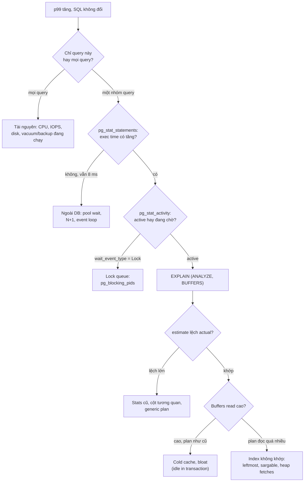
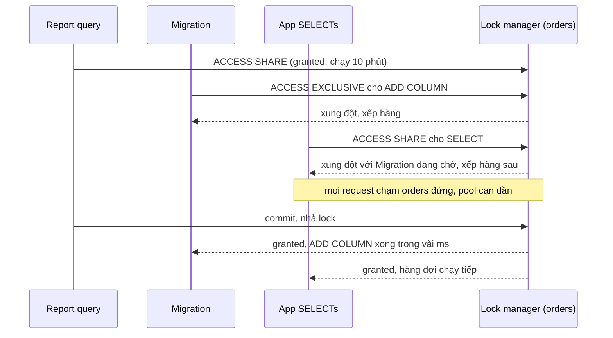

## Bối cảnh & vấn đề

Thứ Ba, 10:05. Alert: p99 của API `GET /orders` từ 150 ms lên 4 giây. Không ai deploy từ hôm qua, SQL y hệt. Một người đề xuất "thêm index cho chắc", người khác muốn restart database. Cả hai đều là đoán. Thực tế, chỉ trong một track dữ liệu lớn, cùng một triệu chứng "query tự nhiên chậm" có ít nhất mười nguyên nhân khác nhau: pool cạn, một migration đang chờ lock, một session quên `COMMIT` từ 4 giờ sáng, statistics cũ sau bulk load đêm qua, prepared statement chuyển sang generic plan, cache lạnh sau failover, hay một index tồn tại nhưng **không thể** được dùng cho query đó.

Nguyên tắc nền của bài: **SQL không đổi không có nghĩa là điều kiện chạy không đổi**. Dữ liệu tăng, phân bố lệch đi, statistics già, plan được chọn lại, lock xuất hiện, tài nguyên bị chia sẻ. Triage tốt là đi từ câu hỏi rẻ nhất, loại trừ nhanh nhất, trước khi chạm vào schema. Bài này là cây quyết định đó, kèm cách đọc `EXPLAIN (ANALYZE, BUFFERS)` để biết "index có mà vẫn chậm" là vì đâu.

Bài dựa trên kiến thức nền ở [Planner & EXPLAIN](/tracks/sql-postgres/learn/planner-explain), [B-tree index](/tracks/sql-postgres/learn/btree-indexes), [MVCC & VACUUM](/tracks/sql-postgres/learn/mvcc-vacuum) và [Locking](/tracks/sql-postgres/learn/locking-concurrency). Output `EXPLAIN` trong bài là output minh hoạ (rút gọn) theo định dạng PostgreSQL 16–18, không phải số đo lab.

**Interview angle:** câu đầu tiên interviewer muốn nghe không phải là một fix, mà là "chỉ query này hay mọi query, và nó đang chạy hay đang chờ?". Ai nhảy thẳng vào "thêm index" hoặc "restart DB" thường bị đánh trượt ở câu 035.

## Khái niệm

### Thời gian của một request nằm ở đâu

Một request chạm DB tốn thời gian ở bốn chỗ: **chờ connection** từ pool phía app, **chờ lock** trong DB, **execution** thật sự (CPU, I/O), và **xử lý ở app** (serialize JSON, event loop). `pg_stat_statements` chỉ thấy phần trong DB (execution, gồm cả thời gian chờ lock trong lúc thực thi). Nó không thấy thời gian app đứng xếp hàng chờ `pool.connect()`, và không thấy việc một request bắn 400 query nhỏ (**N+1**). Ví dụ: mean 8 ms mỗi query, nhưng 400 query tuần tự là 3,2 giây.

### pg_stat_activity và wait events

`pg_stat_activity` là view một row mỗi backend: `state` (`active`, `idle`, `idle in transaction`), `wait_event_type`/`wait_event` (đang chờ gì: `Lock`, `IO`, `LWLock`, `Client`), `xact_start`, `query_start`, `backend_xmin`. Đây là ảnh chụp "ngay lúc này". Kết hợp `pg_blocking_pids(pid)` để thấy ai chặn ai. Ví dụ: một `SELECT` có `wait_event_type = 'Lock'` không phải query chậm, mà là query bị chặn.

### Lock queue FIFO

Mỗi lệnh xin lock ở một **mode** (từ `ACCESS SHARE` của `SELECT` tới `ACCESS EXCLUSIVE` của phần lớn `ALTER TABLE`). Khi lock đang bị giữ ở mode xung đột, người xin phải xếp hàng. Điểm quan trọng: hàng đợi gần như **FIFO**, người đến sau không được "vượt" người đang chờ nếu mode của họ xung đột với người đang chờ. Vì vậy một `ALTER TABLE` chỉ đổi catalog (nhanh) nhưng phải chờ một report 10 phút sẽ làm mọi `SELECT` đến sau cũng đứng, dù `SELECT` không xung đột với report.

### Idle in transaction và xmin horizon

Session ở trạng thái **`idle in transaction`** đã mở transaction nhưng không làm gì và chưa commit. Nếu transaction đó đã lấy snapshot, nó giữ **xmin horizon**: mốc transaction cũ nhất mà ai đó còn có thể cần nhìn thấy. VACUUM không được xoá dead tuple nào mới hơn mốc này, trên **toàn cluster** chứ không chỉ bảng session đó chạm. Ví dụ: session quên `COMMIT` lúc 04:12 thì đến 10:00 mọi bảng ghi nhiều đều tích sáu giờ dead tuple. Replication slot không ai đọc và prepared transaction (`pg_prepared_xacts`) bị bỏ quên cũng giữ xmin theo cách tương tự.

### Statistics và estimate

Planner chọn plan dựa trên **ước lượng số row** (estimate), tính từ statistics mà `ANALYZE` thu thập bằng sampling: số row, số giá trị distinct, danh sách giá trị phổ biến (MCV), histogram. Statistics là ảnh chụp tại lần `ANALYZE` cuối. Autoanalyze chỉ chạy khi số row thay đổi vượt `autovacuum_analyze_threshold` (mặc định 50) + `autovacuum_analyze_scale_factor` (mặc định 0,1) × số row. Với bảng 1 tỷ row, đó là khoảng **100 triệu** thay đổi. Estimate lệch actual 100 lần trở lên là dấu hiệu số một của plan tệ.

### Custom plan và generic plan

Với **prepared statement** (câu SQL có tham số `$1` được parse/plan một lần và chạy nhiều lần), Postgres có hai lựa chọn: **custom plan** lập lại cho từng bộ giá trị tham số, và **generic plan** lập một lần không biết giá trị. Mặc định (`plan_cache_mode = auto`), 5 lần thực thi đầu dùng custom plan; từ lần thứ 6, nếu chi phí ước lượng của generic plan không tệ hơn đáng kể so với trung bình custom plan, nó chuyển hẳn sang generic. Plan cache này nằm **trong từng connection**, không chia sẻ giữa session.

### Sargable, leftmost prefix, covering

Điều kiện **sargable** (search-argument-able) là điều kiện so sánh trực tiếp cột được index với một giá trị, nhờ vậy planner map được thành một khoảng trên index. `created_at >= '2026-09-01'` là sargable; `DATE(created_at) = '2026-09-01'` thì không, vì index lưu `created_at`, không lưu `DATE(created_at)`. **Leftmost prefix**: B-tree nhiều cột `(a, b)` sắp theo `a` trước, chỉ trong cùng `a` mới sắp theo `b`, nên chỉ seek hiệu quả khi có điều kiện trên `a`. **Covering index** chứa đủ cột cho query, cho phép **Index Only Scan**; nhưng ở Postgres nó vẫn phải đọc heap cho page chưa được đánh dấu **all-visible** trong **visibility map**.

### Extended statistics

Planner mặc định coi các điều kiện trong `WHERE` là **độc lập** và nhân selectivity với nhau. Khi hai cột tương quan (`city = 'Hanoi'` kéo theo `country = 'VN'`), phép nhân làm estimate nhỏ đi nhiều lần. `CREATE STATISTICS ... (dependencies, ndistinct, mcv)` dạy planner về tương quan giữa các cột.

**Interview angle:** phân biệt được "query chạy chậm" với "query chờ" (lock, pool), và "index không tồn tại" với "index không dùng được" (leftmost prefix, sargable) là xương sống của cả nhóm câu 035–046.

## Cơ chế hoạt động

### Cây quyết định triage



Cây đi từ phép đo rẻ nhất tới đắt nhất. Câu đầu tiên tách vấn đề **hệ thống** (mọi query chậm: hết IOPS burst, disk 95%, autovacuum chống wraparound, backup) khỏi vấn đề **một query**. Câu thứ hai dùng `pg_stat_statements` để biết thời gian có thật sự nằm trong DB không; nếu mean exec time vẫn 8 ms thì đừng tối ưu SQL, hãy nhìn metric pool và trace. Câu thứ ba phân biệt chạy và chờ. Chỉ khi query thật sự `active` và chậm mới đọc plan; và trong plan, câu hỏi đầu tiên luôn là **estimate có khớp actual không**, vì estimate sai là gốc của hầu hết plan sai.

### Lock queue: vì sao một ALTER "tức thì" làm sập bảng



Sơ đồ cho thấy vì sao "metadata-only change" vẫn gây outage. `ADD COLUMN` không có default volatile chỉ sửa catalog, nhưng nó cần `ACCESS EXCLUSIVE`, mode xung đột với mọi mode khác. Nó không lấy được lock vì report đang giữ `ACCESS SHARE`. Các `SELECT` mới tuy chỉ cần `ACCESS SHARE` (tương thích với report) nhưng xung đột với `ACCESS EXCLUSIVE` đang chờ phía trước, nên xếp hàng sau migration. Kết quả: bảng `orders` đứng cho tới khi report xong. Thiết kế FIFO này có lý do: nếu cho reader vượt, một dòng reader liên tục sẽ khiến DDL **chờ mãi** (starvation).

### Plan cache của prepared statement

Với driver `pg` của Node, truyền `name` trong `client.query({ name, text, values })` tạo **named prepared statement** trên server, cache theo connection. Lần 1–5 trên mỗi connection: custom plan, tenant lớn nhận plan cho tenant lớn. Lần 6: planner tính chi phí generic plan (dùng estimate "trung bình" cho `tenant_id = $1`, ví dụ 2.000 row) và so với trung bình 5 custom plan trước đó. Nếu 5 lần đầu rơi vào tenant nhỏ, trung bình thấp, generic plan trông "đủ tốt", và từ đó **mọi** tenant dùng nó. Tenant 10 triệu row nhận plan được tối ưu cho 2.000 row. psql với literal không tái hiện được vì literal luôn là custom plan.

**Interview angle:** mô tả đúng "5 custom plan rồi so chi phí generic" và "cache theo connection, không chia sẻ" cho thấy bạn không bê nguyên mô hình SQL Server sang Postgres.

## Ví dụ thực tế

### Bước 1–3 của triage bằng SQL

```sql
-- (1) query nào tốn thời gian nhất, tăng từ khi nào
SELECT queryid, calls, round(mean_exec_time::numeric, 1) AS mean_ms,
       round(total_exec_time::numeric / 1000) AS total_s, left(query, 60)
FROM pg_stat_statements ORDER BY total_exec_time DESC LIMIT 5;

-- (2) ai đang chạy, ai đang chờ, ai bị chặn bởi ai
SELECT pid, state, wait_event_type, wait_event, pg_blocking_pids(pid) AS blocked_by,
       now() - query_start AS running, left(query, 50)
FROM pg_stat_activity
WHERE datname = current_database() AND state <> 'idle'
ORDER BY query_start;
```

```text
  pid  |        state        | wait_event_type | wait_event | blocked_by |  running  | left
-------+---------------------+-----------------+------------+------------+-----------+------------------------------
 18211 | active              |                 |            | {}         | 00:09:41  | SELECT region, sum(total) FROM orders
 18390 | active              | Lock            | relation   | {18211}    | 00:00:52  | ALTER TABLE orders ADD COLUMN region_c
 18402 | active              | Lock            | relation   | {18390}    | 00:00:51  | SELECT id, status FROM orders WHERE id
 18405 | active              | Lock            | relation   | {18390}    | 00:00:50  | SELECT id, status FROM orders WHERE id
 17020 | idle in transaction |                 |            | {}         | 05:53:10  | UPDATE carts SET updated_at = now() WH
```

Một ảnh chụp kể được hai câu chuyện. Chuỗi `18402 ← 18390 ← 18211` là lock queue của câu 042: các `SELECT` bị chặn bởi **migration**, không phải bởi report. Cách gỡ nhanh nhất là `pg_cancel_backend(18390)` (huỷ migration, hàng đợi chạy tiếp ngay), rồi chạy lại migration với `SET lock_timeout = '3s'` và retry khi gặp lỗi `55P03 lock_not_available`. Row cuối là câu 039: một session `idle in transaction` gần 6 tiếng giữ xmin horizon.

### Idle in transaction giữ vacuum

```sql
SELECT pid, usename, application_name, xact_start, backend_xmin,
       now() - xact_start AS age, left(query, 60) AS last_query
FROM pg_stat_activity
WHERE state LIKE 'idle in transaction%' ORDER BY xact_start;

SELECT relname, n_live_tup, n_dead_tup, last_autovacuum
FROM pg_stat_user_tables ORDER BY n_dead_tup DESC LIMIT 3;
```

```text
  pid  | usename | application_name |      xact_start        | backend_xmin |   age    | last_query
-------+---------+------------------+------------------------+--------------+----------+-------------------------
 17020 | app     | cart-service     | 2026-09-30 04:12:07+07 |     88123004 | 05:53:10 | UPDATE carts SET ...

 relname | n_live_tup | n_dead_tup |      last_autovacuum
---------+------------+------------+---------------------------
 carts   |    1204331 |    9870112 | 2026-09-30 09:58:41+07
 orders  |   80112003 |    4410078 | 2026-09-30 09:57:02+07
```

Autovacuum chạy liên tục (`last_autovacuum` cách đây vài phút) nhưng `n_dead_tup` vẫn tăng: nó quét bảng, thấy mọi dead tuple đều mới hơn `backend_xmin = 88123004`, nên không xoá được gì. Thêm autovacuum worker không giúp gì. Fix: xác định đó là gì (`application_name`, câu query cuối), rồi `SELECT pg_terminate_backend(17020);`. Guardrail lâu dài: `ALTER ROLE app SET idle_in_transaction_session_timeout = '60s';`, và trong code Node luôn `release()` trong `finally`, không gọi HTTP ra ngoài khi đang giữ transaction. Sau khi kill, autovacuum dọn kịp, nhưng bảng **không nhỏ lại**: chỗ trống chỉ được dùng lại trong file (xem [bloat](/tracks/scenario-data/learn/retention-partition-soft-delete)). Đó là bloat, ảnh hưởng scan cho tới khi insert mới lấp hoặc pg_repack.

### Generic plan sau lần thứ 6

```sql
PREPARE q(bigint, text) AS
  SELECT * FROM orders WHERE tenant_id = $1 AND status = $2
  ORDER BY created_at DESC LIMIT 50;
EXECUTE q(7, 'open');      -- tenant nhỏ, chạy 6 lần
EXPLAIN EXECUTE q(42, 'open');
```

```text
 Limit  (cost=0.56..210.40 rows=50 width=96)
   ->  Index Scan using orders_tenant_id_idx on orders  (cost=0.56..8190.11 rows=1950 width=96)
         Index Cond: (tenant_id = $1)
         Filter: (status = $2)
```

Thấy `$1` trong plan nghĩa là **generic plan**; custom plan sẽ hiện giá trị thật `42`. Với tenant 42 có 3,8 triệu row, plan này đọc hàng triệu row rồi sort. Fix theo thứ tự ít xâm lấn: `SET plan_cache_mode = force_custom_plan` (PG12+) cho role/transaction chạy query này; hoặc bỏ `name` khỏi query trong driver (dùng unnamed statement, plan lại mỗi lần); hoặc tách query riêng cho tenant lớn. Thêm một tầng: PgBouncer ở **transaction mode** trước PG 1.21 (verify) không hỗ trợ named prepared statement theo protocol, vì statement nằm ở server connection mà client không giữ cố định; bản mới có `max_prepared_statements` để PgBouncer tự theo dõi.

So với SQL Server (câu 037): ở SQL Server plan được compile **lần đầu** với giá trị tham số lúc đó (parameter sniffing) và cache **dùng chung** toàn instance; fix là `OPTION (RECOMPILE)`, `OPTIMIZE FOR`, Query Store plan forcing, hoặc Parameter Sensitive Plan optimization (SQL Server 2022, verify). Postgres không có plan cache dùng chung, nên không có `OPTION (RECOMPILE)` hay plan forcing có sẵn; công cụ tương ứng là `plan_cache_mode` và statistics tốt hơn. MySQL 8.0 đã bỏ query cache, nên "query cache bị invalidate" không phải lời giải thích hợp lệ.

### Stats cũ sau bulk load

```sql
SELECT relname, n_live_tup, n_mod_since_analyze, last_autoanalyze, last_analyze
FROM pg_stat_user_tables WHERE relname = 'orders';
```

```text
 relname | n_live_tup | n_mod_since_analyze |    last_autoanalyze    | last_analyze
---------+------------+---------------------+------------------------+--------------
 orders  | 1020311992 |            20004118 | 2026-09-21 03:10:44+07 |
```

20 triệu row mới nằm hết ở khoảng ngày mới, ngoài histogram của lần analyze cũ, nên planner ước lượng `created_at >= '2026-09-30'` chỉ khoảng 1.200 row trong khi thực tế 4,8 triệu, và chọn nested loop. Autoanalyze chưa chạy vì ngưỡng là khoảng 102 triệu thay đổi. `ANALYZE orders;` chỉ lấy mẫu (mặc định 300 × `default_statistics_target` = 30.000 row), lấy lock `SHARE UPDATE EXCLUSIVE` không chặn đọc/ghi, nên an toàn chạy giờ hành chính. Lâu dài: job load gọi `ANALYZE` ở cuối; `ALTER TABLE orders SET (autovacuum_analyze_scale_factor = 0.005, autovacuum_analyze_threshold = 10000);`; partition theo thời gian để partition mới có stats riêng. `VACUUM FULL` không phải cách "refresh statistics".

### Đọc EXPLAIN (ANALYZE, BUFFERS): "latest open orders"

```text
Limit (actual time=5210.4..5210.5 rows=50 loops=1)
  Buffers: shared hit=1033 read=412871
  -> Sort (actual rows=50) Sort Key: created_at DESC  Sort Method: top-N heapsort  Memory: 39kB
    -> Bitmap Heap Scan on orders (cost=.. rows=50 ..) (actual rows=1902114 loops=1)
          Recheck Cond: (tenant_id = 42)
          Filter: (status = 'open')
          Rows Removed by Filter: 1899870
          -> Bitmap Index Scan on orders_tenant_id_idx (actual rows=3801984)
Execution Time: 5211.0 ms
```

Đọc từ trong ra ngoài, không đọc từ node trên cùng. (1) Bitmap Heap Scan ước lượng 50 row, thực tế 1,9 triệu: lệch 38.000 lần. (2) Index `(tenant_id)` trả 3,8 triệu row, rồi `Filter: status` loại 1,9 triệu **sau khi đã đọc heap**. (3) `read=412871` buffer × 8 KB ≈ 3,2 GB đọc từ disk. (4) Sort top-N trên 1,9 triệu row chỉ để lấy 50. Node Sort chỉ tốn 39 kB, nó không phải thủ phạm. Fix:

```sql
CREATE INDEX CONCURRENTLY orders_tenant_open_created
  ON orders (tenant_id, created_at DESC) WHERE status = 'open';
ANALYZE orders;
```

```text
Limit (actual time=0.05..0.31 rows=50 loops=1)
  Buffers: shared hit=54
  -> Index Scan using orders_tenant_open_created on orders (actual rows=50 loops=1)
        Index Cond: (tenant_id = 42)
Execution Time: 0.4 ms
```

Index khớp cả `WHERE` lẫn `ORDER BY`, nên scan theo thứ tự, dừng sau 50 row, không sort: 54 buffer thay vì 413 nghìn. Nếu query còn lọc nhiều status khác, dùng `(tenant_id, status, created_at DESC)` thay cho partial index.

### Leftmost prefix và sargable

```sql
-- index (status, created_at); query không có status
SELECT id, total FROM orders
WHERE created_at >= now() - interval '7 days'
ORDER BY created_at DESC LIMIT 100;
```

Trong B-tree `(status, created_at)`, các entry sắp kiểu `('cancelled', ...), ('open', ...), ('paid', ...)`; `created_at` chỉ có thứ tự **bên trong từng status**. Không có điều kiện `status`, planner không seek được vào một khoảng liên tục, và cũng không có thứ tự toàn cục cho `ORDER BY`, nên phải sort. PostgreSQL 18 có **B-tree skip scan** (verify): khi cột đầu ít giá trị distinct, nó nhảy qua từng `status` để áp điều kiện `created_at`, giúp phần lọc nhưng vẫn không cho thứ tự toàn cục. Fix: `CREATE INDEX CONCURRENTLY orders_created_at_idx ON orders (created_at);` (B-tree scan ngược được nên không cần `DESC`).

Sargable (câu 044): `WHERE DATE(created_at) = '2026-09-01'` và `WHERE lower(email) = $1` đều bỏ qua index thường. Hai cách sửa:

```sql
-- 1. viết lại thành range, theo ngày nghiệp vụ ở Asia/Ho_Chi_Minh
WHERE created_at >= '2026-09-01 00:00+07' AND created_at < '2026-09-02 00:00+07'
-- 2. expression index khớp đúng biểu thức (query phải viết y hệt lower(email))
CREATE INDEX CONCURRENTLY users_lower_email_idx ON users (lower(email));
```

Ở SQL Server, nguồn scan kinh điển là implicit conversion: cột `varchar` so với tham số `nvarchar` từ driver.

### Heap fetches trong Index Only Scan

```text
Index Only Scan using orders_tenant_created_incl on orders (actual rows=50000 loops=1)
  Index Cond: (tenant_id = 42)
  Heap Fetches: 850000 ... (sau VACUUM: Heap Fetches: 0)
```

Index Postgres không chứa thông tin visibility (ai thấy row nào). Index-only scan chỉ bỏ qua heap cho page có bit **all-visible** trong visibility map, bit này do VACUUM bật và bị xoá ngay khi page có thay đổi. Bảng ghi nhiều, vacuum chậm, hoặc có transaction dài giữ xmin thì `Heap Fetches` cao và "Index Only Scan" gần như index scan thường. Fix: `autovacuum_vacuum_scale_factor` nhỏ cho bảng đó (PG13+ có vacuum theo số insert cho bảng append-only), gỡ transaction dài, dùng `INCLUDE (status, total)` để cột phụ nằm ở leaf. Trade-off: cột trong index (kể cả `INCLUDE`) bị update thường xuyên làm mất **HOT update**, mỗi update phải ghi thêm index entry.

### Cột tương quan

```text
Nested Loop (rows=12) (actual time=0.1..184220.7 rows=2210034 loops=1)
  -> Index Scan using customers_city_idx on customers (rows=3) (actual rows=48210)
        Index Cond: (city = 'Hanoi')  Filter: (country = 'VN')
  -> Index Scan using orders_customer_id_idx on orders (rows=4) (actual rows=46 loops=48210)
```

Planner tính selectivity(`city = 'Hanoi'`) × selectivity(`country = 'VN'`), trong khi điều kiện thứ hai không loại thêm row nào. Estimate 3, actual 48.210: nested loop chạy 48.210 vòng. Fix:

```sql
CREATE STATISTICS customers_country_city (dependencies, mcv) ON country, city FROM customers;
ANALYZE customers;
```

Sau đó estimate ở node `customers` gần 48 nghìn và planner chuyển sang Hash Join. `SET enable_nestloop = off` trong code production là băng dán: nó tắt nested loop cho mọi query trong session, kể cả những query cần nó, và che dấu nguyên nhân thật.

**Interview angle:** khi đưa một plan cho bạn đọc, hãy nói theo thứ tự: estimate vs actual, rows removed by filter, buffers read, rồi mới tới sort/join. Câu 041 có red flag là "tập trung vào node Sort vì nó nằm trên cùng".

## Trade-offs & lựa chọn thay thế

| Triệu chứng | Nguyên nhân thường gặp | Fix nhanh | Fix lâu dài |
|---|---|---|---|
| Exec time thấp, p99 cao | Pool wait, N+1, event loop | Tăng acquire timeout fail-fast, gộp query | Sizing pool, PgBouncer, DataLoader |
| `wait_event_type = Lock` | Lock queue sau DDL/report | Cancel migration hoặc report | `lock_timeout` + retry, report lên replica |
| `n_dead_tup` tăng dù vacuum chạy | Idle in transaction, slot treo | `pg_terminate_backend` | `idle_in_transaction_session_timeout`, alert theo xact age |
| Estimate thấp hơn nhiều sau load | Stats cũ | `ANALYZE` | Analyze cuối job, scale factor per-table |
| Chậm từ lần thứ 6 trên connection | Generic plan | `force_custom_plan` | Tách query outlier, statistics tốt hơn |
| Index có, vẫn sort/seq scan | Leftmost prefix, non-sargable | Viết lại query | Index khớp WHERE + ORDER BY |
| Index Only Scan nhưng chậm | Visibility map chưa set | `VACUUM` | Autovacuum aggressive cho bảng nóng |
| Nested loop chạy mãi, estimate nhỏ | Cột tương quan | Bỏ điều kiện dư thừa | `CREATE STATISTICS` |

**Thêm index hay sửa query?** Viết lại query cho sargable là miễn phí về write; index mới tốn disk, chậm mọi `INSERT/UPDATE`, và có thể làm mất HOT update. Chọn index khi pattern query ổn định và quan trọng; chọn sửa query khi index có sẵn đã đủ nếu điều kiện được viết đúng. **`force_custom_plan` hay bỏ prepared statement?** Cả hai tốn thêm planning time mỗi lần (thường dưới 1 ms cho query đơn giản); `force_custom_plan` giữ được lợi ích parse một lần và chống SQL injection như cũ. **Planner hint (pg_hint_plan)** là đường cuối khi statistics không thể diễn tả dữ liệu; nó đóng băng plan trong khi dữ liệu tiếp tục thay đổi.

## Edge cases & failure modes

- **Cold cache sau failover/restart**: plan y hệt nhưng `shared read` từ 200 lên 90.000 buffer. Không có gì sai về plan; cache đang ấm dần. `pg_prewarm` cho bảng nóng, và đừng kết luận vội trong 10 phút đầu.
- **IOPS burst cạn** (volume cloud có credit): mọi query chậm cùng lúc, `wait_event_type = IO`. Nhìn metric volume, không phải SQL.
- **`pg_stat_statements` che p99**: mean 8 ms có thể chứa vài lần 3 giây. Dùng `max_exec_time`, `stddev_exec_time`, hoặc `auto_explain` với `log_min_duration`.
- **`pg_cancel_backend` không đủ**: session `idle in transaction` không có query để cancel; cần `pg_terminate_backend`. Ứng dụng phía kia sẽ nhận lỗi connection, nên kiểm tra nó là gì trước.
- **`lock_timeout` không có retry**: migration fail ở giờ cao điểm và deploy dừng nửa chừng. Retry với backoff và jitter, giới hạn số lần.
- **`EXPLAIN ANALYZE` thật sự chạy query**: với `UPDATE/DELETE` phải bọc trong `BEGIN ... ROLLBACK`. Trên primary đang quá tải, chạy nó cho query 5 phút là thêm 5 phút tải.
- **Statistics target cao**: tăng `default_statistics_target` làm `ANALYZE` lâu hơn và planning chậm hơn; đặt per-column cho cột skew thay vì toàn cục.
- **Pool sizing sai**: 12 pod × pool 20 = 240 > `max_connections = 200`, pod mới nhận lỗi "too many clients" khi scale. Tổng pool phải nhỏ hơn `max_connections` trừ phần dành cho admin/migration, hoặc đặt PgBouncer phía trước.

## Pitfalls

- ❌ Thêm index ngay khi thấy chậm → ✅ đọc `pg_stat_activity` và plan trước; chậm do chờ lock hay pool thì index không giúp.
- ❌ Restart database để "xả" → ✅ restart xoá luôn bằng chứng (lock chain, session idle) và làm cache lạnh.
- ❌ Kết luận "DB ổn vì exec time thấp nên là network" → ✅ đo pool wait time, số query mỗi request, event loop lag.
- ❌ Migration không có `lock_timeout` → ✅ `SET lock_timeout = '3s'` + retry cho mọi DDL trên bảng nóng.
- ❌ Tăng số autovacuum worker khi `n_dead_tup` tăng → ✅ tìm session giữ xmin (`backend_xmin`, slot, `pg_prepared_xacts`).
- ❌ Gọi hiện tượng 5-lần-rồi-generic là "parameter sniffing" và đề xuất `OPTION (RECOMPILE)` → ✅ cơ chế khác; dùng `plan_cache_mode`.
- ❌ `VACUUM FULL` để "refresh statistics" → ✅ `ANALYZE`, nhẹ và không chặn ghi.
- ❌ Tin "Index Only Scan" nghĩa là không đọc heap → ✅ xem `Heap Fetches`; phụ thuộc visibility map.
- ❌ Index `(status, created_at)` cho query chỉ lọc `created_at` → ✅ cột seek đứng đầu; index phải khớp cả `ORDER BY`.
- ❌ `SET enable_nestloop = off` trong code production → ✅ `CREATE STATISTICS` cho cột tương quan, sửa estimate tận gốc.

## Tóm tắt

- SQL không đổi ≠ điều kiện không đổi: dữ liệu, statistics, plan, lock và tài nguyên đều có thể đổi qua đêm.
- Thứ tự triage: một query hay mọi query → exec time trong DB có tăng không → đang chạy hay đang chờ → plan: estimate vs actual → buffers.
- Lock queue gần như FIFO: DDL nhanh nhưng cần `ACCESS EXCLUSIVE` chờ sau report sẽ chặn mọi `SELECT` đến sau. Luôn `lock_timeout` + retry.
- `idle in transaction` giữ xmin horizon toàn cluster, autovacuum chạy mà không xoá được; `idle_in_transaction_session_timeout` là guardrail.
- Stats cũ sau bulk load: `ANALYZE` cuối job, scale factor per-table cho bảng tỷ row; cột tương quan cần `CREATE STATISTICS`.
- Prepared statement: 5 custom plan, rồi có thể generic; thấy `$1` trong plan là generic; `plan_cache_mode = force_custom_plan`.
- Index phải khớp WHERE (leftmost prefix, sargable) và ORDER BY; Index Only Scan phụ thuộc visibility map (`Heap Fetches`).
- Đọc plan từ trong ra ngoài: estimate lệch, `Rows Removed by Filter`, `Buffers read`, rồi mới tới sort/join.
