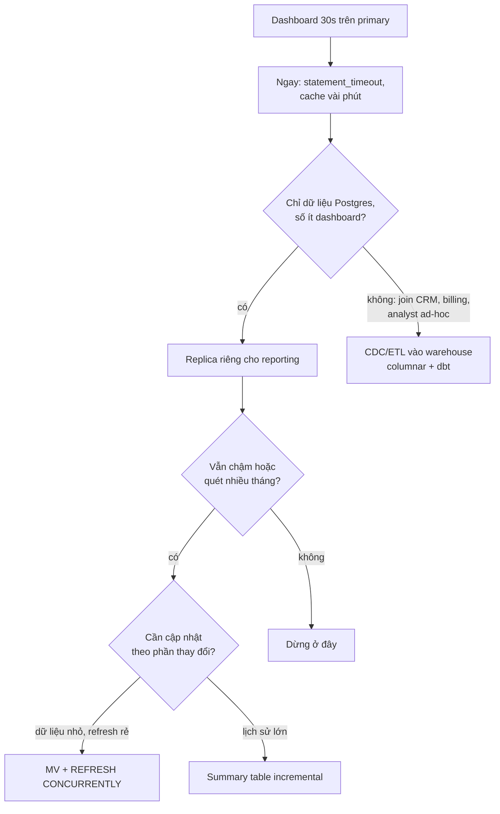
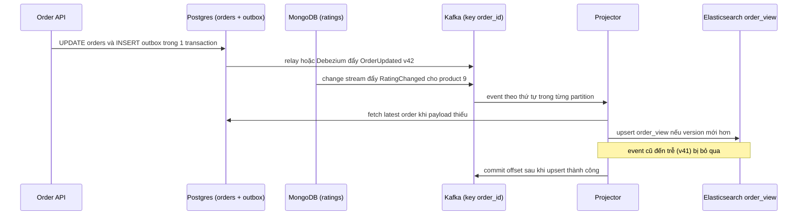

## Bối cảnh & vấn đề

Ba yêu cầu đến cùng một tuần. Finance muốn dashboard doanh thu 18 tháng; query aggregate mất 30 giây trên primary, và mỗi khi ba người mở dashboard, latency checkout nhảy vọt. Product muốn màn hình danh sách đơn hàng kèm **điểm rating trung bình** của sản phẩm, filter "rating ≥ 4" và sort theo rating; nhưng order nằm ở Postgres còn review nằm ở MongoDB. Team search báo trang tìm sản phẩm trên 50 triệu row có p99 6 giây vì các con số facet ("Nike (1.204)"). Cùng lúc, bảng chính đang 300 triệu row và tăng 5 lần mỗi năm.

Điểm chung: tất cả đều là **workload đọc khác hình dạng với OLTP**. OLTP (online transaction processing) tối ưu cho nhiều transaction nhỏ, đọc ghi vài row theo khoá. Reporting quét hàng triệu row, search cần aggregate theo nhiều chiều, màn hình ghép dữ liệu từ hai hệ thống. Ép mọi thứ chạy trên cùng một primary làm workload này giết workload kia. Câu trả lời là **tách đường đọc**: replica, bảng tổng hợp sẵn, read model denormalize, warehouse, search engine. Mỗi cách đổi độ tươi dữ liệu và độ phức tạp lấy khả năng mở rộng.

Bài này nối tiếp [Playbook query chậm](/tracks/scenario-data/learn/slow-query-triage) và [Retention & partition](/tracks/scenario-data/learn/retention-partition-soft-delete). Outbox và CDC được dạy kỹ ở [Outbox & CDC](/tracks/messaging-kafka/learn/outbox-cdc-sagas); replica ở [Replication & scaling](/tracks/sql-postgres/learn/replication-scaling).

**Interview angle:** câu hỏi đầu tiên nên hỏi lại cho cả nhóm câu này: "dữ liệu cần tươi tới mức nào (giây, phút, giờ) và ai chạy query (product hay analyst ad-hoc)?". Hai câu trả lời đó quyết định gần như toàn bộ kiến trúc.

## Khái niệm

### Read replica

**Read replica** là bản sao của primary, nhận WAL qua streaming replication và cho phép đọc (hot standby). Nó mở rộng **năng lực đọc trên cùng một schema**: query báo cáo không còn tranh CPU, I/O và cache với checkout. Nhưng replica có **lag** (vài ms tới vài phút khi primary ghi dồn), và query dài trên replica có thể **xung đột** với việc áp WAL: khi primary vacuum dọn row mà query replica còn cần, replica phải chọn huỷ query (`canceling statement due to conflict with recovery`) hoặc trì hoãn áp WAL (`max_standby_streaming_delay`). Bật `hot_standby_feedback` giảm huỷ query nhưng làm primary giữ dead tuple lâu hơn, tức là bloat chuyển về primary.

### Materialized view

**Materialized view** (MV) lưu kết quả một query thành bảng thật. Ở Postgres, MV **không tự cập nhật**; phải chạy `REFRESH MATERIALIZED VIEW`, lệnh này tính lại **toàn bộ** query. Bản thường lấy `ACCESS EXCLUSIVE` trên MV trong suốt thời gian refresh, chặn mọi `SELECT`. Bản `CONCURRENTLY` không chặn reader nhưng yêu cầu một **unique index** trên MV (trên cột thường, không có `WHERE`), chạy chậm hơn vì tính lại rồi so sánh (diff) với dữ liệu cũ, và chỉ ghi các row thay đổi.

### Summary table incremental

**Summary table** là bảng tổng hợp do chính bạn quản lý, ví dụ `daily_sales(tenant_id, day, revenue, orders)`, được cập nhật **từng phần**: mỗi 5 phút chỉ tính lại khoảng thời gian có thay đổi (hôm nay và hôm qua) rồi `INSERT ... ON CONFLICT DO UPDATE`. Khác MV ở chỗ chi phí cập nhật tỉ lệ với **lượng thay đổi**, không phải với **toàn bộ lịch sử**. Cái giá là bạn phải tự xử lý dữ liệu đến trễ và sửa lùi ngày (refund cho đơn 5 tháng trước).

### Data warehouse (OLAP)

**Warehouse** (Redshift, BigQuery, Snowflake, ClickHouse) lưu dữ liệu theo **cột** (columnar): một query `sum(total)` chỉ đọc cột `total`, nén tốt, quét song song trên nhiều node. Nó còn là nơi **ghép nhiều nguồn** (Postgres, CRM, billing) mà replica Postgres không làm được. Dữ liệu vào qua ETL/ELT hoặc CDC, mô hình hoá bằng công cụ như dbt. Độ tươi thường từ vài phút tới vài giờ.

### Read model, outbox và CDC

**Read model** là một bản dữ liệu denormalize, hình dạng khớp với màn hình cần đọc, được dựng từ nhiều nguồn (ý tưởng của CQRS: tách mô hình ghi và mô hình đọc). Ví dụ document `order_view` chứa đơn hàng, item, tên khách và `avg_rating` của từng sản phẩm. Để đồng bộ read model, cần một luồng thay đổi đáng tin: **transactional outbox** (ghi event vào bảng `outbox` trong cùng transaction với thay đổi nghiệp vụ, rồi relay đẩy đi) hoặc **CDC** (change data capture, ví dụ Debezium đọc WAL qua logical replication slot). MongoDB có **change streams** cho cùng mục đích.

### Facet

**Facet** là các con số đếm theo chiều bên cạnh kết quả search: brand, khoảng giá, màu. Mỗi facet là một `GROUP BY` trên **toàn bộ tập khớp filter**, không chỉ 20 row đang hiển thị. Filter rộng ("áo") khớp 3 triệu sản phẩm thì ba facet là ba lần aggregate trên 3 triệu row.

### Guardrail

**Guardrail** là quyết định được biến thành mặc định của hệ thống, không phụ thuộc trí nhớ từng người: timeout theo role, page size tối đa, lint migration, alert. Với bảng tăng 5x/năm, guardrail đặt hôm nay rẻ hơn nhiều so với migration khẩn cấp sau hai năm.

**Interview angle:** câu chốt hay được đánh giá cao ở câu 051: "replica mở rộng năng lực đọc của cùng một schema; warehouse đổi mô hình lưu trữ và phạm vi dữ liệu".

## Cơ chế hoạt động

### Chọn đường cho dashboard



Sơ đồ đi từ rẻ tới đắt. Bước đầu luôn là **chặn thiệt hại**: `statement_timeout` cho role dashboard và cache kết quả vài phút, để ba người mở dashboard không còn đồng nghĩa ba lần quét 18 tháng. Nếu dữ liệu chỉ ở Postgres, replica tách tải khỏi checkout. Khi chính query vẫn quá đắt, **pre-aggregate**: MV khi dữ liệu nhỏ và refresh toàn bộ còn rẻ; summary table khi lịch sử lớn và chỉ phần mới thay đổi. Nhánh warehouse dành cho khi cần nhiều nguồn hoặc analyst viết query tuỳ ý, vì một query ad-hoc tệ có thể làm sập cả replica.

### Pipeline đồng bộ read model



Luồng có bốn quyết định thiết kế. (1) **Outbox** thay cho dual-write từ request handler: nếu handler ghi Postgres xong rồi crash trước khi ghi Elasticsearch, hai nơi lệch mãi mãi; outbox nằm trong cùng transaction nên hoặc cả hai, hoặc không gì cả. (2) **Key theo `order_id`** giữ thứ tự event của cùng một order trong một partition Kafka. (3) Consumer **idempotent** và so **version** (`updated_at`, LSN, hoặc số version tăng dần): Kafka giao at-least-once, event có thể lặp hoặc đến trễ sau retry, nên upsert chỉ ghi khi version mới hơn. (4) Commit offset **sau** khi upsert thành công: crash giữa chừng thì xử lý lại, an toàn nhờ idempotent. Rating từ Mongo là nguồn thứ hai: event `RatingChanged` cho product 9 phải **fan-out** tới mọi order chứa product 9, thường làm bằng update-by-query hoặc một job riêng.

**Interview angle:** red flag kinh điển ở câu 048 là "dual-write Postgres và Elasticsearch trong request handler". Nói được vì sao (không atomic, thứ tự giữa hai request có thể đảo) là điểm cộng lớn.

## Ví dụ thực tế

### REFRESH MATERIALIZED VIEW chặn reader

```sql
CREATE MATERIALIZED VIEW sales_mv AS
  SELECT tenant_id, created_at::date AS day, sum(total) AS revenue, count(*) AS orders
  FROM orders GROUP BY 1, 2;

-- session A (cron mỗi 5 phút)
REFRESH MATERIALIZED VIEW sales_mv;           -- tính lại 18 tháng, 40 giây
-- session B (dashboard), cùng lúc
SELECT * FROM sales_mv WHERE tenant_id = 42 AND day >= current_date - 30;
```

```text
-- pg_stat_activity trong lúc refresh
  pid  | wait_event_type | wait_event |            query
-------+-----------------+------------+------------------------------------
 20110 |                 |            | REFRESH MATERIALIZED VIEW sales_mv
 20115 | Lock            | relation   | SELECT * FROM sales_mv WHERE tena
```

Đây là câu 050: refresh thường lấy `ACCESS EXCLUSIVE`, nên dashboard treo đúng 40 giây mỗi 5 phút. Nhiều người còn tưởng MV ở Postgres tự cập nhật; không có chuyện đó. Chuyển sang `CONCURRENTLY`:

```sql
REFRESH MATERIALIZED VIEW CONCURRENTLY sales_mv;
-- ERROR:  cannot refresh materialized view "public.sales_mv" concurrently
-- HINT:  Create a unique index with no WHERE clause on one or more columns of the materialized view.
CREATE UNIQUE INDEX sales_mv_uq ON sales_mv (tenant_id, day);
REFRESH MATERIALIZED VIEW CONCURRENTLY sales_mv;   -- reader không bị chặn
```

`CONCURRENTLY` giải được việc chặn reader, nhưng không giải được chi phí: vẫn tính lại 18 tháng mỗi 5 phút, còn chậm hơn bản thường vì phải diff, và sinh WAL + dead tuple cho mọi row thay đổi. Dữ liệu tăng 5x/năm thì chi phí refresh tăng theo. Hai refresh cũng không chạy song song được; cron 5 phút mà refresh mất 6 phút thì các lần chạy chồng nhau.

### Job incremental mỗi 5 phút

```sql
CREATE TABLE daily_sales (
  tenant_id bigint, day date, revenue numeric, orders int,
  PRIMARY KEY (tenant_id, day)
);

-- job mỗi 5 phút: chỉ tính lại hôm qua và hôm nay
INSERT INTO daily_sales (tenant_id, day, revenue, orders)
SELECT tenant_id, (created_at AT TIME ZONE 'Asia/Ho_Chi_Minh')::date, sum(total), count(*)
FROM orders
WHERE created_at >= (current_date - 1)::timestamp AT TIME ZONE 'Asia/Ho_Chi_Minh'
GROUP BY 1, 2
ON CONFLICT (tenant_id, day) DO UPDATE
  SET revenue = EXCLUDED.revenue, orders = EXCLUDED.orders;
```

```text
INSERT 0 1840        -- 920 tenant × 2 ngày, chạy 0,6 s thay vì 40 s
```

Chi phí giờ tỉ lệ với hai ngày dữ liệu, không phải 18 tháng, và dashboard chỉ đọc vài trăm row từ `daily_sales`. Bẫy của câu 049/050: refund hôm nay cho đơn 5 tháng trước làm sai ngày cũ, và job chỉ nhìn "hôm qua và hôm nay" không bao giờ thấy. Hai cách: tính theo **thời điểm thay đổi** thay vì thời điểm tạo đơn (job đọc các order có `updated_at` mới, gom các `day` bị ảnh hưởng, tính lại đúng những ngày đó), hoặc ghi refund thành **event riêng** ở ngày refund (cách kế toán thường làm). Thêm một reconciliation job ban đêm so `sum(total)` theo ngày giữa `orders` và `daily_sales` để phát hiện lệch. Lưu ý múi giờ: "ngày" phải là ngày nghiệp vụ, không phải ngày UTC.

### Order ở Postgres, rating ở Mongo

Nếu màn hình chỉ **hiển thị** rating, **API composition** là đủ:

```ts
const orders = await pg.query(
  "SELECT id, product_id, total FROM orders WHERE tenant_id = $1 ORDER BY created_at DESC LIMIT 50",
  [tenantId],
);
const ids = [...new Set(orders.rows.map((o) => o.product_id))];
const ratings = await mongo
  .collection("product_ratings")
  .find({ productId: { $in: ids } }, { projection: { productId: 1, avg: 1 }, maxTimeMS: 300 })
  .toArray()
  .catch(() => []); // Mongo chậm hoặc lỗi: vẫn trả danh sách, rating = null
const byId = new Map(ratings.map((r) => [r.productId, r.avg]));
console.log(orders.rows.slice(0, 2).map((o) => ({ ...o, rating: byId.get(o.product_id) ?? null })));
```

```text
[ { id: 9912, product_id: 77, total: '450000', rating: 4.6 },
  { id: 9911, product_id: 12, total: '120000', rating: null } ]
```

Hai query, một lần merge, có timeout và fallback. Nhưng khi product đòi **filter "rating ≥ 4" và sort theo rating**, composition vỡ: trang 1 của Postgres (50 order mới nhất) chưa chắc chứa order nào có rating ≥ 4, và sort theo rating cần biết rating của **mọi** order trước khi phân trang. Lúc đó cần read model: thêm cột `avg_rating` denormalize vào Postgres (index `(tenant_id, avg_rating DESC, id)` cho keyset) hoặc document `order_view` trong Elasticsearch, đồng bộ từ Mongo qua change stream. Rating trên list sẽ trễ vài giây so với trang sản phẩm; đó là **eventual consistency** cần thống nhất với product thành SLO ("rating trên list trễ tối đa 30 giây"), không phải bug. Không dùng distributed transaction giữa hai DB, và không load toàn bộ order + review vào memory để join mỗi request.

### Facet search

```json
POST /products/_search
{
  "query": { "bool": { "filter": [ { "term": { "category": "ao" } } ] } },
  "size": 20,
  "track_total_hits": 10000,
  "aggs": {
    "brand": { "terms": { "field": "brand", "size": 10 } },
    "price": { "range": { "field": "price", "ranges": [ { "to": 200000 }, { "from": 200000, "to": 500000 }, { "from": 500000 } ] } },
    "color": { "terms": { "field": "color", "size": 10 } }
  }
}
```

```text
hits.total: { value: 10000, relation: "gte" }
aggregations.brand.buckets: [ { key: "Nike", doc_count: 1204 }, ... ]
took: 85 ms
```

Elasticsearch tính ba facet trong **một** request trên doc values (lưu theo cột), thay vì ba lần `GROUP BY` quét hàng triệu row. Hai chi tiết gây bất ngờ: `terms` trên nhiều shard là **xấp xỉ** (mỗi shard trả top `shard_size` rồi gộp), và mặc định total hits chỉ đếm chính xác tới 10.000 (verify), nên UI hiện "10.000+". "Nike (1.204)" nhưng click ra 1.197 kết quả có thể do count xấp xỉ, do index đang trễ so với DB (refresh interval, pipeline lag), hoặc do filter sau click khác filter lúc đếm. Nếu ở lại Postgres: tính sẵn facet cho truy vấn phổ biến/không filter vào summary table, cache theo hash của filter vài phút, tải facet **async** sau kết quả, chỉ đếm top N giá trị, và hiện "1.000+" thay cho số chính xác.

### Kể chuyện một lần query chậm (câu 060)

Khung STAR cho câu behavioral, ví dụ không gắn tên công ty: **S**: endpoint danh sách hoá đơn của một tenant lớn, p99 từ 300 ms lên 4 giây sau khi tenant đó import 2 triệu row. **T**: khôi phục nhanh và tìm root cause. **A**: trace APM chỉ ra một query chiếm 95% thời gian; `pg_stat_statements` xác nhận mean tăng từ ngày import; `EXPLAIN (ANALYZE, BUFFERS)` cho thấy estimate 1.200 vs actual 2 triệu và `Rows Removed by Filter` lớn. Fix ngắn hạn: `ANALYZE`. Fix dài hạn: index `(tenant_id, status, created_at DESC)` tạo `CONCURRENTLY`, job import gọi `ANALYZE` ở cuối. Kiểm chứng: buffer từ 400 nghìn xuống 60, p99 về 40 ms; kiểm tra write latency của bảng không đổi đáng kể và không query nào khác đổi plan xấu đi (so `pg_stat_statements` trước/sau). **R**: con số trước/sau, cộng guardrail: alert theo `n_mod_since_analyze`, `statement_timeout` cho endpoint, runbook triage. Reflection: tín hiệu sớm lẽ ra là estimate lệch trong `auto_explain` log. Root cause không bao giờ được là "database chậm".

**Interview angle:** câu behavioral được chấm theo **độ cụ thể**: tên công cụ, con số trước/sau, và việc bạn đã làm gì để nó không lặp lại.

## Trade-offs & lựa chọn thay thế

| Cách | Độ tươi | Tải lên OLTP | Chi phí khi dữ liệu tăng | Đa nguồn | Độ phức tạp |
|---|---|---|---|---|---|
| Query thẳng primary | Real-time | Cao nhất | Tăng tuyến tính | Không | Thấp |
| Read replica | Giây (lag) | Tách CPU/IO, có thể bloat qua feedback | Tăng tuyến tính | Không | Thấp |
| MV + REFRESH CONCURRENTLY | Theo chu kỳ | Refresh toàn bộ | Tăng theo lịch sử | Không | Thấp |
| Summary table incremental | Phút | Theo lượng thay đổi | Gần như phẳng | Không | Trung bình (late data) |
| Read model qua outbox/CDC | Giây | Thấp (đọc WAL/outbox) | Theo lượng thay đổi | Có | Cao |
| Warehouse columnar | Phút tới giờ | Thấp (CDC/ETL) | Thiết kế để scale | Có | Cao (đội data) |

**Replica hay warehouse** (câu 051): với 2 TB, 40 report và yêu cầu join CRM + billing, đáp án có lộ trình. Ngay: replica riêng cho reporting và summary table cho 5 dashboard nóng nhất, vì làm được trong vài ngày. Song song: CDC hoặc ETL vào warehouse, mô hình hoá metric ở **một chỗ** (dbt), chuyển dần 40 report. Rủi ro cần nêu: PII chảy sang warehouse (masking, phân quyền), schema change phá pipeline (data contract, schema registry), và hai nguồn số liệu lệch nhau. Khi finance báo lệch 0,3%, so từng ngày rồi từng đơn, kiểm tra định nghĩa (gross hay net, múi giờ, refund tính ngày nào) trước khi nghi pipeline.

**API composition hay read model**: composition khi chỉ hiển thị thêm field và số item nhỏ; read model khi filter/sort/phân trang theo dữ liệu nằm ở hệ thống khác. **CDC hay outbox**: CDC không cần sửa code và bắt mọi thay đổi, nhưng event là "row đổi" (dính schema nội bộ); outbox phát event nghiệp vụ có chủ đích, ổn định hơn cho consumer bên ngoài nhưng cần kỷ luật ở mọi chỗ ghi.

## Edge cases & failure modes

- **Replication slot chết**: consumer CDC dừng, slot giữ WAL lại, disk primary đầy dần. Alert theo `pg_replication_slots` (`wal_status`, retained bytes); đặt `max_slot_wal_keep_size` để giới hạn (đánh đổi: slot bị vô hiệu, phải snapshot lại).
- **Event đến sai thứ tự**: retry đưa `v41` tới sau `v42`. Upsert có điều kiện version; với Elasticsearch dùng `version_type: external` (verify).
- **Fan-out lớn**: khách đổi tên, 200.000 order phải reindex. Không xử lý trong một event: đẩy thành job batch có throttle, hoặc tách `customer` thành document riêng và join lúc đọc nếu tần suất đổi cao.
- **Rebuild read model**: build index mới `order_view_v2` từ snapshot, replay event từ offset ghi nhận lúc snapshot, kiểm tra count, rồi chuyển **alias** sang v2. Không rebuild tại chỗ trên index đang phục vụ.
- **Query trên replica bị huỷ**: `canceling statement due to conflict with recovery`. Tăng `max_standby_streaming_delay` cho replica reporting (chấp nhận lag) thay vì bật `hot_standby_feedback` bừa bãi.
- **Late data trong summary table**: refund lùi ngày, import dữ liệu cũ, clock lệch. Tính lại theo ngày bị ảnh hưởng, reconciliation ban đêm.
- **Cron refresh chồng nhau**: refresh mất lâu hơn chu kỳ. Dùng advisory lock để bỏ qua lần chạy nếu lần trước chưa xong.
- **Facet trên index trễ**: con số facet và kết quả lệch vài giây; đo pipeline lag (event time tới indexed time) với SLO, ví dụ p99 dưới 5 giây.

## Guardrail cho bảng tăng 5x/năm

Câu 058 hỏi cách nghĩ của tech lead: không sự cố nào đang cháy, bảng 300 triệu row và sẽ là 1,5 tỷ năm sau. Nguyên tắc là biến kinh nghiệm của các bài trước thành **mặc định**:

- **API**: keyset pagination là mặc định cho list mới, page size tối đa, filter/sort theo allow-list có index, không trả total chính xác mặc định ([Pagination](/tracks/scenario-data/learn/pagination-playbook)).
- **Database**: `statement_timeout`, `lock_timeout`, `idle_in_transaction_session_timeout` đặt theo role; `pg_stat_statements` và `auto_explain` bật sẵn; alert trên bloat, replica lag, slot lag, tuổi xmin, disk.
- **Dữ liệu**: quyết định retention ngay và partition theo thời gian trong khi bảng còn đủ nhỏ để chuyển ([Retention](/tracks/scenario-data/learn/retention-partition-soft-delete)).
- **Job nặng**: một framework chung cho batch (checkpoint, throttle theo replica lag, kill switch) và export/import (async, stream, quota theo tenant); reporting ra replica/warehouse.
- **Quy trình**: lint migration (index không `CONCURRENTLY`, thiếu `lock_timeout`, `ADD COLUMN` với default volatile), load test với dữ liệu cỡ production, capacity plan theo quý.

Senior không làm hết cùng lúc. Với một quý engineering, chọn đòn bẩy cao nhất theo rủi ro × chi phí: timeouts (vài ngày, chặn cả một lớp sự cố), retention + partition (càng để lâu càng đắt), keyset cho các list nóng. Thuyết phục product bằng ngôn ngữ của họ: "không làm bây giờ, quý 3 năm sau sẽ là ba tuần freeze tính năng để migrate dưới áp lực".

## Pitfalls

- ❌ Thêm index trên primary cho tới khi aggregation 18 tháng nhanh → ✅ aggregate là quét; tách tải (replica, summary table, warehouse).
- ❌ Tin MV Postgres tự cập nhật → ✅ phải `REFRESH`; bản thường chặn reader, dùng `CONCURRENTLY` + unique index.
- ❌ Coi `REFRESH CONCURRENTLY` là giải pháp scale → ✅ vẫn tính lại toàn bộ; lịch sử lớn thì summary table incremental.
- ❌ Summary table chỉ tính lại "hôm qua và hôm nay" → ✅ xử lý late data (refund lùi ngày) và reconciliation.
- ❌ Dual-write Postgres + Elasticsearch trong request handler → ✅ outbox/CDC, consumer idempotent theo version.
- ❌ Load toàn bộ order và review vào memory để join mỗi request, hoặc distributed transaction giữa hai DB → ✅ composition cho hiển thị, read model cho filter/sort.
- ❌ `COUNT(*) GROUP BY` cho từng facet mỗi lần gõ phím → ✅ search engine aggregations, cache, facet async, count xấp xỉ.
- ❌ "Thêm replica" cho mọi nhu cầu analytics → ✅ replica không join được CRM/billing và không chống được query ad-hoc tệ; warehouse cho bài toán đó.
- ❌ Kể chuyện behavioral với root cause "database chậm" → ✅ công cụ, con số, nguyên nhân cụ thể, guardrail sau đó.

## Tóm tắt

- Reporting, search và màn hình đa nguồn là workload đọc khác hình dạng OLTP; tách đường đọc thay vì ép primary.
- Thứ tự cho dashboard: timeout + cache → replica → pre-aggregate (MV hoặc summary table) → warehouse.
- `REFRESH MATERIALIZED VIEW` chặn reader; `CONCURRENTLY` cần unique index và vẫn tính lại toàn bộ.
- Summary table incremental: chi phí theo lượng thay đổi; phải xử lý late data và reconciliation.
- Dữ liệu ở hai DB: composition khi chỉ hiển thị; filter/sort cần read model đồng bộ qua outbox/CDC/change stream.
- Pipeline read model: key theo entity, upsert idempotent theo version, rebuild bằng index mới + alias, đo lag và reconcile, canh slot CDC.
- Facet: search engine aggregations (count xấp xỉ, total giới hạn), hoặc precompute + cache + async ở Postgres.
- Bảng tăng 5x/năm: timeouts, keyset, retention/partition, framework batch, lint migration; ưu tiên theo rủi ro × chi phí.
