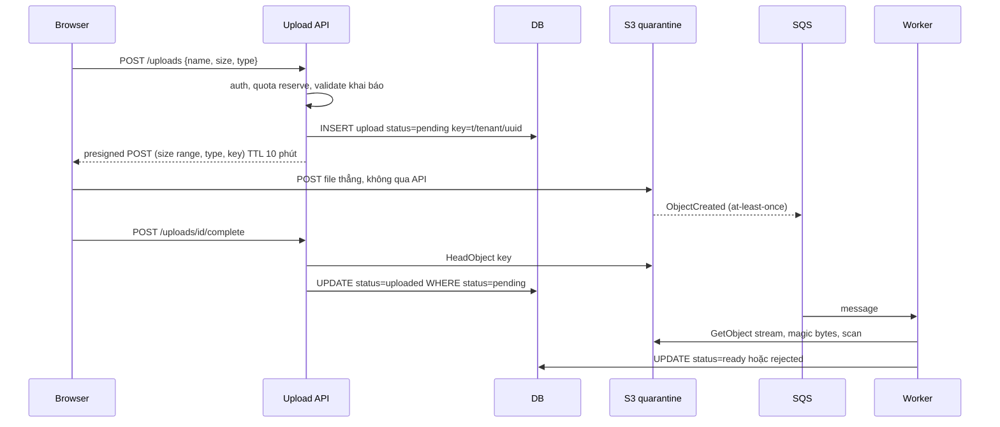
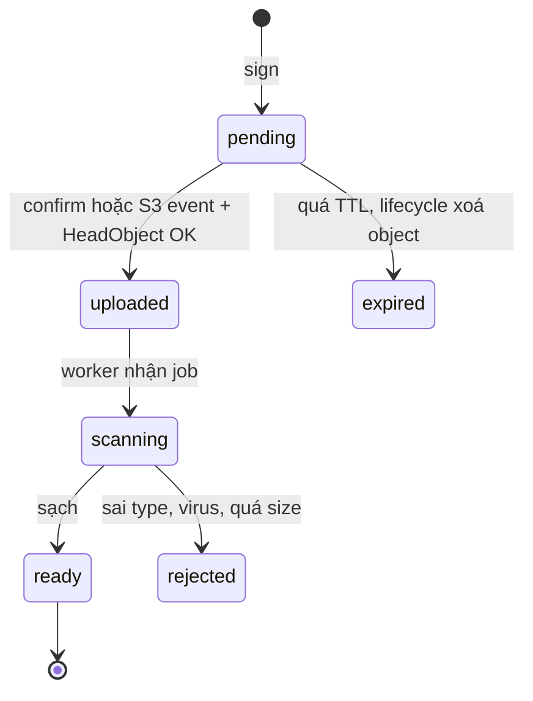

## Bối cảnh & vấn đề

Marketing chạy campaign "đăng video review nhận voucher". 20:00, khoảng 100 người cùng bấm upload video 100 MB. Endpoint `POST /videos` viết bằng NestJS với `FileInterceptor("file")`, tức Multer với storage mặc định. Pod có memory limit 2 GB. Sau vài chục giây, Kubernetes báo `OOMKilled`, pod restart, mọi request khác đang chạy trên pod (login, checkout) cũng chết theo. Client retry, traffic dồn sang pod còn sống, pod đó chết tiếp. Đây là một **cascading failure** bắt đầu từ một dòng decorator.

Gốc của vấn đề không phải "Node yếu" mà là **bytes đang đi qua API server mà không ai tính memory**. Multer `memoryStorage` đọc toàn bộ body multipart vào `file.buffer` *trước khi* handler chạy. 100 × 100 MB = 10 GB Buffer giữ đồng thời. Buffer nằm ngoài V8 heap (xem [Buffer và stream](/tracks/nodejs/learn/buffers-streams)), nên tăng `--max-old-space-size` không cứu được gì.

Bài này là playbook cho họ câu hỏi "upload file lớn trong production". Quy tắc số một: **bytes không đi qua API nếu không bắt buộc**. Client upload thẳng lên object storage (S3) bằng presigned URL hoặc presigned POST; API chỉ kiểm quyền, ký, lưu metadata và xác nhận. Kiến thức nền về S3, presigned URL và lifecycle có ở [S3 và CloudFront](/tracks/aws/learn/s3-cloudfront); bài này tập trung vào tình huống: tính toán, thiết kế flow, cái gì vỡ và trả lời phỏng vấn thế nào. Khi bytes *bắt buộc* đi qua backend (compliance, DLP inline), đọc tiếp [Stream upload qua backend](/tracks/scenario-files/learn/streaming-through-backend).

Mọi con số "đo thật" trong bài đến từ lab: Node 24.21, Express + Multer 2.4, busboy 1.6, `@aws-sdk/client-s3` 3.11xx, MinIO chạy trong Docker làm S3-compatible storage trên laptop. Con số tuyệt đối phụ thuộc máy; tỉ lệ giữa các cách mới là thứ cần nhớ.

**Interview angle:** câu mở đầu tốt luôn là hỏi lại con số: file p50/p99/max bao nhiêu, bao nhiêu upload đồng thời, client là browser hay mobile, có yêu cầu compliance bắt bytes đi qua mình không. Rồi tính memory trên giấy trước khi đề xuất giải pháp.

## Khái niệm

### Memory của một upload: buffer toàn bộ, stream, hay không chạm

Có ba "chế độ" memory cho một upload đi qua API. **Buffer toàn bộ** (Multer `memoryStorage`, `await req.arrayBuffer()`, body-parser raw): memory = kích thước file × số upload đồng thời. **Stream** (busboy, `@fastify/multipart` `request.file()`): bytes chảy qua, memory mỗi upload ≈ buffer nội bộ của các stream (`highWaterMark`, 16–64 KiB mỗi tầng) cộng buffer của đích ghi; nếu đích là `@aws-sdk/lib-storage` `Upload` thì nó giữ `partSize × queueSize` (mặc định 5 MiB × 4 ≈ 20 MB — verify). **Không chạm**: client upload thẳng S3, memory API ≈ 0 cho bytes.

Công thức cần thuộc là `concurrent × bytes giữ mỗi upload`. 100 × 100 MB = 10 GB; 100 × 20 MB (lib-storage mặc định) = 2 GB; 100 × ~100 KB (stream thuần tới disk/socket) = ~10 MB. Ví dụ: pod 2 GB, baseline app 300 MB, thì với lib-storage mặc định chỉ chịu được khoảng 80 upload đồng thời trước khi chạm limit.

### Presigned PUT

**Presigned URL** là URL mang chữ ký SigV4 trong query string, cho phép người cầm URL thực hiện **đúng một thao tác** (method + bucket + key) trong thời gian TTL, bằng quyền của credential đã ký. Presigned PUT cho phép `PUT` bytes vào một key cụ thể. Nó đơn giản (client chỉ cần `fetch(url, { method: "PUT", body: file })`) nhưng có giới hạn quan trọng: **không có điều kiện về kích thước**. Client có thể PUT tới 5 GiB (giới hạn single PUT). Header như `Content-Type` chỉ bị ép nếu nó nằm trong `SignedHeaders`; với SDK v3 mặc định thì **không** (lab bên dưới cho thấy `SignedHeaders: host`).

Ví dụ: `getSignedUrl(s3, new PutObjectCommand({ Bucket, Key, ContentType: "video/mp4" }), { expiresIn: 300 })` cho URL mà client vẫn PUT được `text/html` và 3 GB nếu muốn.

### Presigned POST và policy

**Presigned POST** là cơ chế upload qua HTML form: server tạo một **policy document** (JSON, base64, ký HMAC) liệt kê các **condition** mà S3 sẽ kiểm tra khi nhận request: `["content-length-range", 1, 104857600]`, `["starts-with", "$Content-Type", "video/"]`, `["starts-with", "$key", "u/123/"]`, `{"bucket": "uploads"}`. Client gửi `multipart/form-data` gồm các field của policy và **field `file` đặt cuối cùng**; S3 đọc các field trước file để biết policy, nên file đặt trước sẽ làm các field sau bị bỏ qua và request fail.

Đây là cách duy nhất trong các presigned flow để **S3 tự chặn size** trước khi lưu. Ví dụ: limit 100 MB thì upload 101 MB nhận `400 EntityTooLarge`.

### Multipart presigned

Với file lớn (> ~100 MB) hoặc cần resume, server gọi `CreateMultipartUpload`, ký URL cho **từng part** (`UploadPartCommand`), client PUT song song các part, server `CompleteMultipartUpload`. Không có policy size, nhưng server kiểm soát được: chỉ ký tối đa `ceil(maxSize / partSize)` part và kiểm tổng size trước khi Complete. Chi tiết part size, ETag, resume nằm ở [Multipart, resumable upload và integrity](/tracks/scenario-files/learn/multipart-resumable-integrity).

### Upload state machine

Upload direct-to-S3 là **phân tán**: client, S3 và API không cùng một transaction. Vì vậy cần một row `upload` trong DB với cột `status` và chỉ cho phép một số chuyển trạng thái: `pending → uploaded → scanning → ready | rejected`, cộng `expired` cho upload bỏ dở. Row được tạo **trước khi ký**, nên key do server sinh đã gắn với tenant/owner; bước confirm chỉ cần kiểm "key này của bạn và đang `pending`".

Update có điều kiện (`UPDATE ... WHERE id = $1 AND status = 'pending'`) làm mọi bước **idempotent**: confirm gọi hai lần, hoặc S3 event đến trước confirm, chỉ một lần thắng. Chỉ row `ready` được serve hay gắn vào business entity (bài review, hồ sơ, bài nộp).

### Admission control

**Admission control** là quyết định nhận hay từ chối một request *trước khi* tốn tài nguyên cho nó. Với upload, tài nguyên là memory, socket và băng thông nhận body. Một semaphore trong handler (`PQueue({ concurrency: 5 })`) đến quá muộn: lúc handler chạy, Multer đã đọc xong body vào RAM. Admission control đúng nằm ở LB/proxy (`limit_conn`, rate limit WAF), hoặc ở đầu handler streaming trước khi đọc byte body đầu tiên, trả `503`/`429` + `Retry-After`.

### Giới hạn từng tầng

Một request upload đi qua nhiều tầng, mỗi tầng có giới hạn riêng: nginx `client_max_body_size` (mặc định 1m) và `client_body_timeout`; ALB idle timeout (mặc định 60 s); API Gateway payload 10 MB; Lambda sync invoke 6 MB request/response (verify); Node `server.requestTimeout` (300 s mặc định từ Node 18 — verify). Triệu chứng "fail ở đúng ~6 MB / ~10 MB / đúng 60 s" là chữ ký của từng tầng. Nền tảng proxy và timeout có ở [Proxy, load balancer](/tracks/networking/learn/proxy-load-balancer) và [Timeout và debug production](/tracks/networking/learn/timeouts-production-debugging).

**Interview angle:** phân biệt được "presigned PUT không chặn size, presigned POST có `content-length-range`" và "semaphore trong handler không phải admission control" là hai điểm người phỏng vấn hay dùng để lọc ứng viên.

## Cơ chế hoạt động

### Flow direct-to-S3 với confirm và xử lý bất đồng bộ



Bước 1–4: API làm việc **nhẹ và đồng bộ**: xác thực user, kiểm và giữ chỗ quota (`used + reserved + declared ≤ quota` trong một transaction), validate size/type **khai báo** (chỉ để fail sớm, không phải để tin), sinh key `t/<tenantId>/<uuid>` và insert row `pending`. Response là `{ url, fields }` của presigned POST với TTL vài phút.

Bước 5: bytes đi thẳng từ browser tới S3. Bucket là **quarantine**: không public, không ai GET được ngoài worker. API không thấy một byte nào.

Bước 6–9: có **hai đường** dẫn tới trạng thái `uploaded`. Client gọi `complete` (nhanh, cho UX), và S3 gửi `ObjectCreated` vào SQS (phòng client đóng tab trước khi gọi complete). Cả hai chạy cùng một logic idempotent: `HeadObject` để xác minh object tồn tại, `ContentLength` ≤ limit và khớp xấp xỉ size khai báo, `ContentType`/metadata khớp, rồi `UPDATE ... WHERE status = 'pending'`. Ai đến sau thấy `rowCount = 0` và bỏ qua.

Bước 10–12: worker xử lý nặng (sniff magic bytes, quét virus, thumbnail) và chuyển `ready`/`rejected`. Lifecycle rule dọn object `pending` quá 24 giờ và multipart dở dang (xem [lesson validate và quét virus](/tracks/scenario-files/learn/file-security-processing)).

### Vòng đời trạng thái



Hai chi tiết quan trọng. Thứ nhất, **S3 event có thể đến trước confirm**, nên chuyển `pending → uploaded` phải chấp nhận cả hai nguồn. Thứ hai, `expired` là trạng thái thật: nó giải phóng quota đã reserve và cho biết tỉ lệ upload bỏ dở, một metric vận hành hữu ích.

**Interview angle:** vẽ được sequence này trong 2 phút và nói được "confirm kiểm gì" (ownership, status, HeadObject size/type, conditional update) là trả lời đủ ý câu 009.

## Ví dụ thực tế

### Đo memory: Multer memoryStorage vs busboy stream vs lib-storage

Lab: server Express nhận multipart upload; client mở **20 upload đồng thời, mỗi file 50 MB** (tổng 1 GB), body được sinh dạng stream ở client để không ảnh hưởng số đo. Server ghi lại peak `rss` và `arrayBuffers` (memory của Buffer ngoài heap) mỗi 20 ms.

```ts
// e2-server.mjs (rút gọn)
if (MODE === "multer-mem") {
  app.post("/upload", multer({ limits: { fileSize: 200 * MB } }).single("file"),
    (req, res) => res.json({ size: req.file.buffer.length }));
} else {
  app.post("/upload", (req, res) => {
    const bb = busboy({ headers: req.headers, limits: { files: 1, fileSize: 200 * MB } });
    bb.on("file", async (_n, file) => {
      if (MODE === "busboy-null") {               // stream thuần: đếm byte rồi bỏ
        let n = 0;
        await pipeline(file, new Writable({ write(c, _e, cb) { n += c.length; cb(); } }));
        return res.json({ size: n });
      }
      const body = new PassThrough();             // busboy-s3: lib-storage tới MinIO
      const up = new Upload({ client: s3, params: { Bucket, Key: `bb/${crypto.randomUUID()}`, Body: body },
        queueSize: +(process.env.QUEUE ?? 4), partSize: +(process.env.PART ?? 5) * MB });
      file.pipe(body);
      await up.done(); res.json({ ok: true });
    });
    req.pipe(bb);
  });
}
```

```text
20 x 50 MB done in 5330 ms
{"mode":"multer-mem","peakRssMB":1205,"peakArrayBuffersMB":879}
20 x 50 MB done in 2709 ms
{"mode":"busboy-null","peakRssMB":166,"peakArrayBuffersMB":65}
20 x 50 MB done in 15182 ms
{"mode":"busboy-s3","peakRssMB":551,"peakArrayBuffersMB":552}      ← queueSize 4, partSize 5 MiB
20 x 50 MB done in 15853 ms
{"mode":"busboy-s3","peakRssMB":395,"peakArrayBuffersMB":330}      ← queueSize 1, partSize 5 MiB
```

Đọc kết quả. Multer `memoryStorage` giữ gần đủ 1 GB trong `arrayBuffers` (879 MB) và RSS 1,2 GB **chỉ với 20 upload**; ngoại suy 100 × 100 MB là 10 GB, pod 2 GB chết chắc. Stream thuần dừng ở 166 MB RSS bất kể file to cỡ nào. lib-storage nằm giữa: ~27 MB/upload với mặc định (551/20), khớp với `5 MiB × 4` cộng overhead; giảm `queueSize` về 1 còn ~16 MB/upload. Nghĩa là "stream" không tự động là "64 KB": đích ghi quyết định memory.

Một quan sát phụ từ lab: khi thử `partSize` 16 MiB với 20 upload, MinIO bắt đầu reset connection, `up.done()` reject và **không có `.catch`**, nên unhandled rejection giết cả process server. Sau lần crash đó, `ListMultipartUploads` còn 11 upload dở dang. Một upload lỗi không được xử lý không chỉ làm hỏng chính nó.

### Presigned PUT không chặn size, presigned POST thì có

Lab trên MinIO (S3-compatible). Limit mong muốn là 1 MB; client cố upload 3 MB.

```ts
// PUT: chỉ ký method + key (+ header nếu được hoist/ký)
const putUrl = await getSignedUrl(s3, new PutObjectCommand({ Bucket, Key: "put/a.bin", ContentType: "video/mp4" }), { expiresIn: 300 });
await fetch(putUrl, { method: "PUT", body: Buffer.alloc(3 * MB, 1), headers: { "Content-Type": "video/mp4" } });

// POST: policy có content-length-range và Content-Type prefix
const { url, fields } = await createPresignedPost(s3, { Bucket, Key: "post/b.bin",
  Conditions: [["content-length-range", 1, 1 * MB], ["starts-with", "$Content-Type", "video/"]],
  Fields: { "Content-Type": "video/mp4" }, Expires: 300 });
const fd = new FormData();
for (const [k, v] of Object.entries(fields)) fd.append(k, v);
fd.append("file", new Blob([buf]));                   // file LUÔN đặt cuối
await fetch(url, { method: "POST", body: fd });
```

```text
presigned PUT 3 MB      -> 200 stored ContentLength = 3145728
PUT with text/html     -> 200
presigned POST 3 MB     -> 400 EntityTooLarge
presigned POST 500 KB   -> 204
POST type text/html     -> 403 AccessDenied
SignedHeaders: host | crc32: AAAAAA==
with signableHeaders: content-type;host
PUT text/html -> 403 SignatureDoesNotMatch
PUT video/mp4 -> 200
```

Presigned PUT nhận cả 3 MB lẫn `text/html` dù code "có ký `ContentType`", vì SDK v3 mặc định chỉ đưa `host` vào `SignedHeaders`. Muốn ép `Content-Type` phải truyền `signableHeaders: new Set(["content-type"])`, và lúc đó browser gửi sai type sẽ nhận `403 SignatureDoesNotMatch` (đúng là follow-up của câu 010). Presigned POST thì S3 tự từ chối: `400 EntityTooLarge` khi vượt range, `403 AccessDenied` khi type không khớp `starts-with`.

Để ý dòng `crc32: AAAAAA==`: SDK v3 bản mới tự thêm `x-amz-checksum-crc32` vào URL presigned, và giá trị đó là CRC32 của body **rỗng** lúc ký. MinIO trong lab bỏ qua nó, nhưng trên AWS S3 thật, upload với body khác sẽ bị từ chối vì checksum không khớp (verify theo version SDK). Cách xử lý (`requestChecksumCalculation: "WHEN_REQUIRED"` cho client dùng để ký) được giải thích ở [bẫy checksum mặc định của SDK v3](/tracks/aws/learn/s3-cloudfront).

### Review helper presigned cũ (câu 010)

```ts
// TRƯỚC: aws-sdk v2, key từ tên client, TTL 1 giờ, không auth/quota
return s3.getSignedUrlPromise("putObject", { Bucket: "uploads", Key: `videos/${fileName}`, ContentType: "video/mp4", Expires: 3600 });

// SAU: SDK v3, key server sinh, row pending, presigned POST có size range, TTL ngắn
export async function createUpload(user: User, input: { name: string; size: number; type: string }) {
  if (input.size > 100 * MB || !input.type.startsWith("video/")) throw new BadRequest("declared");
  await quota.reserve(user.tenantId, input.size);                          // transaction: used + reserved + size <= limit
  const key = `t/${user.tenantId}/${crypto.randomUUID()}`;
  const row = await db.upload.insert({ tenantId: user.tenantId, ownerId: user.id, key,
    declaredSize: input.size, declaredType: input.type, originalName: sanitize(input.name), status: "pending" });
  const post = await createPresignedPost(s3, { Bucket: "uploads-quarantine", Key: key, Expires: 600,
    Conditions: [["content-length-range", 1, 100 * MB], ["eq", "$Content-Type", input.type]],
    Fields: { "Content-Type": input.type } });
  return { uploadId: row.id, ...post };
}
```

Bốn lỗi của bản cũ: SDK v2 đã end-of-support từ 2025-09-08 (không còn bản vá bảo mật); key lấy từ `fileName` nên user ghi đè được file người khác hoặc chèn path lạ; TTL 1 giờ quá dài cho một thao tác upload; presigned PUT không chặn size và không có kiểm quyền/quota trước khi ký. Tên gốc vẫn được giữ, nhưng **trong DB** (đã sanitize) để hiển thị và đặt `Content-Disposition` khi download.

### Confirm endpoint idempotent

```ts
export async function completeUpload(user: User, uploadId: string) {
  const row = await db.upload.findFirst({ where: { id: uploadId, ownerId: user.id } });
  if (!row) throw new NotFound();
  if (row.status !== "pending") return row;                         // idempotent: gọi lại không lỗi
  const head = await s3.send(new HeadObjectCommand({ Bucket: "uploads-quarantine", Key: row.key }))
    .catch(() => null);
  if (!head) throw new Conflict("object_missing");                  // client gọi complete trước khi upload xong
  if (head.ContentLength! > 100 * MB || Math.abs(head.ContentLength! - row.declaredSize) > 1024)
    return reject(row, "size_mismatch");                            // xoá object, release quota
  const { rowCount } = await db.query(
    "UPDATE upload SET status = 'uploaded', size = $2, etag = $3 WHERE id = $1 AND status = 'pending'",
    [row.id, head.ContentLength, head.ETag]);
  if (rowCount === 1) await queue.send({ type: "scan", uploadId: row.id });
  return db.upload.findUnique({ where: { id: row.id } });
}
```

S3 event handler gọi cùng hàm (không có `user`, tìm row theo `key`). Thứ tự nào đến trước cũng ra kết quả giống nhau.

## Tình huống burst và thiết kế lớn

### 5.000 bài nộp trước 23:59 (câu 029)

Tính trước: 5.000 sinh viên × ~100 MB = 500 GB trong 10 phút ≈ 830 MB/s ≈ 6,7 Gbps vào. Không fleet API nào nên nhận lượng bytes đó; với kiến trúc cũ (upload qua API), 23:55 là lúc pod hết memory và socket. Kiến trúc đúng: **presigned multipart thẳng S3**. S3 scale request theo prefix (khoảng 3.500 PUT/s mỗi prefix — verify), nên key nên phân tán: `submissions/<courseId>/<uuid>`.

Phần công bằng của deadline là quyết định nghiệp vụ, không phải kỹ thuật: ghi `submitted_at` bằng **giờ server lúc khởi tạo upload**, cho phép hoàn tất muộn thêm N phút với điều kiện upload được tạo trước 23:59. Như vậy deadline không phụ thuộc mạng ký túc xá lúc 23:58. API còn lại phần nhẹ: sign, confirm, ghi DB, vài trăm request/s; vẫn cần rate limit per user, idempotency key theo `uploadId`, connection pool đủ, và load test với profile burst trước kỳ thi. Bằng chứng khi sinh viên khiếu nại: log sign (giờ, user), `CreateMultipartUpload` và part trong S3/CloudTrail data events, log lỗi phía client nếu có telemetry.

### File service multi-tenant 1M upload/ngày (câu 047)

Số: 1M/ngày ≈ 12 upload/s trung bình, peak ×10 ≈ 120 sign/s, API rất nhẹ. Bytes: giả sử trung bình 20 MB thì 20 TB/ngày, nên **không qua API**: presigned POST cho file ≤ 100 MB, multipart presigned cho file lớn tới 5 GB.

Thành phần: Upload API (sign, confirm, quota), DB metadata (state machine, index theo `tenant_id`, partition theo tháng nếu bảng lớn), S3 quarantine → scan worker → bucket clean, worker preview/thumbnail, CloudFront + signed URL/cookie cho download, lifecycle (abort MPU, expire pending, chuyển IA/Glacier theo tuổi). **Isolation**: key prefix `t/<tenantId>/`, IAM policy theo prefix cho worker, mọi query có `tenant_id`, KMS key per tenant nếu hợp đồng yêu cầu, và **không bao giờ nhận key từ client**. **Quota**: reserve ở bước sign, trừ thật ở confirm theo `HeadObject`, release khi expire. **Fairness**: một tenant chiếm 40% bytes không được làm chậm scan của tenant khác, nên queue scan có phân vùng hoặc weighted fair theo tenant.

### Upload xuyên lục địa và data residency (câu 056)

User Đông Nam Á và châu Âu upload 2 GB vào bucket `us-east-1` mất 40 phút. Đo trước: throughput thật, RTT, số part song song. Một TCP connection qua đường RTT 250 ms bị giới hạn bởi window/RTT, nên **multipart song song 6–10 part** thường cải thiện đáng kể. **S3 Transfer Acceleration** đưa upload vào edge gần nhất rồi đi backbone AWS, tính thêm phí/GB và chỉ đáng khi thật sự nhanh hơn (verify bảng giá). Data residency là ràng buộc khác hẳn: tenant EU phải có bucket ở region EU (vd `eu-central-1`), API chọn bucket theo tenant lúc ký, metadata chứa PII cũng phải tuân thủ, replication chỉ trong EU. Nhiều bucket nghĩa là nhiều config, nên IaC module hoá.

## Trade-offs & lựa chọn thay thế

| Cách upload | Memory API | Chặn size | Validate trước khi lưu | Resumable | Độ phức tạp | Hợp khi |
|---|---|---|---|---|---|---|
| Multer `memoryStorage` | file × N (lab: 1,2 GB/20 upload 50 MB) | `limits.fileSize` | Có | Không | Thấp | Avatar < 5 MB, traffic thấp |
| Multer `diskStorage` | Thấp, tốn disk tạm | Có | Có (đọc lại disk) | Không | Thấp | Cần tool CLI xử lý file local |
| busboy → lib-storage | `partSize × queueSize`/upload (lab: ~16–27 MB) | Có, lúc stream | Có, inline | Không | Trung bình | Compliance bắt đi qua backend |
| Presigned PUT | ~0 | **Không** | Sau upload | Không | Thấp | File vừa, cần đơn giản |
| Presigned POST | ~0 | **Có** (`content-length-range`) | Sau upload | Không | Thấp | Browser upload ≤ vài trăm MB |
| Multipart presigned | ~0 | Qua số part được ký + check trước Complete | Sau upload | **Có** | Cao | File lớn, mạng yếu |

Chọn theo kích thước và ràng buộc, không theo thói quen. File nhỏ (avatar, ảnh < 5 MB) và traffic thấp: Multer memory với `limits` chặt vẫn chấp nhận được, miễn là có giới hạn đồng thời. File vừa từ browser: presigned POST là mặc định tốt vì vừa chặn size vừa không tốn API. File lớn hoặc mạng di động: multipart presigned với resume. Chỉ đưa bytes qua backend khi có yêu cầu thật (DLP inline, mã hoá trước khi chạm storage, storage không có presigned) và khi đó thiết kế memory budget rõ ràng.

Presigned PUT vẫn có chỗ: server-to-server, client tin cậy, hoặc khi đã có bước verify sau upload (HeadObject + xoá nếu vượt). Nhưng nếu requirement nói "chặn 100 MB", PUT không đáp ứng được ở tầng storage.

## Edge cases & failure modes

- **Client không bao giờ gọi confirm**: đóng tab, mất mạng ngay sau upload. Không có S3 event dự phòng thì object nằm mãi ở `pending`; có lifecycle + reconciler thì object bị dọn và quota được trả lại.
- **S3 event đến trước confirm**: logic idempotent xử lý được; logic "confirm tạo row" thì event tìm không thấy row và bị bỏ.
- **Upload đúng key nhưng file khác size khai báo**: `HeadObject` phát hiện; nếu chỉ tin `declaredSize` thì quota bị lách.
- **URL hết hạn giữa chừng**: presigned được kiểm khi **bắt đầu** request; upload dài hơn TTL vẫn xong nếu đã bắt đầu, nhưng retry sau TTL cần URL mới. Ký bằng temporary credentials (role, STS) thì URL hết hạn khi session hết hạn, có thể sớm hơn `expiresIn`.
- **Clock skew**: máy ký lệch giờ vài phút làm URL "chưa hiệu lực" hoặc "đã hết hạn" (`RequestTimeTooSkewed`).
- **Retry storm sau OOM**: client tự retry upload 100 MB ngay lập tức nhân tải lên pod còn lại. Cần backoff + jitter ở client và `503 Retry-After` từ server.
- **Fail ở đúng 6 MB / 10 MB / 60 s**: Lambda payload, API Gateway payload, ALB idle timeout hoặc nginx timeout. Nâng mọi timeout lên 1 giờ chỉ làm socket bị giữ lâu hơn, deploy khó drain và slowloris rẻ hơn; sửa đúng là đưa bytes ra khỏi đường đó.
- **CORS**: presigned POST/PUT từ browser cần CORS trên bucket (`AllowedOrigins` khớp chính xác scheme + host); lỗi CORS trông như "network error" ở client.

## Pitfalls

- ❌ Tăng memory pod lên 16 GB khi OOM vì upload → ✅ tính `concurrent × bytes giữ mỗi upload`, đưa bytes ra khỏi API; memory lớn chỉ dời ngưỡng chết.
- ❌ Tăng `--max-old-space-size` → ✅ Buffer nằm ngoài V8 heap (lab: 879 MB `arrayBuffers`), flag đó không giới hạn chúng.
- ❌ Presigned PUT để "chặn 100 MB" → ✅ presigned POST với `content-length-range`, hoặc multipart với số part giới hạn, và luôn `HeadObject` khi confirm.
- ❌ Key từ `fileName` của client → ✅ key `t/<tenant>/<uuid>` do server sinh, tên gốc lưu DB.
- ❌ Insert record file sau khi client nói "xong" → ✅ row `pending` trước khi ký, conditional update, S3 event làm đường dự phòng.
- ❌ `PQueue({ concurrency: 5 })` quanh upload Multer → ✅ admission control trước khi đọc body (LB, proxy, semaphore ở đầu handler streaming), queue bounded và trả 503 khi đầy.
- ❌ Copy helper dùng `aws-sdk` v2 → ✅ SDK v3 (`@aws-sdk/s3-request-presigner`, `@aws-sdk/s3-presigned-post`), và biết bẫy checksum mặc định của v3.
- ❌ `up.done()` không `.catch` → ✅ mọi promise upload có xử lý lỗi; lab cho thấy một reject làm chết cả process và để lại multipart dở dang.

## Kể chuyện thực tế (câu 057)

Câu behavioral cần con số trước/sau và phần bạn tự làm. Khung gợi ý: **S** tính năng upload video/đính kèm, ~100 upload đồng thời giờ cao điểm, pod OOMKilled mỗi tối; **T** mục tiêu không còn OOM, p95 upload < 2 phút cho 100 MB, fail rate < 1%; **A** đo memory per pod và lỗi theo tầng, chuyển sang presigned POST + state machine, thêm lifecycle và reconciler, load test burst; **R** RSS pod upload từ ~1,8 GB xuống ~250 MB, fail rate từ 6% xuống 0,4%, bill compute giảm vì bỏ được pool pod upload riêng. Reflection: đáng lẽ load test profile burst từ đầu và alert "incomplete MPU bytes" sớm hơn. Con số ở đây là minh hoạ; dùng số thật của bạn.

## Tóm tắt

- Memory upload = `concurrent × bytes giữ mỗi upload`. Lab: Multer memory 20 × 50 MB → 1,2 GB RSS; busboy stream thuần → 166 MB; lib-storage → ~27 MB/upload mặc định, ~16 MB với `queueSize` 1.
- Quy tắc số một: bytes không đi qua API. Client upload thẳng S3; API chỉ auth, quota, ký, confirm.
- Presigned PUT không chặn size và (SDK v3 mặc định) không ép `Content-Type`; presigned POST có `content-length-range` và `starts-with`, S3 trả `400 EntityTooLarge` / `403 AccessDenied`.
- Row `pending` tạo trước khi ký; confirm kiểm ownership + status + `HeadObject`; S3 event là đường dự phòng; mọi bước là conditional update idempotent.
- Admission control phải xảy ra trước khi đọc body; queue trong handler không bảo vệ memory.
- Fail ở 6 MB / 10 MB / 60 s là chữ ký của Lambda / API Gateway / ALB idle timeout; sửa bằng cách đổi đường đi của bytes, không phải nâng timeout.
- Burst có deadline: presigned multipart + ghi giờ ở bước khởi tạo; thiết kế lớn: số liệu trước, isolation theo prefix, quota reserve, fairness theo tenant, bucket theo region khi có data residency.
