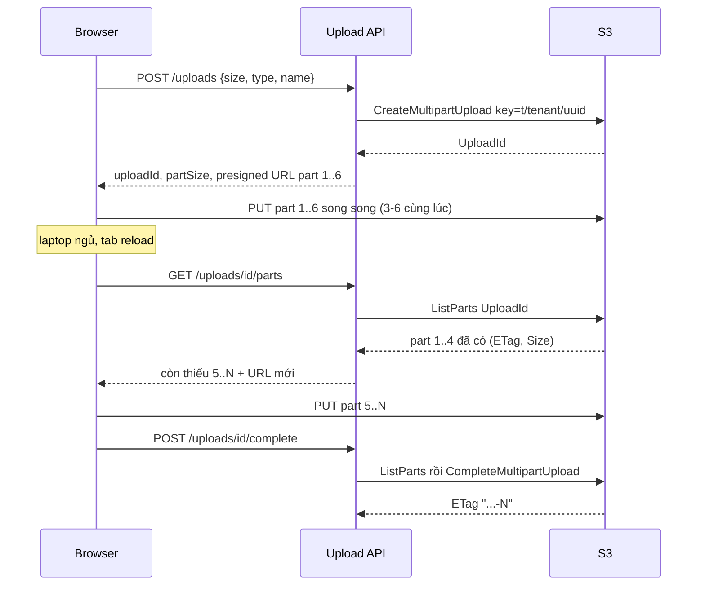
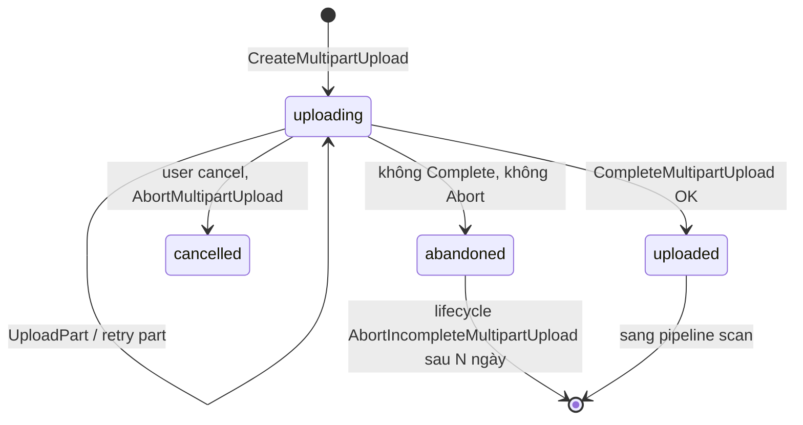

## Bối cảnh & vấn đề

Một team dựng phim upload footage thô 5 GB từ browser. Upload bằng một presigned PUT duy nhất. Ở 80%, laptop đi ngủ, Wi-Fi rớt, request chết, và user phải upload lại **từ đầu**: thêm 40 phút. Cùng tháng đó, finance hỏi vì sao bill S3 của bucket upload tăng đều mỗi tháng, trong khi `ListObjects` chỉ thấy 200 GB. Và một khách hàng báo file 3 GB tải về bị hỏng dù "upload thành công".

Ba triệu chứng, một chủ đề: upload file lớn cần được **chia nhỏ** (để retry và resume từng phần), **dọn dẹp** (phần dở dang vẫn tốn tiền) và **kiểm tra toàn vẹn** (bytes nhận được đúng là bytes đã gửi). S3 multipart upload giải quyết cả ba nếu dùng đúng, và tạo ra ba loại bug mới nếu dùng sai.

Bài này giả định bạn đã có flow direct-to-S3 với state machine ở [bài upload trực tiếp](/tracks/scenario-files/learn/upload-direct-to-storage). Kiến thức nền về S3 (presigned, lifecycle, storage class) nằm ở [S3 và CloudFront](/tracks/aws/learn/s3-cloudfront). Các số đo trong bài đến từ lab MinIO (S3-compatible) chạy trong Docker với `@aws-sdk/client-s3` v3 bản 3.11xx; hành vi AWS S3 thật được ghi rõ khi khác.

**Interview angle:** interviewer muốn nghe bạn nói ra con số giới hạn (5 MiB, 10.000 part, 5 GiB/part), tính part size cho một file cụ thể, và giải thích resume dựa trên **server-side source of truth** (`ListParts`) chứ không dựa trên trí nhớ của client.

## Khái niệm

### Multipart upload và giới hạn

**Multipart upload (MPU)** chia một object thành nhiều **part** được upload độc lập, có thể song song và theo bất kỳ thứ tự nào, rồi ghép lại bằng một lệnh `CompleteMultipartUpload`. Ba API cốt lõi: `CreateMultipartUpload` (trả `UploadId`), `UploadPart` (mỗi part có `PartNumber` 1–10.000, trả `ETag`), `CompleteMultipartUpload` (danh sách `{PartNumber, ETag}` theo thứ tự tăng dần). Thêm `AbortMultipartUpload` để huỷ và `ListParts`/`ListMultipartUploads` để tra cứu.

Giới hạn cần thuộc: part tối thiểu **5 MiB** (trừ part cuối), tối đa **5 GiB**; tối đa **10.000 part**; single PUT tối đa 5 GiB; object tối đa 5 TiB (AWS có thông báo nâng lên 50 TB cuối 2025 — verify). AWS khuyến nghị dùng MPU khi object > 100 MB. Part nhỏ hơn 5 MiB không bị từ chối lúc upload part, mà bị từ chối lúc **Complete** với lỗi `EntityTooSmall` (lab bên dưới cho thấy đúng như vậy).

### Chọn part size

Part size quyết định số request, chi phí retry và memory. Công thức tối thiểu: `ceil(size / 10.000)`, làm tròn lên ít nhất 5 MiB. Ví dụ file backup 200 GB: 200 GB / 10.000 = 20 MB, nên chọn **32 MiB** (~6.400 part) để chừa dư nếu file lớn hơn dự kiến. File video 5 GB từ browser: 5 GB / 10.000 = 0,5 MB, nhỏ hơn mức tối thiểu, nên chọn theo trải nghiệm: 8–16 MiB, vừa đủ nhỏ để retry một part trên mạng yếu không mất nhiều, vừa đủ lớn để không có hàng nghìn request.

Trade-off: part to thì ít request (PUT tính tiền theo request), nhưng retry một part tốn nhiều hơn và buffer RAM lớn hơn (ở phía Node, `partSize × queueSize`); part nhỏ thì nhiều request và overhead TLS/HTTP. Song song 4–6 part cho browser, 8–10 cho server-to-server băng thông lớn.

### ETag của part và của object

**ETag** là định danh nội dung S3 trả về. Với single PUT không mã hoá SSE-KMS, ETag thường là MD5 của object. Với MPU, ETag của **object** là `MD5(MD5(part1) || MD5(part2) || ...)` nối thêm `-N` (N = số part), **không phải** MD5 của file. Hệ quả: so ETag với `md5sum` local luôn sai với file multipart, và hai lần upload cùng file với part size khác nhau cho ra ETag khác nhau.

Ví dụ trong lab: file 13 MiB chia 3 part, ETag cuối là `"092e7072...fe83-3"`, trong khi `md5(file)` là `f2a891df...51f6`.

### Checksum: Content-MD5 và x-amz-checksum-*

S3 hỗ trợ kiểm toàn vẹn khi nhận: client gửi `Content-MD5` hoặc `x-amz-checksum-crc32 | crc32c | sha1 | sha256 | crc64nvme` kèm request, S3 tính lại và **từ chối** nếu không khớp. Với MPU, mỗi part có checksum riêng; object có thể lưu **composite checksum** (checksum của các checksum part, kèm `-N`) hoặc **full-object checksum** (CRC64NVME và CRC32/CRC32C hỗ trợ kiểu full-object cho MPU — verify). Full-object checksum hữu ích vì client có thể tính trên toàn file và so sánh trực tiếp.

Từ đầu 2025, AWS SDK v3 mặc định **tự tính CRC32** cho upload (`requestChecksumCalculation: "WHEN_SUPPORTED"`) và validate checksum khi download (`responseChecksumValidation: "WHEN_SUPPORTED"`) (verify). Điều này phá một số S3-compatible storage cũ và presigned flow, vì header checksum xuất hiện ở nơi trước đây không có. Cách tắt cho endpoint đó: set cả hai về `"WHEN_REQUIRED"`.

### Resumable upload

**Resumable** nghĩa là sau khi mất kết nối, client tiếp tục từ chỗ dừng thay vì từ đầu. Với S3 MPU, trạng thái cần giữ là `UploadId` + key + part size; **nguồn sự thật về part nào đã xong là `ListParts`** của S3, không phải bộ nhớ client (IndexedDB có thể bị xoá, có thể lệch vì part upload xong nhưng response bị mất). Client cũng phải chứng minh đang resume **cùng một file**: so size + `lastModified` + hash vài MB đầu.

### Incomplete multipart upload

MPU đã `Create` nhưng chưa `Complete` hoặc `Abort` là **incomplete MPU**. Các part đã upload được lưu và **tính tiền storage**, nhưng **không xuất hiện** trong `ListObjects`. Không có hạn tự huỷ mặc định. Đây là thủ phạm số một của câu "bill tăng nhưng ListObjects chỉ thấy 200 GB". Lưới an toàn là lifecycle rule `AbortIncompleteMultipartUpload` với `DaysAfterInitiation` 1–7.

### tus

**tus** là protocol mở cho resumable upload qua HTTP: `POST` tạo upload (header `Upload-Length`), `HEAD` hỏi `Upload-Offset` hiện tại, `PATCH` gửi tiếp bytes từ offset đó. Có client lib cho web (tus-js-client, Uppy), iOS (TUSKit), Android, và server tusd có backend S3 với hooks (pre-create để auth, post-finish để tạo job). Khác biệt lớn với S3 MPU: bytes **đi qua tusd** (bạn phải scale fleet đó và trả băng thông), đổi lại client không cần hiểu S3.

**Interview angle:** "ETag multipart không phải MD5 file" và "incomplete MPU không hiện trong ListObjects nhưng vẫn tính tiền" là hai gotcha xuất hiện rất thường, trả lời được kèm cách kiểm (`ListMultipartUploads`, Storage Lens) là điểm cộng.

## Cơ chế hoạt động

### Resumable upload với presigned part



Server lưu `uploadId`, key, part size, owner và trạng thái `uploading` trong DB ngay khi `Create`. Client nhận URL presigned theo **batch** (ví dụ 6 part một lần, TTL 15 phút) thay vì ký trước cả nghìn URL, để URL ngắn hạn và server biết tiến độ. Khi resume, server hỏi S3 qua `ListParts` và chỉ ký lại các part còn thiếu.

Bước Complete chạy **ở server**: server gọi `ListParts` để lấy ETag chính xác của từng part (không phụ thuộc client đọc được header `ETag`), kiểm tổng `Size` ≤ limit và đúng size khai báo, rồi mới `CompleteMultipartUpload`. Như vậy client không thể ghép part của upload khác hay vượt quota.

### Từ upload tới dọn dẹp



Nhánh `abandoned` là nhánh hay bị quên. Nó không có code nào chạy: chỉ lifecycle rule (hoặc job dọn dẹp tự viết gọi `ListMultipartUploads` + `Abort`) đưa nó về trạng thái kết thúc. Trong DB, reconciler đánh dấu row `uploading` quá N giờ là `expired` để giải phóng quota.

**Interview angle:** nói rõ "Complete ở server sau ListParts" trả lời luôn follow-up của câu 011 (cho browser tự Complete hay không) và giải thích vì sao CORS ETag chỉ là vấn đề của thiết kế để client tự ghép.

## Ví dụ thực tế

### Resume sau crash, ETag multipart và EntityTooSmall (chạy thật trên MinIO)

Script mô phỏng browser: tạo MPU, PUT part 1 và 2 bằng presigned URL, "mất tab", rồi resume chỉ với `UploadId` bằng `ListParts`, upload part 3 và Complete. Sau đó so ETag với MD5 tự tính, và thử Complete với part 1 MiB.

```ts
const MiB = 1048576, PART = 5 * MiB;
const file = Buffer.alloc(13 * MiB); for (let i = 0; i < file.length; i++) file[i] = i % 251;
const parts = [file.subarray(0, PART), file.subarray(PART, 2 * PART), file.subarray(2 * PART)];
const { UploadId } = await s3.send(new CreateMultipartUploadCommand({ Bucket, Key }));
const putPart = async (n: number) => {
  const url = await getSignedUrl(s3, new UploadPartCommand({ Bucket, Key, UploadId, PartNumber: n }), { expiresIn: 300 });
  const r = await fetch(url, { method: "PUT", body: parts[n - 1] });
  return r.headers.get("etag");
};
await putPart(1); await putPart(2);
// --- mất tab: chỉ còn UploadId ---
const listed = (await s3.send(new ListPartsCommand({ Bucket, Key, UploadId }))).Parts!;
const e3 = await putPart(3);
const done = await s3.send(new CompleteMultipartUploadCommand({ Bucket, Key, UploadId, MultipartUpload: {
  Parts: [...listed.map(({ PartNumber, ETag }) => ({ PartNumber, ETag })), { PartNumber: 3, ETag: e3 }] } }));
const md5 = (b: Buffer) => createHash("md5").update(b).digest();
console.log(done.ETag, md5(file).toString("hex"), md5(Buffer.concat(parts.map(md5))).toString("hex") + "-3");
```

```text
part 1 ETag header: "4c28640dc8df1933aaea192100d50ae0"
part 2 ETag header: "e264fa295ef081d5ad9bfaa7e5e130b6"
--- laptop sleeps, tab reloads; client only remembers UploadId ---
ListParts: [{"PartNumber":1,"ETag":"\"4c28640dc8df1933aaea192100d50ae0\"","Size":5242880},{"PartNumber":2,"ETag":"\"e264fa295ef081d5ad9bfaa7e5e130b6\"","Size":5242880}]
ListObjectsV2 prefix mpu/: 0 objects | ListMultipartUploads: 1 in progress
final ETag         : "092e7072d0f60c47cd993f27a882fe83-3"
md5(file)          : f2a891df83bc4951d4c6a7304f0351f6
md5(concat md5s)-N : "092e7072d0f60c47cd993f27a882fe83-3"
complete with 1 MiB part 1 -> EntityTooSmall
```

(Dòng `ListObjectsV2 | ListMultipartUploads` ghép từ hai lần chạy: lần đầu `ListObjectsV2` thấy 0 object; lần hai sửa lại cách lọc `ListMultipartUploads` vì MinIO không trả kết quả khi truyền `Prefix`, thấy 1 upload đang dở.)

Bốn điều lab chứng minh. Một, `ListParts` trả đủ `PartNumber`, `ETag`, `Size` cho các part đã xong, đủ để resume mà không cần client nhớ gì ngoài `UploadId`. Hai, upload đang dở **không có trong `ListObjectsV2`** nhưng có trong `ListMultipartUploads`: đó chính là bytes "vô hình" trong bill. Ba, ETag cuối khớp chính xác công thức MD5 của các MD5 + `-3`, và khác hẳn MD5 file. Bốn, part 1 MiB (không phải part cuối) chỉ bị từ chối ở bước Complete với `EntityTooSmall`, nghĩa là bạn đã trả tiền upload và request trước khi biết mình sai.

ETag trong `ListParts` có **dấu nháy kép** bao quanh; khi Complete, gửi nguyên văn. Một số client cắt dấu nháy rồi gửi, S3 thật vẫn chấp nhận nhưng một số storage tương thích thì không; đừng "làm đẹp" ETag.

### CORS: ETag null trong browser (câu 011)

Khi browser PUT part trực tiếp tới S3 và tự đọc `ETag`, response là **cross-origin**. Browser chỉ cho JavaScript đọc các **CORS-safelisted response header** (`Content-Type`, `Content-Length`, `Cache-Control`, ...) và những header server liệt kê trong `Access-Control-Expose-Headers`. `ETag` không thuộc danh sách safelisted, nên `xhr.getResponseHeader("ETag")` trả `null` dù request 200.

```json
[
  {
    "AllowedOrigins": ["https://app.example.com"],
    "AllowedMethods": ["PUT", "POST", "GET"],
    "AllowedHeaders": ["*"],
    "ExposeHeaders": ["ETag", "x-amz-checksum-crc32"],
    "MaxAgeSeconds": 3000
  }
]
```

Thêm `ExposeHeaders: ["ETag"]` (và header checksum nếu client cần đọc). Cách bền hơn: server gọi `ListParts` rồi tự Complete như sơ đồ ở trên, và client không cần đọc ETag nữa. Nhớ preflight được cache theo `MaxAgeSeconds`, nên sửa CORS xong có thể phải đợi hoặc mở tab mới mới thấy hiệu lực. CORS từ góc nhìn browser được giải thích ở [CORS và same-origin](/tracks/networking/learn/cors-same-origin).

### Progress, cancel, retry ở client (câu 028)

```ts
// minh hoạ: upload một part với progress + abort + retry
function putPart(url: string, blob: Blob, onBytes: (n: number) => void, signal: AbortSignal) {
  return new Promise<string>((resolve, reject) => {
    const xhr = new XMLHttpRequest();
    xhr.open("PUT", url);
    xhr.upload.onprogress = (e) => onBytes(e.loaded);          // fetch() chưa có upload progress chuẩn
    xhr.onload = () => (xhr.status < 300 ? resolve(xhr.getResponseHeader("ETag")!) : reject(Object.assign(new Error("http"), { status: xhr.status })));
    xhr.onerror = () => reject(new Error("network"));
    signal.addEventListener("abort", () => xhr.abort());
    xhr.send(blob);
  });
}
async function withRetry(n: number, fn: () => Promise<string>, refreshUrl: () => Promise<void>) {
  for (let attempt = 0; ; attempt++) {
    try { return await fn(); }
    catch (e: any) {
      if (attempt >= 5) throw e;
      if (e.status === 403) await refreshUrl();                  // URL hết hạn: xin URL mới
      else if (e.status && e.status < 500) throw e;              // 4xx khác: không retry
      await new Promise((r) => setTimeout(r, Math.min(30_000, 500 * 2 ** attempt) * (0.5 + Math.random())));
    }
  }
}
```

**Progress** tổng = bytes của part đã xong + `loaded` của các part đang chạy, chia cho size. **Cancel** = `AbortController` huỷ mọi XHR đang chạy và gọi API huỷ để server `AbortMultipartUpload` và đánh dấu row `cancelled`. **Retry** theo part với exponential backoff + jitter; PUT cùng `PartNumber` ghi đè part cũ nên retry là idempotent. Integrity: ký `x-amz-checksum-crc32` (hoặc `Content-MD5`) của từng part vào URL để S3 từ chối part hỏng. Không muốn tự viết: Uppy với `@uppy/aws-s3` (multipart) hoặc tus.

Khi progress đạt 100% nhưng file chưa dùng được (đang scan, đang transcode), UI phải hiện trạng thái thứ hai, ví dụ "Đang kiểm tra file…", lấy từ status của row qua polling hoặc SSE. Đừng để thanh progress đứng ở 100% trong 40 giây không giải thích.

### Lifecycle cho incomplete MPU và object chưa confirm (câu 005)

```json
{
  "Rules": [
    { "ID": "abort-mpu", "Status": "Enabled", "Filter": {},
      "AbortIncompleteMultipartUpload": { "DaysAfterInitiation": 3 } },
    { "ID": "expire-pending", "Status": "Enabled",
      "Filter": { "Tag": { "Key": "status", "Value": "pending" } },
      "Expiration": { "Days": 1 } },
    { "ID": "noncurrent", "Status": "Enabled", "Filter": {},
      "NoncurrentVersionExpiration": { "NoncurrentDays": 30 } }
  ]
}
```

Rule một dọn MPU bỏ dở. Rule hai dọn object upload xong nhưng không bao giờ được confirm: presigned POST đặt tag `status=pending` lúc upload, confirm gỡ tag hoặc copy sang prefix khác. Rule ba dành cho bucket bật versioning: mỗi lần ghi đè giữ lại một noncurrent version, cũng không thấy trong list thường. Kiểm tra trước khi sửa: `aws s3api list-multipart-uploads --bucket ...`, S3 Storage Lens có metric bytes của incomplete MPU, và Cost Explorer theo usage type.

## Integrity end-to-end (câu 045)

Khách hàng báo file 3 GB tải về bị hỏng. Integrity phải được nhìn theo từng chặng:

1. **Client → S3 khi upload**: checksum từng part (`x-amz-checksum-crc32`/`Content-MD5`), S3 từ chối part hỏng. Lưu thêm SHA-256 hoặc full-object CRC64NVME của file vào DB lúc confirm.
2. **S3 lưu trữ**: S3 tự bảo vệ dữ liệu ở rest; đây hiếm khi là chỗ hỏng.
3. **S3 → client khi download**: thủ phạm thường gặp là proxy cắt giữa chừng mà response **không có `Content-Length`** (client không biết thiếu), hoặc resume bằng Range ghép nhầm hai phiên bản file vì thiếu `If-Range`. Xem [download, Range và export](/tracks/scenario-files/learn/download-range-export).
4. **Cho khách tự kiểm**: hiển thị SHA-256 cạnh link tải (hoặc header `x-amz-checksum-sha256` nếu đã lưu), để họ chạy `shasum -a 256`.

Phần thứ hai của câu hỏi: sau khi nâng SDK v3, upload tới storage S3-compatible ở region khác bắt đầu fail. Đó là thay đổi mặc định checksum của SDK v3 (CRC32 tự động, header `x-amz-checksum-crc32` và `x-amz-sdk-checksum-algorithm`, đôi khi kèm `Content-Encoding: aws-chunked` trailer); storage không hỗ trợ sẽ trả lỗi. Lab ở bài trước thấy chính SDK presigner thêm `x-amz-checksum-crc32=AAAAAA==` (CRC32 của body rỗng) vào URL. Sửa có chủ đích:

```ts
const legacyS3 = new S3Client({
  region: "eu-west-1", endpoint: "https://s3.storage-vendor.example", forcePathStyle: true,
  requestChecksumCalculation: "WHEN_REQUIRED",     // chỉ tính khi API bắt buộc
  responseChecksumValidation: "WHEN_REQUIRED",
});
```

Tắt checksum mặc định không có nghĩa là bỏ integrity: tự tính checksum ở tầng ứng dụng và lưu DB.

## Trade-offs & lựa chọn thay thế

| Cách | Bytes qua server mình | Resume | Client phức tạp | Lock-in | Hợp khi |
|---|---|---|---|---|---|
| Single presigned PUT/POST | Không | Không | Thấp | S3 API | File < ~100 MB, mạng ổn |
| S3 multipart presigned | Không | Có (ListParts) | Cao: part, ETag, CORS, retry | S3 API | File lớn, web là chính, băng thông đắt |
| tus (tusd + S3 backend) | **Có** (qua tusd) | Có, chuẩn hoá | Thấp: lib có sẵn mọi platform | Protocol mở | Nhiều platform, cần hooks, đổi storage dễ |
| Chunk API tự viết | Có | Có | Trung bình | Không | Yêu cầu đặc biệt: E2E encryption theo chunk, dedup |
| Uppy + `@uppy/aws-s3` | Không | Có | Thấp (lib làm hộ) | S3 API | Web app muốn MPU mà không tự viết |

**S3 multipart presigned** là lựa chọn mặc định khi web là client chính và bạn không muốn trả băng thông vào: bytes đi thẳng S3, scale sẵn. Cái giá là logic resume/retry/CORS ở client, và nếu có iOS + Android + web thì phải viết ba lần hoặc tìm lib cho từng nền tảng.

**tus** đáng chọn khi có nhiều nền tảng client và muốn một protocol chuẩn, hoặc cần hook inline (auth pre-create, scan post-finish), hoặc muốn đổi storage (R2, GCS, MinIO) mà không đổi client. Cái giá: một fleet tusd cần scale, giám sát, và trả băng thông đi qua nó.

**Tự viết** chỉ khi có yêu cầu mà hai cách trên không đáp ứng: mã hoá end-to-end theo chunk, content-addressed dedup kiểu Dropbox (chunk theo hash, upload chỉ chunk mới). Đây là chi phí bảo trì cao nhất, và dedup theo nội dung còn thay đổi mô hình privacy (biết hai user có cùng file).

## Edge cases & failure modes

- **Resume với file khác**: user chọn lại "cùng tên" nhưng nội dung khác. Không kiểm size + `lastModified` + hash đầu file thì object cuối là ghép của hai file. Lỗi im lặng, chỉ phát hiện khi mở file.
- **Part lệch size**: client đổi part size giữa hai phiên (code mới deploy). Mọi part trừ part cuối phải ≥ 5 MiB; lưu part size trong DB và trả cho client khi resume.
- **ETag bị client sửa**: cắt dấu nháy, lowercase. Complete bằng ETag từ `ListParts` ở server tránh được.
- **URL part hết hạn giữa chừng**: retry nhận `403`; client phải xin URL mới thay vì retry mù 5 lần.
- **Abort khi part đang upload**: AWS ghi rõ part đang upload có thể vẫn hoàn tất sau Abort; có thể cần gọi Abort lại hoặc dựa lifecycle để chắc chắn sạch (verify).
- **Quá 10.000 part**: part size chọn nhỏ cho file lớn hơn dự kiến làm upload fail ở part 10.001. Tính part size từ size khai báo, và từ chối nếu size thực vượt.
- **Clock skew và TTL**: URL ký TTL 15 phút, upload một part 5 GiB trên mạng 10 Mbps mất hơn một giờ. Part phải đủ nhỏ để mỗi request hoàn tất trong TTL (thời hạn kiểm lúc bắt đầu request, nhưng retry cần URL còn hạn).
- **Bucket versioning + ghi đè**: mỗi lần upload lại cùng key tạo noncurrent version; không có `NoncurrentVersionExpiration` thì storage tăng âm thầm.
- **S3-compatible khác hành vi**: MinIO trong lab không lọc `ListMultipartUploads` theo `Prefix` như mong đợi và bỏ qua checksum sai trong presigned URL; đừng coi lab MinIO là bằng chứng cho hành vi AWS.

## Pitfalls

- ❌ So ETag multipart với `md5sum` → ✅ ETag MPU = MD5 của các MD5 part + `-N`; dùng checksum riêng (SHA-256, CRC64NVME full-object) để verify.
- ❌ Lưu tiến độ chỉ ở IndexedDB và tin nó → ✅ `ListParts` là nguồn sự thật; IndexedDB chỉ là cache để UI nhanh.
- ❌ Bucket CORS thiếu `ExposeHeaders: ["ETag"]` rồi debug "S3 trả ETag null" → ✅ expose header, hoặc Complete ở server bằng `ListParts`.
- ❌ Không có lifecycle `AbortIncompleteMultipartUpload` → ✅ rule 1–7 ngày cho mọi bucket nhận MPU, kèm alert theo Storage Lens.
- ❌ Part 5 MiB cho file 200 GB → ✅ `ceil(size/10.000)` làm tròn lên (32 MiB cho 200 GB); part quá nhỏ còn làm tăng số PUT request trong bill.
- ❌ Retry mọi lỗi như nhau → ✅ 403 (URL hết hạn) xin URL mới, 4xx khác dừng, 5xx/network backoff + jitter, giới hạn số lần.
- ❌ Lưu file vào `localStorage` để resume → ✅ trình duyệt giữ `File` qua chọn lại file; lưu metadata (uploadId, size, lastModified, hash đầu) chứ không lưu bytes.
- ❌ Nâng SDK v3 rồi ngạc nhiên vì upload tới storage tương thích fail → ✅ biết thay đổi checksum mặc định, cấu hình `WHEN_REQUIRED` có chủ đích cho endpoint đó.

## Tóm tắt

- MPU: part 5 MiB–5 GiB (trừ part cuối), ≤ 10.000 part; part nhỏ chỉ bị từ chối lúc Complete (`EntityTooSmall`, lab xác nhận).
- Part size = `ceil(size/10.000)` làm tròn lên ≥ 5 MiB, chừa dư; 200 GB → 32 MiB. Part to: ít request, retry đắt, RAM nhiều.
- Resume dựa trên `ListParts` ở server, không tin client; kiểm cùng file bằng size + lastModified + hash đầu.
- ETag MPU = MD5(MD5 các part) + `-N` (lab: `...fe83-3` ≠ md5 file). Integrity dùng checksum riêng, full-object CRC64NVME hoặc SHA-256 lưu DB.
- Browser đọc ETag cần `ExposeHeaders: ["ETag"]`; tốt hơn là server Complete.
- Incomplete MPU tốn tiền và không hiện trong `ListObjects`; luôn có lifecycle `AbortIncompleteMultipartUpload`.
- SDK v3 mặc định thêm CRC32 checksum; storage tương thích cũ cần `WHEN_REQUIRED`.
- S3 MPU vs tus vs tự viết: ai trả băng thông, bao nhiêu platform, compliance, khả năng đổi storage.
