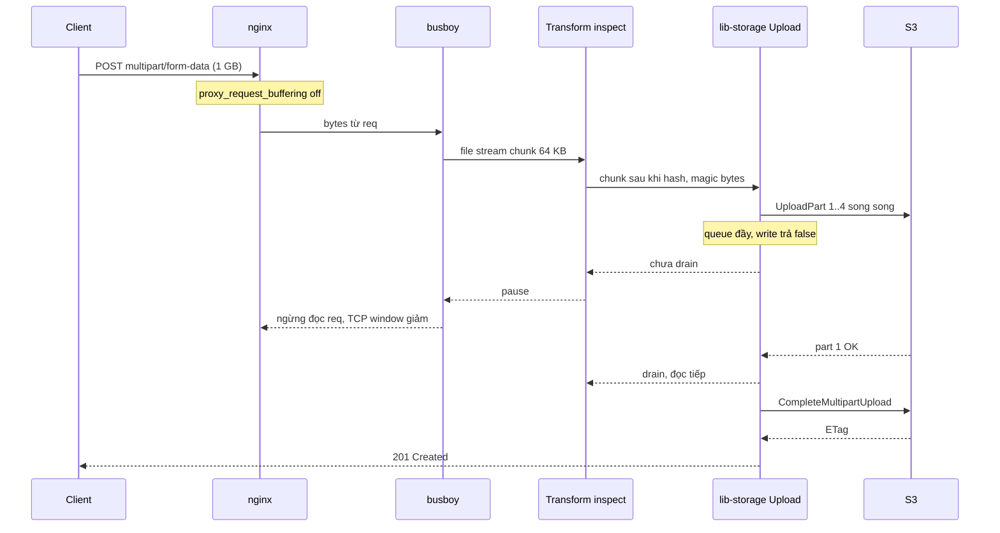
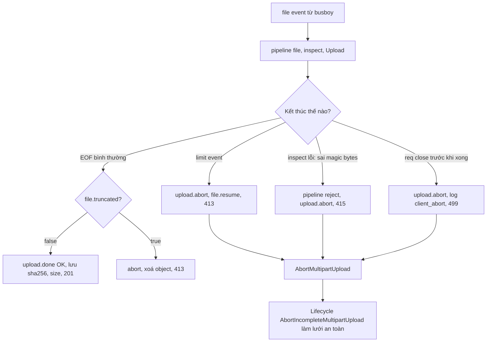
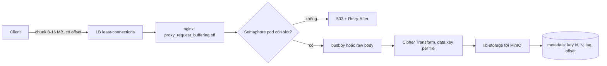

## Bối cảnh & vấn đề

Một team fintech nhận yêu cầu compliance: mọi file khách upload (sao kê, hợp đồng PDF) phải đi qua backend để chạy **DLP inline** (Data Loss Prevention: quét số thẻ, số CMND trước khi lưu). Không được dùng presigned URL thẳng lên S3 như [bài upload trực tiếp](/tracks/scenario-files/learn/upload-direct-to-storage). Dev đầu tiên viết một endpoint NestJS với `FileInterceptor` và tuyên bố "stream lên S3, mỗi request chỉ tốn ~64 KB RAM". Một tuần sau: pod 2 GB bị OOMKilled mỗi buổi chiều, `ListMultipartUploads` báo 40.000 upload dở dang, và một khách phàn nàn file 200 MB của họ được lưu thành 50 MB "hợp lệ".

Ba sự cố đó có chung gốc: **stream không tự động có nghĩa là memory hằng số**, và một pipeline stream có ba thứ phải làm đúng cùng lúc: **backpressure** (nguồn dừng khi đích chậm), **giới hạn** (dừng và báo lỗi khi vượt size), **huỷ** (client bỏ đi thì dọn mọi tài nguyên phía sau). Thiếu một trong ba là có leak hoặc dữ liệu hỏng.

Bài này giả định bạn đã biết `Buffer`, `Readable`/`Writable` cơ bản (xem [Buffer và stream](/tracks/nodejs/learn/buffers-streams)) và multipart upload của S3 (xem [Multipart, resumable upload và integrity](/tracks/scenario-files/learn/multipart-resumable-integrity)). Trọng tâm: khi bytes **bắt buộc** đi qua Node, viết pipeline ra sao, memory thật là bao nhiêu, và cái gì vỡ.

**Interview angle:** câu hỏi kiểu "stream lên S3 tốn bao nhiêu RAM" là bẫy. Interviewer muốn nghe bạn tính `partSize × queueSize` nhân số upload đồng thời, chứ không phải "stream nên chỉ 64 KB".

## Khái niệm

### Multipart form-data và busboy

Browser gửi file trong form bằng `Content-Type: multipart/form-data; boundary=...`: body là chuỗi các phần, mỗi phần có header riêng (`Content-Disposition: form-data; name="file"; filename="a.pdf"`) và ngăn bởi boundary. Đây là **multipart của HTTP**, khác hoàn toàn **multipart upload của S3** (chia object thành part); hai khái niệm trùng tên nên hay bị nhầm khi phỏng vấn.

**busboy** là parser streaming cho `multipart/form-data`: bạn `req.pipe(bb)`, nó emit `field` cho trường text và `file(name, stream, info)` cho mỗi file, trong đó `stream` là một `Readable` chỉ chứa bytes của file đó. busboy không lưu gì ra disk hay RAM ngoài buffer đang parse. Multer, `@fastify/multipart` và nhiều lib khác đều dựng trên busboy, nhưng **thêm storage engine** lên trên, và chính storage engine quyết định file có bị gom vào RAM hay không.

Ví dụ: Multer không truyền `storage` dùng **memoryStorage**, gom cả file vào `file.buffer` *trước khi* handler chạy. `diskStorage` ghi ra disk và cho `file.path`. Cả hai engine built-in **không** điền `file.stream`, nên code `Body: file.stream` gửi `undefined` (câu 013).

### Backpressure

**Backpressure** là cơ chế để producer nhanh không làm ngập consumer chậm. Mỗi stream có một buffer nội bộ giới hạn bởi `highWaterMark` (mặc định 64 KiB cho byte stream từ Node 22, trước đó 16 KiB; 16 object với object mode — verify theo version). Khi buffer của Writable đầy, `write()` trả `false`; `pipe()`/`pipeline()` thấy vậy thì **pause** Readable cho tới khi Writable emit `drain`.

Chuỗi này đi tới tận socket: Readable của `req` ngừng đọc, kernel receive buffer đầy, TCP window về 0, client bị chậm lại. Đó là lý do một upload qua Node *có thể* chỉ tốn vài trăm KB: bytes nằm ở mạng chứ không ở RAM. Nhưng chỉ khi **mọi mắt xích** đều tôn trọng tín hiệu; một mắt xích "nuốt" dữ liệu không giới hạn là backpressure gãy.

### pipeline và lan truyền lỗi

`stream.pipeline(a, b, c)` (bản Promise ở `node:stream/promises`) nối stream và **huỷ mọi stream** khi một cái lỗi hoặc bị destroy, rồi reject với lỗi đầu tiên. `a.pipe(b)` cũ thì không: lỗi ở `b` không huỷ `a`, `a` lỗi không đóng `b`, dễ để lại file descriptor, socket hoặc Promise treo. Quy tắc: trong code mới, **luôn dùng `pipeline`**, và truyền `AbortSignal` (`pipeline(a, b, { signal })`) khi cần huỷ từ ngoài.

### Transform đúng chuẩn

**Transform** là stream vừa đọc vừa ghi: `transform(chunk, enc, cb)` xử lý một chunk rồi gọi `cb(err?, out?)` **đúng một lần**. Stream coi chunk "xong" khi `cb` được gọi, nên **thời điểm gọi `cb` chính là tín hiệu backpressure**. Gọi `cb()` trước khi việc async hoàn thành thì stream đọc chunk tiếp ngay, việc async chồng chất không giới hạn (câu 036). `flush(cb)` chạy khi upstream hết dữ liệu, nơi để xuất kết quả cuối (hash, batch còn lại).

### lib-storage `Upload`

`Upload` của `@aws-sdk/lib-storage` nhận `Body` là stream, tự chia thành part, chạy `CreateMultipartUpload` → `UploadPart` song song → `CompleteMultipartUpload`. Để làm được, nó phải **gom mỗi part vào Buffer** (S3 cần biết length của part, và SDK tính checksum). Tham số: `partSize` (mặc định 5 MiB) và `queueSize` (mặc định 4 part song song). Nếu body nhỏ hơn một part, nó dùng `PutObject` thường. `upload.abort()` gọi `AbortMultipartUpload`. Memory xấp xỉ `partSize × queueSize` cộng part đang gom, tức ~20–25 MB mỗi upload với mặc định (verify).

**Interview angle:** nói được "lib-storage buffer từng part, nên stream qua Node có chi phí RAM tuyến tính theo số upload đồng thời" là phân biệt người đã chạy production với người chỉ đọc README.

## Cơ chế hoạt động

### Luồng bytes và tín hiệu backpressure



Đọc sơ đồ từ trên xuống: bytes chảy từ client tới S3 theo chiều thuận, nhưng **tín hiệu** chảy ngược. Khi 4 part đang upload và part thứ 5 đã đầy, `Upload` không nhận thêm; Transform không gọi được `cb` cho chunk tiếp (vì `push()` trả false và buffer đầy), busboy pause file stream, `req` ngừng đọc, và cuối cùng TCP làm chậm client. Tốc độ upload của client tự khớp với tốc độ tới S3.

Mắt xích hay bị quên là **nginx**: mặc định `proxy_request_buffering on`, nginx đọc *toàn bộ* body vào buffer/temp file trên disk rồi mới chuyển cho Node. Backpressure vẫn đúng ở Node, nhưng disk của nginx phải chứa đủ file và client thấy 100% trước khi Node bắt đầu. Với streaming thật, đặt `proxy_request_buffering off` và `client_max_body_size` vừa đủ.

### Ba đường kết thúc: thành công, vượt limit, client bỏ đi



Điểm tinh tế ở nhánh **limit**: khi file chạm `limits.fileSize`, busboy **không ném lỗi**. Nó emit `'limit'` trên file stream, đặt `file.truncated = true`, ngừng đẩy bytes của file đó, rồi **kết thúc stream như bình thường**. Với `Upload`, đó là EOF hợp lệ, nên nó `Complete` một object 50 MB cắt cụt (câu 032). Bạn phải tự nghe `'limit'` và abort, hoặc ít nhất kiểm `file.truncated` trước khi đánh dấu ready. Sau khi abort phía S3, gọi `file.resume()` để busboy xả nốt bytes còn lại, nếu không request treo vì không ai đọc.

Nhánh **client bỏ đi**: mobile mất sóng, user đóng tab. `req` emit `'close'` (và `'aborted'` ở API cũ) trước khi busboy kết thúc. Nếu code chỉ `file.pipe(body)`, stream nguồn dừng mãi mãi, `upload.done()` treo hoặc reject sau timeout, **không ai gọi `AbortMultipartUpload`**, các part đã upload nằm lại S3 và socket tới S3 giữ tới timeout (câu 031).

**Interview angle:** vẽ được sơ đồ ba đường kết thúc và chỉ ra "limit không phải lỗi" là đủ trả lời hai câu debug khó nhất của chủ đề này.

## Ví dụ thực tế

### Endpoint streaming đúng chuẩn (câu 014, 027, 031, 032)

```ts
import busboy from "busboy";
import { Upload } from "@aws-sdk/lib-storage";
import { Transform } from "node:stream";
import { pipeline } from "node:stream/promises";
import { createHash, randomUUID } from "node:crypto";

const MAX = 50 * 1024 * 1024;

function inspect(max: number) {
  const hash = createHash("sha256");
  let bytes = 0, head = Buffer.alloc(0), checked = false;
  const t = new Transform({
    transform(chunk: Buffer, _e, cb) {
      bytes += chunk.length;
      if (bytes > max) return cb(Object.assign(new Error("too large"), { status: 413 }));
      if (!checked) {
        head = Buffer.concat([head, chunk]).subarray(0, 5);
        if (head.length >= 5) {
          checked = true;
          if (head.toString("latin1") !== "%PDF-") return cb(Object.assign(new Error("not pdf"), { status: 415 }));
        }
      }
      hash.update(chunk);
      cb(null, chunk);                        // gọi đúng 1 lần, đồng bộ: backpressure giữ nguyên
    },
    flush(cb) {
      if (!checked) return cb(Object.assign(new Error("too short"), { status: 415 }));
      result.sha256 = hash.digest("hex"); result.bytes = bytes; cb();
    },
  });
  const result = { sha256: "", bytes: 0 };
  return { stream: t, result };
}

export function uploadHandler(req, res) {
  if (Number(req.headers["content-length"] ?? 0) > MAX + 64 * 1024) return res.status(413).end(); // reject sớm
  const bb = busboy({ headers: req.headers, limits: { files: 1, fileSize: MAX } });
  bb.on("file", async (_name, file) => {
    const key = `uploads/${randomUUID()}`;                       // không dùng originalname làm key
    const insp = inspect(MAX);
    const upload = new Upload({ client: s3, params: { Bucket, Key: key, Body: insp.stream },
                                partSize: 8 * 1024 * 1024, queueSize: 2 });
    let finished = false;
    const fail = (status: number) => { if (!finished) { finished = true; upload.abort().catch(() => {}); file.resume(); res.status(status).end(); } };
    file.on("limit", () => fail(413));
    req.once("close", () => { if (!finished) { log.warn("client_abort", { key }); fail(499); } });
    try {
      await Promise.all([pipeline(file, insp.stream), upload.done()]);
      if (finished) return;
      if ((file as any).truncated) return fail(413);               // lưới thứ hai
      finished = true;
      await db.files.insert({ key, sha256: insp.result.sha256, size: insp.result.bytes, status: "scanning" });
      res.status(201).json({ key });
    } catch (e: any) { fail(e.status ?? 500); }
  });
  req.pipe(bb);
}
```

Các điểm cần đọc kỹ. **Reject sớm** bằng `Content-Length` chỉ là tối ưu: header có thể thiếu (chunked) hoặc nói dối, nên giới hạn thật vẫn là đếm bytes. **Key** sinh bằng UUID, không ghép `originalname` (tránh path traversal và ghi đè, câu 013). Transform làm ba việc cùng lúc: đếm bytes, kiểm magic bytes `%PDF-` trên 5 byte đầu (gom vì chunk đầu có thể ngắn hơn 5 byte), hash SHA-256; nó gọi `cb` **đồng bộ**, nên không phá backpressure. `fail()` có cờ `finished` để không gửi response hai lần khi `limit` và `close` cùng xảy ra.

DLP inline thật thường là một Transform khác (hoặc gọi sang service DLP theo từng khối), nhưng phải giữ cùng quy tắc: không gọi `cb` cho tới khi khối đó được xử lý.

### Chạy thật: Transform async làm gãy backpressure (câu 036)

Đoạn sau mô phỏng import CSV: 2.000 row, mỗi lần "insert DB" mất 5 ms. Phiên bản thứ nhất gọi `cb()` ngay, phiên bản thứ hai `await` trước khi gọi `cb()`. Chạy trên Node 24.

```ts
const fakeInsert = () => new Promise((r) => setTimeout(r, 5)); // "DB" chậm: 5 ms / row
// bản sai
new Transform({ objectMode: true,
  transform(row, _e, cb) { m.start(); fakeInsert().then(m.end); cb(null, row); } });
// bản đúng
new Transform({ objectMode: true,
  async transform(row, _e, cb) { m.start(); try { await fakeInsert(); m.end(); cb(null, row); } catch (e) { cb(e); } } });
```

```text
fire-and-forget cb()   maxInFlight=2000 pipelineDone=8ms stillPending=2000
await before cb()      maxInFlight=   1 pipelineDone=11223ms stillPending=0
```

Bản sai "xong" trong 8 ms nhưng thực tế **2.000 insert vẫn đang chờ**: pipeline đã resolve, code phía sau tưởng import thành công, còn mọi Promise nằm trong RAM. Với 5 triệu row thật, đó là hàng triệu Promise và query xếp hàng chờ pool 10 connection: memory tăng tuyến tính, pool cạn, và nếu insert reject thì lỗi bị nuốt thành unhandled rejection. Bản đúng giữ `maxInFlight = 1`, nhưng chậm (2.000 × ~5,6 ms).

Bài học kép: `await` trong transform khôi phục backpressure, còn tốc độ đến từ **batch**: gom 500–1.000 row rồi một `INSERT ... VALUES (...), (...)` hoặc `COPY FROM STDIN` trong Postgres, `flush()` ghi batch cuối. Cách viết hiện đại hơn là `for await (const row of parser)` gom batch với concurrency giới hạn (ví dụ `p-limit(4)`); vòng `for await` tự có backpressure vì nó không đọc tiếp khi chưa `await` xong. Tăng pool lên 200 là red flag: chỉ dời nút thắt sang DB.

### Debug endpoint "64 KB RAM" (câu 013, 015)

Đoạn NestJS `FileInterceptor("file", { limits })` không truyền `storage` nên dùng memoryStorage: 150 MB nằm trong `file.buffer` trước khi handler chạy, `file.stream` là `undefined`. Thêm nữa, `s3.upload().promise()` là AWS SDK v2, đã hết support từ 2025-09-08 (verify). Sửa đúng là bỏ interceptor, tự parse bằng busboy như trên, hoặc tốt hơn chuyển sang presigned nếu compliance cho phép.

Sau khi sửa, pod vẫn chạm 2 GB RSS với ~100 upload: 100 × (5 MiB × 4 queue + part đang gom) ≈ 2–2,5 GB, chưa kể TLS buffer và highWaterMark mỗi tầng. Fix theo thứ tự: giảm `queueSize` xuống 1–2 khi concurrency cao; **giới hạn upload đồng thời mỗi pod** bằng semaphore đặt *trước* khi đọc body, vượt thì `503` + `Retry-After`; autoscale theo metric **bytes in-flight** hoặc số upload đang chạy, vì CPU thấp (I/O bound) và memory là chỉ số trễ (đã sắp OOM mới tăng).

## Thiết kế: 200 upload 1 GB trên pod 2 GB (câu 052)

Ràng buộc on-prem: không cho client chạm storage, mọi byte đi qua Node để **mã hoá inline**, 200 upload đồng thời 1 GB, pod 2 GB RAM.

**Ngân sách memory.** Pod 2 GB trừ ~300 MB baseline (runtime, heap, connection pool) còn ~1,5 GB. Mỗi upload: `partSize` 8 MB × `queueSize` 1 + part đang gom 8 MB + buffer cipher và stream vài trăm KB ≈ 16–17 MB. 1,5 GB / 17 MB ≈ 90 upload/pod; để dư cho GC và peak, đặt semaphore 60–80/pod. 200 upload → tối thiểu 3 pod, chạy 4–6 pod vì rolling deploy và phân bổ không đều. Mỗi tham số là một núm vặn: giảm part size thì nhiều request hơn tới storage, tăng queue thì throughput mỗi upload tốt hơn nhưng ít upload/pod hơn.



**Mã hoá.** Dùng **envelope encryption**: mỗi file một data key sinh từ KMS/Vault, lưu data key đã mã hoá cạnh metadata. Cipher là Transform `crypto.createCipheriv("aes-256-gcm", key, iv)`. Bẫy của GCM trên stream: **auth tag chỉ có ở cuối** (`cipher.getAuthTag()` sau `final()`), nên khi giải mã streaming, bytes đã được trả cho người đọc *trước khi* biết tag đúng hay sai. Với upload resumable theo chunk, một tag cho cả 1 GB nghĩa là không thể resume giữa chừng (state cipher nằm trong RAM pod đã chết). Thiết kế phổ biến: mã hoá **từng chunk độc lập** (mỗi chunk IV riêng, tag riêng, hoặc dùng định dạng chuẩn như STREAM/AEAD theo segment), không bao giờ dùng lại cặp key + IV.

**Request ngắn thay vì một request 1 GB.** Một request 1 GB trên mạng 20 Mbps mất ~7 phút: dài hơn idle timeout LB, chết khi deploy, không resume được. Chia chunk 8–16 MB, mỗi chunk là một request có `uploadId` + offset, server ghi thành một part của MPU (hoặc tus với tusd tự host). Graceful shutdown chỉ cần chờ chunk hiện tại, client tự retry chunk lỗi. LB chọn **least-connections** vì request dài làm round-robin lệch tải.

**Quan sát.** Metric: bytes in-flight/pod, số slot semaphore đang dùng, throughput/pod, 503 do admission, 499 (client abort) tách khỏi 5xx (server lỗi), số MPU in-progress theo tuổi.

**Interview angle:** câu thiết kế này chấm ở chỗ bạn **tính ra số** (MB/upload, upload/pod, số pod) và nói được bẫy GCM tag với chunked upload.

## Trade-offs & lựa chọn thay thế

| Cách | RAM mỗi upload | Disk | Backpressure | Resume | Hợp khi |
|---|---|---|---|---|---|
| Multer memoryStorage | = cả file | Không | Không (gom hết) | Không | File nhỏ (avatar < 5 MB), prototype |
| Multer diskStorage | ~64 KB | = cả file | Có tới disk | Không | Cần xử lý file local (ffmpeg, unzip) |
| busboy → lib-storage | partSize × (queue+1) | Không | Có (nếu viết đúng) | Không, trong 1 request | Bắt buộc qua backend, file vừa và lớn |
| Chunk API → MPU / tus | 1 chunk | Không | Mỗi chunk ngắn | Có | File rất lớn, mạng yếu, on-prem |
| Presigned direct-to-S3 | ~0 | Không | Không liên quan | Có (MPU) | Mặc định khi compliance cho phép |

**Mặc định** vẫn là presigned direct-to-S3, vì API không mang bytes thì không có vấn đề memory, socket hay timeout. Chỉ khi compliance bắt bytes đi qua (DLP, mã hoá inline, môi trường không cho client chạm storage) mới chọn busboy → lib-storage.

**diskStorage** có chỗ đứng khi bước tiếp theo cần file local thật (ffmpeg đọc seek được, unzip), nhưng disk của pod là ephemeral và có hạn; 100 upload 1 GB cần 100 GB disk và phải dọn temp file khi lỗi. **Chunk API / tus** là bước tiếp theo khi file đủ lớn để một request đơn gặp timeout và deploy.

Một lựa chọn tối ưu khác: nếu không cần nhìn nội dung mà chỉ cần ràng buộc, đẩy kiểm tra về **sau upload** (quarantine + scan bất đồng bộ, xem [lesson validate và quét virus](/tracks/scenario-files/learn/file-security-processing)) thay vì inline.

## Edge cases & failure modes

- **Limit chạm nhưng không lỗi**: busboy kết thúc bình thường với `truncated = true`; không nghe `'limit'` là lưu file cắt cụt ở trạng thái ready.
- **Client ngắt giữa chừng**: không nghe `req` `'close'` thì MPU dở dang tích tụ (40.000 cái sau một tuần) và socket tới S3 giữ tới timeout. Lifecycle `AbortIncompleteMultipartUpload` 1–3 ngày chỉ là lưới an toàn, không sửa socket leak.
- **Phân biệt client abort và server lỗi**: log `client_abort` với 499 khi `req` đóng trước; 5xx chỉ khi S3/Transform lỗi. Gộp chung thì alert 5xx kêu mỗi khi mobile mất sóng.
- **Chunk đầu nhỏ hơn số byte cần sniff**: chunk có thể chỉ 1–2 byte; Transform phải gom tới đủ độ dài trước khi quyết định.
- **Nhiều file trong một form**: không đặt `limits.files: 1` thì attacker gửi 1.000 file nhỏ, mỗi file tạo một `Upload`. Đặt luôn `fields`, `fieldSize`, `parts`.
- **Field nằm sau file**: busboy emit theo thứ tự trong body; nếu metadata (tenantId) gửi *sau* file thì lúc nhận file chưa có. Yêu cầu client gửi field trước, hoặc truyền metadata qua header/query.
- **Expect: 100-continue**: client lớn (curl gửi file > 1 MB) có thể chờ `100 Continue` trước khi gửi body; Node có event `checkContinue`, ở đó trả 413 dựa trên `Content-Length` trước khi một byte body đi qua mạng.
- **Slowloris upload**: client gửi 1 byte/giây giữ slot semaphore mãi. Cần timeout tối thiểu throughput (nginx `client_body_timeout`, Node `requestTimeout`) để giải phóng slot.
- **Retry của SDK giữ part cũ**: part lỗi được retry từ Buffer trong RAM, nên lúc S3 chậm memory mỗi upload còn cao hơn ước tính.
- **Pod bị kill khi deploy**: upload một request dài chết hết; cần drain (ngưng nhận mới, chờ upload đang chạy) và `terminationGracePeriodSeconds` đủ, hoặc chunked resumable.

## Pitfalls

- ❌ "Stream thì RAM hằng số 64 KB" → ✅ lib-storage gom part: ~`partSize × (queueSize + 1)` mỗi upload; nhân số upload đồng thời rồi mới so với RAM pod.
- ❌ `FileInterceptor` mặc định rồi đọc `file.stream` → ✅ Multer engine built-in không có stream; tự parse bằng busboy để stream thật.
- ❌ `a.pipe(b).pipe(c)` → ✅ `await pipeline(a, b, c)`: lỗi ở đâu cũng huỷ cả chuỗi và reject một lần.
- ❌ Gọi `cb()` trước khi `await` xong trong Transform → ✅ gọi `cb` sau khi việc async hoàn tất (hoặc dùng `for await` + batch), nếu không mất backpressure và nuốt lỗi.
- ❌ Coi `fileSize` limit là lỗi tự ném → ✅ nghe `'limit'`, `abort()`, `file.resume()`, trả 413; kiểm `truncated` trước khi đánh dấu ready.
- ❌ Chỉ dựa lifecycle rule để dọn MPU → ✅ `upload.abort()` khi `req` close, validate fail hoặc limit; lifecycle là lưới thứ hai.
- ❌ Tăng DB pool lên 200 khi import ngốn RAM → ✅ khôi phục backpressure, batch insert/`COPY`, concurrency giới hạn.
- ❌ Để nginx `proxy_request_buffering on` cho endpoint streaming → ✅ tắt buffering cho location upload và đặt `client_max_body_size` đúng limit.
- ❌ Autoscale pod upload theo CPU → ✅ theo upload đang chạy hoặc bytes in-flight; CPU thấp ngay cả khi pod sắp OOM.

## Tóm tắt

- Stream qua backend chỉ khi bắt buộc (DLP, mã hoá inline, on-prem); mặc định là presigned direct-to-S3.
- Pipeline chuẩn: busboy (`limits.files: 1`, `fileSize`) → Transform đồng bộ (đếm, magic bytes, hash) → lib-storage `Upload`, nối bằng `pipeline`.
- Backpressure đi ngược từ S3 tới TCP của client; một mắt xích gọi `cb` sớm hoặc nginx buffer body là gãy.
- Memory thật ≈ `partSize × (queueSize + 1)` mỗi upload; giới hạn bằng semaphore + 503 `Retry-After`, scale theo bytes in-flight.
- busboy chạm `fileSize` không lỗi: `'limit'` + `truncated`; phải abort và trả 413.
- Client bỏ đi: nghe `req` `'close'`, `upload.abort()`, log 499; lifecycle `AbortIncompleteMultipartUpload` là lưới an toàn.
- Transform/import async: `await` trước `cb` (lab: 2.000 Promise treo vs 1), batch hoặc `COPY` để nhanh.
- File rất lớn qua backend: chunk API resumable, envelope encryption, mã hoá từng chunk vì GCM tag chỉ có ở cuối.
