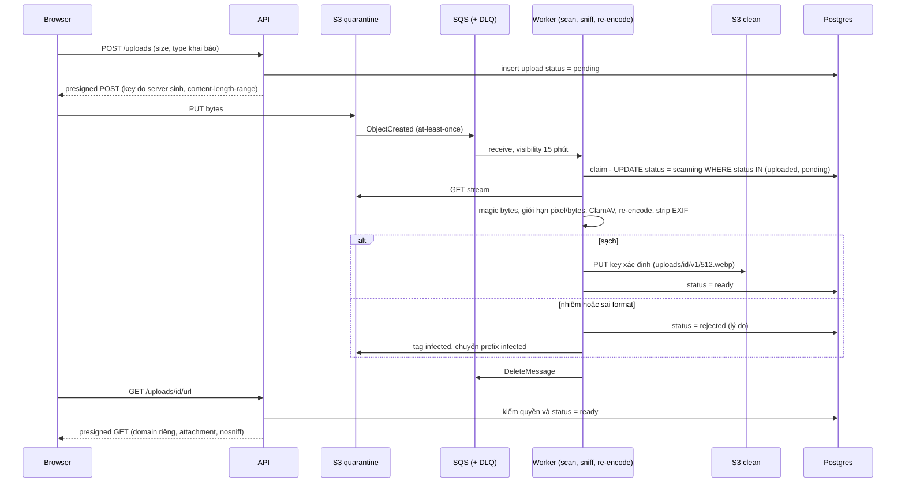
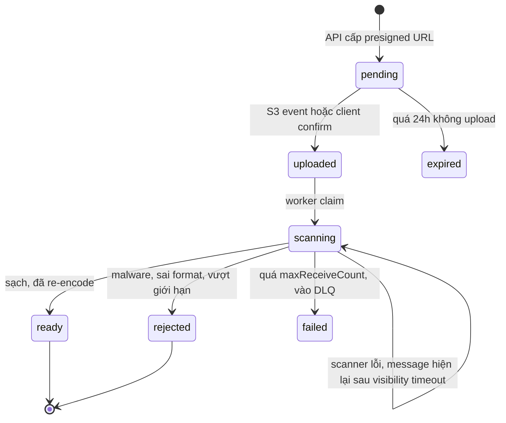
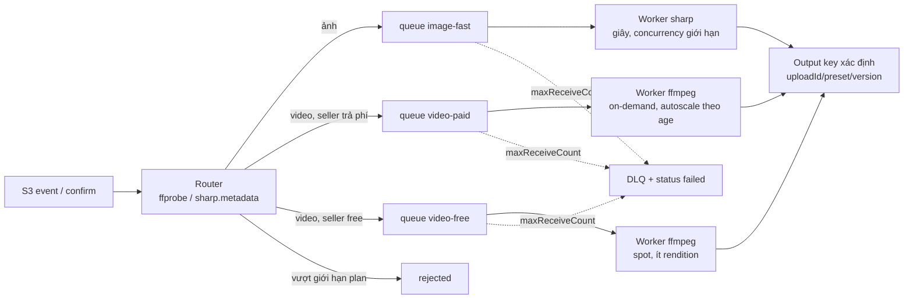

## Bối cảnh & vấn đề

Một marketplace cho seller upload ảnh sản phẩm, file ZIP catalog và video giới thiệu. Bản đầu tiên làm đúng mọi thứ về "upload": presigned URL lên S3 như [bài upload trực tiếp](/tracks/scenario-files/learn/upload-direct-to-storage), multipart cho file lớn, stream khi phải qua backend như [bài streaming](/tracks/scenario-files/learn/streaming-through-backend). Rồi các ticket bắt đầu tới: pentester upload `logo.png` thực chất là HTML và chạy script trên domain app; một avatar SVG đọc được cookie khi mở trong tab mới; một ZIP 40 KB làm đầy 20 GB disk của worker; ảnh 2 MB làm worker `sharp` OOM; khách phàn nàn ảnh của họ lộ toạ độ nhà; video bị transcode ba lần, một video khác bị transcode lặp vô hạn.

Mọi lỗi trên có chung một gốc: **bytes từ người dùng là input không tin cậy**, và nó được xử lý bởi những parser phức tạp (image decoder, unzip, ffmpeg, browser) — mỗi parser là một bề mặt tấn công. Upload "thành công" mới là nửa đầu; nửa sau là **validate, cô lập, xử lý và serve** sao cho không bytes nào tới được user khác hay server mà chưa qua kiểm tra.

Bài này đi theo đường của một file từ lúc vào hệ thống tới lúc được tải về: xác định loại thật, chặn các payload phổ biến (XSS, path traversal, bomb), quét malware với quarantine, pipeline xử lý at-least-once và idempotent, header khi serve, rồi ghép lại thành threat model. Đo thật bằng Node 24.21 với module built-in; các con số của thư viện bên ngoài (sharp, file-type, ClamAV, GuardDuty) đánh dấu (verify).

## Khái niệm

### Loại file thật: extension, Content-Type, magic bytes

**Extension** (`.png`) và **`Content-Type`** (cả header của request lẫn header của từng part trong `multipart/form-data`) đều do **client** đặt. Giả mạo không cần công cụ: đổi tên `evil.html` thành `logo.png` và `curl -F "file=@logo.png;type=image/png"`. Kiểm hai thứ này chỉ chặn được người dùng nhầm, không chặn được kẻ tấn công.

**Magic bytes** (file signature) là vài byte đầu file mà format quy định: PNG bắt đầu bằng `89 50 4E 47 0D 0A 1A 0A`, JPEG `FF D8 FF`, PDF `%PDF-`, ZIP `PK\x03\x04`. Thư viện **file-type** đọc tối đa ~4 KB đầu để đoán format (ESM-only ở các bản gần đây, verify). Đây là **allowlist theo format thật** — tốt hơn hẳn extension, nhưng vẫn chưa đủ: magic bytes chỉ nói "phần đầu trông như PNG", không nói phần còn lại vô hại. File **polyglot** hợp lệ ở hai format cùng lúc (ví dụ JPEG có HTML/JS ở comment hoặc sau marker kết thúc) qua mặt mọi kiểm tra chữ ký.

### Re-encode

**Re-encode** nghĩa là decode ảnh thành pixel rồi encode lại thành file mới (bằng `sharp`/libvips). File đầu ra chỉ chứa những gì encoder viết ra: pixel, header chuẩn, không còn chunk lạ, comment, payload giấu hay metadata. Đó là cách phá polyglot triệt để nhất, và đồng thời chuẩn hoá format (mọi avatar thành WebP 512 px). Cái giá: CPU, mất chất lượng nhẹ, và chính bước decode lại là bề mặt tấn công (pixel bomb, CVE trong decoder) — nên chạy nó ở worker cô lập, không ở API.

### SVG và XSS khi serve

**SVG** là XML, có thể chứa `<script>`, thuộc tính `onload=`, `<foreignObject>` nhúng HTML. Khi hiển thị qua ``, browser **không** chạy script. Nhưng khi user mở thẳng URL (top-level navigation, "Open image in new tab") và file được serve từ **origin của app**, script chạy với quyền của origin đó: đọc `localStorage`, gửi request kèm cookie, lấy CSRF token. Đây là **stored XSS** qua upload. HTML, XML, và file bị browser **MIME-sniff** thành HTML cũng nguy hiểm tương tự.

### Header khi serve

- **`Content-Type` do server quyết định** từ format đã verify, không echo giá trị client gửi.
- **`X-Content-Type-Options: nosniff`**: browser không tự đoán HTML/script từ nội dung.
- **`Content-Disposition: attachment; filename="invoice.pdf"; filename*=UTF-8''...`**: tải về thay vì render, cho mọi thứ không phải ảnh raster an toàn. `filename*` theo RFC 5987/6266 cho tên Unicode.
- **`Content-Security-Policy: default-src 'none'; sandbox`** nếu phải render inline: không script, origin bị coi là opaque.
- **Domain riêng** (một registrable domain khác, ví dụ `usercontent-example.net`): khác **site**, nên cookie của app không được gửi kèm, và XSS (nếu lọt) chạy ở origin không có gì để lấy. Subdomain `files.app.com` vẫn cùng site: cookie đặt ở `.app.com` vẫn được gửi, và subdomain có thể ghi cookie cho domain cha (cookie tossing).

Với S3 presigned GET, ép header bằng `ResponseContentType` / `ResponseContentDisposition` khi ký, hoặc set metadata lúc copy sang bucket clean.

**Interview angle:** card 004 đo xem bạn có nghĩ tới phía **download**, không chỉ upload. Follow-up về domain riêng vs subdomain đo hiểu biết về **site** vs **origin**.

### Path traversal và zip slip

**Path traversal** xảy ra khi tên file từ client trở thành một phần đường dẫn trên disk: `../../../etc/cron.d/x` thoát khỏi thư mục upload. Cùng lỗi trong lúc giải nén archive có tên riêng: **zip slip** — tên entry trong ZIP chứa `../`. Nguyên tắc: **không dùng tên client làm path**; sinh tên bằng `crypto.randomUUID()`, lưu tên gốc (đã sanitize) trong DB để hiển thị và đặt `Content-Disposition`.

### Decompression bomb: zip bomb và pixel bomb

**Zip bomb** là archive có tỉ lệ nén cực cao (hoặc lồng nhau, hoặc entry chồng lên nhau trong file) — vài KB giải ra hàng GB. Header `uncompressedSize` trong central directory **giả được**, nên phải đếm bytes thực sự giải ra. Cùng loại: request body `Content-Encoding: gzip`. **Pixel bomb** (decompression bomb ảnh): PNG 2 MB khai báo 50.000 × 50.000 px; decode ra RGBA cần 50.000 × 50.000 × 4 byte ≈ **10 GB**. `sharp` có `limitInputPixels` (mặc định 268.402.689 px ≈ 16383², verify) — vẫn quá lớn cho đa số nghiệp vụ.

### EXIF

**EXIF** là metadata trong JPEG/HEIC/WebP: toạ độ GPS, model máy, thời gian, đôi khi thumbnail gốc chưa crop. Ảnh chụp bằng điện thoại thường có GPS — đó là chuyện "lộ toạ độ nhà" của card 034. `sharp` mặc định **bỏ metadata** khi xuất (trừ khi gọi `withMetadata()`/`keepMetadata()`, verify), nhưng phải gọi `.rotate()` để áp **EXIF orientation** vào pixel trước, nếu không ảnh chụp dọc sẽ bị xoay ngang sau khi mất tag. Đừng tin client strip EXIF: client là của kẻ tấn công.

### Quarantine, scan và fail-closed

**Quarantine** là vùng lưu (bucket/prefix) mà **không ai ngoài worker** đọc được; mọi upload vào đó trước. **Scanner** (ClamAV chạy trong container, hoặc dịch vụ managed như GuardDuty Malware Protection for S3 — verify phạm vi và giá) quét, rồi file sạch được copy sang bucket **clean** và row chuyển `ready`. **Fail-closed** nghĩa là khi scanner lỗi/timeout, file **ở lại** quarantine — không bao giờ tự chuyển `ready`. Fail-open ("scanner chậm thì cho qua") biến hệ thống thành kênh phát tán malware đúng lúc scanner bị quá tải — điều kẻ tấn công có thể tự tạo ra.

### At-least-once event và job idempotent

**S3 event notification** (sang SQS/SNS/Lambda/EventBridge) giao **at-least-once**: có thể trùng, không đảm bảo thứ tự; field `sequencer` giúp sắp xếp event cùng key. **SQS visibility timeout**: khi worker nhận message, nó bị ẩn trong N giây; không `DeleteMessage` kịp thì message hiện lại cho worker khác. **Redrive policy** (`maxReceiveCount`) chuyển message nhận quá N lần sang **DLQ**. Kết hợp: worker phải **idempotent** — chạy hai lần cho cùng một input không tạo hai kết quả khác nhau hay side effect gấp đôi. Chi tiết tổng quát ở [bài at-least-once](/tracks/scenario-reliability/learn/at-least-once-webhooks-consumers).

## Cơ chế hoạt động

### Đường đi của một file



Ba điểm đáng chú ý. **Key do server sinh**, nên không có path traversal ở tầng S3 và không ghi đè file người khác. **API chỉ ký GET cho row `ready`** — không có đường tắt nào (preview, thumbnail tạm) đọc từ quarantine. **Worker claim bằng `UPDATE ... WHERE status IN (...)`** và ghi output ở key xác định, nên event trùng hoặc message hiện lại chỉ làm lại cùng một việc và ghi đè cùng một object.

### Vòng đời trạng thái và fail-closed



Không có mũi tên nào từ `scanning` sang `ready` ngoài nhánh "sạch". Khi scanner chết một giờ (card 035): message nằm trong queue (retention đặt dài, ví dụ 4 ngày), user thấy "đang kiểm tra", alarm bắn theo **age of oldest message**; khi scanner hồi phục, worker autoscale theo queue depth để xả backlog. Message lỗi lặp (file làm crash scanner) vào DLQ, row `failed`, chờ review thủ công. Một **reconciler** định kỳ quét row `uploaded` quá 15 phút chưa tiến triển và enqueue lại — vá trường hợp event bị mất do config/permission sai.

### Phân luồng media pipeline



Ảnh xử lý trong vài giây, video mất 2–30 phút; chung một queue thì một đợt video làm ảnh chờ hàng chục phút. Tách theo **loại việc và priority** cho phép mỗi pool autoscale theo đúng metric của nó (KEDA hoặc ECS target tracking theo queue depth/age) và đặt giới hạn chi phí khác nhau (spot cho free tier).

## Ví dụ thực tế

### Sniff magic bytes và vì sao chưa đủ (card 018)

Kiểm chữ ký bằng code tối giản (thực tế dùng `file-type`), chạy trên Node 24.21:

```ts
const sig = { png: [0x89,0x50,0x4e,0x47,0x0d,0x0a,0x1a,0x0a], jpeg: [0xff,0xd8,0xff] };
const sniff = (b: Buffer) =>
  Object.entries(sig).find(([, s]) => s.every((x, i) => b[i] === x))?.[0] ?? 'unknown';

sniff(Buffer.from('<html><script>alert(1)</script>'));          // file HTML đổi tên .png
sniff(Buffer.from([0x89,0x50,0x4e,0x47,0x0d,0x0a,0x1a,0x0a,0,0,0,13]));
sniff(Buffer.concat([pngHeader, Buffer.from('<script>alert(1)</script>')]));
```

```text
sniff html-as-png: unknown
sniff real png header: png
sniff png header + html tail: png
```

Dòng 1: HTML giả PNG bị chặn — đây là bypass của pentester trong card. Dòng 3: header PNG + payload vẫn "là PNG" — vì vậy bước cuối luôn là **re-encode**:

```ts
const img = sharp(input, { limitInputPixels: 40_000_000 });   // 40 MP, theo nghiệp vụ
const meta = await img.metadata();                             // đọc header, chưa decode pixel
if (!['png', 'jpeg', 'webp'].includes(meta.format!)) throw new Rejected('type');
const out = await img.rotate()                                 // áp EXIF orientation
  .resize(2048, 2048, { fit: 'inside', withoutEnlargement: true })
  .webp({ quality: 82 })                                       // không gọi withMetadata -> EXIF/GPS bị bỏ
  .toBuffer();
```

Follow-up "sniff trong pipeline stream mà không buffer cả file": đọc chunk đầu (đủ ~4 KB) bằng một Transform, chạy `fileTypeFromBuffer` trên đó, rồi **đẩy lại** chunk đầu vào stream đi tiếp (hoặc dùng `fileTypeStream` của file-type — verify API theo version); nếu sai format thì `destroy` cả pipeline trước khi bytes tới S3.

### Path traversal trong file service on-prem (card 020)

Code trong card ghép `info.filename` vào `path.join`. Thử các tên file với `path.join` và kiểm tra bằng `path.resolve` + prefix:

```ts
const base = '/data/uploads';
for (const name of ['avatar.png', '../../../etc/cron.d/x', '..%2F..%2Fx', '....//....//etc/passwd', '/etc/passwd']) {
  const joined = path.join(base, 't1', name);
  const resolved = path.resolve(base, 't1', name);
  console.log(name, '->', joined, 'safe =', resolved.startsWith(path.join(base, 't1') + path.sep));
}
console.log('naive replace:', '....//....//etc/passwd'.replace('../', ''));
```

```text
"avatar.png"               -> /data/uploads/t1/avatar.png      safe = true
"../../../etc/cron.d/x"    -> /etc/cron.d/x                    safe = false
"..%2F..%2Fx"              -> /data/uploads/t1/..%2F..%2Fx     safe = true
"....//....//etc/passwd"   -> /data/uploads/t1/..../..../etc/passwd safe = true
"/etc/passwd"              -> /data/uploads/t1/etc/passwd      safe = false
naive replace: ../....//etc/passwd
```

Ba bài học. `path.join` **chuẩn hoá** `..` và thoát khỏi thư mục tenant — ghi được vào `/etc/cron.d` là RCE. `path.join` và `path.resolve` khác nhau với đường dẫn tuyệt đối: join cho `/data/uploads/t1/etc/passwd`, resolve cho `/etc/passwd`; kiểm tra phải chạy trên kết quả **thực sự được dùng**. Và "xoá `../` một lần" (red flag của card) biến `....//` thành `../`. Bản sửa:

```ts
bb.on('file', async (_field, file, info) => {
  const id = crypto.randomUUID();
  const target = path.join(base, req.user.tenantId, id);         // không dùng tên client
  try {
    await pipeline(file, fs.createWriteStream(target, { flags: 'wx' }));  // wx: không ghi đè
    if (file.truncated) throw new Error('too large');             // busboy limits.fileSize
    await db.files.insert({ id, tenantId: req.user.tenantId, originalName: sanitize(info.filename) });
  } catch (e) {
    await fs.promises.rm(target, { force: true });               // không để file dở dang
    throw e;
  }
});
```

Follow-up: cùng lỗi trong tính năng giải nén ZIP gọi là **zip slip**; phòng bằng resolve + kiểm prefix cho **từng entry**, bỏ entry symlink và entry có đường dẫn tuyệt đối.

### Zip bomb và gzip body (card 033)

Đo tỉ lệ nén và cách chặn bằng `maxOutputLength` của zlib:

```ts
const raw = Buffer.alloc(1024 * 1024 * 1024);                  // 1 GiB toàn số 0
const gz = zlib.gzipSync(raw, { level: 9 });
try { zlib.gunzipSync(gz, { maxOutputLength: 50 * 1024 * 1024 }); }
catch (e) { console.log(e.code, e.message); }
```

```text
gzip 1 GiB zeros -> 1019 KiB, ratio 1029:1
gunzip with maxOutputLength 50 MiB -> ERR_BUFFER_TOO_LARGE Cannot create a Buffer larger than 52428800 bytes
```

Gzip đơn lớp đã cho 1.029:1; ZIP lồng nhau hoặc entry chồng lấp cho tỉ lệ hàng triệu lần — đó là cách 40 KB làm đầy 20 GB. Khi giải nén **stream** (không dùng sync), đếm bytes đi qua và huỷ khi vượt ngưỡng:

```ts
function capBytes(max: number) {
  let n = 0;
  return new Transform({
    transform(chunk, _e, cb) {
      n += chunk.length;
      cb(n > max ? new Error(`decompressed > ${max}`) : null, chunk);
    },
  });
}
// cho mỗi entry: kiểm path, đếm entry (<= 1000), rồi
await pipeline(entryStream, capBytes(remainingBudget), s3UploadStream(key));
```

Checklist giải nén: giới hạn **tổng bytes giải ra** (ví dụ 500 MB, đếm thật, không tin header), **số entry** (1.000), **tỉ lệ** (> 100:1 thì reject), không giải đệ quy archive lồng, bỏ symlink, stream từng entry thẳng lên S3 thay vì disk, và chạy worker với `ephemeral-storage` limit + timeout. Follow-up gzip JSON body: cùng rủi ro ở middleware giải nén — đặt giới hạn **sau giải nén** (body-parser `limit` áp lên bytes đã inflate, verify theo lib) chứ không chỉ `Content-Length`.

### Avatar SVG chạy script (card 019)

Thứ tự xử lý: (1) ngay lập tức chuyển serve uploads sang domain riêng và thêm `Content-Disposition: attachment` + `Content-Security-Policy: default-src 'none'; style-src 'unsafe-inline'; sandbox` + `nosniff` cho SVG hiện có; (2) sửa gốc: không nhận SVG làm avatar, hoặc **rasterize** sang PNG/WebP bằng sharp; nếu buộc giữ vector (logo trong editor) thì sanitize bằng DOMPurify profile SVG — kém an toàn hơn rasterize vì sanitizer có lịch sử bypass; (3) rà các type khác: HTML, XML, PDF có JavaScript. Follow-up: CSP trên cùng domain vẫn yếu hơn domain riêng vì chỉ một header sai (một route quên CSP, một CDN rewrite header) là quay về XSS trên origin có cookie; domain riêng là ranh giới **mặc định an toàn**.

### Job transcode chạy ba lần và lặp vô hạn (card 043)

Triệu chứng giải thích được bằng hai cấu hình: visibility timeout 5 phút < thời gian transcode 2–30 phút → message hiện lại, worker thứ hai và thứ ba nhận cùng job; một file hỏng làm ffmpeg crash mỗi lần, không có redrive → retry vô hạn. Sửa bằng lease trong DB + heartbeat visibility + DLQ:

```sql
-- claim: chỉ một worker thắng; lease hết hạn thì worker khác được lấy lại
UPDATE media_job
SET status = 'running', lease_until = now() + interval '10 minutes', attempts = attempts + 1
WHERE upload_id = $1 AND preset = $2 AND version = $3
  AND (status = 'queued' OR (status = 'running' AND lease_until < now()))
RETURNING attempts;
```

```text
-- worker A: UPDATE 1, attempts = 1  -> chạy
-- worker B (message hiện lại): UPDATE 0      -> bỏ qua, không DeleteMessage, để A xong
```

Worker gọi `ChangeMessageVisibility` (và gia hạn `lease_until`) mỗi 2–3 phút khi đang chạy; output ở `hls/<uploadId>/v2/720p/...` nên chạy lại ghi đè chứ không nhân bản; `ready` chỉ khi mọi rendition xong. Redrive `maxReceiveCount: 3` → DLQ → status `failed` hiển thị cho seller. Chạy `ffprobe` trước để loại file hỏng sớm. Red flag "đặt visibility 12 giờ": worker chết thì job kẹt 12 giờ không ai lấy. Với card 012 (thumbnail chạy trùng hoặc không chạy), cùng công thức: output key xác định, `UPDATE ... WHERE status IN (...)`, dùng `sequencer` để bỏ event cũ khi cùng key bị ghi đè, DLQ + alarm, reconciler cho row kẹt. Follow-up EventBridge vs S3 → SQS trực tiếp: EventBridge cho nhiều consumer, lọc theo pattern, replay archive; đổi lại thêm hop, latency và chi phí — với một consumer duy nhất, S3 → SQS là đủ.

### Thiết kế pipeline cho marketplace (card 053)

Ghép các mảnh: router đọc metadata rồi đẩy vào queue `image-fast`, `video-paid`, `video-free`; bảng `media_job(upload_id, preset, version, status, attempts, lease_until)`; worker pool riêng, autoscale theo age; poison file → DLQ sau 3 lần. Kiểm soát chi phí: giới hạn độ dài/độ phân giải theo plan, preset ít rendition cho free tier, spot instance cho video-free (job idempotent nên bị thu hồi chỉ là chạy lại), đo **cost per video-minute**. Follow-up backfill preset mới cho 10 triệu ảnh: bump `version`, đẩy job vào queue **backfill riêng** với concurrency trần thấp, chạy giờ thấp điểm, theo dõi lag của queue live; app đọc version mới nếu có, fallback version cũ.

## Trade-offs & lựa chọn thay thế

| Kỹ thuật | Chặn được | Chi phí / rủi ro | Khi nào |
|---|---|---|---|
| Kiểm extension / Content-Type | Lỗi vô tình | Giả mạo trivial | Chỉ là UX, không phải bảo mật |
| Magic bytes (file-type) | File sai format | Polyglot lọt qua | Luôn, làm bước lọc rẻ đầu tiên |
| Re-encode (sharp) | Polyglot, payload ẩn, EXIF | CPU, giảm chất lượng, decoder là bề mặt tấn công | Ảnh hiển thị cho user khác |
| Sanitize SVG | Script trong SVG | Lịch sử bypass | Chỉ khi buộc giữ vector |
| Scan đồng bộ trong request | Đơn giản | Timeout với file lớn, scanner down = upload down | File nhỏ, lưu lượng thấp |
| Quarantine + scan async | Không lộ file chưa scan | Trễ vài giây tới phút, thêm trạng thái | Mặc định |
| Domain riêng | XSS lên origin app, cookie | DNS/TLS/CDN thêm | Mọi file user-generated |
| S3 → SQS trực tiếp | Đơn giản, rẻ | Một target/prefix, ít lọc | Một consumer |
| S3 → EventBridge | Nhiều consumer, filter, replay | Thêm hop, chi phí | Nhiều pipeline độc lập |
| Visibility heartbeat + lease | Job trùng khi dài | Code phức tạp hơn | Job > vài phút |
| Orchestrator (Step Functions, MediaConvert) | Retry/timeout có sẵn | Lock-in, giá | Pipeline nhiều bước |

**Chọn thế nào.** Với ảnh hiển thị công khai: magic bytes để reject sớm, re-encode để làm sạch, serve từ domain riêng — ba lớp rẻ và bổ trợ nhau. Scan malware nên async với quarantine; scan đồng bộ chỉ hợp khi file nhỏ và chấp nhận upload phụ thuộc scanner. Business muốn uploader thấy file ngay (follow-up 035): chỉ cho **chính uploader** xem bản **đã re-encode** hoặc preview render phía client từ file local (chưa rời máy), không phát link cho người khác tới khi `ready`. Job dài vài phút: lease + heartbeat; job nhiều bước hoặc cần audit: orchestrator.

## Edge cases & failure modes

- **File lớn hơn giới hạn của scanner** (ClamAV có `MaxFileSize`/`MaxScanSize`, verify mặc định): scanner trả "OK" mà không quét hết. Phải có policy riêng: reject, hoặc đánh dấu "không quét được" và không cho chia sẻ.
- **Archive có mật khẩu**: scanner không mở được; coi là không quét được.
- **Signature DB cũ**: `freshclam` lỗi im lặng nhiều ngày; alarm theo tuổi của signature. Rescan file cũ khi có signature mới là tuỳ chọn tốn chi phí.
- **Overwrite cùng key**: hai event `ObjectCreated` cho cùng key về sai thứ tự; dùng `sequencer` hoặc `versionId` để không xử lý bản cũ sau bản mới. Tốt nhất là key bất biến (mỗi upload một key).
- **sharp concurrency**: libvips dùng thread pool; 8 job song song × ảnh 40 MP vẫn có thể vượt memory limit. Giới hạn concurrency của worker và `sharp.concurrency()`.
- **HEIC/AVIF**: thư viện build sẵn có thể không hỗ trợ decode HEIC (liên quan bản quyền, verify) — ảnh iPhone bị reject; quyết định chuyển đổi phía client hay build riêng.
- **"Upload from URL"**: tính năng tải file từ URL user đưa là **SSRF** — chặn IP nội bộ, `169.254.169.254` (metadata endpoint), resolve DNS rồi kiểm IP, không theo redirect sang IP nội bộ.
- **DLQ không ai xem**: file `failed` vĩnh viễn, seller không biết. Alarm DLQ depth > 0 và hiển thị trạng thái cho user.

## Pitfalls

- ❌ Kiểm extension/`Content-Type` → ✅ magic bytes allowlist + re-encode (đo: HTML giả PNG bị chặn, nhưng header PNG + payload vẫn "là PNG").
- ❌ Serve uploads cùng origin với `Content-Type` client gửi → ✅ domain riêng, `Content-Type` từ server, `nosniff`, `attachment`, CSP sandbox.
- ❌ Lọc chữ "script" trong SVG bằng regex → ✅ rasterize, hoặc sanitize + domain riêng.
- ❌ `path.join(base, info.filename)` hoặc `replace('../', '')` → ✅ tên UUID do server sinh, tên gốc chỉ lưu trong DB (đo: `....//` thành `../`).
- ❌ Kiểm size file ZIP rồi coi là an toàn → ✅ đếm bytes giải nén thật, giới hạn entry/ratio, không giải lồng (đo: 1 GiB → 1 MiB chỉ với gzip đơn lớp).
- ❌ Dùng `limitInputPixels` mặc định → ✅ đặt theo nghiệp vụ, đọc `metadata()` trước khi decode.
- ❌ Tin client strip EXIF → ✅ server re-encode, `rotate()` trước khi bỏ metadata.
- ❌ Scanner timeout thì đánh dấu `ready` → ✅ fail-closed, queue giữ backlog, alarm theo age.
- ❌ Coi S3 event là exactly-once → ✅ worker idempotent, output key xác định, reconciler.
- ❌ Visibility timeout 12 giờ → ✅ lease + heartbeat + `maxReceiveCount` → DLQ.

## Threat model trước khi launch

Card 054 hỏi checklist review bảo mật cho tính năng upload + chia sẻ. Bắt đầu từ **tài sản và kẻ tấn công**, không phải danh sách công cụ:

- **File của tenant khác** (IDOR): kiểm quyền mỗi lần ký URL, không đoán được key, share link là token trong DB có expiry và revoke được — presigned URL một mình không revoke được.
- **Origin của app** (XSS): domain riêng, header khi serve, re-encode.
- **Server** (RCE, SSRF): parser chạy trong container ít quyền, không network ra ngoài nếu không cần; path traversal; "upload from URL" chặn IP nội bộ.
- **Hạ tầng và chi phí** (DoS): `content-length-range` trong presigned POST, quota theo user, zip/pixel bomb, rate limit endpoint ký URL.
- **Người dùng khác** (phân phối malware qua domain của bạn): quarantine + scan fail-closed, alert khi tỉ lệ infected tăng.
- **Vận hành và pháp lý**: Block Public Access bật, audit log ai tải gì, retention và xoá theo GDPR, pentest theo OWASP File Upload Cheat Sheet.

Follow-up "mục nào không launch nếu thiếu": một câu trả lời hợp lý là **không bao giờ serve file user từ origin của app** — lỗi này biến mọi lỗ hổng khác thành chiếm tài khoản; câu trả lời khác hợp lý là quarantine fail-closed nếu sản phẩm là chia sẻ file. Điều interviewer cần nghe là lý do theo mức độ tác động, không phải đáp án cố định.

## Tóm tắt

- Extension và `Content-Type` do client đặt; **magic bytes** lọc sớm, **re-encode** mới làm sạch polyglot, payload ẩn và EXIF.
- Serve file user: `Content-Type` từ server, `nosniff`, `attachment`, CSP sandbox, **domain riêng** (khác site, không cookie).
- **Không dùng tên client làm path**; zip slip là path traversal trong archive.
- Bomb: đếm **bytes giải nén thật**, giới hạn entry/ratio, `limitInputPixels` theo nghiệp vụ, `maxOutputLength` cho zlib.
- **Quarantine + scan async + fail-closed**; API chỉ ký GET cho `ready`; scanner down = backlog có alarm, không phải fail-open.
- S3 event **at-least-once**: worker idempotent, claim bằng `UPDATE ... WHERE status`, output key xác định, reconciler.
- Job dài: **lease + heartbeat visibility**, `maxReceiveCount` → DLQ; tách queue theo loại việc và priority.
- Threat model theo tài sản: tenant khác, origin app, server, hạ tầng/chi phí, người dùng khác, pháp lý.
