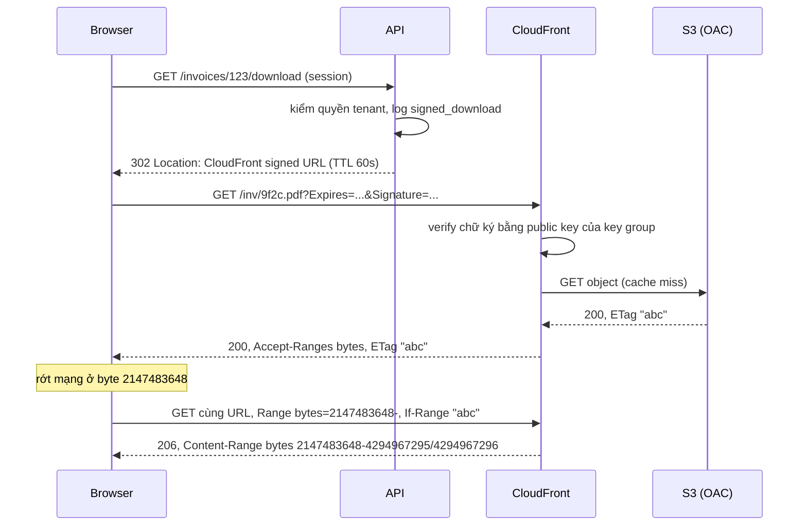
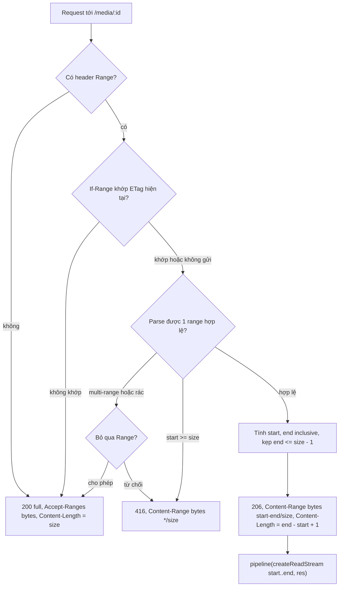
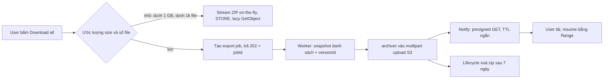

## Bối cảnh & vấn đề

Một nền tảng SaaS kế toán có ba tính năng download: khách tải **hoá đơn PDF** riêng tư, tải **"Download all as ZIP"** cho cả thư mục dự án, và kế toán **export CSV** vài triệu giao dịch. Bản đầu tiên cả ba đều đi chung một mẫu: API đọc object từ S3 (hoặc query DB), gom vào `Buffer`, rồi `res.send()`. Khi traffic còn nhỏ thì không ai thấy vấn đề. Sáu tháng sau: pod OOMKilled mỗi khi có người export file 2 GB, khách trên 4G phàn nàn file 4 GB tải lại từ đầu mỗi lần rớt sóng, ZIP thỉnh thoảng mở ra báo "corrupted", và hoá đơn S3 + CloudFront tăng gấp đôi trong khi dữ liệu chỉ tăng 20%.

Download nghe có vẻ là chiều "dễ" của bài toán file, nhưng nó có đủ các vấn đề của upload cộng thêm vài cái riêng: **ai được tải** (quyền và link bị forward), **tải tiếp từ giữa chừng** (Range request), **memory và socket** khi proxy stream, **file sinh ra lúc request** (ZIP, export) không biết trước kích thước, và **tiền** (egress, request, NAT). Nguyên tắc xuyên suốt giống [bài upload trực tiếp](/tracks/scenario-files/learn/upload-direct-to-storage): API nên **quyết định quyền**, còn **bytes** nên đi thẳng giữa client và storage/CDN.

Bài này đi theo thứ tự: phát URL có chữ ký (presigned GET, CloudFront signed URL/cookie), proxy stream đúng khi buộc phải proxy (Node streams và Web Streams), Range/206/416, ZIP on-the-fly vs async, export JSON/CSV lớn, video HLS, và cuối cùng là điều tra chi phí.

**Interview angle:** gần như mọi câu download đều có một đáp án "nâng cấp": *đừng để bytes đi qua API*. Interviewer chờ bạn nói điều đó, nhưng sau đó vẫn hỏi "nếu buộc phải proxy thì viết sao cho đúng".

## Khái niệm

### Presigned GET: URL mang quyền

**Presigned GET** là URL tới một object S3 có kèm chữ ký SigV4 trong query string (`X-Amz-Signature`, `X-Amz-Expires`...). Bất kỳ ai cầm URL trong thời hạn đều tải được, không cần credential AWS. API chỉ cần kiểm user có quyền xem hoá đơn đó, ký URL TTL ngắn (30–300 giây), rồi trả `302 Location` hoặc JSON chứa URL. Bytes đi thẳng từ S3 tới browser, API không tốn RAM hay socket.

Khi ký có thể ép header của response: `ResponseContentDisposition: attachment; filename="INV-2026-001.pdf"` để browser lưu file với tên đúng thay vì tên key UUID, và `ResponseContentType: application/pdf`. Hạn tối đa của presigned URL ký bằng IAM user là 7 ngày; ký bằng credential tạm (role, STS) thì URL hết hạn khi session hết hạn, có thể sớm hơn `expiresIn` bạn đặt (verify theo loại credential).

Ví dụ: `GET /invoices/123/download` → API kiểm `invoice.tenantId === user.tenantId` → `302` tới `https://bucket.s3.../inv/9f2c...?X-Amz-Expires=60&...`.

### URL là bearer token

Presigned URL là **bearer**: không gắn với user. Kế toán forward email chứa link cho người ngoài, link vẫn chạy cho tới khi hết hạn. Vì vậy: TTL ngắn, **ký ngay lúc user bấm** (email chỉ chứa link tới trang app, app ký khi bấm), không log full URL (chữ ký nằm trong query), và log sự kiện "signed download" ở API (user, object, thời điểm) vì S3 không biết user của bạn là ai. Cần audit sâu hơn thì bật S3 server access log hoặc CloudTrail data events.

### CloudFront signed URL và signed cookie

**CloudFront signed URL** cũng là URL có chữ ký, nhưng ký bằng private key của một **key group** đăng ký với distribution (không dùng root CloudFront key pair kiểu cũ). Ưu điểm so với presigned S3: object được **cache ở edge** (rẻ hơn và nhanh hơn khi nhiều người tải cùng file), có WAF, và bucket khoá bằng **OAC** (Origin Access Control) để chỉ CloudFront đọc được. Policy có hai dạng: **canned** (một URL, chỉ có thời hạn) và **custom** (wildcard path, khoảng IP, thời điểm bắt đầu).

**CloudFront signed cookies** đặt ba cookie (`CloudFront-Policy`, `CloudFront-Signature`, `CloudFront-Key-Pair-Id`) cho một path như `/courses/42/*`. Một lần set cookie, mọi request tới path đó đều hợp lệ. Đây là lựa chọn cho **HLS/DASH**: playlist `.m3u8` tham chiếu hàng trăm segment, không thể ký từng URL trong manifest (trừ khi rewrite manifest mỗi lần phát). Ràng buộc: cookie phải gửi được tới domain CloudFront, nên domain media thường là subdomain của site (`media.example.com`), và phải lo `SameSite`, CORS.

**Interview angle:** câu "presigned vs CloudFront signed URL vs cookie" chấm ở việc bạn nói được *vì sao cookie hợp HLS*: manifest tham chiếu nhiều segment tương đối.

### Range request

**Range request** cho phép client xin một đoạn bytes: `Range: bytes=2147483648-`. Server hỗ trợ thì quảng cáo `Accept-Ranges: bytes` và trả **`206 Partial Content`** với `Content-Range: bytes 2147483648-4294967295/4294967296` cùng `Content-Length` của **đoạn**, không phải cả file. Range là **inclusive** hai đầu: `bytes=0-99` là 100 byte. Ba dạng: `start-end`, `start-` (tới hết), và **suffix** `-500` (500 byte cuối). Range không thoả (start ≥ size) → **`416 Range Not Satisfiable`** + `Content-Range: bytes */<size>`.

Đây là cơ chế để download 4 GB **tải tiếp** sau khi rớt mạng, để video **seek** tới phút 30 mà không tải 29 phút trước, và để download manager tải song song nhiều đoạn.

### Validator: ETag và If-Range

Tải tiếp có một rủi ro: giữa hai lần tải file đã bị thay. Client ghép nửa đầu bản cũ với nửa sau bản mới thành file hỏng mà không ai biết. **`If-Range`** giải quyết: client gửi kèm `ETag` (hoặc `Last-Modified`) lần trước; nếu file vẫn như vậy, server trả 206; nếu đã đổi, server **bỏ qua Range** và trả `200` cả file. S3 và CloudFront hỗ trợ sẵn, server tự viết thì phải tự làm.

### Node streams vs Web Streams

Node có hai mô hình stream. **Node streams** (`Readable`, `Writable`) là API cũ, backpressure qua `write()` trả `false` và `drain` (xem [bài stream qua backend](/tracks/scenario-files/learn/streaming-through-backend)). **Web Streams** (`ReadableStream`) là chuẩn WHATWG, dùng trong `fetch`, `Response`, Next.js route handler, Edge runtime; backpressure kiểu **pull**: stream chỉ gọi `pull()` khi consumer cần thêm. AWS SDK v3 trên Node trả `Body` là Node `Readable` (thực chất `IncomingMessage`), nên khi trả về từ route handler phải chuyển đổi, và chuyển sai là mất backpressure hoặc buffer toàn bộ.

### NDJSON và COPY

**NDJSON** (newline-delimited JSON, `application/x-ndjson`) là mỗi dòng một JSON object. Khác với JSON array, nó stream được tự nhiên: server không cần dấu `[`, `,`, `]`, client parse từng dòng ngay khi nhận. **`COPY (SELECT ...) TO STDOUT WITH (FORMAT csv, HEADER)`** của PostgreSQL để DB tự serialize CSV và đẩy ra như một stream; `pg-copy-streams` bọc nó thành Node `Readable`. Đây là cách nhanh nhất để lấy hàng triệu row ra khỏi Postgres.

## Cơ chế hoạt động

### Luồng download riêng tư và tải tiếp



Đọc sơ đồ: API chỉ xuất hiện ở hai dòng đầu, nó **không bao giờ chạm bytes**. CloudFront kiểm chữ ký bằng public key đã đăng ký, không cần gọi về API. Khi mạng rớt, browser (hoặc download manager) gửi lại cùng URL với `Range` và `If-Range`; ETag không đổi nên CloudFront trả 206 từ byte còn thiếu. Lưu ý: nếu URL đã hết hạn TTL 60 giây thì request tải tiếp bị `403`. Với file rất lớn, hoặc TTL dài hơn (vài giờ) cho riêng download đó, hoặc client gọi lại API để lấy URL mới rồi Range tiếp; ETag không đổi theo URL nên vẫn ghép an toàn.

### Server tự xử lý Range: cây quyết định



Mấy điểm then chốt. Không có `Range` thì trả **200**, không phải 206; nhiều player gửi request đầu không có Range. Suffix `bytes=-500` nghĩa là `start = size - 500`, `end = size - 1` (nếu size < 500 thì lấy cả file). `end` vượt size thì **kẹp** về `size - 1` chứ không lỗi. Multi-range (`0-1,5-9`) cần response `multipart/byteranges`; hầu hết server tự viết nên bỏ qua Range và trả 200 (RFC cho phép), hoặc trả 416. Safari đặc biệt khắt khe: nó gửi `bytes=0-1` để thăm dò, nếu server trả sai `Content-Range` hay `Content-Length` thì video không phát.

### Proxy stream: bytes và tín hiệu huỷ

Khi buộc phải proxy (ví dụ cần mã hoá/giải mã, watermark, hoặc storage không public được), luồng đúng là `S3 Body → pipeline → res`. Hai chiều tín hiệu phải hoạt động: **backpressure** (client chậm thì ngừng đọc từ S3, nên RAM giữ ở mức vài trăm KB) và **huỷ** (client đóng tab thì `res` đóng, `pipeline` destroy `Body`, socket tới S3 trả về pool). `.pipe()` có backpressure nhưng **không destroy source** khi đích đóng: socket S3 treo tới timeout, pool SDK (`maxSockets`, mặc định 50 trên Node, verify) cạn, request tiếp theo xếp hàng chờ socket và trông như "S3 chậm".

**Interview angle:** "aborted downloads keep S3 connections busy" luôn trỏ về `.pipe()` thiếu destroy hoặc Web Stream tự bọc không xử lý `cancel`.

## Ví dụ thực tế

### Proxy download đúng chuẩn trong Express (câu 022)

Bản lỗi gọi `obj.Body.transformToByteArray()`, tức đọc cả 2 GB vào RAM, rồi `Buffer.from` có thể copy thêm lần nữa; với file vượt giới hạn Buffer tối đa của version Node thì còn throw. Bản sửa stream, forward Range, và để `pipeline` dọn dẹp:

```ts
import { GetObjectCommand, NoSuchKey } from "@aws-sdk/client-s3";
import { pipeline } from "node:stream/promises";
import type { Readable } from "node:stream";

app.get("/exports/:id/download", async (req, res) => {
  const exp = await db.exports.findForUser(req.params.id, req.user.id);   // quyền trước
  if (!exp) return res.sendStatus(404);
  const ac = new AbortController();
  req.once("close", () => ac.abort());                                   // client bỏ đi
  try {
    const obj = await s3.send(new GetObjectCommand({
      Bucket, Key: exp.key,
      Range: req.headers.range,                                          // forward Range
      IfMatch: req.headers["if-range"]?.startsWith('"') ? req.headers["if-range"] : undefined,
    }), { abortSignal: ac.signal });
    res.status(obj.ContentRange ? 206 : 200);
    res.set({
      "Content-Type": "application/zip",
      "Content-Length": String(obj.ContentLength),
      "Accept-Ranges": "bytes",
      ETag: obj.ETag!,
      "Content-Disposition": `attachment; filename="export-${exp.id}.zip"`,
      ...(obj.ContentRange && { "Content-Range": obj.ContentRange }),
    });
    await pipeline(obj.Body as Readable, res);
  } catch (e: any) {
    if (ac.signal.aborted) return log.info("client_abort", { id: exp.id });
    if (e.name === "InvalidRange") return res.status(416).end();
    if (e.name === "PreconditionFailed") return res.redirect(307, req.originalUrl.split("?")[0]);
    if (!res.headersSent) return res.sendStatus(e instanceof NoSuchKey ? 404 : 502);
    log.error("download_failed_mid_stream", { id: exp.id, err: e.message });
    res.destroy(e);                                                     // client thấy lỗi mạng
  }
});
```

Đáng chú ý nhất là nhánh cuối: lỗi xảy ra **sau khi đã gửi header 200** thì không đổi status được nữa. `res.destroy(err)` cắt kết nối, nên browser báo "download failed" thay vì lưu một file cụt trông như hợp lệ. Vì có `Content-Length`, client cũng tự phát hiện thiếu bytes. Xử lý `If-Range` ở đây dùng `IfMatch` là một xấp xỉ (412 thì cho client tải lại từ đầu); cách sạch hơn là so ETag với `HeadObject` trước. Nhưng thay vì cả đoạn trên, phương án nên đề xuất đầu tiên vẫn là **redirect 302 tới presigned GET hoặc CloudFront**: S3 hỗ trợ Range, If-Range, ETag sẵn.

### Next.js route handler: Web Streams (câu 037)

```ts
import { Readable } from "node:stream";
export const runtime = "nodejs";                     // Edge không có Node stream + SDK đầy đủ

export async function GET(req: Request) {
  const obj = await s3.send(new GetObjectCommand({ Bucket, Key }), { abortSignal: req.signal });
  const body = Readable.toWeb(obj.Body as Readable) as ReadableStream;   // hoặc obj.Body.transformToWebStream()
  return new Response(body, { headers: {
    "Content-Type": obj.ContentType ?? "application/octet-stream",
    "Content-Length": String(obj.ContentLength),
  } });
}
```

Hai cách sai phổ biến. Thứ nhất `new Response(await obj.Body.transformToByteArray())`: buffer cả file, memory tăng theo số download đồng thời. Thứ hai, tự bọc:

```ts
new ReadableStream({ start(c) { body.on("data", (d) => c.enqueue(d)); body.on("end", () => c.close()); } });
```

Cách này **bỏ qua backpressure**: `enqueue` không bao giờ từ chối, nên Node stream xả hết tốc độ mạng S3 vào hàng đợi của `ReadableStream` dù client đọc chậm; và không có `cancel()`, nên client huỷ thì Node stream vẫn chạy. `Readable.toWeb` thì nối đúng: chỉ đọc khi Web stream `pull`, và `cancel()` destroy Node stream. `req.signal` truyền vào SDK giúp huỷ ngay cả khi đang chờ header từ S3. Chiều ngược lại là `Readable.fromWeb(webStream)`; `pipeline` ở các bản Node mới nhận được cả Web stream (verify).

### Range handler tự viết và lỗi off-by-one (câu 046)

Handler trong câu hỏi đặt `end = size` (phải là `size - 1`), `Content-Length = end - start` (phải `+ 1`), luôn trả 206 kể cả khi không có Range, `Number("abc")` ra `NaN` và `createReadStream` throw, `.pipe` không bắt `ENOENT` nên crash. Bản sửa:

```ts
function parseRange(h: string | undefined, size: number): { start: number; end: number } | "none" | "bad" {
  if (!h) return "none";
  const m = /^bytes=(\d*)-(\d*)$/.exec(h.trim());        // một range duy nhất
  if (!m || (m[1] === "" && m[2] === "")) return "bad";
  let start: number, end: number;
  if (m[1] === "") { const n = Number(m[2]); start = Math.max(0, size - n); end = size - 1; } // suffix
  else { start = Number(m[1]); end = m[2] === "" ? size - 1 : Math.min(Number(m[2]), size - 1); }
  if (start >= size || start > end) return "bad";
  return { start, end };
}

app.get("/media/:id", async (req, res) => {
  const file = pathFor(req.params.id);
  let st; try { st = await fs.promises.stat(file); } catch { return res.sendStatus(404); }
  const etag = `"${st.size}-${st.mtimeMs}"`;
  const ifRange = req.headers["if-range"];
  const r = ifRange && ifRange !== etag ? "none" : parseRange(req.headers.range, st.size);
  const base = { "Accept-Ranges": "bytes", ETag: etag, "Content-Type": "video/mp4" };
  if (r === "bad") return res.status(416).set({ ...base, "Content-Range": `bytes */${st.size}` }).end();
  const { start, end } = r === "none" ? { start: 0, end: st.size - 1 } : r;
  res.status(r === "none" ? 200 : 206).set({ ...base, "Content-Length": String(end - start + 1),
    ...(r !== "none" && { "Content-Range": `bytes ${start}-${end}/${st.size}` }) });
  try { await pipeline(fs.createReadStream(file, { start, end }), res); }   // end inclusive
  catch (e) { if (!res.writableEnded) res.destroy(e as Error); }
});
```

Kết quả với file 1.000 byte (output minh hoạ, suy ra từ logic trên, không phải log chạy thật):

```text
$ curl -sI localhost:3000/media/1 -H "Range: bytes=0-1"
HTTP/1.1 206 Partial Content
Accept-Ranges: bytes
Content-Range: bytes 0-1/1000
Content-Length: 2

$ curl -sI localhost:3000/media/1 -H "Range: bytes=-300"
HTTP/1.1 206 Partial Content
Content-Range: bytes 700-999/1000
Content-Length: 300

$ curl -sI localhost:3000/media/1 -H "Range: bytes=5000-"
HTTP/1.1 416 Range Not Satisfiable
Content-Range: bytes */1000
```

Câu hỏi ngược lại interviewer nên được nghe: vì sao không dùng `res.sendFile` (Express, có sẵn Range/ETag), nginx `X-Accel-Redirect`, hoặc CloudFront? Tự viết Range handler là nơi bug sinh sôi.

### Export JSON 1 triệu order: NDJSON (câu 025)

Code lỗi gọi `res.write("[")`, gắn `on("data")`, rồi `res.end("]")` **đồng bộ** ngay sau đó, trước khi event `data` nào tới, nên mọi `write` sau là `write after end`. Thêm nữa không có dấu phẩy giữa object, không kiểm `write()` trả `false`, không xử lý lỗi DB. Sửa:

```ts
import { Transform } from "node:stream";
const toNdjson = () => new Transform({ writableObjectMode: true,
  transform(row, _e, cb) { cb(null, JSON.stringify(row) + "\n"); } });

app.get("/orders/export", async (req, res) => {
  res.type("application/x-ndjson");
  try { await pipeline(db.streamOrders(), toNdjson(), res); }
  catch (e) { if (!res.headersSent) res.sendStatus(500); else res.destroy(e as Error); }
});
```

Nếu client bắt buộc JSON array, Transform tự ghi `[` ở chunk đầu, `,` trước các chunk sau, và `]` trong `flush`. Client đọc NDJSON tăng dần bằng `fetch`: `res.body.pipeThrough(new TextDecoderStream())`, cắt theo `\n`, giữ phần dòng chưa trọn cho lần đọc sau.

### Export CSV 5 triệu row: stream hay job (câu 055)

```ts
import { to as copyTo } from "pg-copy-streams";
import { createGzip } from "node:zlib";

app.get("/transactions/export.csv.gz", async (req, res) => {
  const client = await replicaPool.connect();
  try {
    await client.query("SET statement_timeout = '10min'");
    const src = client.query(copyTo(
      `COPY (SELECT id, booked_at, amount, currency FROM transactions
             WHERE tenant_id = ${client.escapeLiteral(req.user.tenantId)}) TO STDOUT WITH (FORMAT csv, HEADER)`));
    res.set({ "Content-Type": "text/csv", "Content-Encoding": "gzip",
              "Content-Disposition": 'attachment; filename="transactions.csv"' });
    await pipeline(src, createGzip(), res);
  } finally { client.release(); }
});
```

Memory ổn định vì backpressure đi từ `res` ngược tới socket Postgres. Nhưng nhược điểm nằm ở **thời gian**: client tải chậm thì connection và transaction giữ suốt; snapshot giữ lâu cản VACUUM; không resume được; LB idle timeout cắt ngang. Khi kích thước lớn hoặc không đoán được, chuyển sang **background job**: worker chạy cùng `COPY` (hoặc keyset pagination `WHERE id > $last ORDER BY id LIMIT 10000`), gzip, upload multipart lên S3, rồi gửi presigned link qua notification. Job retry được, file tải được bằng Range, connection DB chỉ giữ theo tốc độ của worker chứ không theo tốc độ mạng của client. Ngưỡng thực tế: dưới ~50 MB và nhanh thì stream; lớn hơn thì job. Luôn chạy trên **read replica**, giới hạn export đồng thời mỗi tenant.

## ZIP: on-the-fly hay async (câu 030, 048)

ZIP là định dạng **stream được khi ghi**: mỗi entry có local header, dữ liệu, rồi data descriptor (CRC, size) ghi *sau* dữ liệu; **central directory** nằm ở cuối file. Vì thế `archiver` có thể đẩy ZIP ra `res` trong lúc đọc từng object, nhưng không biết trước tổng kích thước, nên không có `Content-Length` và **không Range được**.

Code trong câu 030 mở 8.000 `GetObject` gần như cùng lúc trong vòng `for` (vì `append` chỉ xếp hàng, archiver đọc tuần tự). Kết quả: 8.000 stream mở, pool SDK cạn, S3 đóng những body không được đọc sau một thời gian, entry hỏng; memory giữ buffer của từng body. Không nghe `archive.on("error")`, nên lỗi giữa chừng tạo ZIP cụt mà client không biết. Sửa: mở object **lười**, chỉ `GetObject` khi entry trước xong:

```ts
const archive = archiver("zip", { zlib: { level: 0 } });   // ảnh/mp4 đã nén: STORE tiết kiệm CPU
req.once("close", () => { if (!res.writableEnded) archive.abort(); });
archive.on("warning", (w) => log.warn("zip_warning", w));
const done = pipeline(archive, res);
for (const key of keys) {
  const obj = await s3.send(new GetObjectCommand({ Bucket, Key: key }));
  const name = safeName(key);                              // bỏ "../", tên trùng thêm hậu tố
  await new Promise<void>((ok, fail) => {
    archive.once("entry", () => ok()); archive.once("error", fail);
    archive.append(obj.Body as Readable, { name });
  });
}
await archive.finalize();
await done;                                                 // lỗi thì catch: res.destroy(err)
```

Tổng trên 4 GB hoặc trên 65.535 entry cần **ZIP64**; một số công cụ unzip cũ không đọc được (archiver có tuỳ chọn `forceZip64`, verify).

Với folder 50 GB / 100k file, on-the-fly giữ một connection hàng giờ: LB timeout, deploy cắt ngang, không resume, một object lỗi làm hỏng cả file. **Async export** thì worker stream từng object vào multipart upload một file ZIP lên S3, gửi presigned link; resume bằng Range, retry job, cache lại cho lần sau, lifecycle xoá sau 7 ngày. Chiến lược lai phổ biến: dưới ~1 GB / 1.000 file thì stream trực tiếp, lớn hơn thì async, hoặc chia thành nhiều ZIP ≤ 4 GB. Edge case: file bị xoá trong lúc export (snapshot danh sách kèm `versionId`), quyền đổi giữa chừng, tên trùng/unicode, và egress 50 GB nhân số lần tải lại.



## Video: MP4 progressive vs HLS (câu 044)

Phát MP4 trực tiếp với Range chạy được, nhưng là **một bitrate cố định**: file 1080p 5 Mbps trên mạng 2 Mbps thì buffer mãi. Seek cần `moov` atom ở đầu file (encode với `-movflags +faststart`), nếu không player phải Range xuống cuối file trước. **HLS/DASH** là adaptive bitrate (ABR): transcode ra nhiều rendition (240p tới 1080p), cắt segment 2–6 giây, kèm manifest (`.m3u8`/`.mpd`). Player đo bandwidth và chuyển rendition giữa chừng.

Thay đổi kéo theo: storage tăng khoảng 1,5–2× bản gốc vì nhiều rendition; số object và số GET request tăng mạnh (nhiều segment nhỏ); CMAF (fMP4) cho phép dùng chung segment cho cả HLS và DASH. Delivery qua CloudFront cache rất tốt vì segment **immutable** (TTL dài), manifest TTL ngắn nếu live. Bảo vệ bằng **signed cookies** cho path khoá học, cần chống tải thì thêm DRM. Pipeline transcode (MediaConvert hoặc worker ffmpeg) chạy bất đồng bộ với trạng thái `transcoding → ready`, giống [pipeline xử lý file](/tracks/scenario-files/learn/file-security-processing).

## Chi phí: điều tra bill S3 + CloudFront (câu 050)

Bill tăng gấp đôi khi dữ liệu chỉ tăng 20% nghĩa là thủ phạm **không phải storage**. Bước đầu: phân rã theo **usage type** trong Cost Explorer hoặc CUR (Cost and Usage Report): storage theo class, request (PUT/COPY/POST/LIST đắt hơn GET khoảng 10 lần), data transfer out (Internet, cross-region, **NAT Gateway**), CloudFront request và egress, KMS request.

Thủ phạm hay gặp: download proxy chạy trên EC2/EKS ở private subnet đọc S3 qua **NAT Gateway** (phí xử lý mỗi GB, trong khi VPC gateway endpoint cho S3 miễn phí); presigned S3 GET bỏ qua CDN nên mọi lần tải đều là egress từ S3; CloudFront cache hit ratio thấp vì query string hoặc cookie lọt vào cache key; multipart part size quá nhỏ làm số PUT tăng; job LIST định kỳ; noncurrent versions và incomplete MPU không ai dọn; SSE-KMS gọi KMS mỗi object (bật **S3 Bucket Key**). Về storage class: lifecycle sang Standard-IA sau 30 ngày có tối thiểu 30 ngày lưu và 128 KB tính phí mỗi object; Intelligent-Tiering không auto-tier object dưới 128 KB; Glacier có phí retrieval (verify giá theo region). Guardrail: budget alarm, tag cost theo tenant/feature, Storage Lens, review hàng tháng.

## Trade-offs & lựa chọn thay thế

| Cách phát file | API chạm bytes | Cache edge | Range/resume | Thu hồi | Hợp khi |
|---|---|---|---|---|---|
| API đọc S3 rồi `res.send(buffer)` | Có, cả file trong RAM | Không | Không | Tức thì | Không bao giờ với file lớn |
| Proxy stream `pipeline` | Có, vài trăm KB | Không | Nếu forward Range | Tức thì | Cần biến đổi bytes (giải mã, watermark) |
| Presigned S3 GET | Không | Không | Có | Chờ hết TTL | File riêng lẻ, ít traffic |
| CloudFront signed URL | Không | Có | Có | Chờ hết TTL | File riêng tư traffic cao, cần WAF |
| CloudFront signed cookie | Không | Có | Có | Chờ hết hạn cookie | HLS/DASH, nhiều file trong một path |

| File sinh động | Bắt đầu tải | Resume | Giữ connection | Storage tạm | Hợp khi |
|---|---|---|---|---|---|
| Stream on-the-fly (ZIP, CSV) | Ngay | Không | Theo tốc độ client | Không | Nhỏ, nhanh, hiếm lỗi |
| Async job + presigned link | Sau vài giây tới vài phút | Có | Chỉ worker | Có, lifecycle | Lớn, không đoán được, cần retry |

Mặc định cho file tĩnh riêng tư là **CloudFront signed URL** (hoặc presigned GET khi traffic nhỏ và đơn giản hơn). Proxy stream chỉ khi phải biến đổi bytes hoặc storage không thể lộ ra. Với file sinh động, quyết định dựa trên **kích thước dự đoán**: nhỏ thì stream cho trải nghiệm tức thì, lớn thì job vì một connection dài hàng chục phút là điểm hỏng đơn lẻ.

## Edge cases & failure modes

- **Lỗi sau khi đã gửi 200**: không đổi được status. `res.destroy(err)` để client thấy lỗi mạng; nếu có `Content-Length` client tự phát hiện thiếu. Với NDJSON có thể ghi dòng trailer `{"error":...}`.
- **Presigned URL hết hạn giữa chừng**: download đang chạy vẫn tiếp tục (chữ ký kiểm lúc bắt đầu request), nhưng request Range tải tiếp sau khi hết hạn bị 403; client cần xin URL mới.
- **File đổi giữa hai lần Range**: thiếu `If-Range`/ETag là ghép hai phiên bản thành file hỏng.
- **Range rác**: `bytes=abc`, `bytes=-`, multi-range, start ≥ size. Parse chặt, trả 416 hoặc bỏ qua Range trả 200; không bao giờ đưa `NaN` vào `createReadStream`.
- **Client huỷ download**: `.pipe` hoặc Web stream tự bọc không destroy nguồn, socket S3 treo, pool cạn, mọi download khác chậm theo.
- **Compression làm hỏng Range**: middleware gzip nén response 206 thì `Content-Range` (tính trên bytes gốc) không còn khớp. Tắt compression cho route media/Range.
- **ZIP64 và unzip cũ**: archive trên 4 GB hoặc trên 65.535 entry có thể không mở được trên công cụ cũ; chia nhiều file.
- **Export giữ transaction lâu**: `COPY` stream tới client chậm giữ snapshot hàng chục phút, cản VACUUM trên primary; chạy trên replica và đặt `statement_timeout`.
- **CSV injection**: giá trị bắt đầu bằng `=`, `+`, `-`, `@` bị Excel hiểu là công thức; escape bằng tiền tố `'` khi export cho người dùng mở bằng Excel.
- **Tên file trong Content-Disposition**: ký tự unicode cần `filename*=UTF-8''...`; tên có dấu ngoặc kép hoặc CRLF phải sanitize để không chèn header.

## Pitfalls

- ❌ `transformToByteArray()` rồi `res.send` → ✅ `pipeline(Body, res)`, hoặc tốt hơn redirect presigned/CloudFront.
- ❌ `Body.pipe(res)` → ✅ `pipeline`: client huỷ thì destroy S3 body và trả socket về pool.
- ❌ Tự bọc `new ReadableStream({ start })` với `on("data")` → ✅ `Readable.toWeb(body)` hoặc `transformToWebStream()` để giữ backpressure và `cancel`.
- ❌ `end = size`, `Content-Length = end - start` → ✅ Range inclusive: `end = size - 1`, length `end - start + 1`.
- ❌ Luôn trả 206 → ✅ không có Range thì 200 + `Accept-Ranges: bytes`; range không thoả thì 416 + `bytes */size`.
- ❌ `res.end("]")` ngay sau khi gắn `on("data")` → ✅ NDJSON qua `pipeline`, hoặc Transform chèn `[ , ]` trong `transform`/`flush`.
- ❌ Mở hết `GetObject` trước khi append vào archiver → ✅ mở lười từng object, giới hạn song song, nghe `error`/`warning`, abort khi client đóng.
- ❌ Ký presigned URL TTL 7 ngày nhúng vào email → ✅ email trỏ về app, app kiểm quyền rồi ký URL 60 giây.
- ❌ Ký từng segment HLS bằng signed URL → ✅ signed cookie cho cả path khoá học.
- ❌ Tăng RAM pod khi download OOM, hoặc đọc S3 qua NAT Gateway → ✅ sửa stream, dùng VPC gateway endpoint, đưa traffic qua CloudFront.

## Tóm tắt

- API kiểm quyền và ký URL; bytes đi thẳng S3/CloudFront. Presigned URL là bearer: TTL ngắn, ký lúc bấm, log ở API.
- Presigned GET cho file lẻ; CloudFront signed URL khi cần cache edge/WAF; signed cookie cho HLS/DASH và nhiều file trong một path.
- Range: `Accept-Ranges`, 206 + `Content-Range` inclusive, 416 + `bytes */size`, 200 khi không có Range; `If-Range` + ETag chống ghép hai phiên bản.
- Proxy buộc phải có: `pipeline` (không `.pipe`), forward Range, `res.destroy(err)` khi lỗi sau header; Web Streams dùng `Readable.toWeb`.
- Export lớn: NDJSON hoặc `COPY ... TO STDOUT` qua `pipeline`; lớn hoặc không đoán được thì background job + S3 + presigned link, chạy trên replica.
- ZIP: on-the-fly không có Content-Length/Range; mở object lười, STORE cho file đã nén; folder lớn thì async job, cẩn thận ZIP64.
- Video: MP4 progressive một bitrate; HLS/DASH ABR với segment immutable cache tốt, bảo vệ bằng signed cookie.
- Bill tăng mà storage không tăng: phân rã theo usage type, soi NAT Gateway, cache hit ratio, số request, KMS, incomplete MPU.
